# AI创作页面增强

<cite>
**本文档引用的文件**
- [README.md](file://README.md)
- [package.json](file://package.json)
- [src/index.ts](file://src/index.ts)
- [src/models/types.ts](file://src/models/types.ts)
- [src/services/ai-publish-service.ts](file://src/services/ai-publish-service.ts)
- [src/services/ai/content-generator.ts](file://src/services/ai/content-generator.ts)
- [src/services/ai/copywriting-generator.ts](file://src/services/ai/copywriting-generator.ts)
- [src/services/ai/requirement-analyzer.ts](file://src/services/ai/requirement-analyzer.ts)
- [web/client/package.json](file://web/client/package.json)
- [web/client/src/pages/AICreator.tsx](file://web/client/src/pages/AICreator.tsx)
- [web/client/src/hooks/useCreationWorkflow.ts](file://web/client/src/hooks/useCreationWorkflow.ts)
- [web/client/src/components/ai-creator/DraftManager.tsx](file://web/client/src/components/ai-creator/DraftManager.tsx)
- [web/client/src/components/ai-creator/HistoryDrawer.tsx](file://web/client/src/components/ai-creator/HistoryDrawer.tsx)
- [web/client/src/components/ai-creator/WorkflowSteps.tsx](file://web/client/src/components/ai-creator/WorkflowSteps.tsx)
- [web/client/src/components/ai-creator/QualityCheckResult.tsx](file://web/client/src/components/ai-creator/QualityCheckResult.tsx)
- [web/client/src/components/ai-creator/TemplateSelector.tsx](file://web/client/src/components/ai-creator/TemplateSelector.tsx)
- [web/client/src/components/Layout.tsx](file://web/client/src/components/Layout.tsx)
- [web/client/src/api/client.ts](file://web/client/src/api/client.ts)
- [web/server/src/routes/ai.ts](file://web/server/src/routes/ai.ts)
- [web/server/src/services/creation-task-service.ts](file://web/server/src/services/creation-task-service.ts)
- [web/server/src/database/index.ts](file://web/server/src/database/index.ts)
- [web/server/src/index.ts](file://web/server/src/index.ts)
</cite>

## 更新摘要
**变更内容**
- 新增参考图像上传功能：AI创作页面新增参考图像上传功能，TemplateSelector组件增强了参考图像处理能力
- 参考图像处理增强：包括上传界面、拖拽功能、实时预览和文件验证
- 模板管理扩展：支持模板关联参考图像，提升内容创作的个性化和一致性
- 服务器端支持：新增参考图像上传API和数据库存储支持

## 目录
1. [项目概述](#项目概述)
2. [项目结构](#项目结构)
3. [核心组件](#核心组件)
4. [架构概览](#架构概览)
5. [详细组件分析](#详细组件分析)
6. [依赖关系分析](#依赖关系分析)
7. [性能考虑](#性能考虑)
8. [合规性要求](#合规性要求)
9. [故障排除指南](#故障排除指南)
10. [结论](#结论)

## 项目概述

ClawOperations是一个专门针对抖音（TikTok）小龙虾营销账户的自动化运营系统。该项目提供了全面的工具和工作流程，用于简化内容创作、调度、分析跟踪和观众互动，为小龙虾品牌的抖音存在提供技术基础设施。

该项目的核心特性包括：
- **官方API集成**：与抖音企业API的安全连接
- **内容发布**：自动化的视频上传和调度功能
- **分析仪表板**：实时指标跟踪（参与度、观看次数、粉丝增长）
- **评论管理**：自动回复系统和互动工具
- **AI创作增强**：完整的AI驱动内容创作工作流
- **模板管理**：支持参考图像的创作模板系统
- **合规性保障**：符合中国互联网监管要求的网站备案信息

## 项目结构

项目采用前后端分离的架构设计，主要分为以下几个核心部分：

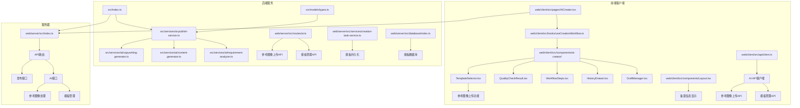

**图表来源**
- [src/index.ts:1-270](file://src/index.ts#L1-L270)
- [web/server/src/index.ts:1-72](file://web/server/src/index.ts#L1-L72)
- [web/server/src/routes/ai.ts:681-711](file://web/server/src/routes/ai.ts#L681-L711)

**章节来源**
- [README.md:92-105](file://README.md#L92-L105)
- [package.json:1-39](file://package.json#L1-L39)

## 核心组件

### AI发布编排服务

AI发布编排服务是整个AI创作系统的核心，负责协调需求分析、内容生成、文案生成和发布流程。该服务提供了完整的一站式创作体验。

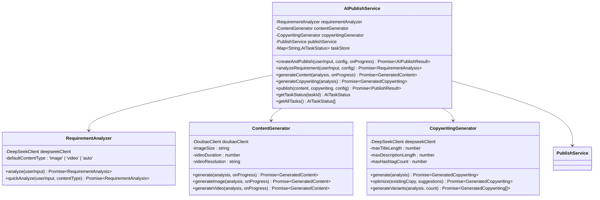

**图表来源**
- [src/services/ai-publish-service.ts:43-358](file://src/services/ai-publish-service.ts#L43-L358)
- [src/services/ai/requirement-analyzer.ts:25-128](file://src/services/ai/requirement-analyzer.ts#L25-L128)
- [src/services/ai/content-generator.ts:38-229](file://src/services/ai/content-generator.ts#L38-L229)
- [src/services/ai/copywriting-generator.ts:30-194](file://src/services/ai/copywriting-generator.ts#L30-L194)

### 前端AI创作页面

前端AI创作页面提供了直观的用户界面，支持完整的创作工作流程，包括草稿管理、历史记录查看、模板选择和参考图像上传。

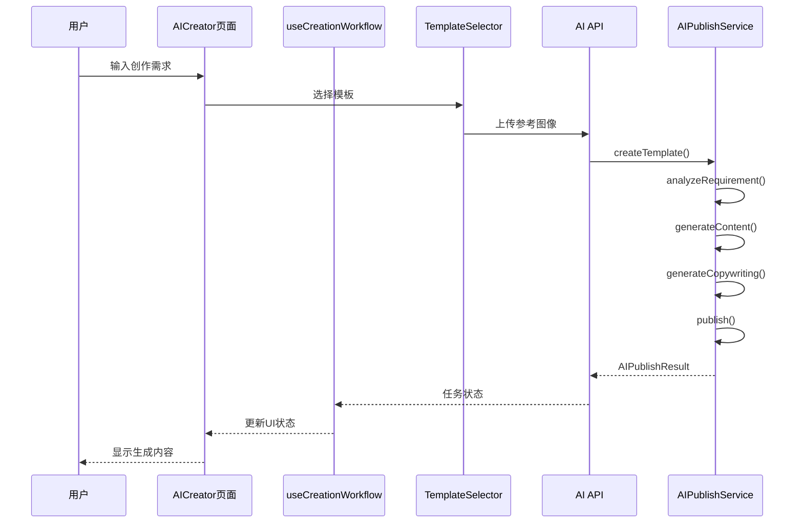

**图表来源**
- [web/client/src/pages/AICreator.tsx:106-113](file://web/client/src/pages/AICreator.tsx#L106-L113)
- [web/client/src/hooks/useCreationWorkflow.ts:118-145](file://web/client/src/hooks/useCreationWorkflow.ts#L118-L145)
- [src/services/ai-publish-service.ts:90-213](file://src/services/ai-publish-service.ts#L90-L213)

**章节来源**
- [src/services/ai-publish-service.ts:1-358](file://src/services/ai-publish-service.ts#L1-L358)
- [web/client/src/pages/AICreator.tsx:1-681](file://web/client/src/pages/AICreator.tsx#L1-L681)

## 架构概览

系统采用分层架构设计，实现了清晰的关注点分离：

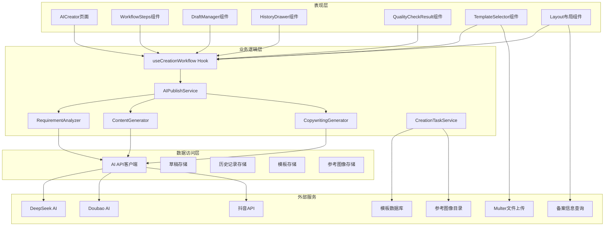

**图表来源**
- [web/client/src/pages/AICreator.tsx:83-95](file://web/client/src/pages/AICreator.tsx#L83-L95)
- [src/services/ai-publish-service.ts:43-81](file://src/services/ai-publish-service.ts#L43-L81)
- [web/server/src/index.ts:32-36](file://web/server/src/index.ts#L32-L36)

## 详细组件分析

### 需求分析器组件

需求分析器负责解析用户输入，提取关键信息并生成AI生成所需的结构化数据。

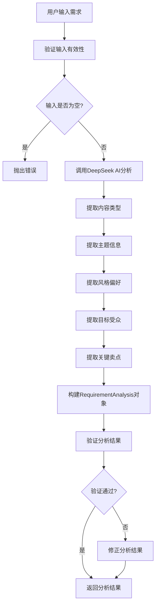

**图表来源**
- [src/services/ai/requirement-analyzer.ts:41-72](file://src/services/ai/requirement-analyzer.ts#L41-L72)
- [src/services/ai/requirement-analyzer.ts:77-98](file://src/services/ai/requirement-analyzer.ts#L77-L98)

### 内容生成器组件

内容生成器根据分析结果生成图片或视频内容，支持进度跟踪和状态查询。

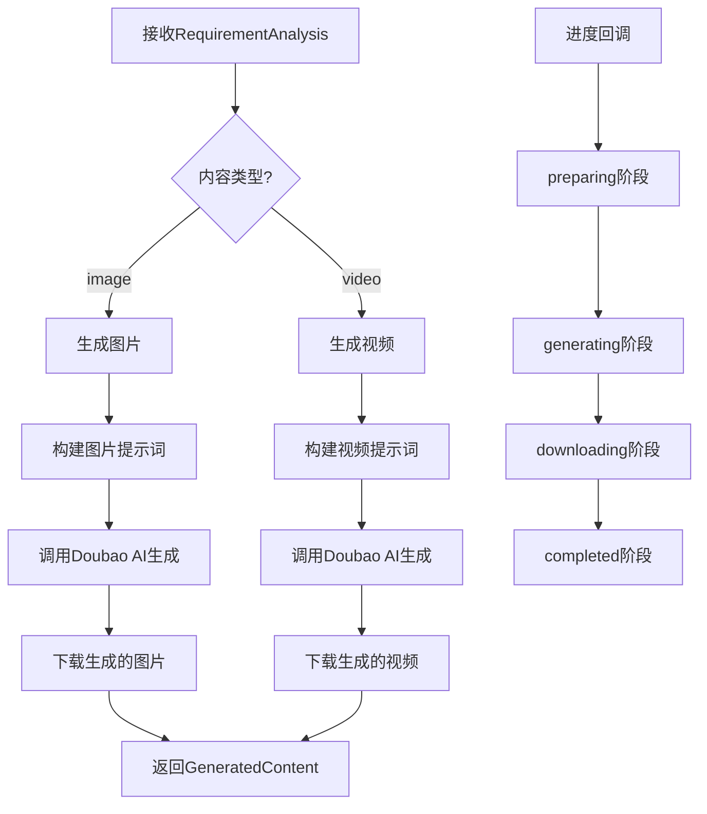

**图表来源**
- [src/services/ai/content-generator.ts:62-102](file://src/services/ai/content-generator.ts#L62-L102)
- [src/services/ai/content-generator.ts:107-163](file://src/services/ai/content-generator.ts#L107-L163)

### 草稿管理系统

草稿管理系统提供了完整的草稿生命周期管理，包括创建、恢复、删除和查看功能。

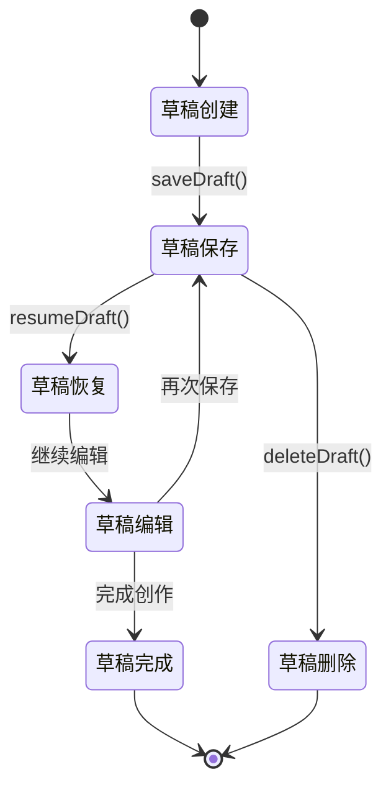

**图表来源**
- [web/client/src/components/ai-creator/DraftManager.tsx:118-128](file://web/client/src/components/ai-creator/DraftManager.tsx#L118-L128)
- [web/client/src/components/ai-creator/HistoryDrawer.tsx:124-134](file://web/client/src/components/ai-creator/HistoryDrawer.tsx#L124-L134)

### 质量校验结果组件

质量校验结果组件提供了全面的内容质量评估和改进建议，支持问题分类、严重程度分级和智能优化建议。

**更新** 移除了未使用的List和Copy图标导入，优化了组件性能

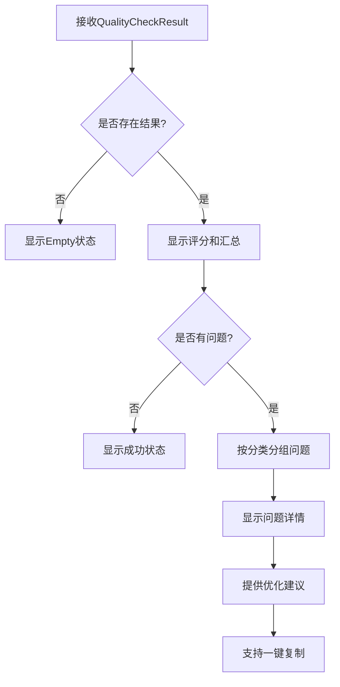

**图表来源**
- [web/client/src/components/ai-creator/QualityCheckResult.tsx:281-404](file://web/client/src/components/ai-creator/QualityCheckResult.tsx#L281-L404)

### 模板选择器组件

模板选择器组件是本次更新的核心功能，支持参考图像上传和管理，提供完整的模板创建和使用体验。

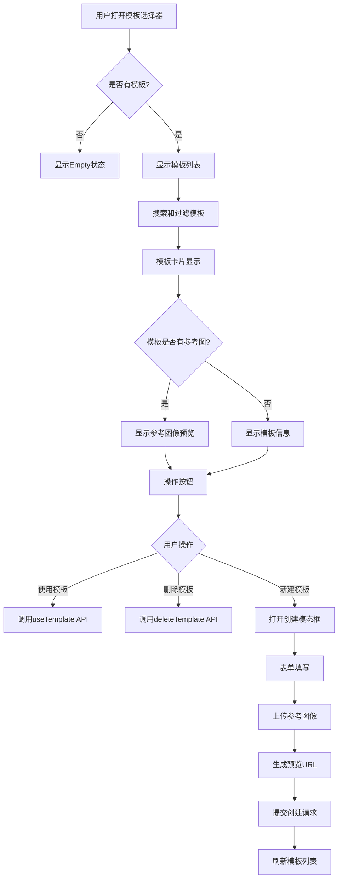

**图表来源**
- [web/client/src/components/ai-creator/TemplateSelector.tsx:228-367](file://web/client/src/components/ai-creator/TemplateSelector.tsx#L228-L367)
- [web/client/src/components/ai-creator/TemplateSelector.tsx:434-469](file://web/client/src/components/ai-creator/TemplateSelector.tsx#L434-L469)

### 参考图像上传功能

参考图像上传功能是本次更新的重要特性，为模板系统提供了视觉参考能力。

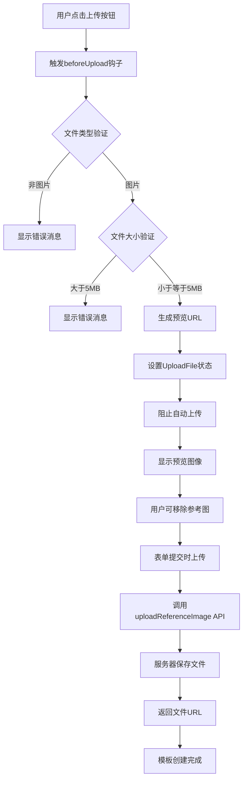

**图表来源**
- [web/client/src/components/ai-creator/TemplateSelector.tsx:194-220](file://web/client/src/components/ai-creator/TemplateSelector.tsx#L194-L220)
- [web/client/src/api/client.ts:415-419](file://web/client/src/api/client.ts#L415-L419)
- [web/server/src/routes/ai.ts:681-711](file://web/server/src/routes/ai.ts#L681-L711)

**章节来源**
- [src/services/ai/requirement-analyzer.ts:1-128](file://src/services/ai/requirement-analyzer.ts#L1-L128)
- [src/services/ai/content-generator.ts:1-229](file://src/services/ai/content-generator.ts#L1-L229)
- [src/services/ai/copywriting-generator.ts:1-194](file://src/services/ai/copywriting-generator.ts#L1-L194)
- [web/client/src/components/ai-creator/DraftManager.tsx:1-217](file://web/client/src/components/ai-creator/DraftManager.tsx#L1-L217)
- [web/client/src/components/ai-creator/HistoryDrawer.tsx:1-331](file://web/client/src/components/ai-creator/HistoryDrawer.tsx#L1-L331)
- [web/client/src/components/ai-creator/QualityCheckResult.tsx:1-407](file://web/client/src/components/ai-creator/QualityCheckResult.tsx#L1-L407)
- [web/client/src/components/ai-creator/TemplateSelector.tsx:1-475](file://web/client/src/components/ai-creator/TemplateSelector.tsx#L1-L475)

## 依赖关系分析

系统依赖关系清晰，各组件职责明确：

```mermaid
graph LR
subgraph "前端依赖"
A[React 18.2.0]
B[Ant Design 6.3.3]
C[Axios 1.13.6]
D[Day.js 1.11.20]
E[@ant-design/icons]
F[Multer]
end
subgraph "后端依赖"
G[Express]
H[CORS]
I[Node-cron]
J[Winston]
K[JSON-Server]
end
subgraph "AI服务"
L[DeepSeek API]
M[Doubao API]
end
subgraph "开发工具"
N[TypeScript 5.0.2]
O[Vite 4.4.5]
P[Jest 29.7.0]
end
A --> C
B --> A
C --> L
C --> M
E --> B
F --> G
G --> H
G --> I
G --> J
K --> G
L --> N
M --> N
N --> O
N --> P
```

**图表来源**
- [web/client/package.json:12-32](file://web/client/package.json#L12-L32)
- [package.json:18-34](file://package.json#L18-L34)

**章节来源**
- [web/client/package.json:1-35](file://web/client/package.json#L1-L35)
- [package.json:1-39](file://package.json#L1-L39)

## 性能考虑

系统在设计时充分考虑了性能优化：

1. **异步处理**：所有AI生成操作都采用异步方式，避免阻塞主线程
2. **进度跟踪**：提供详细的进度回调，改善用户体验
3. **缓存策略**：任务状态在内存中缓存，减少重复计算
4. **错误处理**：完善的错误分类和重试机制
5. **资源管理**：及时清理过期任务，释放内存资源
6. **图标优化**：移除未使用的图标导入，减少bundle大小
7. **文件上传优化**：参考图像上传采用本地预览，减少服务器压力
8. **模板缓存**：模板列表和状态在客户端缓存，提升响应速度

**更新** 组件级别的性能优化，包括：
- QualityCheckResult.tsx移除未使用的List和Copy图标导入
- Layout.tsx优化了备案信息的显示逻辑
- TemplateSelector.tsx优化了参考图像上传的用户体验

## 合规性要求

系统严格遵守中国互联网相关法规要求：

### 备案信息显示

**新增** 在Layout组件中添加了中国政府部门网站备案信息显示，确保符合《互联网信息服务管理办法》要求。

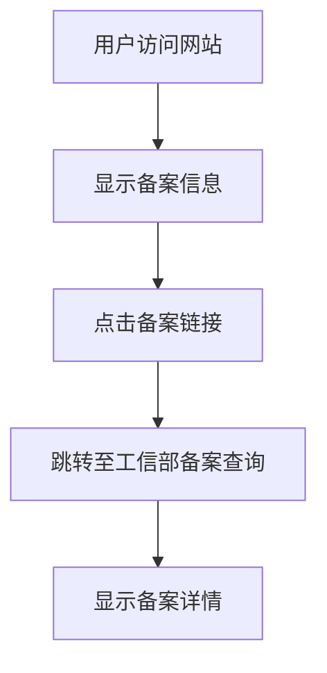

**图表来源**
- [web/client/src/components/Layout.tsx:294-313](file://web/client/src/components/Layout.tsx#L294-L313)

### 合规性特性

1. **ICP备案展示**：显示鄂ICP备2024068122号-3备案号
2. **链接跳转**：指向工业和信息化部备案查询页面
3. **样式规范**：采用灰色字体，不影响主要功能展示
4. **用户体验**：鼠标悬停效果，提供清晰的交互反馈

**章节来源**
- [web/client/src/components/Layout.tsx:294-313](file://web/client/src/components/Layout.tsx#L294-L313)

## 故障排除指南

### 常见问题及解决方案

1. **AI API调用失败**
   - 检查API密钥配置
   - 验证网络连接
   - 查看服务器日志

2. **内容生成超时**
   - 检查AI服务可用性
   - 适当调整生成参数
   - 监控服务器资源使用情况

3. **前端组件加载失败**
   - 检查依赖包安装
   - 验证TypeScript编译
   - 查看浏览器控制台错误

4. **任务状态异常**
   - 清理过期任务
   - 检查任务存储状态
   - 重启服务进程

5. **图标显示异常**
   - 检查@ant-design/icons版本兼容性
   - 验证图标导入路径正确性
   - 确认图标名称拼写无误

6. **备案信息不显示**
   - 检查Layout组件渲染逻辑
   - 验证CSS样式设置
   - 确认链接地址有效性

7. **参考图像上传失败**
   - 检查文件类型限制（仅支持图片）
   - 验证文件大小（不超过5MB）
   - 确认服务器磁盘空间充足
   - 检查uploads/reference-images目录权限

8. **模板创建失败**
   - 验证必填字段（名称和需求描述）
   - 检查模板数据库连接
   - 确认模板名称唯一性

**章节来源**
- [src/services/ai-publish-service.ts:331-347](file://src/services/ai-publish-service.ts#L331-L347)
- [web/server/src/index.ts:44-50](file://web/server/src/index.ts#L44-L50)
- [web/server/src/routes/ai.ts:681-711](file://web/server/src/routes/ai.ts#L681-L711)

## 结论

ClawOperations项目展现了现代全栈应用的最佳实践，通过AI技术增强了内容创作的效率和质量。系统具有以下优势：

1. **完整的AI工作流**：从需求分析到内容发布的端到端解决方案
2. **良好的架构设计**：清晰的分层架构和职责分离
3. **丰富的功能特性**：草稿管理、历史记录、模板系统等实用功能
4. **优秀的用户体验**：直观的界面设计和流畅的操作流程
5. **可靠的错误处理**：完善的错误分类和恢复机制
6. **合规性保障**：符合中国互联网监管要求的网站备案信息
7. **性能持续优化**：定期进行组件级别的性能改进
8. **新增参考图像功能**：支持模板关联视觉参考，提升创作质量和一致性

**更新亮点**：
- **参考图像上传功能**：TemplateSelector组件新增参考图像上传能力
- **拖拽和预览**：支持文件拖拽上传和实时预览
- **文件验证**：严格的文件类型和大小验证机制
- **模板管理增强**：模板支持关联参考图像，提升个性化创作体验
- **服务器端支持**：完整的参考图像上传API和数据库存储
- **组件性能优化**：移除未使用的图标导入，提升加载速度
- **合规性增强**：新增备案信息显示，满足法规要求
- **用户体验改善**：更简洁的图标使用和更清晰的信息展示

该系统为抖音小龙虾营销提供了强大的技术支持，能够显著提升内容创作效率和质量，是现代社交媒体运营的理想工具。新增的参考图像上传功能进一步增强了系统的专业性和实用性，为用户提供了更加个性化和高质量的创作体验。