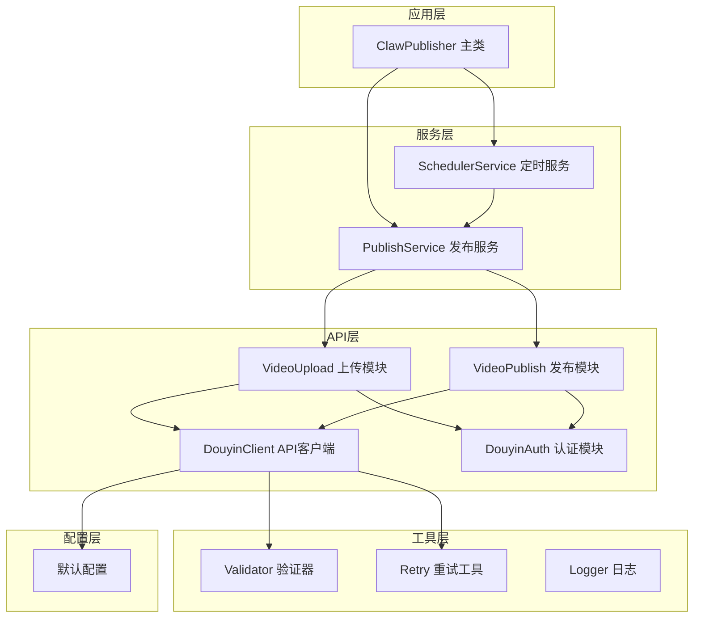
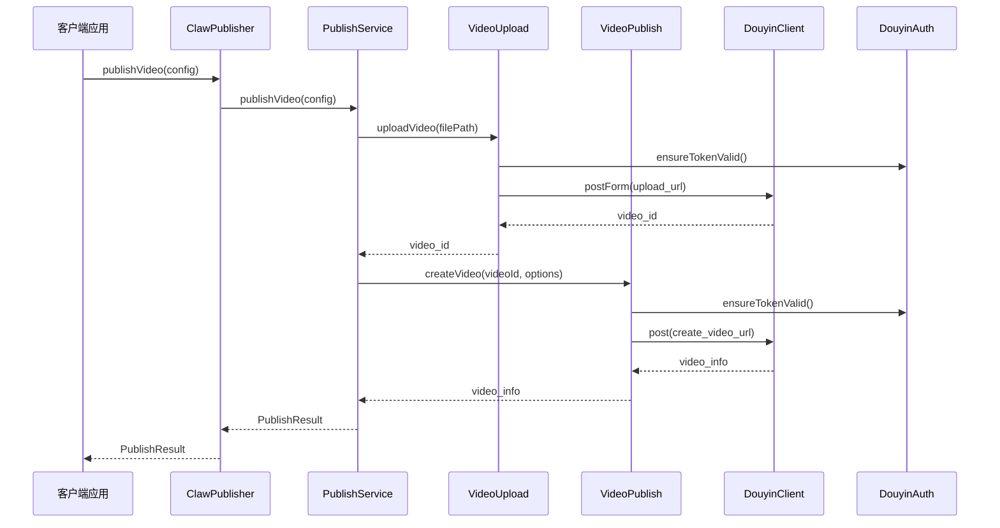
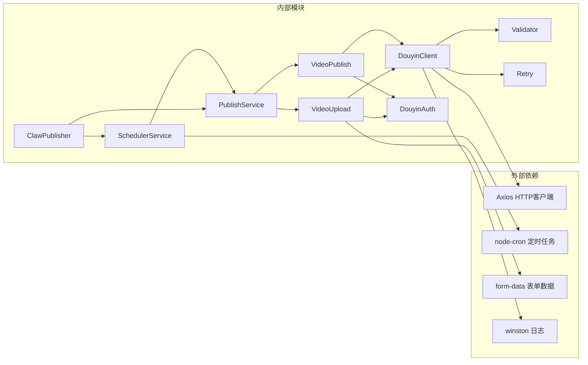

# API参考文档

<cite>
**本文档引用的文件**
- [src/index.ts](file://src/index.ts)
- [src/models/types.ts](file://src/models/types.ts)
- [src/services/publish-service.ts](file://src/services/publish-service.ts)
- [src/services/scheduler-service.ts](file://src/services/scheduler-service.ts)
- [src/api/douyin-client.ts](file://src/api/douyin-client.ts)
- [src/api/auth.ts](file://src/api/auth.ts)
- [src/api/video-upload.ts](file://src/api/video-upload.ts)
- [src/api/video-publish.ts](file://src/api/video-publish.ts)
- [src/utils/validator.ts](file://src/utils/validator.ts)
- [src/utils/retry.ts](file://src/utils/retry.ts)
- [config/default.ts](file://config/default.ts)
- [example.ts](file://example.ts)
- [package.json](file://package.json)
</cite>

## 目录
1. [简介](#简介)
2. [项目结构](#项目结构)
3. [核心组件](#核心组件)
4. [架构概览](#架构概览)
5. [详细组件分析](#详细组件分析)
6. [依赖关系分析](#依赖关系分析)
7. [性能考虑](#性能考虑)
8. [故障排除指南](#故障排除指南)
9. [结论](#结论)
10. [附录](#附录)

## 简介

ClawOperations是一个专为抖音（TikTok）小龙虾营销账号设计的自动化运营系统。该系统提供了完整的API接口，支持视频上传、发布、定时发布、视频管理和认证等功能。本文档详细记录了ClawPublisher主类的所有公共接口，包括方法签名、参数说明、返回值格式和使用示例。

## 项目结构

ClawOperations采用模块化的架构设计，主要分为以下几个层次：



**图表来源**
- [src/index.ts:29-244](file://src/index.ts#L29-L244)
- [src/services/publish-service.ts:22-31](file://src/services/publish-service.ts#L22-L31)
- [src/services/scheduler-service.ts:23-29](file://src/services/scheduler-service.ts#L23-L29)

**章节来源**
- [src/index.ts:1-248](file://src/index.ts#L1-L248)
- [package.json:1-34](file://package.json#L1-L34)

## 核心组件

ClawOperations的核心由以下主要组件构成：

### ClawPublisher 主类
ClawPublisher是系统的入口点，提供了统一的对外接口。它封装了认证、视频上传、视频发布、定时发布等功能，并负责协调各个子服务的工作。

### 发布服务 (PublishService)
负责视频发布的业务编排，包括上传、发布、状态查询、视频管理等操作。

### 定时服务 (SchedulerService)
基于node-cron实现的定时任务调度系统，支持视频定时发布、任务管理等功能。

### API客户端 (DouyinClient)
基于Axios的HTTP客户端，封装了抖音API的请求处理、错误处理和重试机制。

**章节来源**
- [src/index.ts:29-244](file://src/index.ts#L29-L244)
- [src/services/publish-service.ts:22-31](file://src/services/publish-service.ts#L22-L31)
- [src/services/scheduler-service.ts:23-29](file://src/services/scheduler-service.ts#L23-L29)

## 架构概览

ClawOperations采用了分层架构设计，各层职责明确，耦合度低：



**图表来源**
- [src/index.ts:153-155](file://src/index.ts#L153-L155)
- [src/services/publish-service.ts:38-80](file://src/services/publish-service.ts#L38-L80)
- [src/api/video-upload.ts:35-54](file://src/api/video-upload.ts#L35-L54)
- [src/api/video-publish.ts:30-54](file://src/api/video-publish.ts#L30-L54)

## 详细组件分析

### ClawPublisher 类

ClawPublisher是系统的核心类，提供了完整的抖音视频发布API。

#### 构造函数

**方法签名**
```typescript
constructor(config: DouyinConfig)
```

**参数说明**
- `config`: 抖音配置对象，包含客户端密钥、密钥、重定向URI等信息

**配置项**
- `clientKey`: 抖音应用客户端密钥
- `clientSecret`: 抖音应用密钥
- `redirectUri`: OAuth回调地址
- `accessToken`: 访问令牌（可选）
- `refreshToken`: 刷新令牌（可选）
- `openId`: 用户OpenID（可选）

**章节来源**
- [src/index.ts:39-67](file://src/index.ts#L39-L67)
- [src/models/types.ts:193-200](file://src/models/types.ts#L193-L200)

#### 认证相关方法

##### 获取授权URL
**方法签名**
```typescript
getAuthUrl(scopes?: string[], state?: string): string
```

**参数说明**
- `scopes`: OAuth作用域数组，默认使用视频创建、上传、数据权限
- `state`: 防CSRF攻击的状态参数

**返回值**
- 授权页面URL字符串

**章节来源**
- [src/index.ts:77-79](file://src/index.ts#L77-L79)
- [src/api/auth.ts:45-60](file://src/api/auth.ts#L45-L60)

##### 处理授权回调
**方法签名**
```typescript
handleAuthCallback(code: string): Promise<TokenInfo>
```

**参数说明**
- `code`: OAuth授权码

**返回值**
- Token信息对象，包含访问令牌、刷新令牌、过期时间等

**章节来源**
- [src/index.ts:86-88](file://src/index.ts#L86-L88)
- [src/api/auth.ts:67-91](file://src/api/auth.ts#L67-L91)

##### 刷新访问令牌
**方法签名**
```typescript
refreshToken(): Promise<TokenInfo>
```

**返回值**
- 新的Token信息对象

**章节来源**
- [src/index.ts:94-96](file://src/index.ts#L94-L96)
- [src/api/auth.ts:98-127](file://src/api/auth.ts#L98-L127)

##### 检查令牌有效性
**方法签名**
```typescript
isTokenValid(): boolean
```

**返回值**
- 布尔值，表示令牌是否有效

**章节来源**
- [src/index.ts:102-104](file://src/index.ts#L102-L104)
- [src/api/auth.ts:133-141](file://src/api/auth.ts#L133-L141)

#### 视频上传方法

##### 上传本地视频
**方法签名**
```typescript
uploadVideo(filePath: string, onProgress?: (progress: UploadProgress) => void): Promise<string>
```

**参数说明**
- `filePath`: 视频文件本地路径
- `onProgress`: 上传进度回调函数

**返回值**
- 视频ID字符串

**章节来源**
- [src/index.ts:122-127](file://src/index.ts#L122-L127)
- [src/services/publish-service.ts:88-93](file://src/services/publish-service.ts#L88-L93)

##### 从URL上传视频
**方法签名**
```typescript
uploadFromUrl(videoUrl: string): Promise<string>
```

**参数说明**
- `videoUrl`: 远程视频URL

**返回值**
- 视频ID字符串

**章节来源**
- [src/index.ts:134-144](file://src/index.ts#L134-L144)
- [src/api/video-upload.ts:220-237](file://src/api/video-upload.ts#L220-L237)

#### 视频发布方法

##### 发布视频（一站式）
**方法签名**
```typescript
publishVideo(config: PublishTaskConfig): Promise<PublishResult>
```

**参数说明**
- `config`: 发布任务配置对象

**发布任务配置项**
- `videoPath`: 视频文件路径或URL
- `options`: 发布选项（可选）
- `isRemoteUrl`: 是否为远程URL（可选）

**返回值**
- 发布结果对象，包含成功状态、视频ID、分享链接等

**章节来源**
- [src/index.ts:153-155](file://src/index.ts#L153-L155)
- [src/services/publish-service.ts:38-80](file://src/services/publish-service.ts#L38-L80)
- [src/models/types.ts:161-168](file://src/models/types.ts#L161-L168)

##### 发布已上传视频
**方法签名**
```typescript
publishUploadedVideo(videoId: string, options?: VideoPublishOptions): Promise<PublishResult>
```

**参数说明**
- `videoId`: 已上传视频的ID
- `options`: 发布选项（可选）

**返回值**
- 发布结果对象

**章节来源**
- [src/index.ts:163-168](file://src/index.ts#L163-L168)
- [src/services/publish-service.ts:101-125](file://src/services/publish-service.ts#L101-L125)

##### 下载并发布
**方法签名**
```typescript
downloadAndPublish(videoUrl: string, options?: VideoPublishOptions): Promise<PublishResult>
```

**参数说明**
- `videoUrl`: 远程视频URL
- `options`: 发布选项（可选）

**返回值**
- 发布结果对象

**章节来源**
- [src/index.ts:176-181](file://src/index.ts#L176-L181)
- [src/services/publish-service.ts:133-172](file://src/services/publish-service.ts#L133-L172)

#### 定时发布方法

##### 创建定时任务
**方法签名**
```typescript
scheduleVideo(config: PublishTaskConfig, publishTime: Date): ScheduleResult
```

**参数说明**
- `config`: 发布任务配置
- `publishTime`: 发布时间（Date对象）

**返回值**
- 定时任务结果对象，包含任务ID、计划时间、状态等

**章节来源**
- [src/index.ts:191-193](file://src/index.ts#L191-L193)
- [src/services/scheduler-service.ts:37-72](file://src/services/scheduler-service.ts#L37-L72)

##### 取消定时任务
**方法签名**
```typescript
cancelSchedule(taskId: string): boolean
```

**参数说明**
- `taskId`: 任务ID

**返回值**
- 布尔值，表示取消是否成功

**章节来源**
- [src/index.ts:200-202](file://src/index.ts#L200-L202)
- [src/services/scheduler-service.ts:79-97](file://src/services/scheduler-service.ts#L79-L97)

##### 列出定时任务
**方法签名**
```typescript
listScheduledTasks(): ScheduleResult[]
```

**返回值**
- 定时任务结果数组

**章节来源**
- [src/index.ts:208-210](file://src/index.ts#L208-L210)
- [src/services/scheduler-service.ts:103-115](file://src/services/scheduler-service.ts#L103-L115)

#### 视频管理方法

##### 查询视频状态
**方法签名**
```typescript
queryVideoStatus(videoId: string): Promise<{
    status: string;
    shareUrl?: string;
    createTime?: number;
}>
```

**参数说明**
- `videoId`: 视频ID

**返回值**
- 包含视频状态、分享链接、创建时间的对象

**章节来源**
- [src/index.ts:219-225](file://src/index.ts#L219-L225)
- [src/api/video-publish.ts:132-154](file://src/api/video-publish.ts#L132-L154)

##### 删除视频
**方法签名**
```typescript
deleteVideo(videoId: string): Promise<void>
```

**参数说明**
- `videoId`: 视频ID

**返回值**
- Promise<void>

**章节来源**
- [src/index.ts:231-233](file://src/index.ts#L231-L233)
- [src/api/video-publish.ts:160-170](file://src/api/video-publish.ts#L160-L170)

#### 工具方法

##### 停止服务
**方法签名**
```typescript
stop(): void
```

**功能说明**
- 停止所有定时任务

**章节来源**
- [src/index.ts:240-243](file://src/index.ts#L240-L243)
- [src/services/scheduler-service.ts:193-198](file://src/services/scheduler-service.ts#L193-L198)

### 数据模型和类型定义

ClawOperations提供了完整的TypeScript类型定义，确保类型安全和良好的开发体验。

#### 认证相关类型

**TokenInfo**
- `accessToken`: 访问令牌
- `refreshToken`: 刷新令牌  
- `expiresAt`: 过期时间戳
- `openId`: 用户OpenID
- `scope`: 权限范围

**OAuthConfig**
- `clientKey`: 客户端密钥
- `clientSecret`: 应用密钥
- `redirectUri`: 回调地址

**章节来源**
- [src/models/types.ts:40-46](file://src/models/types.ts#L40-L46)
- [src/models/types.ts:20-24](file://src/models/types.ts#L20-L24)

#### 视频上传相关类型

**UploadProgress**
- `loaded`: 已上传字节数
- `total`: 总字节数
- `percentage`: 百分比进度

**UploadConfig**
- `chunkSize`: 分片大小（可选）
- `onProgress`: 进度回调（可选）

**章节来源**
- [src/models/types.ts:61-65](file://src/models/types.ts#L61-L65)
- [src/models/types.ts:53-56](file://src/models/types.ts#L53-L56)

#### 视频发布相关类型

**VideoPublishOptions**
- `title`: 视频标题（可选）
- `description`: 视频描述（可选）
- `hashtags`: 话题标签数组（可选）
- `atUsers`: @提及用户列表（可选）
- `poiId`: 地理位置POI ID（可选）
- `poiName`: 地理位置名称（可选）
- `microAppId`: 小程序ID（可选）
- `microAppTitle`: 小程序标题（可选）
- `microAppUrl`: 小程序链接（可选）
- `articleId`: 商品ID（可选）
- `schedulePublishTime`: 定时发布时间（可选）

**PublishTaskConfig**
- `videoPath`: 视频路径或URL
- `options`: 发布选项（可选）
- `isRemoteUrl`: 是否为远程URL（可选）

**章节来源**
- [src/models/types.ts:101-124](file://src/models/types.ts#L101-L124)
- [src/models/types.ts:161-168](file://src/models/types.ts#L161-L168)

#### 结果类型

**PublishResult**
- `success`: 布尔值，表示发布是否成功
- `videoId`: 视频ID（可选）
- `shareUrl`: 分享链接（可选）
- `error`: 错误信息（可选）
- `createTime`: 创建时间（可选）

**ScheduleResult**
- `taskId`: 任务ID
- `scheduledTime`: 计划时间
- `status`: 任务状态（'pending' | 'completed' | 'failed' | 'cancelled'）

**章节来源**
- [src/models/types.ts:173-179](file://src/models/types.ts#L173-L179)
- [src/models/types.ts:184-188](file://src/models/types.ts#L184-L188)

### 错误处理机制

ClawOperations实现了完善的错误处理机制，包括自定义异常类型和错误码处理。

#### 异常类型

**DouyinApiException**
- 继承自Error
- 包含抖音API错误码和消息
- 用于处理抖音API特定错误

**ValidationError**
- 继承自Error
- 用于处理参数验证错误
- 在文件大小、内容长度、格式验证失败时抛出

**章节来源**
- [src/api/douyin-client.ts:226-234](file://src/api/douyin-client.ts#L226-L234)
- [src/utils/validator.ts:10-15](file://src/utils/validator.ts#L10-L15)

#### 错误码和处理策略

**抖音API错误码**
- `429`: 请求过于频繁（限流）
- `10001`: 服务器内部错误
- `10002`: 参数错误

**处理策略**
- 对于限流错误自动重试
- 对于网络错误和超时自动重试
- 其他错误直接抛出

**章节来源**
- [src/api/douyin-client.ts:204-220](file://src/api/douyin-client.ts#L204-L220)
- [src/utils/retry.ts:41-81](file://src/utils/retry.ts#L41-L81)

### 配置和最佳实践

#### 默认配置

**API配置**
- `BASE_URL`: 抖音开放平台API基础URL

**上传配置**
- `CHUNK_UPLOAD_THRESHOLD`: 分片上传阈值（128MB）
- `DEFAULT_CHUNK_SIZE`: 默认分片大小（5MB）

**重试配置**
- `MAX_RETRIES`: 最大重试次数（3次）
- `BASE_DELAY`: 基础延迟时间（1000ms）
- `MAX_DELAY`: 最大延迟时间（30000ms）

**内容配置**
- `MAX_TITLE_LENGTH`: 标题最大长度（55字符）
- `MAX_DESCRIPTION_LENGTH`: 描述最大长度（300字符）
- `MAX_HASHTAG_COUNT`: hashtag最大数量（5个）

**章节来源**
- [config/default.ts:5-40](file://config/default.ts#L5-L40)

#### 最佳实践建议

1. **令牌管理**: 建议在生产环境中预置访问令牌和刷新令牌
2. **进度监控**: 使用onProgress回调监控大文件上传进度
3. **错误处理**: 实现适当的错误处理和重试机制
4. **定时发布**: 合理设置定时发布时间，避免与高峰期冲突
5. **内容优化**: 控制标题和描述长度，合理使用hashtag

**章节来源**
- [example.ts:11-26](file://example.ts#L11-L26)
- [src/utils/validator.ts:45-86](file://src/utils/validator.ts#L45-L86)

## 依赖关系分析

ClawOperations的依赖关系清晰，各模块职责分离：



**图表来源**
- [package.json:14-29](file://package.json#L14-L29)
- [src/index.ts:1-14](file://src/index.ts#L1-L14)

**章节来源**
- [package.json:14-29](file://package.json#L14-L29)
- [src/index.ts:1-20](file://src/index.ts#L1-L20)

## 性能考虑

### 上传性能优化

1. **智能分片上传**: 根据文件大小自动选择上传方式
2. **进度监控**: 实时显示上传进度，提升用户体验
3. **并发控制**: 合理设置分片大小，平衡上传速度和稳定性

### 定时任务性能

1. **内存管理**: 及时清理已完成的定时任务
2. **资源释放**: 正确关闭文件句柄和网络连接
3. **任务调度**: 使用高效的cron表达式

### 错误处理性能

1. **指数退避**: 采用指数退避策略减少服务器压力
2. **重试限制**: 避免无限重试造成资源浪费
3. **错误分类**: 区分可重试和不可重试错误

## 故障排除指南

### 常见问题和解决方案

#### 认证相关问题
- **问题**: 授权失败或令牌过期
- **解决方案**: 检查客户端密钥配置，重新获取授权码

#### 上传相关问题
- **问题**: 上传中断或失败
- **解决方案**: 检查网络连接，确认文件格式和大小限制

#### 发布相关问题
- **问题**: 视频发布失败
- **解决方案**: 验证发布选项配置，检查hashtag数量限制

#### 定时任务问题
- **问题**: 定时任务未执行
- **解决方案**: 检查系统时间和时区设置

**章节来源**
- [src/api/auth.ts:67-91](file://src/api/auth.ts#L67-L91)
- [src/api/video-upload.ts:35-54](file://src/api/video-upload.ts#L35-L54)
- [src/services/publish-service.ts:38-80](file://src/services/publish-service.ts#L38-L80)
- [src/services/scheduler-service.ts:37-72](file://src/services/scheduler-service.ts#L37-L72)

## 结论

ClawOperations提供了一个完整、健壮的抖音视频发布解决方案。通过模块化的架构设计和完善的错误处理机制，该系统能够满足专业营销账号的各种需求。建议开发者在使用过程中遵循最佳实践，合理配置参数，确保系统的稳定运行。

## 附录

### 版本兼容性

- **Node.js版本**: >= 18.0.0
- **TypeScript版本**: ^5.3.0
- **兼容性**: 主要针对抖音（TikTok）API设计

### 变更历史

由于这是一个相对新的项目，具体的变更历史可以在版本控制系统中查看。建议关注以下方面：
- API接口的向后兼容性
- 错误码和异常类型的稳定性
- 配置参数的兼容性

### 相关资源

- [抖音开发者文档](https://developers.tiktok.com/)
- [Axios官方文档](https://axios-http.com/)
- [node-cron官方文档](https://github.com/node-cron/node-cron)