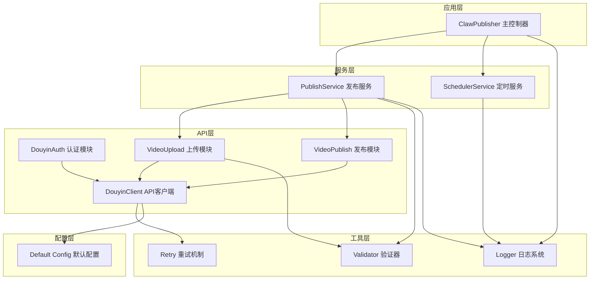
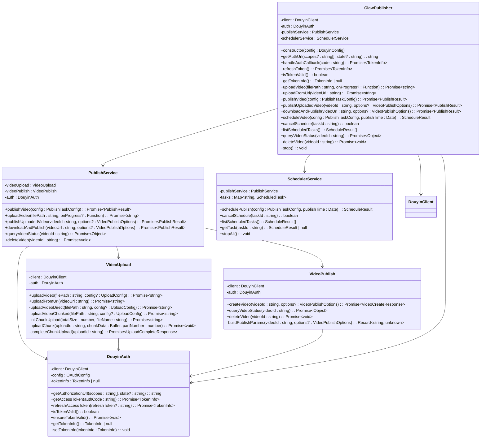
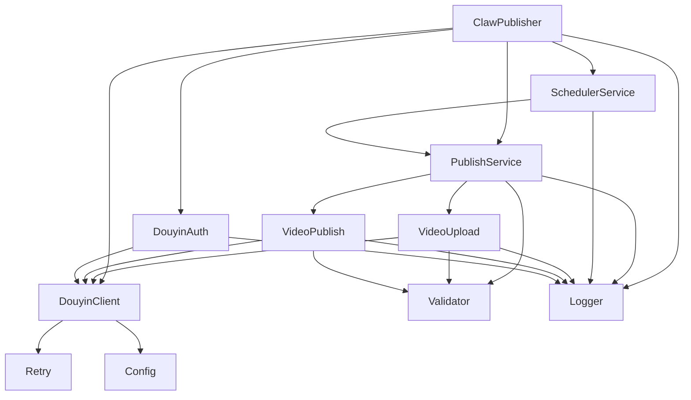

# 主控制器API

<cite>
**本文档引用的文件**
- [src/index.ts](file://src/index.ts)
- [src/models/types.ts](file://src/models/types.ts)
- [src/api/auth.ts](file://src/api/auth.ts)
- [src/api/video-upload.ts](file://src/api/video-upload.ts)
- [src/api/video-publish.ts](file://src/api/video-publish.ts)
- [src/services/publish-service.ts](file://src/services/publish-service.ts)
- [src/services/scheduler-service.ts](file://src/services/scheduler-service.ts)
- [src/api/douyin-client.ts](file://src/api/douyin-client.ts)
- [src/utils/validator.ts](file://src/utils/validator.ts)
- [src/utils/retry.ts](file://src/utils/retry.ts)
- [src/utils/logger.ts](file://src/utils/logger.ts)
- [config/default.ts](file://config/default.ts)
- [example.ts](file://example.ts)
</cite>

## 目录
1. [简介](#简介)
2. [项目结构](#项目结构)
3. [核心组件](#核心组件)
4. [架构概览](#架构概览)
5. [详细组件分析](#详细组件分析)
6. [依赖关系分析](#依赖关系分析)
7. [性能考虑](#性能考虑)
8. [故障排除指南](#故障排除指南)
9. [结论](#结论)
10. [附录](#附录)

## 简介

ClawPublisher 是一个专为抖音视频发布设计的综合控制台API。该系统提供了从认证到视频发布的完整解决方案，支持本地文件上传、远程URL上传、定时发布、视频管理和多种发布选项配置。

本API文档详细记录了ClawPublisher主控制器的所有公共方法，包括构造函数、认证方法、视频上传方法、视频发布方法、定时发布方法、视频管理方法和工具方法。每个方法都包含了详细的参数说明、返回值格式、错误处理机制和最佳实践建议。

## 项目结构

ClawPublisher采用模块化架构设计，主要分为以下几个层次：



**图表来源**
- [src/index.ts:29-67](file://src/index.ts#L29-L67)
- [src/services/publish-service.ts:22-31](file://src/services/publish-service.ts#L22-L31)
- [src/services/scheduler-service.ts:23-29](file://src/services/scheduler-service.ts#L23-L29)

**章节来源**
- [src/index.ts:1-248](file://src/index.ts#L1-L248)
- [src/models/types.ts:1-201](file://src/models/types.ts#L1-L201)

## 核心组件

ClawPublisher主控制器是整个系统的入口点，负责协调各个子模块的工作。它封装了复杂的业务逻辑，为上层应用提供了简洁易用的API接口。

### 主控制器职责

1. **统一入口**: 提供单一的API入口点
2. **模块协调**: 协调认证、上传、发布、定时等子模块
3. **配置管理**: 管理抖音API的配置信息
4. **错误处理**: 统一的错误处理和日志记录
5. **生命周期管理**: 管理定时任务的生命周期

**章节来源**
- [src/index.ts:29-67](file://src/index.ts#L29-L67)

## 架构概览

ClawPublisher采用了清晰的分层架构，确保了代码的可维护性和扩展性：



**图表来源**
- [src/index.ts:29-244](file://src/index.ts#L29-L244)
- [src/services/publish-service.ts:22-31](file://src/services/publish-service.ts#L22-L31)
- [src/services/scheduler-service.ts:23-29](file://src/services/scheduler-service.ts#L23-L29)
- [src/api/auth.ts:29-37](file://src/api/auth.ts#L29-L37)
- [src/api/video-upload.ts:20-27](file://src/api/video-upload.ts#L20-L27)
- [src/api/video-publish.ts:15-22](file://src/api/video-publish.ts#L15-L22)

## 详细组件分析

### 构造函数

ClawPublisher构造函数负责初始化整个系统的核心组件。

**方法签名**
```typescript
constructor(config: DouyinConfig)
```

**参数说明**
- `config`: 抖音配置对象，包含客户端密钥、密钥、重定向URI等必要信息

**配置参数**
- `clientKey`: 抖音应用的客户端密钥
- `clientSecret`: 抖音应用的密钥
- `redirectUri`: OAuth回调地址
- `accessToken`: 可选的访问令牌
- `refreshToken`: 可选的刷新令牌
- `openId`: 可选的用户OpenID

**初始化流程**
1. 创建DouyinClient实例
2. 初始化DouyinAuth认证模块
3. 如果提供预置令牌，设置令牌信息
4. 初始化发布服务和定时服务
5. 记录初始化完成日志

**错误处理**
- 如果配置信息缺失，将在后续操作中抛出相应错误
- 令牌设置失败会记录错误日志

**最佳实践**
- 生产环境中建议提供预置的access_token和refresh_token
- 确保redirectUri与抖音开发者平台配置一致
- 在构造函数中不要进行网络请求

**章节来源**
- [src/index.ts:39-67](file://src/index.ts#L39-L67)
- [src/models/types.ts:193-200](file://src/models/types.ts#L193-L200)

### 认证相关方法

#### 获取授权URL
```typescript
getAuthUrl(scopes?: string[], state?: string): string
```

**功能说明**: 生成OAuth授权页面的URL，用于用户授权

**参数说明**
- `scopes`: 授权作用域数组，默认使用VIDEO_CREATE、VIDEO_UPLOAD、VIDEO_DATA
- `state`: 防CSRF攻击的状态参数

**返回值**: 授权URL字符串

**使用场景**
- 首次授权时引导用户访问授权页面
- 需要自定义权限范围时使用

**最佳实践**
- 始终提供state参数以防止CSRF攻击
- scopes参数应根据实际需求最小化授权范围

#### 处理授权回调
```typescript
handleAuthCallback(code: string): Promise<TokenInfo>
```

**功能说明**: 使用授权码换取访问令牌

**参数说明**
- `code`: 用户授权后回调中的授权码

**返回值**: TokenInfo对象，包含访问令牌、刷新令牌等信息

**错误处理**
- 授权码无效时抛出异常
- 网络请求失败时重试机制生效

**最佳实践**
- 授权码只能使用一次，使用后立即处理
- 成功获取令牌后应持久化存储

#### 刷新访问令牌
```typescript
refreshToken(): Promise<TokenInfo>
```

**功能说明**: 刷新过期的访问令牌

**返回值**: 新的TokenInfo对象

**内部机制**
- 检查是否存在refresh_token
- 调用抖音API刷新令牌
- 更新客户端的访问令牌

**错误处理**
- 没有refresh_token时抛出错误
- 刷新失败时抛出异常

**最佳实践**
- 定期检查令牌有效期
- 在令牌即将过期时提前刷新

#### 检查令牌有效性
```typescript
isTokenValid(): boolean
```

**功能说明**: 检查当前令牌是否有效

**返回值**: boolean值表示令牌有效性

**判断逻辑**
- 检查令牌是否存在
- 比较当前时间与过期时间（预留5分钟缓冲）

**最佳实践**
- 在每次API调用前检查令牌有效性
- 结合自动刷新机制使用

#### 获取令牌信息
```typescript
getTokenInfo(): TokenInfo | null
```

**功能说明**: 获取当前存储的令牌信息

**返回值**: TokenInfo对象或null

**用途**
- 调试和监控
- 检查当前认证状态
- 令牌持久化恢复

**章节来源**
- [src/index.ts:71-112](file://src/index.ts#L71-L112)
- [src/api/auth.ts:45-169](file://src/api/auth.ts#L45-L169)

### 视频上传方法

#### 上传本地视频文件
```typescript
uploadVideo(
  filePath: string,
  onProgress?: (progress: UploadProgress) => void
): Promise<string>
```

**功能说明**: 上传本地视频文件到抖音

**参数说明**
- `filePath`: 视频文件的本地路径
- `onProgress`: 进度回调函数，接收UploadProgress对象

**返回值**: string类型的视频ID

**上传策略**
- 小文件（≤128MB）：直接上传
- 大文件（>128MB）：分片上传

**进度回调**
- loaded: 已上传字节数
- total: 文件总字节数
- percentage: 上传百分比

**内部流程**
1. 确保令牌有效
2. 验证文件格式和大小
3. 根据文件大小选择上传方式
4. 监控上传进度
5. 返回视频ID

**错误处理**
- 文件不存在或无权限访问
- 网络中断或超时
- 抖音API返回错误

**最佳实践**
- 监控上传进度，提供用户反馈
- 大文件上传建议使用断点续传
- 预估上传时间，合理安排任务调度

#### 从URL上传视频
```typescript
uploadFromUrl(videoUrl: string): Promise<string>
```

**功能说明**: 直接从远程URL上传视频

**参数说明**
- `videoUrl`: 视频文件的远程URL

**返回值**: string类型的视频ID

**内部机制**
- 调用抖音API的URL上传接口
- 不需要下载到本地
- 适合处理大文件或网络资源

**错误处理**
- URL无效或无法访问
- 远程服务器问题
- 抖音API处理失败

**最佳实践**
- 确保URL可公开访问
- 验证URL的有效性
- 考虑网络延迟影响

**章节来源**
- [src/index.ts:122-144](file://src/index.ts#L122-L144)
- [src/api/video-upload.ts:35-54](file://src/api/video-upload.ts#L35-L54)

### 视频发布方法

#### 一站式发布（上传+发布）
```typescript
publishVideo(config: PublishTaskConfig): Promise<PublishResult>
```

**功能说明**: 完整的视频发布流程，包括上传和发布

**参数说明**
- `config`: PublishTaskConfig对象，包含视频路径和发布选项

**返回值**: PublishResult对象，包含发布结果信息

**发布流程**
1. 验证发布选项
2. 上传视频文件
3. 创建并发布视频
4. 返回结果

**错误处理**
- 参数验证失败
- 上传过程中断
- 发布API调用失败

**最佳实践**
- 使用此方法简化发布流程
- 合理设置发布选项
- 监控整个发布过程

#### 发布已上传的视频
```typescript
publishUploadedVideo(
  videoId: string,
  options?: VideoPublishOptions
): Promise<PublishResult>
```

**功能说明**: 发布已经上传到抖音的视频

**参数说明**
- `videoId`: 已存在的视频ID
- `options`: 发布选项（可选）

**返回值**: PublishResult对象

**使用场景**
- 本地缓存了视频ID
- 需要修改发布选项
- 批量发布相同内容

**最佳实践**
- 确认视频ID有效
- 合理设置发布时间
- 验证发布选项格式

#### 下载并发布
```typescript
downloadAndPublish(
  videoUrl: string,
  options?: VideoPublishOptions
): Promise<PublishResult>
```

**功能说明**: 下载远程视频并发布

**参数说明**
- `videoUrl`: 远程视频URL
- `options`: 发布选项（可选）

**返回值**: PublishResult对象

**内部流程**
1. 下载远程视频到临时文件
2. 验证下载的文件
3. 执行发布流程
4. 清理临时文件

**错误处理**
- 下载失败
- 临时文件清理失败
- 发布过程中的任何错误

**最佳实践**
- 确保有足够的磁盘空间
- 监控下载进度
- 处理网络不稳定情况

**章节来源**
- [src/index.ts:153-181](file://src/index.ts#L153-L181)
- [src/services/publish-service.ts:38-80](file://src/services/publish-service.ts#L38-L80)

### 定时发布方法

#### 创建定时任务
```typescript
scheduleVideo(
  config: PublishTaskConfig,
  publishTime: Date
): ScheduleResult
```

**功能说明**: 创建定时发布任务

**参数说明**
- `config`: 发布任务配置
- `publishTime`: 发布时间（Date对象）

**返回值**: ScheduleResult对象，包含任务ID和状态

**定时机制**
- 使用node-cron实现定时调度
- 支持精确到分钟的时间控制
- 时区固定为Asia/Shanghai

**错误处理**
- 发布时间早于当前时间
- cron表达式生成失败
- 任务存储异常

**最佳实践**
- 预留充足的时间间隔
- 考虑任务执行时间
- 监控定时任务状态

#### 取消定时任务
```typescript
cancelSchedule(taskId: string): boolean
```

**功能说明**: 取消已创建的定时任务

**参数说明**
- `taskId`: 任务ID

**返回值**: boolean值表示取消是否成功

**状态检查**
- 仅pending状态的任务可以取消
- 取消后任务状态变为cancelled

**最佳实践**
- 取消前确认任务状态
- 记录取消原因
- 清理相关资源

#### 列出所有定时任务
```typescript
listScheduledTasks(): ScheduleResult[]
```

**功能说明**: 获取所有定时任务的列表

**返回值**: ScheduleResult数组

**排序规则**
- 按发布时间升序排列
- 便于任务管理

**最佳实践**
- 定期清理已完成任务
- 监控任务执行状态
- 处理异常任务

**章节来源**
- [src/index.ts:191-210](file://src/index.ts#L191-L210)
- [src/services/scheduler-service.ts:37-72](file://src/services/scheduler-service.ts#L37-L72)

### 视频管理方法

#### 查询视频状态
```typescript
queryVideoStatus(videoId: string): Promise<{
  status: string;
  shareUrl?: string;
  createTime?: number;
}>
```

**功能说明**: 查询视频的当前状态

**参数说明**
- `videoId`: 视频ID

**返回值**: 包含状态信息的对象

**状态含义**
- `status`: 视频状态（如：审核中、已发布、审核失败等）
- `shareUrl`: 分享链接（可选）
- `createTime`: 创建时间戳（可选）

**最佳实践**
- 定期查询视频状态
- 监控审核状态变化
- 处理审核失败的情况

#### 删除视频
```typescript
deleteVideo(videoId: string): Promise<void>
```

**功能说明**: 删除指定的视频

**参数说明**
- `videoId`: 要删除的视频ID

**注意**
- 删除操作不可逆
- 确认操作前备份重要数据
- 检查删除权限

**最佳实践**
- 删除前确认视频ID正确
- 备份重要的视频内容
- 记录删除操作日志

**章节来源**
- [src/index.ts:219-233](file://src/index.ts#L219-L233)
- [src/api/video-publish.ts:132-170](file://src/api/video-publish.ts#L132-L170)

### 工具方法

#### 停止所有定时任务
```typescript
stop(): void
```

**功能说明**: 停止所有正在运行的定时任务

**内部机制**
- 遍历所有定时任务
- 停止对应的cron作业
- 记录停止操作

**使用场景**
- 应用关闭前的清理
- 系统维护期间暂停任务
- 异常情况下的紧急停止

**最佳实践**
- 在应用退出时调用
- 确保所有任务正常结束
- 记录停止原因

**章节来源**
- [src/index.ts:240-243](file://src/index.ts#L240-L243)

## 依赖关系分析

ClawPublisher的依赖关系体现了清晰的分层架构：



**图表来源**
- [src/index.ts:1-20](file://src/index.ts#L1-L20)
- [src/services/publish-service.ts:1-15](file://src/services/publish-service.ts#L1-L15)
- [src/services/scheduler-service.ts:1-5](file://src/services/scheduler-service.ts#L1-L5)

**章节来源**
- [src/index.ts:1-20](file://src/index.ts#L1-L20)
- [src/services/publish-service.ts:1-15](file://src/services/publish-service.ts#L1-L15)

## 性能考虑

### 上传性能优化

1. **智能上传策略**
   - 小文件直接上传，避免不必要的分片开销
   - 大文件自动分片，提高传输稳定性

2. **进度监控**
   - 实时上传进度反馈
   - 进度回调支持用户界面更新

3. **内存管理**
   - 分片上传避免大文件占用内存
   - 临时文件及时清理

### 定时任务性能

1. **Cron表达式优化**
   - 精确到分钟的调度
   - 固定时区避免时区转换开销

2. **任务状态管理**
   - 内存中维护任务状态
   - 及时清理已完成任务

### 错误处理性能

1. **指数退避重试**
   - 避免频繁重试造成系统压力
   - 最大延迟限制防止雪崩效应

2. **API限流应对**
   - 识别抖音API限流错误码
   - 自动调整重试策略

## 故障排除指南

### 常见错误及解决方案

#### 认证相关错误

**错误现象**: `没有可用的 refresh_token`
**可能原因**: 
- 首次使用未进行授权
- refresh_token已过期
**解决方案**:
- 重新执行授权流程
- 检查令牌存储机制

**错误现象**: `Token 已过期或即将过期`
**可能原因**: 
- 令牌有效期不足
- 系统时间不同步
**解决方案**:
- 手动刷新令牌
- 校正系统时间

#### 上传相关错误

**错误现象**: `不支持的视频格式`
**可能原因**: 
- 文件扩展名不在支持列表中
- 文件实际格式与扩展名不符
**解决方案**:
- 检查文件格式
- 转换为支持的格式

**错误现象**: `视频文件过大`
**可能原因**: 
- 超过了4GB限制
- 网络传输超时
**解决方案**:
- 分割视频文件
- 使用URL上传方式

#### 发布相关错误

**错误现象**: `标题过长`
**可能原因**: 
- 标题字符数超过55个
- 包含特殊字符导致编码问题
**解决方案**:
- 缩短标题长度
- 移除特殊字符

**错误现象**: `定时发布时间必须晚于当前时间`
**可能原因**: 
- 设置了过去的时间
- 时区设置错误
**解决方案**:
- 检查发布时间
- 确认时区设置

#### 定时任务错误

**错误现象**: `任务状态不是 pending，无法取消`
**可能原因**: 
- 任务已执行完成
- 任务已被取消
**解决方案**:
- 检查任务状态
- 重新创建任务

**错误现象**: `创建定时任务: 任务ID, 执行时间: 时间`
**可能原因**: 
- 任务创建成功但未执行
**解决方案**:
- 检查cron表达式
- 验证系统时间

### 调试技巧

1. **启用详细日志**
   ```bash
   LOG_LEVEL=debug
   ```

2. **监控API调用**
   - 关注请求和响应时间
   - 监控错误率和重试次数

3. **性能分析**
   - 监控内存使用情况
   - 分析上传速度和成功率

**章节来源**
- [src/utils/validator.ts:22-86](file://src/utils/validator.ts#L22-L86)
- [src/api/auth.ts:98-127](file://src/api/auth.ts#L98-L127)
- [src/services/scheduler-service.ts:79-97](file://src/services/scheduler-service.ts#L79-L97)

## 结论

ClawPublisher主控制器提供了一个完整、健壮且易于使用的抖音视频发布解决方案。通过清晰的分层架构和完善的错误处理机制，该系统能够满足各种复杂的发布需求。

### 主要优势

1. **功能完整性**: 覆盖从认证到发布的完整流程
2. **易用性**: 简洁的API设计，降低使用复杂度
3. **可靠性**: 完善的错误处理和重试机制
4. **可扩展性**: 模块化设计便于功能扩展
5. **性能优化**: 智能上传策略和定时任务管理

### 最佳实践建议

1. **生产环境部署**
   - 使用预置令牌避免用户交互
   - 实现令牌自动刷新机制
   - 建立完善的监控和告警系统

2. **性能优化**
   - 合理设置分片大小
   - 监控网络带宽使用
   - 优化定时任务调度

3. **错误处理**
   - 实现分级错误处理
   - 建立重试策略
   - 记录详细的错误日志

## 附录

### 使用示例

以下是一个完整的使用示例，展示了ClawPublisher的主要功能：

```typescript
// 初始化ClawPublisher
const publisher = new ClawPublisher({
  clientKey: 'your_client_key',
  clientSecret: 'your_client_secret',
  redirectUri: 'https://your-domain.com/callback',
  accessToken: 'your_access_token',
  refreshToken: 'your_refresh_token',
  openId: 'your_open_id',
});

// 1. 检查令牌有效性
if (!publisher.isTokenValid()) {
  await publisher.refreshToken();
}

// 2. 发布视频
const result = await publisher.publishVideo({
  videoPath: '/path/to/video.mp4',
  options: {
    title: '测试视频',
    description: '这是测试视频的描述',
    hashtags: ['测试', '视频'],
  },
});

// 3. 查询视频状态
if (result.success) {
  const status = await publisher.queryVideoStatus(result.videoId);
  console.log('视频状态:', status.status);
}

// 4. 定时发布
const scheduleResult = publisher.scheduleVideo({
  videoPath: '/path/to/video.mp4',
  options: {
    title: '定时发布',
  },
}, new Date(Date.now() + 24 * 60 * 60 * 1000));

// 5. 停止所有定时任务
// publisher.stop();
```

### 配置说明

系统提供了丰富的配置选项，可通过环境变量进行定制：

- `LOG_LEVEL`: 日志级别（debug/info/warn/error）
- `API_BASE_URL`: 抖音API基础URL
- `UPLOAD_THRESHOLD`: 分片上传阈值（默认128MB）
- `MAX_RETRIES`: 最大重试次数（默认3次）

### 错误码参考

- `429`: API限流
- `10001`: 请求参数错误
- `10002`: 服务器内部错误
- `10003`: 权限不足

这些错误码对应抖音开放平台的标准错误响应，系统会自动解析并抛出相应的异常。