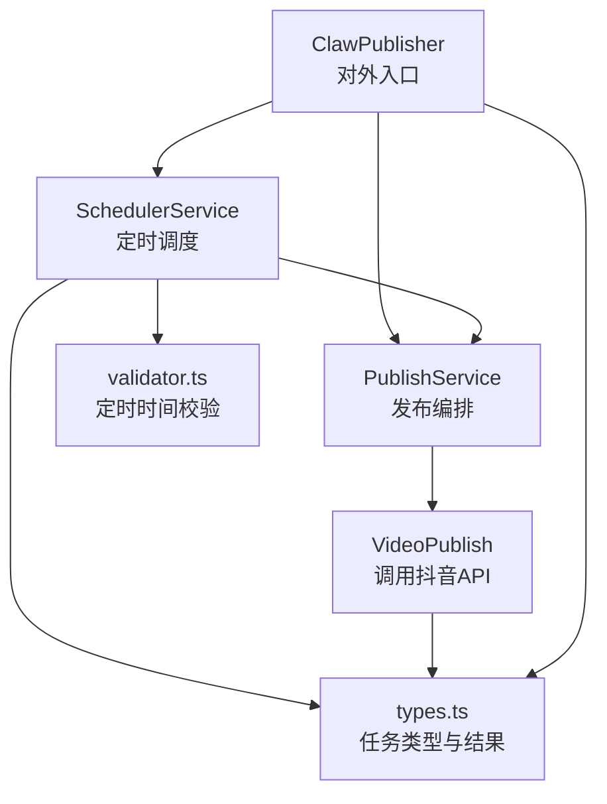
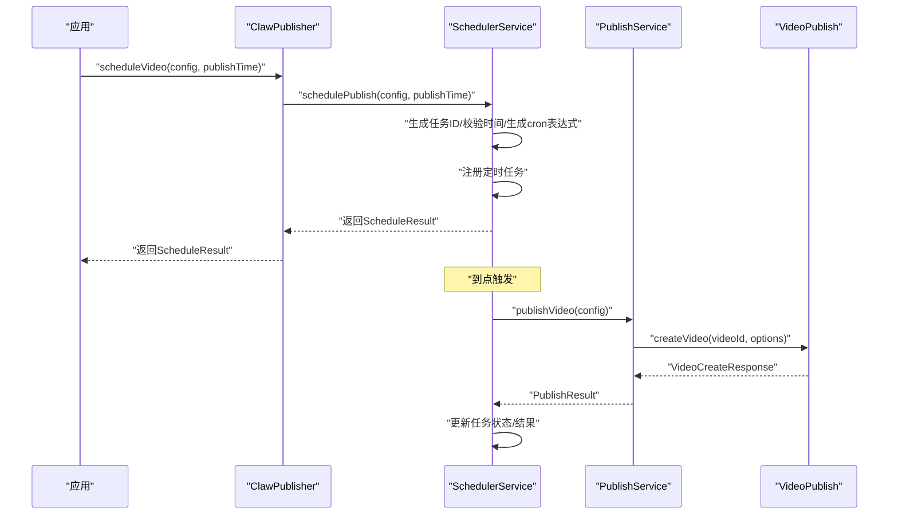
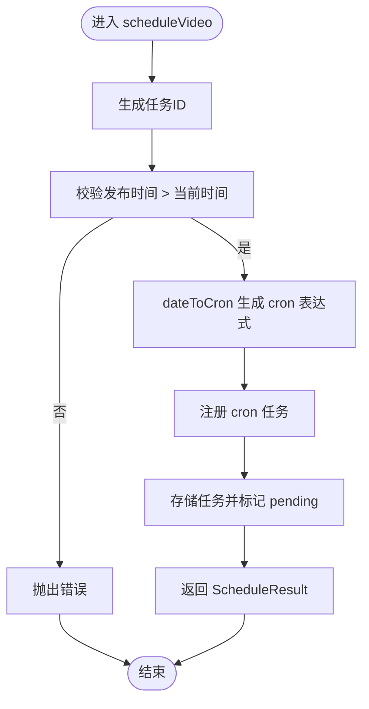
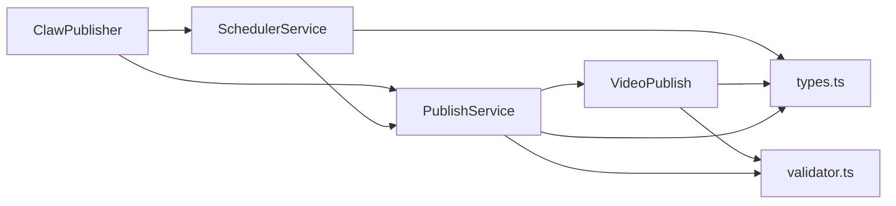

# 定时发布方法

<cite>
**本文引用的文件**
- [src/index.ts](file://src/index.ts)
- [src/services/scheduler-service.ts](file://src/services/scheduler-service.ts)
- [src/services/publish-service.ts](file://src/services/publish-service.ts)
- [src/api/video-publish.ts](file://src/api/video-publish.ts)
- [src/models/types.ts](file://src/models/types.ts)
- [src/utils/validator.ts](file://src/utils/validator.ts)
- [example.ts](file://example.ts)
- [package.json](file://package.json)
</cite>

## 目录
1. [简介](#简介)
2. [项目结构](#项目结构)
3. [核心组件](#核心组件)
4. [架构总览](#架构总览)
5. [详细组件分析](#详细组件分析)
6. [依赖关系分析](#依赖关系分析)
7. [性能与可靠性考量](#性能与可靠性考量)
8. [故障排查指南](#故障排查指南)
9. [结论](#结论)
10. [附录：使用示例与最佳实践](#附录使用示例与最佳实践)

## 简介
本文件面向ClawPublisher的定时发布能力，聚焦以下API方法的完整规范与使用指南：
- scheduleVideo：注册定时发布任务，支持指定发布时间与任务ID生成
- cancelSchedule：取消未执行的定时任务
- listScheduledTasks：查询当前所有待执行的定时任务

文档覆盖功能边界、数据模型、错误处理策略、cron表达式映射、时间计算、任务状态管理与最佳实践，并提供可直接参考的使用示例路径。

## 项目结构
定时发布相关代码主要分布在以下模块：
- 对外入口与聚合：ClawPublisher（统一API入口）
- 调度服务：SchedulerService（基于node-cron的定时任务编排）
- 发布服务：PublishService（上传与发布流程编排）
- 发布API：VideoPublish（调用抖音API进行视频创建）
- 类型定义：types.ts（任务配置、结果、状态等）
- 参数校验：validator.ts（定时发布时间范围等校验）
- 示例：example.ts（定时发布示例）

图表来源
- [src/index.ts:183-210](file://src/index.ts#L183-L210)
- [src/services/scheduler-service.ts:23-72](file://src/services/scheduler-service.ts#L23-L72)
- [src/services/publish-service.ts:38-80](file://src/services/publish-service.ts#L38-L80)
- [src/api/video-publish.ts:30-54](file://src/api/video-publish.ts#L30-L54)
- [src/models/types.ts:184-188](file://src/models/types.ts#L184-L188)
- [src/utils/validator.ts:71-83](file://src/utils/validator.ts#L71-L83)

章节来源
- [src/index.ts:183-210](file://src/index.ts#L183-L210)
- [src/services/scheduler-service.ts:23-72](file://src/services/scheduler-service.ts#L23-L72)
- [src/models/types.ts:184-188](file://src/models/types.ts#L184-L188)

## 核心组件
- ClawPublisher：对外暴露scheduleVideo、cancelSchedule、listScheduledTasks等方法，内部委托SchedulerService完成调度逻辑。
- SchedulerService：负责任务生命周期管理（创建、取消、查询、清理）、cron表达式生成、任务执行与状态更新。
- PublishService：封装上传与发布流程，被调度器在到期时调用。
- VideoPublish：调用抖音API创建视频，支持定时发布时间字段透传。
- 类型系统：ScheduleResult、PublishTaskConfig、VideoPublishOptions等，确保参数与返回值的强类型约束。
- 校验器：validatePublishOptions对定时发布时间进行范围校验（当前时间之后、不超过7天后）。

章节来源
- [src/index.ts:183-210](file://src/index.ts#L183-L210)
- [src/services/scheduler-service.ts:23-72](file://src/services/scheduler-service.ts#L23-L72)
- [src/services/publish-service.ts:38-80](file://src/services/publish-service.ts#L38-L80)
- [src/api/video-publish.ts:118-122](file://src/api/video-publish.ts#L118-L122)
- [src/models/types.ts:184-188](file://src/models/types.ts#L184-L188)
- [src/utils/validator.ts:71-83](file://src/utils/validator.ts#L71-L83)

## 架构总览
定时发布的工作流如下：
- 应用调用ClawPublisher.scheduleVideo，传入任务配置与目标发布时间
- SchedulerService生成唯一任务ID，校验发布时间有效性
- SchedulerService将目标时间转换为cron表达式并注册定时任务
- 到点后，SchedulerService触发执行，调用PublishService.publishVideo
- PublishService完成上传与发布，VideoPublish调用抖音API创建视频
- 任务状态根据发布结果更新为completed或failed；cancelled用于取消

图表来源
- [src/index.ts:191-193](file://src/index.ts#L191-L193)
- [src/services/scheduler-service.ts:37-72](file://src/services/scheduler-service.ts#L37-L72)
- [src/services/publish-service.ts:38-80](file://src/services/publish-service.ts#L38-L80)
- [src/api/video-publish.ts:30-54](file://src/api/video-publish.ts#L30-L54)

## 详细组件分析

### scheduleVideo API
- 功能：注册定时发布任务
- 输入：
  - config：发布任务配置（含视频路径/URL与发布选项）
  - publishTime：目标发布时间（Date对象）
- 输出：
  - ScheduleResult：包含taskId、scheduledTime、status
- 关键行为：
  - 生成唯一任务ID（基于时间戳与随机数）
  - 校验publishTime必须晚于当前时间
  - 将Date转换为cron表达式（分钟、小时、日、月），年固定为“*”
  - 注册node-cron任务，设置时区为Asia/Shanghai
  - 存储任务状态为pending
- 错误处理：
  - 当publishTime早于等于当前时间时抛出错误
  - cron任务异常由node-cron内部处理，SchedulerService在执行阶段捕获并标记为failed

图表来源
- [src/services/scheduler-service.ts:37-72](file://src/services/scheduler-service.ts#L37-L72)
- [src/services/scheduler-service.ts:169-176](file://src/services/scheduler-service.ts#L169-L176)

章节来源
- [src/index.ts:191-193](file://src/index.ts#L191-L193)
- [src/services/scheduler-service.ts:37-72](file://src/services/scheduler-service.ts#L37-L72)
- [src/services/scheduler-service.ts:169-176](file://src/services/scheduler-service.ts#L169-L176)

### cancelSchedule API
- 功能：取消未执行的定时任务
- 输入：taskId（任务ID）
- 输出：boolean（是否成功取消）
- 关键行为：
  - 若任务不存在或状态非pending，则返回false并记录告警
  - 调用cronJob.stop()停止定时器
  - 更新任务状态为cancelled
- 注意事项：
  - 仅pending状态的任务可取消
  - 取消后不会自动清理任务，需调用cleanupCompletedTasks或stopAll按需清理

章节来源
- [src/index.ts:200-202](file://src/index.ts#L200-L202)
- [src/services/scheduler-service.ts:79-97](file://src/services/scheduler-service.ts#L79-L97)

### listScheduledTasks API
- 功能：列出所有待发布的定时任务
- 输出：ScheduleResult[]（按scheduledTime升序排列）
- 关键行为：
  - 遍历内存中的任务集合，过滤并组装返回结果
  - 返回值包含taskId、scheduledTime、status

章节来源
- [src/index.ts:208-210](file://src/index.ts#L208-L210)
- [src/services/scheduler-service.ts:103-115](file://src/services/scheduler-service.ts#L103-L115)

### 任务状态管理
- 状态枚举：pending、completed、failed、cancelled
- 生命周期：
  - 创建：pending
  - 执行：尝试发布，成功则completed，失败则failed
  - 取消：pending状态下可取消为cancelled
  - 清理：completed或cancelled任务可清理

章节来源
- [src/models/types.ts:184-188](file://src/models/types.ts#L184-L188)
- [src/services/scheduler-service.ts:140-162](file://src/services/scheduler-service.ts#L140-L162)
- [src/services/scheduler-service.ts:181-188](file://src/services/scheduler-service.ts#L181-L188)

### cron表达式与时间计算
- cron表达式生成规则：
  - 字段：分钟、小时、日、月、年（固定*）
  - 时区：Asia/Shanghai
- 时间校验：
  - 仅当定时发布时间在当前时间之后且不超过7天后才允许创建任务
  - 该校验同时存在于调度器与发布API参数校验中

章节来源
- [src/services/scheduler-service.ts:169-176](file://src/services/scheduler-service.ts#L169-L176)
- [src/utils/validator.ts:71-83](file://src/utils/validator.ts#L71-L83)
- [src/api/video-publish.ts:118-122](file://src/api/video-publish.ts#L118-L122)

### 任务执行与错误处理
- 执行流程：
  - 到点后，SchedulerService调用PublishService.publishVideo
  - PublishService完成上传与发布，VideoPublish调用抖音API
- 结果判定：
  - 若发布成功，任务状态设为completed；否则设为failed
- 异常处理：
  - 执行过程中抛出的异常会被捕获并记录，任务状态标记为failed

章节来源
- [src/services/scheduler-service.ts:140-162](file://src/services/scheduler-service.ts#L140-L162)
- [src/services/publish-service.ts:38-80](file://src/services/publish-service.ts#L38-L80)
- [src/api/video-publish.ts:30-54](file://src/api/video-publish.ts#L30-L54)

## 依赖关系分析
- 外部依赖：
  - node-cron：用于定时任务调度
  - axios：HTTP请求（由底层API模块使用）
  - winston：日志记录
- 内部依赖：
  - ClawPublisher依赖SchedulerService与PublishService
  - SchedulerService依赖PublishService与types.ts中的类型
  - PublishService依赖VideoPublish与validator.ts
  - VideoPublish依赖validator.ts与types.ts

图表来源
- [src/index.ts:39-64](file://src/index.ts#L39-L64)
- [src/services/scheduler-service.ts:24-29](file://src/services/scheduler-service.ts#L24-L29)
- [src/services/publish-service.ts:22-31](file://src/services/publish-service.ts#L22-L31)
- [src/api/video-publish.ts:15-22](file://src/api/video-publish.ts#L15-L22)
- [package.json:14-20](file://package.json#L14-L20)

章节来源
- [src/index.ts:39-64](file://src/index.ts#L39-L64)
- [package.json:14-20](file://package.json#L14-L20)

## 性能与可靠性考量
- 任务数量与内存占用：
  - 任务以Map存储在内存中，建议定期调用cleanupCompletedTasks或stopAll避免长期运行导致内存增长
- cron调度粒度：
  - cron表达式按“分钟/小时/日/月”触发，建议避免过于密集的定时任务
- 时区一致性：
  - cron时区固定为Asia/Shanghai，确保与业务期望一致
- 并发与幂等：
  - 同一任务重复执行不会重复发布，但建议上层避免并发重复创建相同任务
- 日志与可观测性：
  - 关键操作均记录日志，便于问题定位与审计

[本节为通用指导，无需特定文件引用]

## 故障排查指南
- 无法创建定时任务
  - 检查publishTime是否晚于当前时间
  - 检查是否超过7天限制（若通过VideoPublishOptions传递schedulePublishTime）
- 任务未执行
  - 确认任务状态仍为pending
  - 检查系统时钟与时区设置
  - 查看日志中是否有cron注册与执行记录
- 任务执行失败
  - 查看SchedulerService执行日志中的错误信息
  - 确认网络连通性与抖音API可用性
- 任务无法取消
  - 仅pending状态可取消；若状态已变更，请等待任务完成或手动清理
- 任务列表为空
  - 可能任务已完成或被清理；调用cleanupCompletedTasks或stopAll后重新创建任务

章节来源
- [src/services/scheduler-service.ts:40-43](file://src/services/scheduler-service.ts#L40-L43)
- [src/utils/validator.ts:71-83](file://src/utils/validator.ts#L71-L83)
- [src/services/scheduler-service.ts:79-97](file://src/services/scheduler-service.ts#L79-L97)
- [src/services/scheduler-service.ts:181-188](file://src/services/scheduler-service.ts#L181-L188)

## 结论
ClawPublisher的定时发布能力通过SchedulerService与node-cron实现，具备清晰的任务生命周期与状态管理。结合PublishService与VideoPublish，可在指定时间自动完成视频上传与发布。建议在生产环境中配合任务清理与监控，确保稳定性与可维护性。

[本节为总结，无需特定文件引用]

## 附录：使用示例与最佳实践

### API规范摘要
- scheduleVideo
  - 入参：config（发布任务配置）、publishTime（Date）
  - 出参：ScheduleResult（taskId、scheduledTime、status）
  - 约束：publishTime需晚于当前时间，且不超过7天后
- cancelSchedule
  - 入参：taskId（字符串）
  - 出参：boolean（是否成功）
  - 约束：仅pending状态可取消
- listScheduledTasks
  - 入参：无
  - 出参：ScheduleResult[]（按发布时间升序）

章节来源
- [src/index.ts:191-193](file://src/index.ts#L191-L193)
- [src/index.ts:200-202](file://src/index.ts#L200-L202)
- [src/index.ts:208-210](file://src/index.ts#L208-L210)
- [src/models/types.ts:184-188](file://src/models/types.ts#L184-L188)
- [src/utils/validator.ts:71-83](file://src/utils/validator.ts#L71-L83)

### 使用示例（参考路径）
- 定时发布示例（创建任务、查询任务、可选取消）
  - 示例路径：[example.ts:100-127](file://example.ts#L100-L127)
- 从URL下载并发布（可与定时发布结合）
  - 示例路径：[example.ts:131-143](file://example.ts#L131-L143)
- 完整工作流（包含发布与状态查询）
  - 示例路径：[example.ts:159-193](file://example.ts#L159-L193)

章节来源
- [example.ts:100-127](file://example.ts#L100-L127)
- [example.ts:131-143](file://example.ts#L131-L143)
- [example.ts:159-193](file://example.ts#L159-L193)

### 最佳实践
- 时间选择
  - 使用Date对象精确控制发布时间，确保与Asia/Shanghai时区一致
  - 避免设置过近的时间（建议至少提前几分钟），预留网络与发布流程耗时
- 任务管理
  - 定期调用listScheduledTasks核对任务状态
  - 在应用退出或重启前调用stopAll，确保释放资源
  - 对已完成或取消的任务调用cleanupCompletedTasks进行清理
- 错误处理
  - 对scheduleVideo的异常进行捕获与记录
  - 对cancelSchedule返回值进行判断，避免重复取消
- 参数校验
  - 通过VideoPublishOptions的schedulePublishTime进行二次校验（当前时间之后、不超过7天后）
- 日志与监控
  - 关注SchedulerService与PublishService的日志输出，便于问题定位

[本节为通用指导，无需特定文件引用]