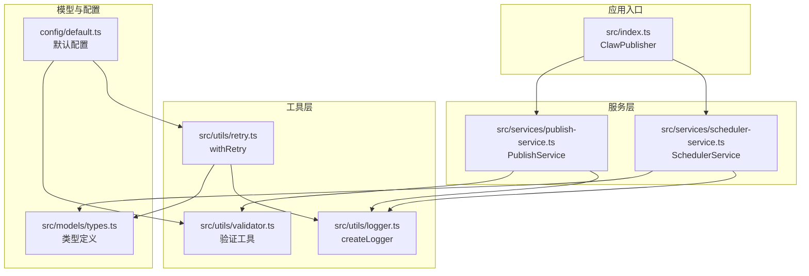
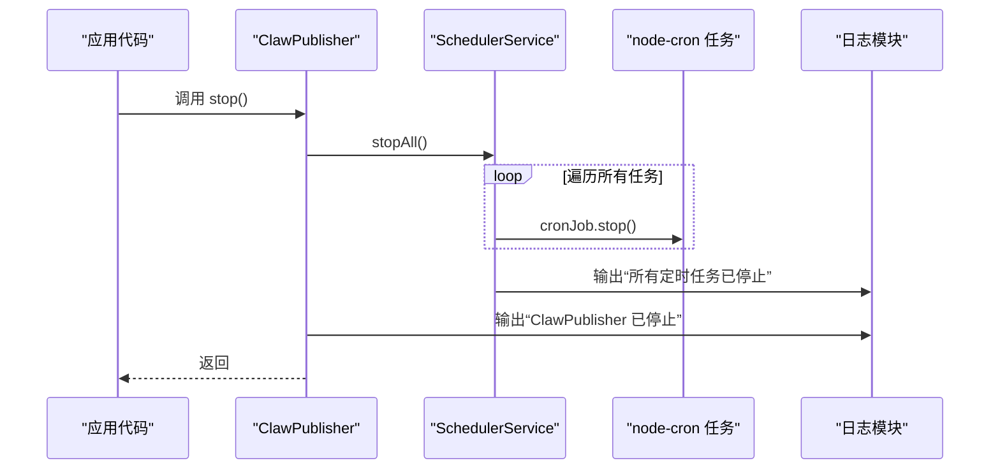
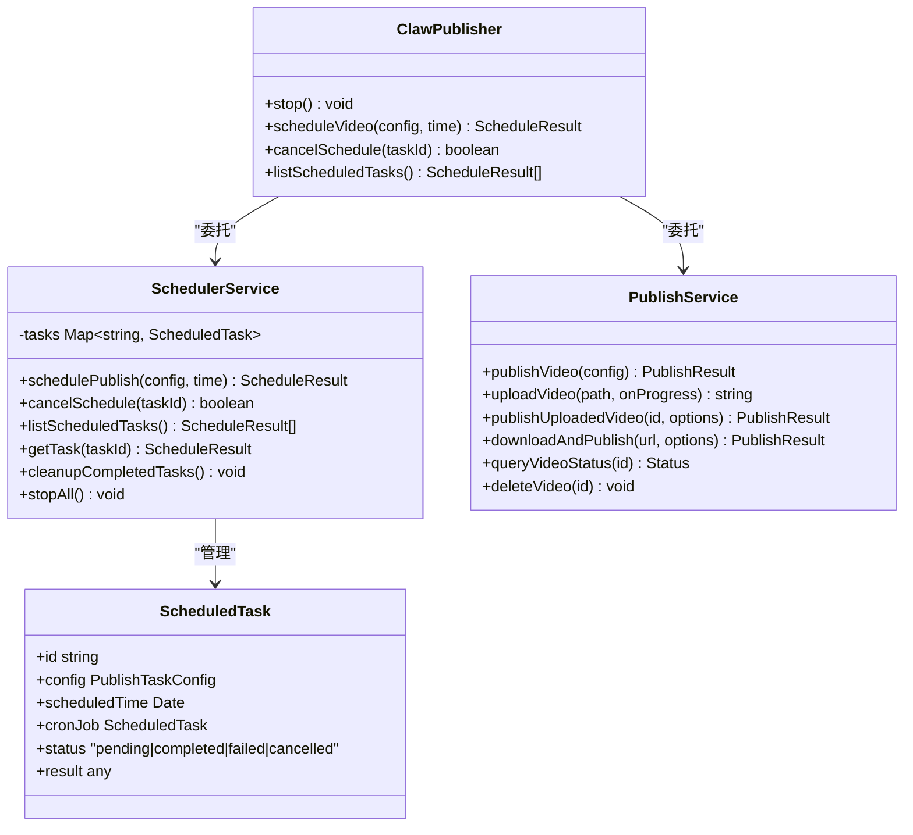
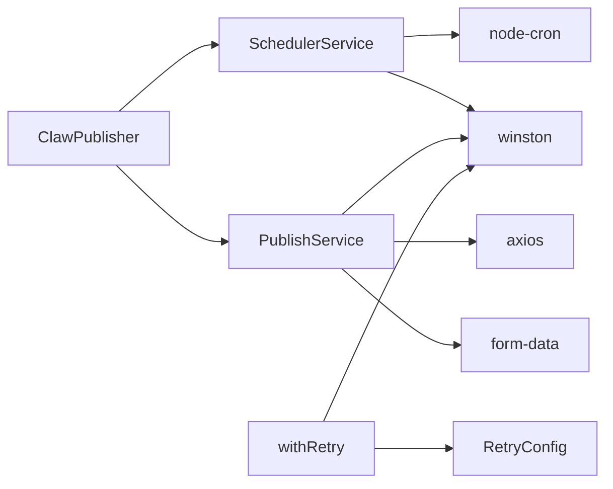

# 工具方法

<cite>
**本文引用的文件**
- [src/index.ts](file://src/index.ts)
- [src/services/scheduler-service.ts](file://src/services/scheduler-service.ts)
- [src/utils/retry.ts](file://src/utils/retry.ts)
- [src/utils/logger.ts](file://src/utils/logger.ts)
- [src/models/types.ts](file://src/models/types.ts)
- [config/default.ts](file://config/default.ts)
- [example.ts](file://example.ts)
- [tests/unit/retry.test.ts](file://tests/unit/retry.test.ts)
- [package.json](file://package.json)
</cite>

## 目录
1. [简介](#简介)
2. [项目结构](#项目结构)
3. [核心组件](#核心组件)
4. [架构总览](#架构总览)
5. [详细组件分析](#详细组件分析)
6. [依赖分析](#依赖分析)
7. [性能考虑](#性能考虑)
8. [故障排查指南](#故障排查指南)
9. [结论](#结论)
10. [附录](#附录)

## 简介
本章节聚焦于ClawPublisher中的工具方法，特别是stop方法的完整API规范与实现原理。stop方法用于优雅地停止所有定时任务，确保系统在退出或重启前释放相关资源，避免未完成任务造成资源泄漏或重复执行。本文将详细说明：
- stop方法的完整API规范与行为
- 停止所有定时任务的功能、使用场景与注意事项
- 优雅关闭的实现原理与资源清理策略
- 工具方法的使用示例与系统集成最佳实践

## 项目结构
ClawPublisher采用分层架构，工具方法位于顶层聚合器ClawPublisher中，内部委托给调度服务SchedulerService以停止所有定时任务，并通过日志模块输出操作日志。重试工具与验证工具分别位于独立的工具模块中，为业务流程提供可靠性保障。

图表来源
- [src/index.ts:29-247](file://src/index.ts#L29-L247)
- [src/services/scheduler-service.ts:23-201](file://src/services/scheduler-service.ts#L23-L201)
- [src/utils/retry.ts:1-83](file://src/utils/retry.ts#L1-L83)
- [src/utils/logger.ts:1-61](file://src/utils/logger.ts#L1-L61)
- [src/models/types.ts:1-201](file://src/models/types.ts#L1-L201)
- [config/default.ts:1-49](file://config/default.ts#L1-L49)

章节来源
- [src/index.ts:1-248](file://src/index.ts#L1-L248)
- [package.json:1-34](file://package.json#L1-L34)

## 核心组件
- ClawPublisher：对外统一入口，封装stop方法以停止所有定时任务；同时提供认证、上传、发布、定时发布等能力。
- SchedulerService：负责定时任务的注册、执行、取消与停止；stopAll方法遍历并停止所有已注册的cron任务。
- withRetry：带指数退避的重试工具，用于增强网络请求或外部依赖的稳定性。
- 日志模块：统一的日志输出，便于追踪stop与任务生命周期事件。

章节来源
- [src/index.ts:29-247](file://src/index.ts#L29-L247)
- [src/services/scheduler-service.ts:23-201](file://src/services/scheduler-service.ts#L23-L201)
- [src/utils/retry.ts:1-83](file://src/utils/retry.ts#L1-L83)
- [src/utils/logger.ts:1-61](file://src/utils/logger.ts#L1-L61)

## 架构总览
下图展示stop方法的调用链路与职责分工，体现“优雅关闭”的实现思路。

图表来源
- [src/index.ts:240-243](file://src/index.ts#L240-L243)
- [src/services/scheduler-service.ts:193-198](file://src/services/scheduler-service.ts#L193-L198)

## 详细组件分析

### stop方法API规范
- 方法签名
  - 名称：stop
  - 所属：ClawPublisher
  - 返回值：void
- 功能
  - 停止SchedulerService中所有已注册的定时任务
  - 输出“ClawPublisher 已停止”日志
- 参数
  - 无
- 异常
  - 不抛出异常；若无任务则静默处理
- 典型调用场景
  - 应用优雅退出（如收到SIGTERM/SIGINT）
  - 系统维护或热更新前的资源回收
  - 测试环境销毁实例时的安全收尾

章节来源
- [src/index.ts:237-243](file://src/index.ts#L237-L243)

### stopAll实现原理与资源清理策略
- 实现要点
  - 遍历SchedulerService内部存储的所有任务
  - 对每个任务调用其cronJob.stop()以终止定时触发
  - 通过日志记录停止动作，便于监控与审计
- 资源清理
  - cron任务停止后不再触发，避免后台线程占用
  - 任务对象仍保留在内存中，但状态标记为“已停止”，便于后续查询
  - 若需彻底释放内存，可结合业务逻辑在适当时机清理任务集合
- 注意事项
  - stopAll不保证任务执行过程中的事务一致性；建议在停止前确保无正在进行的长耗时任务
  - 若任务处于执行中，stop仅阻止后续触发，不会中断已执行的逻辑

章节来源
- [src/services/scheduler-service.ts:190-198](file://src/services/scheduler-service.ts#L190-L198)

### 优雅关闭与最佳实践
- 何时调用
  - 在进程退出钩子中调用stop，确保所有定时任务被停止
  - 在系统重启或热更新前调用，避免任务重复执行
- 集成步骤
  - 在应用启动时创建ClawPublisher实例
  - 在信号监听中调用stop，随后退出进程
  - 如需持久化任务状态，可在stop后进行状态落盘
- 示例参考
  - 参考示例文件中的整体工作流，结合stop在退出阶段的调用位置

章节来源
- [example.ts:1-197](file://example.ts#L1-L197)

### 与重试工具的协同
- withRetry的作用
  - 为网络请求或外部依赖提供指数退避重试，提升系统鲁棒性
  - 与stop配合时，若重试过程中触发stop，后续重试将不再继续
- 使用建议
  - 对易失败的外部调用使用withRetry包装
  - 在stop前后避免并发修改任务状态，保持幂等

章节来源
- [src/utils/retry.ts:1-83](file://src/utils/retry.ts#L1-L83)
- [tests/unit/retry.test.ts:1-106](file://tests/unit/retry.test.ts#L1-L106)

### 类关系与数据结构

图表来源
- [src/index.ts:29-247](file://src/index.ts#L29-L247)
- [src/services/scheduler-service.ts:11-198](file://src/services/scheduler-service.ts#L11-L198)
- [src/services/publish-service.ts:22-228](file://src/services/publish-service.ts#L22-L228)
- [src/models/types.ts:158-188](file://src/models/types.ts#L158-L188)

## 依赖分析
- 外部依赖
  - node-cron：用于定时任务调度与停止
  - winston：统一日志输出
  - axios/form-data：HTTP请求与分片上传
- 内部依赖
  - ClawPublisher依赖SchedulerService与PublishService
  - SchedulerService依赖node-cron与日志模块
  - PublishService依赖验证工具与日志模块
  - withRetry依赖日志模块与类型定义

图表来源
- [src/index.ts:1-20](file://src/index.ts#L1-L20)
- [src/services/scheduler-service.ts:1-6](file://src/services/scheduler-service.ts#L1-L6)
- [src/services/publish-service.ts:1-15](file://src/services/publish-service.ts#L1-L15)
- [src/utils/retry.ts:1-4](file://src/utils/retry.ts#L1-L4)
- [package.json:14-20](file://package.json#L14-L20)

章节来源
- [package.json:1-34](file://package.json#L1-L34)

## 性能考虑
- stopAll的时间复杂度
  - O(n)，其中n为已注册任务数量
  - 每个任务调用cronJob.stop()，属于常数时间操作
- 建议
  - 控制任务规模，避免一次性注册过多定时任务
  - 在高并发场景下，stop与任务执行可能并发进行，建议在停止前进行状态检查与幂等处理

## 故障排查指南
- 现象：stop后仍有任务触发
  - 检查是否在stop前已取消或完成的任务仍在内存中
  - 确认stopAll是否被正确调用
- 现象：日志缺失
  - 检查LOG_LEVEL环境变量是否影响日志输出
  - 确认winston配置是否正确加载
- 现象：重试导致stop无效
  - withRetry在重试期间不会阻断stop调用，但后续重试不会再继续
  - 建议在重试逻辑中显式检测停止标志或上下文取消

章节来源
- [src/utils/logger.ts:1-61](file://src/utils/logger.ts#L1-L61)
- [src/utils/retry.ts:1-83](file://src/utils/retry.ts#L1-L83)

## 结论
stop方法提供了ClawPublisher中定时任务的统一停止入口，通过委托SchedulerService逐个停止cron任务并输出日志，实现了简洁而可靠的优雅关闭。结合withRetry与日志模块，系统在稳定性与可观测性方面得到良好保障。实际使用中，建议在应用退出钩子中调用stop，并根据业务需求进行状态落盘与资源回收。

## 附录
- 使用示例参考
  - 示例文件展示了完整的发布流程与定时发布示例，可据此在退出阶段调用stop
- 关键类型参考
  - 任务状态与结果类型定义，便于理解stop后的状态变化

章节来源
- [example.ts:1-197](file://example.ts#L1-L197)
- [src/models/types.ts:182-188](file://src/models/types.ts#L182-L188)