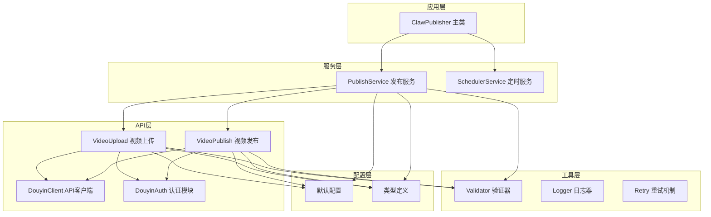
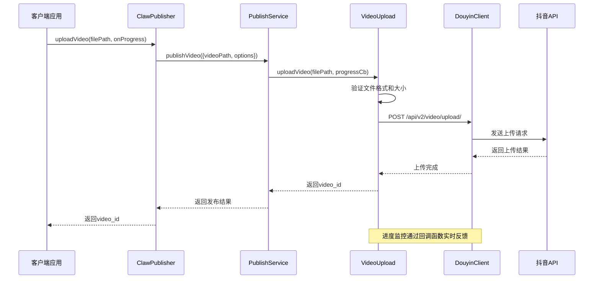
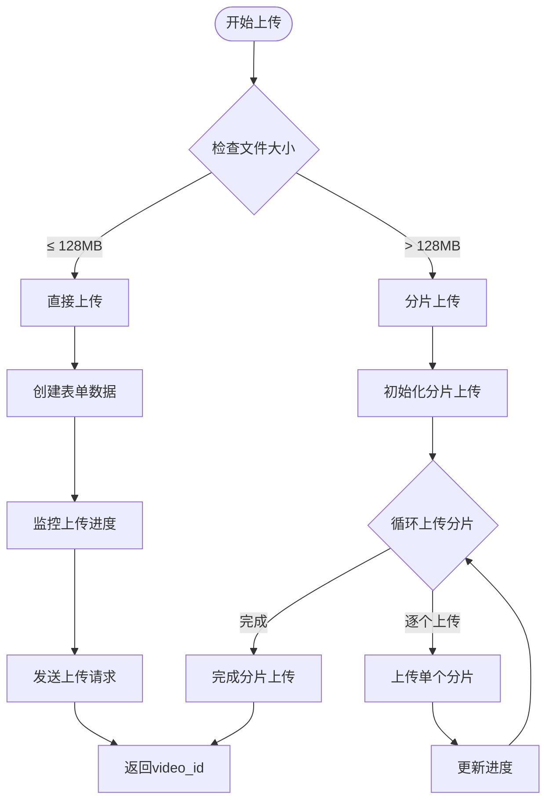
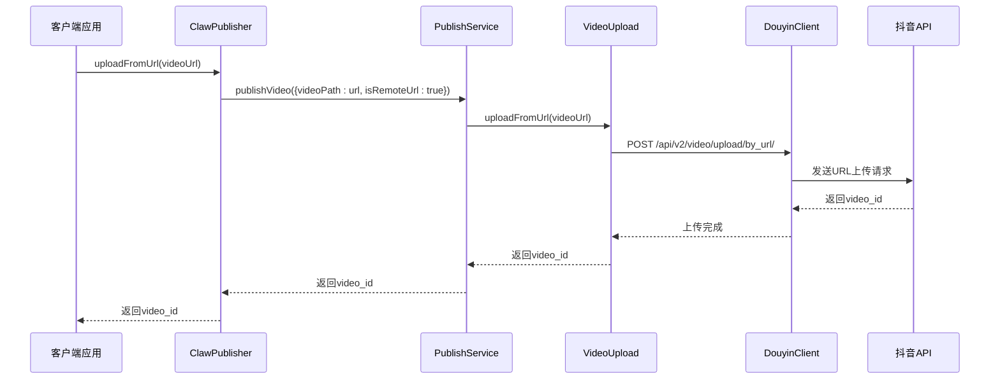
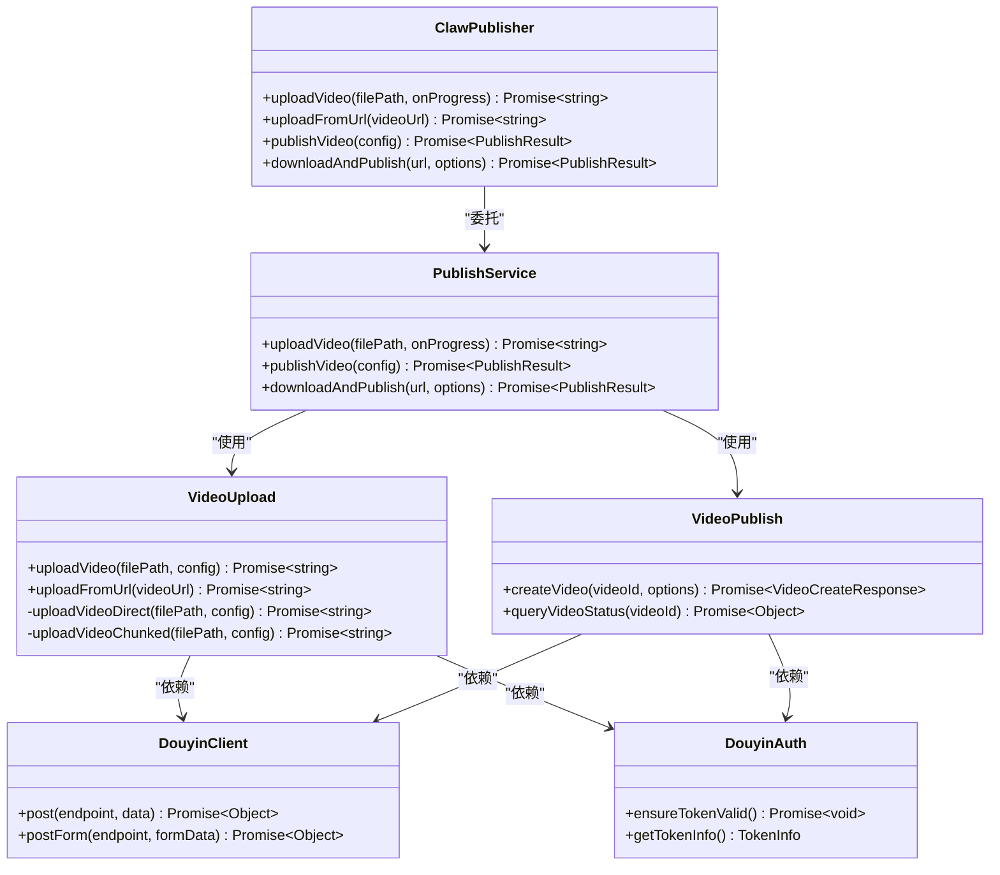

# 视频上传方法

<cite>
**本文档引用的文件**
- [video-upload.ts](file://src/api/video-upload.ts)
- [types.ts](file://src/models/types.ts)
- [default.ts](file://config/default.ts)
- [validator.ts](file://src/utils/validator.ts)
- [publish-service.ts](file://src/services/publish-service.ts)
- [index.ts](file://src/index.ts)
- [example.ts](file://example.ts)
</cite>

## 目录
1. [简介](#简介)
2. [项目结构](#项目结构)
3. [核心组件](#核心组件)
4. [架构概览](#架构概览)
5. [详细组件分析](#详细组件分析)
6. [依赖关系分析](#依赖关系分析)
7. [性能考虑](#性能考虑)
8. [故障排除指南](#故障排除指南)
9. [结论](#结论)
10. [附录](#附录)

## 简介
本文档为ClawPublisher的视频上传方法提供详细的API规范文档，重点覆盖uploadVideo和uploadFromUrl两个核心方法。文档将详细说明文件上传和URL上传两种方式的参数、回调函数、返回值和使用场景，包含进度监控回调的使用方法、错误处理策略和性能优化建议，并提供完整的代码示例展示不同上传方式的实现和集成模式。

## 项目结构
ClawPublisher采用模块化设计，主要分为以下几个层次：



**图表来源**
- [index.ts:29-67](file://src/index.ts#L29-L67)
- [publish-service.ts:22-31](file://src/services/publish-service.ts#L22-L31)
- [video-upload.ts:20-27](file://src/api/video-upload.ts#L20-L27)

**章节来源**
- [index.ts:1-248](file://src/index.ts#L1-L248)
- [publish-service.ts:1-228](file://src/services/publish-service.ts#L1-L228)

## 核心组件
本节详细介绍视频上传相关的三个核心组件及其职责分工：

### VideoUpload - 视频上传模块
负责具体的视频上传逻辑，包括：
- 文件上传（直接上传和分片上传）
- URL上传
- 进度监控
- 错误处理

### PublishService - 发布服务
作为业务编排层，协调上传和发布流程：
- 统一的发布接口
- 上传和发布的组合操作
- 进度回调转发
- 结果聚合

### ClawPublisher - 主控制器
对外提供统一的API接口：
- 简化的上传接口
- 完整的发布流程
- 认证管理
- 定时发布

**章节来源**
- [video-upload.ts:20-241](file://src/api/video-upload.ts#L20-L241)
- [publish-service.ts:22-228](file://src/services/publish-service.ts#L22-L228)
- [index.ts:29-244](file://src/index.ts#L29-L244)

## 架构概览
视频上传系统的整体架构采用分层设计，确保了高内聚低耦合：



**图表来源**
- [index.ts:122-127](file://src/index.ts#L122-L127)
- [publish-service.ts:38-80](file://src/services/publish-service.ts#L38-L80)
- [video-upload.ts:35-54](file://src/api/video-upload.ts#L35-L54)

## 详细组件分析

### uploadVideo 方法详解

#### 方法签名与参数
```typescript
async uploadVideo(
  filePath: string,
  onProgress?: (progress: UploadProgress) => void
): Promise<string>
```

**参数说明：**
- `filePath`: 必填，视频文件的绝对路径
- `onProgress`: 可选，进度回调函数，接收UploadProgress对象

**返回值：**
- `Promise<string>`: 成功时返回视频ID，失败时抛出异常

#### 上传策略选择
系统根据文件大小自动选择最优上传方式：



**图表来源**
- [video-upload.ts:48-54](file://src/api/video-upload.ts#L48-L54)
- [default.ts:10-15](file://config/default.ts#L10-L15)

#### 直接上传流程（< 128MB）
直接上传适用于小文件，使用单次HTTP请求完成整个上传过程：

**章节来源**
- [video-upload.ts:62-96](file://src/api/video-upload.ts#L62-L96)

#### 分片上传流程（≥ 128MB）
分片上传适用于大文件，将文件分割为多个分片并行上传：

**章节来源**
- [video-upload.ts:104-152](file://src/api/video-upload.ts#L104-L152)

### uploadFromUrl 方法详解

#### 方法签名与参数
```typescript
async uploadFromUrl(videoUrl: string): Promise<string>
```

**参数说明：**
- `videoUrl`: 必填，远程视频文件的URL地址

**返回值：**
- `Promise<string>`: 成功时返回视频ID，失败时抛出异常

#### URL上传工作流程
URL上传采用直接请求的方式，无需本地存储：



**图表来源**
- [index.ts:134-144](file://src/index.ts#L134-L144)
- [publish-service.ts:49-50](file://src/services/publish-service.ts#L49-L50)
- [video-upload.ts:220-237](file://src/api/video-upload.ts#L220-L237)

**章节来源**
- [video-upload.ts:220-237](file://src/api/video-upload.ts#L220-L237)

### UploadProgress 类型定义

#### 进度监控数据结构
```typescript
interface UploadProgress {
  loaded: number;      // 已上传字节数
  total: number;       // 文件总字节数
  percentage: number;  // 上传百分比 (0-100)
}
```

#### 进度回调使用示例
```typescript
const videoId = await publisher.uploadVideo(
  '/path/to/video.mp4',
  (progress) => {
    console.log(`上传进度: ${progress.percentage}%`);
    console.log(`已上传: ${formatBytes(progress.loaded)}`);
    console.log(`总大小: ${formatBytes(progress.total)}`);
  }
);
```

**章节来源**
- [types.ts:61-65](file://src/models/types.ts#L61-L65)
- [example.ts:43-48](file://example.ts#L43-L48)

## 依赖关系分析

### 核心依赖关系图


**图表来源**
- [index.ts:29-67](file://src/index.ts#L29-L67)
- [publish-service.ts:22-31](file://src/services/publish-service.ts#L22-L31)
- [video-upload.ts:20-27](file://src/api/video-upload.ts#L20-L27)
- [video-publish.ts:15-22](file://src/api/video-publish.ts#L15-L22)

### 配置依赖关系
系统配置通过常量文件集中管理：

**章节来源**
- [default.ts:10-31](file://config/default.ts#L10-L31)
- [video-upload.ts:11](file://src/api/video-upload.ts#L11)

## 性能考虑

### 上传策略优化
1. **智能分片选择**：根据文件大小自动选择最优上传方式
2. **内存效率**：分片上传使用流式读取，避免大文件占用过多内存
3. **并发控制**：单文件分片上传按顺序进行，确保数据一致性

### 配置参数调优
- **分片大小**：默认5MB，可根据网络环境调整
- **上传阈值**：128MB，平衡上传成功率和性能
- **重试机制**：最多3次重试，基础延迟1秒

### 缓存和资源管理
- **临时文件清理**：下载完成后自动删除临时文件
- **连接复用**：使用持久连接减少建立连接的开销
- **进度监控**：实时反馈上传进度，提升用户体验

**章节来源**
- [default.ts:17-24](file://config/default.ts#L17-L24)
- [publish-service.ts:166-171](file://src/services/publish-service.ts#L166-L171)

## 故障排除指南

### 常见错误类型及处理

#### 文件验证错误
```typescript
// 错误类型：ValidationError
try {
  const videoId = await publisher.uploadVideo('/path/to/video.mp4');
} catch (error) {
  if (error instanceof ValidationError) {
    console.error('文件验证失败:', error.message);
    // 处理文件格式或大小问题
  }
}
```

#### 上传失败处理
```typescript
// 重试机制
const maxRetries = 3;
let lastError;

for (let i = 0; i < maxRetries; i++) {
  try {
    const videoId = await publisher.uploadVideo(filePath);
    break;
  } catch (error) {
    lastError = error;
    if (i < maxRetries - 1) {
      await sleep(Math.pow(2, i) * 1000); // 指数退避
    }
  }
}
```

#### 进度监控异常
```typescript
// 进度回调异常处理
const safeProgressCallback = (progress) => {
  try {
    // 处理进度更新
    updateProgressBar(progress.percentage);
  } catch (error) {
    console.warn('进度回调异常:', error.message);
    // 继续上传流程
  }
};
```

### 错误处理最佳实践

#### 重试策略
```typescript
// 指数退避重试
function exponentialBackoffRetry(fn, maxRetries = 3) {
  return async function(...args) {
    let lastError;
    
    for (let i = 0; i < maxRetries; i++) {
      try {
        return await fn(...args);
      } catch (error) {
        lastError = error;
        if (i < maxRetries - 1) {
          await sleep(Math.pow(2, i) * 1000);
        }
      }
    }
    
    throw lastError;
  };
}
```

#### 超时处理
```typescript
// 上传超时控制
function withTimeout(promise, timeoutMs) {
  return Promise.race([
    promise,
    new Promise((_, reject) => 
      setTimeout(() => reject(new Error('上传超时')), timeoutMs)
    )
  ]);
}
```

**章节来源**
- [validator.ts:10-15](file://src/utils/validator.ts#L10-L15)
- [default.ts:17-24](file://config/default.ts#L17-L24)

## 结论
ClawPublisher的视频上传方法提供了完整的文件上传和URL上传解决方案。通过智能的上传策略选择、完善的进度监控机制和健壮的错误处理体系，系统能够适应各种使用场景和网络环境。

关键优势包括：
- **自动化上传策略**：根据文件大小自动选择最优上传方式
- **实时进度反馈**：提供精确的上传进度监控
- **灵活的错误处理**：支持重试机制和超时控制
- **统一的API接口**：简化了复杂的上传发布流程

建议在实际使用中：
1. 根据网络环境调整分片大小配置
2. 实现适当的重试和超时机制
3. 使用进度回调提升用户体验
4. 在生产环境中启用详细的日志记录

## 附录

### API参考表格

#### uploadVideo 方法
| 参数 | 类型 | 必填 | 描述 |
|------|------|------|------|
| filePath | string | 是 | 视频文件路径 |
| onProgress | (progress: UploadProgress) => void | 否 | 进度回调函数 |

| 返回值 | 类型 | 描述 |
|--------|------|------|
| Promise<string> | string | 视频ID |

#### uploadFromUrl 方法
| 参数 | 类型 | 必填 | 描述 |
|------|------|------|------|
| videoUrl | string | 是 | 远程视频URL |

| 返回值 | 类型 | 描述 |
|--------|------|------|
| Promise<string> | string | 视频ID |

### 使用示例

#### 基础文件上传
```typescript
// 基础文件上传示例
const videoId = await publisher.uploadVideo(
  '/path/to/video.mp4',
  (progress) => {
    console.log(`${progress.percentage}% 完成`);
  }
);
```

#### URL上传示例
```typescript
// URL上传示例
const videoId = await publisher.uploadFromUrl(
  'https://example.com/video.mp4'
);
```

#### 完整发布流程
```typescript
// 完整的一站式发布
const result = await publisher.publishVideo({
  videoPath: '/path/to/video.mp4',
  options: {
    title: '视频标题',
    description: '视频描述',
    hashtags: ['标签1', '标签2']
  }
});
```

**章节来源**
- [example.ts:41-75](file://example.ts#L41-L75)
- [example.ts:129-143](file://example.ts#L129-L143)