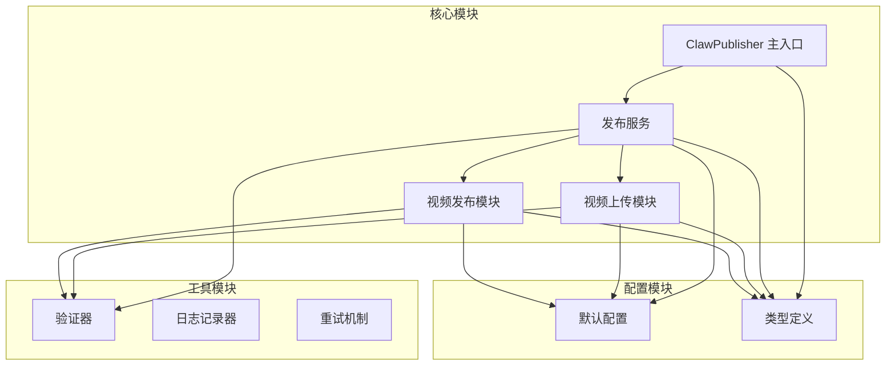
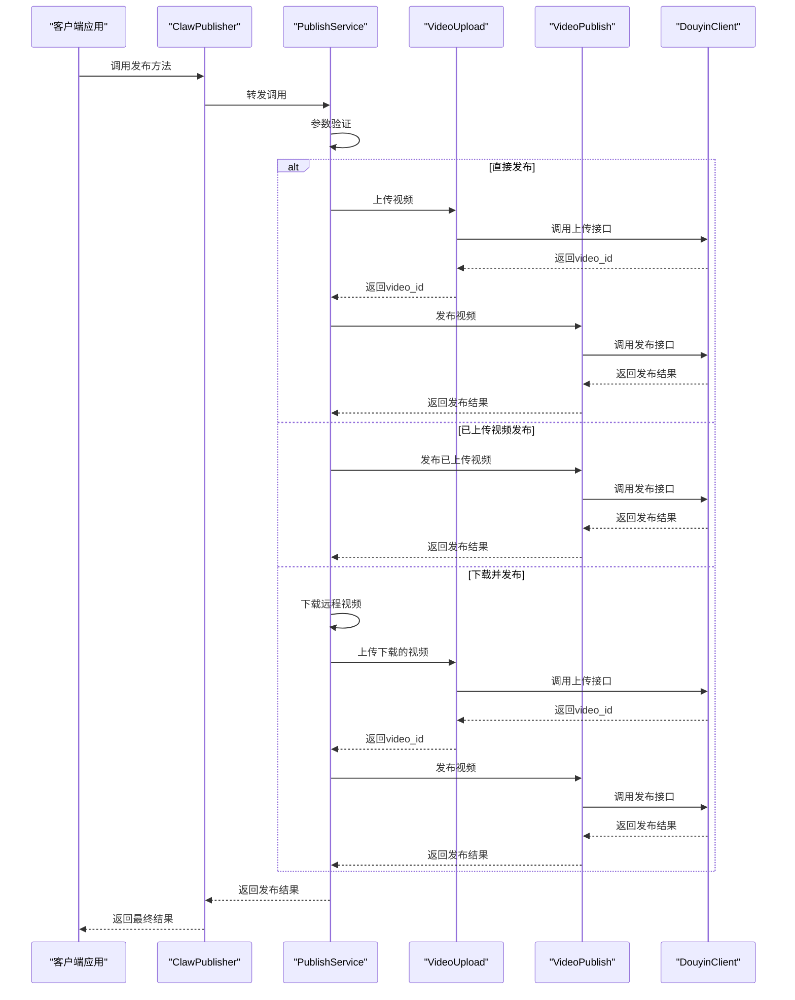
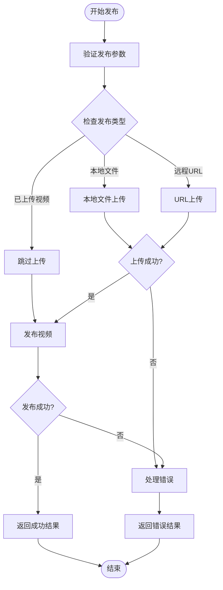
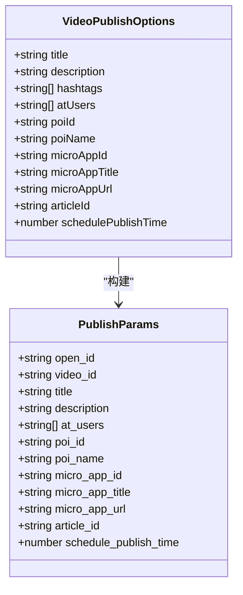
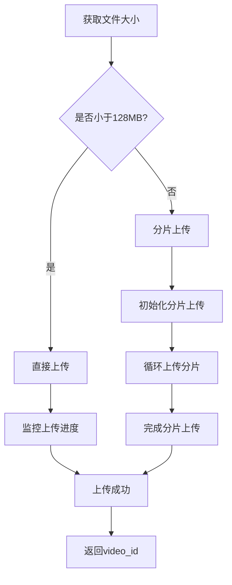
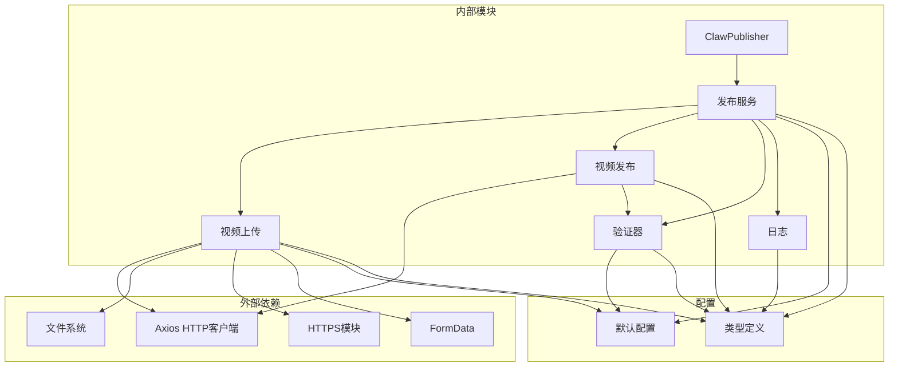

# 视频发布方法

<cite>
**本文引用的文件**
- [src/index.ts](file://src/index.ts)
- [src/api/video-publish.ts](file://src/api/video-publish.ts)
- [src/services/publish-service.ts](file://src/services/publish-service.ts)
- [src/api/video-upload.ts](file://src/api/video-upload.ts)
- [src/models/types.ts](file://src/models/types.ts)
- [src/utils/validator.ts](file://src/utils/validator.ts)
- [config/default.ts](file://config/default.ts)
- [example.ts](file://example.ts)
- [tests/unit/video-publish.test.ts](file://tests/unit/video-publish.test.ts)
- [tests/fixtures/mock-responses.ts](file://tests/fixtures/mock-responses.ts)
</cite>

## 目录
1. [简介](#简介)
2. [项目结构](#项目结构)
3. [核心组件](#核心组件)
4. [架构概览](#架构概览)
5. [详细组件分析](#详细组件分析)
6. [依赖关系分析](#依赖关系分析)
7. [性能考虑](#性能考虑)
8. [故障排除指南](#故障排除指南)
9. [结论](#结论)
10. [附录](#附录)

## 简介
本文档详细记录了ClawPublisher的视频发布方法，包括publishVideo、publishUploadedVideo、downloadAndPublish等核心API的完整规范。文档涵盖了发布配置参数、视频ID参数、发布选项和返回结果格式，并提供了不同发布场景的使用示例，包括直接发布、已上传视频发布、远程下载发布等。同时提供了发布流程的最佳实践和错误处理指南。

## 项目结构
ClawPublisher采用模块化设计，主要包含以下核心模块：



**图表来源**
- [src/index.ts:29-67](file://src/index.ts#L29-L67)
- [src/services/publish-service.ts:22-31](file://src/services/publish-service.ts#L22-L31)
- [src/api/video-upload.ts:20-27](file://src/api/video-upload.ts#L20-L27)
- [src/api/video-publish.ts:15-22](file://src/api/video-publish.ts#L15-L22)

**章节来源**
- [src/index.ts:29-67](file://src/index.ts#L29-L67)
- [src/services/publish-service.ts:22-31](file://src/services/publish-service.ts#L22-L31)
- [src/api/video-upload.ts:20-27](file://src/api/video-upload.ts#L20-L27)
- [src/api/video-publish.ts:15-22](file://src/api/video-publish.ts#L15-L22)

## 核心组件
本项目的核心组件包括ClawPublisher主类、发布服务、视频上传模块和视频发布模块。每个组件都有明确的职责分工和清晰的接口定义。

**章节来源**
- [src/index.ts:29-244](file://src/index.ts#L29-L244)
- [src/services/publish-service.ts:22-224](file://src/services/publish-service.ts#L22-L224)
- [src/api/video-upload.ts:20-241](file://src/api/video-upload.ts#L20-L241)
- [src/api/video-publish.ts:15-174](file://src/api/video-publish.ts#L15-L174)

## 架构概览
ClawPublisher采用分层架构设计，实现了业务逻辑与技术细节的分离：



**图表来源**
- [src/index.ts:153-181](file://src/index.ts#L153-L181)
- [src/services/publish-service.ts:38-80](file://src/services/publish-service.ts#L38-L80)
- [src/api/video-upload.ts:35-54](file://src/api/video-upload.ts#L35-L54)
- [src/api/video-publish.ts:30-54](file://src/api/video-publish.ts#L30-L54)

## 详细组件分析

### ClawPublisher 主类
ClawPublisher是整个系统的主入口，提供了统一的对外接口。它封装了认证、上传、发布、定时发布等功能，并提供了简洁易用的API。

#### 核心方法
- **publishVideo**: 一站式发布视频（上传 + 发布）
- **publishUploadedVideo**: 发布已上传的视频
- **downloadAndPublish**: 下载远程视频并发布
- **uploadVideo**: 上传本地视频文件
- **uploadFromUrl**: 从URL上传视频
- **scheduleVideo**: 定时发布视频

**章节来源**
- [src/index.ts:153-181](file://src/index.ts#L153-L181)
- [src/index.ts:122-144](file://src/index.ts#L122-L144)
- [src/index.ts:185-210](file://src/index.ts#L185-L210)

### 发布服务 (PublishService)
发布服务作为业务编排层，协调视频上传和发布的各个步骤，提供了完整的发布流程管理。

#### 发布流程


**图表来源**
- [src/services/publish-service.ts:38-80](file://src/services/publish-service.ts#L38-L80)
- [src/services/publish-service.ts:101-125](file://src/services/publish-service.ts#L101-L125)
- [src/services/publish-service.ts:133-172](file://src/services/publish-service.ts#L133-L172)

**章节来源**
- [src/services/publish-service.ts:38-80](file://src/services/publish-service.ts#L38-L80)
- [src/services/publish-service.ts:101-125](file://src/services/publish-service.ts#L101-L125)
- [src/services/publish-service.ts:133-172](file://src/services/publish-service.ts#L133-L172)

### 视频发布模块 (VideoPublish)
视频发布模块负责与抖音API的直接交互，处理视频创建、状态查询和删除操作。

#### 发布参数构建


**图表来源**
- [src/api/video-publish.ts:62-125](file://src/api/video-publish.ts#L62-L125)
- [src/models/types.ts:101-124](file://src/models/types.ts#L101-L124)

**章节来源**
- [src/api/video-publish.ts:62-125](file://src/api/video-publish.ts#L62-L125)
- [src/models/types.ts:101-124](file://src/models/types.ts#L101-L124)

### 视频上传模块 (VideoUpload)
视频上传模块支持两种上传方式：直接上传和分片上传，根据文件大小自动选择最优方案。

#### 上传策略


**图表来源**
- [src/api/video-upload.ts:35-54](file://src/api/video-upload.ts#L35-L54)
- [src/api/video-upload.ts:104-152](file://src/api/video-upload.ts#L104-L152)

**章节来源**
- [src/api/video-upload.ts:35-54](file://src/api/video-upload.ts#L35-L54)
- [src/api/video-upload.ts:104-152](file://src/api/video-upload.ts#L104-L152)

## 依赖关系分析



**图表来源**
- [src/index.ts:1-248](file://src/index.ts#L1-L248)
- [src/services/publish-service.ts:1-224](file://src/services/publish-service.ts#L1-L224)
- [src/api/video-upload.ts:1-241](file://src/api/video-upload.ts#L1-L241)
- [src/api/video-publish.ts:1-174](file://src/api/video-publish.ts#L1-L174)

**章节来源**
- [src/index.ts:1-248](file://src/index.ts#L1-L248)
- [src/services/publish-service.ts:1-224](file://src/services/publish-service.ts#L1-L224)
- [src/api/video-upload.ts:1-241](file://src/api/video-upload.ts#L1-L241)
- [src/api/video-publish.ts:1-174](file://src/api/video-publish.ts#L1-L174)

## 性能考虑
基于代码分析，ClawPublisher在性能方面采用了多种优化策略：

### 上传性能优化
- **智能上传策略**: 根据文件大小自动选择直接上传或分片上传，避免大文件传输问题
- **进度监控**: 提供实时上传进度反馈，提升用户体验
- **内存管理**: 分片上传采用流式处理，避免内存溢出

### 错误处理策略
- **参数验证**: 在发布前进行严格的参数验证，减少API调用失败
- **日志记录**: 完善的日志系统，便于问题诊断和性能监控
- **异常捕获**: 统一的异常处理机制，确保系统稳定性

### 最佳实践建议
1. **合理设置分片大小**: 对于大文件，建议使用默认的5MB分片大小
2. **监控网络状况**: 在弱网环境下优先使用分片上传
3. **及时清理临时文件**: 下载并发布模式会自动清理临时文件
4. **参数验证**: 发布前确保所有参数符合要求

## 故障排除指南

### 常见错误类型
根据代码中的错误处理机制，可能遇到以下类型的错误：

#### 参数验证错误
- **视频格式错误**: 不支持的视频格式
- **文件大小超限**: 超过最大文件大小限制
- **标题过长**: 超过最大标题长度
- **描述过长**: 超过最大描述长度
- **Hashtag数量过多**: 超过最大数量限制
- **定时发布时间无效**: 时间早于当前时间或超过7天后

#### 上传错误
- **网络连接失败**: 无法连接到抖音API
- **文件读取错误**: 本地文件无法读取
- **分片上传失败**: 分片传输过程中出现错误

#### 发布错误
- **Token过期**: 需要刷新访问令牌
- **权限不足**: 缺少必要的API权限
- **视频不存在**: 指定的video_id不存在

### 错误处理最佳实践
1. **检查Token状态**: 发布前确认Token有效性
2. **验证文件格式**: 确保视频文件格式和大小符合要求
3. **监控上传进度**: 及时发现上传过程中的问题
4. **重试机制**: 对于临时性错误，可以适当重试

**章节来源**
- [src/utils/validator.ts:22-86](file://src/utils/validator.ts#L22-L86)
- [src/services/publish-service.ts:71-79](file://src/services/publish-service.ts#L71-L79)
- [src/api/video-upload.ts:92-95](file://src/api/video-upload.ts#L92-L95)

## 结论
ClawPublisher提供了完整的抖音视频发布解决方案，具有以下特点：

1. **功能完整**: 支持多种发布场景，包括直接发布、已上传视频发布、远程下载发布
2. **易于使用**: 提供简洁的API接口，降低使用门槛
3. **性能优化**: 采用智能上传策略和进度监控机制
4. **错误处理**: 完善的错误处理和日志记录系统
5. **可扩展性**: 模块化设计便于功能扩展和维护

通过本文档提供的API规范和使用示例，开发者可以快速集成ClawPublisher到自己的应用中，实现高效的抖音视频发布功能。

## 附录

### API参考

#### publishVideo 方法
**功能**: 一站式发布视频（上传 + 发布）

**参数**:
- `config`: 发布任务配置对象
  - `videoPath`: 视频文件路径或URL
  - `options`: 发布选项（可选）
  - `isRemoteUrl`: 是否为远程URL（可选，默认false）

**返回值**: 发布结果对象
- `success`: 布尔值，表示发布是否成功
- `videoId`: 视频ID（成功时返回）
- `shareUrl`: 分享链接（成功时返回）
- `createTime`: 创建时间（成功时返回）
- `error`: 错误信息（失败时返回）

**使用示例**:
```typescript
const result = await publisher.publishVideo({
  videoPath: '/path/to/video.mp4',
  options: {
    title: '视频标题',
    description: '视频描述',
    hashtags: ['美食', '教程']
  }
});
```

#### publishUploadedVideo 方法
**功能**: 发布已上传的视频

**参数**:
- `videoId`: 视频ID
- `options`: 发布选项（可选）

**返回值**: 发布结果对象

**使用示例**:
```typescript
const result = await publisher.publishUploadedVideo(
  'your_video_id',
  {
    title: '已上传视频标题'
  }
);
```

#### downloadAndPublish 方法
**功能**: 下载远程视频并发布

**参数**:
- `videoUrl`: 视频URL
- `options`: 发布选项（可选）

**返回值**: 发布结果对象

**使用示例**:
```typescript
const result = await publisher.downloadAndPublish(
  'https://example.com/video.mp4',
  {
    title: '从URL下载的视频'
  }
);
```

### 发布选项配置

| 参数名 | 类型 | 必填 | 说明 | 示例 |
|--------|------|------|------|------|
| title | string | 否 | 视频标题 | "夏日美食教程" |
| description | string | 否 | 视频描述 | "今天教大家做小龙虾" |
| hashtags | string[] | 否 | 话题标签数组 | ["美食", "小龙虾"] |
| atUsers | string[] | 否 | @提及用户列表 | ["user1", "user2"] |
| poiId | string | 否 | 地理位置POI ID | "poi_123456" |
| poiName | string | 否 | 地理位置名称 | "武汉光谷" |
| microAppId | string | 否 | 小程序ID | "app_xxx" |
| microAppTitle | string | 否 | 小程序标题 | "查看完整食谱" |
| microAppUrl | string | 否 | 小程序链接 | "https://example.com/recipe" |
| articleId | string | 否 | 商品ID | "product_xxx" |
| schedulePublishTime | number | 否 | 定时发布时间戳 | 当前时间+24小时 |

### 配置常量

**上传配置**:
- `CHUNK_UPLOAD_THRESHOLD`: 128MB（分片上传阈值）
- `DEFAULT_CHUNK_SIZE`: 5MB（默认分片大小）

**视频配置**:
- `SUPPORTED_FORMATS`: ['mp4', 'mov', 'avi']（支持的视频格式）
- `MAX_SIZE`: 4GB（最大文件大小）

**内容配置**:
- `MAX_TITLE_LENGTH`: 55字符（标题最大长度）
- `MAX_DESCRIPTION_LENGTH`: 300字符（描述最大长度）
- `MAX_HASHTAG_COUNT`: 5个（最大hashtag数量）

**章节来源**
- [src/models/types.ts:101-124](file://src/models/types.ts#L101-L124)
- [config/default.ts:10-40](file://config/default.ts#L10-L40)
- [example.ts:55-96](file://example.ts#L55-L96)