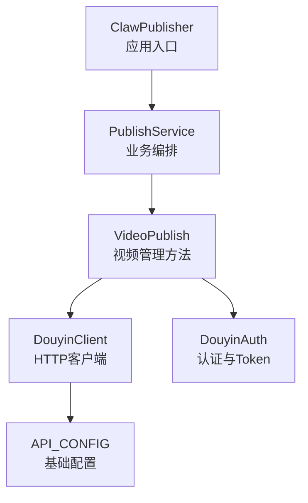
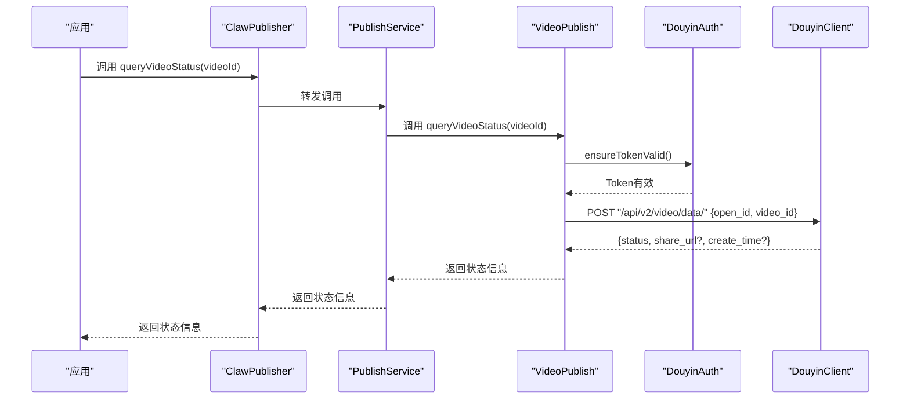
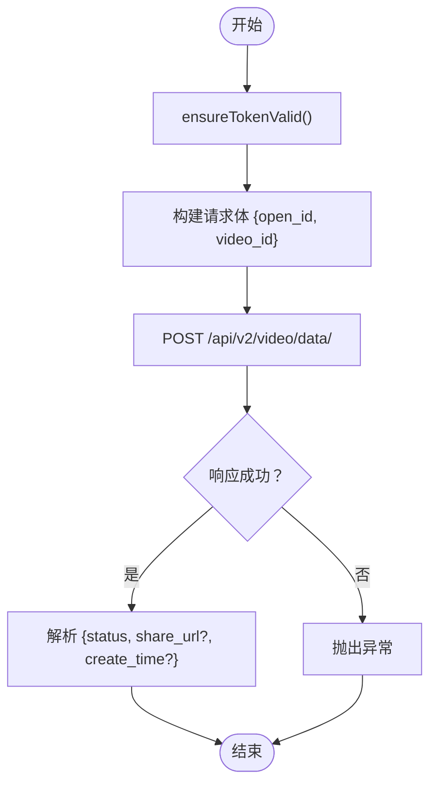
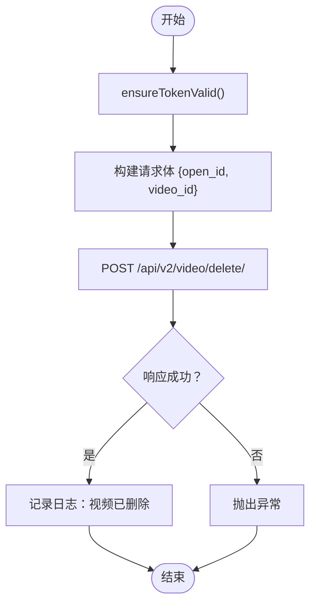
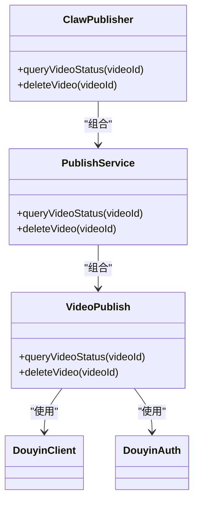

# 视频管理方法

<cite>
**本文引用的文件**
- [src/index.ts](file://src/index.ts)
- [src/services/publish-service.ts](file://src/services/publish-service.ts)
- [src/api/video-publish.ts](file://src/api/video-publish.ts)
- [src/api/douyin-client.ts](file://src/api/douyin-client.ts)
- [src/api/auth.ts](file://src/api/auth.ts)
- [src/models/types.ts](file://src/models/types.ts)
- [config/default.ts](file://config/default.ts)
- [tests/unit/video-publish.test.ts](file://tests/unit/video-publish.test.ts)
- [tests/fixtures/mock-responses.ts](file://tests/fixtures/mock-responses.ts)
- [example.ts](file://example.ts)
</cite>

## 目录
1. [简介](#简介)
2. [项目结构](#项目结构)
3. [核心组件](#核心组件)
4. [架构总览](#架构总览)
5. [详细组件分析](#详细组件分析)
6. [依赖关系分析](#依赖关系分析)
7. [性能与可靠性](#性能与可靠性)
8. [故障排查指南](#故障排查指南)
9. [结论](#结论)
10. [附录](#附录)

## 简介
本文件面向ClawPublisher的视频管理方法，聚焦于视频状态查询与删除两大管理能力，提供完整的API规范说明、参数与返回字段、状态码与错误处理、安全与确认机制、以及最佳实践与使用示例。读者无需深入源码即可理解如何正确调用这些方法，并在生产环境中安全、稳定地使用。

## 项目结构
ClawPublisher采用分层架构：
- 应用入口与对外接口：ClawPublisher（统一对外API）
- 业务编排层：PublishService（封装上传、发布、状态查询、删除等流程）
- 功能模块层：VideoPublish（具体视频管理方法实现）
- 基础设施层：DouyinClient（HTTP客户端与重试）、DouyinAuth（OAuth与Token管理）
- 类型与配置：models/types.ts、config/default.ts

图表来源
- [src/index.ts:29-67](file://src/index.ts#L29-L67)
- [src/services/publish-service.ts:22-31](file://src/services/publish-service.ts#L22-L31)
- [src/api/video-publish.ts:15-22](file://src/api/video-publish.ts#L15-L22)
- [src/api/douyin-client.ts:13-27](file://src/api/douyin-client.ts#L13-L27)
- [src/api/auth.ts:29-37](file://src/api/auth.ts#L29-L37)
- [config/default.ts:5-8](file://config/default.ts#L5-L8)

章节来源
- [src/index.ts:29-67](file://src/index.ts#L29-L67)
- [src/services/publish-service.ts:22-31](file://src/services/publish-service.ts#L22-L31)
- [src/api/video-publish.ts:15-22](file://src/api/video-publish.ts#L15-L22)
- [src/api/douyin-client.ts:13-27](file://src/api/douyin-client.ts#L13-L27)
- [src/api/auth.ts:29-37](file://src/api/auth.ts#L29-L37)
- [config/default.ts:5-8](file://config/default.ts#L5-L8)

## 核心组件
- 视频状态查询：queryVideoStatus(videoId)
- 视频删除：deleteVideo(videoId)
- 共同依赖：Token有效性检查、open_id注入、HTTP客户端POST请求

章节来源
- [src/api/video-publish.ts:127-170](file://src/api/video-publish.ts#L127-L170)
- [src/services/publish-service.ts:174-193](file://src/services/publish-service.ts#L174-L193)

## 架构总览
视频管理方法的调用链路如下：
- 应用层通过ClawPublisher暴露的方法调用
- PublishService进行参数校验与流程编排
- VideoPublish负责具体API调用（状态查询与删除）
- DouyinAuth确保Token有效并注入open_id
- DouyinClient执行HTTP请求并处理重试与错误

图表来源
- [src/index.ts:218-225](file://src/index.ts#L218-L225)
- [src/services/publish-service.ts:174-185](file://src/services/publish-service.ts#L174-L185)
- [src/api/video-publish.ts:127-154](file://src/api/video-publish.ts#L127-L154)
- [src/api/auth.ts:146-151](file://src/api/auth.ts#L146-L151)
- [src/api/douyin-client.ts:149-166](file://src/api/douyin-client.ts#L149-L166)

## 详细组件分析

### 视频状态查询 queryVideoStatus
- 方法签名与职责
  - 输入：videoId（字符串）
  - 输出：Promise<{ status: string; shareUrl?: string; createTime?: number }>
  - 负责：查询指定视频的状态、分享链接与创建时间
- 参数与请求体
  - 必填：open_id（来自当前Token）、video_id
  - 请求路径：/api/v2/video/data/
- 返回字段
  - status：视频状态（如已发布、审核中、已下架等）
  - shareUrl：分享链接（存在时提供）
  - createTime：创建时间（存在时提供）
- 错误处理
  - Token过期：自动刷新后重试
  - HTTP错误：抛出异常
  - 业务错误：根据抖音API错误码处理
- 使用建议
  - 在调用前确保Token有效
  - 对于定时发布或刚创建的视频，状态可能为“审核中”，需轮询观察
  - 若shareUrl为空，表示该视频暂不可分享或尚未发布

图表来源
- [src/api/video-publish.ts:127-154](file://src/api/video-publish.ts#L127-L154)
- [src/api/auth.ts:146-151](file://src/api/auth.ts#L146-L151)
- [src/api/douyin-client.ts:149-166](file://src/api/douyin-client.ts#L149-L166)

章节来源
- [src/api/video-publish.ts:127-154](file://src/api/video-publish.ts#L127-L154)
- [src/services/publish-service.ts:174-185](file://src/services/publish-service.ts#L174-L185)
- [src/models/types.ts:129-135](file://src/models/types.ts#L129-L135)

### 视频删除 deleteVideo
- 方法签名与职责
  - 输入：videoId（字符串）
  - 输出：Promise<void>
  - 负责：删除指定视频（不可逆操作）
- 参数与请求体
  - 必填：open_id（来自当前Token）、video_id
  - 请求路径：/api/v2/video/delete/
- 安全与确认机制
  - 无二次确认弹窗或二次密码校验；调用即删除
  - 建议在调用前：
    - 再次调用queryVideoStatus确认目标视频状态
    - 备份分享链接与创建时间
    - 在测试环境先行验证
- 错误处理
  - Token过期：自动刷新后重试
  - HTTP错误：抛出异常
  - 业务错误：根据抖音API错误码处理
- 使用建议
  - 仅在确定需要删除时调用
  - 删除后无法恢复，请谨慎操作

图表来源
- [src/api/video-publish.ts:156-170](file://src/api/video-publish.ts#L156-L170)
- [src/api/auth.ts:146-151](file://src/api/auth.ts#L146-L151)
- [src/api/douyin-client.ts:149-166](file://src/api/douyin-client.ts#L149-L166)

章节来源
- [src/api/video-publish.ts:156-170](file://src/api/video-publish.ts#L156-L170)
- [src/services/publish-service.ts:187-193](file://src/services/publish-service.ts#L187-L193)

### 数据模型与类型
- VideoCreateResponse：视频创建/查询返回的数据结构
  - data.video_id：视频ID
  - data.share_url：分享链接（可选）
  - data.create_time：创建时间（可选）
- PublishResult：发布流程返回结果
  - success：布尔值
  - videoId：视频ID（可选）
  - shareUrl：分享链接（可选）
  - error：错误信息（可选）
  - createTime：创建时间（可选）

章节来源
- [src/models/types.ts:129-135](file://src/models/types.ts#L129-L135)
- [src/models/types.ts:173-179](file://src/models/types.ts#L173-L179)

## 依赖关系分析
- 组件耦合
  - VideoPublish依赖DouyinClient与DouyinAuth
  - PublishService作为编排层，向上提供统一接口，向下委托给VideoPublish
  - ClawPublisher作为应用入口，聚合各子模块
- 外部依赖
  - 抖音开放平台API（BASE_URL由配置提供）
  - Axios（HTTP客户端）
  - 重试策略（withRetry）
- 可能的循环依赖
  - 当前结构清晰，无循环依赖迹象

图表来源
- [src/index.ts:29-67](file://src/index.ts#L29-L67)
- [src/services/publish-service.ts:22-31](file://src/services/publish-service.ts#L22-L31)
- [src/api/video-publish.ts:15-22](file://src/api/video-publish.ts#L15-L22)
- [src/api/douyin-client.ts:13-27](file://src/api/douyin-client.ts#L13-L27)
- [src/api/auth.ts:29-37](file://src/api/auth.ts#L29-L37)

章节来源
- [src/index.ts:29-67](file://src/index.ts#L29-L67)
- [src/services/publish-service.ts:22-31](file://src/services/publish-service.ts#L22-L31)
- [src/api/video-publish.ts:15-22](file://src/api/video-publish.ts#L15-L22)
- [src/api/douyin-client.ts:13-27](file://src/api/douyin-client.ts#L13-L27)
- [src/api/auth.ts:29-37](file://src/api/auth.ts#L29-L37)

## 性能与可靠性
- 重试机制
  - DouyinClient对特定错误码与网络错误进行指数退避重试
  - 重试上限与延迟由配置提供
- Token管理
  - 自动检测过期并刷新，避免频繁手动刷新
- 并发与稳定性
  - 建议在高并发场景下控制调用频率，遵循抖音API速率限制
  - 对于批量查询或删除，建议分批执行并增加退避策略

章节来源
- [src/api/douyin-client.ts:124-166](file://src/api/douyin-client.ts#L124-L166)
- [src/api/douyin-client.ts:204-220](file://src/api/douyin-client.ts#L204-L220)
- [config/default.ts:17-24](file://config/default.ts#L17-L24)
- [src/api/auth.ts:146-151](file://src/api/auth.ts#L146-L151)

## 故障排查指南
- 常见问题与定位
  - Token无效或过期：检查isTokenValid与refreshToken调用
  - 参数错误：核对open_id与video_id是否正确
  - 业务错误：根据抖音API错误码定位（如429、10001等）
  - 网络错误：检查请求拦截器与重试逻辑
- 单元测试参考
  - 测试覆盖了queryVideoStatus与deleteVideo的基本行为
  - 可参考测试用例中的Mock响应与断言

章节来源
- [tests/unit/video-publish.test.ts:185-218](file://tests/unit/video-publish.test.ts#L185-L218)
- [tests/fixtures/mock-responses.ts:62-68](file://tests/fixtures/mock-responses.ts#L62-L68)
- [src/api/douyin-client.ts:97-116](file://src/api/douyin-client.ts#L97-L116)

## 结论
- queryVideoStatus与deleteVideo是视频管理的核心方法，前者用于状态监控与分享链接获取，后者用于不可逆删除
- 两者均内置Token有效性保障与HTTP错误处理，建议在调用前确认Token状态
- 删除操作无二次确认机制，务必谨慎操作并做好备份与审计

## 附录

### API规范摘要

- 视频状态查询 queryVideoStatus(videoId)
  - 请求方法：POST
  - 请求路径：/api/v2/video/data/
  - 请求体字段：
    - open_id：当前账号open_id（来自Token）
    - video_id：视频ID
  - 返回字段：
    - status：视频状态
    - share_url：分享链接（可选）
    - create_time：创建时间（可选）
  - 使用示例：参见示例文件中的视频管理示例

- 视频删除 deleteVideo(videoId)
  - 请求方法：POST
  - 请求路径：/api/v2/video/delete/
  - 请求体字段：
    - open_id：当前账号open_id（来自Token）
    - video_id：视频ID
  - 返回：无（void）
  - 安全提示：调用即删除，无法恢复

章节来源
- [src/api/video-publish.ts:127-170](file://src/api/video-publish.ts#L127-L170)
- [example.ts:147-155](file://example.ts#L147-L155)

### 使用示例与最佳实践

- 完整工作流示例（含状态查询）
  - 步骤：检查Token -> 发布视频 -> 查询状态 -> 打印状态
  - 参考：示例文件中的完整工作流

- 状态监控最佳实践
  - 对于定时发布或新创建的视频，建议轮询查询状态
  - 记录shareUrl与createTime以便后续追踪
  - 对异常状态（如审核中）设定合理的等待与重试策略

- 删除操作安全建议
  - 删除前再次确认视频状态与分享链接
  - 在测试环境验证后再执行生产删除
  - 建议在业务层增加二次确认与审计日志

章节来源
- [example.ts:159-193](file://example.ts#L159-L193)
- [src/api/video-publish.ts:127-170](file://src/api/video-publish.ts#L127-L170)