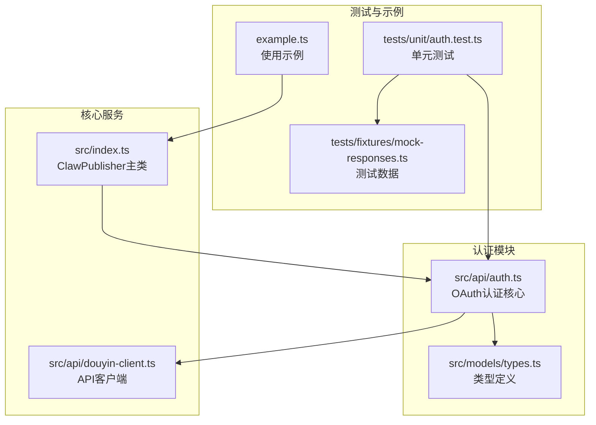
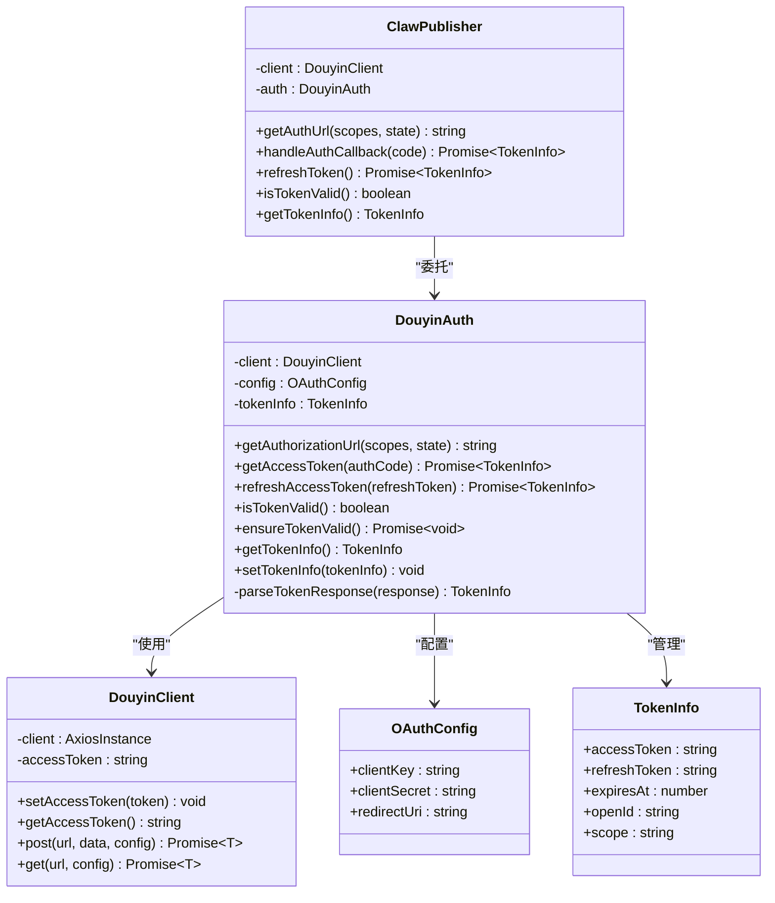
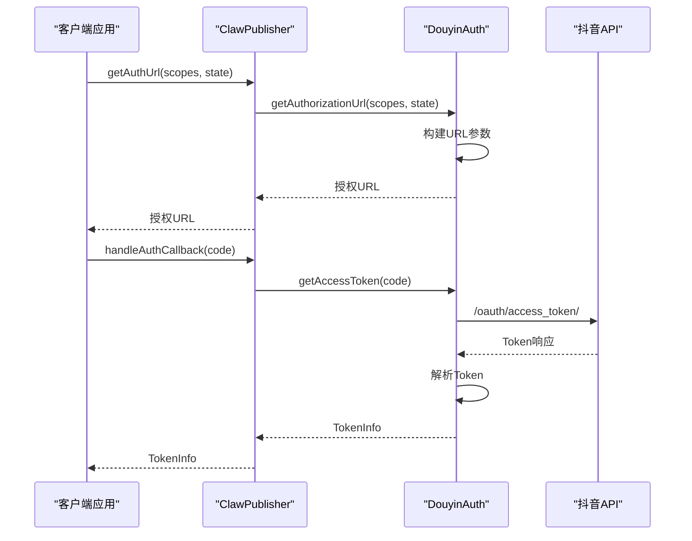
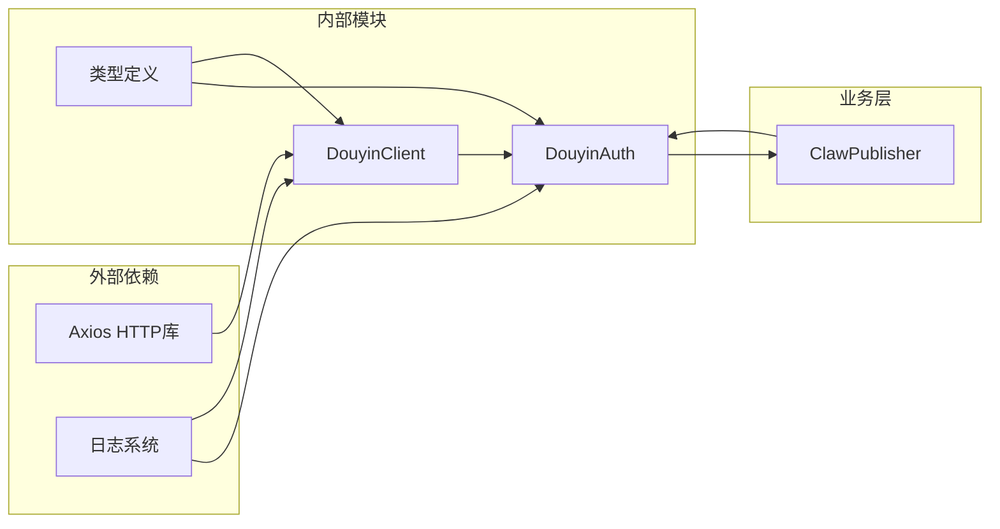
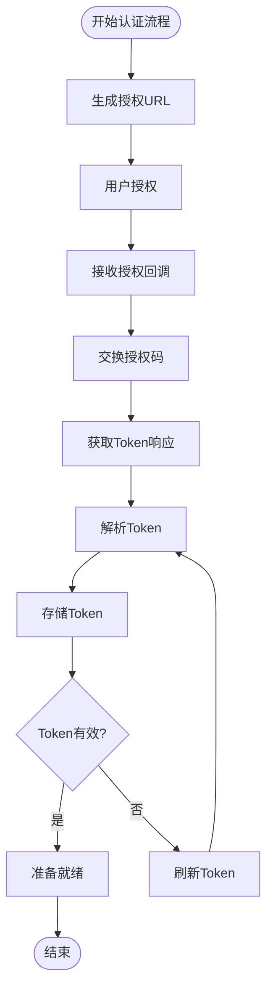

# 认证相关方法

<cite>
**本文档引用的文件**
- [src/api/auth.ts](file://src/api/auth.ts)
- [src/index.ts](file://src/index.ts)
- [src/models/types.ts](file://src/models/types.ts)
- [src/api/douyin-client.ts](file://src/api/douyin-client.ts)
- [tests/unit/auth.test.ts](file://tests/unit/auth.test.ts)
- [tests/fixtures/mock-responses.ts](file://tests/fixtures/mock-responses.ts)
- [example.ts](file://example.ts)
</cite>

## 目录
1. [简介](#简介)
2. [项目结构](#项目结构)
3. [核心组件](#核心组件)
4. [架构概览](#架构概览)
5. [详细组件分析](#详细组件分析)
6. [依赖关系分析](#依赖关系分析)
7. [性能考虑](#性能考虑)
8. [故障排除指南](#故障排除指南)
9. [结论](#结论)
10. [附录](#附录)

## 简介
本文档详细记录了ClawPublisher项目的认证相关方法，包括getAuthUrl、handleAuthCallback、refreshToken、isTokenValid、getTokenInfo等方法的完整API规范。这些方法基于抖音开放平台的OAuth 2.0协议实现，提供了完整的授权流程支持，包括授权URL生成、授权码换取Token、Token刷新、有效性检查等功能。

## 项目结构
ClawPublisher项目采用模块化设计，认证功能主要集中在以下文件中：



**图表来源**
- [src/api/auth.ts:1-190](file://src/api/auth.ts#L1-L190)
- [src/index.ts:1-248](file://src/index.ts#L1-L248)
- [src/models/types.ts:1-201](file://src/models/types.ts#L1-L201)

**章节来源**
- [src/api/auth.ts:1-190](file://src/api/auth.ts#L1-L190)
- [src/index.ts:1-248](file://src/index.ts#L1-L248)
- [src/models/types.ts:1-201](file://src/models/types.ts#L1-L201)

## 核心组件
本节详细介绍认证相关的核心组件及其职责：

### OAuth作用域定义
系统预定义了四个标准OAuth作用域：
- `VIDEO_CREATE`: 视频创作权限
- `VIDEO_UPLOAD`: 视频上传权限  
- `VIDEO_DATA`: 视频数据访问权限
- `USER_INFO`: 用户信息访问权限

### 默认授权范围
系统默认使用VIDEO_CREATE、VIDEO_UPLOAD、VIDEO_DATA三个作用域，确保基本的视频操作能力。

### Token信息结构
Token信息包含以下关键字段：
- `accessToken`: 访问令牌
- `refreshToken`: 刷新令牌
- `expiresAt`: 过期时间戳（毫秒）
- `openId`: 用户标识
- `scope`: 授权范围

**章节来源**
- [src/api/auth.ts:7-24](file://src/api/auth.ts#L7-L24)
- [src/models/types.ts:37-46](file://src/models/types.ts#L37-L46)

## 架构概览
认证系统的整体架构采用分层设计，确保职责分离和代码复用：



**图表来源**
- [src/api/auth.ts:29-187](file://src/api/auth.ts#L29-L187)
- [src/api/douyin-client.ts:13-237](file://src/api/douyin-client.ts#L13-L237)
- [src/index.ts:29-112](file://src/index.ts#L29-L112)
- [src/models/types.ts:18-46](file://src/models/types.ts#L18-L46)

## 详细组件分析

### DouyinAuth类详解

#### getAuthorizationUrl方法
**功能**: 生成抖音OAuth授权页面URL
**参数**:
- `scopes`: 字符串数组，授权作用域，默认使用默认作用域集合
- `state`: 字符串，可选的状态参数，用于CSRF防护

**返回值**: 完整的授权URL字符串

**使用场景**:
- 首次授权时引导用户访问授权页面
- 需要自定义授权范围时

**实现细节**:
- 构建URLSearchParams参数对象
- 包含client_key、response_type、scope、redirect_uri
- 支持可选的state参数

**章节来源**
- [src/api/auth.ts:39-60](file://src/api/auth.ts#L39-L60)

#### getAccessToken方法
**功能**: 使用授权码换取access_token
**参数**:
- `authCode`: 字符串，授权码

**返回值**: Promise<TokenInfo>，包含完整的Token信息

**使用场景**:
- 用户完成授权后，通过回调获取Token

**实现细节**:
- 调用/oauth/access_token/接口
- 参数包含client_key、client_secret、code、grant_type
- 自动解析响应并设置到内部状态

**章节来源**
- [src/api/auth.ts:62-91](file://src/api/auth.ts#L62-L91)

#### refreshAccessToken方法
**功能**: 刷新access_token
**参数**:
- `refreshToken`: 字符串，可选的刷新令牌，默认使用当前存储的

**返回值**: Promise<TokenInfo>，新的Token信息

**使用场景**:
- Token即将过期或已过期时自动刷新
- 手动触发Token刷新

**实现细节**:
- 检查是否存在refresh_token
- 调用/oauth/refresh_token/接口
- 参数包含client_key、refresh_token、grant_type

**章节来源**
- [src/api/auth.ts:93-127](file://src/api/auth.ts#L93-L127)

#### isTokenValid方法
**功能**: 检查Token是否有效
**参数**: 无

**返回值**: boolean，Token是否有效

**使用场景**:
- 发起API请求前的Token有效性检查
- 自动化的Token管理

**实现细节**:
- 检查tokenInfo是否存在
- 使用5分钟缓冲时间判断过期
- 返回布尔值表示有效性

**章节来源**
- [src/api/auth.ts:129-141](file://src/api/auth.ts#L129-L141)

#### ensureTokenValid方法
**功能**: 确保Token有效（过期则自动刷新）
**参数**: 无

**返回值**: Promise<void>

**使用场景**:
- 自动化的Token管理
- 防止API调用时的Token过期问题

**实现细节**:
- 调用isTokenValid检查有效性
- 如无效则调用refreshAccessToken自动刷新

**章节来源**
- [src/api/auth.ts:143-151](file://src/api/auth.ts#L143-L151)

#### getTokenInfo/setTokenInfo方法
**功能**: 获取和设置Token信息
**参数**:
- `getTokenInfo`: 无参数，返回当前Token信息
- `setTokenInfo`: TokenInfo，设置Token信息

**返回值**:
- `getTokenInfo`: TokenInfo或null
- `setTokenInfo`: void

**使用场景**:
- 从持久化存储恢复Token状态
- 获取当前Token状态进行调试

**章节来源**
- [src/api/auth.ts:153-169](file://src/api/auth.ts#L153-L169)

### ClawPublisher代理方法

ClawPublisher类提供了对DouyinAuth方法的直接代理：



**图表来源**
- [src/index.ts:71-88](file://src/index.ts#L71-L88)
- [src/api/auth.ts:45-91](file://src/api/auth.ts#L45-L91)

**章节来源**
- [src/index.ts:69-112](file://src/index.ts#L69-L112)

## 依赖关系分析

### 组件耦合关系
认证模块采用松耦合设计，通过接口和依赖注入实现：



**图表来源**
- [src/api/auth.ts:1-5](file://src/api/auth.ts#L1-L5)
- [src/api/douyin-client.ts:1-6](file://src/api/douyin-client.ts#L1-L6)
- [src/index.ts:1-14](file://src/index.ts#L1-L14)

### 数据流分析
认证过程中的数据流向：



**图表来源**
- [src/api/auth.ts:45-127](file://src/api/auth.ts#L45-L127)

**章节来源**
- [src/api/auth.ts:1-190](file://src/api/auth.ts#L1-L190)

## 性能考虑
认证模块在设计时考虑了以下性能因素：

### 缓存策略
- Token信息在内存中缓存，避免重复网络请求
- 5分钟缓冲时间预防边界情况下的Token过期

### 错误处理优化
- 自动重试机制处理临时性网络错误
- 限流错误的智能识别和处理

### 内存管理
- 及时清理过期的Token信息
- 避免内存泄漏的资源管理

## 故障排除指南

### 常见错误及解决方案

#### 授权URL生成失败
**症状**: 生成的URL缺少必要参数
**原因**: OAuth配置不完整
**解决方案**: 检查clientKey、clientSecret、redirectUri配置

#### Token获取失败
**症状**: getAccessToken抛出异常
**可能原因**:
- 授权码已过期
- 凭据配置错误
- 网络连接问题

**解决方案**:
- 重新发起授权流程
- 验证OAuth配置
- 检查网络连接

#### Token刷新失败
**症状**: refreshAccessToken抛出"没有可用的refresh_token"
**原因**: 之前获取的Token中没有refresh_token
**解决方案**: 重新发起完整授权流程

#### Token过期问题
**症状**: API调用返回401未授权
**解决方案**:
- 使用ensureTokenValid自动刷新
- 手动调用refreshToken
- 检查系统时间同步

**章节来源**
- [tests/unit/auth.test.ts:130-133](file://tests/unit/auth.test.ts#L130-L133)
- [src/api/auth.ts:146-151](file://src/api/auth.ts#L146-L151)

## 结论
ClawPublisher的认证系统提供了完整、健壮的OAuth 2.0实现，具有以下特点：

1. **完整的授权流程**: 支持从授权URL生成到Token管理的全流程
2. **灵活的作用域控制**: 支持自定义授权范围
3. **自动化的Token管理**: 包含自动刷新和有效性检查
4. **完善的错误处理**: 提供详细的错误信息和恢复机制
5. **良好的扩展性**: 清晰的接口设计便于功能扩展

该认证系统为ClawPublisher提供了可靠的基础，确保与抖音开放平台的安全、稳定连接。

## 附录

### OAuth授权流程完整示例

#### 第一步：生成授权URL
```typescript
// 在ClawPublisher中生成授权URL
const authUrl = publisher.getAuthUrl();
// 或使用自定义作用域
const customAuthUrl = publisher.getAuthUrl(['user.info', 'video.data']);
```

#### 第二步：处理授权回调
```typescript
// 用户授权后，使用回调的code获取Token
const tokenInfo = await publisher.handleAuthCallback(authCode);
// 保存tokenInfo以便后续使用
```

#### 第三步：检查Token有效性
```typescript
// 检查Token是否有效
if (!publisher.isTokenValid()) {
    // Token无效，需要刷新
    await publisher.refreshToken();
}
```

#### 第四步：使用Token进行API调用
```typescript
// Token有效后，可以安全地进行API调用
// 系统会自动在请求中添加access_token
```

### 最佳实践指南

#### 安全最佳实践
1. **保护OAuth凭据**: 使用环境变量存储clientKey和clientSecret
2. **验证state参数**: 在授权URL中使用随机state参数防止CSRF攻击
3. **及时刷新Token**: 使用ensureTokenValid确保Token始终有效
4. **安全存储Token**: 将Token信息安全地存储在持久化存储中

#### 性能最佳实践
1. **合理设置作用域**: 只请求必要的作用域，减少授权复杂度
2. **利用缓存**: 利用内存中的Token缓存避免重复请求
3. **错误重试**: 使用内置的重试机制处理临时性错误
4. **监控日志**: 启用详细的日志记录便于问题排查

#### 开发最佳实践
1. **类型安全**: 充分利用TypeScript类型定义确保类型安全
2. **错误处理**: 妥善处理各种异常情况
3. **测试覆盖**: 编写充分的单元测试确保代码质量
4. **文档维护**: 保持API文档与代码同步更新

**章节来源**
- [example.ts:28-37](file://example.ts#L28-L37)
- [example.ts:160-165](file://example.ts#L160-L165)