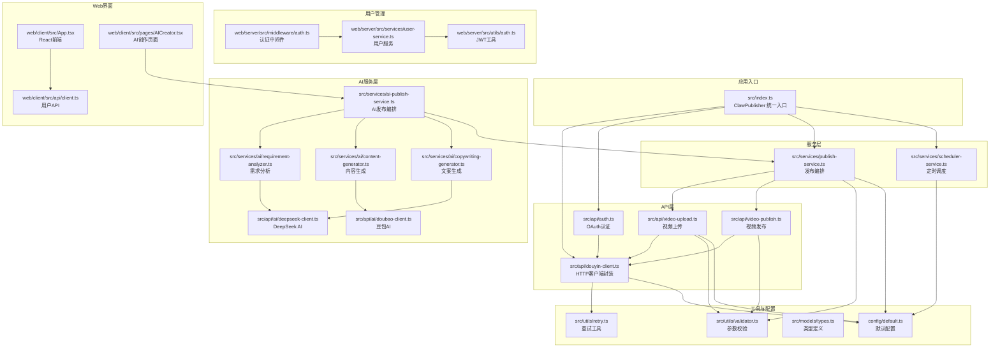
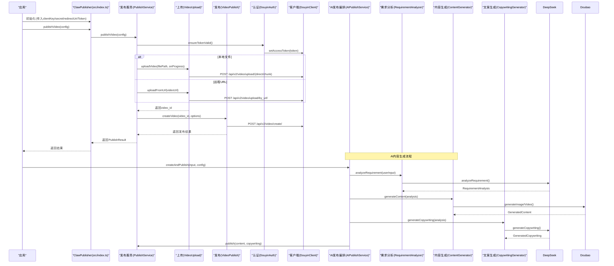
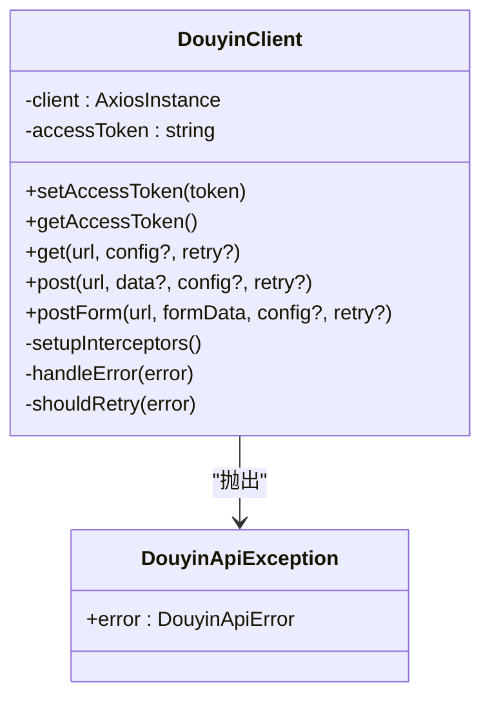
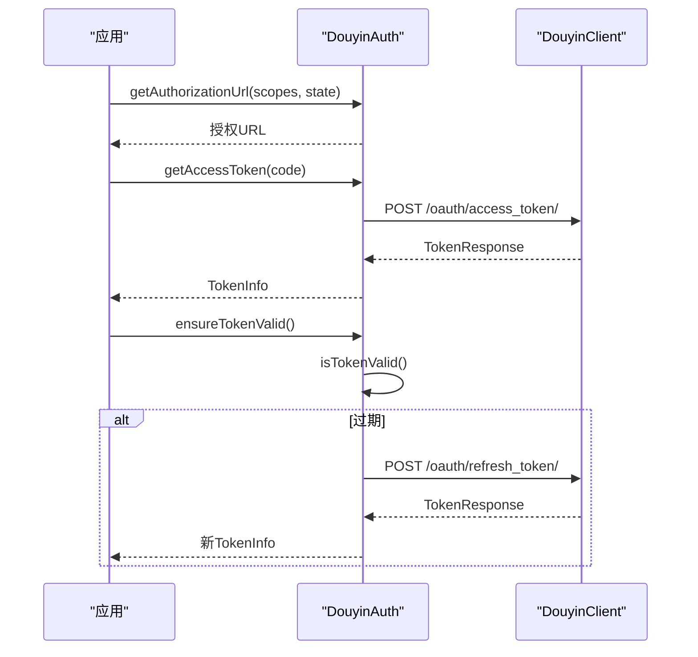
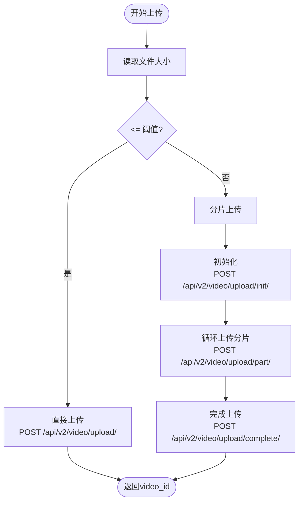
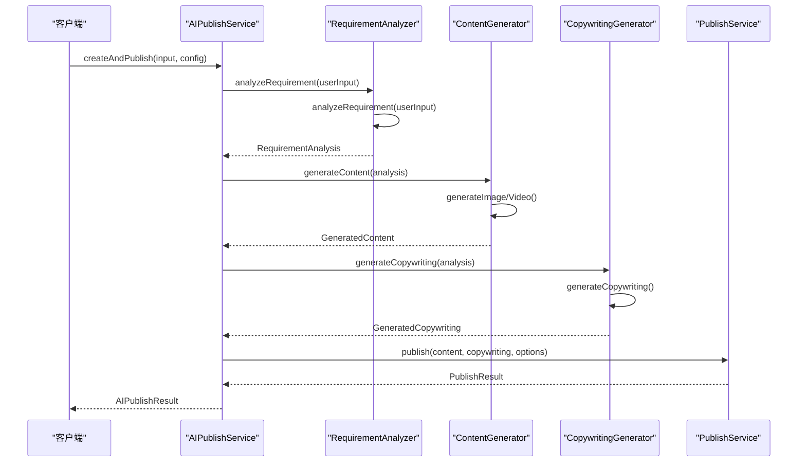
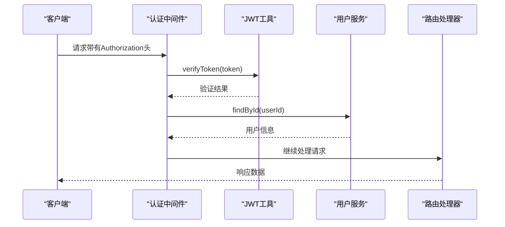
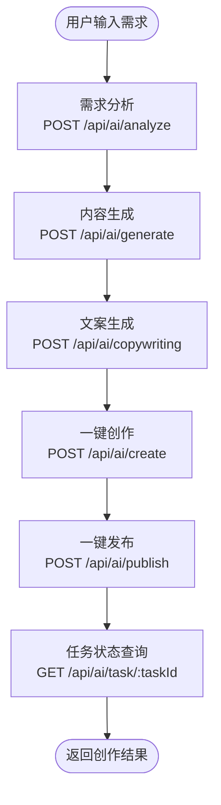
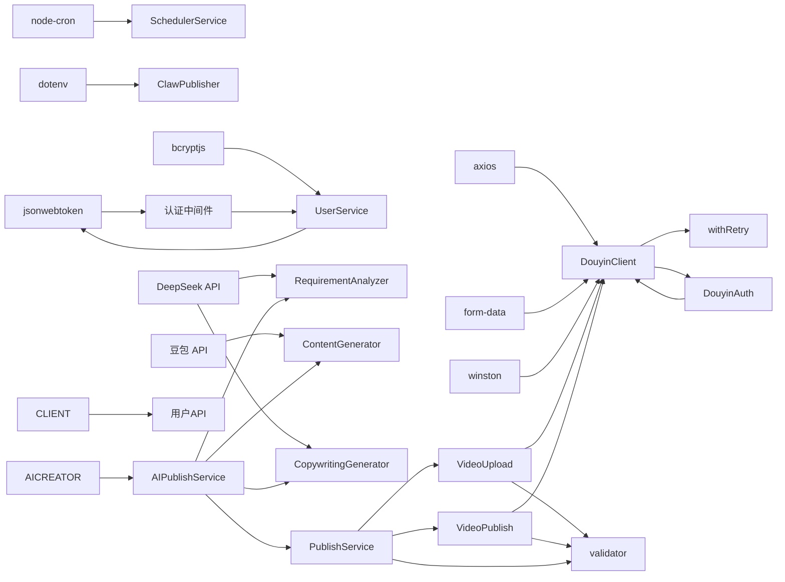

# 抖音客户端API

<cite>
**本文档引用的文件**
- [src/index.ts](file://src/index.ts)
- [src/api/douyin-client.ts](file://src/api/douyin-client.ts)
- [src/api/auth.ts](file://src/api/auth.ts)
- [src/api/video-upload.ts](file://src/api/video-upload.ts)
- [src/api/video-publish.ts](file://src/api/video-publish.ts)
- [src/services/publish-service.ts](file://src/services/publish-service.ts)
- [src/services/scheduler-service.ts](file://src/services/scheduler-service.ts)
- [src/services/ai-publish-service.ts](file://src/services/ai-publish-service.ts)
- [src/services/ai/requirement-analyzer.ts](file://src/services/ai/requirement-analyzer.ts)
- [src/services/ai/content-generator.ts](file://src/services/ai/content-generator.ts)
- [src/services/ai/copywriting-generator.ts](file://src/services/ai/copywriting-generator.ts)
- [src/api/ai/deepseek-client.ts](file://src/api/ai/deepseek-client.ts)
- [src/api/ai/doubao-client.ts](file://src/api/ai/doubao-client.ts)
- [src/utils/retry.ts](file://src/utils/retry.ts)
- [src/utils/validator.ts](file://src/utils/validator.ts)
- [src/models/types.ts](file://src/models/types.ts)
- [config/default.ts](file://config/default.ts)
- [web/client/src/App.tsx](file://web/client/src/App.tsx)
- [web/client/src/pages/AICreator.tsx](file://web/client/src/pages/AICreator.tsx)
- [web/client/src/api/client.ts](file://web/client/src/api/client.ts)
- [web/client/src/contexts/AuthContext.tsx](file://web/client/src/contexts/AuthContext.tsx)
- [web/server/src/routes/ai.ts](file://web/server/src/routes/ai.ts)
- [web/server/src/routes/user.ts](file://web/server/src/routes/user.ts)
- [web/server/src/middleware/auth.ts](file://web/server/src/middleware/auth.ts)
- [web/server/src/utils/auth.ts](file://web/server/src/utils/auth.ts)
- [web/server/src/services/user-service.ts](file://web/server/src/services/user-service.ts)
- [example.ts](file://example.ts)
- [tests/fixtures/mock-responses.ts](file://tests/fixtures/mock-responses.ts)
- [README.md](file://README.md)
- [package.json](file://package.json)
</cite>

## 更新摘要
**所做更改**
- 新增AI内容生成集成章节，涵盖DeepSeek和豆包AI的完整工作流程
- 新增JWT认证系统章节，包括用户管理和认证中间件
- 新增Web界面集成章节，展示React前端与Express后端的完整架构
- 更新架构总览图，反映新的AI创作流程和用户管理系统
- 新增AI创作API接口规范和用户管理API接口规范
- 更新错误处理机制，增加AI服务和用户认证相关的异常处理

## 目录
1. [简介](#简介)
2. [项目结构](#项目结构)
3. [核心组件](#核心组件)
4. [架构总览](#架构总览)
5. [详细组件分析](#详细组件分析)
6. [AI内容生成集成](#ai内容生成集成)
7. [JWT认证系统](#jwt认证系统)
8. [Web界面集成](#web界面集成)
9. [依赖关系分析](#依赖关系分析)
10. [性能与可靠性](#性能与可靠性)
11. [故障排查指南](#故障排查指南)
12. [结论](#结论)
13. [附录](#附录)

## 简介
本文件为抖音客户端API的完整技术文档，面向开发者与运维人员，覆盖HTTP请求封装、错误处理机制、重试策略、认证流程、上传与发布接口规范、AI内容生成、JWT认证系统、用户管理功能以及Web界面集成。文档基于实际源码进行梳理，确保内容准确可追溯。

**更新** 本次更新反映了重大架构变更：新增AI内容生成集成、JWT认证系统、用户管理功能，以及与新Web界面的集成。原有GraphQL API和实验性功能已被移除。

## 项目结构
项目采用按功能分层的组织方式，核心模块包括API客户端、认证、上传、发布、AI内容生成、用户管理与工具库，配合统一的类型定义与默认配置。

**图表来源**
- [src/index.ts:1-248](file://src/index.ts#L1-L248)
- [src/api/douyin-client.ts:1-237](file://src/api/douyin-client.ts#L1-L237)
- [src/api/auth.ts:1-190](file://src/api/auth.ts#L1-L190)
- [src/services/ai-publish-service.ts:1-358](file://src/services/ai-publish-service.ts#L1-L358)
- [src/services/ai/requirement-analyzer.ts:1-128](file://src/services/ai/requirement-analyzer.ts#L1-L128)
- [src/services/ai/content-generator.ts:1-229](file://src/services/ai/content-generator.ts#L1-L229)
- [src/services/ai/copywriting-generator.ts:1-194](file://src/services/ai/copywriting-generator.ts#L1-L194)
- [src/api/ai/deepseek-client.ts:1-283](file://src/api/ai/deepseek-client.ts#L1-L283)
- [src/api/ai/doubao-client.ts:1-200](file://src/api/ai/doubao-client.ts#L1-L200)
- [web/server/src/services/user-service.ts:1-240](file://web/server/src/services/user-service.ts#L1-L240)
- [web/server/src/middleware/auth.ts:1-93](file://web/server/src/middleware/auth.ts#L1-L93)
- [web/server/src/utils/auth.ts:1-53](file://web/server/src/utils/auth.ts#L1-L53)
- [web/client/src/App.tsx:1-83](file://web/client/src/App.tsx#L1-L83)
- [web/client/src/pages/AICreator.tsx:1-513](file://web/client/src/pages/AICreator.tsx#L1-L513)
- [web/client/src/api/client.ts:186-237](file://web/client/src/api/client.ts#L186-L237)

**章节来源**
- [src/index.ts:1-248](file://src/index.ts#L1-L248)
- [config/default.ts:1-70](file://config/default.ts#L1-L70)

## 核心组件
- 抖音客户端（DouyinClient）
  - 基于Axios实例封装，内置请求/响应拦截器，自动注入access_token，统一错误处理与日志记录。
  - 提供GET/POST/POST(FormData multipart)三类请求方法，并集成带指数退避的重试逻辑。
- OAuth认证（DouyinAuth）
  - 生成授权URL、换取/刷新Token、Token有效性检查与自动刷新。
- 视频上传（VideoUpload）
  - 支持直接上传与分片上传，自动选择策略；支持URL直传；提供上传进度回调。
- 视频发布（VideoPublish）
  - 构建发布参数（标题、描述、话题、@用户、POI、小程序挂载、商品链接、定时发布等），查询状态与删除视频。
- 发布服务（PublishService）
  - 业务编排：一站式上传+发布、仅上传、仅发布、下载后发布；统一结果封装。
- 定时调度（SchedulerService）
  - 基于node-cron的定时发布任务管理。
- AI发布编排（AIPublishService）
  - 统一协调需求分析、内容生成、文案生成和发布流程，支持任务状态跟踪。
- 需求分析（RequirementAnalyzer）
  - 使用DeepSeek AI分析用户需求，提取内容类型、主题、风格、关键卖点等信息。
- 内容生成（ContentGenerator）
  - 使用豆包AI生成图片和视频内容，支持进度回调和任务状态查询。
- 文案生成（CopywritingGenerator）
  - 使用DeepSeek AI生成推广文案，符合抖音平台的内容规范。
- 用户管理（UserService）
  - 提供用户注册、登录、信息更新、密码修改等功能，支持JWT认证。
- 工具与配置
  - 重试工具（withRetry）、参数校验（validator）、类型定义（models/types）、默认配置（config/default）。

**章节来源**
- [src/api/douyin-client.ts:13-237](file://src/api/douyin-client.ts#L13-L237)
- [src/api/auth.ts:29-190](file://src/api/auth.ts#L29-L190)
- [src/services/ai-publish-service.ts:43-358](file://src/services/ai-publish-service.ts#L43-L358)
- [src/services/ai/requirement-analyzer.ts:25-128](file://src/services/ai/requirement-analyzer.ts#L25-L128)
- [src/services/ai/content-generator.ts:38-229](file://src/services/ai/content-generator.ts#L38-L229)
- [src/services/ai/copywriting-generator.ts:30-194](file://src/services/ai/copywriting-generator.ts#L30-L194)
- [web/server/src/services/user-service.ts:16-240](file://web/server/src/services/user-service.ts#L16-L240)
- [src/utils/retry.ts:41-84](file://src/utils/retry.ts#L41-L84)
- [src/utils/validator.ts:17-116](file://src/utils/validator.ts#L17-L116)
- [src/models/types.ts:1-316](file://src/models/types.ts#L1-L316)
- [config/default.ts:5-70](file://config/default.ts#L5-L70)

## 架构总览
下图展示ClawPublisher作为统一入口，协调认证、上传、发布与调度服务的整体交互，以及新增的AI内容生成和用户管理系统的集成。

**图表来源**
- [src/index.ts:29-248](file://src/index.ts#L29-L248)
- [src/services/publish-service.ts:38-80](file://src/services/publish-service.ts#L38-L80)
- [src/services/ai-publish-service.ts:90-213](file://src/services/ai-publish-service.ts#L90-L213)
- [src/services/ai/requirement-analyzer.ts:41-72](file://src/services/ai/requirement-analyzer.ts#L41-L72)
- [src/services/ai/content-generator.ts:62-102](file://src/services/ai/content-generator.ts#L62-L102)
- [src/services/ai/copywriting-generator.ts:54-74](file://src/services/ai/copywriting-generator.ts#L54-L74)

## 详细组件分析

### 抖音客户端（DouyinClient）
- 功能要点
  - Axios实例化：设置基础URL、超时、默认Content-Type。
  - 请求拦截：自动注入access_token到查询参数；记录请求日志。
  - 响应拦截：解析通用响应结构，识别data中的error_code并抛出DouyinApiException；对Axios错误进行分类处理。
  - GET/POST/POST(FormData)：统一封装，返回data.data；集成withRetry重试。
  - 重试判定：针对特定限流错误码与网络/超时错误进行指数退避重试。
- 关键实现参考
  - [构造与拦截器:17-91](file://src/api/douyin-client.ts#L17-L91)
  - [GET/POST/POST(FormData):124-198](file://src/api/douyin-client.ts#L124-L198)
  - [错误处理与异常:97-116](file://src/api/douyin-client.ts#L97-L116)
  - [重试判定:204-220](file://src/api/douyin-client.ts#L204-L220)

**图表来源**
- [src/api/douyin-client.ts:13-237](file://src/api/douyin-client.ts#L13-L237)

**章节来源**
- [src/api/douyin-client.ts:13-237](file://src/api/douyin-client.ts#L13-L237)

### OAuth认证（DouyinAuth）
- 功能要点
  - 生成授权URL（支持scope与state）。
  - 授权码换取Token、刷新Token、Token有效性检查与自动刷新。
  - Token信息持久化与恢复。
- 关键实现参考
  - [授权URL生成:45-60](file://src/api/auth.ts#L45-L60)
  - [换取Token:67-91](file://src/api/auth.ts#L67-L91)
  - [刷新Token:98-127](file://src/api/auth.ts#L98-L127)
  - [Token有效性检查与自动刷新:133-151](file://src/api/auth.ts#L133-L151)

**图表来源**
- [src/api/auth.ts:45-151](file://src/api/auth.ts#L45-L151)
- [src/api/douyin-client.ts:149-166](file://src/api/douyin-client.ts#L149-L166)

**章节来源**
- [src/api/auth.ts:29-190](file://src/api/auth.ts#L29-L190)

### 视频上传（VideoUpload）
- 功能要点
  - 自动选择上传方式：小文件直接上传，大文件分片上传。
  - 直接上传：multipart/form-data，监听上传进度。
  - 分片上传：init → upload part × N → complete。
  - URL直传：无需本地文件，直接提交URL。
- 关键实现参考
  - [上传入口与策略:35-54](file://src/api/video-upload.ts#L35-L54)
  - [直接上传:62-96](file://src/api/video-upload.ts#L62-L96)
  - [分片上传流程:104-152](file://src/api/video-upload.ts#L104-L152)
  - [初始化/上传分片/完成:160-213](file://src/api/video-upload.ts#L160-L213)
  - [URL直传:220-237](file://src/api/video-upload.ts#L220-L237)

**图表来源**
- [src/api/video-upload.ts:35-54](file://src/api/video-upload.ts#L35-L54)
- [src/api/video-upload.ts:160-213](file://src/api/video-upload.ts#L160-L213)

**章节来源**
- [src/api/video-upload.ts:20-241](file://src/api/video-upload.ts#L20-L241)

### 视频发布（VideoPublish）
- 功能要点
  - 构建发布参数：标题、描述（含hashtag拼接）、@用户、POI、小程序挂载、商品链接、定时发布。
  - 查询视频状态、删除视频。
- 关键实现参考
  - [构建参数与调用创建接口:30-54](file://src/api/video-publish.ts#L30-L54)
  - [参数构建逻辑:62-125](file://src/api/video-publish.ts#L62-L125)
  - [查询状态:132-154](file://src/api/video-publish.ts#L132-L154)
  - [删除视频:157-170](file://src/api/video-publish.ts#L157-L170)

**章节来源**
- [src/api/video-publish.ts:15-174](file://src/api/video-publish.ts#L15-L174)

### 发布服务（PublishService）
- 功能要点
  - 一站式发布：上传（本地/URL）+ 发布。
  - 仅上传/仅发布/下载后发布。
  - 统一结果封装（success、videoId、shareUrl、error、createTime）。
- 关键实现参考
  - [一站式发布:38-80](file://src/services/publish-service.ts#L38-80)
  - [下载并发布:133-172](file://src/services/publish-service.ts#L133-172)

**章节来源**
- [src/services/publish-service.ts:22-228](file://src/services/publish-service.ts#L22-L228)

### 定时调度（SchedulerService）
- 功能要点
  - 注册定时任务（cron表达式）、取消、列出、清理与停止。
  - 与发布服务协作执行定时发布。
- 关键实现参考
  - [注册与执行:37-162](file://src/services/scheduler-service.ts#L37-162)
  - [任务管理:79-115](file://src/services/scheduler-service.ts#L79-115)

**章节来源**
- [src/services/scheduler-service.ts:23-202](file://src/services/scheduler-service.ts#L23-L202)

### 重试工具（withRetry）
- 功能要点
  - 指数退避延迟计算、最大重试次数、最大延迟时间、自定义shouldRetry条件。
- 关键实现参考
  - [默认配置与延迟计算:9-25](file://src/utils/retry.ts#L9-L25)
  - [重试执行逻辑:41-81](file://src/utils/retry.ts#L41-L81)

**章节来源**
- [src/utils/retry.ts:1-84](file://src/utils/retry.ts#L1-L84)

### 参数校验（validator）
- 功能要点
  - 视频文件格式与大小校验；发布选项长度与定时发布时间范围校验；hashtag格式化。
- 关键实现参考
  - [文件校验:22-39](file://src/utils/validator.ts#L22-L39)
  - [发布选项校验:45-86](file://src/utils/validator.ts#L45-L86)
  - [hashtag格式化:102-107](file://src/utils/validator.ts#L102-L107)

**章节来源**
- [src/utils/validator.ts:1-116](file://src/utils/validator.ts#L1-L116)

## AI内容生成集成

### AI发布编排服务（AIPublishService）
- 功能要点
  - 统一协调需求分析、内容生成、文案生成和发布流程。
  - 支持任务状态跟踪，提供进度回调。
  - 自动发布到抖音平台，支持定时发布。
- 关键实现参考
  - [任务创建与发布:90-213](file://src/services/ai-publish-service.ts#L90-L213)
  - [任务状态管理:288-325](file://src/services/ai-publish-service.ts#L288-L325)
  - [过期任务清理:331-347](file://src/services/ai-publish-service.ts#L331-L347)

**图表来源**
- [src/services/ai-publish-service.ts:90-213](file://src/services/ai-publish-service.ts#L90-L213)
- [src/services/ai/requirement-analyzer.ts:41-72](file://src/services/ai/requirement-analyzer.ts#L41-L72)
- [src/services/ai/content-generator.ts:62-102](file://src/services/ai/content-generator.ts#L62-L102)
- [src/services/ai/copywriting-generator.ts:54-74](file://src/services/ai/copywriting-generator.ts#L54-L74)

### 需求分析服务（RequirementAnalyzer）
- 功能要点
  - 使用DeepSeek AI分析用户输入，提取内容类型、主题、风格、关键卖点等信息。
  - 支持快速分析模式，适用于简单场景。
  - 验证分析结果并确保生成必要的提示词。
- 关键实现参考
  - [需求分析:41-72](file://src/services/ai/requirement-analyzer.ts#L41-L72)
  - [结果验证:77-98](file://src/services/ai/requirement-analyzer.ts#L77-L98)
  - [快速分析:103-124](file://src/services/ai/requirement-analyzer.ts#L103-L124)

**章节来源**
- [src/services/ai/requirement-analyzer.ts:1-128](file://src/services/ai/requirement-analyzer.ts#L1-L128)

### 内容生成服务（ContentGenerator）
- 功能要点
  - 使用豆包AI生成图片和视频内容。
  - 支持进度回调，提供生成状态查询。
  - 自动下载生成的内容到本地。
- 关键实现参考
  - [内容生成:62-102](file://src/services/ai/content-generator.ts#L62-L102)
  - [图片生成:107-132](file://src/services/ai/content-generator.ts#L107-L132)
  - [视频生成:137-163](file://src/services/ai/content-generator.ts#L137-L163)
  - [任务状态查询:207-218](file://src/services/ai/content-generator.ts#L207-L218)

**章节来源**
- [src/services/ai/content-generator.ts:1-229](file://src/services/ai/content-generator.ts#L1-L229)

### 文案生成服务（CopywritingGenerator）
- 功能要点
  - 使用DeepSeek AI生成推广文案，符合抖音平台的内容规范。
  - 自动验证并修剪文案长度，确保符合平台限制。
  - 支持快速生成和优化现有文案。
- 关键实现参考
  - [文案生成:54-74](file://src/services/ai/copywriting-generator.ts#L54-L74)
  - [结果验证与修剪:79-111](file://src/services/ai/copywriting-generator.ts#L79-L111)
  - [快速生成:119-132](file://src/services/ai/copywriting-generator.ts#L119-L132)

**章节来源**
- [src/services/ai/copywriting-generator.ts:1-194](file://src/services/ai/copywriting-generator.ts#L1-L194)

### DeepSeek AI客户端
- 功能要点
  - 提供需求分析和文案生成功能。
  - 支持提示词优化和变体生成。
  - 集成超时控制和错误处理。
- 关键实现参考
  - [需求分析:121-173](file://src/api/ai/deepseek-client.ts#L121-L173)
  - [文案生成:180-244](file://src/api/ai/deepseek-client.ts#L180-L244)
  - [提示词优化:252-279](file://src/api/ai/deepseek-client.ts#L252-L279)

**章节来源**
- [src/api/ai/deepseek-client.ts:1-283](file://src/api/ai/deepseek-client.ts#L1-L283)

## JWT认证系统

### 用户服务（UserService）
- 功能要点
  - 用户注册：验证用户名、邮箱格式，加密密码后存储。
  - 用户登录：验证凭据并生成JWT令牌。
  - 用户信息管理：更新用户信息、修改密码。
  - 数据库操作：使用低级数据库进行用户数据管理。
- 关键实现参考
  - [用户注册:20-79](file://web/server/src/services/user-service.ts#L20-L79)
  - [用户登录:84-106](file://web/server/src/services/user-service.ts#L84-L106)
  - [密码验证:124-126](file://web/server/src/services/user-service.ts#L124-L126)
  - [用户信息更新:131-186](file://web/server/src/services/user-service.ts#L131-L186)

### JWT工具（JWT Utilities）
- 功能要点
  - 令牌生成：基于用户信息生成JWT令牌，支持"记住我"功能。
  - 令牌验证：验证JWT令牌的有效性。
  - 过期时间管理：支持自定义过期时间。
- 关键实现参考
  - [令牌生成:21-33](file://web/server/src/utils/auth.ts#L21-L33)
  - [令牌验证:38-45](file://web/server/src/utils/auth.ts#L38-L45)
  - [过期时间解析:50-53](file://web/server/src/utils/auth.ts#L50-L53)

### 认证中间件（Auth Middleware）
- 功能要点
  - 必需登录：验证JWT令牌并检查用户有效性。
  - 可选认证：在令牌存在时附加用户信息。
  - 管理员认证：额外检查用户角色。
- 关键实现参考
  - [必需认证:18-54](file://web/server/src/middleware/auth.ts#L18-L54)
  - [可选认证:59-75](file://web/server/src/middleware/auth.ts#L59-L75)
  - [管理员认证:80-92](file://web/server/src/middleware/auth.ts#L80-L92)

**图表来源**
- [web/server/src/middleware/auth.ts:18-54](file://web/server/src/middleware/auth.ts#L18-L54)
- [web/server/src/utils/auth.ts:38-45](file://web/server/src/utils/auth.ts#L38-L45)
- [web/server/src/services/user-service.ts:102-106](file://web/server/src/services/user-service.ts#L102-L106)

**章节来源**
- [web/server/src/services/user-service.ts:1-240](file://web/server/src/services/user-service.ts#L1-L240)
- [web/server/src/utils/auth.ts:1-53](file://web/server/src/utils/auth.ts#L1-L53)
- [web/server/src/middleware/auth.ts:1-93](file://web/server/src/middleware/auth.ts#L1-L93)

## Web界面集成

### React前端架构
- 功能要点
  - 页面导航：AI创作、认证配置、视频发布、任务列表、个人资料。
  - 认证上下文：管理用户登录状态、令牌存储和用户信息。
  - API封装：统一的用户API和AI创作API调用。
  - 状态管理：使用React Hooks管理表单状态和加载状态。
- 关键实现参考
  - [页面路由:18-70](file://web/client/src/App.tsx#L18-L70)
  - [认证上下文:32-155](file://web/client/src/contexts/AuthContext.tsx#L32-L155)
  - [AI创作页面:72-513](file://web/client/src/pages/AICreator.tsx#L72-L513)

### 用户认证API
- 功能要点
  - 用户注册：用户名、邮箱、密码验证。
  - 用户登录：账户名/邮箱+密码登录，支持"记住我"。
  - 用户信息管理：获取、更新个人信息。
  - 密码管理：修改密码功能。
- 关键实现参考
  - [注册API:200-206](file://web/client/src/api/client.ts#L200-L206)
  - [登录API:208-213](file://web/client/src/api/client.ts#L208-L213)
  - [用户信息API:215-237](file://web/client/src/api/client.ts#L215-L237)

### AI创作API
- 功能要点
  - 需求分析：分析用户输入并返回需求分析结果。
  - 内容生成：根据分析结果生成图片或视频。
  - 文案生成：生成推广文案，包含标题、描述和话题标签。
  - 任务管理：查询任务状态和获取所有任务。
- 关键实现参考
  - [需求分析API:166-173](file://web/client/src/api/client.ts#L166-L173)
  - [内容生成API:175-181](file://web/client/src/api/client.ts#L175-L181)
  - [文案生成API:183-189](file://web/client/src/api/client.ts#L183-L189)
  - [任务状态API:189-194](file://web/client/src/api/client.ts#L189-L194)

**图表来源**
- [web/server/src/routes/ai.ts:62-191](file://web/server/src/routes/ai.ts#L62-L191)
- [web/server/src/routes/ai.ts:232-266](file://web/server/src/routes/ai.ts#L232-L266)

**章节来源**
- [web/client/src/App.tsx:1-83](file://web/client/src/App.tsx#L1-L83)
- [web/client/src/pages/AICreator.tsx:1-513](file://web/client/src/pages/AICreator.tsx#L1-L513)
- [web/client/src/api/client.ts:186-237](file://web/client/src/api/client.ts#L186-L237)
- [web/client/src/contexts/AuthContext.tsx:1-165](file://web/client/src/contexts/AuthContext.tsx#L1-L165)

## 依赖关系分析
- 外部依赖
  - axios、form-data、node-cron、winston、dotenv、jsonwebtoken、bcryptjs等。
- 内部耦合
  - PublishService聚合VideoUpload与VideoPublish；SchedulerService依赖PublishService；DouyinAuth依赖DouyinClient；AIPublishService协调多个AI服务；UserService依赖JWT工具和数据库；各模块共享types与config。
- 循环依赖
  - 无明显循环依赖，职责边界清晰。

**图表来源**
- [package.json:14-29](file://package.json#L14-L29)
- [src/index.ts:1-248](file://src/index.ts#L1-L248)
- [src/api/douyin-client.ts:1-237](file://src/api/douyin-client.ts#L1-L237)
- [src/api/auth.ts:1-190](file://src/api/auth.ts#L1-L190)
- [src/services/ai-publish-service.ts:1-358](file://src/services/ai-publish-service.ts#L1-L358)
- [web/server/src/services/user-service.ts:1-240](file://web/server/src/services/user-service.ts#L1-L240)
- [web/server/src/middleware/auth.ts:1-93](file://web/server/src/middleware/auth.ts#L1-L93)
- [web/client/src/api/client.ts:186-237](file://web/client/src/api/client.ts#L186-L237)

**章节来源**
- [package.json:1-34](file://package.json#L1-L34)

## 性能与可靠性
- 超时与连接
  - Axios超时默认30秒，AI服务DeepSeek超时60秒，建议结合业务场景调整。
- 重试策略
  - 默认最多3次重试，基础延迟1秒，最大延迟30秒；针对限流与网络错误自动重试。
- 上传优化
  - 大文件分片上传，支持自定义分片大小；直接上传支持进度回调。
- AI服务优化
  - 内容生成支持异步任务，提供进度查询；AI服务集成超时控制。
- 用户认证优化
  - JWT令牌支持"记住我"功能，可延长过期时间；bcrypt加密保证密码安全。
- 日志与可观测性
  - 统一日志输出，便于定位问题与审计。

**章节来源**
- [src/api/douyin-client.ts:18-24](file://src/api/douyin-client.ts#L18-L24)
- [src/utils/retry.ts:9-13](file://src/utils/retry.ts#L9-L13)
- [config/default.ts:17-24](file://config/default.ts#L17-L24)
- [src/api/ai/deepseek-client.ts:73-74](file://src/api/ai/deepseek-client.ts#L73-L74)
- [web/server/src/utils/auth.ts:29-30](file://web/server/src/utils/auth.ts#L29-L30)
- [src/api/video-upload.ts:107-112](file://src/api/video-upload.ts#L107-L112)

## 故障排查指南
- 常见错误与处理
  - 限流/频率过高：错误码429及特定业务限流码会触发自动重试。
  - 参数错误：data.data.error_code非0时抛出DouyinApiException。
  - 网络/超时：捕获网络错误与超时，触发重试。
  - 未授权：需检查Token有效性与刷新流程。
  - AI服务错误：DeepSeek和豆包AI服务的API调用失败需要重试或检查配置。
  - 用户认证错误：JWT令牌无效、用户不存在或被禁用。
- 排查步骤
  - 检查Token有效期与刷新；确认access_token已注入；查看日志输出；复现重试行为。
  - 验证AI服务API Key配置；检查豆包AI的任务状态；确认DeepSeek模型配置。
  - 验证JWT配置和用户数据库状态；检查认证中间件链路。
- 相关实现参考
  - [错误处理与异常抛出:97-116](file://src/api/douyin-client.ts#L97-L116)
  - [重试判定:204-220](file://src/api/douyin-client.ts#L204-L220)
  - [AI服务错误处理:110-114](file://src/api/ai/deepseek-client.ts#L110-L114)
  - [用户认证错误处理:22-28](file://web/server/src/middleware/auth.ts#L22-L28)

**章节来源**
- [src/api/douyin-client.ts:97-116](file://src/api/douyin-client.ts#L97-L116)
- [src/api/douyin-client.ts:204-220](file://src/api/douyin-client.ts#L204-L220)
- [src/api/ai/deepseek-client.ts:110-114](file://src/api/ai/deepseek-client.ts#L110-L114)
- [web/server/src/middleware/auth.ts:22-28](file://web/server/src/middleware/auth.ts#L22-L28)

## 结论
该抖音客户端API以清晰的分层设计实现了认证、上传、发布与调度的完整能力，新增的AI内容生成集成提供了从需求分析到内容发布的全自动化流程，JWT认证系统确保了用户管理的安全性和可靠性，Web界面集成为用户提供了直观的操作体验。整个系统具备完善的错误处理与重试机制，适合在生产环境中稳定运行。建议结合业务场景合理配置重试与分片参数，严格遵循抖音API的速率限制与内容规范，同时确保AI服务和用户认证配置的正确性。

## 附录

### API接口规范与认证方法
- 基础URL
  - 默认基础URL来自配置：BASE_URL。
  - AI服务基础URL：DeepSeek和豆包AI的API基础地址。
- 认证方法
  - OAuth 2.0：授权码换取access_token与refresh_token；支持刷新与有效期检查。
  - JWT认证：用户登录后生成JWT令牌，用于后续API请求认证。
- 请求头
  - 默认Content-Type为application/json；multipart上传时由客户端自动设置。
  - JWT认证需要在Authorization头中包含Bearer令牌。
- 通用响应结构
  - data字段承载业务数据；message为消息；部分接口在data.data中携带error_code与description。

**章节来源**
- [config/default.ts:5-8](file://config/default.ts#L5-L8)
- [config/default.ts:42-60](file://config/default.ts#L42-L60)
- [src/api/auth.ts:67-91](file://src/api/auth.ts#L67-L91)
- [src/api/douyin-client.ts:21-24](file://src/api/douyin-client.ts#L21-L24)
- [web/server/src/utils/auth.ts:21-33](file://web/server/src/utils/auth.ts#L21-L33)
- [src/models/types.ts:142-145](file://src/models/types.ts#L142-L145)

### 具体端点与参数说明
- 视频上传
  - 直接上传：POST /api/v2/video/upload/
  - 分片初始化：POST /api/v2/video/upload/init/
  - 分片上传：POST /api/v2/video/upload/part/
  - 分片完成：POST /api/v2/video/upload/complete/
  - URL直传：POST /api/v2/video/upload/by_url/
- 视频发布
  - 创建视频：POST /api/v2/video/create/
  - 查询状态：POST /api/v2/video/data/
  - 删除视频：POST /api/v2/video/delete/
- OAuth
  - 获取Token：POST /oauth/access_token/
  - 刷新Token：POST /oauth/refresh_token/
- AI内容生成
  - 需求分析：POST /api/ai/analyze
  - 内容生成：POST /api/ai/generate
  - 文案生成：POST /api/ai/copywriting
  - 一键创作：POST /api/ai/create
  - 一键发布：POST /api/ai/publish
  - 任务状态查询：GET /api/ai/task/:taskId
  - 获取所有任务：GET /api/ai/tasks
- 用户管理
  - 用户注册：POST /api/user/register
  - 用户登录：POST /api/user/login
  - 获取用户信息：GET /api/user/profile
  - 更新用户信息：PUT /api/user/profile
  - 修改密码：PUT /api/user/password
  - 用户登出：POST /api/user/logout
  - 检查登录状态：GET /api/user/check

**章节来源**
- [src/api/video-upload.ts:84-95](file://src/api/video-upload.ts#L84-L95)
- [src/api/video-upload.ts:163-173](file://src/api/video-upload.ts#L163-L173)
- [src/api/video-upload.ts:190-194](file://src/api/video-upload.ts#L190-L194)
- [src/api/video-upload.ts:204-213](file://src/api/video-upload.ts#L204-L213)
- [src/api/video-upload.ts:227-237](file://src/api/video-upload.ts#L227-L237)
- [src/api/video-publish.ts:43-54](file://src/api/video-publish.ts#L43-L54)
- [src/api/video-publish.ts:140-154](file://src/api/video-publish.ts#L140-L154)
- [src/api/video-publish.ts:164-170](file://src/api/video-publish.ts#L164-L170)
- [src/api/auth.ts:77-81](file://src/api/auth.ts#L77-L81)
- [src/api/auth.ts:114-117](file://src/api/auth.ts#L114-L117)
- [web/server/src/routes/ai.ts:62-191](file://web/server/src/routes/ai.ts#L62-L191)
- [web/server/src/routes/ai.ts:232-266](file://web/server/src/routes/ai.ts#L232-L266)
- [web/server/src/routes/user.ts:150-211](file://web/server/src/routes/user.ts#L150-L211)

### 请求与响应示例（路径参考）
- Token获取/刷新
  - [示例响应:6-24](file://tests/fixtures/mock-responses.ts#L6-L24)
- 上传初始化/分片/完成
  - [示例响应:27-45](file://tests/fixtures/mock-responses.ts#L27-L45)
- URL直传
  - [示例响应:47-51](file://tests/fixtures/mock-responses.ts#L47-L51)
- 视频创建/状态
  - [示例响应:54-68](file://tests/fixtures/mock-responses.ts#L54-L68)
- 错误响应
  - [示例响应:70-91](file://tests/fixtures/mock-responses.ts#L70-L91)

**章节来源**
- [tests/fixtures/mock-responses.ts:1-91](file://tests/fixtures/mock-responses.ts#L1-L91)

### 客户端初始化与最佳实践
- 初始化
  - 通过ClawPublisher传入clientKey、clientSecret、redirectUri与可选Token信息。
  - AI服务需要配置DeepSeek和豆包AI的API Key。
  - 用户认证需要配置JWT密钥和过期时间。
- 请求头设置
  - 默认JSON头；multipart上传时由客户端自动设置。
  - JWT认证需要在Authorization头中包含Bearer令牌。
- 错误处理
  - 捕获DouyinApiException与AxiosError，结合日志定位问题。
  - AI服务错误需要检查API Key配置和网络连接。
  - 用户认证错误需要验证JWT配置和用户状态。
- 重试策略
  - 使用默认重试配置；必要时传入retryConfig覆盖。
  - AI服务建议增加超时时间和重试次数。
- 最佳实践
  - 上传前校验文件格式与大小；发布前校验标题/描述/hashtag长度与定时发布时间范围。
  - 大文件优先分片上传；合理设置分片大小与重试参数。
  - AI内容生成前先进行需求分析，确保生成质量。
  - 用户注册时验证输入格式，使用bcrypt加密密码。

**章节来源**
- [src/index.ts:39-67](file://src/index.ts#L39-L67)
- [src/api/douyin-client.ts:18-24](file://src/api/douyin-client.ts#L18-L24)
- [src/utils/retry.ts:45-48](file://src/utils/retry.ts#L45-L48)
- [src/utils/validator.ts:22-39](file://src/utils/validator.ts#L22-L39)
- [src/utils/validator.ts:45-86](file://src/utils/validator.ts#L45-L86)
- [web/server/src/utils/auth.ts:21-33](file://web/server/src/utils/auth.ts#L21-L33)
- [web/server/src/api/ai/deepseek-client.ts#L61-81:61-81](file://web/server/src/api/ai/deepseek-client.ts#L61-L81)