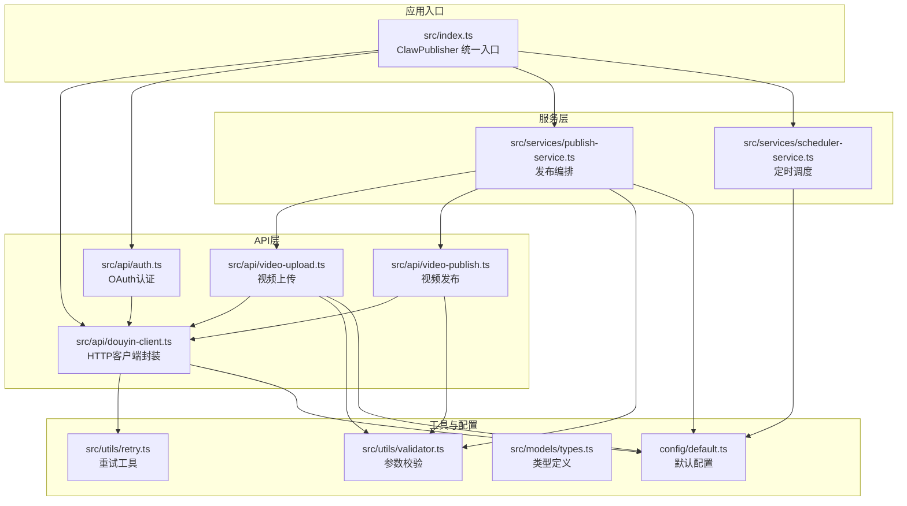
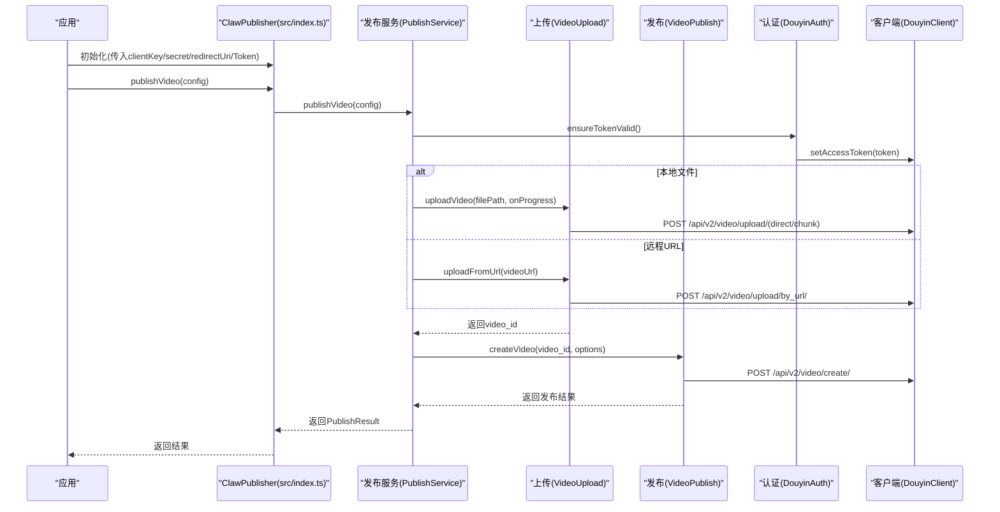
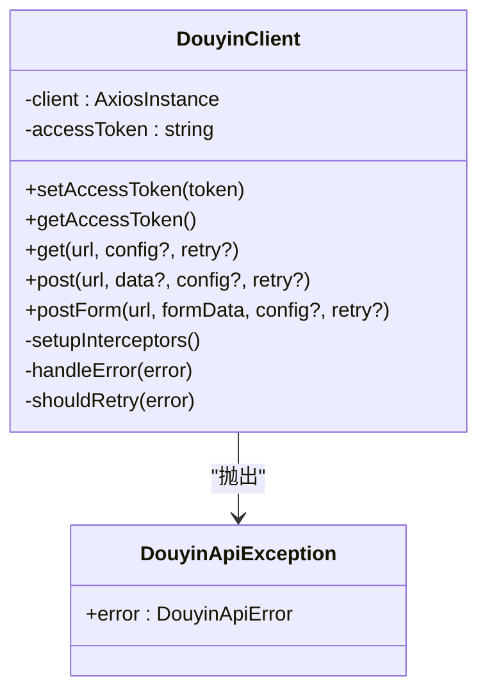
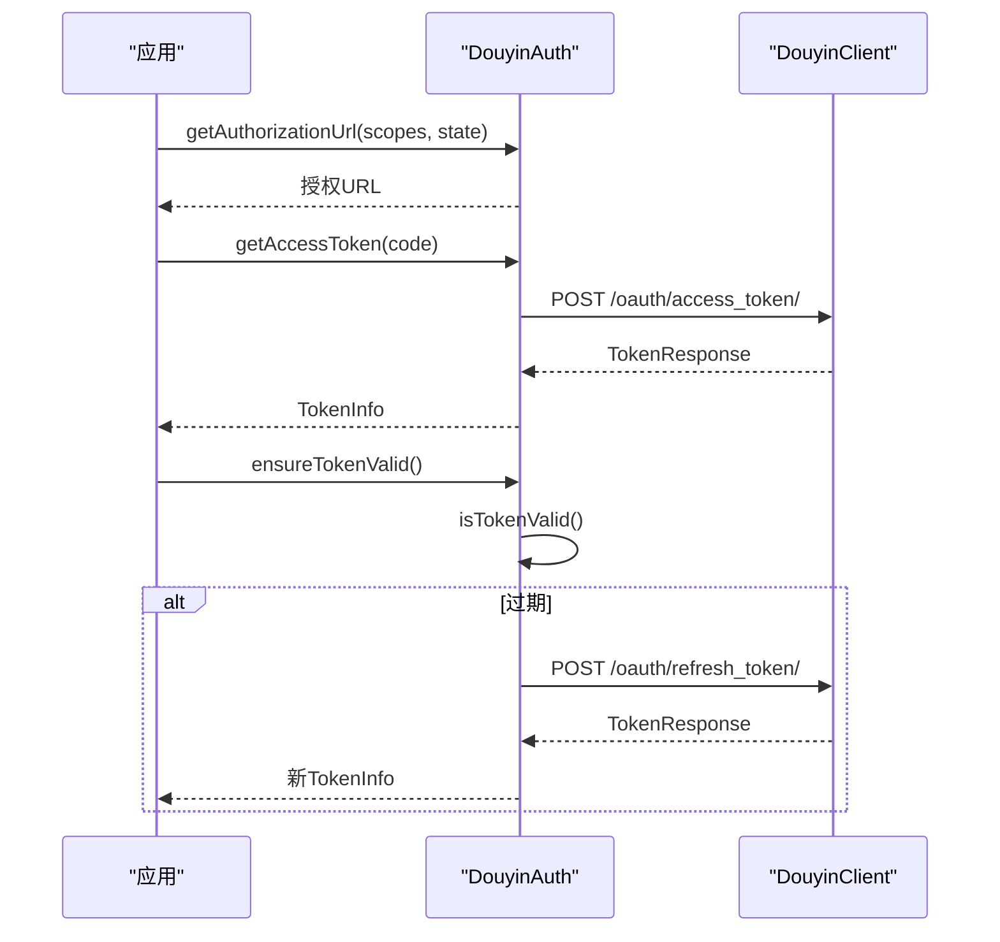
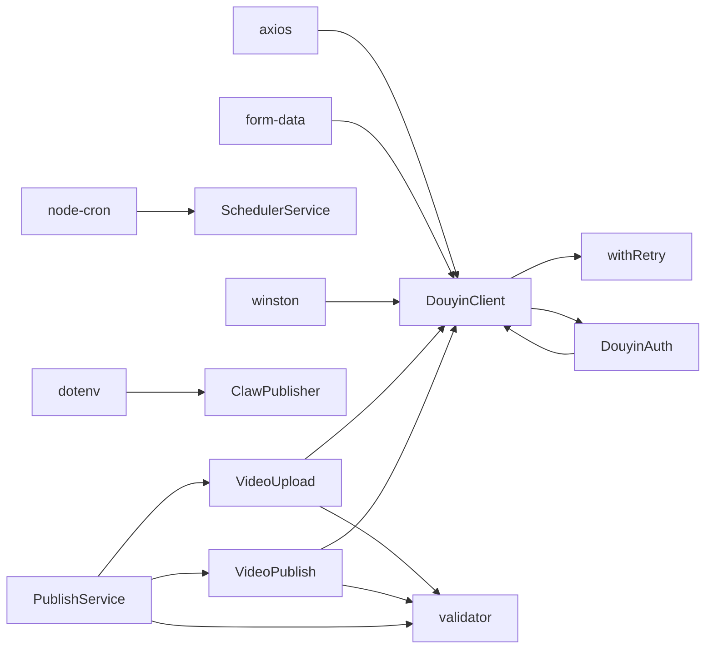

# 抖音客户端API

<cite>
**本文引用的文件**
- [src/api/douyin-client.ts](file://src/api/douyin-client.ts)
- [src/api/auth.ts](file://src/api/auth.ts)
- [src/api/video-upload.ts](file://src/api/video-upload.ts)
- [src/api/video-publish.ts](file://src/api/video-publish.ts)
- [src/services/publish-service.ts](file://src/services/publish-service.ts)
- [src/services/scheduler-service.ts](file://src/services/scheduler-service.ts)
- [src/utils/retry.ts](file://src/utils/retry.ts)
- [src/utils/validator.ts](file://src/utils/validator.ts)
- [src/models/types.ts](file://src/models/types.ts)
- [config/default.ts](file://config/default.ts)
- [src/index.ts](file://src/index.ts)
- [example.ts](file://example.ts)
- [tests/fixtures/mock-responses.ts](file://tests/fixtures/mock-responses.ts)
- [README.md](file://README.md)
- [package.json](file://package.json)
</cite>

## 目录
1. [简介](#简介)
2. [项目结构](#项目结构)
3. [核心组件](#核心组件)
4. [架构总览](#架构总览)
5. [详细组件分析](#详细组件分析)
6. [依赖关系分析](#依赖关系分析)
7. [性能与可靠性](#性能与可靠性)
8. [故障排查指南](#故障排查指南)
9. [结论](#结论)
10. [附录](#附录)

## 简介
本文件为抖音客户端API的完整技术文档，面向开发者与运维人员，覆盖HTTP请求封装、错误处理机制、重试策略、认证流程、上传与发布接口规范、请求/响应格式、最佳实践与常见问题排查。文档基于实际源码进行梳理，确保内容准确可追溯。

## 项目结构
项目采用按功能分层的组织方式，核心模块包括API客户端、认证、上传、发布、调度与工具库，配合统一的类型定义与默认配置。

图表来源
- [src/index.ts:1-248](file://src/index.ts#L1-L248)
- [src/api/douyin-client.ts:1-237](file://src/api/douyin-client.ts#L1-L237)
- [src/api/auth.ts:1-190](file://src/api/auth.ts#L1-L190)
- [src/api/video-upload.ts:1-241](file://src/api/video-upload.ts#L1-L241)
- [src/api/video-publish.ts:1-174](file://src/api/video-publish.ts#L1-L174)
- [src/services/publish-service.ts:1-228](file://src/services/publish-service.ts#L1-L228)
- [src/services/scheduler-service.ts:1-202](file://src/services/scheduler-service.ts#L1-L202)
- [src/utils/retry.ts:1-84](file://src/utils/retry.ts#L1-L84)
- [src/utils/validator.ts:1-116](file://src/utils/validator.ts#L1-L116)
- [src/models/types.ts:1-201](file://src/models/types.ts#L1-L201)
- [config/default.ts:1-49](file://config/default.ts#L1-L49)

章节来源
- [src/index.ts:1-248](file://src/index.ts#L1-L248)
- [config/default.ts:1-49](file://config/default.ts#L1-L49)

## 核心组件
- 抖音客户端（DouyinClient）
  - 基于Axios实例封装，内置请求/响应拦截器，自动注入access_token，统一错误处理与日志记录。
  - 提供GET/POST/POST(FormData multipart)三类请求方法，并集成带指数退避的重试逻辑。
- OAuth认证（DouyinAuth）
  - 生成授权URL、换取/刷新Token、Token有效性检查与自动刷新。
- 视频上传（VideoUpload）
  - 支持直接上传与分片上传，自动选择策略；支持URL直传；提供上传进度回调。
- 视频发布（VideoPublish）
  - 构建发布参数（标题、描述、话题、@用户、POI、小程序挂载、商品链接、定时发布等），查询状态与删除视频。
- 发布服务（PublishService）
  - 业务编排：一站式上传+发布、仅上传、仅发布、下载后发布；统一结果封装。
- 定时调度（SchedulerService）
  - 基于node-cron的定时发布任务管理。
- 工具与配置
  - 重试工具（withRetry）、参数校验（validator）、类型定义（models/types）、默认配置（config/default）。

章节来源
- [src/api/douyin-client.ts:13-237](file://src/api/douyin-client.ts#L13-L237)
- [src/api/auth.ts:29-190](file://src/api/auth.ts#L29-L190)
- [src/api/video-upload.ts:20-241](file://src/api/video-upload.ts#L20-L241)
- [src/api/video-publish.ts:15-174](file://src/api/video-publish.ts#L15-L174)
- [src/services/publish-service.ts:22-228](file://src/services/publish-service.ts#L22-L228)
- [src/services/scheduler-service.ts:23-202](file://src/services/scheduler-service.ts#L23-L202)
- [src/utils/retry.ts:41-84](file://src/utils/retry.ts#L41-L84)
- [src/utils/validator.ts:17-116](file://src/utils/validator.ts#L17-L116)
- [src/models/types.ts:1-201](file://src/models/types.ts#L1-L201)
- [config/default.ts:5-49](file://config/default.ts#L5-L49)

## 架构总览
下图展示ClawPublisher作为统一入口，协调认证、上传、发布与调度服务的整体交互。

图表来源
- [src/index.ts:29-248](file://src/index.ts#L29-L248)
- [src/services/publish-service.ts:38-80](file://src/services/publish-service.ts#L38-L80)
- [src/api/video-upload.ts:35-54](file://src/api/video-upload.ts#L35-L54)
- [src/api/video-upload.ts:84-95](file://src/api/video-upload.ts#L84-L95)
- [src/api/video-upload.ts:220-237](file://src/api/video-upload.ts#L220-L237)
- [src/api/video-publish.ts:30-54](file://src/api/video-publish.ts#L30-L54)
- [src/api/douyin-client.ts:124-198](file://src/api/douyin-client.ts#L124-L198)

## 详细组件分析

### 抖音客户端（DouyinClient）
- 功能要点
  - Axios实例化：设置基础URL、超时、默认Content-Type。
  - 请求拦截：自动注入access_token到查询参数；记录请求日志。
  - 响应拦截：解析通用响应结构，识别data中的error_code并抛出DouyinApiException；对Axios错误进行分类处理。
  - GET/POST/POST(FormData)：统一封装，返回data.data；集成withRetry重试。
  - 重试判定：针对特定限流错误码与网络/超时错误进行指数退避重试。
- 关键实现参考
  - [构造与拦截器:17-91](file://src/api/douyin-client.ts#L17-L91)
  - [GET/POST/POST(FormData):124-198](file://src/api/douyin-client.ts#L124-L198)
  - [错误处理与异常:97-116](file://src/api/douyin-client.ts#L97-L116)
  - [重试判定:204-220](file://src/api/douyin-client.ts#L204-L220)

图表来源
- [src/api/douyin-client.ts:13-237](file://src/api/douyin-client.ts#L13-L237)

章节来源
- [src/api/douyin-client.ts:13-237](file://src/api/douyin-client.ts#L13-L237)

### OAuth认证（DouyinAuth）
- 功能要点
  - 生成授权URL（支持scope与state）。
  - 授权码换取Token、刷新Token、Token有效性检查与自动刷新。
  - Token信息持久化与恢复。
- 关键实现参考
  - [授权URL生成:45-60](file://src/api/auth.ts#L45-L60)
  - [换取Token:67-91](file://src/api/auth.ts#L67-L91)
  - [刷新Token:98-127](file://src/api/auth.ts#L98-L127)
  - [Token有效性检查与自动刷新:133-151](file://src/api/auth.ts#L133-L151)

图表来源
- [src/api/auth.ts:45-151](file://src/api/auth.ts#L45-L151)
- [src/api/douyin-client.ts:149-166](file://src/api/douyin-client.ts#L149-L166)

章节来源
- [src/api/auth.ts:29-190](file://src/api/auth.ts#L29-L190)

### 视频上传（VideoUpload）
- 功能要点
  - 自动选择上传方式：小文件直接上传，大文件分片上传。
  - 直接上传：multipart/form-data，监听上传进度。
  - 分片上传：init → upload part × N → complete。
  - URL直传：无需本地文件，直接提交URL。
- 关键实现参考
  - [上传入口与策略:35-54](file://src/api/video-upload.ts#L35-L54)
  - [直接上传:62-96](file://src/api/video-upload.ts#L62-L96)
  - [分片上传流程:104-152](file://src/api/video-upload.ts#L104-L152)
  - [初始化/上传分片/完成:160-213](file://src/api/video-upload.ts#L160-L213)
  - [URL直传:220-237](file://src/api/video-upload.ts#L220-L237)

图表来源
- [src/api/video-upload.ts:35-54](file://src/api/video-upload.ts#L35-L54)
- [src/api/video-upload.ts:160-213](file://src/api/video-upload.ts#L160-L213)

章节来源
- [src/api/video-upload.ts:20-241](file://src/api/video-upload.ts#L20-L241)

### 视频发布（VideoPublish）
- 功能要点
  - 构建发布参数：标题、描述（含hashtag拼接）、@用户、POI、小程序挂载、商品链接、定时发布。
  - 查询视频状态、删除视频。
- 关键实现参考
  - [构建参数与调用创建接口:30-54](file://src/api/video-publish.ts#L30-L54)
  - [参数构建逻辑:62-125](file://src/api/video-publish.ts#L62-L125)
  - [查询状态:132-154](file://src/api/video-publish.ts#L132-L154)
  - [删除视频:157-170](file://src/api/video-publish.ts#L157-L170)

章节来源
- [src/api/video-publish.ts:15-174](file://src/api/video-publish.ts#L15-L174)

### 发布服务（PublishService）
- 功能要点
  - 一站式发布：上传（本地/URL）+ 发布。
  - 仅上传/仅发布/下载后发布。
  - 统一结果封装（success、videoId、shareUrl、error、createTime）。
- 关键实现参考
  - [一站式发布:38-80](file://src/services/publish-service.ts#L38-80)
  - [下载并发布:133-172](file://src/services/publish-service.ts#L133-172)

章节来源
- [src/services/publish-service.ts:22-228](file://src/services/publish-service.ts#L22-L228)

### 定时调度（SchedulerService）
- 功能要点
  - 注册定时任务（cron表达式）、取消、列出、清理与停止。
  - 与发布服务协作执行定时发布。
- 关键实现参考
  - [注册与执行:37-162](file://src/services/scheduler-service.ts#L37-162)
  - [任务管理:79-115](file://src/services/scheduler-service.ts#L79-115)

章节来源
- [src/services/scheduler-service.ts:23-202](file://src/services/scheduler-service.ts#L23-L202)

### 重试工具（withRetry）
- 功能要点
  - 指数退避延迟计算、最大重试次数、最大延迟时间、自定义shouldRetry条件。
- 关键实现参考
  - [默认配置与延迟计算:9-25](file://src/utils/retry.ts#L9-L25)
  - [重试执行逻辑:41-81](file://src/utils/retry.ts#L41-L81)

章节来源
- [src/utils/retry.ts:1-84](file://src/utils/retry.ts#L1-L84)

### 参数校验（validator）
- 功能要点
  - 视频文件格式与大小校验；发布选项长度与定时发布时间范围校验；hashtag格式化。
- 关键实现参考
  - [文件校验:22-39](file://src/utils/validator.ts#L22-L39)
  - [发布选项校验:45-86](file://src/utils/validator.ts#L45-L86)
  - [hashtag格式化:102-107](file://src/utils/validator.ts#L102-L107)

章节来源
- [src/utils/validator.ts:1-116](file://src/utils/validator.ts#L1-L116)

## 依赖关系分析
- 外部依赖
  - axios、form-data、node-cron、winston、dotenv等。
- 内部耦合
  - PublishService聚合VideoUpload与VideoPublish；SchedulerService依赖PublishService；DouyinAuth依赖DouyinClient；各模块共享types与config。
- 循环依赖
  - 无明显循环依赖，职责边界清晰。

图表来源
- [package.json:14-29](file://package.json#L14-L29)
- [src/index.ts:1-248](file://src/index.ts#L1-L248)
- [src/api/douyin-client.ts:1-237](file://src/api/douyin-client.ts#L1-L237)
- [src/api/auth.ts:1-190](file://src/api/auth.ts#L1-L190)
- [src/api/video-upload.ts:1-241](file://src/api/video-upload.ts#L1-L241)
- [src/api/video-publish.ts:1-174](file://src/api/video-publish.ts#L1-L174)
- [src/services/publish-service.ts:1-228](file://src/services/publish-service.ts#L1-L228)
- [src/services/scheduler-service.ts:1-202](file://src/services/scheduler-service.ts#L1-L202)
- [src/utils/retry.ts:1-84](file://src/utils/retry.ts#L1-L84)
- [src/utils/validator.ts:1-116](file://src/utils/validator.ts#L1-L116)

章节来源
- [package.json:1-34](file://package.json#L1-L34)

## 性能与可靠性
- 超时与连接
  - Axios超时默认30秒，建议结合业务场景调整。
- 重试策略
  - 默认最多3次重试，基础延迟1秒，最大延迟30秒；针对限流与网络错误自动重试。
- 上传优化
  - 大文件分片上传，支持自定义分片大小；直接上传支持进度回调。
- 日志与可观测性
  - 统一日志输出，便于定位问题与审计。

章节来源
- [src/api/douyin-client.ts:18-24](file://src/api/douyin-client.ts#L18-L24)
- [src/utils/retry.ts:9-13](file://src/utils/retry.ts#L9-L13)
- [config/default.ts:17-24](file://config/default.ts#L17-L24)
- [src/api/video-upload.ts:107-112](file://src/api/video-upload.ts#L107-L112)

## 故障排查指南
- 常见错误与处理
  - 限流/频率过高：错误码429及特定业务限流码会触发自动重试。
  - 参数错误：data.data.error_code非0时抛出DouyinApiException。
  - 网络/超时：捕获网络错误与超时，触发重试。
  - 未授权：需检查Token有效性与刷新流程。
- 排查步骤
  - 检查Token有效期与刷新；确认access_token已注入；查看日志输出；复现重试行为。
- 相关实现参考
  - [错误处理与异常抛出:97-116](file://src/api/douyin-client.ts#L97-L116)
  - [重试判定:204-220](file://src/api/douyin-client.ts#L204-L220)
  - [Mock错误响应:70-91](file://tests/fixtures/mock-responses.ts#L70-L91)

章节来源
- [src/api/douyin-client.ts:97-116](file://src/api/douyin-client.ts#L97-L116)
- [src/api/douyin-client.ts:204-220](file://src/api/douyin-client.ts#L204-L220)
- [tests/fixtures/mock-responses.ts:70-91](file://tests/fixtures/mock-responses.ts#L70-L91)

## 结论
该抖音客户端API以清晰的分层设计实现了认证、上传、发布与调度的完整能力，具备完善的错误处理与重试机制，适合在生产环境中稳定运行。建议结合业务场景合理配置重试与分片参数，并严格遵循抖音API的速率限制与内容规范。

## 附录

### API接口规范与认证方法
- 基础URL
  - 默认基础URL来自配置：BASE_URL。
- 认证方法
  - OAuth 2.0：授权码换取access_token与refresh_token；支持刷新与有效期检查。
- 请求头
  - 默认Content-Type为application/json；multipart上传时动态设置为multipart/form-data。
- 通用响应结构
  - data字段承载业务数据；message为消息；部分接口在data.data中携带error_code与description。

章节来源
- [config/default.ts:5-8](file://config/default.ts#L5-L8)
- [src/api/auth.ts:67-91](file://src/api/auth.ts#L67-L91)
- [src/api/douyin-client.ts:21-24](file://src/api/douyin-client.ts#L21-L24)
- [src/models/types.ts:142-145](file://src/models/types.ts#L142-L145)

### 具体端点与参数说明
- 视频上传
  - 直接上传：POST /api/v2/video/upload/
  - 分片初始化：POST /api/v2/video/upload/init/
  - 分片上传：POST /api/v2/video/upload/part/
  - 分片完成：POST /api/v2/video/upload/complete/
  - URL直传：POST /api/v2/video/upload/by_url/
- 视频发布
  - 创建视频：POST /api/v2/video/create/
  - 查询状态：POST /api/v2/video/data/
  - 删除视频：POST /api/v2/video/delete/
- OAuth
  - 获取Token：POST /oauth/access_token/
  - 刷新Token：POST /oauth/refresh_token/

章节来源
- [src/api/video-upload.ts:84-95](file://src/api/video-upload.ts#L84-L95)
- [src/api/video-upload.ts:163-173](file://src/api/video-upload.ts#L163-L173)
- [src/api/video-upload.ts:190-194](file://src/api/video-upload.ts#L190-L194)
- [src/api/video-upload.ts:204-213](file://src/api/video-upload.ts#L204-L213)
- [src/api/video-upload.ts:227-237](file://src/api/video-upload.ts#L227-L237)
- [src/api/video-publish.ts:43-54](file://src/api/video-publish.ts#L43-L54)
- [src/api/video-publish.ts:140-154](file://src/api/video-publish.ts#L140-L154)
- [src/api/video-publish.ts:164-170](file://src/api/video-publish.ts#L164-L170)
- [src/api/auth.ts:77-81](file://src/api/auth.ts#L77-L81)
- [src/api/auth.ts:114-117](file://src/api/auth.ts#L114-L117)

### 请求与响应示例（路径参考）
- Token获取/刷新
  - [示例响应:6-24](file://tests/fixtures/mock-responses.ts#L6-L24)
- 上传初始化/分片/完成
  - [示例响应:27-45](file://tests/fixtures/mock-responses.ts#L27-L45)
- URL直传
  - [示例响应:47-51](file://tests/fixtures/mock-responses.ts#L47-L51)
- 视频创建/状态
  - [示例响应:54-68](file://tests/fixtures/mock-responses.ts#L54-L68)
- 错误响应
  - [示例响应:70-91](file://tests/fixtures/mock-responses.ts#L70-L91)

章节来源
- [tests/fixtures/mock-responses.ts:1-91](file://tests/fixtures/mock-responses.ts#L1-L91)

### 客户端初始化与最佳实践
- 初始化
  - 通过ClawPublisher传入clientKey、clientSecret、redirectUri与可选Token信息。
- 请求头设置
  - 默认JSON头；multipart上传时由客户端自动设置。
- 错误处理
  - 捕获DouyinApiException与AxiosError，结合日志定位问题。
- 重试策略
  - 使用默认重试配置；必要时传入retryConfig覆盖。
- 最佳实践
  - 上传前校验文件格式与大小；发布前校验标题/描述/hashtag长度与定时发布时间范围；大文件优先分片上传；合理设置分片大小与重试参数。

章节来源
- [src/index.ts:39-67](file://src/index.ts#L39-L67)
- [src/api/douyin-client.ts:18-24](file://src/api/douyin-client.ts#L18-L24)
- [src/utils/retry.ts:45-48](file://src/utils/retry.ts#L45-L48)
- [src/utils/validator.ts:22-39](file://src/utils/validator.ts#L22-L39)
- [src/utils/validator.ts:45-86](file://src/utils/validator.ts#L45-L86)