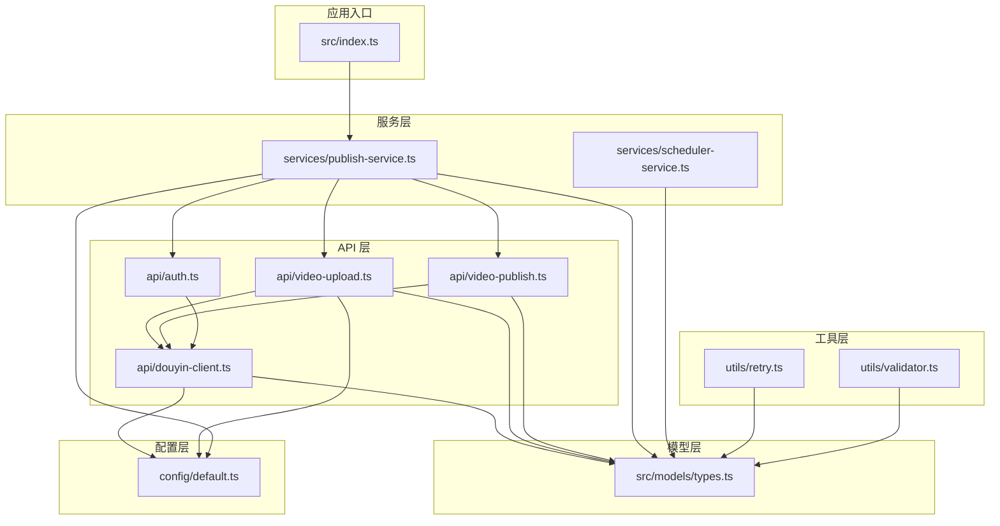
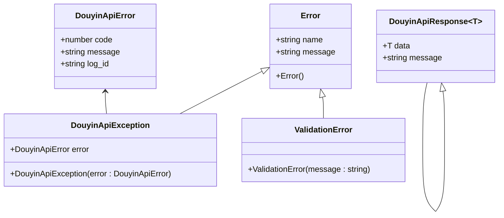
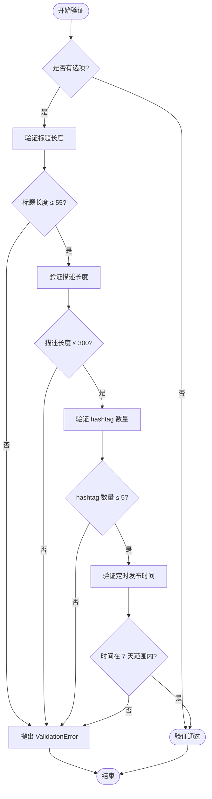

# 类型定义与接口

<cite>
**本文档引用的文件**
- [types.ts](file://src/models/types.ts)
- [douyin-client.ts](file://src/api/douyin-client.ts)
- [auth.ts](file://src/api/auth.ts)
- [video-upload.ts](file://src/api/video-upload.ts)
- [video-publish.ts](file://src/api/video-publish.ts)
- [publish-service.ts](file://src/services/publish-service.ts)
- [scheduler-service.ts](file://src/services/scheduler-service.ts)
- [retry.ts](file://src/utils/retry.ts)
- [validator.ts](file://src/utils/validator.ts)
- [default.ts](file://config/default.ts)
- [index.ts](file://src/index.ts)
</cite>

## 目录
1. [简介](#简介)
2. [项目结构](#项目结构)
3. [核心类型定义](#核心类型定义)
4. [接口规范](#接口规范)
5. [枚举类型](#枚举类型)
6. [常量定义](#常量定义)
7. [类型继承关系](#类型继承关系)
8. [泛型使用](#泛型使用)
9. [类型转换规则](#类型转换规则)
10. [最佳实践指南](#最佳实践指南)
11. [常见错误避免](#常见错误避免)
12. [总结](#总结)

## 简介

本项目是一个基于 TypeScript 的抖音视频发布自动化系统，提供了完整的类型定义和接口规范。本文档详细记录了所有数据模型、接口规范、枚举类型和常量定义，帮助开发者理解和正确使用系统的类型系统。

## 项目结构

项目采用模块化的架构设计，主要分为以下层次：



**图表来源**
- [index.ts:1-248](file://src/index.ts#L1-L248)
- [types.ts:1-201](file://src/models/types.ts#L1-L201)

**章节来源**
- [index.ts:1-248](file://src/index.ts#L1-L248)
- [types.ts:1-201](file://src/models/types.ts#L1-L201)

## 核心类型定义

### 认证相关类型

#### OAuthConfig
OAuth 配置接口，用于抖音开放平台的 OAuth 认证。

| 字段名 | 类型 | 必填 | 描述 |
|--------|------|------|------|
| clientKey | string | 是 | 应用标识符 |
| clientSecret | string | 是 | 应用密钥 |
| redirectUri | string | 是 | 回调地址 |

#### TokenResponse
OAuth 授权响应接口。

| 字段名 | 类型 | 必填 | 描述 |
|--------|------|------|------|
| access_token | string | 是 | 访问令牌 |
| refresh_token | string | 是 | 刷新令牌 |
| expires_in | number | 是 | 过期时间（秒） |
| open_id | string | 是 | 用户标识 |
| scope | string | 是 | 权限范围 |

#### TokenInfo
Token 信息接口，扩展了 TokenResponse 的信息。

| 字段名 | 类型 | 必填 | 描述 |
|--------|------|------|------|
| accessToken | string | 是 | 访问令牌 |
| refreshToken | string | 是 | 刷新令牌 |
| expiresAt | number | 是 | 过期时间戳（毫秒） |
| openId | string | 是 | 用户标识 |
| scope | string | 是 | 权限范围 |

**章节来源**
- [types.ts:17-46](file://src/models/types.ts#L17-L46)

### 上传相关类型

#### UploadConfig
视频上传配置接口。

| 字段名 | 类型 | 必填 | 描述 | 默认值 |
|--------|------|------|------|--------|
| chunkSize | number | 否 | 分片大小（字节） | - |
| onProgress | (progress: UploadProgress) => void | 否 | 上传进度回调 | - |

#### UploadProgress
上传进度接口。

| 字段名 | 类型 | 必填 | 描述 |
|--------|------|------|------|
| loaded | number | 是 | 已上传字节数 |
| total | number | 是 | 总字节数 |
| percentage | number | 是 | 百分比进度 |

#### ChunkUploadInitResponse
分片上传初始化响应接口。

| 字段名 | 类型 | 必填 | 描述 |
|--------|------|------|------|
| data | { upload_id: string } | 是 | 包含 upload_id 的数据对象 |

#### ChunkUploadPartResponse
分片上传响应接口。

| 字段名 | 类型 | 必填 | 描述 |
|--------|------|------|------|
| data | { part_number: number; etag: string } | 是 | 分片信息 |

#### UploadCompleteResponse
上传完成响应接口。

| 字段名 | 类型 | 必填 | 描述 |
|--------|------|------|------|
| data | { video_id: string; video_url?: string } | 是 | 包含视频信息的数据对象 |

**章节来源**
- [types.ts:48-94](file://src/models/types.ts#L48-L94)

### 发布相关类型

#### VideoPublishOptions
视频发布选项接口。

| 字段名 | 类型 | 必填 | 描述 | 限制 |
|--------|------|------|------|------|
| title | string | 否 | 视频标题 | 最大 55 字符 |
| description | string | 否 | 视频描述 | 最大 300 字符 |
| hashtags | string[] | 否 | 话题标签数组 | 最多 5 个 |
| atUsers | string[] | 否 | @提及用户列表 | - |
| poiId | string | 否 | 地理位置 POI ID | - |
| poiName | string | 否 | 地理位置名称 | - |
| microAppId | string | 否 | 小程序 ID | - |
| microAppTitle | string | 否 | 小程序标题 | - |
| microAppUrl | string | 否 | 小程序链接 | - |
| articleId | string | 否 | 商品 ID | - |
| schedulePublishTime | number | 否 | 定时发布时间戳 | 7 天内 |

#### VideoCreateResponse
视频创建响应接口。

| 字段名 | 类型 | 必填 | 描述 |
|--------|------|------|------|
| data | { video_id: string; share_url?: string; create_time?: number } | 是 | 包含视频信息的数据对象 |

**章节来源**
- [types.ts:96-135](file://src/models/types.ts#L96-L135)

### 通用类型

#### DouyinApiResponse<T>
抖音 API 通用响应接口，使用泛型支持不同响应类型。

| 字段名 | 类型 | 必填 | 描述 |
|--------|------|------|------|
| data | T | 是 | 泛型数据对象 |
| message | string | 是 | 响应消息 |

#### DouyinApiError
抖音 API 错误接口。

| 字段名 | 类型 | 必填 | 描述 |
|--------|------|------|------|
| code | number | 是 | 错误码 |
| message | string | 是 | 错误描述 |
| log_id | string | 否 | 日志 ID |

**章节来源**
- [types.ts:137-154](file://src/models/types.ts#L137-L154)

### 服务相关类型

#### PublishTaskConfig
发布任务配置接口。

| 字段名 | 类型 | 必填 | 描述 |
|--------|------|------|------|
| videoPath | string | 是 | 视频文件路径或 URL |
| options | VideoPublishOptions | 否 | 发布选项 |
| isRemoteUrl | boolean | 否 | 是否为远程 URL |

#### PublishResult
发布结果接口。

| 字段名 | 类型 | 必填 | 描述 |
|--------|------|------|------|
| success | boolean | 是 | 是否成功 |
| videoId | string | 否 | 视频 ID |
| shareUrl | string | 否 | 分享链接 |
| error | string | 否 | 错误信息 |
| createTime | number | 否 | 创建时间戳 |

#### ScheduleResult
定时发布结果接口。

| 字段名 | 类型 | 必填 | 描述 | 取值范围 |
|--------|------|------|------|----------|
| taskId | string | 是 | 任务 ID | - |
| scheduledTime | Date | 是 | 预定发布时间 | - |
| status | 'pending' \| 'completed' \| 'failed' \| 'cancelled' | 是 | 任务状态 | - |

#### DouyinConfig
抖音配置接口。

| 字段名 | 类型 | 必填 | 描述 |
|--------|------|------|------|
| clientKey | string | 是 | 应用标识符 |
| clientSecret | string | 是 | 应用密钥 |
| redirectUri | string | 是 | 回调地址 |
| accessToken | string | 否 | 访问令牌 |
| refreshToken | string | 否 | 刷新令牌 |
| openId | string | 否 | 用户标识 |

**章节来源**
- [types.ts:156-201](file://src/models/types.ts#L156-L201)

## 接口规范

### DouyinClient 接口
抖音 API 客户端，提供 HTTP 请求封装和错误处理。

**主要方法：**
- `setAccessToken(token: string): void` - 设置访问令牌
- `getAccessToken(): string | null` - 获取访问令牌
- `get<T>(url: string, config?: AxiosRequestConfig, retryConfig?: Partial<RetryConfig>): Promise<T>` - 发送 GET 请求
- `post<T>(url: string, data?: unknown, config?: AxiosRequestConfig, retryConfig?: Partial<RetryConfig>): Promise<T>` - 发送 POST 请求
- `postForm<T>(url: string, formData: FormData, config?: AxiosRequestConfig, retryConfig?: Partial<RetryConfig>): Promise<T>` - 发送表单请求

**异常处理：**
- `DouyinApiException` - 抖音 API 异常
- `ValidationError` - 参数验证异常

**章节来源**
- [douyin-client.ts:13-237](file://src/api/douyin-client.ts#L13-L237)

### DouyinAuth 接口
OAuth 认证模块，处理令牌获取、刷新和验证。

**主要方法：**
- `getAuthorizationUrl(scopes?: string[], state?: string): string` - 生成授权 URL
- `getAccessToken(authCode: string): Promise<TokenInfo>` - 获取访问令牌
- `refreshAccessToken(refreshToken?: string): Promise<TokenInfo>` - 刷新访问令牌
- `isTokenValid(): boolean` - 检查令牌有效性
- `ensureTokenValid(): Promise<void>` - 确保令牌有效

**常量：**
- `OAUTH_SCOPES` - OAuth 作用域常量

**章节来源**
- [auth.ts:29-190](file://src/api/auth.ts#L29-L190)

### VideoUpload 接口
视频上传模块，支持直接上传和分片上传。

**主要方法：**
- `uploadVideo(filePath: string, config?: UploadConfig): Promise<string>` - 上传视频
- `uploadFromUrl(videoUrl: string): Promise<string>` - 从 URL 上传
- `uploadVideoDirect(filePath: string, config?: UploadConfig): Promise<string>` - 直接上传
- `uploadVideoChunked(filePath: string, config?: UploadConfig): Promise<string>` - 分片上传

**章节来源**
- [video-upload.ts:20-241](file://src/api/video-upload.ts#L20-L241)

### VideoPublish 接口
视频发布模块，处理视频创建、状态查询和删除。

**主要方法：**
- `createVideo(videoId: string, options?: VideoPublishOptions): Promise<VideoCreateResponse>` - 创建视频
- `queryVideoStatus(videoId: string): Promise<{ status: string; shareUrl?: string; createTime?: number; }>` - 查询视频状态
- `deleteVideo(videoId: string): Promise<void>` - 删除视频

**章节来源**
- [video-publish.ts:15-174](file://src/api/video-publish.ts#L15-L174)

### PublishService 接口
发布服务，业务编排层，协调上传和发布流程。

**主要方法：**
- `publishVideo(config: PublishTaskConfig): Promise<PublishResult>` - 发布视频
- `uploadVideo(filePath: string, onProgress?: (progress: UploadProgress) => void): Promise<string>` - 上传视频
- `publishUploadedVideo(videoId: string, options?: VideoPublishOptions): Promise<PublishResult>` - 发布已上传视频
- `downloadAndPublish(videoUrl: string, options?: VideoPublishOptions): Promise<PublishResult>` - 下载并发布

**章节来源**
- [publish-service.ts:22-228](file://src/services/publish-service.ts#L22-L228)

### SchedulerService 接口
定时发布调度服务，使用 cron 表达式管理定时任务。

**主要方法：**
- `schedulePublish(config: PublishTaskConfig, publishTime: Date): ScheduleResult` - 注册定时任务
- `cancelSchedule(taskId: string): boolean` - 取消定时任务
- `listScheduledTasks(): ScheduleResult[]` - 列出定时任务
- `getTask(taskId: string): ScheduleResult | null` - 获取任务详情

**章节来源**
- [scheduler-service.ts:23-202](file://src/services/scheduler-service.ts#L23-L202)

## 枚举类型

### OAuthScope 枚举
OAuth 授权作用域枚举，使用 TypeScript 的 `as const` 语法确保类型安全。

**可用作用域：**
- `VIDEO_CREATE` - 视频创建权限
- `VIDEO_UPLOAD` - 视频上传权限  
- `VIDEO_DATA` - 视频数据权限
- `USER_INFO` - 用户信息权限

**取值范围：**
```typescript
'video.create' | 'video.upload' | 'video.data' | 'user.info'
```

**章节来源**
- [auth.ts:10-15](file://src/api/auth.ts#L10-L15)

### 任务状态枚举
定时任务的状态枚举。

**状态值：**
- `'pending'` - 待执行
- `'completed'` - 已完成
- `'failed'` - 已失败
- `'cancelled'` - 已取消

**章节来源**
- [types.ts:187](file://src/models/types.ts#L187)

## 常量定义

### API_CONFIG
API 配置常量。

| 常量名 | 值 | 描述 |
|--------|-----|------|
| BASE_URL | 'https://open.douyin.com' | 抖音开放平台 API 基地址 |

**章节来源**
- [default.ts:5-8](file://config/default.ts#L5-L8)

### UPLOAD_CONFIG
上传配置常量。

| 常量名 | 值 | 描述 |
|--------|-----|------|
| CHUNK_UPLOAD_THRESHOLD | 134217728 | 分片上传阈值（128MB） |
| DEFAULT_CHUNK_SIZE | 5242880 | 默认分片大小（5MB） |

**章节来源**
- [default.ts:10-15](file://config/default.ts#L10-L15)

### RETRY_CONFIG
重试配置常量。

| 常量名 | 值 | 描述 |
|--------|-----|------|
| MAX_RETRIES | 3 | 最大重试次数 |
| BASE_DELAY | 1000 | 基础延迟时间（毫秒） |
| MAX_DELAY | 30000 | 最大延迟时间（毫秒） |

**章节来源**
- [default.ts:17-24](file://config/default.ts#L17-L24)

### VIDEO_CONFIG
视频配置常量。

| 常量名 | 值 | 描述 |
|--------|-----|------|
| SUPPORTED_FORMATS | ['mp4', 'mov', 'avi'] | 支持的视频格式 |
| MAX_SIZE | 4294967296 | 视频大小限制（4GB） |

**章节来源**
- [default.ts:26-31](file://config/default.ts#L26-L31)

### CONTENT_CONFIG
内容配置常量。

| 常量名 | 值 | 描述 |
|--------|-----|------|
| MAX_TITLE_LENGTH | 55 | 标题最大长度 |
| MAX_DESCRIPTION_LENGTH | 300 | 描述最大长度 |
| MAX_HASHTAG_COUNT | 5 | hashtag 最大数量 |

**章节来源**
- [default.ts:33-40](file://config/default.ts#L33-L40)

## 类型继承关系

项目中的类型继承关系主要体现在异常类型和接口实现上：



**图表来源**
- [douyin-client.ts:226-234](file://src/api/douyin-client.ts#L226-L234)
- [validator.ts:10-15](file://src/utils/validator.ts#L10-L15)
- [types.ts:142-154](file://src/models/types.ts#L142-L154)

**章节来源**
- [douyin-client.ts:226-234](file://src/api/douyin-client.ts#L226-L234)
- [validator.ts:10-15](file://src/utils/validator.ts#L10-L15)
- [types.ts:142-154](file://src/models/types.ts#L142-L154)

## 泛型使用

### DouyinApiResponse<T>
项目广泛使用泛型来实现类型安全的 API 响应处理：

```typescript
async get<T>(
  url: string,
  config?: AxiosRequestConfig,
  retryConfig?: Partial<RetryConfig>
): Promise<T> {
  return withRetry(
    async () => {
      const response = await this.client.get<DouyinApiResponse<T>>(url, config);
      return response.data.data;
    },
    // ...
  );
}
```

**优势：**
- 编译时类型检查
- IDE 智能提示
- 避免运行时类型错误

**章节来源**
- [douyin-client.ts:124-140](file://src/api/douyin-client.ts#L124-L140)

### 泛型约束
在 `PublishService` 中使用泛型约束来确保类型安全：

```typescript
private async executeTask(taskId: string): Promise<void> {
  const task = this.tasks.get(taskId);
  
  if (!task || task.status !== 'pending') {
    return;
  }

  try {
    const result = await this.publishService.publishVideo(task.config);
    
    task.status = result.success ? 'completed' : 'failed';
    task.result = result;
  } catch (error) {
    task.status = 'failed';
    task.result = error;
  }
}
```

**章节来源**
- [scheduler-service.ts:140-162](file://src/services/scheduler-service.ts#L140-L162)

## 类型转换规则

### 数据类型转换

#### 时间戳转换
- `expiresAt: number` - 存储 Unix 时间戳（毫秒）
- `schedulePublishTime: number` - 存储 Unix 时间戳（秒）

#### 数组类型转换
- `hashtags: string[]` - 转换为格式化字符串：`#美食 #旅行`
- `atUsers: string[]` - 直接传递给 API

#### 对象属性映射
- `VideoPublishOptions` 中的驼峰命名转换为 API 所需的下划线命名：
  - `microAppId` → `micro_app_id`
  - `schedulePublishTime` → `schedule_publish_time`

### 类型验证规则

#### 参数验证流程


**图表来源**
- [validator.ts:45-86](file://src/utils/validator.ts#L45-L86)

**章节来源**
- [validator.ts:45-86](file://src/utils/validator.ts#L45-L86)

## 最佳实践指南

### 类型使用最佳实践

#### 1. 使用泛型接口
```typescript
// 推荐：使用泛型确保类型安全
async getData<T>(url: string): Promise<T> {
  const response = await fetch(url);
  return response.json();
}

// 不推荐：使用 any 类型
async getBadData(url: string): Promise<any> {
  const response = await fetch(url);
  return response.json();
}
```

#### 2. 接口设计原则
- **单一职责**：每个接口只负责一个功能领域
- **最小暴露**：只暴露必要的公共方法和属性
- **类型安全**：使用 TypeScript 的类型系统确保编译时检查

#### 3. 错误处理模式
```typescript
// 推荐：使用自定义异常类型
try {
  await apiCall();
} catch (error) {
  if (error instanceof DouyinApiException) {
    // 处理抖音 API 错误
  } else if (error instanceof ValidationError) {
    // 处理参数验证错误
  }
}
```

#### 4. 配置管理
- 使用常量文件集中管理配置
- 为每个配置项提供明确的类型定义
- 在构建时进行配置验证

### 常见错误避免

#### 1. 类型不匹配错误
**问题：** 传入错误的数据类型
**解决方案：** 使用 TypeScript 的严格类型检查，确保传入正确的类型

#### 2. 异步操作错误
**问题：** 忘记处理异步操作的错误
**解决方案：** 使用 try-catch 包装异步操作，或使用 Promise 的 catch 方法

#### 3. 内存泄漏
**问题：** 未正确清理定时器和事件监听器
**解决方案：** 在组件销毁时清理所有定时器和监听器

#### 4. API 限流
**问题：** 频繁调用 API 导致被限流
**解决方案：** 使用重试机制和指数退避算法

**章节来源**
- [retry.ts:41-81](file://src/utils/retry.ts#L41-L81)

## 常见错误避免

### 类型相关错误

#### 1. 可选属性访问错误
**问题：** 直接访问可能为 undefined 的属性
**解决方案：**
```typescript
// 推荐
if (options?.title) {
  // 处理标题
}

// 或使用类型守卫
if ('title' in options) {
  // 处理标题
}
```

#### 2. 泛型约束错误
**问题：** 泛型参数不符合预期的约束
**解决方案：** 明确泛型约束，使用 TypeScript 的类型检查

#### 3. 接口兼容性错误
**问题：** 新增字段导致现有代码不兼容
**解决方案：** 使用可选属性和默认值，保持向后兼容

### 运行时错误

#### 1. 网络请求错误
**问题：** 网络不稳定导致请求失败
**解决方案：** 实现重试机制和错误恢复策略

#### 2. 资源管理错误
**问题：** 文件句柄未正确关闭
**解决方案：** 使用 try-finally 确保资源释放

#### 3. 内存溢出
**问题：** 大文件处理导致内存不足
**解决方案：** 使用流式处理和分块上传

**章节来源**
- [video-upload.ts:104-152](file://src/api/video-upload.ts#L104-L152)
- [publish-service.ts:133-172](file://src/services/publish-service.ts#L133-L172)

## 总结

本项目提供了完整的 TypeScript 类型定义和接口规范，涵盖了：

1. **全面的类型定义**：从基础数据类型到复杂业务模型
2. **严格的接口规范**：清晰的方法签名和参数要求
3. **完善的错误处理**：自定义异常类型和错误恢复机制
4. **类型安全保证**：利用 TypeScript 的泛型和类型系统
5. **最佳实践指导**：提供开发和使用建议

通过遵循本文档中的类型定义和使用指南，开发者可以更安全、更高效地使用和扩展这个抖音视频发布系统。