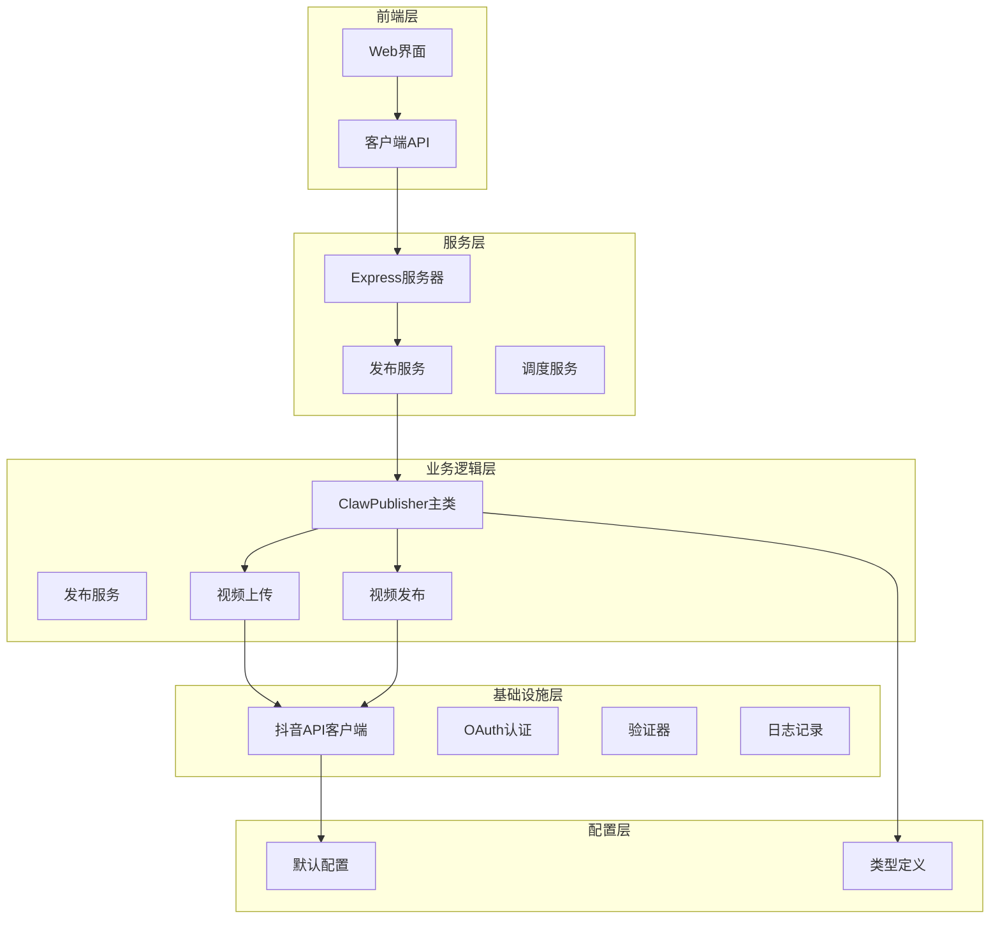
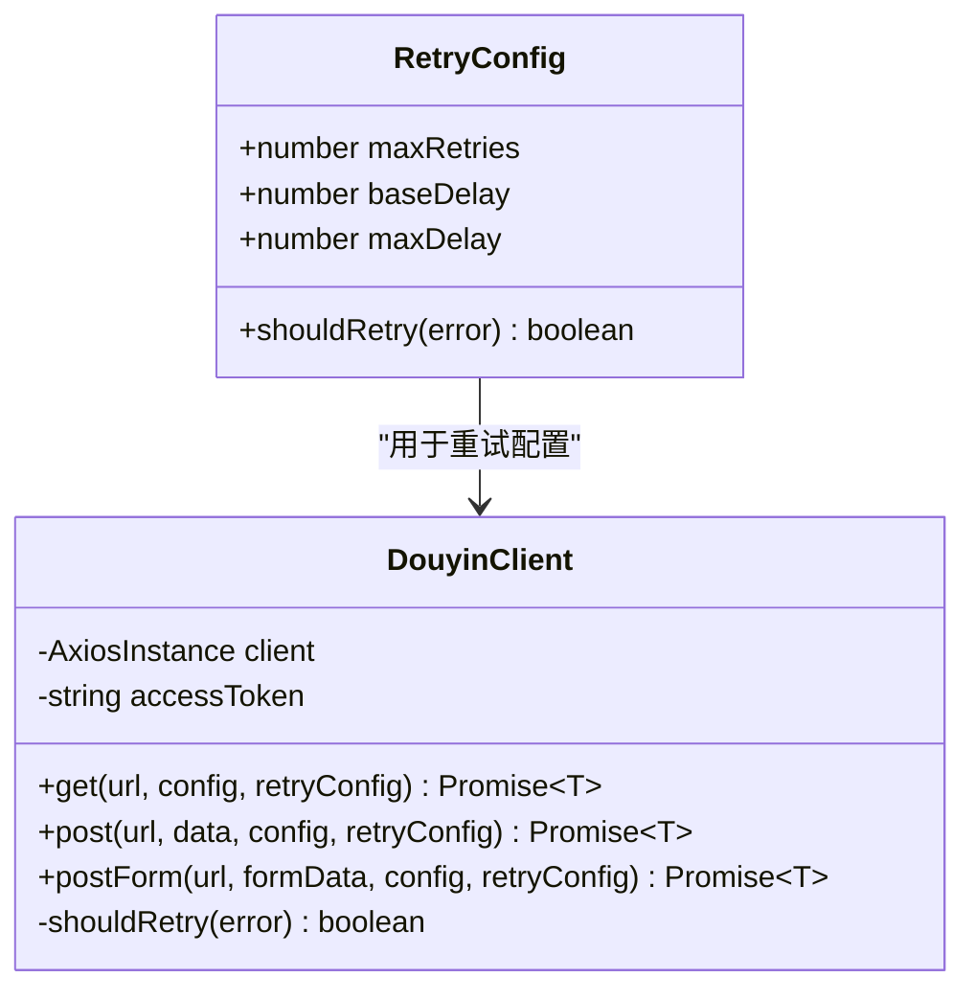
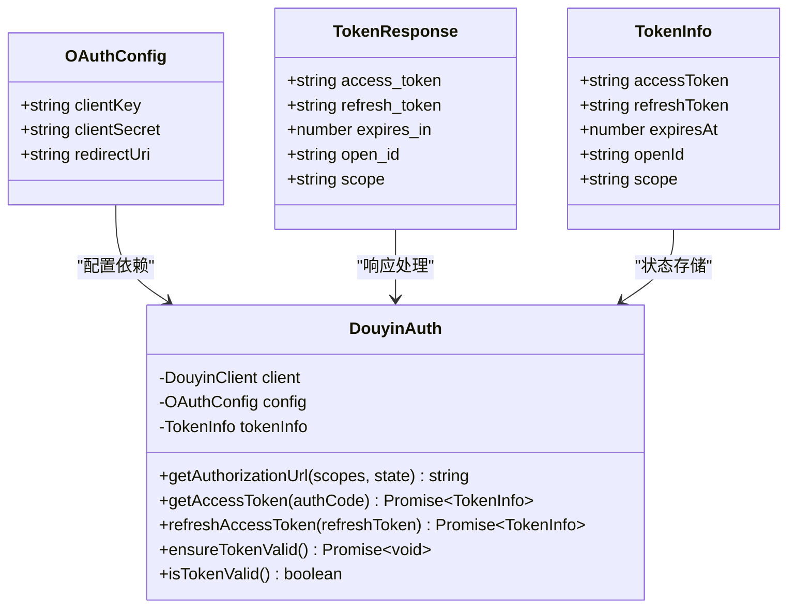
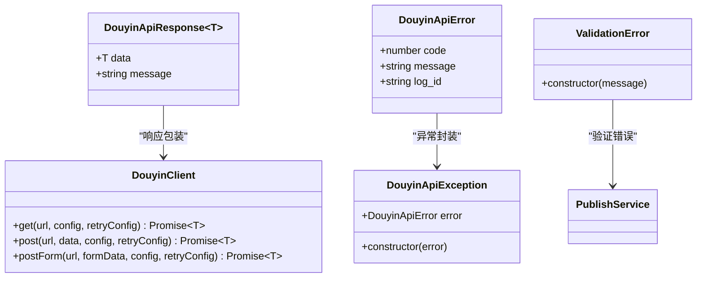
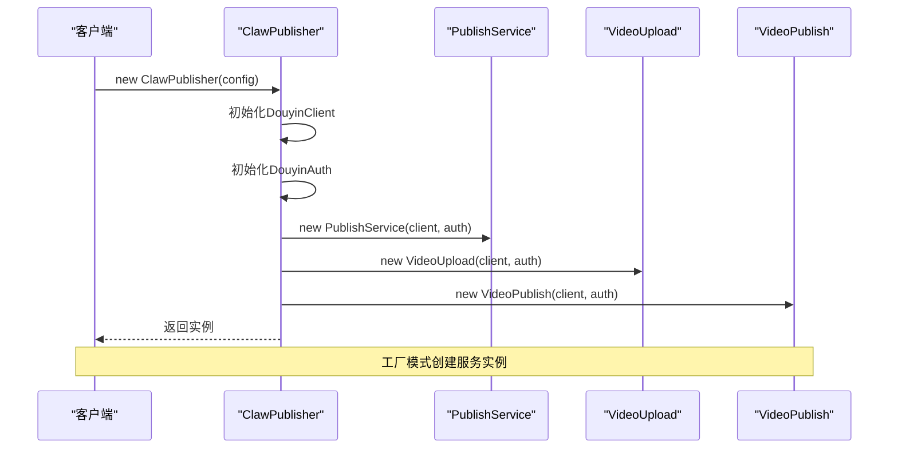
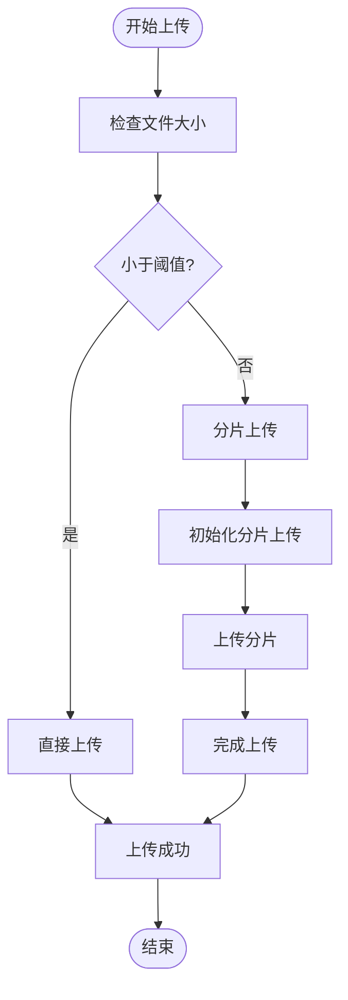
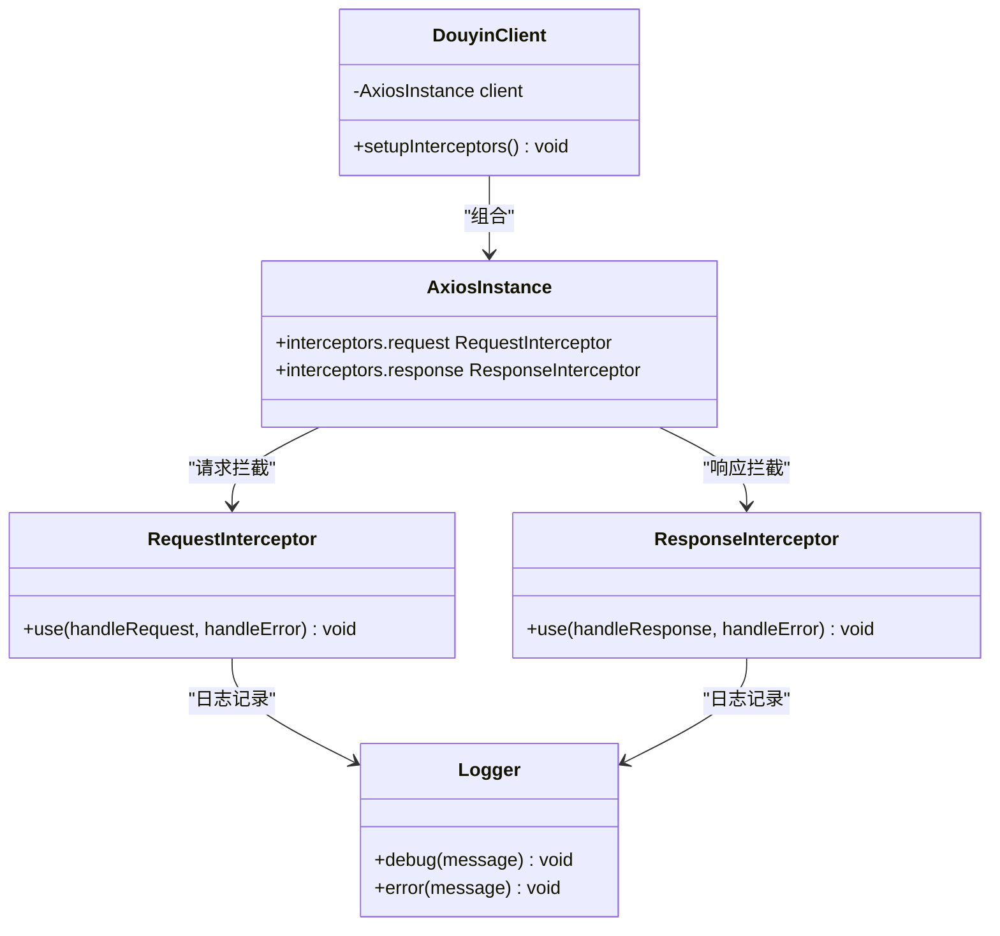
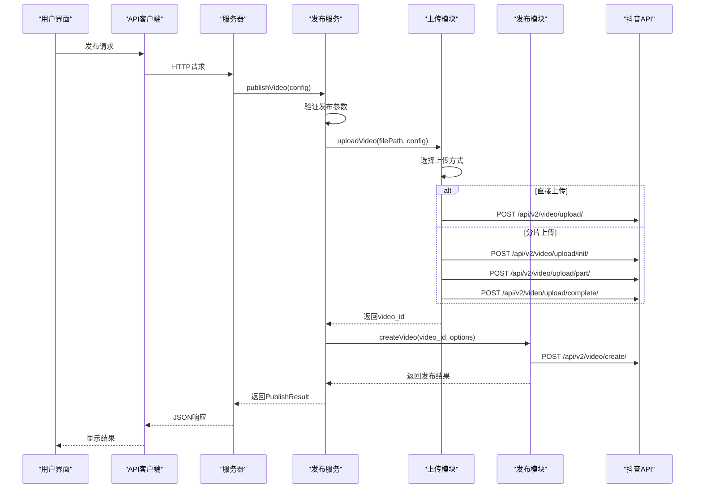
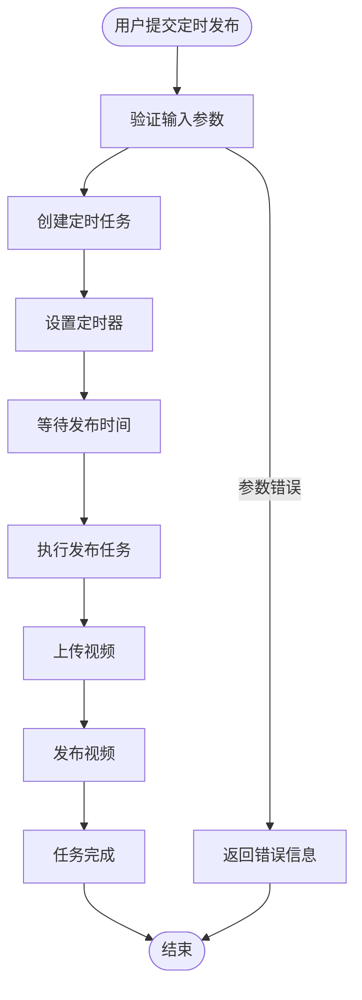

# 类型定义与接口

<cite>
**本文档引用的文件**
- [types.ts](file://src/models/types.ts)
- [douyin-client.ts](file://src/api/douyin-client.ts)
- [auth.ts](file://src/api/auth.ts)
- [video-upload.ts](file://src/api/video-upload.ts)
- [video-publish.ts](file://src/api/video-publish.ts)
- [publish-service.ts](file://src/services/publish-service.ts)
- [index.ts](file://src/index.ts)
- [default.ts](file://config/default.ts)
- [client.ts](file://web/client/src/api/client.ts)
- [publish.ts](file://web/server/src/routes/publish.ts)
- [publisher.ts](file://web/server/src/services/publisher.ts)
- [Publish.tsx](file://web/client/src/pages/Publish.tsx)
</cite>

## 目录
1. [简介](#简介)
2. [项目结构概览](#项目结构概览)
3. [核心类型定义](#核心类型定义)
4. [接口设计模式](#接口设计模式)
5. [类型关系图](#类型关系图)
6. [数据流分析](#数据流分析)
7. [最佳实践建议](#最佳实践建议)
8. [故障排除指南](#故障排除指南)
9. [总结](#总结)

## 简介

本文档深入分析了抖音视频发布系统的类型定义与接口设计，涵盖了从底层API客户端到上层业务服务的完整类型体系。该系统采用严格的类型安全设计，确保在编译时就能发现潜在的类型错误，提高代码质量和开发效率。

## 项目结构概览

该项目采用分层架构设计，主要分为以下几个层次：



**图表来源**
- [index.ts:29-244](file://src/index.ts#L29-L244)
- [publish-service.ts:22-31](file://src/services/publish-service.ts#L22-L31)
- [douyin-client.ts:13-27](file://src/api/douyin-client.ts#L13-L27)

## 核心类型定义

### 重试配置接口

系统实现了灵活的重试机制，支持自定义重试策略：



**图表来源**
- [types.ts:4-13](file://src/models/types.ts#L4-L13)
- [douyin-client.ts:124-166](file://src/api/douyin-client.ts#L124-L166)

### 认证相关类型

系统采用OAuth 2.0标准实现认证流程：



**图表来源**
- [types.ts:20-46](file://src/models/types.ts#L20-L46)
- [auth.ts:29-186](file://src/api/auth.ts#L29-L186)

### 上传相关类型

系统支持两种上传方式：直接上传和分片上传：

```mermaid
classDiagram
class UploadConfig {
+number chunkSize
+onProgress(progress) void
}
class UploadProgress {
+number loaded
+number total
+number percentage
}
class ChunkUploadInitResponse {
+data : {
+string upload_id
}
}
class ChunkUploadPartResponse {
+data : {
+number part_number
+string etag
}
}
class UploadCompleteResponse {
+data : {
+string video_id
+string video_url
}
}
class VideoUpload {
-DouyinClient client
-DouyinAuth auth
+uploadVideo(filePath, config) Promise~string~
-uploadVideoDirect(filePath, config) Promise~string~
-uploadVideoChunked(filePath, config) Promise~string~
-initChunkUpload(totalSize, fileName) Promise~string~
-uploadChunk(uploadId, chunkData, partNumber) Promise~void~
-completeChunkUpload(uploadId) Promise~UploadCompleteResponse~
+uploadFromUrl(videoUrl) Promise~string~
}
UploadConfig --> VideoUpload : "配置依赖"
UploadProgress --> VideoUpload : "进度回调"
ChunkUploadInitResponse --> VideoUpload : "初始化响应"
ChunkUploadPartResponse --> VideoUpload : "分片响应"
UploadCompleteResponse --> VideoUpload : "完成响应"
```

**图表来源**
- [types.ts:53-94](file://src/models/types.ts#L53-L94)
- [video-upload.ts:20-237](file://src/api/video-upload.ts#L20-L237)

### 发布相关类型

系统提供完整的视频发布功能，包括定时发布：

```mermaid
classDiagram
class VideoPublishOptions {
+string title
+string description
+string[] hashtags
+string[] atUsers
+string poiId
+string poiName
+string microAppId
+string microAppTitle
+string microAppUrl
+string articleId
+number schedulePublishTime
}
class VideoCreateResponse {
+data : {
+string video_id
+string share_url
+number create_time
}
}
class PublishTaskConfig {
+string videoPath
+VideoPublishOptions options
+boolean isRemoteUrl
}
class PublishResult {
+boolean success
+string videoId
+string shareUrl
+string error
+number createTime
}
class ScheduleResult {
+string taskId
+Date scheduledTime
+string status
}
class VideoPublish {
-DouyinClient client
-DouyinAuth auth
+createVideo(videoId, options) Promise~VideoCreateResponse~
-buildPublishParams(videoId, options) Record~string, unknown~
+queryVideoStatus(videoId) Promise~Object~
+deleteVideo(videoId) Promise~void~
}
VideoPublishOptions --> VideoPublish : "发布参数"
VideoCreateResponse --> VideoPublish : "创建响应"
PublishTaskConfig --> PublishResult : "任务配置"
PublishResult --> PublishService : "返回结果"
ScheduleResult --> PublishService : "定时结果"
```

**图表来源**
- [types.ts:101-188](file://src/models/types.ts#L101-L188)
- [video-publish.ts:15-170](file://src/api/video-publish.ts#L15-L170)

### 通用类型

系统定义了统一的API响应格式和错误处理机制：



**图表来源**
- [types.ts:142-154](file://src/models/types.ts#L142-L154)
- [douyin-client.ts:226-234](file://src/api/douyin-client.ts#L226-L234)

## 接口设计模式

### 工厂模式

ClawPublisher作为主控制器，采用工厂模式创建各种服务实例：



**图表来源**
- [index.ts:39-64](file://src/index.ts#L39-L64)

### 策略模式

上传模块根据文件大小自动选择上传策略：



**图表来源**
- [video-upload.ts:35-54](file://src/api/video-upload.ts#L35-L54)

### 装饰器模式

API客户端使用拦截器模式增强功能：



**图表来源**
- [douyin-client.ts:48-91](file://src/api/douyin-client.ts#L48-L91)

## 类型关系图

系统中的类型关系错综复杂，形成了一个完整的类型体系：

```mermaid
erDiagram
RetryConfig {
number maxRetries
number baseDelay
number maxDelay
function shouldRetry
}
OAuthConfig {
string clientKey
string clientSecret
string redirectUri
}
TokenInfo {
string accessToken
string refreshToken
number expiresAt
string openId
string scope
}
UploadConfig {
number chunkSize
function onProgress
}
UploadProgress {
number loaded
number total
number percentage
}
VideoPublishOptions {
string title
string description
string[] hashtags
string[] atUsers
string poiId
string poiName
string microAppId
string microAppTitle
string microAppUrl
string articleId
number schedulePublishTime
}
PublishTaskConfig {
string videoPath
VideoPublishOptions options
boolean isRemoteUrl
}
PublishResult {
boolean success
string videoId
string shareUrl
string error
number createTime
}
ScheduleResult {
string taskId
date scheduledTime
string status
}
RetryConfig --> DouyinClient : "重试配置"
OAuthConfig --> DouyinAuth : "认证配置"
TokenInfo --> DouyinAuth : "令牌信息"
UploadConfig --> VideoUpload : "上传配置"
UploadProgress --> VideoUpload : "上传进度"
VideoPublishOptions --> VideoPublish : "发布选项"
PublishTaskConfig --> PublishService : "任务配置"
PublishResult --> PublishService : "发布结果"
ScheduleResult --> PublishService : "定时结果"
```

**图表来源**
- [types.ts:4-201](file://src/models/types.ts#L4-L201)

## 数据流分析

### 完整发布流程



**图表来源**
- [publish.ts:11-35](file://web/server/src/routes/publish.ts#L11-L35)
- [publish-service.ts:38-80](file://src/services/publish-service.ts#L38-L80)
- [video-upload.ts:35-54](file://src/api/video-upload.ts#L35-L54)
- [video-publish.ts:30-54](file://src/api/video-publish.ts#L30-L54)

### 定时发布流程



**图表来源**
- [publish.ts:41-73](file://web/server/src/routes/publish.ts#L41-L73)
- [publisher.ts:77-92](file://web/server/src/services/publisher.ts#L77-L92)

## 最佳实践建议

### 类型安全最佳实践

1. **使用严格类型检查**：确保所有接口都有明确的类型定义
2. **避免any类型**：尽量使用具体的类型而不是any
3. **使用泛型约束**：在需要的地方使用泛型确保类型安全
4. **接口继承**：合理使用接口继承减少重复代码

### 错误处理最佳实践

1. **统一错误类型**：使用专门的错误类型处理不同场景
2. **详细错误信息**：提供有意义的错误消息便于调试
3. **优雅降级**：在网络错误时提供合理的降级策略
4. **重试机制**：实现智能重试避免临时性错误

### 性能优化建议

1. **分片上传**：对于大文件使用分片上传提高成功率
2. **进度监控**：实时显示上传进度提升用户体验
3. **缓存策略**：合理使用缓存减少重复请求
4. **并发控制**：控制同时进行的任务数量避免资源耗尽

## 故障排除指南

### 常见问题及解决方案

#### 认证失败
- **症状**：401未授权错误
- **原因**：access_token过期或无效
- **解决**：调用refreshToken方法刷新令牌

#### 上传失败
- **症状**：上传中断或超时
- **原因**：网络不稳定或文件过大
- **解决**：启用自动重试机制，考虑分片上传

#### 发布失败
- **症状**：视频无法发布
- **原因**：内容审核不通过或参数错误
- **解决**：检查内容合规性和参数格式

#### 定时任务异常
- **症状**：定时任务未按时执行
- **原因**：系统重启或任务被取消
- **解决**：重新创建定时任务并监控执行状态

### 调试技巧

1. **启用详细日志**：查看详细的请求和响应信息
2. **使用开发者工具**：监控网络请求和响应
3. **单元测试**：编写测试用例验证类型安全性
4. **性能监控**：监控关键指标识别性能瓶颈

## 总结

该抖音视频发布系统展现了优秀的类型安全设计和架构组织。通过精心设计的类型定义和接口规范，系统实现了高度的可维护性和扩展性。主要特点包括：

1. **完整的类型体系**：从基础类型到复杂业务类型的全面覆盖
2. **清晰的职责分离**：各层职责明确，接口设计合理
3. **强大的错误处理**：完善的错误类型和处理机制
4. **灵活的配置管理**：支持多种配置选项和环境适配
5. **良好的扩展性**：模块化设计便于功能扩展和维护

这些设计原则和实践经验可以为其他类似项目的开发提供有价值的参考。