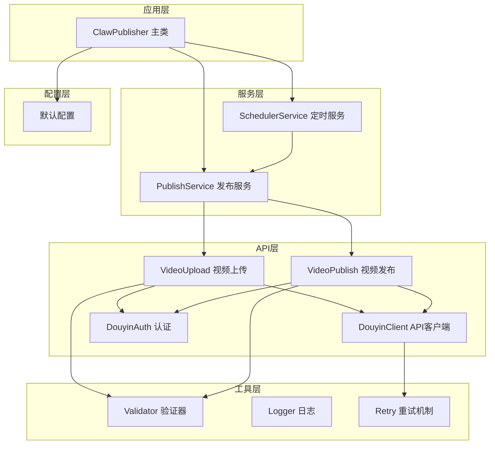
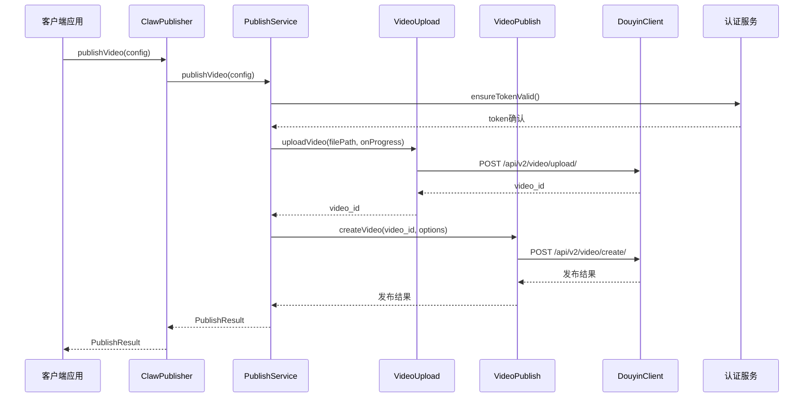
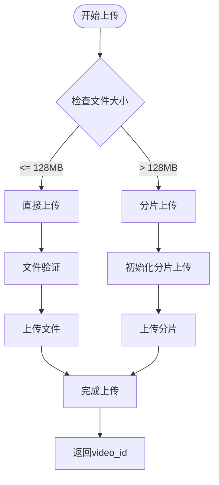
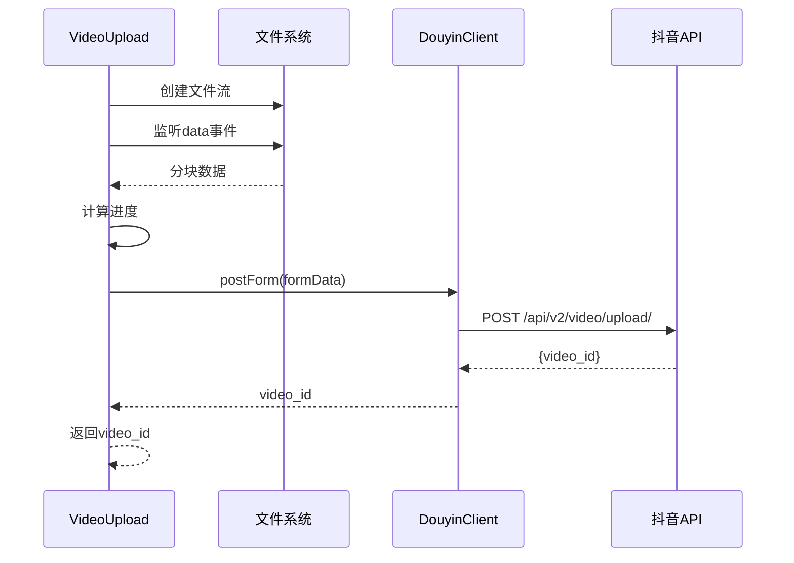
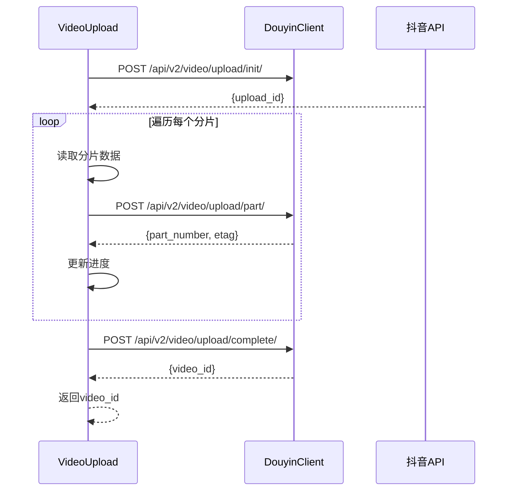
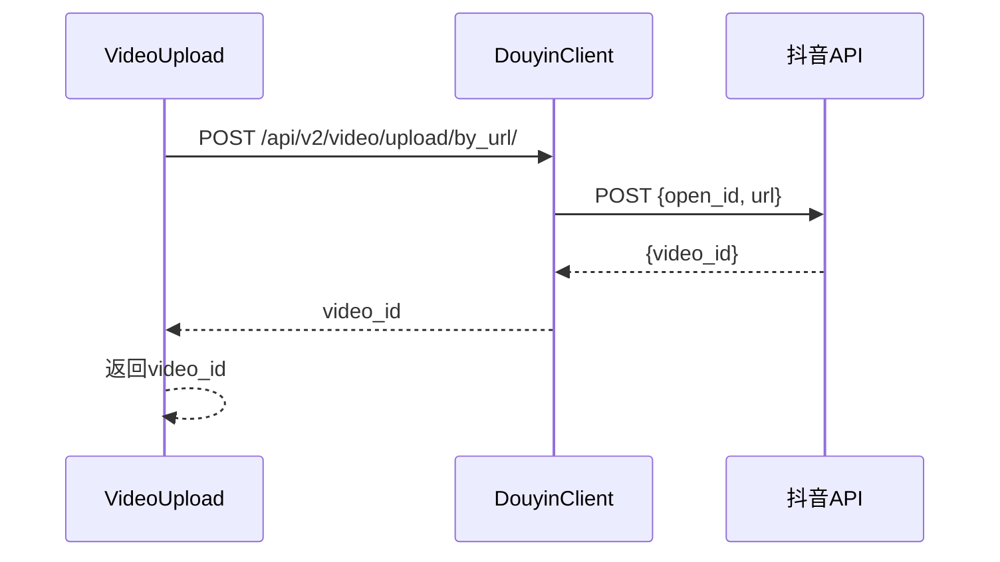
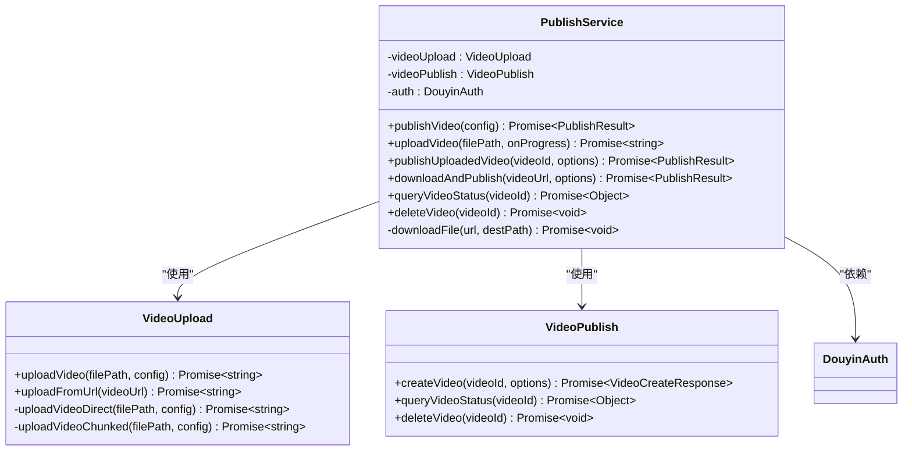
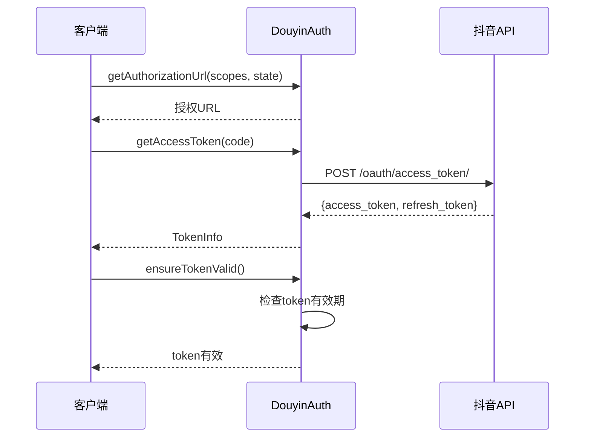
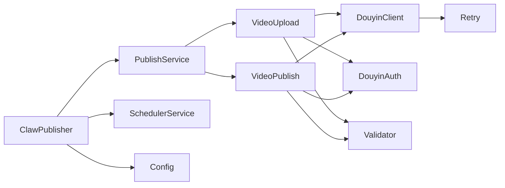

# 视频上传API

<cite>
**本文档引用的文件**
- [src/index.ts](file://src/index.ts)
- [src/api/video-upload.ts](file://src/api/video-upload.ts)
- [src/api/video-publish.ts](file://src/api/video-publish.ts)
- [src/api/douyin-client.ts](file://src/api/douyin-client.ts)
- [src/api/auth.ts](file://src/api/auth.ts)
- [src/services/publish-service.ts](file://src/services/publish-service.ts)
- [src/services/scheduler-service.ts](file://src/services/scheduler-service.ts)
- [src/models/types.ts](file://src/models/types.ts)
- [src/utils/validator.ts](file://src/utils/validator.ts)
- [config/default.ts](file://config/default.ts)
- [example.ts](file://example.ts)
</cite>

## 目录
1. [简介](#简介)
2. [项目结构](#项目结构)
3. [核心组件](#核心组件)
4. [架构概览](#架构概览)
5. [详细组件分析](#详细组件分析)
6. [依赖关系分析](#依赖关系分析)
7. [性能考虑](#性能考虑)
8. [故障排除指南](#故障排除指南)
9. [结论](#结论)
10. [附录](#附录)

## 简介
本API提供了完整的抖音视频上传和发布解决方案，支持多种上传方式和高级功能。该系统采用模块化设计，包含认证管理、文件验证、分片上传、进度监控、错误处理和性能优化等核心功能。

## 项目结构
项目采用清晰的分层架构，主要分为以下几个层次：



**图表来源**
- [src/index.ts:29-67](file://src/index.ts#L29-L67)
- [src/services/publish-service.ts:22-31](file://src/services/publish-service.ts#L22-L31)
- [src/services/scheduler-service.ts:23-29](file://src/services/scheduler-service.ts#L23-L29)

**章节来源**
- [src/index.ts:29-67](file://src/index.ts#L29-L67)
- [src/services/publish-service.ts:22-31](file://src/services/publish-service.ts#L22-L31)
- [src/services/scheduler-service.ts:23-29](file://src/services/scheduler-service.ts#L23-L29)

## 核心组件
本系统的核心组件包括：

### 1. 视频上传模块 (VideoUpload)
- 支持本地文件上传和远程URL上传
- 自动文件大小检测和上传策略选择
- 分片上传机制（>128MB）
- 实时进度监控
- 错误处理和日志记录

### 2. 视频发布模块 (VideoPublish)
- 视频创建和发布
- 发布选项配置（标题、描述、标签等）
- 视频状态查询和管理
- 定时发布支持

### 3. 发布服务模块 (PublishService)
- 业务流程编排
- 一站式发布（上传+发布）
- 下载并发布功能
- 进度回调处理

### 4. 定时发布服务 (SchedulerService)
- 基于cron的任务调度
- 任务生命周期管理
- 自动执行和状态跟踪

**章节来源**
- [src/api/video-upload.ts:20-27](file://src/api/video-upload.ts#L20-L27)
- [src/api/video-publish.ts:15-22](file://src/api/video-publish.ts#L15-L22)
- [src/services/publish-service.ts:22-31](file://src/services/publish-service.ts#L22-L31)
- [src/services/scheduler-service.ts:23-29](file://src/services/scheduler-service.ts#L23-L29)

## 架构概览
系统采用分层架构设计，确保关注点分离和高内聚低耦合：



**图表来源**
- [src/index.ts:153-155](file://src/index.ts#L153-L155)
- [src/services/publish-service.ts:38-80](file://src/services/publish-service.ts#L38-L80)
- [src/api/video-upload.ts:35-54](file://src/api/video-upload.ts#L35-L54)
- [src/api/video-publish.ts:30-54](file://src/api/video-publish.ts#L30-L54)

## 详细组件分析

### 视频上传模块 (VideoUpload)

#### 上传策略
系统根据文件大小自动选择最优上传策略：



**图表来源**
- [src/api/video-upload.ts:48-54](file://src/api/video-upload.ts#L48-L54)
- [src/api/video-upload.ts:104-152](file://src/api/video-upload.ts#L104-L152)

#### 直接上传流程
直接上传适用于小文件（≤128MB），使用表单数据传输：



**图表来源**
- [src/api/video-upload.ts:62-96](file://src/api/video-upload.ts#L62-L96)

#### 分片上传流程
分片上传适用于大文件（>128MB），支持断点续传：



**图表来源**
- [src/api/video-upload.ts:104-152](file://src/api/video-upload.ts#L104-L152)
- [src/api/video-upload.ts:160-213](file://src/api/video-upload.ts#L160-L213)

**章节来源**
- [src/api/video-upload.ts:20-27](file://src/api/video-upload.ts#L20-L27)
- [src/api/video-upload.ts:35-54](file://src/api/video-upload.ts#L35-L54)
- [src/api/video-upload.ts:62-96](file://src/api/video-upload.ts#L62-L96)
- [src/api/video-upload.ts:104-152](file://src/api/video-upload.ts#L104-L152)

### 远程URL上传
支持直接从远程URL上传视频，无需本地存储：



**图表来源**
- [src/api/video-upload.ts:220-237](file://src/api/video-upload.ts#L220-L237)

**章节来源**
- [src/api/video-upload.ts:220-237](file://src/api/video-upload.ts#L220-L237)

### 发布服务模块 (PublishService)
提供业务层面的统一接口：



**图表来源**
- [src/services/publish-service.ts:22-31](file://src/services/publish-service.ts#L22-L31)
- [src/api/video-upload.ts:20-27](file://src/api/video-upload.ts#L20-L27)
- [src/api/video-publish.ts:15-22](file://src/api/video-publish.ts#L15-L22)

**章节来源**
- [src/services/publish-service.ts:22-31](file://src/services/publish-service.ts#L22-L31)
- [src/services/publish-service.ts:38-80](file://src/services/publish-service.ts#L38-L80)

### 认证和授权
系统支持OAuth 2.0授权流程：



**图表来源**
- [src/api/auth.ts:45-60](file://src/api/auth.ts#L45-L60)
- [src/api/auth.ts:67-91](file://src/api/auth.ts#L67-L91)
- [src/api/auth.ts:146-151](file://src/api/auth.ts#L146-L151)

**章节来源**
- [src/api/auth.ts:29-37](file://src/api/auth.ts#L29-L37)
- [src/api/auth.ts:45-60](file://src/api/auth.ts#L45-L60)
- [src/api/auth.ts:67-91](file://src/api/auth.ts#L67-L91)

## 依赖关系分析

### 外部依赖
系统依赖的关键外部库：
- **axios**: HTTP客户端，用于API通信
- **node-cron**: 任务调度
- **form-data**: 表单数据处理
- **fs**: 文件系统操作

### 内部依赖关系


**图表来源**
- [src/index.ts:39-64](file://src/index.ts#L39-L64)
- [src/services/publish-service.ts:27-31](file://src/services/publish-service.ts#L27-L31)

**章节来源**
- [src/index.ts:39-64](file://src/index.ts#L39-L64)
- [src/services/publish-service.ts:27-31](file://src/services/publish-service.ts#L27-L31)

## 性能考虑

### 上传性能优化
1. **智能分片策略**: 默认分片大小5MB，支持自定义调整
2. **并发控制**: 分片上传按顺序进行，避免资源竞争
3. **内存管理**: 大文件分片读取，避免内存溢出
4. **进度监控**: 实时进度反馈，提升用户体验

### 错误处理和重试
- **指数退避重试**: 最多3次重试，最大延迟30秒
- **限流处理**: 自动识别和处理429错误
- **网络异常处理**: 自动重连和超时处理

### 缓存和连接管理
- **连接池**: 复用HTTP连接
- **Token缓存**: 避免频繁刷新
- **临时文件清理**: 自动清理下载的临时文件

## 故障排除指南

### 常见问题及解决方案

#### 1. 文件格式错误
**症状**: 抛出ValidationError异常
**原因**: 不支持的视频格式或超出大小限制
**解决**: 
- 检查文件扩展名是否在支持列表中
- 确认文件大小不超过4GB限制
- 使用支持的格式：mp4, mov, avi

#### 2. 上传失败
**症状**: 上传过程中断或超时
**可能原因**:
- 网络不稳定
- 文件过大导致超时
- 服务器限流

**解决方案**:
- 检查网络连接稳定性
- 调整分片大小参数
- 实现重试机制

#### 3. 认证失败
**症状**: Token过期或无效
**解决**:
- 调用refreshToken()刷新令牌
- 检查clientKey和clientSecret配置
- 确认redirectUri设置正确

#### 4. 进度监控问题
**症状**: 进度回调不触发
**解决**:
- 确认onProgress回调函数正确传递
- 检查文件流监听是否正常
- 验证上传配置中的回调设置

**章节来源**
- [src/utils/validator.ts:22-39](file://src/utils/validator.ts#L22-L39)
- [src/api/douyin-client.ts:204-220](file://src/api/douyin-client.ts#L204-L220)
- [src/api/auth.ts:146-151](file://src/api/auth.ts#L146-L151)

## 结论
本视频上传API提供了完整、可靠的抖音视频发布解决方案。系统具有以下优势：

1. **模块化设计**: 清晰的职责分离，易于维护和扩展
2. **智能策略**: 自动选择最优上传方式
3. **完善的错误处理**: 全面的异常捕获和重试机制
4. **实时监控**: 详细的进度反馈和状态查询
5. **灵活配置**: 支持自定义参数和回调函数

建议在生产环境中：
- 配置适当的分片大小以平衡性能和稳定性
- 实现完善的日志记录和监控
- 设置合理的超时和重试策略
- 定期检查和更新认证信息

## 附录

### API参考

#### 视频上传方法
| 方法 | 参数 | 返回值 | 描述 |
|------|------|--------|------|
| uploadVideo | filePath: string, config?: UploadConfig | Promise<string> | 上传本地视频文件 |
| uploadFromUrl | videoUrl: string | Promise<string> | 从远程URL上传视频 |

#### 上传配置参数
| 参数 | 类型 | 默认值 | 描述 |
|------|------|--------|------|
| chunkSize | number | 5MB | 分片大小（字节） |
| onProgress | function | undefined | 进度回调函数 |

#### 进度事件结构
```typescript
interface UploadProgress {
  loaded: number;    // 已上传字节数
  total: number;     // 文件总字节数
  percentage: number; // 上传百分比
}
```

#### 错误处理
系统抛出的主要异常类型：
- **ValidationError**: 参数验证失败
- **DouyinApiException**: 抖音API错误
- **NetworkError**: 网络连接错误

**章节来源**
- [src/models/types.ts:53-65](file://src/models/types.ts#L53-L65)
- [src/models/types.ts:89-94](file://src/models/types.ts#L89-L94)
- [src/api/douyin-client.ts:226-234](file://src/api/douyin-client.ts#L226-L234)