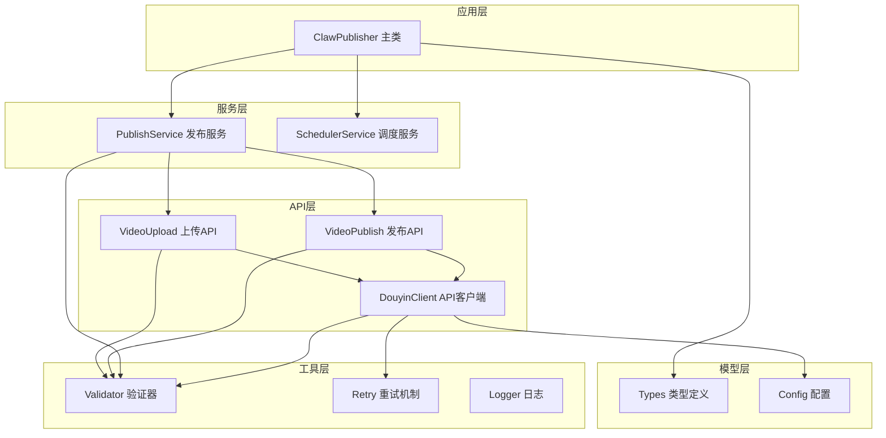
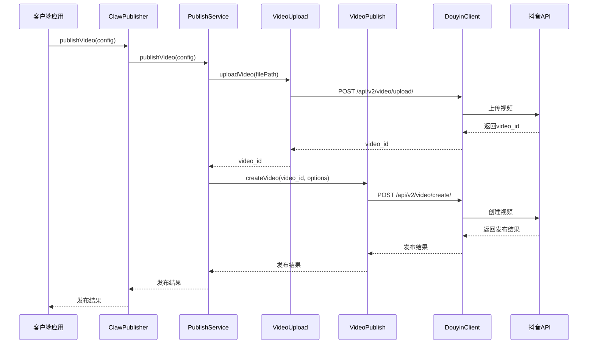
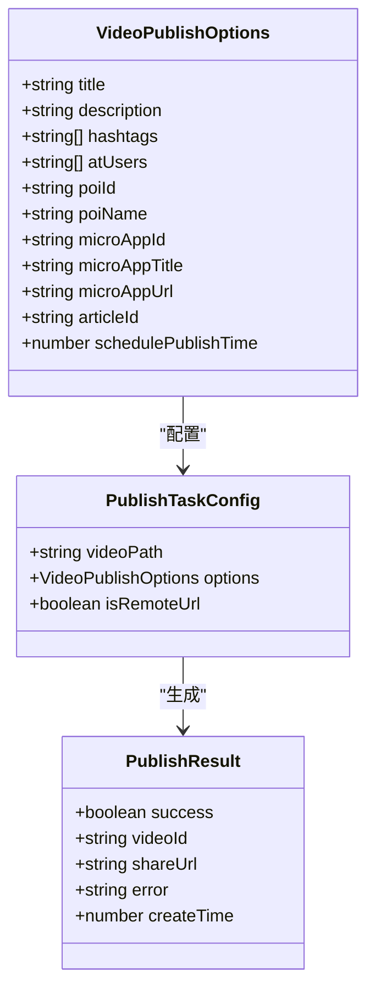
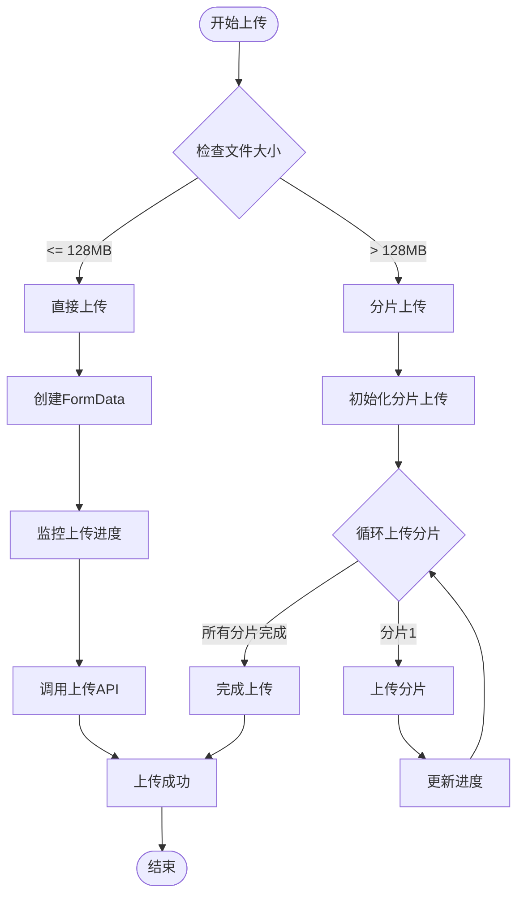
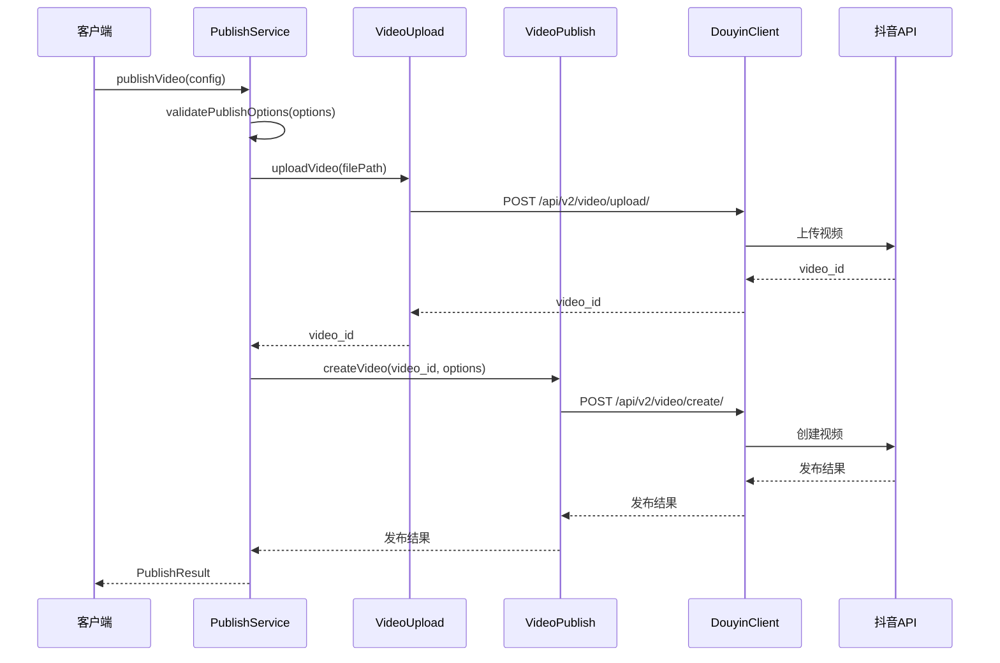
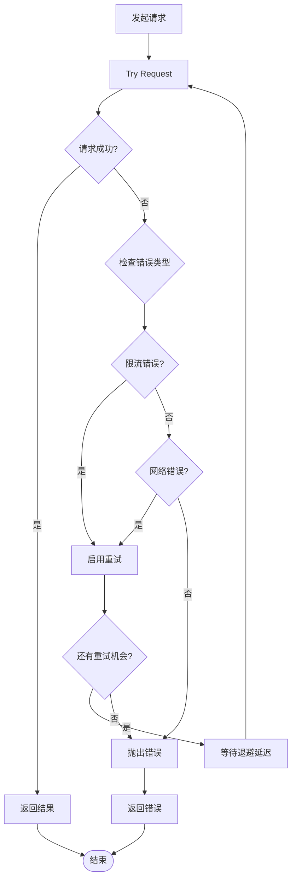
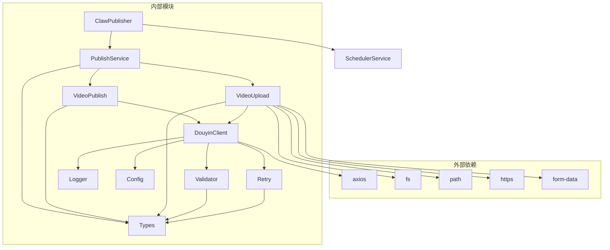

# 视频发布API

<cite>
**本文档引用的文件**
- [src/index.ts](file://src/index.ts)
- [src/api/video-publish.ts](file://src/api/video-publish.ts)
- [src/api/video-upload.ts](file://src/api/video-upload.ts)
- [src/services/publish-service.ts](file://src/services/publish-service.ts)
- [src/api/douyin-client.ts](file://src/api/douyin-client.ts)
- [src/models/types.ts](file://src/models/types.ts)
- [src/utils/validator.ts](file://src/utils/validator.ts)
- [src/utils/retry.ts](file://src/utils/retry.ts)
- [config/default.ts](file://config/default.ts)
- [example.ts](file://example.ts)
- [tests/unit/video-publish.test.ts](file://tests/unit/video-publish.test.ts)
</cite>

## 目录
1. [简介](#简介)
2. [项目结构](#项目结构)
3. [核心组件](#核心组件)
4. [架构概览](#架构概览)
5. [详细组件分析](#详细组件分析)
6. [依赖关系分析](#依赖关系分析)
7. [性能考虑](#性能考虑)
8. [故障排除指南](#故障排除指南)
9. [结论](#结论)
10. [附录](#附录)

## 简介

ClawOperations 是一个专门设计用于与抖音官方API集成的自动化管理系统，旨在为营销账户提供全面的内容发布、调度、分析和互动管理功能。本项目专注于为小龙虾主题的抖音营销活动提供专业的技术基础设施。

该视频发布API提供了完整的视频内容管理解决方案，包括：
- 视频上传（支持本地文件和远程URL）
- 视频发布（支持多种发布选项）
- 定时发布功能
- 视频状态查询和管理
- 批量操作和高级功能

## 项目结构

项目采用模块化的架构设计，主要分为以下几个层次：

**图表来源**
- [src/index.ts:29-67](file://src/index.ts#L29-L67)
- [src/services/publish-service.ts:22-31](file://src/services/publish-service.ts#L22-L31)
- [src/api/video-publish.ts:15-22](file://src/api/video-publish.ts#L15-L22)

**章节来源**
- [src/index.ts:29-67](file://src/index.ts#L29-L67)
- [src/services/publish-service.ts:22-31](file://src/services/publish-service.ts#L22-L31)
- [src/api/video-publish.ts:15-22](file://src/api/video-publish.ts#L15-L22)

## 核心组件

### ClawPublisher 主类
ClawPublisher 是整个系统的入口点，提供了统一的对外接口，负责协调各个子系统的协作。

### 发布服务 (PublishService)
负责视频发布的业务编排，包括上传、发布、状态查询等完整流程。

### 视频发布API (VideoPublish)
专门处理视频创建和发布的API调用，封装了抖音的视频发布接口。

### 视频上传API (VideoUpload)
处理视频上传逻辑，支持直接上传和分片上传两种模式。

**章节来源**
- [src/index.ts:29-67](file://src/index.ts#L29-L67)
- [src/services/publish-service.ts:22-31](file://src/services/publish-service.ts#L22-L31)
- [src/api/video-publish.ts:15-22](file://src/api/video-publish.ts#L15-L22)
- [src/api/video-upload.ts:20-27](file://src/api/video-upload.ts#L20-L27)

## 架构概览

系统采用分层架构设计，确保了良好的可维护性和扩展性：

**图表来源**
- [src/index.ts:153-155](file://src/index.ts#L153-L155)
- [src/services/publish-service.ts:38-80](file://src/services/publish-service.ts#L38-L80)
- [src/api/video-upload.ts:35-54](file://src/api/video-upload.ts#L35-L54)
- [src/api/video-publish.ts:30-54](file://src/api/video-publish.ts#L30-L54)

## 详细组件分析

### 发布选项配置

视频发布API支持丰富的发布选项，所有选项都是可选的，可以根据需要灵活组合：

**图表来源**
- [src/models/types.ts:101-124](file://src/models/types.ts#L101-L124)
- [src/models/types.ts:161-168](file://src/models/types.ts#L161-L168)
- [src/models/types.ts:173-179](file://src/models/types.ts#L173-L179)

#### 发布选项详解

**基础元数据**
- `title`: 视频标题，最大长度55字符
- `description`: 视频描述，最大长度300字符
- `hashtags`: 话题标签数组，最多5个

**社交功能**
- `atUsers`: @提及用户列表（open_id数组）
- `poiId` 和 `poiName`: 地理位置信息（POI ID和名称）

**商业化功能**
- `microAppId`, `microAppTitle`, `microAppUrl`: 小程序挂载
- `articleId`: 商品链接挂载

**调度功能**
- `schedulePublishTime`: 定时发布时间（Unix时间戳）

**章节来源**
- [src/models/types.ts:101-124](file://src/models/types.ts#L101-L124)
- [src/utils/validator.ts:45-86](file://src/utils/validator.ts#L45-L86)

### 上传机制

系统支持两种上传方式，根据文件大小自动选择最优方案：

**图表来源**
- [src/api/video-upload.ts:48-54](file://src/api/video-upload.ts#L48-L54)
- [src/api/video-upload.ts:62-96](file://src/api/video-upload.ts#L62-L96)
- [src/api/video-upload.ts:104-152](file://src/api/video-upload.ts#L104-L152)

#### 直接上传（小文件）
- 适用于小于128MB的视频文件
- 使用FormData直接上传
- 支持实时进度监控

#### 分片上传（大文件）
- 适用于大于等于128MB的视频文件
- 默认分片大小5MB
- 支持断点续传
- 自动处理分片顺序

**章节来源**
- [src/api/video-upload.ts:48-54](file://src/api/video-upload.ts#L48-L54)
- [src/api/video-upload.ts:62-96](file://src/api/video-upload.ts#L62-L96)
- [src/api/video-upload.ts:104-152](file://src/api/video-upload.ts#L104-L152)

### 发布流程

完整的发布流程包含多个步骤，每个步骤都有相应的错误处理和重试机制：

**图表来源**
- [src/services/publish-service.ts:38-80](file://src/services/publish-service.ts#L38-L80)
- [src/api/video-publish.ts:30-54](file://src/api/video-publish.ts#L30-L54)

**章节来源**
- [src/services/publish-service.ts:38-80](file://src/services/publish-service.ts#L38-L80)
- [src/api/video-publish.ts:30-54](file://src/api/video-publish.ts#L30-L54)

### 错误处理和重试机制

系统实现了完善的错误处理和重试机制：

**图表来源**
- [src/utils/retry.ts:41-81](file://src/utils/retry.ts#L41-L81)
- [src/api/douyin-client.ts:204-220](file://src/api/douyin-client.ts#L204-L220)

**章节来源**
- [src/utils/retry.ts:41-81](file://src/utils/retry.ts#L41-L81)
- [src/api/douyin-client.ts:204-220](file://src/api/douyin-client.ts#L204-L220)

## 依赖关系分析

系统各组件之间的依赖关系清晰明确：

**图表来源**
- [src/index.ts:1-20](file://src/index.ts#L1-L20)
- [src/services/publish-service.ts:1-15](file://src/services/publish-service.ts#L1-L15)
- [src/api/video-publish.ts:1-8](file://src/api/video-publish.ts#L1-L8)
- [src/api/video-upload.ts:1-13](file://src/api/video-upload.ts#L1-L13)
- [src/api/douyin-client.ts:1-6](file://src/api/douyin-client.ts#L1-L6)

**章节来源**
- [src/index.ts:1-20](file://src/index.ts#L1-L20)
- [src/services/publish-service.ts:1-15](file://src/services/publish-service.ts#L1-L15)
- [src/api/video-publish.ts:1-8](file://src/api/video-publish.ts#L1-L8)
- [src/api/video-upload.ts:1-13](file://src/api/video-upload.ts#L1-L13)
- [src/api/douyin-client.ts:1-6](file://src/api/douyin-client.ts#L1-L6)

## 性能考虑

### 上传性能优化
- **智能分片选择**: 自动根据文件大小选择最优上传方式
- **进度监控**: 实时显示上传进度，提升用户体验
- **并发控制**: 分片上传支持并行处理，提高大文件上传效率

### 缓存和连接管理
- **连接复用**: Axios实例复用，减少连接开销
- **超时配置**: 30秒超时设置，平衡响应速度和稳定性
- **重试机制**: 指数退避算法，避免雪崩效应

### 内存管理
- **流式处理**: 大文件采用流式读取，避免内存溢出
- **临时文件清理**: 自动清理下载的临时文件

## 故障排除指南

### 常见问题及解决方案

**认证失败**
- 检查access_token是否有效
- 确认clientKey和clientSecret配置正确
- 验证redirectUri设置

**上传失败**
- 检查文件格式是否在支持范围内
- 确认文件大小不超过限制
- 验证网络连接稳定性

**发布失败**
- 检查发布选项是否符合要求
- 确认定时发布时间在允许范围内
- 验证地理位置信息的有效性

**章节来源**
- [src/utils/validator.ts:22-86](file://src/utils/validator.ts#L22-L86)
- [src/api/douyin-client.ts:97-116](file://src/api/douyin-client.ts#L97-L116)

### 错误代码参考

| 错误代码 | 描述 | 解决方案 |
|---------|------|----------|
| 429 | 请求过于频繁 | 等待后重试，检查频率限制 |
| 10001 | 服务器内部错误 | 稍后重试，检查网络连接 |
| 10002 | 限流错误 | 降低请求频率，使用退避算法 |
| 10003 | 参数错误 | 检查请求参数格式和范围 |

**章节来源**
- [src/api/douyin-client.ts:204-220](file://src/api/douyin-client.ts#L204-L220)

## 结论

ClawOperations 的视频发布API提供了一个完整、可靠且易于使用的解决方案。其特点包括：

- **模块化设计**: 清晰的分层架构，便于维护和扩展
- **完善的错误处理**: 全面的异常捕获和重试机制
- **灵活的配置选项**: 支持多种发布场景和需求
- **高性能实现**: 优化的上传和发布流程
- **详细的日志记录**: 便于调试和监控

该API特别适合需要自动化内容发布的营销团队，能够显著提高工作效率并确保发布质量。

## 附录

### API使用示例

完整的使用示例可以在以下文件中找到：
- [example.ts:55-75](file://example.ts#L55-L75) - 基础发布示例
- [example.ts:77-96](file://example.ts#L77-L96) - 高级发布选项示例
- [example.ts:100-127](file://example.ts#L100-L127) - 定时发布示例
- [example.ts:131-143](file://example.ts#L131-L143) - 远程URL发布示例

### 配置说明

系统支持的配置项包括：
- **API配置**: 基础URL设置
- **上传配置**: 分片阈值和默认分片大小
- **重试配置**: 最大重试次数和延迟时间
- **视频配置**: 支持的格式和大小限制
- **内容配置**: 标题、描述和标签的长度限制

**章节来源**
- [config/default.ts:5-49](file://config/default.ts#L5-L49)
- [example.ts:55-143](file://example.ts#L55-L143)