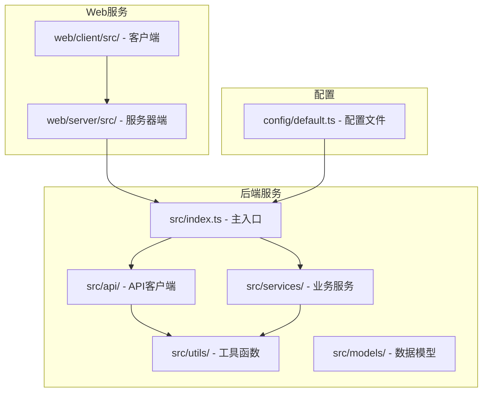
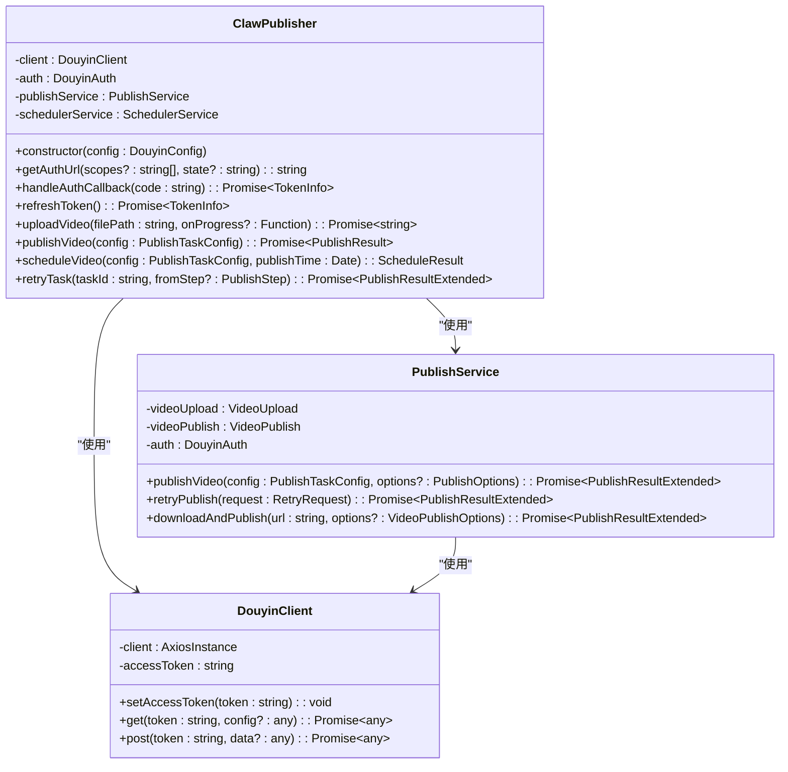
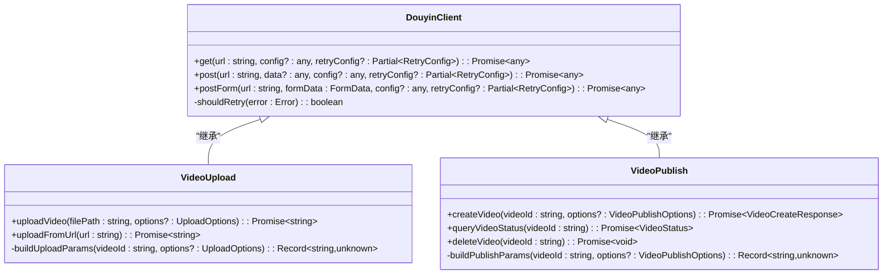
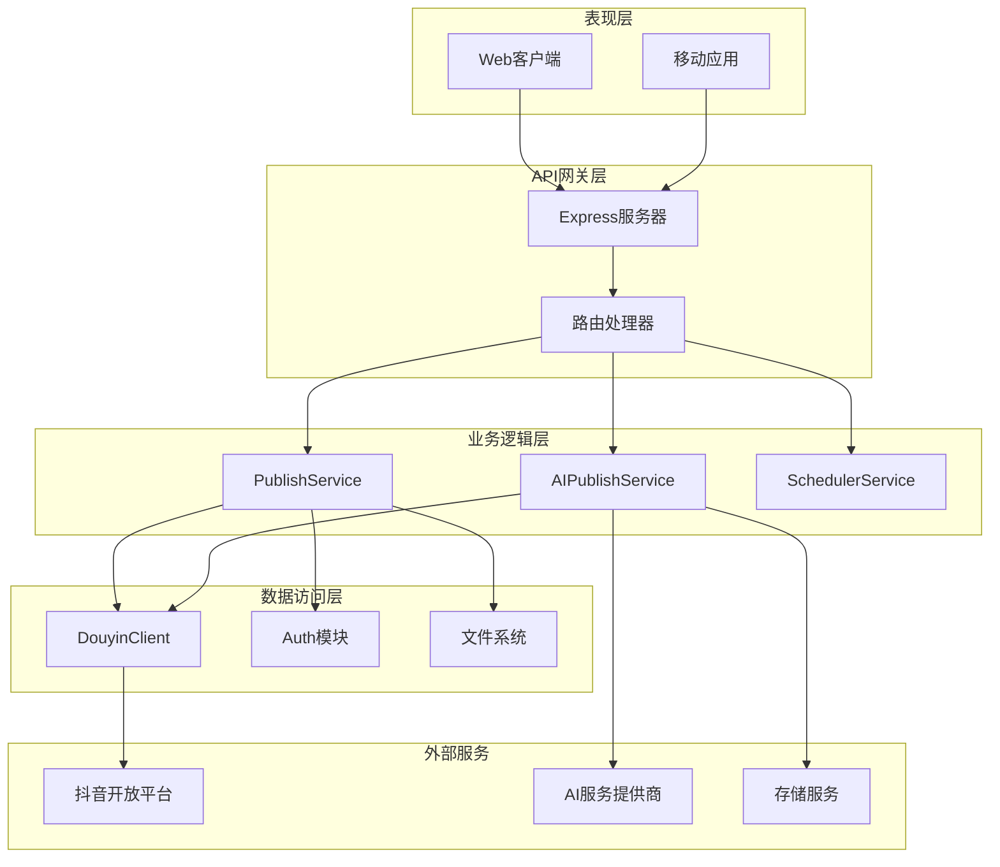
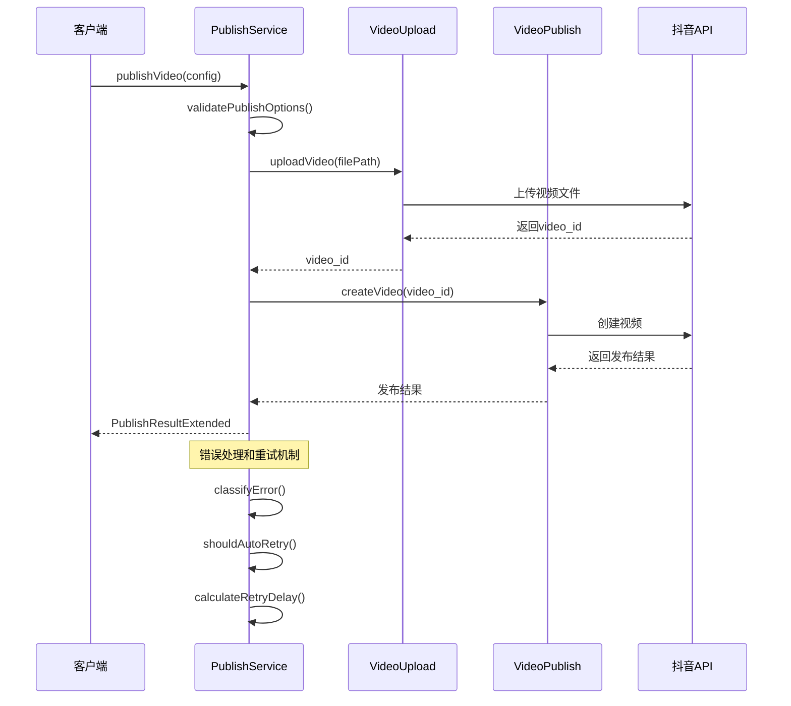
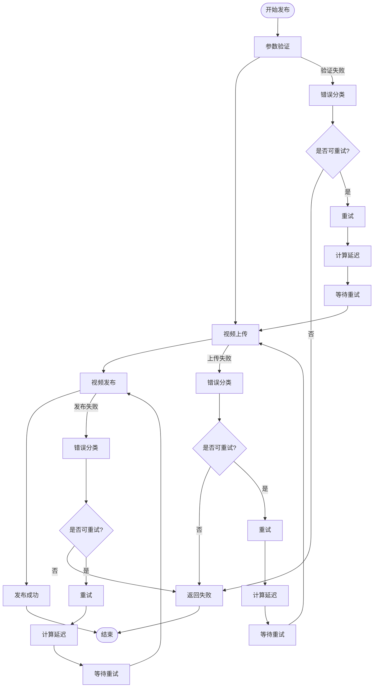
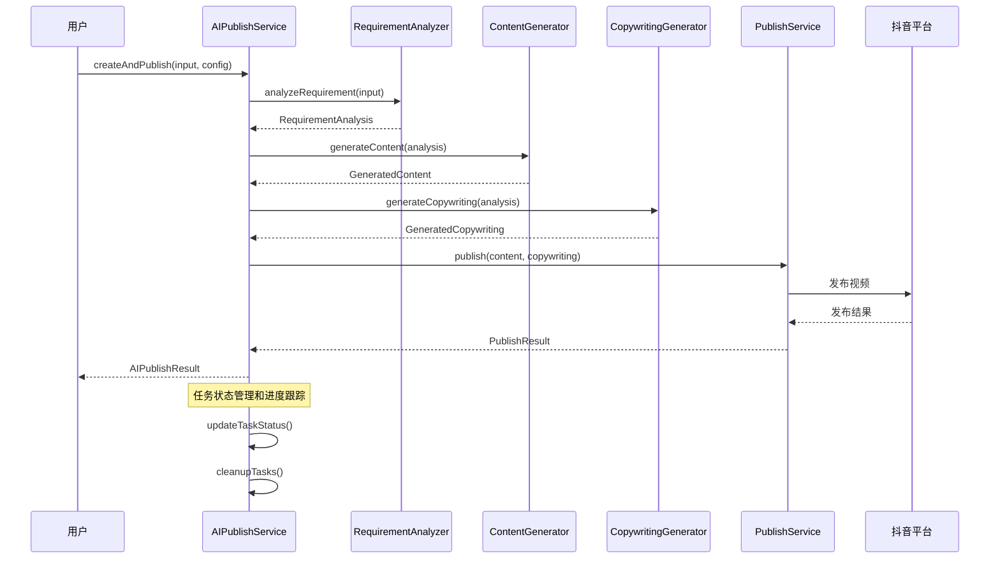
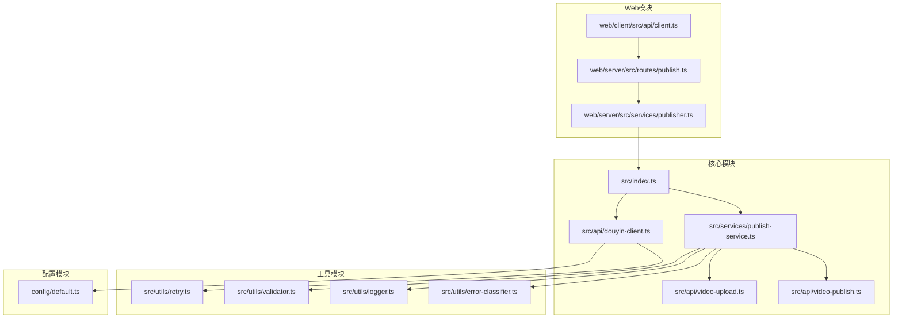

# API客户端增强

<cite>
**本文档引用的文件**
- [src/index.ts](file://src/index.ts)
- [src/api/douyin-client.ts](file://src/api/douyin-client.ts)
- [src/api/video-publish.ts](file://src/api/video-publish.ts)
- [src/services/publish-service.ts](file://src/services/publish-service.ts)
- [src/utils/retry.ts](file://src/utils/retry.ts)
- [src/models/types.ts](file://src/models/types.ts)
- [web/client/src/api/client.ts](file://web/client/src/api/client.ts)
- [web/server/src/routes/publish.ts](file://web/server/src/routes/publish.ts)
- [web/server/src/services/publisher.ts](file://web/server/src/services/publisher.ts)
- [config/default.ts](file://config/default.ts)
- [src/api/ai/deepseek-client.ts](file://src/api/ai/deepseek-client.ts)
- [src/services/ai-publish-service.ts](file://src/services/ai-publish-service.ts)
- [web/server/src/routes/ai.ts](file://web/server/src/routes/ai.ts)
- [tests/unit/video-publish.test.ts](file://tests/unit/video-publish.test.ts)
</cite>

## 目录
1. [简介](#简介)
2. [项目结构](#项目结构)
3. [核心组件](#核心组件)
4. [架构概览](#架构概览)
5. [详细组件分析](#详细组件分析)
6. [依赖关系分析](#依赖关系分析)
7. [性能考虑](#性能考虑)
8. [故障排除指南](#故障排除指南)
9. [结论](#结论)

## 简介

ClawOperations 是一个基于 Node.js 的抖音小龙虾营销账号自动化运营系统。该项目提供了完整的 API 客户端增强功能，包括视频上传、发布、定时任务管理、AI 内容创作等功能。

该系统采用模块化设计，通过统一的 API 客户端封装了抖音开放平台的各种接口，提供了稳定可靠的错误处理机制和重试策略。同时集成了 AI 功能，支持智能内容分析和生成。

## 项目结构

项目采用前后端分离的架构设计，主要分为以下几个部分：

**图表来源**
- [src/index.ts:1-270](file://src/index.ts#L1-L270)
- [config/default.ts:1-70](file://config/default.ts#L1-L70)

**章节来源**
- [src/index.ts:1-270](file://src/index.ts#L1-L270)
- [config/default.ts:1-70](file://config/default.ts#L1-L70)

## 核心组件

### ClawPublisher 主控制器

ClawPublisher 是整个系统的主控制器，提供了统一的对外接口：

**图表来源**
- [src/index.ts:32-266](file://src/index.ts#L32-L266)
- [src/api/douyin-client.ts:13-237](file://src/api/douyin-client.ts#L13-L237)
- [src/services/publish-service.ts:31-413](file://src/services/publish-service.ts#L31-L413)

### API 客户端架构

系统提供了多层次的 API 客户端抽象：

**图表来源**
- [src/api/douyin-client.ts:13-237](file://src/api/douyin-client.ts#L13-L237)
- [src/api/video-publish.ts:15-174](file://src/api/video-publish.ts#L15-L174)

**章节来源**
- [src/index.ts:32-266](file://src/index.ts#L32-L266)
- [src/api/douyin-client.ts:13-237](file://src/api/douyin-client.ts#L13-L237)
- [src/api/video-publish.ts:15-174](file://src/api/video-publish.ts#L15-L174)

## 架构概览

系统采用分层架构设计，确保了良好的可维护性和扩展性：

**图表来源**
- [web/server/src/routes/publish.ts:1-464](file://web/server/src/routes/publish.ts#L1-L464)
- [web/server/src/services/publisher.ts:1-214](file://web/server/src/services/publisher.ts#L1-L214)
- [src/services/ai-publish-service.ts:43-358](file://src/services/ai-publish-service.ts#L43-L358)

## 详细组件分析

### 发布服务流程

发布服务实现了完整的发布流程管理，包括参数验证、上传、发布和错误处理：

**图表来源**
- [src/services/publish-service.ts:48-181](file://src/services/publish-service.ts#L48-L181)
- [src/api/video-publish.ts:30-54](file://src/api/video-publish.ts#L30-L54)

### 重试机制设计

系统实现了智能的重试机制，能够自动处理网络错误和限流情况：

**图表来源**
- [src/utils/retry.ts:41-81](file://src/utils/retry.ts#L41-L81)
- [src/services/publish-service.ts:209-249](file://src/services/publish-service.ts#L209-L249)

### AI 内容创作流程

AI 发布服务提供了完整的内容创作和发布流程：

**图表来源**
- [src/services/ai-publish-service.ts:90-213](file://src/services/ai-publish-service.ts#L90-L213)
- [src/api/ai/deepseek-client.ts:121-244](file://src/api/ai/deepseek-client.ts#L121-L244)

**章节来源**
- [src/services/publish-service.ts:48-181](file://src/services/publish-service.ts#L48-L181)
- [src/utils/retry.ts:41-81](file://src/utils/retry.ts#L41-L81)
- [src/services/ai-publish-service.ts:90-213](file://src/services/ai-publish-service.ts#L90-L213)

## 依赖关系分析

系统采用了清晰的依赖关系设计，避免了循环依赖：

**图表来源**
- [src/index.ts:1-270](file://src/index.ts#L1-L270)
- [src/services/publish-service.ts:1-413](file://src/services/publish-service.ts#L1-L413)
- [web/server/src/routes/publish.ts:1-464](file://web/server/src/routes/publish.ts#L1-L464)

**章节来源**
- [src/index.ts:1-270](file://src/index.ts#L1-L270)
- [src/services/publish-service.ts:1-413](file://src/services/publish-service.ts#L1-L413)
- [web/server/src/routes/publish.ts:1-464](file://web/server/src/routes/publish.ts#L1-L464)

## 性能考虑

### 缓存策略
- **Token 缓存**: 自动缓存访问令牌，减少重复认证开销
- **配置缓存**: AI 服务配置缓存，避免重复初始化
- **任务状态缓存**: 内存中缓存 AI 任务状态，支持快速查询

### 并发控制
- **上传并发**: 支持分片上传，提高大文件传输效率
- **请求限流**: 内置重试机制，自动处理平台限流
- **连接池**: 复用 HTTP 连接，减少连接建立开销

### 内存管理
- **临时文件清理**: 自动清理下载的临时文件
- **任务过期清理**: 定期清理过期的 AI 任务状态
- **资源释放**: 及时释放文件句柄和网络连接

## 故障排除指南

### 常见错误类型

系统提供了详细的错误分类和处理机制：

| 错误类型 | 描述 | 处理建议 |
|---------|------|----------|
| TIMEOUT | 接口超时 | 增加重试次数，检查网络连接 |
| TOKEN_EXPIRED | Token过期 | 调用刷新接口获取新Token |
| MATERIAL_ERROR | 素材异常 | 检查文件格式和大小限制 |
| RATE_LIMIT | 平台限流 | 等待后重试，调整请求频率 |
| NETWORK_ERROR | 网络错误 | 检查防火墙设置，重试请求 |

### 调试方法

1. **启用详细日志**: 使用 `createLogger` 创建带标签的日志器
2. **监控重试过程**: 查看重试次数和延迟时间
3. **检查Token状态**: 确认Token的有效性和权限范围
4. **验证参数格式**: 使用内置验证器检查输入参数

**章节来源**
- [src/utils/error-classifier.ts:1-200](file://src/utils/error-classifier.ts#L1-L200)
- [src/services/publish-service.ts:161-180](file://src/services/publish-service.ts#L161-L180)

## 结论

ClawOperations 项目展现了现代 Node.js 应用的最佳实践，具有以下特点：

### 技术优势
- **模块化设计**: 清晰的分层架构，易于维护和扩展
- **完善的错误处理**: 智能重试机制和详细的错误分类
- **丰富的功能**: 支持视频发布、AI 内容创作、定时任务等
- **良好的性能**: 缓存策略和并发控制优化

### 应用价值
- **自动化运营**: 减少人工操作，提高运营效率
- **AI 辅助创作**: 智能内容分析和生成，提升内容质量
- **稳定的 API**: 统一的接口设计，便于第三方集成
- **可扩展性**: 模块化架构支持功能扩展和定制

该系统为抖音营销账号提供了完整的自动化解决方案，特别适合需要批量内容生产和多账号运营的企业用户。