# API客户端增强

<cite>
**本文档引用的文件**
- [src/index.ts](file://src/index.ts)
- [src/api/douyin-client.ts](file://src/api/douyin-client.ts)
- [src/api/video-publish.ts](file://src/api/video-publish.ts)
- [src/services/publish-service.ts](file://src/services/publish-service.ts)
- [src/utils/retry.ts](file://src/utils/retry.ts)
- [src/models/types.ts](file://src/models/types.ts)
- [web/client/src/api/client.ts](file://web/client/src/api/client.ts)
- [web/server/src/routes/publish.ts](file://web/server/src/routes/publish.ts)
- [web/server/src/services/publisher.ts](file://web/server/src/services/publisher.ts)
- [config/default.ts](file://config/default.ts)
- [src/api/ai/deepseek-client.ts](file://src/api/ai/deepseek-client.ts)
- [src/api/ai/doubao-client.ts](file://src/api/ai/doubao-client.ts)
- [src/api/ai/index.ts](file://src/api/ai/index.ts)
- [src/services/ai-publish-service.ts](file://src/services/ai-publish-service.ts)
- [web/server/src/routes/ai.ts](file://web/server/src/routes/ai.ts)
- [src/services/ai/content-generator.ts](file://src/services/ai/content-generator.ts)
- [web/server/src/services/creation-task-service.ts](file://web/server/src/services/creation-task-service.ts)
- [web/client/src/components/ai-creator/TemplateSelector.tsx](file://web/client/src/components/ai-creator/TemplateSelector.tsx)
- [tests/unit/video-publish.test.ts](file://tests/unit/video-publish.test.ts)
</cite>

## 更新摘要
**变更内容**
- 新增参考图像上传功能，支持创建模板时上传和关联参考图
- 新增 /api/ai/upload-reference-image 端点，支持图片文件上传
- 增强模板管理功能，支持 referenceImageUrl 字段
- 更新 AI 内容生成流程，支持视频生成时使用参考图像
- 完善前端模板选择器，支持参考图像上传和预览

## 目录
1. [简介](#简介)
2. [项目结构](#项目结构)
3. [核心组件](#核心组件)
4. [架构概览](#架构概览)
5. [详细组件分析](#详细组件分析)
6. [AI客户端增强](#ai客户端增强)
7. [参考图像上传功能](#参考图像上传功能)
8. [拦截器改进](#拦截器改进)
9. [依赖关系分析](#依赖关系分析)
10. [性能考虑](#性能考虑)
11. [故障排除指南](#故障排除指南)
12. [结论](#结论)

## 简介

ClawOperations 是一个基于 Node.js 的抖音小龙虾营销账号自动化运营系统。该项目提供了完整的 API 客户端增强功能，包括视频上传、发布、定时任务管理、AI 内容创作等功能。

该系统采用模块化设计，通过统一的 API 客户端封装了抖音开放平台的各种接口，提供了稳定可靠的错误处理机制和重试策略。同时集成了 AI 功能，支持智能内容分析和生成。**最新更新**包括新增参考图像上传功能，支持在创建模板时上传和关联参考图，以及增强的 AI 内容生成流程，支持视频生成时使用参考图像。

## 项目结构

项目采用前后端分离的架构设计，主要分为以下几个部分：

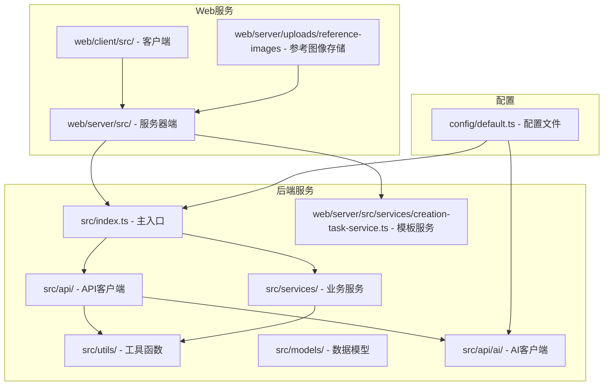

**图表来源**
- [src/index.ts:1-270](file://src/index.ts#L1-L270)
- [config/default.ts:1-70](file://config/default.ts#L1-L70)
- [src/api/ai/index.ts:1-7](file://src/api/ai/index.ts#L1-L7)
- [web/server/src/services/creation-task-service.ts:1-200](file://web/server/src/services/creation-task-service.ts#L1-L200)

**章节来源**
- [src/index.ts:1-270](file://src/index.ts#L1-L270)
- [config/default.ts:1-70](file://config/default.ts#L1-L70)
- [src/api/ai/index.ts:1-7](file://src/api/ai/index.ts#L1-L7)
- [web/server/src/services/creation-task-service.ts:1-200](file://web/server/src/services/creation-task-service.ts#L1-L200)

## 核心组件

### ClawPublisher 主控制器

ClawPublisher 是整个系统的主控制器，提供了统一的对外接口：

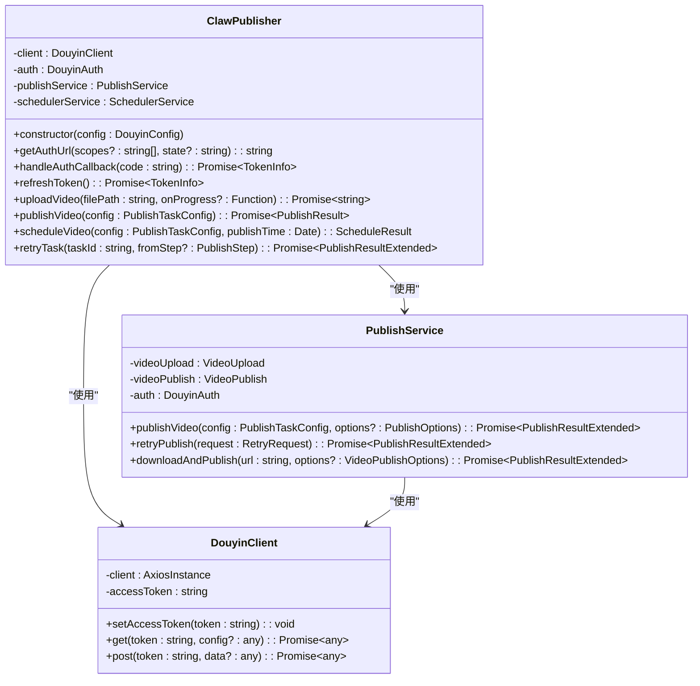

**图表来源**
- [src/index.ts:32-266](file://src/index.ts#L32-L266)
- [src/api/douyin-client.ts:13-237](file://src/api/douyin-client.ts#L13-L237)
- [src/services/publish-service.ts:31-413](file://src/services/publish-service.ts#L31-L413)

### API 客户端架构

系统提供了多层次的 API 客户端抽象：

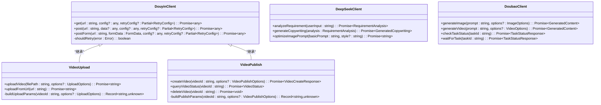

**图表来源**
- [src/api/douyin-client.ts:13-237](file://src/api/douyin-client.ts#L13-L237)
- [src/api/video-publish.ts:15-174](file://src/api/video-publish.ts#L15-L174)
- [src/api/ai/deepseek-client.ts:55-283](file://src/api/ai/deepseek-client.ts#L55-L283)
- [src/api/ai/doubao-client.ts:85-362](file://src/api/ai/doubao-client.ts#L85-L362)

**章节来源**
- [src/index.ts:32-266](file://src/index.ts#L32-L266)
- [src/api/douyin-client.ts:13-237](file://src/api/douyin-client.ts#L13-L237)
- [src/api/video-publish.ts:15-174](file://src/api/video-publish.ts#L15-L174)
- [src/api/ai/deepseek-client.ts:55-283](file://src/api/ai/deepseek-client.ts#L55-L283)
- [src/api/ai/doubao-client.ts:85-362](file://src/api/ai/doubao-client.ts#L85-L362)

## 架构概览

系统采用分层架构设计，确保了良好的可维护性和扩展性：

```mermaid
graph TB
subgraph "表现层"
A[Web客户端]
B[移动应用]
C[模板选择器 - 参考图像上传]
end
subgraph "API网关层"
D[Express服务器]
E[路由处理器]
F[AI路由处理器]
G[模板管理路由]
H[参考图像上传路由]
end
subgraph "业务逻辑层"
I[PublishService]
J[AIPublishService]
K[SchedulerService]
L[ContentGenerator]
M[RequirementAnalyzer]
N[CopywritingGenerator]
O[CreationTaskService]
end
subgraph "数据访问层"
P[DouyinClient]
Q[DeepSeekClient]
R[DoubaoClient]
S[Auth模块]
T[文件系统 - 参考图像]
U[模板数据库]
end
subgraph "外部服务"
V[抖音开放平台]
W[DeepSeek AI]
X[豆包AI (火山引擎)]
Y[存储服务]
Z[上传目录]
end
A --> D
B --> D
C --> D
D --> E
D --> F
D --> G
D --> H
E --> I
E --> J
E --> K
F --> L
F --> M
F --> N
F --> O
G --> U
H --> T
I --> P
J --> P
J --> Q
J --> R
O --> U
I --> S
P --> V
Q --> W
R --> X
I --> Y
J --> Z
```

**图表来源**
- [web/server/src/routes/publish.ts:1-464](file://web/server/src/routes/publish.ts#L1-L464)
- [web/server/src/routes/ai.ts:1-800](file://web/server/src/routes/ai.ts#L1-L800)
- [web/server/src/services/publisher.ts:1-214](file://web/server/src/services/publisher.ts#L1-L214)
- [src/services/ai-publish-service.ts:43-358](file://src/services/ai-publish-service.ts#L43-L358)
- [src/services/ai/content-generator.ts:38-200](file://src/services/ai/content-generator.ts#L38-L200)
- [web/server/src/services/creation-task-service.ts:1-200](file://web/server/src/services/creation-task-service.ts#L1-L200)

## 详细组件分析

### 发布服务流程

发布服务实现了完整的发布流程管理，包括参数验证、上传、发布和错误处理：

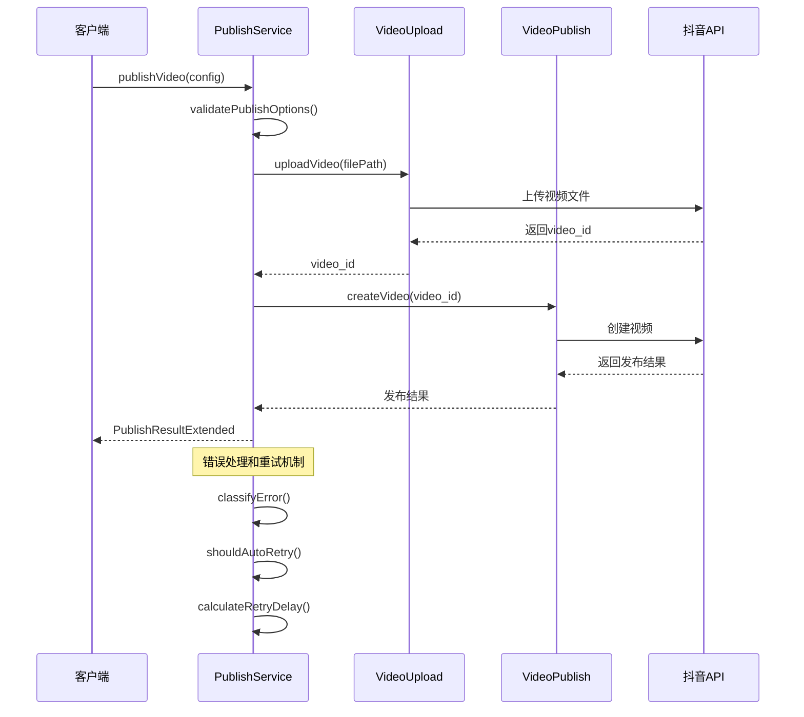

**图表来源**
- [src/services/publish-service.ts:48-181](file://src/services/publish-service.ts#L48-L181)
- [src/api/video-publish.ts:30-54](file://src/api/video-publish.ts#L30-L54)

### 重试机制设计

系统实现了智能的重试机制，能够自动处理网络错误和限流情况：


**图表来源**
- [src/utils/retry.ts:41-81](file://src/utils/retry.ts#L41-L81)
- [src/services/publish-service.ts:209-249](file://src/services/publish-service.ts#L209-L249)

## AI客户端增强

### 专用AI客户端架构

系统新增了专用的AI客户端，支持10分钟超时，专门处理视频生成等长时间任务：

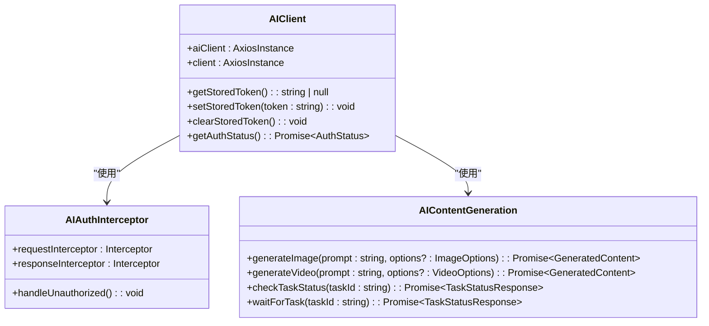

**图表来源**
- [web/client/src/api/client.ts:53-84](file://web/client/src/api/client.ts#L53-L84)
- [src/api/ai/doubao-client.ts:192-305](file://src/api/ai/doubao-client.ts#L192-L305)

### AI内容生成流程

AI 发布服务提供了完整的内容创作和发布流程，支持图片和视频生成：

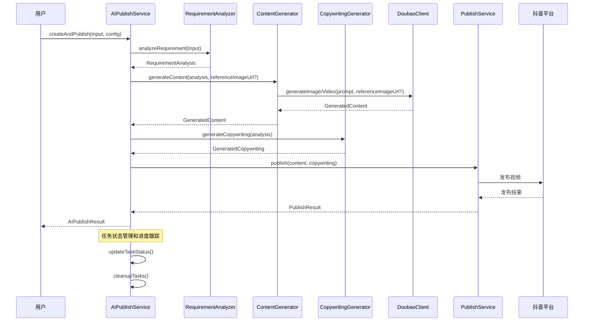

**图表来源**
- [src/services/ai-publish-service.ts:90-213](file://src/services/ai-publish-service.ts#L90-L213)
- [src/services/ai/content-generator.ts:62-163](file://src/services/ai/content-generator.ts#L62-L163)
- [src/api/ai/doubao-client.ts:192-305](file://src/api/ai/doubao-client.ts#L192-L305)

**章节来源**
- [src/services/publish-service.ts:48-181](file://src/services/publish-service.ts#L48-L181)
- [src/utils/retry.ts:41-81](file://src/utils/retry.ts#L41-L81)
- [src/services/ai-publish-service.ts:90-213](file://src/services/ai-publish-service.ts#L90-L213)
- [src/services/ai/content-generator.ts:62-163](file://src/services/ai/content-generator.ts#L62-L163)

## 参考图像上传功能

### 参考图像上传架构

系统新增了完整的参考图像上传功能，支持在创建模板时上传和关联参考图：

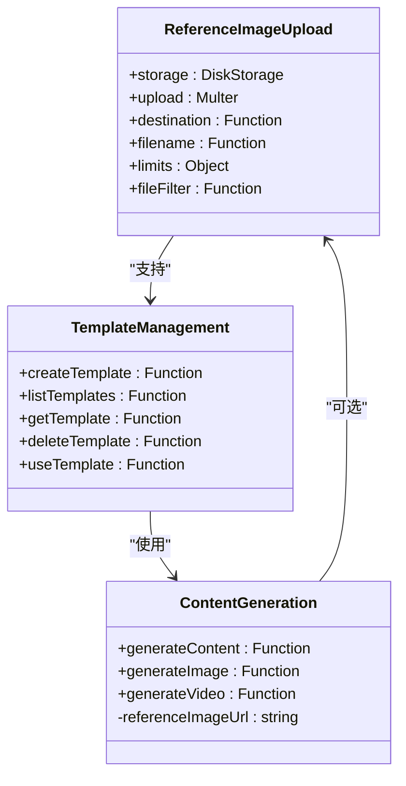

**图表来源**
- [web/server/src/routes/ai.ts:20-46](file://web/server/src/routes/ai.ts#L20-L46)
- [web/server/src/routes/ai.ts:716-747](file://web/server/src/routes/ai.ts#L716-L747)
- [src/services/ai/content-generator.ts:95-102](file://src/services/ai/content-generator.ts#L95-L102)

### 参考图像上传流程

参考图像上传功能提供了完整的文件上传和管理流程：

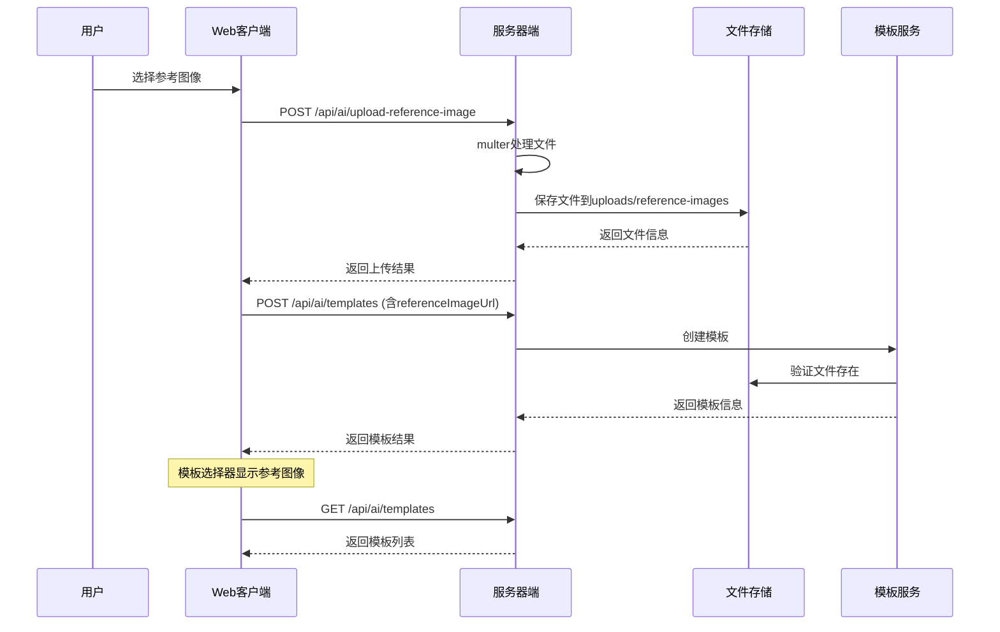

**图表来源**
- [web/server/src/routes/ai.ts:680-711](file://web/server/src/routes/ai.ts#L680-L711)
- [web/client/src/api/client.ts:415-419](file://web/client/src/api/client.ts#L415-L419)
- [web/client/src/components/ai-creator/TemplateSelector.tsx:147-180](file://web/client/src/components/ai-creator/TemplateSelector.tsx#L147-L180)

### 模板管理增强

模板管理系统现在支持参考图像字段，提供完整的模板生命周期管理：

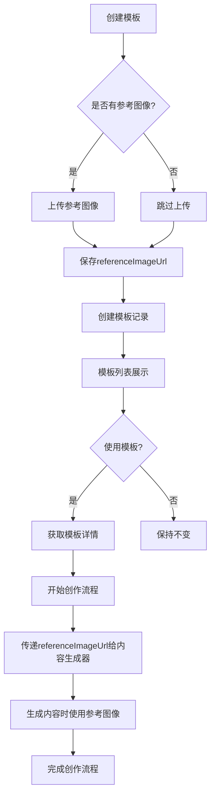

**图表来源**
- [web/server/src/routes/ai.ts:716-747](file://web/server/src/routes/ai.ts#L716-L747)
- [web/server/src/services/creation-task-service.ts:202-221](file://web/server/src/services/creation-task-service.ts#L202-L221)
- [web/server/src/routes/ai.ts:858-892](file://web/server/src/routes/ai.ts#L858-L892)

**章节来源**
- [web/server/src/routes/ai.ts:20-46](file://web/server/src/routes/ai.ts#L20-L46)
- [web/server/src/routes/ai.ts:680-711](file://web/server/src/routes/ai.ts#L680-L711)
- [web/client/src/api/client.ts:415-419](file://web/client/src/api/client.ts#L415-L419)
- [web/client/src/components/ai-creator/TemplateSelector.tsx:147-180](file://web/client/src/components/ai-creator/TemplateSelector.tsx#L147-L180)
- [web/server/src/services/creation-task-service.ts:202-221](file://web/server/src/services/creation-task-service.ts#L202-L221)

## 拦截器改进

### 认证拦截器架构

系统实现了改进的拦截器处理认证和未授权访问：

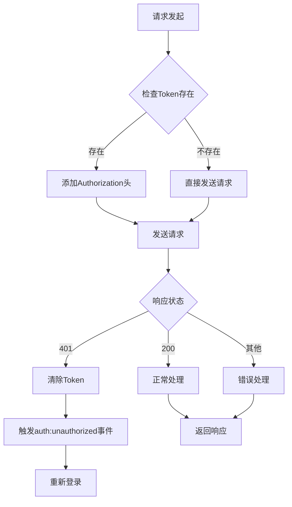

**图表来源**
- [web/client/src/api/client.ts:62-84](file://web/client/src/api/client.ts#L62-L84)
- [web/client/src/api/client.ts:101-112](file://web/client/src/api/client.ts#L101-L112)

### AI专用拦截器

新增的AI专用拦截器支持10分钟超时，专门处理长时间运行的任务：

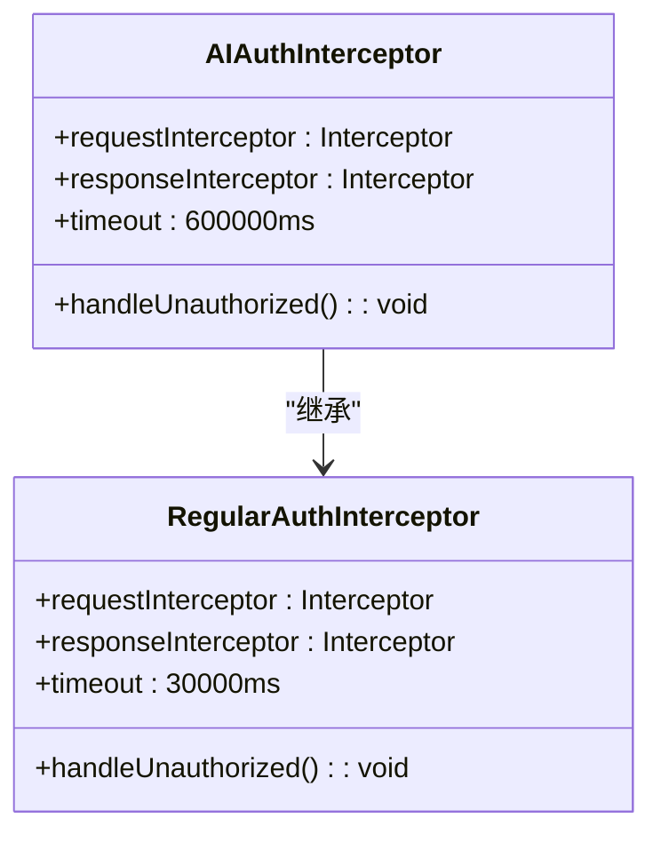

**图表来源**
- [web/client/src/api/client.ts:53-84](file://web/client/src/api/client.ts#L53-L84)
- [web/client/src/api/client.ts:86-112](file://web/client/src/api/client.ts#L86-L112)

**章节来源**
- [web/client/src/api/client.ts:53-84](file://web/client/src/api/client.ts#L53-L84)
- [web/client/src/api/client.ts:86-112](file://web/client/src/api/client.ts#L86-L112)

## 依赖关系分析

系统采用了清晰的依赖关系设计，避免了循环依赖：

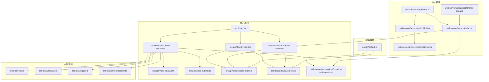

**图表来源**
- [src/index.ts:1-270](file://src/index.ts#L1-L270)
- [src/services/publish-service.ts:1-413](file://src/services/publish-service.ts#L1-L413)
- [web/server/src/routes/publish.ts:1-464](file://web/server/src/routes/publish.ts#L1-L464)
- [web/server/src/routes/ai.ts:1-800](file://web/server/src/routes/ai.ts#L1-L800)
- [web/server/src/services/creation-task-service.ts:1-200](file://web/server/src/services/creation-task-service.ts#L1-L200)

**章节来源**
- [src/index.ts:1-270](file://src/index.ts#L1-L270)
- [src/services/publish-service.ts:1-413](file://src/services/publish-service.ts#L1-L413)
- [web/server/src/routes/publish.ts:1-464](file://web/server/src/routes/publish.ts#L1-L464)
- [web/server/src/routes/ai.ts:1-800](file://web/server/src/routes/ai.ts#L1-L800)
- [web/server/src/services/creation-task-service.ts:1-200](file://web/server/src/services/creation-task-service.ts#L1-L200)

## 性能考虑

### 缓存策略
- **Token 缓存**: 自动缓存访问令牌，减少重复认证开销
- **配置缓存**: AI 服务配置缓存，避免重复初始化
- **任务状态缓存**: 内存中缓存 AI 任务状态，支持快速查询
- **AI客户端缓存**: 专用AI客户端缓存，支持长时间任务处理
- **模板缓存**: 模板列表和详情缓存，提高模板访问性能

### 并发控制
- **上传并发**: 支持分片上传，提高大文件传输效率
- **请求限流**: 内置重试机制，自动处理平台限流
- **连接池**: 复用 HTTP 连接，减少连接建立开销
- **AI任务并发**: 支持多个AI任务并行处理，提高效率
- **文件上传并发**: 参考图像上传支持并发处理

### 内存管理
- **临时文件清理**: 自动清理下载的临时文件
- **任务过期清理**: 定期清理过期的 AI 任务状态
- **资源释放**: 及时释放文件句柄和网络连接
- **AI客户端资源管理**: 专用AI客户端支持长时间运行任务
- **模板数据管理**: 模板数据内存缓存，支持快速访问

### 存储优化
- **参考图像存储**: 专门的uploads/reference-images目录，支持文件清理
- **模板持久化**: 使用本地JSON数据库存储模板数据
- **文件命名策略**: 自动生成唯一文件名，避免冲突
- **文件类型验证**: 严格的图片文件类型检查

## 故障排除指南

### 常见错误类型

系统提供了详细的错误分类和处理机制：

| 错误类型 | 描述 | 处理建议 |
|---------|------|----------|
| TIMEOUT | 接口超时 | 增加重试次数，检查网络连接 |
| TOKEN_EXPIRED | Token过期 | 调用刷新接口获取新Token |
| MATERIAL_ERROR | 素材异常 | 检查文件格式和大小限制 |
| RATE_LIMIT | 平台限流 | 等待后重试，调整请求频率 |
| NETWORK_ERROR | 网络错误 | 检查防火墙设置，重试请求 |
| AI_TASK_TIMEOUT | AI任务超时 | 检查AI服务配置，延长超时时间 |
| REFERENCE_IMAGE_UPLOAD_FAILED | 参考图像上传失败 | 检查文件类型和大小限制 |
| TEMPLATE_CREATION_FAILED | 模板创建失败 | 验证必填字段和文件完整性 |

### 调试方法

1. **启用详细日志**: 使用 `createLogger` 创建带标签的日志器
2. **监控重试过程**: 查看重试次数和延迟时间
3. **检查Token状态**: 确认Token的有效性和权限范围
4. **验证参数格式**: 使用内置验证器检查输入参数
5. **AI任务监控**: 监控AI任务状态和进度
6. **文件上传调试**: 检查文件上传路径和权限设置
7. **模板数据验证**: 验证模板数据的完整性和一致性

**章节来源**
- [src/utils/error-classifier.ts:1-200](file://src/utils/error-classifier.ts#L1-L200)
- [src/services/publish-service.ts:161-180](file://src/services/publish-service.ts#L161-L180)

## 结论

ClawOperations 项目展现了现代 Node.js 应用的最佳实践，具有以下特点：

### 技术优势
- **模块化设计**: 清晰的分层架构，易于维护和扩展
- **完善的错误处理**: 智能重试机制和详细的错误分类
- **丰富的功能**: 支持视频发布、AI 内容创作、定时任务等
- **良好的性能**: 缓存策略和并发控制优化
- **AI客户端增强**: 专用AI客户端支持长时间任务处理
- **改进的拦截器**: 更好的认证和未授权访问处理
- **参考图像上传**: 新增参考图像上传功能，支持模板关联
- **模板管理系统**: 完整的模板生命周期管理

### 应用价值
- **自动化运营**: 减少人工操作，提高运营效率
- **AI 辅助创作**: 智能内容分析和生成，提升内容质量
- **稳定的 API**: 统一的接口设计，便于第三方集成
- **可扩展性**: 模块化架构支持功能扩展和定制
- **长时间任务支持**: 专门的AI客户端处理视频生成等长时间任务
- **参考图像支持**: 支持基于参考图像的内容创作
- **模板化工作流**: 提供标准化的内容创作模板

### 新功能特性
- **参考图像上传**: 支持创建模板时上传和关联参考图像
- **模板管理增强**: 模板系统支持 referenceImageUrl 字段
- **AI内容生成优化**: 视频生成支持参考图像输入
- **前端交互改进**: 模板选择器支持参考图像上传和预览
- **文件存储管理**: 专门的参考图像存储目录和管理

该系统为抖音营销账号提供了完整的自动化解决方案，特别适合需要批量内容生产和多账号运营的企业用户。**最新的参考图像上传功能**使得系统能够更好地支持基于参考图像的内容创作，为用户提供更加灵活和强大的AI创作能力。**AI客户端增强**和**模板管理系统**的完善进一步提升了系统的整体性能和用户体验。