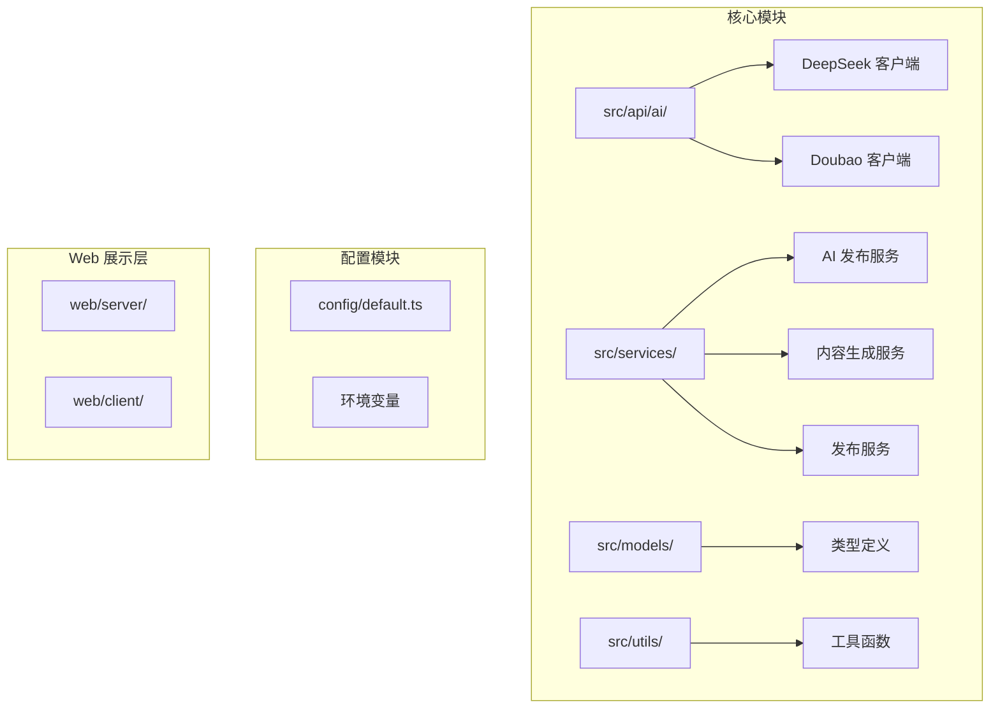
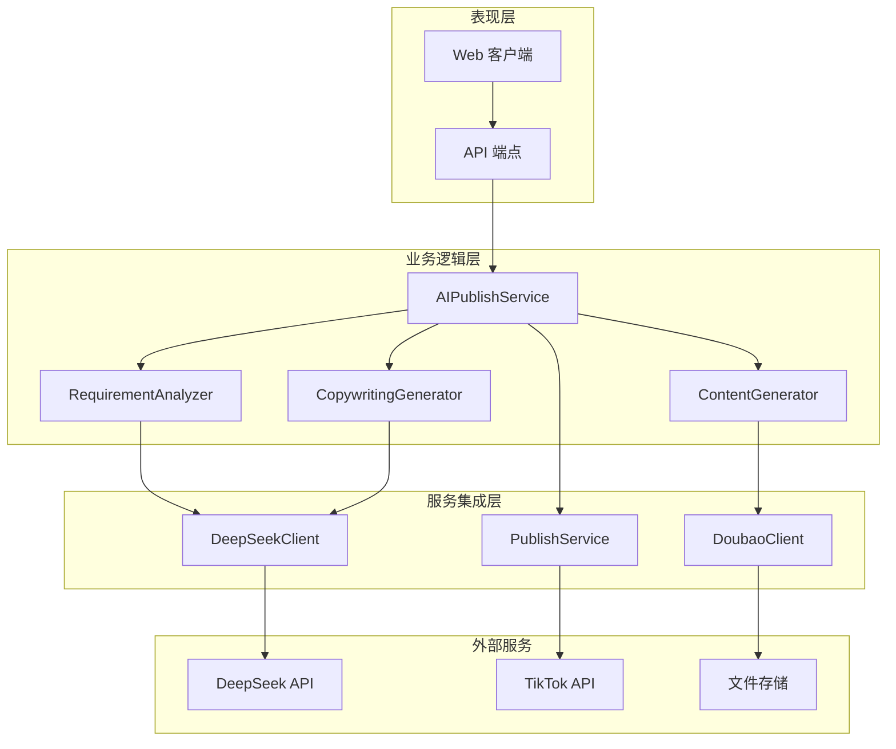
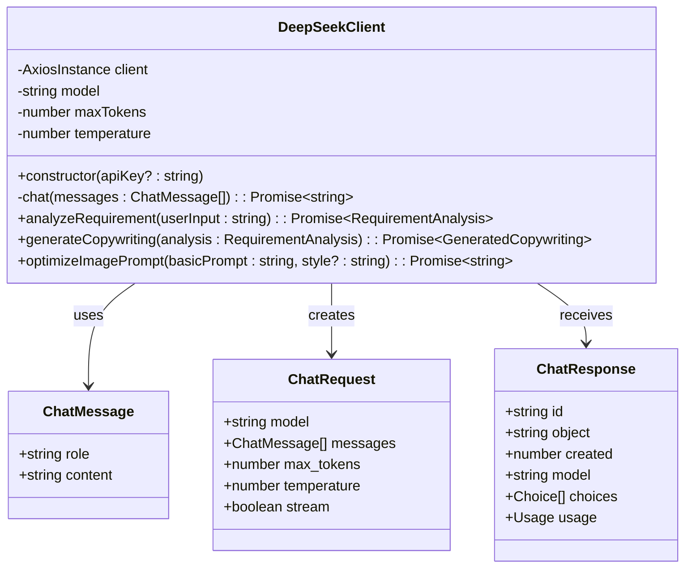
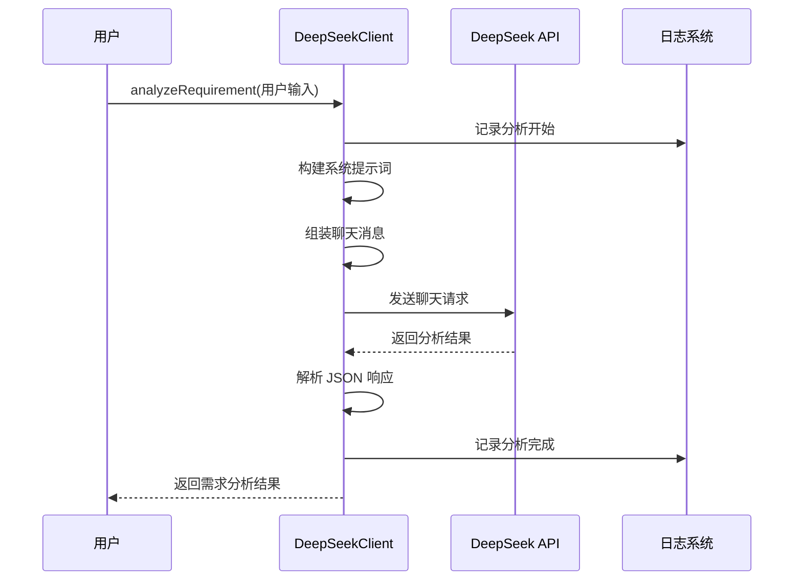
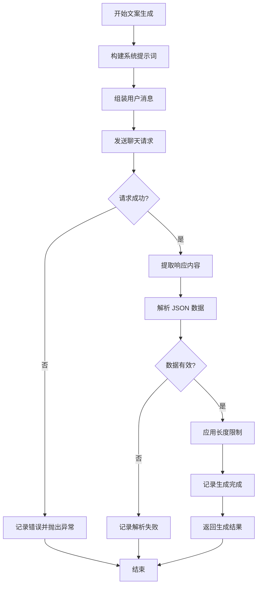
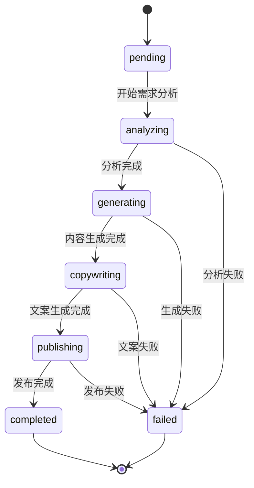
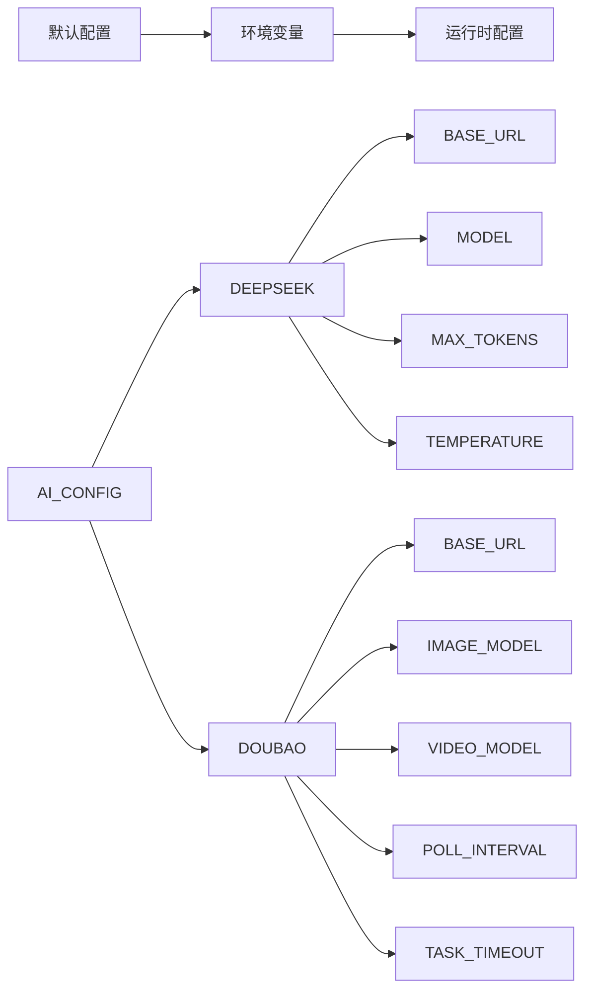
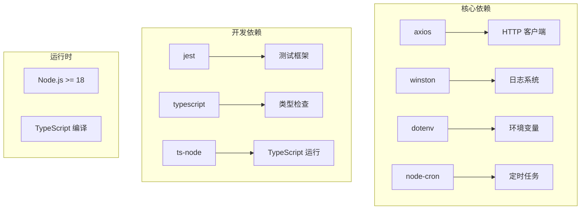
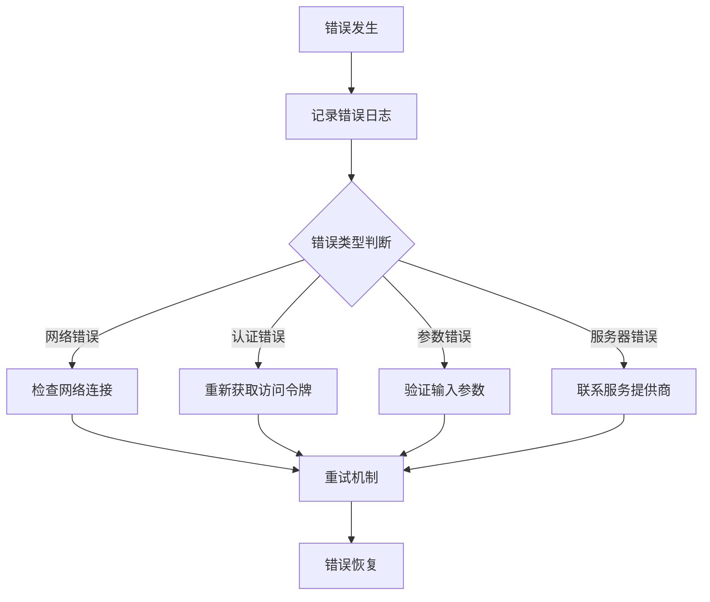

# Deepseek 客户端 API 文档

<cite>
**本文档引用的文件**
- [deepseek-client.ts](file://src/api/ai/deepseek-client.ts)
- [index.ts](file://src/api/ai/index.ts)
- [ai-publish-service.ts](file://src/services/ai-publish-service.ts)
- [default.ts](file://config/default.ts)
- [types.ts](file://src/models/types.ts)
- [logger.ts](file://src/utils/logger.ts)
- [retry.ts](file://src/utils/retry.ts)
- [package.json](file://package.json)
- [README.md](file://README.md)
</cite>

## 目录
1. [简介](#简介)
2. [项目结构](#项目结构)
3. [核心组件](#核心组件)
4. [架构概览](#架构概览)
5. [详细组件分析](#详细组件分析)
6. [依赖关系分析](#依赖关系分析)
7. [性能考虑](#性能考虑)
8. [故障排除指南](#故障排除指南)
9. [结论](#结论)

## 简介

Deepseek 客户端 API 是一个基于 TypeScript 的 AI 服务集成模块，专门用于与 DeepSeek 大语言模型进行交互，提供内容需求分析和推广文案生成功能。该系统集成了抖音（TikTok）营销自动化运营，为 crayfish 主题的营销账号提供智能化的内容创作解决方案。

该项目采用现代化的 Node.js 技术栈，使用 TypeScript 进行类型安全编程，结合 Winston 日志系统和 Axios HTTP 客户端，构建了一个健壮的 AI 服务客户端。

## 项目结构

项目采用模块化设计，主要分为以下几个核心目录：

**图表来源**
- [deepseek-client.ts:1-291](file://src/api/ai/deepseek-client.ts#L1-L291)
- [ai-publish-service.ts:1-377](file://src/services/ai-publish-service.ts#L1-L377)
- [default.ts:1-70](file://config/default.ts#L1-L70)

**章节来源**
- [README.md:92-105](file://README.md#L92-L105)
- [package.json:1-39](file://package.json#L1-L39)

## 核心组件

### DeepSeek 客户端

DeepSeek 客户端是整个系统的核心组件，负责与 DeepSeek AI 服务进行通信。它提供了三个主要功能：

1. **需求分析** - 分析用户输入，提取内容创作的关键要素
2. **文案生成** - 基于分析结果生成适合抖音平台的推广文案
3. **提示词优化** - 优化图片生成的英文提示词

### AI 发布编排服务

AI 发布编排服务作为协调器，统一管理整个 AI 内容创作流程，包括：

- 需求分析阶段
- 内容生成阶段  
- 文案生成阶段
- 发布执行阶段

### 类型系统

项目建立了完整的 TypeScript 类型系统，确保代码的类型安全性和可维护性：

- **RequirementAnalysis** - 需求分析结果类型
- **GeneratedContent** - 生成内容类型
- **GeneratedCopywriting** - 生成文案类型
- **AIPublishResult** - AI 发布结果类型

**章节来源**
- [deepseek-client.ts:63-288](file://src/api/ai/deepseek-client.ts#L63-L288)
- [ai-publish-service.ts:43-377](file://src/services/ai-publish-service.ts#L43-L377)
- [types.ts:209-317](file://src/models/types.ts#L209-L317)

## 架构概览

系统采用分层架构设计，实现了清晰的关注点分离：

**图表来源**
- [ai-publish-service.ts:43-73](file://src/services/ai-publish-service.ts#L43-L73)
- [deepseek-client.ts:63-89](file://src/api/ai/deepseek-client.ts#L63-L89)

## 详细组件分析

### DeepSeek 客户端类分析

DeepSeek 客户端类实现了完整的 AI 服务集成：

**图表来源**
- [deepseek-client.ts:63-89](file://src/api/ai/deepseek-client.ts#L63-L89)
- [deepseek-client.ts:24-58](file://src/api/ai/deepseek-client.ts#L24-L58)

#### 需求分析流程

需求分析是整个 AI 工作流的第一步，系统会分析用户输入并提取关键信息：

**图表来源**
- [deepseek-client.ts:129-181](file://src/api/ai/deepseek-client.ts#L129-L181)

#### 文案生成流程

基于需求分析结果，系统生成适合抖音平台的推广文案：

**图表来源**
- [deepseek-client.ts:188-252](file://src/api/ai/deepseek-client.ts#L188-L252)

**章节来源**
- [deepseek-client.ts:63-288](file://src/api/ai/deepseek-client.ts#L63-L288)

### AI 发布编排服务分析

AI 发布编排服务提供了完整的端到端工作流管理：

**图表来源**
- [ai-publish-service.ts:300-317](file://src/services/ai-publish-service.ts#L300-L317)

#### 任务状态管理

系统实现了完整的任务状态跟踪机制：

| 状态 | 描述 | 进度百分比 |
|------|------|------------|
| pending | 准备中 | 0% |
| analyzing | 需求分析中 | 10-25% |
| generating | 内容生成中 | 30-65% |
| copywriting | 文案生成中 | 70-80% |
| publishing | 发布中 | 85-100% |
| completed | 已完成 | 100% |
| failed | 执行失败 | 0% |

**章节来源**
- [ai-publish-service.ts:314-344](file://src/services/ai-publish-service.ts#L314-L344)

### 配置管理系统

系统采用集中式配置管理，支持环境变量覆盖：

**图表来源**
- [default.ts:42-60](file://config/default.ts#L42-L60)

**章节来源**
- [default.ts:1-70](file://config/default.ts#L1-L70)

## 依赖关系分析

项目使用了现代化的依赖管理策略：

**图表来源**
- [package.json:18-34](file://package.json#L18-L34)

### 外部 API 集成

系统集成了多个外部服务：

| 服务 | 用途 | 配置项 |
|------|------|--------|
| DeepSeek API | AI 内容分析和生成 | DEEPSEEK_API_KEY, DEEPSEEK_BASE_URL |
| TikTok API | 视频发布和管理 | TIKTOK_ACCESS_TOKEN, TIKTOK_CLIENT_ID |
| 文件存储 | 视频和图片存储 | 本地文件系统 |

**章节来源**
- [package.json:18-34](file://package.json#L18-L34)

## 性能考虑

### 异步处理和并发控制

系统采用了异步编程模式，确保高并发场景下的稳定性：

- **超时控制**：每个 API 请求设置 60 秒超时
- **指数退避重试**：最大重试 3 次，基础延迟 1 秒
- **进度回调**：实时反馈长时间操作的进度

### 内存管理和资源清理

- **任务状态清理**：自动清理 1 小时前的过期任务
- **日志轮转**：使用 Winston 进行日志文件管理
- **连接池管理**：Axios 实例复用，避免频繁创建连接

### 缓存策略

虽然当前版本未实现缓存，但系统设计支持后续添加：

- **配置缓存**：避免重复读取环境变量
- **响应缓存**：针对相同输入的重复请求
- **模型参数缓存**：减少重复的模型配置加载

## 故障排除指南

### 常见错误类型和解决方案

| 错误类型 | 症状 | 解决方案 |
|----------|------|----------|
| API Key 无效 | "DeepSeek API Key 未配置" | 检查环境变量 DEEPSEEK_API_KEY |
| 网络超时 | 请求超时错误 | 检查网络连接和防火墙设置 |
| JSON 解析失败 | "解析结果失败" | 验证 AI 模型响应格式 |
| 发布失败 | 抖音 API 错误 | 检查 TikTok 认证状态 |

### 日志分析

系统提供了详细的日志记录机制：

**图表来源**
- [logger.ts:31-55](file://src/utils/logger.ts#L31-L55)

### 调试模式

系统支持多种调试级别：

- **info**：基本操作日志
- **debug**：详细调试信息
- **warn**：警告信息
- **error**：错误信息

**章节来源**
- [logger.ts:10-55](file://src/utils/logger.ts#L10-L55)

## 结论

Deepseek 客户端 API 提供了一个完整、健壮的 AI 服务集成解决方案。通过模块化的架构设计、完善的类型系统和强大的错误处理机制，该系统能够稳定地支持抖音营销自动化运营。

### 主要优势

1. **类型安全**：完整的 TypeScript 类型定义确保代码质量
2. **模块化设计**：清晰的职责分离便于维护和扩展
3. **错误处理**：完善的错误捕获和恢复机制
4. **日志系统**：全面的日志记录便于问题诊断
5. **配置灵活**：支持环境变量和运行时配置

### 未来改进方向

1. **性能优化**：实现响应缓存和连接池优化
2. **监控集成**：添加 APM 和性能指标监控
3. **扩展支持**：支持更多 AI 服务提供商
4. **测试覆盖**：增加单元测试和集成测试覆盖率
5. **文档完善**：提供更详细的 API 文档和使用示例

该系统为 crayfish 主题的抖音营销账号提供了强有力的技术支撑，能够显著提高内容创作效率和营销效果。