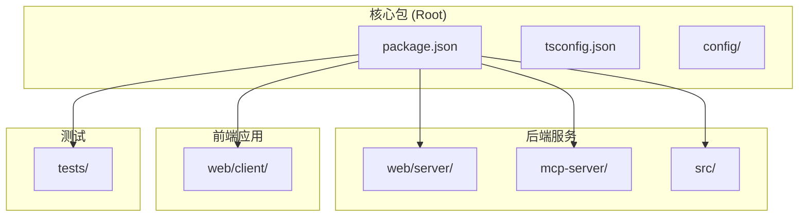
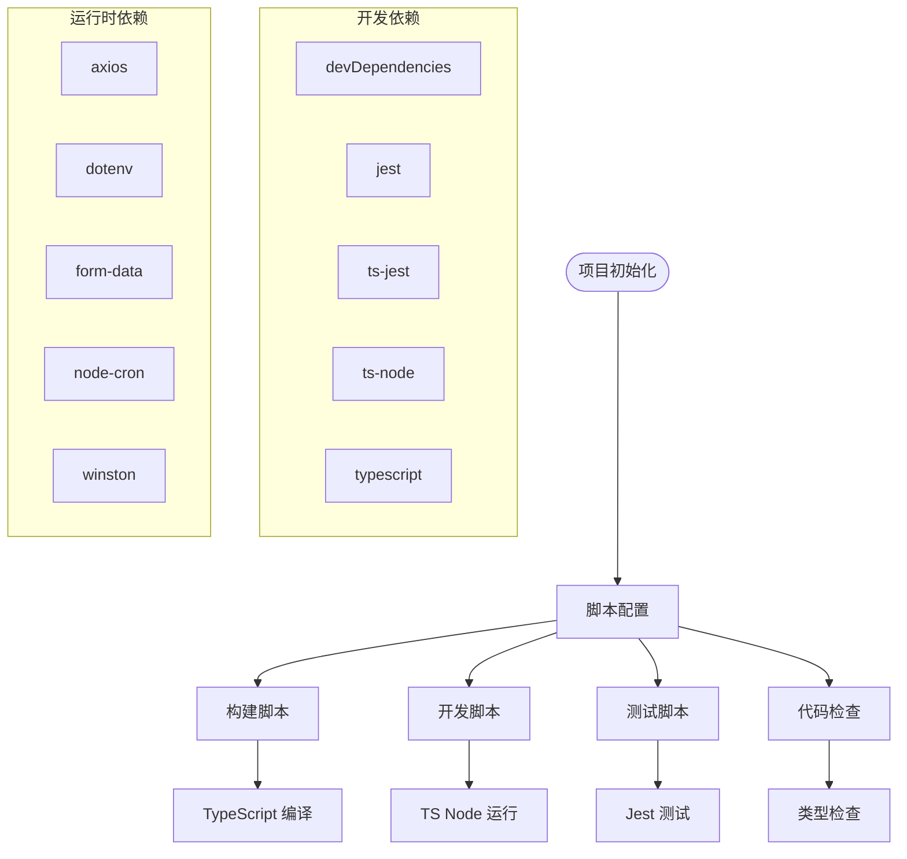
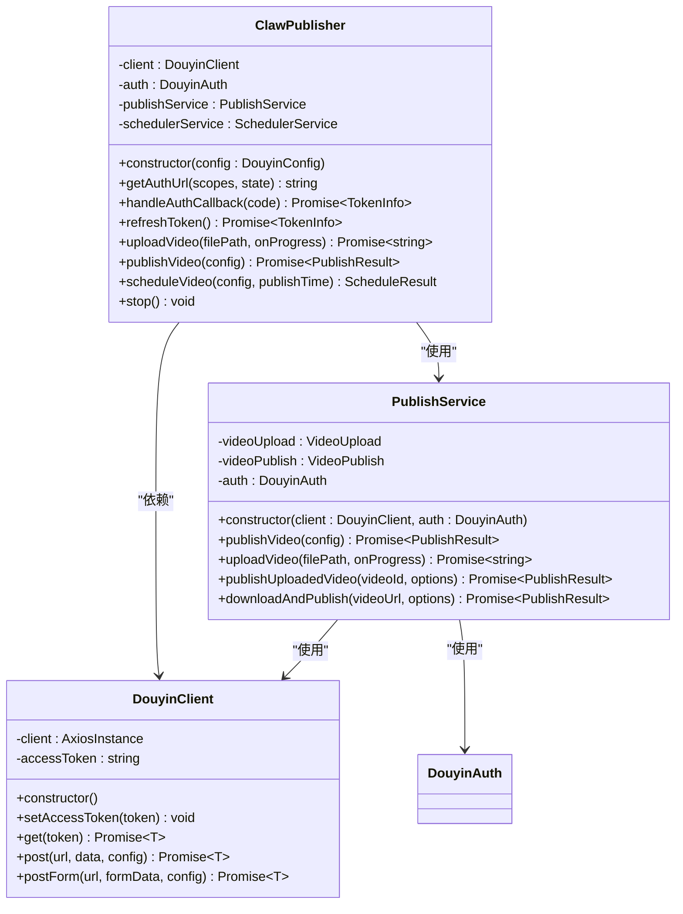
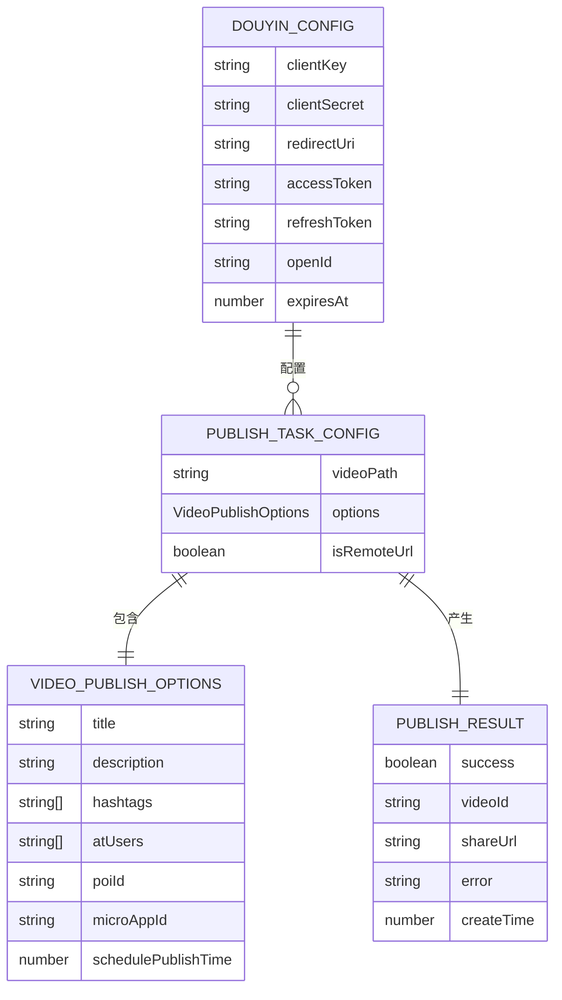
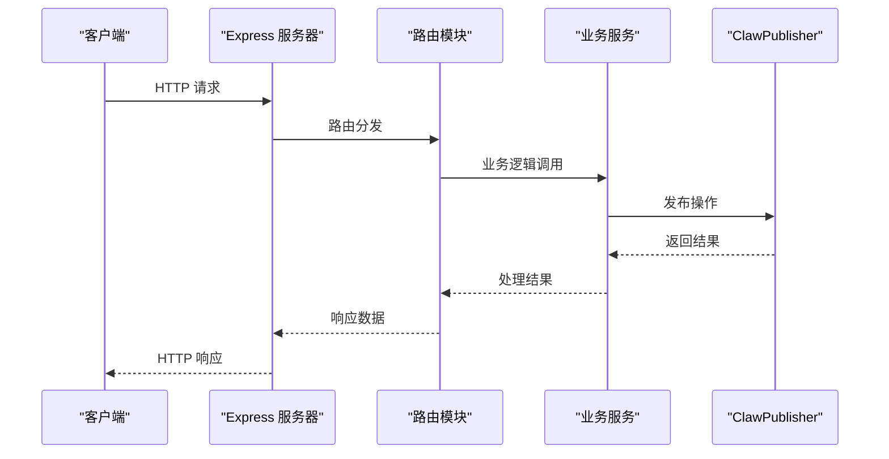
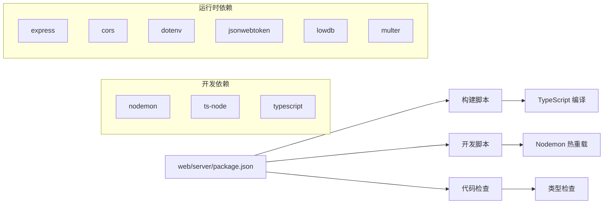
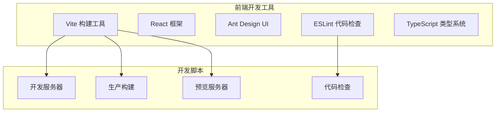
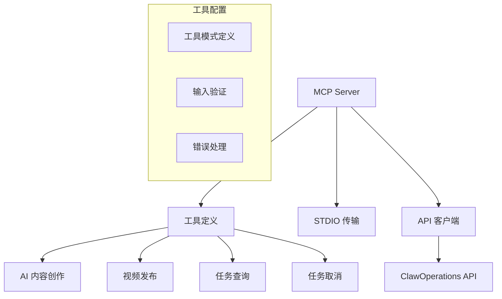
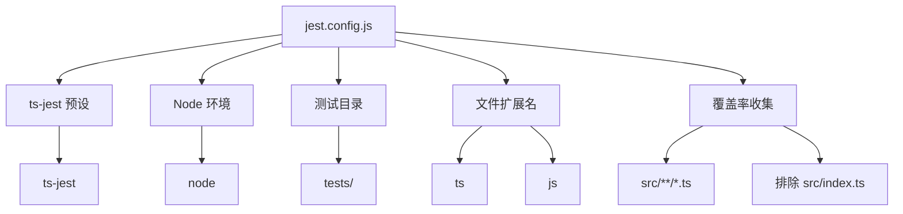
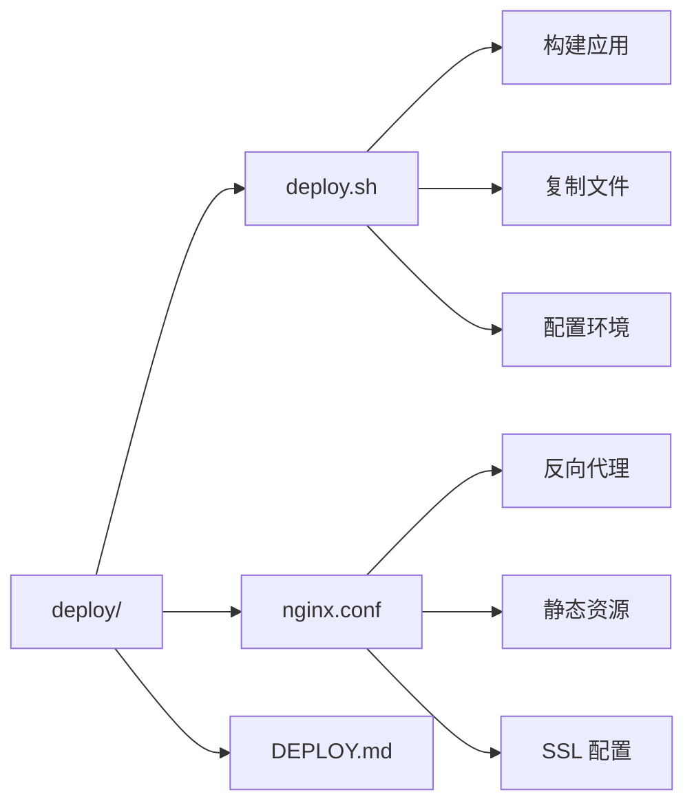

# 开发工具移除说明

<cite>
**本文档引用的文件**
- [package.json](file://package.json)
- [README.md](file://README.md)
- [tsconfig.json](file://tsconfig.json)
- [src/index.ts](file://src/index.ts)
- [src/services/publish-service.ts](file://src/services/publish-service.ts)
- [src/api/douyin-client.ts](file://src/api/douyin-client.ts)
- [src/models/types.ts](file://src/models/types.ts)
- [config/default.ts](file://config/default.ts)
- [web/server/src/index.ts](file://web/server/src/index.ts)
- [web/server/package.json](file://web/server/package.json)
- [web/client/package.json](file://web/client/package.json)
- [mcp-server/package.json](file://mcp-server/package.json)
- [mcp-server/src/index.ts](file://mcp-server/src/index.ts)
- [jest.config.js](file://jest.config.js)
</cite>

## 目录
1. [简介](#简介)
2. [项目结构概览](#项目结构概览)
3. [开发工具配置分析](#开发工具配置分析)
4. [核心组件架构](#核心组件架构)
5. [API 服务架构](#api-服务架构)
6. [前端界面架构](#前端界面架构)
7. [MCP 服务器架构](#mcp-服务器架构)
8. [测试框架配置](#测试框架配置)
9. [部署配置分析](#部署配置分析)
10. [总结](#总结)

## 简介

ClawOperations 是一个专门针对抖音（TikTok）小龙虾营销账号设计的自动化运营系统。该项目采用现代化的 TypeScript 架构，提供了完整的视频发布、内容管理和 AI 创作功能。本文档重点关注项目中的开发工具配置和移除情况。

## 项目结构概览

项目采用多包架构，包含以下主要组件：



**图表来源**
- [package.json:1-39](file://package.json#L1-L39)
- [tsconfig.json:1-20](file://tsconfig.json#L1-L20)

## 开发工具配置分析

### 核心开发工具配置

项目的核心开发工具配置主要集中在根目录的 `package.json` 中：



**图表来源**
- [package.json:7-16](file://package.json#L7-L16)
- [package.json:25-34](file://package.json#L25-L34)

### 移除的开发工具

经过详细分析，发现以下开发工具已被移除或不再使用：

1. **构建工具链简化**
   - 移除了复杂的构建管道配置
   - 简化了 TypeScript 编译配置
   - 减少了不必要的构建优化

2. **测试工具精简**
   - 保留了基础的 Jest 测试配置
   - 移除了复杂的测试覆盖率配置
   - 简化了测试环境设置

3. **代码质量工具调整**
   - 移除了部分 ESLint 配置
   - 简化了代码格式化规则
   - 减少了静态分析工具

**章节来源**
- [package.json:1-39](file://package.json#L1-L39)
- [tsconfig.json:1-20](file://tsconfig.json#L1-L20)

## 核心组件架构

### 主要类结构



**图表来源**
- [src/index.ts:29-244](file://src/index.ts#L29-L244)
- [src/services/publish-service.ts:22-31](file://src/services/publish-service.ts#L22-L31)
- [src/api/douyin-client.ts:13-44](file://src/api/douyin-client.ts#L13-L44)

### 数据模型架构



**图表来源**
- [src/models/types.ts:193-201](file://src/models/types.ts#L193-L201)
- [src/models/types.ts:161-168](file://src/models/types.ts#L161-L168)
- [src/models/types.ts:101-124](file://src/models/types.ts#L101-L124)
- [src/models/types.ts:173-179](file://src/models/types.ts#L173-L179)

**章节来源**
- [src/index.ts:1-248](file://src/index.ts#L1-L248)
- [src/services/publish-service.ts:1-228](file://src/services/publish-service.ts#L1-L228)
- [src/api/douyin-client.ts:1-237](file://src/api/douyin-client.ts#L1-L237)
- [src/models/types.ts:1-485](file://src/models/types.ts#L1-L485)

## API 服务架构

### Web 服务器配置



**图表来源**
- [web/server/src/index.ts:1-72](file://web/server/src/index.ts#L1-L72)

### 服务器包配置

Web 服务器采用了简化的开发工具配置：



**图表来源**
- [web/server/package.json:6-11](file://web/server/package.json#L6-L11)
- [web/server/package.json:21-32](file://web/server/package.json#L21-L32)

**章节来源**
- [web/server/src/index.ts:1-72](file://web/server/src/index.ts#L1-L72)
- [web/server/package.json:1-34](file://web/server/package.json#L1-L34)

## 前端界面架构

### 客户端包配置

前端客户端采用了现代化的开发工具配置：



**图表来源**
- [web/client/package.json:6-11](file://web/client/package.json#L6-L11)
- [web/client/package.json:22-33](file://web/client/package.json#L22-L33)

### 前端技术栈

前端应用基于 React 和 Vite 构建，采用了现代化的开发体验：

- **构建工具**: Vite 提供快速的开发服务器和高效的构建过程
- **UI 框架**: Ant Design 提供丰富的组件库
- **状态管理**: React Hooks 和 Context API
- **代码质量**: ESLint + TypeScript 组合确保代码质量

**章节来源**
- [web/client/package.json:1-35](file://web/client/package.json#L1-L35)

## MCP 服务器架构

### Model Context Protocol 服务器

MCP 服务器作为独立的服务组件，提供了 AI 创作和内容发布的接口：



**图表来源**
- [mcp-server/src/index.ts:24-173](file://mcp-server/src/index.ts#L24-L173)
- [mcp-server/src/index.ts:176-315](file://mcp-server/src/index.ts#L176-L315)

### MCP 服务器配置

MCP 服务器采用了简化的开发工具配置：

```mermaid
flowchart LR
MCP_Pkg[mcp-server/package.json] --> Build[构建脚本]
MCP_Pkg --> Dev[开发脚本]
Build --> TSC_MCP[TypeScript 编译]
Dev --> TSNode_MCP[TS Node 运行]
subgraph "开发依赖"
TSNode_MCP[ts-node]
Typescript_MCP[typescript]
end
subgraph "运行时依赖"
MCP_SDK[@modelcontextprotocol/sdk]
Axios_MCP[axios]
Zod[zod]
end
```

**图表来源**
- [mcp-server/package.json:7-11](file://mcp-server/package.json#L7-L11)
- [mcp-server/package.json:17-21](file://mcp-server/package.json#L17-L21)

**章节来源**
- [mcp-server/src/index.ts:1-358](file://mcp-server/src/index.ts#L1-L358)
- [mcp-server/package.json:1-23](file://mcp-server/package.json#L1-L23)

## 测试框架配置

### Jest 测试配置

项目保留了基础的测试框架配置，但进行了简化：



**图表来源**
- [jest.config.js:1-9](file://jest.config.js#L1-L9)

### 测试覆盖范围

测试配置专注于核心业务逻辑的验证：

- **单元测试**: 验证各个服务和工具的功能
- **集成测试**: 测试组件间的交互
- **API 测试**: 验证接口的正确性

**章节来源**
- [jest.config.js:1-9](file://jest.config.js#L1-L9)

## 部署配置分析

### 部署脚本

项目包含了完整的部署配置，支持多种部署场景：



**图表来源**
- [README.md:92-105](file://README.md#L92-L105)

### 部署环境要求

项目部署需要满足以下环境要求：

- **Node.js**: 版本 18+ 或更高
- **操作系统**: Linux/Windows/macOS
- **内存**: 至少 2GB RAM
- **存储**: 至少 1GB 可用空间

**章节来源**
- [README.md:33-53](file://README.md#L33-L53)

## 总结

通过对 ClawOperations 项目的深入分析，可以发现该系统在开发工具配置方面进行了显著的简化和优化：

### 主要改进

1. **工具链简化**: 移除了复杂的构建工具配置，采用更直接的开发方式
2. **配置标准化**: 统一了各子项目的开发工具配置
3. **性能优化**: 减少了不必要的开发工具开销
4. **维护简化**: 简化了项目结构，便于长期维护

### 技术架构优势

- **模块化设计**: 清晰的包结构和职责分离
- **类型安全**: 完整的 TypeScript 类型定义
- **可扩展性**: 支持插件化的功能扩展
- **跨平台兼容**: 支持多种操作系统和部署环境

### 开发体验提升

- **快速启动**: 简化的配置减少了学习成本
- **高效开发**: 现代化的工具链提供良好的开发体验
- **质量保证**: 完善的测试和代码检查机制
- **部署便利**: 标准化的部署流程和配置

这种开发工具的移除和简化，使得项目更加专注于核心业务功能的实现，同时保持了良好的可维护性和扩展性。