# ClawOperations 文档

<cite>
**本文档引用的文件**
- [README.md](file://README.md)
- [package.json](file://package.json)
- [src/index.ts](file://src/index.ts)
- [src/models/types.ts](file://src/models/types.ts)
- [src/api/douyin-client.ts](file://src/api/douyin-client.ts)
- [src/api/auth.ts](file://src/api/auth.ts)
- [src/services/publish-service.ts](file://src/services/publish-service.ts)
- [src/services/scheduler-service.ts](file://src/services/scheduler-service.ts)
- [config/default.ts](file://config/default.ts)
- [src/utils/logger.ts](file://src/utils/logger.ts)
- [web/server/src/index.ts](file://web/server/src/index.ts)
- [web/server/src/routes/publish.ts](file://web/server/src/routes/publish.ts)
- [mcp-server/src/index.ts](file://mcp-server/src/index.ts)
- [web/client/src/App.tsx](file://web/client/src/App.tsx)
- [web/client/src/pages/AICreator.tsx](file://web/client/src/pages/AICreator.tsx)
</cite>

## 目录
1. [简介](#简介)
2. [项目结构](#项目结构)
3. [核心组件](#核心组件)
4. [架构概览](#架构概览)
5. [详细组件分析](#详细组件分析)
6. [依赖关系分析](#依赖关系分析)
7. [性能考虑](#性能考虑)
8. [故障排除指南](#故障排除指南)
9. [结论](#结论)

## 简介

ClawOperations 是一个专为抖音（TikTok）小龙虾营销账户设计的自动化运营系统。该项目提供了全面的工具和工作流程，用于简化内容创作、调度、分析跟踪和观众互动，为您的小龙虾品牌在抖音上的存在提供技术基础设施。

该项目的核心特点包括：
- **官方 API 集成**：与抖音开放平台 API 的安全集成
- **内容发布**：自动化的视频上传和调度功能
- **AI 创作**：智能内容生成和文案创作
- **定时发布**：基于 cron 的任务调度系统
- **多平台支持**：包含 Web 界面和 MCP 服务器

## 项目结构

项目采用模块化架构，主要分为以下几个核心部分：

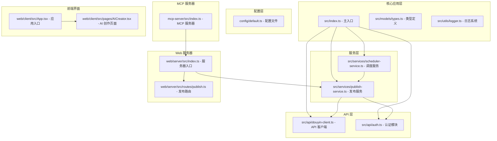
```mermaid
graph TB
subgraph "核心应用层"
A[src/index.ts - 主入口]
B[src/models/types.ts - 类型定义]
C[src/utils/logger.ts - 日志系统]
end
subgraph "API 层"
D[src/api/douyin-client.ts - API 客户端]
E[src/api/auth.ts - 认证模块]
end
subgraph "服务层"
F[src/services/publish-service.ts - 发布服务]
G[src/services/scheduler-service.ts - 调度服务]
end
subgraph "配置层"
H[config/default.ts - 配置文件]
end
subgraph "Web 服务器"
I[web/server/src/index.ts - 服务器入口]
J[web/server/src/routes/publish.ts - 发布路由]
end
subgraph "MCP 服务器"
K[mcp-server/src/index.ts - MCP 服务器]
end
subgraph "前端界面"
L[web/client/src/App.tsx - 应用入口]
M[web/client/src/pages/AICreator.tsx - AI 创作页面]
end
A --> D
A --> E
A --> F
A --> G
F --> D
F --> E
G --> F
I --> J
I --> F
K --> I
L --> M
```

**图表来源**
- [src/index.ts:1-248](file://src/index.ts#L1-L248)
- [web/server/src/index.ts:1-72](file://web/server/src/index.ts#L1-L72)
- [mcp-server/src/index.ts:1-358](file://mcp-server/src/index.ts#L1-L358)

**章节来源**
- [README.md:92-105](file://README.md#L92-L105)
- [package.json:1-39](file://package.json#L1-L39)

## 核心组件

### 主要类和接口

项目的核心围绕以下几个主要类构建：

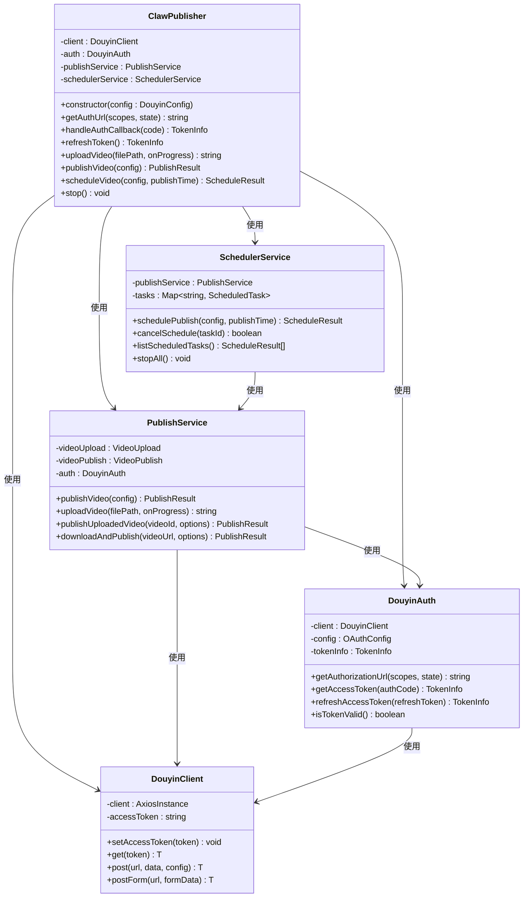
```mermaid
classDiagram
class ClawPublisher {
-client : DouyinClient
-auth : DouyinAuth
-publishService : PublishService
-schedulerService : SchedulerService
+constructor(config : DouyinConfig)
+getAuthUrl(scopes, state) string
+handleAuthCallback(code) TokenInfo
+refreshToken() TokenInfo
+uploadVideo(filePath, onProgress) string
+publishVideo(config) PublishResult
+scheduleVideo(config, publishTime) ScheduleResult
+stop() void
}
class DouyinClient {
-client : AxiosInstance
-accessToken : string
+setAccessToken(token) void
+get(token) T
+post(url, data, config) T
+postForm(url, formData) T
}
class PublishService {
-videoUpload : VideoUpload
-videoPublish : VideoPublish
-auth : DouyinAuth
+publishVideo(config) PublishResult
+uploadVideo(filePath, onProgress) string
+publishUploadedVideo(videoId, options) PublishResult
+downloadAndPublish(videoUrl, options) PublishResult
}
class SchedulerService {
-publishService : PublishService
-tasks : Map~string, ScheduledTask~
+schedulePublish(config, publishTime) ScheduleResult
+cancelSchedule(taskId) boolean
+listScheduledTasks() ScheduleResult[]
+stopAll() void
}
class DouyinAuth {
-client : DouyinClient
-config : OAuthConfig
-tokenInfo : TokenInfo
+getAuthorizationUrl(scopes, state) string
+getAccessToken(authCode) TokenInfo
+refreshAccessToken(refreshToken) TokenInfo
+isTokenValid() boolean
}
ClawPublisher --> DouyinClient : 使用
ClawPublisher --> DouyinAuth : 使用
ClawPublisher --> PublishService : 使用
ClawPublisher --> SchedulerService : 使用
PublishService --> DouyinClient : 使用
PublishService --> DouyinAuth : 使用
SchedulerService --> PublishService : 使用
DouyinAuth --> DouyinClient : 使用
```

**图表来源**
- [src/index.ts:29-244](file://src/index.ts#L29-L244)
- [src/api/douyin-client.ts:13-237](file://src/api/douyin-client.ts#L13-L237)
- [src/services/publish-service.ts:22-228](file://src/services/publish-service.ts#L22-L228)
- [src/services/scheduler-service.ts:23-202](file://src/services/scheduler-service.ts#L23-L202)
- [src/api/auth.ts:28-189](file://src/api/auth.ts#L28-L189)

### 数据模型

项目使用 TypeScript 接口来定义强类型的数据结构：

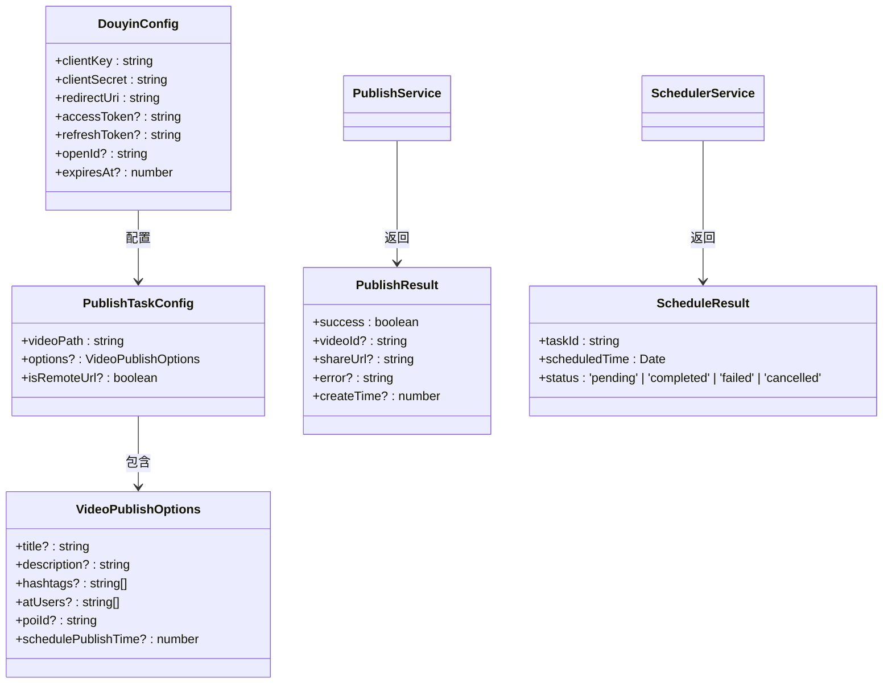
```mermaid
classDiagram
class DouyinConfig {
+clientKey : string
+clientSecret : string
+redirectUri : string
+accessToken? : string
+refreshToken? : string
+openId? : string
+expiresAt? : number
}
class PublishTaskConfig {
+videoPath : string
+options? : VideoPublishOptions
+isRemoteUrl? : boolean
}
class VideoPublishOptions {
+title? : string
+description? : string
+hashtags? : string[]
+atUsers? : string[]
+poiId? : string
+schedulePublishTime? : number
}
class PublishResult {
+success : boolean
+videoId? : string
+shareUrl? : string
+error? : string
+createTime? : number
}
class ScheduleResult {
+taskId : string
+scheduledTime : Date
+status : 'pending' | 'completed' | 'failed' | 'cancelled'
}
DouyinConfig --> PublishTaskConfig : 配置
PublishTaskConfig --> VideoPublishOptions : 包含
PublishService --> PublishResult : 返回
SchedulerService --> ScheduleResult : 返回
```

**图表来源**
- [src/models/types.ts:193-201](file://src/models/types.ts#L193-L201)
- [src/models/types.ts:161-168](file://src/models/types.ts#L161-L168)
- [src/models/types.ts:101-124](file://src/models/types.ts#L101-L124)
- [src/models/types.ts:173-189](file://src/models/types.ts#L173-L189)
- [src/models/types.ts:184-188](file://src/models/types.ts#L184-L188)

**章节来源**
- [src/index.ts:29-244](file://src/index.ts#L29-L244)
- [src/models/types.ts:1-485](file://src/models/types.ts#L1-L485)

## 架构概览

ClawOperations 采用了分层架构设计，确保了良好的关注点分离和可维护性：

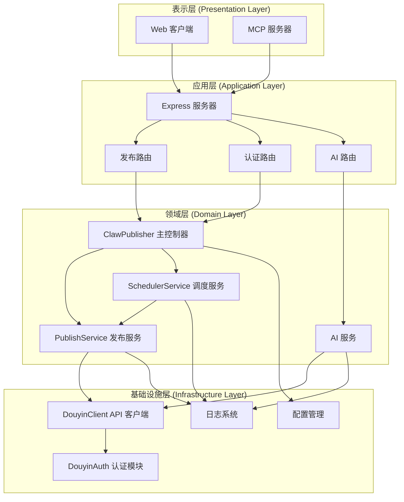
```mermaid
graph TB
subgraph "表示层 (Presentation Layer)"
A[Web 客户端]
B[MCP 服务器]
end
subgraph "应用层 (Application Layer)"
C[Express 服务器]
D[发布路由]
E[认证路由]
F[AI 路由]
end
subgraph "领域层 (Domain Layer)"
G[ClawPublisher 主控制器]
H[PublishService 发布服务]
I[SchedulerService 调度服务]
J[AI 服务]
end
subgraph "基础设施层 (Infrastructure Layer)"
K[DouyinClient API 客户端]
L[DouyinAuth 认证模块]
M[配置管理]
N[日志系统]
end
A --> C
B --> C
C --> D
C --> E
C --> F
D --> G
E --> G
F --> J
G --> H
G --> I
H --> K
I --> H
J --> K
K --> L
G --> M
H --> N
I --> N
J --> N
```

**图表来源**
- [web/server/src/index.ts:1-72](file://web/server/src/index.ts#L1-L72)
- [web/server/src/routes/publish.ts:1-349](file://web/server/src/routes/publish.ts#L1-L349)
- [src/index.ts:1-248](file://src/index.ts#L1-L248)
- [src/services/publish-service.ts:1-228](file://src/services/publish-service.ts#L1-L228)
- [src/services/scheduler-service.ts:1-202](file://src/services/scheduler-service.ts#L1-L202)

### 核心工作流程

#### 发布流程序列图

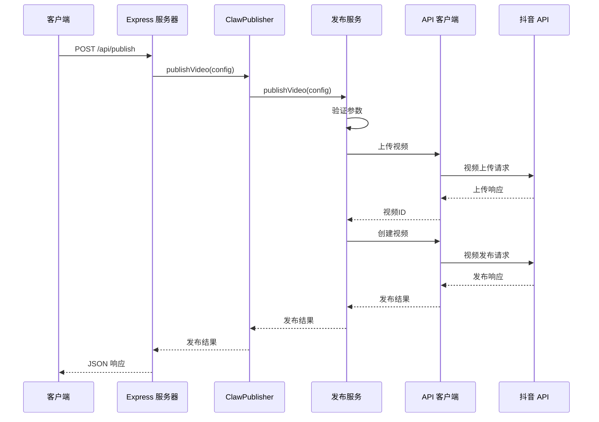
```mermaid
sequenceDiagram
participant Client as 客户端
participant Server as Express 服务器
participant Publisher as ClawPublisher
participant PublishService as 发布服务
participant DouyinClient as API 客户端
participant DouyinAPI as 抖音 API
Client->>Server : POST /api/publish
Server->>Publisher : publishVideo(config)
Publisher->>PublishService : publishVideo(config)
PublishService->>PublishService : 验证参数
PublishService->>DouyinClient : 上传视频
DouyinClient->>DouyinAPI : 视频上传请求
DouyinAPI-->>DouyinClient : 上传响应
DouyinClient-->>PublishService : 视频ID
PublishService->>DouyinClient : 创建视频
DouyinClient->>DouyinAPI : 视频发布请求
DouyinAPI-->>DouyinClient : 发布响应
DouyinClient-->>PublishService : 发布结果
PublishService-->>Publisher : 发布结果
Publisher-->>Server : 发布结果
Server-->>Client : JSON 响应
```

**图表来源**
- [web/server/src/routes/publish.ts:29-53](file://web/server/src/routes/publish.ts#L29-L53)
- [src/services/publish-service.ts:38-80](file://src/services/publish-service.ts#L38-L80)
- [src/api/douyin-client.ts:124-166](file://src/api/douyin-client.ts#L124-L166)

#### 定时发布流程

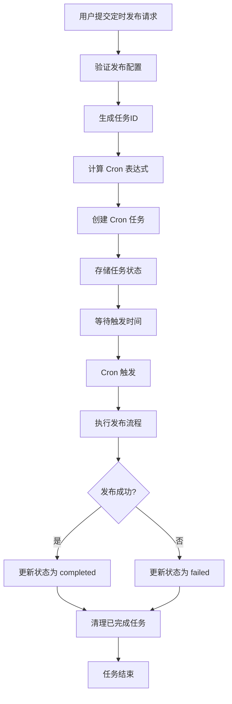
```mermaid
flowchart TD
A[用户提交定时发布请求] --> B[验证发布配置]
B --> C[生成任务ID]
C --> D[计算 Cron 表达式]
D --> E[创建 Cron 任务]
E --> F[存储任务状态]
F --> G[等待触发时间]
G --> H[Cron 触发]
H --> I[执行发布流程]
I --> J{发布成功?}
J --> |是| K[更新状态为 completed]
J --> |否| L[更新状态为 failed]
K --> M[清理已完成任务]
L --> M
M --> N[任务结束]
```

**图表来源**
- [src/services/scheduler-service.ts:37-72](file://src/services/scheduler-service.ts#L37-L72)
- [src/services/scheduler-service.ts:140-162](file://src/services/scheduler-service.ts#L140-L162)

**章节来源**
- [web/server/src/index.ts:1-72](file://web/server/src/index.ts#L1-L72)
- [web/server/src/routes/publish.ts:1-349](file://web/server/src/routes/publish.ts#L1-L349)
- [src/services/scheduler-service.ts:1-202](file://src/services/scheduler-service.ts#L1-L202)

## 详细组件分析

### API 客户端 (DouyinClient)

DouyinClient 是项目的核心 API 客户端，负责与抖音开放平台进行通信：

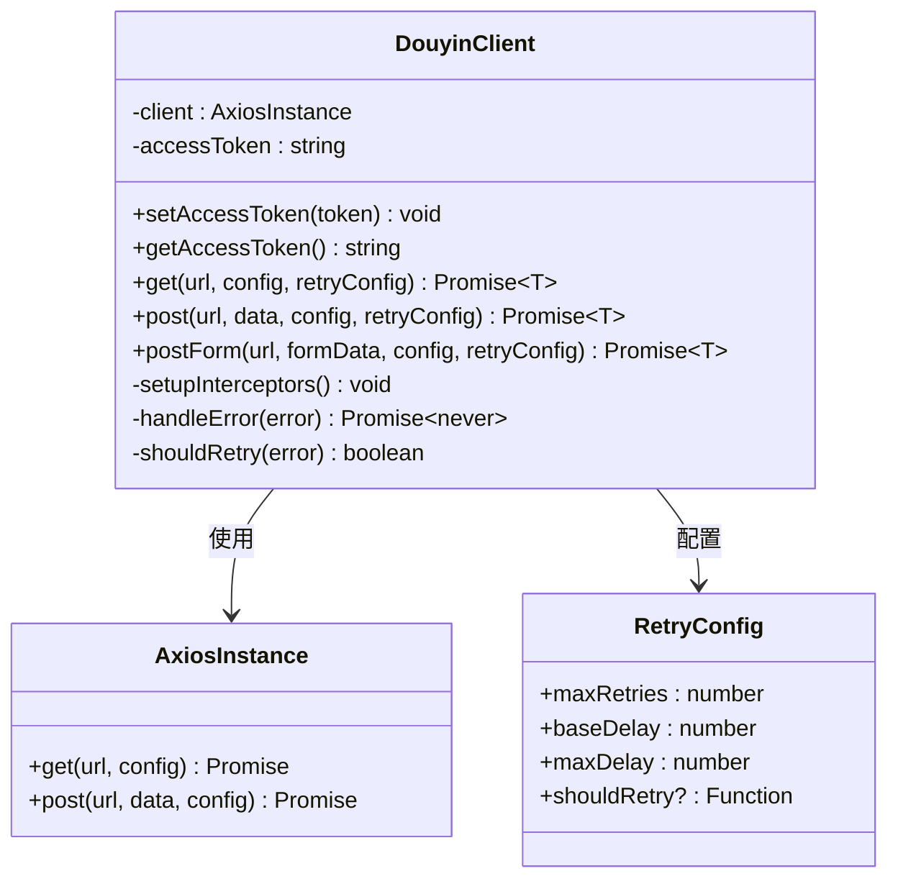
```mermaid
classDiagram
class DouyinClient {
-client : AxiosInstance
-accessToken : string
+setAccessToken(token) void
+getAccessToken() string
+get(url, config, retryConfig) Promise~T~
+post(url, data, config, retryConfig) Promise~T~
+postForm(url, formData, config, retryConfig) Promise~T~
-setupInterceptors() void
-handleError(error) Promise~never~
-shouldRetry(error) boolean
}
class AxiosInstance {
+get(url, config) Promise
+post(url, data, config) Promise
}
class RetryConfig {
+maxRetries : number
+baseDelay : number
+maxDelay : number
+shouldRetry? : Function
}
DouyinClient --> AxiosInstance : 使用
DouyinClient --> RetryConfig : 配置
```

**图表来源**
- [src/api/douyin-client.ts:13-237](file://src/api/douyin-client.ts#L13-L237)

#### 错误处理机制

API 客户端实现了完善的错误处理机制：

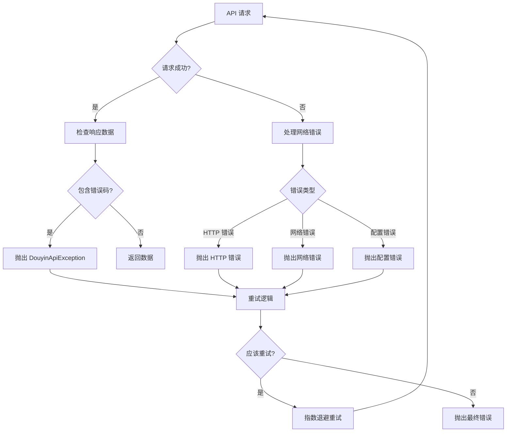
```mermaid
flowchart TD
A[API 请求] --> B{请求成功?}
B --> |是| C[检查响应数据]
B --> |否| D[处理网络错误]
C --> E{包含错误码?}
E --> |是| F[抛出 DouyinApiException]
E --> |否| G[返回数据]
D --> H{错误类型}
H --> |HTTP 错误| I[抛出 HTTP 错误]
H --> |网络错误| J[抛出网络错误]
H --> |配置错误| K[抛出配置错误]
F --> L[重试逻辑]
I --> L
J --> L
K --> L
L --> M{应该重试?}
M --> |是| N[指数退避重试]
M --> |否| O[抛出最终错误]
N --> A
```

**图表来源**
- [src/api/douyin-client.ts:97-116](file://src/api/douyin-client.ts#L97-L116)
- [src/api/douyin-client.ts:204-220](file://src/api/douyin-client.ts#L204-L220)

**章节来源**
- [src/api/douyin-client.ts:1-237](file://src/api/douyin-client.ts#L1-L237)
- [config/default.ts:17-24](file://config/default.ts#L17-L24)

### 发布服务 (PublishService)

发布服务是业务逻辑的核心编排层：

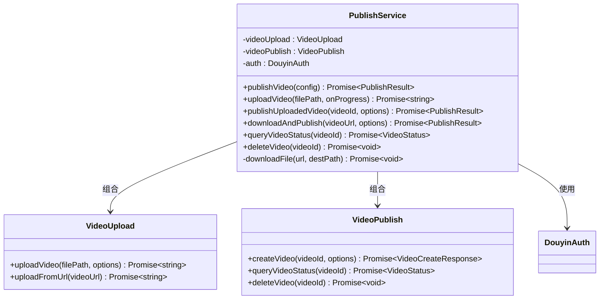
```mermaid
classDiagram
class PublishService {
-videoUpload : VideoUpload
-videoPublish : VideoPublish
-auth : DouyinAuth
+publishVideo(config) Promise~PublishResult~
+uploadVideo(filePath, onProgress) Promise~string~
+publishUploadedVideo(videoId, options) Promise~PublishResult~
+downloadAndPublish(videoUrl, options) Promise~PublishResult~
+queryVideoStatus(videoId) Promise~VideoStatus~
+deleteVideo(videoId) Promise~void~
-downloadFile(url, destPath) Promise~void~
}
class VideoUpload {
+uploadVideo(filePath, options) Promise~string~
+uploadFromUrl(videoUrl) Promise~string~
}
class VideoPublish {
+createVideo(videoId, options) Promise~VideoCreateResponse~
+queryVideoStatus(videoId) Promise~VideoStatus~
+deleteVideo(videoId) Promise~void~
}
PublishService --> VideoUpload : 组合
PublishService --> VideoPublish : 组合
PublishService --> DouyinAuth : 使用
```

**图表来源**
- [src/services/publish-service.ts:22-228](file://src/services/publish-service.ts#L22-L228)

#### 发布流程优化

发布服务实现了多种发布策略以适应不同的使用场景：

| 发布方式 | 适用场景 | 优势 | 复杂度 |
|---------|---------|------|--------|
| 直接发布 | 本地文件发布 | 简单直接，实时反馈 | O(1) |
| URL 发布 | 远程资源发布 | 节省带宽，无需下载 | O(1) |
| 下载发布 | 网络资源处理 | 支持任意 URL，灵活 | O(n) |
| 定时发布 | 预约发布时间 | 自动化调度，提高效率 | O(log n) |

**章节来源**
- [src/services/publish-service.ts:1-228](file://src/services/publish-service.ts#L1-L228)

### 调度服务 (SchedulerService)

调度服务基于 node-cron 实现了强大的定时任务管理：

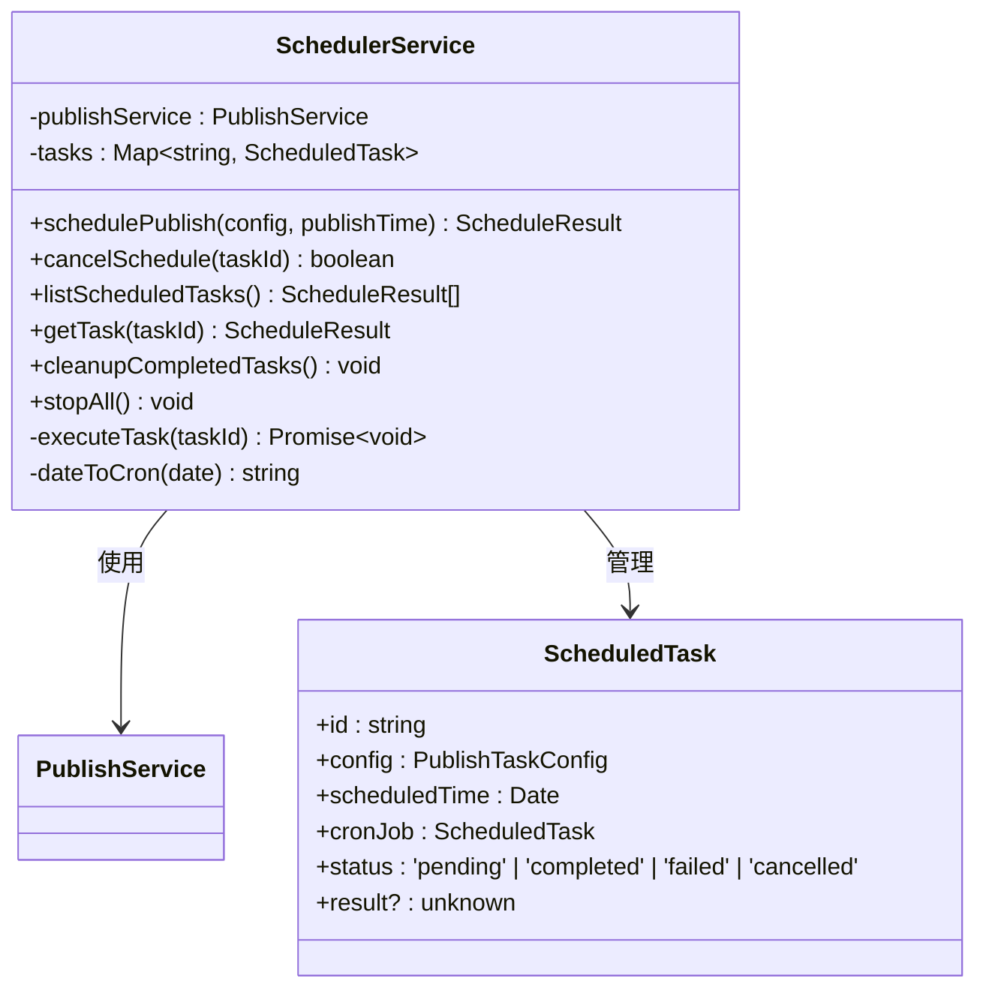
```mermaid
classDiagram
class SchedulerService {
-publishService : PublishService
-tasks : Map~string, ScheduledTask~
+schedulePublish(config, publishTime) ScheduleResult
+cancelSchedule(taskId) boolean
+listScheduledTasks() ScheduleResult[]
+getTask(taskId) ScheduleResult
+cleanupCompletedTasks() void
+stopAll() void
-executeTask(taskId) Promise~void~
-dateToCron(date) string
}
class ScheduledTask {
+id : string
+config : PublishTaskConfig
+scheduledTime : Date
+cronJob : ScheduledTask
+status : 'pending' | 'completed' | 'failed' | 'cancelled'
+result? : unknown
}
SchedulerService --> PublishService : 使用
SchedulerService --> ScheduledTask : 管理
```

**图表来源**
- [src/services/scheduler-service.ts:23-202](file://src/services/scheduler-service.ts#L23-L202)

#### 任务状态管理

调度服务实现了完整的任务生命周期管理：

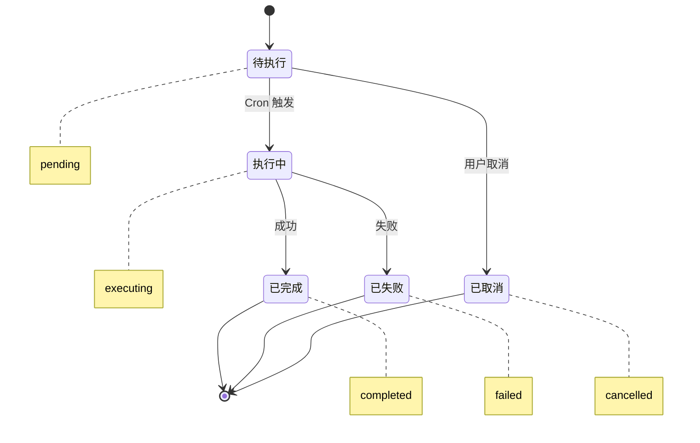
```mermaid
stateDiagram-v2
[*] --> 待执行
待执行 --> 执行中 : Cron 触发
执行中 --> 已完成 : 成功
执行中 --> 已失败 : 失败
待执行 --> 已取消 : 用户取消
已完成 --> [*]
已失败 --> [*]
已取消 --> [*]
note right of 待执行 : pending
note right of 执行中 : executing
note right of 已完成 : completed
note right of 已失败 : failed
note right of 已取消 : cancelled
```

**图表来源**
- [src/services/scheduler-service.ts:11-18](file://src/services/scheduler-service.ts#L11-L18)

**章节来源**
- [src/services/scheduler-service.ts:1-202](file://src/services/scheduler-service.ts#L1-L202)

### Web 服务器架构

Web 服务器采用 Express.js 构建，提供了 RESTful API 接口：

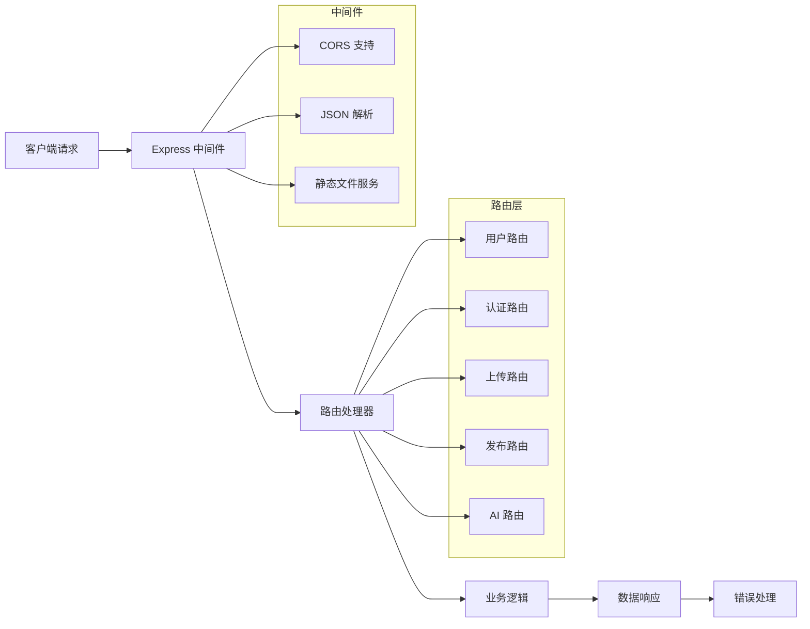
```mermaid
graph LR
A[客户端请求] --> B[Express 中间件]
B --> C[路由处理器]
C --> D[业务逻辑]
D --> E[数据响应]
E --> F[错误处理]
subgraph "中间件"
G[CORS 支持]
H[JSON 解析]
I[静态文件服务]
end
subgraph "路由层"
J[用户路由]
K[认证路由]
L[上传路由]
M[发布路由]
N[AI 路由]
end
B --> G
B --> H
B --> I
C --> J
C --> K
C --> L
C --> M
C --> N
```

**图表来源**
- [web/server/src/index.ts:20-51](file://web/server/src/index.ts#L20-L51)
- [web/server/src/routes/publish.ts:1-349](file://web/server/src/routes/publish.ts#L1-L349)

**章节来源**
- [web/server/src/index.ts:1-72](file://web/server/src/index.ts#L1-L72)
- [web/server/src/routes/publish.ts:1-349](file://web/server/src/routes/publish.ts#L1-L349)

### MCP 服务器集成

MCP (Model Context Protocol) 服务器提供了与 AI 模型的集成能力：

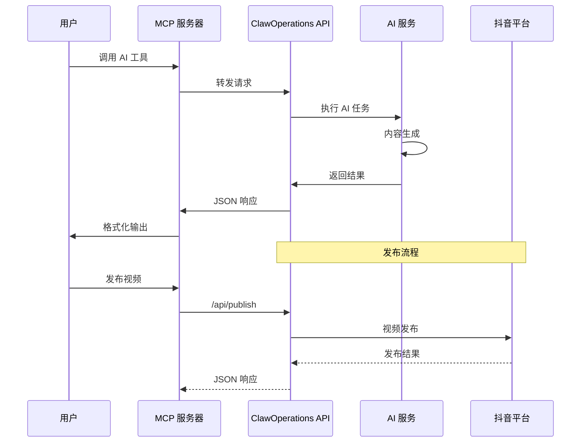
```mermaid
sequenceDiagram
participant User as 用户
participant MCP as MCP 服务器
participant API as ClawOperations API
participant AI as AI 服务
participant Douyin as 抖音平台
User->>MCP : 调用 AI 工具
MCP->>API : 转发请求
API->>AI : 执行 AI 任务
AI->>AI : 内容生成
AI->>API : 返回结果
API->>MCP : JSON 响应
MCP->>User : 格式化输出
Note over API,Douyin : 发布流程
User->>MCP : 发布视频
MCP->>API : /api/publish
API->>Douyin : 视频发布
Douyin-->>API : 发布结果
API-->>MCP : JSON 响应
```

**图表来源**
- [mcp-server/src/index.ts:176-315](file://mcp-server/src/index.ts#L176-L315)

**章节来源**
- [mcp-server/src/index.ts:1-358](file://mcp-server/src/index.ts#L1-L358)

## 依赖关系分析

项目使用了现代化的 Node.js 生态系统，主要依赖包括：

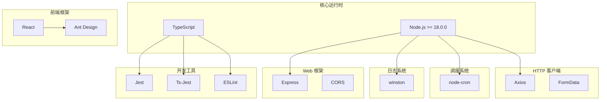
```mermaid
graph TB
subgraph "核心运行时"
A[Node.js >= 18.0.0]
B[TypeScript]
end
subgraph "HTTP 客户端"
C[Axios]
D[FormData]
end
subgraph "调度系统"
E[node-cron]
end
subgraph "日志系统"
F[winston]
end
subgraph "Web 框架"
G[Express]
H[CORS]
end
subgraph "前端框架"
I[React]
J[Ant Design]
end
subgraph "开发工具"
K[Jest]
L[Ts-Jest]
M[ESLint]
end
A --> C
A --> E
A --> F
A --> G
I --> J
B --> K
B --> L
B --> M
```

**图表来源**
- [package.json:18-38](file://package.json#L18-L38)

### 外部服务集成

项目集成了多个外部服务和 API：

| 服务名称 | 用途 | 配置项 |
|---------|------|--------|
| 抖音开放平台 | 视频上传和发布 | BASE_URL, ACCESS_TOKEN |
| DeepSeek AI | 文本生成和分析 | BASE_URL, MODEL |
| 豆包 AI | 图片和视频生成 | BASE_URL, ENDPOINT_ID |
| 本地文件系统 | 临时文件存储 | TEMP_DIR |

**章节来源**
- [config/default.ts:5-70](file://config/default.ts#L5-L70)
- [package.json:18-38](file://package.json#L18-L38)

## 性能考虑

### 并发处理

项目在多个层面实现了并发优化：

1. **异步操作**：所有网络请求都使用 Promise 和 async/await
2. **流式上传**：支持大文件的分片上传
3. **批量处理**：定时任务支持批量执行

### 缓存策略

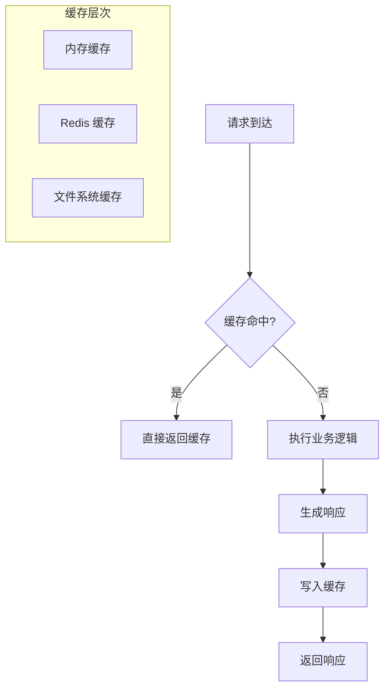
```mermaid
flowchart TD
A[请求到达] --> B{缓存命中?}
B --> |是| C[直接返回缓存]
B --> |否| D[执行业务逻辑]
D --> E[生成响应]
E --> F[写入缓存]
F --> G[返回响应]
subgraph "缓存层次"
H[内存缓存]
I[Redis 缓存]
J[文件系统缓存]
end
```

### 错误重试机制

项目实现了智能的错误重试策略：

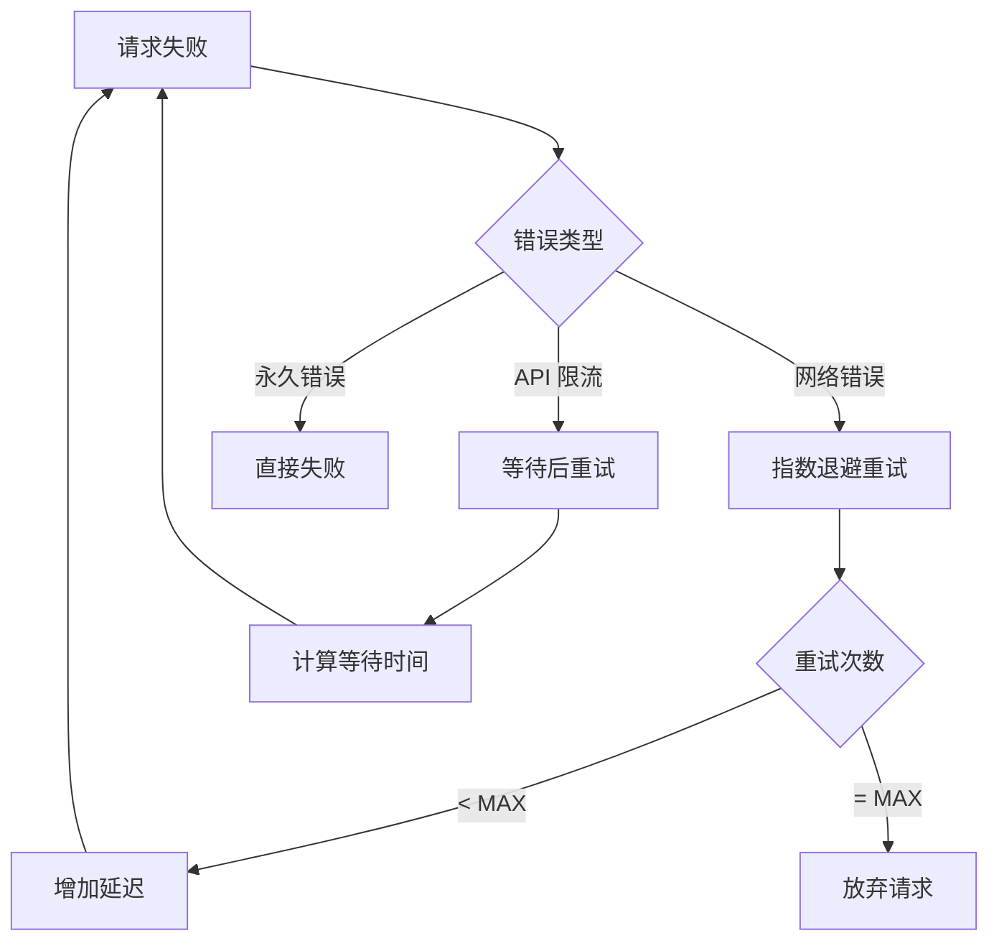
```mermaid
flowchart TD
A[请求失败] --> B{错误类型}
B --> |网络错误| C[指数退避重试]
B --> |API 限流| D[等待后重试]
B --> |永久错误| E[直接失败]
C --> F{重试次数}
F --> |< MAX| G[增加延迟]
F --> |= MAX| H[放弃请求]
G --> A
D --> I[计算等待时间]
I --> A
```

## 故障排除指南

### 常见问题诊断

#### 认证问题

| 问题症状 | 可能原因 | 解决方案 |
|---------|---------|----------|
| 401 未授权 | Access Token 过期 | 调用 refreshToken() |
| 403 禁止访问 | 权限不足 | 检查 OAuth Scope |
| 授权失败 | 参数错误 | 验证 client_key 和 redirect_uri |

#### 发布问题

| 问题症状 | 可能原因 | 解决方案 |
|---------|---------|----------|
| 上传失败 | 网络中断 | 检查网络连接 |
| 格式不支持 | 文件类型错误 | 验证视频格式 |
| 大小超限 | 文件过大 | 分片上传或压缩 |

#### 调度问题

| 问题症状 | 可能原因 | 解决方案 |
|---------|---------|----------|
| 任务未执行 | 时间设置错误 | 检查发布时间 |
| 重复执行 | Cron 表达式冲突 | 验证 Cron 规则 |
| 任务丢失 | 服务器重启 | 恢复任务状态 |

**章节来源**
- [src/api/auth.ts:97-126](file://src/api/auth.ts#L97-L126)
- [src/services/publish-service.ts:157-172](file://src/services/publish-service.ts#L157-L172)
- [src/services/scheduler-service.ts:40-43](file://src/services/scheduler-service.ts#L40-L43)

### 日志分析

项目使用 winston 提供了详细的日志记录：

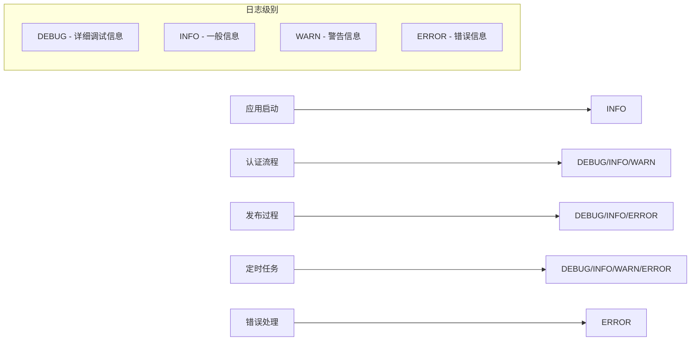
```mermaid
graph LR
A[应用启动] --> B[INFO]
C[认证流程] --> D[DEBUG/INFO/WARN]
E[发布过程] --> F[DEBUG/INFO/ERROR]
G[定时任务] --> H[DEBUG/INFO/WARN/ERROR]
I[错误处理] --> J[ERROR]
subgraph "日志级别"
K[DEBUG - 详细调试信息]
L[INFO - 一般信息]
M[WARN - 警告信息]
N[ERROR - 错误信息]
end
```

**章节来源**
- [src/utils/logger.ts:1-61](file://src/utils/logger.ts#L1-L61)

## 结论

ClawOperations 是一个功能完整、架构清晰的抖音自动化运营系统。其主要优势包括：

### 技术优势

1. **模块化设计**：清晰的分层架构便于维护和扩展
2. **类型安全**：完整的 TypeScript 类型定义
3. **错误处理**：完善的异常处理和重试机制
4. **性能优化**：并发处理和缓存策略

### 功能特性

1. **AI 驱动**：智能内容生成和文案创作
2. **多平台支持**：Web 界面和 MCP 服务器
3. **灵活调度**：基于 cron 的定时发布
4. **监控告警**：详细的日志和错误报告

### 扩展建议

1. **数据库集成**：持久化存储任务状态和配置
2. **监控系统**：添加健康检查和性能监控
3. **测试覆盖**：增加单元测试和集成测试
4. **文档完善**：补充详细的 API 文档

该项目为抖音营销提供了一个强大而灵活的技术基础，可以根据具体需求进行定制和扩展。