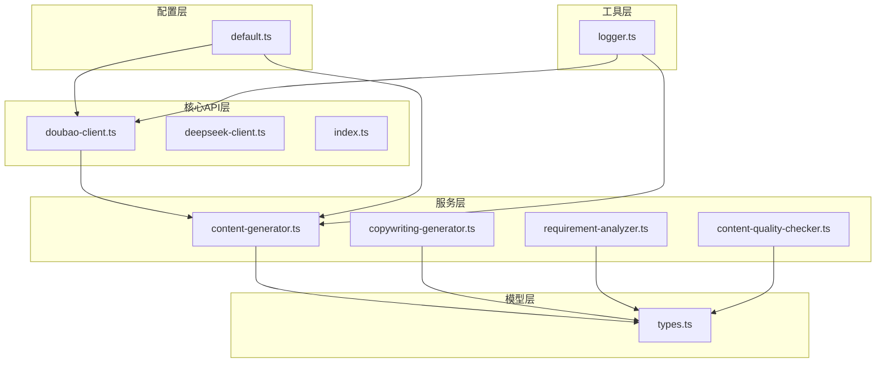
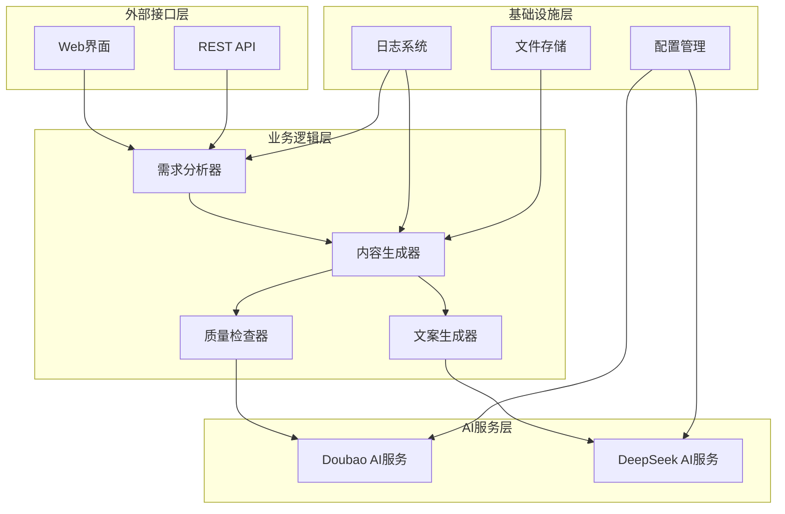
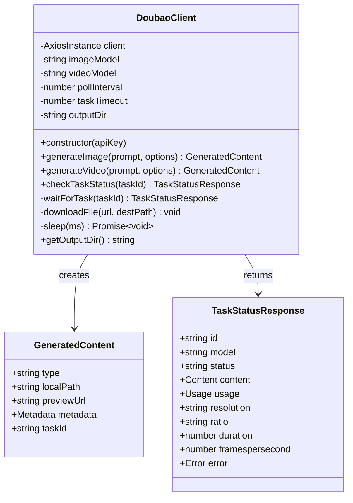
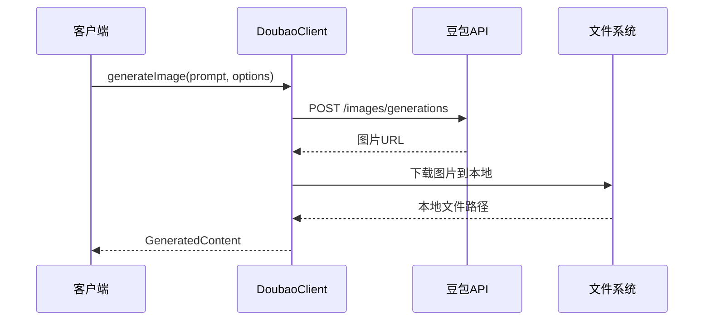
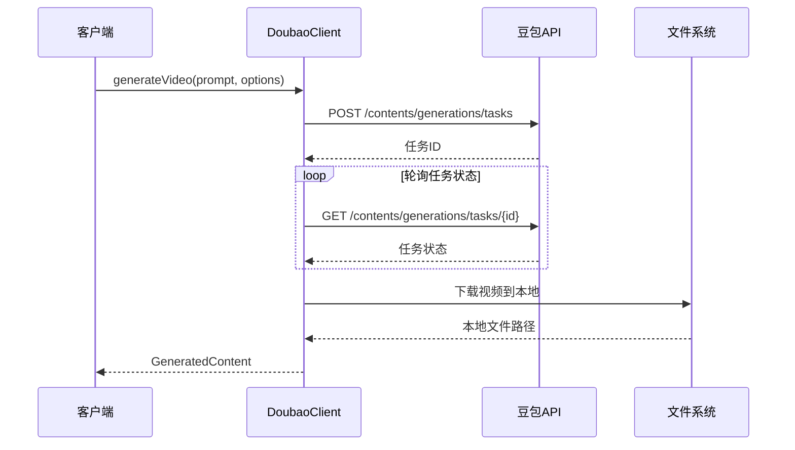
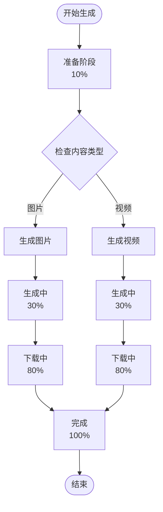
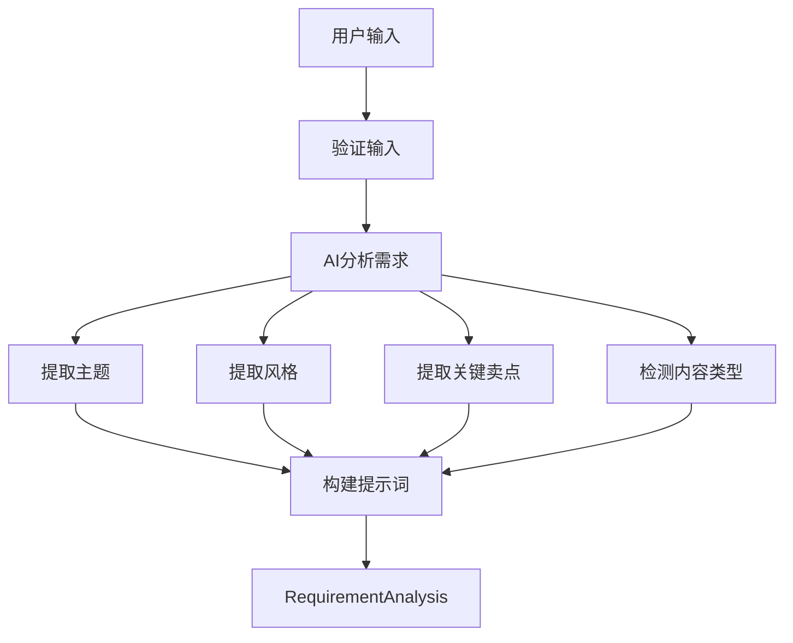
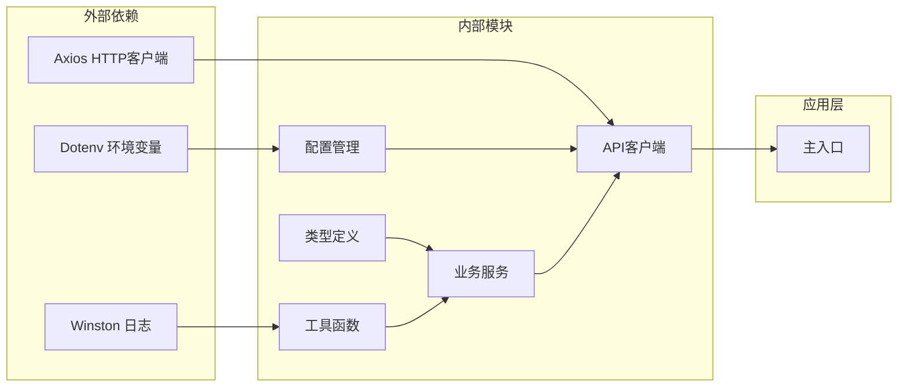

# Doubao Client API 文档

<cite>
**本文档引用的文件**
- [doubao-client.ts](file://src/api/ai/doubao-client.ts)
- [index.ts](file://src/api/ai/index.ts)
- [content-generator.ts](file://src/services/ai/content-generator.ts)
- [copywriting-generator.ts](file://src/services/ai/copywriting-generator.ts)
- [requirement-analyzer.ts](file://src/services/ai/requirement-analyzer.ts)
- [content-quality-checker.ts](file://src/services/ai/content-quality-checker.ts)
- [types.ts](file://src/models/types.ts)
- [default.ts](file://config/default.ts)
- [logger.ts](file://src/utils/logger.ts)
- [index.ts](file://src/index.ts)
- [package.json](file://package.json)
</cite>

## 目录
1. [简介](#简介)
2. [项目结构](#项目结构)
3. [核心组件](#核心组件)
4. [架构概览](#架构概览)
5. [详细组件分析](#详细组件分析)
6. [依赖关系分析](#依赖关系分析)
7. [性能考虑](#性能考虑)
8. [故障排除指南](#故障排除指南)
9. [结论](#结论)

## 简介

Doubao Client API 是一个基于火山引擎豆包AI服务的客户端库，专门用于图片和视频内容的AI生成。该系统提供了完整的AI内容生成解决方案，包括需求分析、内容生成、文案创作和质量校验等功能模块。

该项目采用现代化的TypeScript架构，集成了多种AI服务提供商，为抖音等社交媒体平台的内容营销提供自动化解决方案。系统支持图片生成、视频生成、文案创作、内容质量检查等核心功能，并提供了完善的错误处理和日志记录机制。

## 项目结构

项目采用模块化的文件组织方式，主要分为以下几个核心目录：

**图表来源**
- [doubao-client.ts:1-362](file://src/api/ai/doubao-client.ts#L1-L362)
- [content-generator.ts:1-227](file://src/services/ai/content-generator.ts#L1-L227)
- [types.ts:1-683](file://src/models/types.ts#L1-L683)

**章节来源**
- [doubao-client.ts:1-362](file://src/api/ai/doubao-client.ts#L1-L362)
- [content-generator.ts:1-227](file://src/services/ai/content-generator.ts#L1-L227)
- [types.ts:1-683](file://src/models/types.ts#L1-L683)

## 核心组件

### DoubaoClient 类

DoubaoClient 是系统的核心客户端类，负责与火山引擎豆包AI服务进行交互。该类提供了完整的图片和视频生成能力。

**主要特性：**
- 支持图片生成（支持多种尺寸和数量）
- 支持视频生成（支持时长、分辨率自定义）
- 任务状态轮询机制
- 自动文件下载和存储
- 完善的错误处理和日志记录

### ContentGenerator 服务

ContentGenerator 作为内容生成的协调器，整合了 DoubaoClient 的功能，并提供了高级的生成流程控制。

**核心功能：**
- 自动化的内容生成流程
- 进度回调机制
- 默认提示词构建
- 生成内容的统一管理

### RequirementAnalyzer 分析器

RequirementAnalyzer 负责分析用户输入的需求，将其转换为AI生成所需的结构化数据。

**分析维度：**
- 内容类型判断（图片/视频）
- 主题提取
- 风格定义
- 关键卖点识别
- 提示词优化

**章节来源**
- [doubao-client.ts:85-362](file://src/api/ai/doubao-client.ts#L85-L362)
- [content-generator.ts:38-227](file://src/services/ai/content-generator.ts#L38-L227)
- [requirement-analyzer.ts:25-128](file://src/services/ai/requirement-analyzer.ts#L25-L128)

## 架构概览

系统采用分层架构设计，确保各组件职责清晰、耦合度低：

**图表来源**
- [content-generator.ts:38-227](file://src/services/ai/content-generator.ts#L38-L227)
- [requirement-analyzer.ts:25-128](file://src/services/ai/requirement-analyzer.ts#L25-L128)
- [copywriting-generator.ts:30-194](file://src/services/ai/copywriting-generator.ts#L30-L194)

## 详细组件分析

### DoubaoClient 类详细分析

DoubaoClient 类实现了完整的AI内容生成客户端功能：

**图表来源**
- [doubao-client.ts:85-362](file://src/api/ai/doubao-client.ts#L85-L362)
- [types.ts:231-247](file://src/models/types.ts#L231-L247)

#### 图片生成流程

**图表来源**
- [doubao-client.ts:131-184](file://src/api/ai/doubao-client.ts#L131-L184)

#### 视频生成流程

**图表来源**
- [doubao-client.ts:192-257](file://src/api/ai/doubao-client.ts#L192-L257)

**章节来源**
- [doubao-client.ts:85-362](file://src/api/ai/doubao-client.ts#L85-L362)

### ContentGenerator 服务分析

ContentGenerator 作为内容生成的协调器，提供了完整的生成流程控制：

**图表来源**
- [content-generator.ts:62-102](file://src/services/ai/content-generator.ts#L62-L102)

**章节来源**
- [content-generator.ts:38-227](file://src/services/ai/content-generator.ts#L38-L227)

### 需求分析器工作流程

RequirementAnalyzer 提供了智能的需求分析功能：

**图表来源**
- [requirement-analyzer.ts:41-72](file://src/services/ai/requirement-analyzer.ts#L41-L72)

**章节来源**
- [requirement-analyzer.ts:25-128](file://src/services/ai/requirement-analyzer.ts#L25-L128)

## 依赖关系分析

系统采用了清晰的依赖层次结构：

**图表来源**
- [package.json:18-34](file://package.json#L18-L34)
- [logger.ts:1-61](file://src/utils/logger.ts#L1-L61)

**章节来源**
- [package.json:1-39](file://package.json#L1-L39)
- [logger.ts:1-61](file://src/utils/logger.ts#L1-L61)

## 性能考虑

### 异步处理和并发控制

系统采用异步编程模式，确保在处理大量AI生成请求时的性能表现：

- **超时控制**：HTTP请求设置2分钟超时，防止长时间阻塞
- **轮询间隔**：视频任务轮询间隔可配置，默认3秒
- **任务超时**：视频生成任务超时时间5分钟
- **文件下载**：支持HTTP和HTTPS协议的文件下载

### 缓存和存储策略

- **输出目录**：自动创建 `generated` 目录存储生成的文件
- **文件命名**：使用时间戳确保文件唯一性
- **元数据收集**：自动收集文件大小、分辨率等元数据

### 错误处理和重试机制

系统实现了多层次的错误处理：

- **API错误捕获**：捕获网络错误、API错误等
- **任务状态监控**：实时监控AI生成任务状态
- **日志记录**：完整的操作日志和错误日志
- **资源清理**：自动清理失败的临时文件

## 故障排除指南

### 常见问题和解决方案

#### API密钥配置问题

**问题症状：**
- 初始化时抛出API Key未配置错误
- 请求返回401未授权

**解决方法：**
1. 设置环境变量 `DOUBAO_API_KEY`
2. 确认API密钥的有效性和权限范围
3. 检查网络连接和防火墙设置

#### 任务超时问题

**问题症状：**
- 视频生成任务超时
- 任务状态长时间为排队或运行中

**解决方法：**
1. 检查任务超时配置（默认5分钟）
2. 确认视频生成参数合理（时长、分辨率）
3. 监控API服务状态

#### 文件下载失败

**问题症状：**
- 图片或视频下载失败
- 返回下载状态码错误

**解决方法：**
1. 检查网络连接稳定性
2. 验证文件URL的有效性
3. 确认磁盘空间充足

**章节来源**
- [doubao-client.ts:93-123](file://src/api/ai/doubao-client.ts#L93-L123)
- [doubao-client.ts:281-305](file://src/api/ai/doubao-client.ts#L281-L305)

## 结论

Doubao Client API 提供了一个完整、健壮的AI内容生成解决方案。通过模块化的架构设计和完善的错误处理机制，该系统能够满足各种内容营销场景的需求。

**主要优势：**
- **模块化设计**：清晰的职责分离和依赖关系
- **完整的生命周期**：从需求分析到内容发布的全流程支持
- **强大的扩展性**：易于添加新的AI服务提供商
- **完善的监控**：详细的日志记录和状态跟踪
- **高性能**：异步处理和合理的资源管理

**应用场景：**
- 社交媒体内容自动化生成
- 电商产品视频制作
- 教育课程内容生产
- 品牌营销素材创建

该系统为开发者提供了一个可靠的AI内容生成基础框架，可以根据具体需求进行定制和扩展。