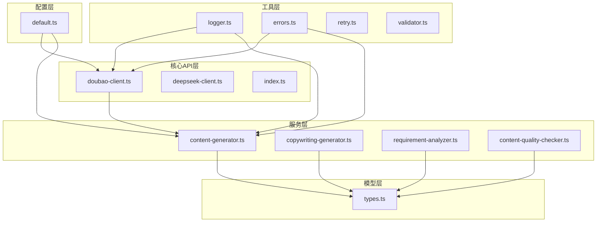
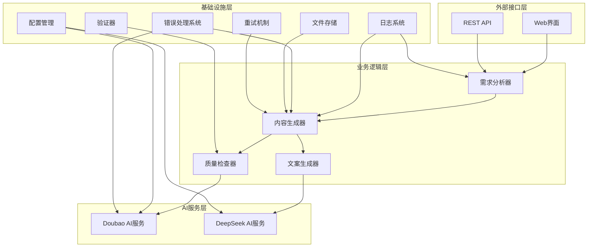
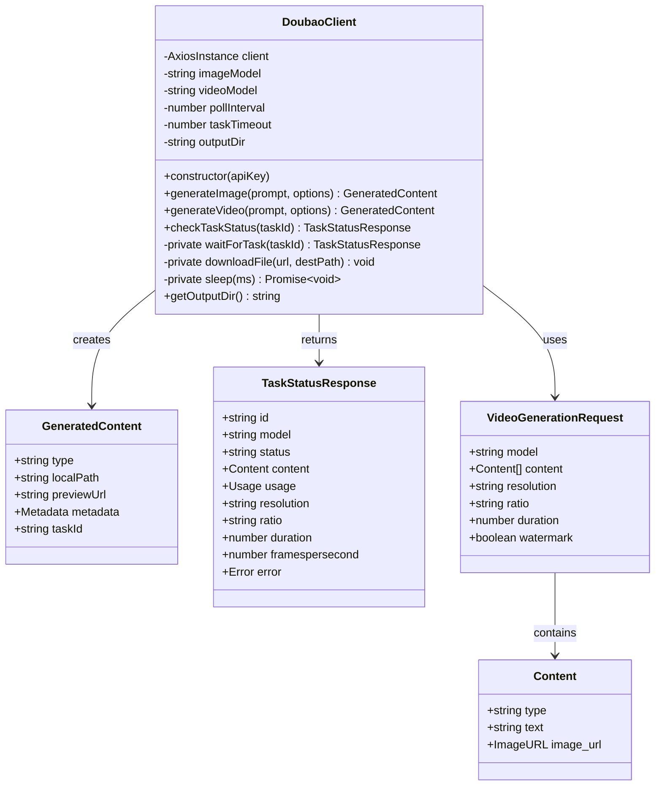
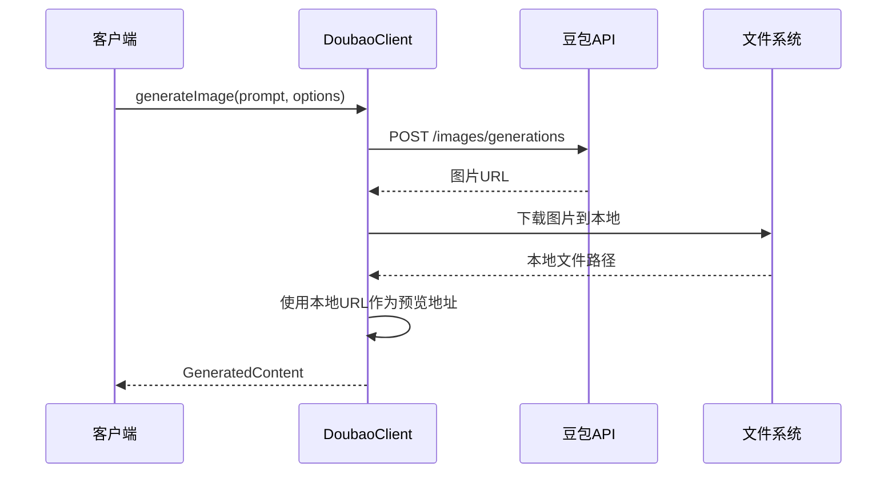
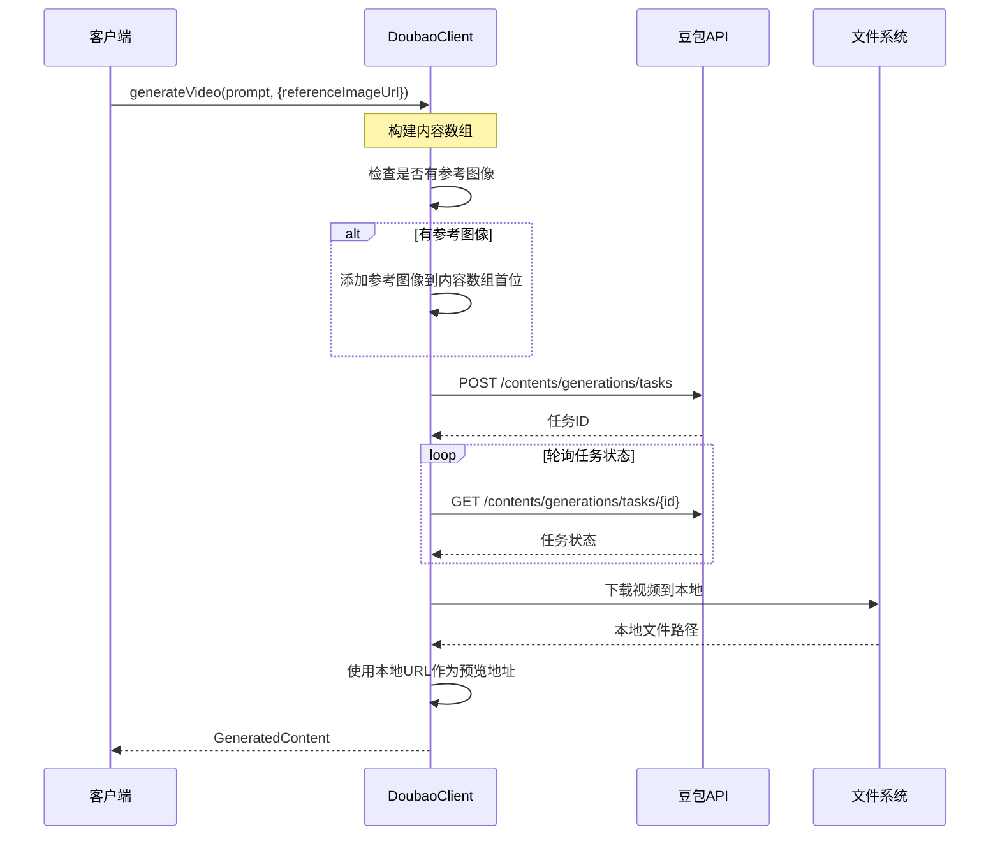
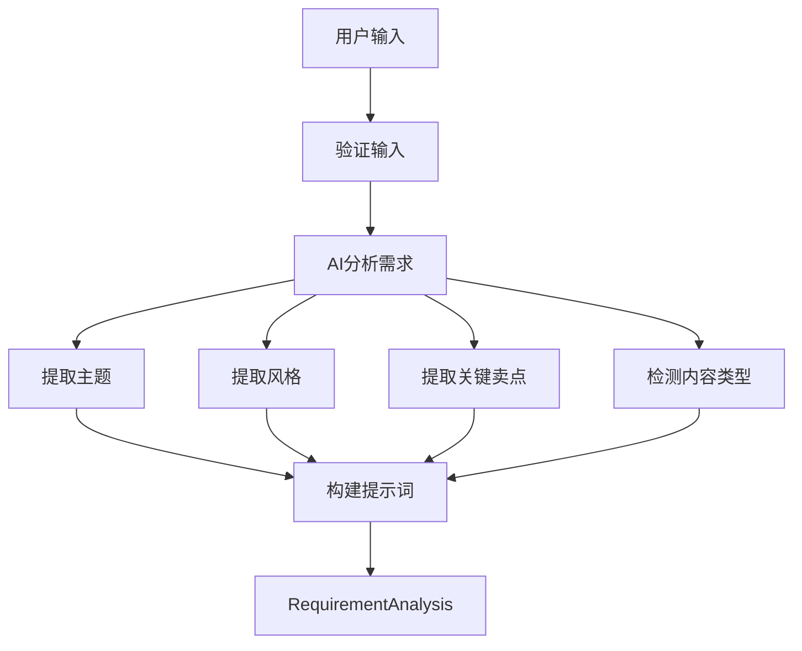
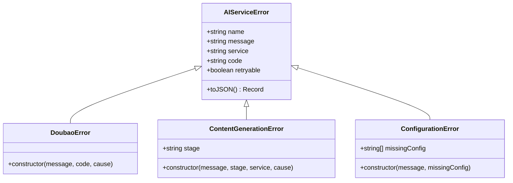
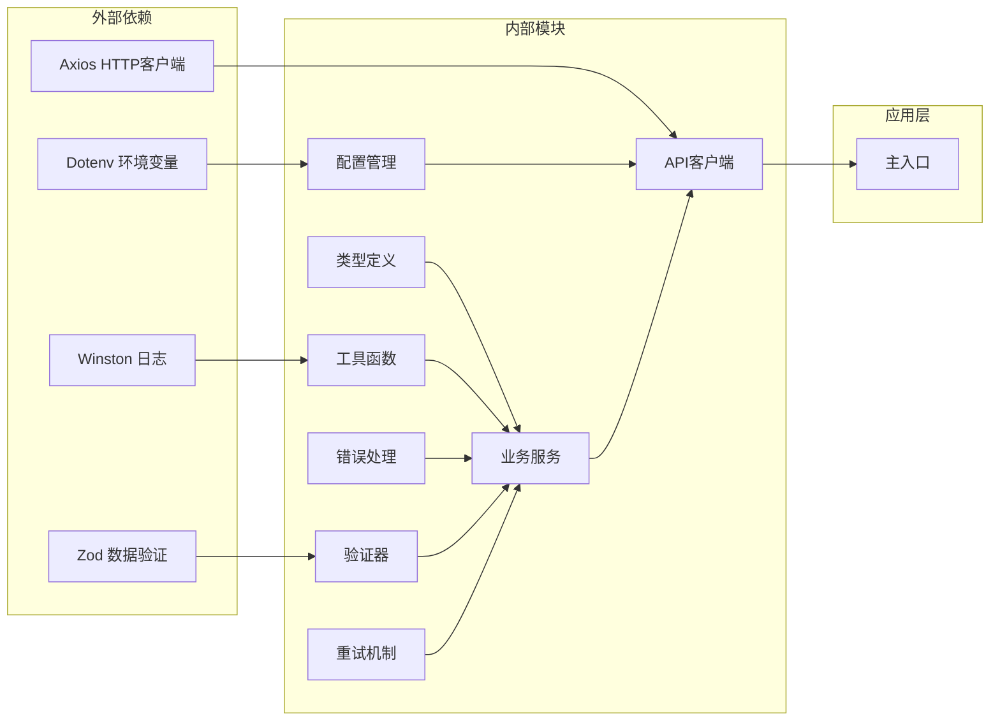

# Doubao Client API 文档

<cite>
**本文档引用的文件**
- [doubao-client.ts](file://src/api/ai/doubao-client.ts)
- [content-generator.ts](file://src/services/ai/content-generator.ts)
- [types.ts](file://src/models/types.ts)
- [default.ts](file://config/default.ts)
- [errors.ts](file://src/utils/errors.ts)
- [logger.ts](file://src/utils/logger.ts)
- [requirement-analyzer.ts](file://src/services/ai/requirement-analyzer.ts)
</cite>

## 更新摘要
**变更内容**
- Doubao客户端增强支持参考图像的视频生成
- generateVideo方法现在接受包含referenceImageUrl的选项参数
- 内容数组构造中优先包含参考图像
- ContentGenerator服务支持参考图像参数传递
- 类型定义中新增referenceImageUrl字段
- **新增**：增强错误处理和状态码解析
- **新增**：改进图片和视频生成的预览URL处理
- **新增**：增加防御性配置检查和用户友好的错误消息
- **新增**：引入专用的AI服务错误类型和错误分类系统

## 目录
1. [简介](#简介)
2. [项目结构](#项目结构)
3. [核心组件](#核心组件)
4. [架构概览](#架构概览)
5. [详细组件分析](#详细组件分析)
6. [依赖关系分析](#依赖关系分析)
7. [性能考虑](#性能考虑)
8. [故障排除指南](#故障排除指南)
9. [结论](#结论)

## 简介

Doubao Client API 是一个基于火山引擎豆包AI服务的客户端库，专门用于图片和视频内容的AI生成。该系统提供了完整的AI内容生成解决方案，包括需求分析、内容生成、文案创作和质量校验等功能模块。

**最新增强功能**：
- **参考图像支持**：视频生成现在支持参考图像，用户可以通过提供参考图像URL来指导AI生成符合特定视觉风格的视频内容
- **智能内容优先级**：当提供参考图像时，系统会将参考图像优先添加到内容数组中，确保生成的视频更贴近用户的视觉要求
- **完整的参数传递链路**：从需求分析到内容生成的整个流程都支持参考图像参数的传递
- **增强错误处理**：引入专用的AI服务错误类型，提供更精确的状态码解析和用户友好的错误消息
- **改进预览URL处理**：使用本地URL作为预览地址，避免豆包URL过期问题
- **防御性配置检查**：增加AI_CONFIG配置的防御性检查，确保配置完整性

该项目采用现代化的TypeScript架构，集成了多种AI服务提供商，为抖音等社交媒体平台的内容营销提供自动化解决方案。系统支持图片生成、视频生成、文案创作、内容质量检查等核心功能，并提供了完善的错误处理和日志记录机制。

## 项目结构

项目采用模块化的文件组织方式，主要分为以下几个核心目录：



**图表来源**
- [doubao-client.ts:1-406](file://src/api/ai/doubao-client.ts#L1-L406)
- [content-generator.ts:1-253](file://src/services/ai/content-generator.ts#L1-L253)
- [types.ts:1-687](file://src/models/types.ts#L1-L687)

**章节来源**
- [doubao-client.ts:1-406](file://src/api/ai/doubao-client.ts#L1-L406)
- [content-generator.ts:1-253](file://src/services/ai/content-generator.ts#L1-L253)
- [types.ts:1-687](file://src/models/types.ts#L1-L687)

## 核心组件

### DoubaoClient 类

DoubaoClient 是系统的核心客户端类，负责与火山引擎豆包AI服务进行交互。该类提供了完整的图片和视频生成能力。

**主要特性：**
- 支持图片生成（支持多种尺寸和数量）
- **增强的视频生成**：现在支持参考图像的视频生成
- 任务状态轮询机制
- 自动文件下载和存储
- **增强的错误处理**：提供精确的状态码解析和用户友好的错误消息
- **改进的预览URL处理**：使用本地URL避免豆包URL过期

**新增功能**：
- `referenceImageUrl` 参数支持：允许用户指定参考图像URL
- 智能内容优先级：参考图像总是优先于文本提示词添加到内容数组中
- 更灵活的视频生成配置
- **防御性配置检查**：确保AI_CONFIG配置的完整性
- **增强的错误分类**：针对不同HTTP状态码提供具体的错误信息

### ContentGenerator 服务

ContentGenerator 作为内容生成的协调器，整合了 DoubaoClient 的功能，并提供了高级的生成流程控制。

**核心功能：**
- 自动化的内容生成流程
- 进度回调机制
- 默认提示词构建
- 生成内容的统一管理
- **参考图像参数传递**：支持将参考图像URL传递给底层生成方法

**更新**：
- `GenerateOptions` 接口现在包含 `referenceImageUrl` 字段
- `generateVideo` 方法支持参考图像参数
- 进度回调中包含参考图像使用的提示信息
- **增强的错误处理**：集成AI服务错误类型系统

### RequirementAnalyzer 分析器

RequirementAnalyzer 负责分析用户输入的需求，将其转换为AI生成所需的结构化数据。

**分析维度：**
- 内容类型判断（图片/视频）
- 主题提取
- 风格定义
- 关键卖点识别
- 提示词优化

**章节来源**
- [doubao-client.ts:94-406](file://src/api/ai/doubao-client.ts#L94-L406)
- [content-generator.ts:48-253](file://src/services/ai/content-generator.ts#L48-L253)
- [requirement-analyzer.ts:25-128](file://src/services/ai/requirement-analyzer.ts#L25-L128)

## 架构概览

系统采用分层架构设计，确保各组件职责清晰、耦合度低：



**图表来源**
- [content-generator.ts:48-253](file://src/services/ai/content-generator.ts#L48-L253)
- [requirement-analyzer.ts:25-128](file://src/services/ai/requirement-analyzer.ts#L25-L128)
- [copywriting-generator.ts:30-194](file://src/services/ai/copywriting-generator.ts#L30-L194)

## 详细组件分析

### DoubaoClient 类详细分析

DoubaoClient 类实现了完整的AI内容生成客户端功能，现已增强支持参考图像的视频生成：



**图表来源**
- [doubao-client.ts:94-406](file://src/api/ai/doubao-client.ts#L94-L406)
- [types.ts:231-247](file://src/models/types.ts#L231-L247)

#### 图片生成流程



**图表来源**
- [doubao-client.ts:140-202](file://src/api/ai/doubao-client.ts#L140-L202)

#### 增强的视频生成流程（支持参考图像）



**图表来源**
- [doubao-client.ts:210-301](file://src/api/ai/doubao-client.ts#L210-L301)

**章节来源**
- [doubao-client.ts:94-406](file://src/api/ai/doubao-client.ts#L94-L406)

### ContentGenerator 服务分析

ContentGenerator 作为内容生成的协调器，提供了完整的生成流程控制，现已支持参考图像参数：

```mermaid
flowchart TD
Start([开始生成]) --> Prepare[准备阶段<br/>10%]
Prepare --> CheckType{检查内容类型}
CheckType --> |图片| GenImage[生成图片]
CheckType --> |视频| GenVideo[生成视频]
GenImage --> Progress1[生成中<br/>30%]
GenVideo --> CheckRef{检查参考图像}
CheckRef --> |有参考图像| GenVideoWithRef[生成视频(含参考图像)]
CheckRef --> |无参考图像| GenVideoNoRef[生成视频(普通)]
GenVideoWithRef --> Progress2[生成中<br/>30%]
GenVideoNoRef --> Progress2
Progress1 --> Download1[下载中<br/>80%]
Progress2 --> Download2[下载中<br/>80%]
Download1 --> Complete[完成<br/>100%]
Download2 --> Complete
Complete --> End([结束])
```

**图表来源**
- [content-generator.ts:72-120](file://src/services/ai/content-generator.ts#L72-L120)

**更新**：
- `GenerateOptions` 接口新增 `referenceImageUrl` 字段
- `generateVideo` 方法支持传递参考图像参数
- 进度回调中包含参考图像使用的提示信息

**章节来源**
- [content-generator.ts:48-253](file://src/services/ai/content-generator.ts#L48-L253)

### 需求分析器工作流程

RequirementAnalyzer 提供了智能的需求分析功能：



**图表来源**
- [requirement-analyzer.ts:41-72](file://src/services/ai/requirement-analyzer.ts#L41-L72)

**章节来源**
- [requirement-analyzer.ts:25-128](file://src/services/ai/requirement-analyzer.ts#L25-L128)

### 错误处理系统

系统引入了完整的AI服务错误处理体系：



**图表来源**
- [errors.ts:8-133](file://src/utils/errors.ts#L8-L133)

**章节来源**
- [errors.ts:1-212](file://src/utils/errors.ts#L1-L212)

## 依赖关系分析

系统采用了清晰的依赖层次结构：



**图表来源**
- [package.json:18-34](file://package.json#L18-L34)
- [logger.ts:1-61](file://src/utils/logger.ts#L1-L61)

**章节来源**
- [package.json:1-39](file://package.json#L1-L39)
- [logger.ts:1-61](file://src/utils/logger.ts#L1-L61)

## 性能考虑

### 异步处理和并发控制

系统采用异步编程模式，确保在处理大量AI生成请求时的性能表现：

- **超时控制**：HTTP请求设置2分钟超时，防止长时间阻塞
- **轮询间隔**：视频任务轮询间隔可配置，默认3秒
- **任务超时**：视频生成任务超时时间5分钟
- **文件下载**：支持HTTP和HTTPS协议的文件下载
- **防御性配置**：自动检查AI配置的完整性，避免运行时错误

### 缓存和存储策略

- **输出目录**：自动创建 `generated` 目录存储生成的文件
- **文件命名**：使用时间戳确保文件唯一性
- **元数据收集**：自动收集文件大小、分辨率等元数据
- **预览URL优化**：使用本地URL避免外部URL过期问题

### 错误处理和重试机制

系统实现了多层次的错误处理：

- **API错误捕获**：捕获网络错误、API错误等
- **任务状态监控**：实时监控AI生成任务状态
- **日志记录**：完整的操作日志和错误日志
- **资源清理**：自动清理失败的临时文件
- **错误分类**：区分可重试和不可重试错误
- **状态码解析**：针对不同HTTP状态码提供具体错误信息

**新增性能考虑**：
- **参考图像缓存**：对于重复使用的参考图像，可以考虑本地缓存以减少网络请求
- **内容数组优化**：参考图像优先添加减少了不必要的API调用
- **防御性配置检查**：在初始化时验证配置完整性，避免运行时配置错误

## 故障排除指南

### 常见问题和解决方案

#### API密钥配置问题

**问题症状：**
- 初始化时抛出API Key未配置错误
- 请求返回401未授权

**解决方法：**
1. 设置环境变量 `DOUBAO_API_KEY`
2. 确认API密钥的有效性和权限范围
3. 检查网络连接和防火墙设置
4. **新增**：检查AI_CONFIG配置是否正确加载

#### 任务超时问题

**问题症状：**
- 视频生成任务超时
- 任务状态长时间为排队或运行中

**解决方法：**
1. 检查任务超时配置（默认5分钟）
2. 确认视频生成参数合理（时长、分辨率）
3. 监控API服务状态
4. **新增**：查看任务状态日志中的详细错误信息

#### 文件下载失败

**问题症状：**
- 图片或视频下载失败
- 返回下载状态码错误

**解决方法：**
1. 检查网络连接稳定性
2. 验证文件URL的有效性
3. 确认磁盘空间充足
4. **新增**：检查预览URL是否正确生成

#### 参考图像相关问题

**问题症状：**
- 参考图像无法加载
- 视频生成结果不符合预期

**解决方法：**
1. 验证参考图像URL的有效性和可访问性
2. 确认参考图像格式支持（推荐JPG、PNG）
3. 检查参考图像尺寸是否合适
4. 确认网络连接正常
5. **新增**：检查参考图像是否在生成内容数组的首位

#### 错误处理和状态码问题

**问题症状：**
- 生成失败但错误信息不够明确
- 不同状态码的错误处理不一致

**解决方法：**
1. 查看详细的错误日志
2. 检查HTTP状态码和错误消息
3. 区分可重试和不可重试错误
4. **新增**：使用专用的AI服务错误类型获取更准确的错误信息

**章节来源**
- [doubao-client.ts:102-132](file://src/api/ai/doubao-client.ts#L102-L132)
- [doubao-client.ts:289-300](file://src/api/ai/doubao-client.ts#L289-L300)
- [errors.ts:63-68](file://src/utils/errors.ts#L63-L68)

## 结论

Doubao Client API 提供了一个完整、健壮的AI内容生成解决方案。通过模块化的架构设计和完善的错误处理机制，该系统能够满足各种内容营销场景的需求。

**主要优势：**
- **模块化设计**：清晰的职责分离和依赖关系
- **完整的生命周期**：从需求分析到内容发布的全流程支持
- **强大的扩展性**：易于添加新的AI服务提供商
- **完善的监控**：详细的日志记录和状态跟踪
- **高性能**：异步处理和合理的资源管理
- **智能参考图像支持**：显著提升视频生成的质量和一致性
- **增强的错误处理**：提供精确的状态码解析和用户友好的错误消息
- **防御性配置检查**：确保配置完整性，减少运行时错误

**新增功能优势**：**
- **参考图像驱动的生成**：用户可以通过提供参考图像来精确控制生成内容的视觉风格
- **智能内容优先级**：系统自动将参考图像优先添加到内容数组中，确保生成效果符合用户期望
- **无缝集成**：参考图像支持完全集成到现有工作流程中，无需修改现有代码
- **改进的用户体验**：使用本地URL作为预览地址，避免外部URL过期问题
- **专业的错误处理**：引入专用的AI服务错误类型，提供更准确的错误分类和处理

**应用场景：**
- 社交媒体内容自动化生成
- 电商产品视频制作
- 教育课程内容生产
- 品牌营销素材创建
- **个性化内容生成**：基于用户提供的参考图像生成定制化内容
- **风格迁移**：将特定视觉风格应用到新内容中
- **企业内容营销**：提供更高质量和一致性的营销素材

该系统为开发者提供了一个可靠的AI内容生成基础框架，可以根据具体需求进行定制和扩展。新增的参考图像支持功能和增强的错误处理机制进一步提升了系统的实用性和可靠性，使其能够更好地满足现代内容营销的需求。