# Doubao AI客户端增强

<cite>
**本文档引用的文件**
- [package.json](file://package.json)
- [README.md](file://README.md)
- [src/index.ts](file://src/index.ts)
- [src/api/ai/doubao-client.ts](file://src/api/ai/doubao-client.ts)
- [src/services/ai/content-generator.ts](file://src/services/ai/content-generator.ts)
- [config/default.ts](file://config/default.ts)
- [src/models/types.ts](file://src/models/types.ts)
- [web/client/src/App.tsx](file://web/client/src/App.tsx)
- [web/client/src/pages/AICreator.tsx](file://web/client/src/pages/AICreator.tsx)
- [web/server/src/routes/ai.ts](file://web/server/src/routes/ai.ts)
- [src/services/ai-publish-service.ts](file://src/services/ai-publish-service.ts)
- [src/api/ai/deepseek-client.ts](file://src/api/ai/deepseek-client.ts)
- [web/client/src/hooks/useCreationWorkflow.ts](file://web/client/src/hooks/useCreationWorkflow.ts)
- [web/client/src/components/ai-creator/WorkflowSteps.tsx](file://web/client/src/components/ai-creator/WorkflowSteps.tsx)
</cite>

## 目录
1. [项目概述](#项目概述)
2. [项目结构](#项目结构)
3. [核心组件](#核心组件)
4. [架构概览](#架构概览)
5. [详细组件分析](#详细组件分析)
6. [依赖关系分析](#依赖关系分析)
7. [性能考虑](#性能考虑)
8. [故障排除指南](#故障排除指南)
9. [结论](#结论)

## 项目概述

Doubao AI客户端增强是一个基于Node.js的抖音营销账号自动化运营系统。该项目集成了火山引擎的豆包AI服务，提供了完整的AI内容创作、生成和发布解决方案。

### 主要特性

- **AI内容生成**：支持图片和视频的智能生成
- **需求分析**：基于DeepSeek AI的智能需求分析
- **文案生成**：自动生成抖音平台适配的推广文案
- **内容质量校验**：内置内容质量检查机制
- **草稿管理**：完整的创作流程草稿保存和恢复
- **模板系统**：支持内容模板的创建和复用
- **历史记录**：创作历史的持久化存储

## 项目结构

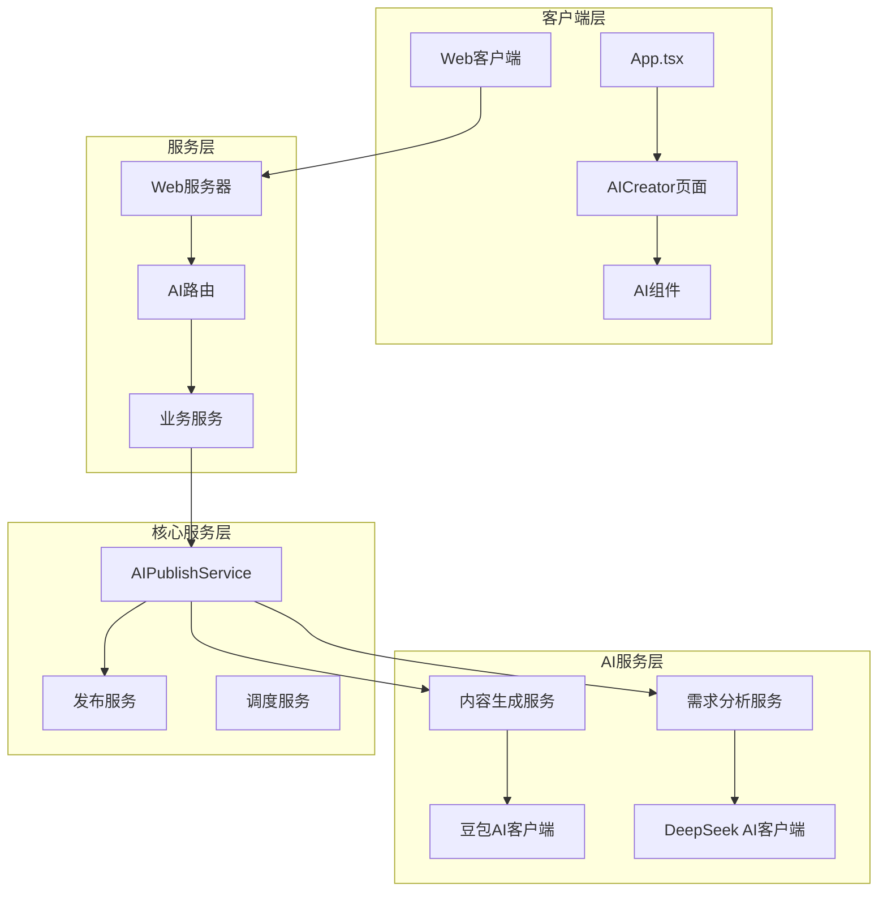

**图表来源**
- [src/index.ts:1-270](file://src/index.ts#L1-L270)
- [web/server/src/routes/ai.ts:1-800](file://web/server/src/routes/ai.ts#L1-L800)

**章节来源**
- [package.json:1-39](file://package.json#L1-L39)
- [README.md:1-152](file://README.md#L1-L152)

## 核心组件

### Doubao AI客户端

Doubao AI客户端是项目的核心AI服务组件，负责与火山引擎的豆包AI进行交互。

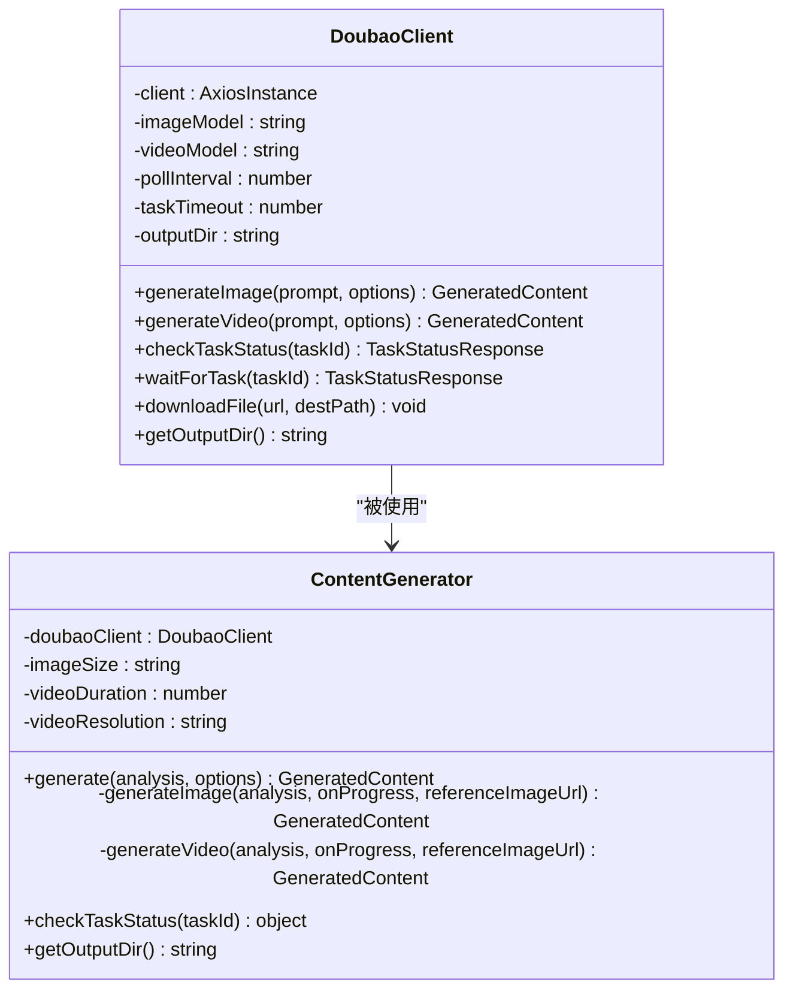

**图表来源**
- [src/api/ai/doubao-client.ts:94-412](file://src/api/ai/doubao-client.ts#L94-L412)
- [src/services/ai/content-generator.ts:48-253](file://src/services/ai/content-generator.ts#L48-L253)

### AI发布编排服务

AIPublishService负责协调整个AI创作流程，包括需求分析、内容生成、文案生成和发布。

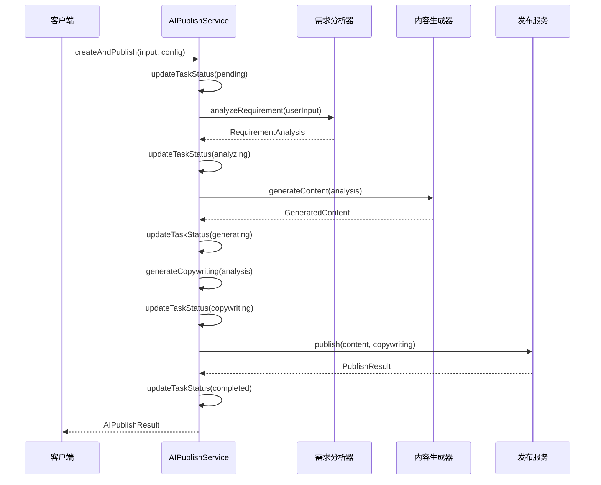

**图表来源**
- [src/services/ai-publish-service.ts:90-226](file://src/services/ai-publish-service.ts#L90-L226)

**章节来源**
- [src/api/ai/doubao-client.ts:1-412](file://src/api/ai/doubao-client.ts#L1-L412)
- [src/services/ai/content-generator.ts:1-253](file://src/services/ai/content-generator.ts#L1-L253)
- [src/services/ai-publish-service.ts:1-377](file://src/services/ai-publish-service.ts#L1-L377)

## 架构概览

### 系统架构图

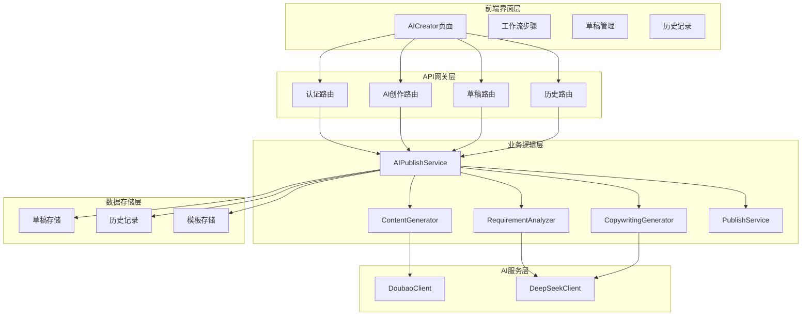

**图表来源**
- [web/client/src/pages/AICreator.tsx:1-715](file://web/client/src/pages/AICreator.tsx#L1-L715)
- [web/server/src/routes/ai.ts:1-800](file://web/server/src/routes/ai.ts#L1-L800)
- [src/services/ai-publish-service.ts:1-377](file://src/services/ai-publish-service.ts#L1-L377)

### 数据流图

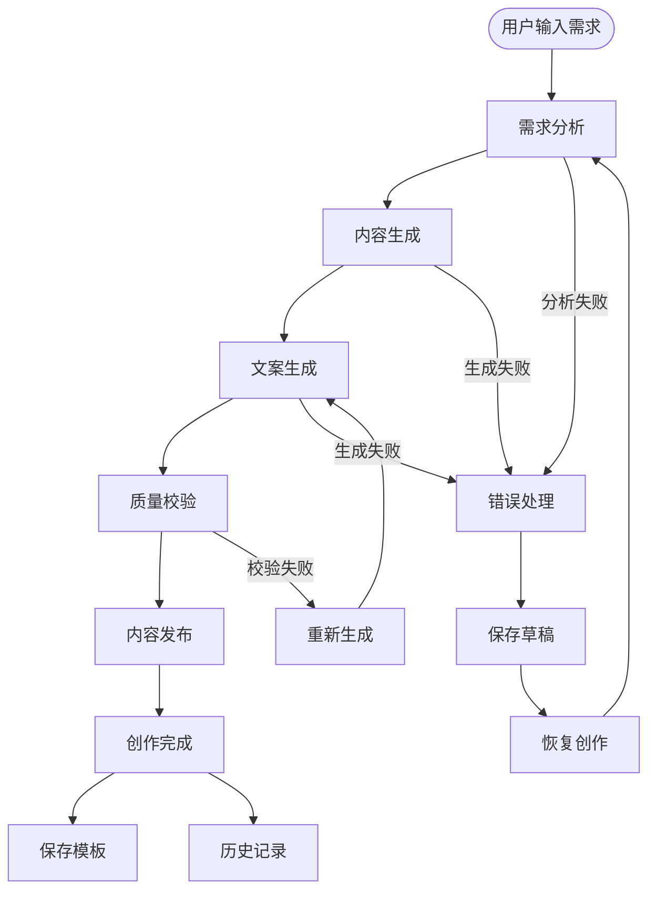

**图表来源**
- [src/services/ai-publish-service.ts:90-226](file://src/services/ai-publish-service.ts#L90-L226)
- [src/services/ai/content-generator.ts:72-120](file://src/services/ai/content-generator.ts#L72-L120)

## 详细组件分析

### Doubao AI客户端实现

Doubao AI客户端提供了完整的图片和视频生成能力，支持异步任务管理和状态轮询。

#### 核心功能特性

- **异步任务处理**：支持视频生成的异步任务模式
- **任务状态轮询**：自动轮询任务执行状态
- **文件下载管理**：支持HTTP/HTTPS协议的文件下载
- **错误处理机制**：完善的错误捕获和处理
- **配置灵活性**：支持环境变量和运行时配置

#### 任务执行流程

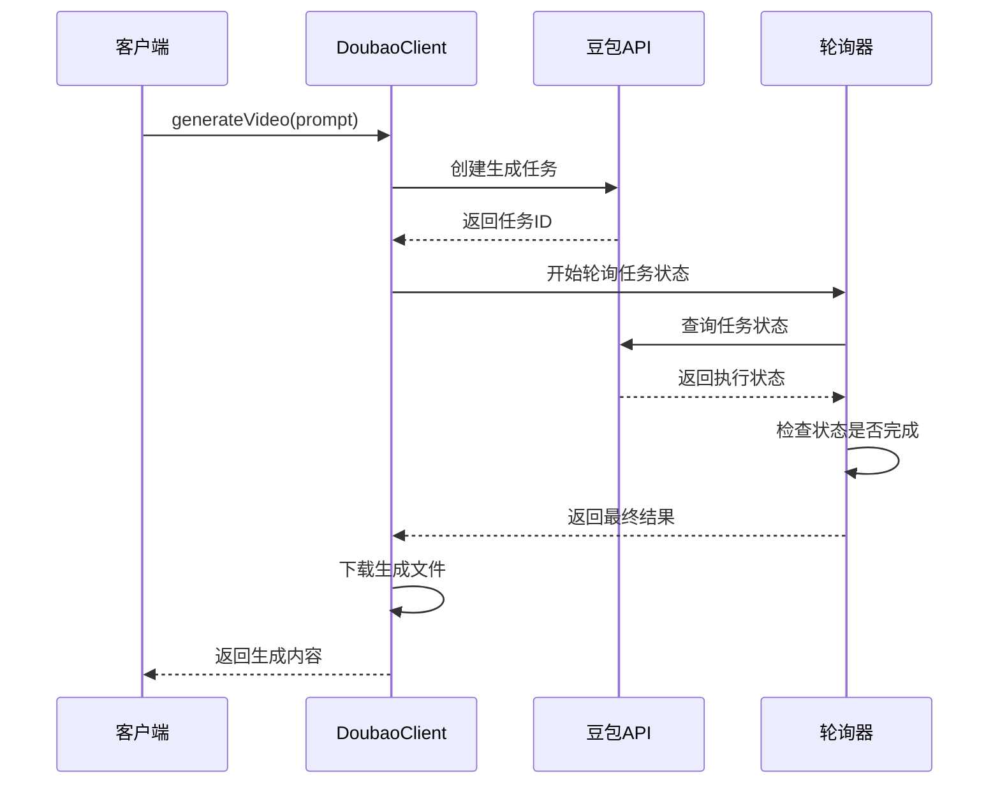

**图表来源**
- [src/api/ai/doubao-client.ts:216-307](file://src/api/ai/doubao-client.ts#L216-L307)

**章节来源**
- [src/api/ai/doubao-client.ts:1-412](file://src/api/ai/doubao-client.ts#L1-L412)

### 内容生成服务

内容生成服务封装了Doubao AI客户端的功能，提供了更高级的生成接口和进度回调机制。

#### 生成流程

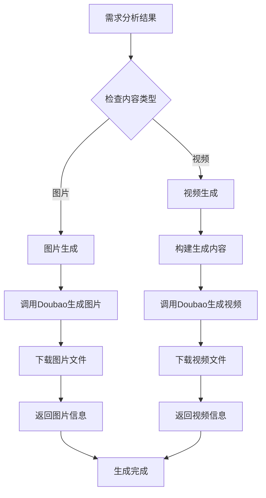

**图表来源**
- [src/services/ai/content-generator.ts:72-120](file://src/services/ai/content-generator.ts#L72-L120)

**章节来源**
- [src/services/ai/content-generator.ts:1-253](file://src/services/ai/content-generator.ts#L1-L253)

### 前端工作流组件

前端提供了完整的AI创作工作流界面，包括需求输入、步骤展示、进度跟踪等功能。

#### 工作流步骤组件

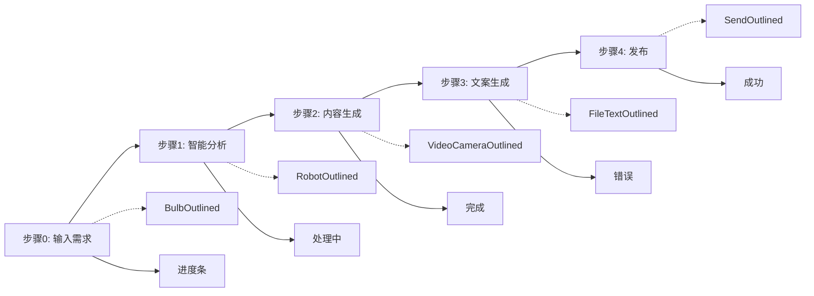

**图表来源**
- [web/client/src/components/ai-creator/WorkflowSteps.tsx:22-53](file://web/client/src/components/ai-creator/WorkflowSteps.tsx#L22-L53)

**章节来源**
- [web/client/src/pages/AICreator.tsx:1-715](file://web/client/src/pages/AICreator.tsx#L1-L715)
- [web/client/src/components/ai-creator/WorkflowSteps.tsx:1-190](file://web/client/src/components/ai-creator/WorkflowSteps.tsx#L1-L190)

### 配置管理系统

系统采用集中式配置管理，支持多种AI服务的配置和切换。

#### 配置结构

| 配置类别 | 关键参数 | 默认值 | 说明 |
|---------|----------|--------|------|
| API配置 | BASE_URL | https://open.douyin.com | 抖音开放平台API基础URL |
| 上传配置 | CHUNK_UPLOAD_THRESHOLD | 128MB | 分片上传阈值 |
| 上传配置 | DEFAULT_CHUNK_SIZE | 5MB | 默认分片大小 |
| 重试配置 | MAX_RETRIES | 3次 | 最大重试次数 |
| 重试配置 | BASE_DELAY | 1000ms | 基础延迟时间 |
| AI配置(DOUBAO) | BASE_URL | https://ark.cn-beijing.volces.com/api/v3 | 豆包AI基础URL |
| AI配置(DEEPSEEK) | BASE_URL | https://api.deepseek.com | DeepSeek AI基础URL |

**章节来源**
- [config/default.ts:1-70](file://config/default.ts#L1-L70)

## 依赖关系分析

### 核心依赖关系

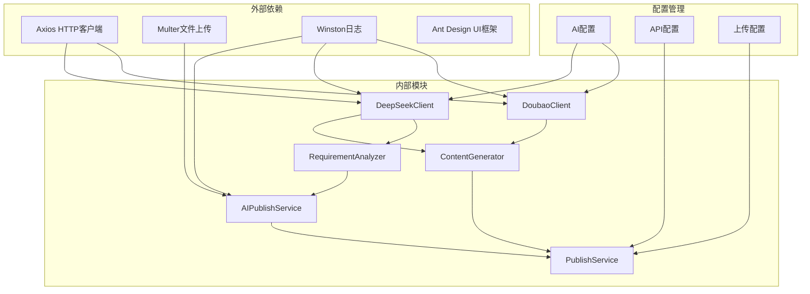

**图表来源**
- [package.json:18-34](file://package.json#L18-L34)
- [src/api/ai/doubao-client.ts:6-12](file://src/api/ai/doubao-client.ts#L6-L12)
- [src/api/ai/deepseek-client.ts:6-9](file://src/api/ai/deepseek-client.ts#L6-L9)

### 类型系统设计

系统采用了完整的TypeScript类型系统，确保代码的类型安全性和可维护性。

#### 核心类型层次

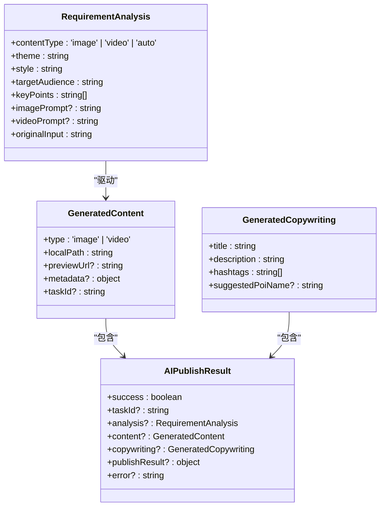

**图表来源**
- [src/models/types.ts:209-295](file://src/models/types.ts#L209-L295)

**章节来源**
- [src/models/types.ts:1-687](file://src/models/types.ts#L1-L687)

## 性能考虑

### 异步处理优化

系统采用异步非阻塞的设计模式，特别是在AI内容生成和文件上传方面：

- **任务队列管理**：支持多个AI生成任务的并发处理
- **进度回调机制**：实时反馈生成进度，提升用户体验
- **资源池管理**：合理管理API连接和文件句柄
- **缓存策略**：智能缓存AI配置和认证信息

### 错误处理和重试机制

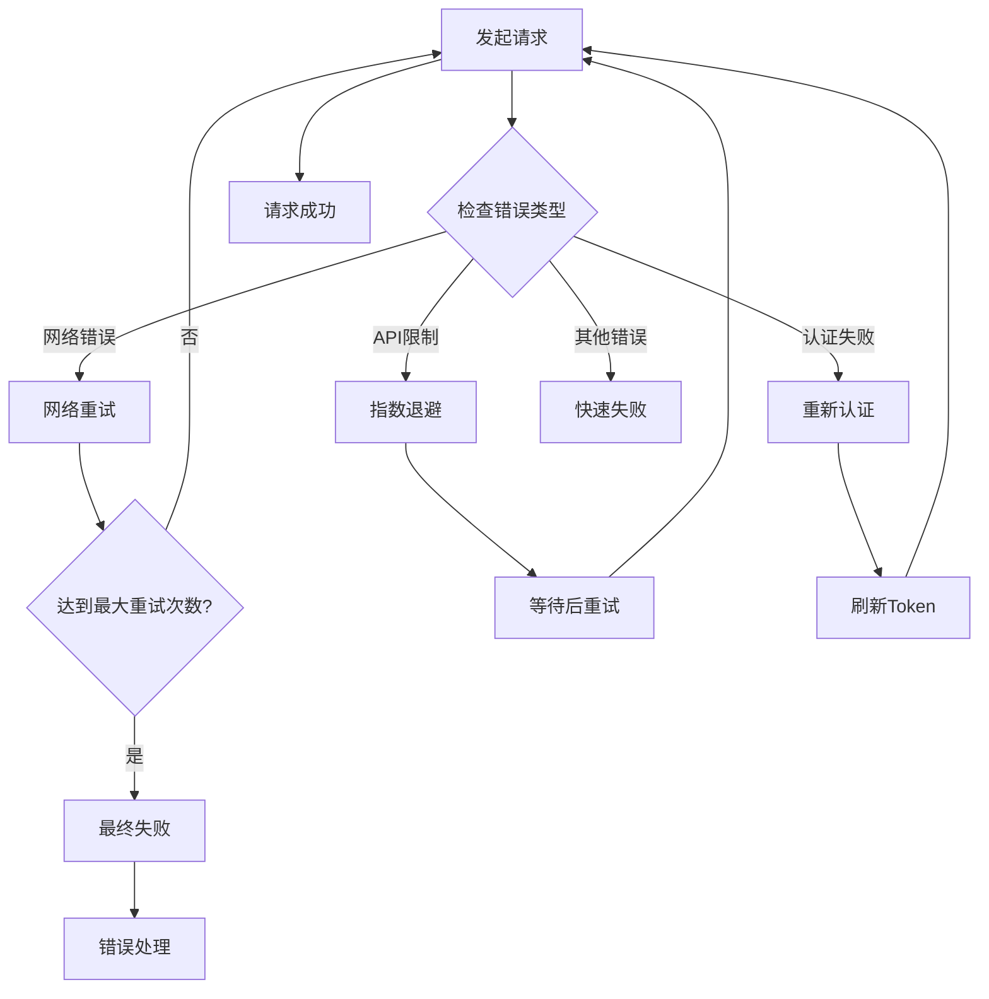

### 资源管理最佳实践

- **文件生命周期管理**：自动清理临时生成的媒体文件
- **内存使用优化**：流式处理大文件，避免内存溢出
- **连接池管理**：复用HTTP连接，减少连接开销
- **超时控制**：合理的请求超时设置，防止资源泄露

## 故障排除指南

### 常见问题诊断

#### AI服务配置问题

**问题症状**：AI生成失败，返回API Key相关的错误信息

**诊断步骤**：
1. 检查环境变量配置是否正确
2. 验证API Key的有效性和权限
3. 确认AI服务的可用性状态

**解决方案**：
- 在系统设置中重新配置AI服务
- 检查网络连接和防火墙设置
- 验证API配额和使用限制

#### 内容生成超时问题

**问题症状**：视频生成长时间处于"生成中"状态

**诊断步骤**：
1. 检查豆包AI服务的负载情况
2. 验证生成内容的复杂度和大小
3. 监控系统资源使用情况

**解决方案**：
- 优化生成提示词，降低复杂度
- 调整生成参数，如分辨率和时长
- 检查系统资源，必要时升级配置

#### 前端界面问题

**问题症状**：工作流界面显示异常或功能不可用

**诊断步骤**：
1. 检查浏览器控制台的JavaScript错误
2. 验证API接口的连通性
3. 确认用户认证状态

**解决方案**：
- 清除浏览器缓存和Cookie
- 检查网络代理和防火墙设置
- 重新登录系统

**章节来源**
- [src/api/ai/doubao-client.ts:196-207](file://src/api/ai/doubao-client.ts#L196-L207)
- [web/server/src/routes/ai.ts:195-225](file://web/server/src/routes/ai.ts#L195-L225)

## 结论

Doubao AI客户端增强项目提供了一个完整、可扩展的AI内容创作和发布解决方案。通过集成豆包AI和DeepSeek AI服务，系统能够自动化处理从需求分析到内容发布的完整流程。

### 项目优势

1. **技术架构先进**：采用现代化的微服务架构和TypeScript开发
2. **功能完整**：覆盖AI创作的全流程，包括草稿管理、模板系统等
3. **用户体验优秀**：提供直观的工作流界面和实时进度反馈
4. **可扩展性强**：模块化设计便于功能扩展和定制
5. **稳定性高**：完善的错误处理和重试机制

### 发展建议

1. **性能优化**：进一步优化AI生成的响应时间和资源使用
2. **功能扩展**：增加更多AI服务提供商的支持
3. **用户体验**：持续改进前端界面和交互体验
4. **监控告警**：建立更完善的系统监控和告警机制
5. **文档完善**：补充更多的开发文档和技术说明

该系统为抖音营销账号的自动化运营提供了强有力的技术支撑，具有良好的商业价值和应用前景。