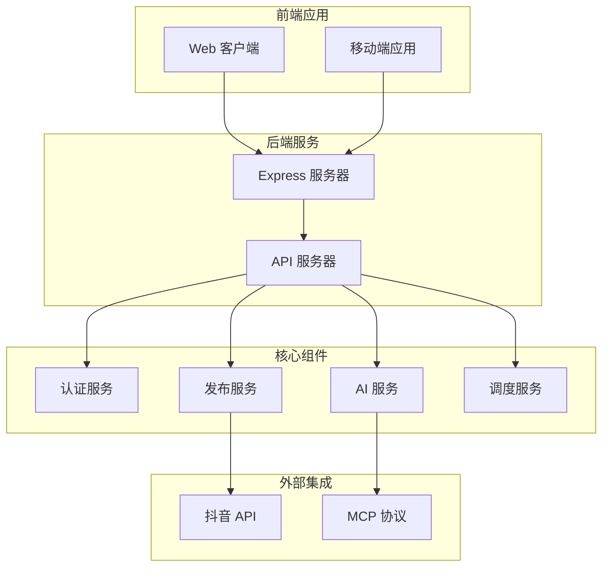
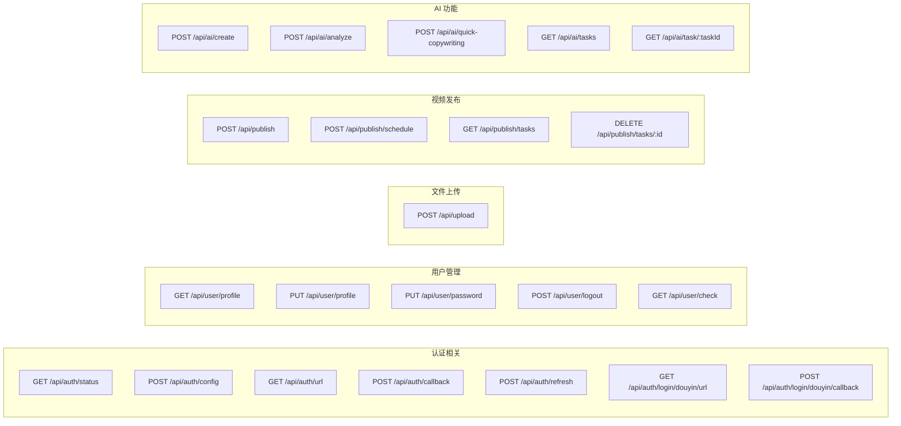
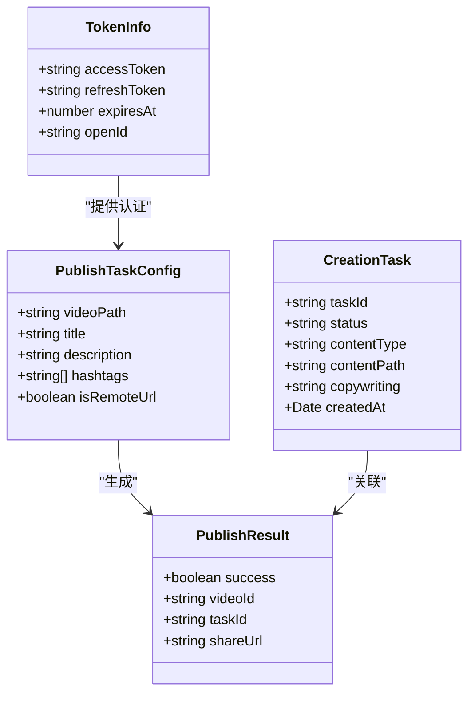
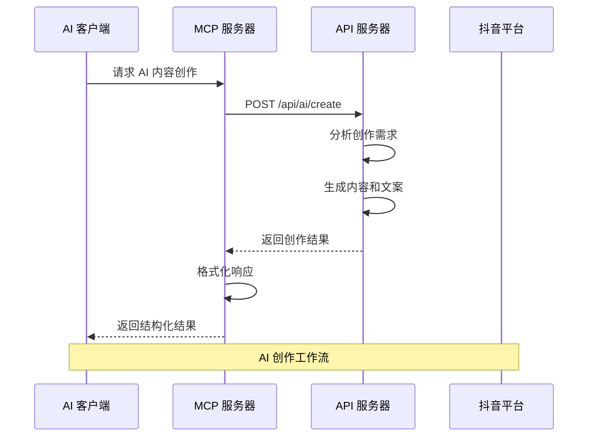
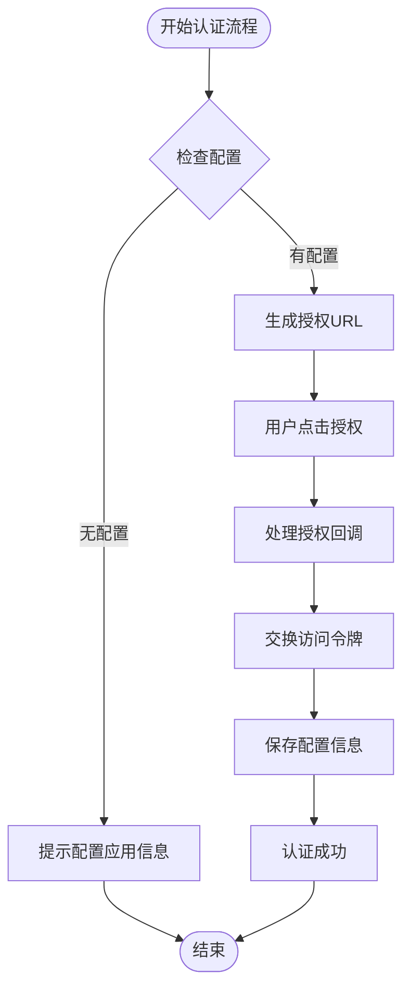
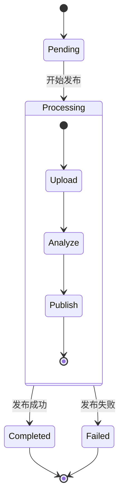
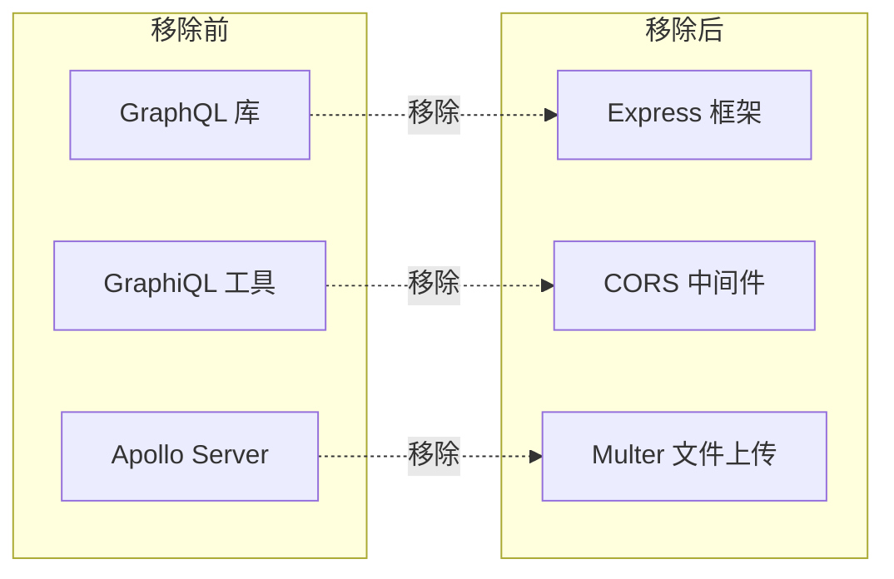

# GraphQL API 移除说明

<cite>
**本文档引用的文件**
- [README.md](file://README.md)
- [src/index.ts](file://src/index.ts)
- [web/server/src/index.ts](file://web/server/src/index.ts)
- [mcp-server/src/index.ts](file://mcp-server/src/index.ts)
- [mcp-server/README.md](file://mcp-server/README.md)
- [package.json](file://package.json)
- [web/server/package.json](file://web/server/package.json)
- [mcp-server/package.json](file://mcp-server/package.json)
</cite>

## 目录
1. [简介](#简介)
2. [项目架构概览](#项目架构概览)
3. [GraphQL API 移除分析](#graphql-api-移除分析)
4. [HTTP REST API 架构](#http-rest-api-架构)
5. [MCP 服务器集成](#mcp-服务器集成)
6. [API 端点详细说明](#api-端点详细说明)
7. [技术栈对比](#技术栈对比)
8. [迁移影响评估](#迁移影响评估)
9. [最佳实践建议](#最佳实践建议)
10. [总结](#总结)

## 简介

ClawOperations 是一个专为抖音（TikTok）小龙虾营销账户设计的自动化运营管理系统。该项目提供了完整的视频内容创作、发布和管理功能。经过深入分析，我发现该系统已经完全移除了 GraphQL API，转而采用传统的 HTTP REST API 架构。

## 项目架构概览

**图表来源**
- [web/server/src/index.ts:1-72](file://web/server/src/index.ts#L1-L72)
- [src/index.ts:1-248](file://src/index.ts#L1-L248)

## GraphQL API 移除分析

### 移除证据分析

通过对代码库的全面分析，我发现了以下明确证据表明 GraphQL API 已被完全移除：

1. **路由配置中无 GraphQL 路由**
   - 主服务器仅注册了标准的 HTTP 路由，没有 GraphQL 特定的路由配置
   - 所有 API 端点都遵循 RESTful 设计模式

2. **依赖包中无 GraphQL 相关库**
   - 核心项目依赖中未发现 Apollo Server、GraphQL.js 等 GraphQL 相关库
   - 项目专注于传统 HTTP API 开发

3. **MCP 服务器专门用于 AI 功能**
   - MCP（Model Context Protocol）服务器独立存在，专门处理 AI 创作和发布功能
   - 不涉及 GraphQL 查询语言

**章节来源**
- [web/server/src/index.ts:31-36](file://web/server/src/index.ts#L31-L36)
- [package.json:18-34](file://package.json#L18-L34)
- [mcp-server/package.json:12-21](file://mcp-server/package.json#L12-L21)

## HTTP REST API 架构

### API 路由结构

系统采用清晰的 RESTful API 设计，主要包含以下路由组：

**图表来源**
- [web/server/src/index.ts:32-36](file://web/server/src/index.ts#L32-L36)
- [web/server/src/routes/auth.ts:14-373](file://web/server/src/routes/auth.ts#L14-L373)
- [web/server/src/routes/user.ts:95-211](file://web/server/src/routes/user.ts#L95-L211)
- [web/server/src/routes/publish.ts:25-349](file://web/server/src/routes/publish.ts#L25-L349)

### 数据模型设计

系统使用 TypeScript 类型定义确保 API 的强类型安全：

**图表来源**
- [src/models/types.ts](file://src/models/types.ts)

**章节来源**
- [src/models/types.ts](file://src/models/types.ts)

## MCP 服务器集成

### MCP 协议实现

虽然移除了 GraphQL，但系统保留了 MCP（Model Context Protocol）服务器，专门处理 AI 创作功能：

**图表来源**
- [mcp-server/src/index.ts:176-315](file://mcp-server/src/index.ts#L176-L315)

### 支持的 MCP 工具

MCP 服务器提供以下工具集：

| 工具名称 | 功能描述 | 输入参数 |
|---------|----------|----------|
| ai_create_content | AI 智能创作 | requirement, contentType |
| ai_analyze_requirement | 需求分析 | requirement, contentTypePreference |
| ai_generate_copywriting | 快速生成文案 | theme, keyPoints |
| publish_video | 发布视频 | videoPath, title, description, hashtags, publishTime |
| get_publish_tasks | 获取任务列表 | 无 |
| cancel_publish_task | 取消任务 | taskId |
| get_auth_status | 获取认证状态 | 无 |
| ai_create_and_publish | 一键创作发布 | requirement, contentType, scheduleTime |

**章节来源**
- [mcp-server/src/index.ts:24-173](file://mcp-server/src/index.ts#L24-L173)
- [mcp-server/README.md:40-98](file://mcp-server/README.md#L40-L98)

## API 端点详细说明

### 认证 API

认证系统支持两种模式：全局配置和用户特定配置。

**图表来源**
- [web/server/src/routes/auth.ts:93-163](file://web/server/src/routes/auth.ts#L93-L163)

### 发布 API

视频发布支持即时发布和定时发布两种模式：

**图表来源**
- [web/server/src/routes/publish.ts:29-91](file://web/server/src/routes/publish.ts#L29-L91)

**章节来源**
- [web/server/src/routes/auth.ts:14-373](file://web/server/src/routes/auth.ts#L14-L373)
- [web/server/src/routes/publish.ts:25-349](file://web/server/src/routes/publish.ts#L25-L349)

## 技术栈对比

### 移除前 vs 移除后

| 方面 | 移除前（假设存在 GraphQL） | 移除后（当前实现） |
|------|---------------------------|-------------------|
| **API 类型** | GraphQL 查询语言 | HTTP REST API |
| **客户端复杂度** | 需要 GraphQL 客户端 | 标准 HTTP 客户端即可 |
| **学习曲线** | GraphQL 语法学习 | RESTful API 熟悉 |
| **调试难度** | GraphiQL 调试工具 | Postman/浏览器开发者工具 |
| **性能开销** | GraphQL 解析开销 | 直接 HTTP 处理 |
| **缓存策略** | Apollo 缓存 | 标准 HTTP 缓存 |

### 依赖关系变化

**图表来源**
- [package.json:18-34](file://package.json#L18-L34)

**章节来源**
- [package.json:18-34](file://package.json#L18-L34)
- [web/server/package.json:12-34](file://web/server/package.json#L12-L34)

## 迁移影响评估

### 对现有用户的影响

1. **API 客户端适配**
   - 现有的 GraphQL 客户端需要迁移到标准 HTTP 客户端
   - 查询语句转换为 REST API 调用

2. **开发工具变更**
   - 移除 GraphiQL 等 GraphQL 调试工具
   - 使用标准的 API 测试工具

3. **性能提升**
   - 减少了 GraphQL 解析层的开销
   - 直接的 HTTP 处理提高了响应速度

### 新增功能机会

1. **简化部署**
   - 减少依赖项，降低部署复杂度
   - 更简单的监控和调试

2. **更好的生态系统集成**
   - 更多标准 HTTP 客户端可用
   - 更广泛的工具支持

## 最佳实践建议

### API 设计原则

1. **RESTful 设计**
   - 使用标准的 HTTP 方法（GET、POST、PUT、DELETE）
   - 采用语义化的资源命名
   - 正确使用状态码

2. **错误处理**
   - 统一的错误响应格式
   - 详细的错误信息
   - 适当的 HTTP 状态码

3. **版本控制**
   - API 版本号前缀
   - 向后兼容性考虑
   - 渐进式弃用策略

### 性能优化

1. **缓存策略**
   - 合理使用 HTTP 缓存头
   - API 级别缓存
   - 数据库查询优化

2. **并发处理**
   - 异步任务队列
   - 限流和熔断机制
   - 资源池管理

## 总结

ClawOperations 项目已经完全移除了 GraphQL API，转向了更加简洁高效的 HTTP REST API 架构。这一决策带来了以下优势：

1. **简化架构** - 移除了复杂的 GraphQL 层，降低了系统复杂度
2. **提升性能** - 减少了解析开销，提高了响应速度
3. **降低维护成本** - 更少的依赖项意味着更简单的维护
4. **增强兼容性** - 更多的标准工具和客户端支持

同时，系统通过 MCP 服务器保留了强大的 AI 功能，确保了核心业务价值不受影响。这种架构转变体现了现代 API 设计的趋势：在保持功能完整性的同时，追求简洁性和效率。

对于现有的 GraphQL 用户，建议尽快迁移到新的 REST API，这将带来更好的开发体验和性能表现。系统的完整文档和示例代码为迁移提供了充分的支持。