# Legacy Upload System Removed

<cite>
**本文档引用的文件**
- [src/index.ts](file://src/index.ts)
- [src/api/video-upload.ts](file://src/api/video-upload.ts)
- [src/services/publish-service.ts](file://src/services/publish-service.ts)
- [web/server/src/routes/upload.ts](file://web/server/src/routes/upload.ts)
- [web/server/src/services/publisher.ts](file://web/server/src/services/publisher.ts)
- [web/server/src/index.ts](file://web/server/src/index.ts)
- [config/default.ts](file://config/default.ts)
- [src/models/types.ts](file://src/models/types.ts)
- [README.md](file://README.md)
- [deploy/DEPLOY.md](file://deploy/DEPLOY.md)
- [package.json](file://package.json)
- [web/server/src/database/index.ts](file://web/server/src/database/index.ts)
- [web/server/src/database/schema.sql](file://web/server/src/database/schema.sql)
- [web/server/src/database/migrate-from-lowdb.ts](file://web/server/src/database/migrate-from-lowdb.ts)
- [web/server/src/services/creation-task-service.ts](file://web/server/src/services/creation-task-service.ts)
- [web/server/src/services/user-service.ts](file://web/server/src/services/user-service.ts)
- [web/server/src/services/system-config-service.ts](file://web/server/src/services/system-config-service.ts)
- [web/server/src/services/app-config-service.ts](file://web/server/src/services/app-config-service.ts)
- [web/server/.env](file://web/server/.env)
</cite>

## 更新摘要
**变更内容**
- 更新了数据库架构从低版本数据库(lowdb)到MySQL的完整重构
- 新增了MySQL数据库连接池和Redis缓存集成说明
- 添加了完整的数据库模式(schema)和迁移脚本文档
- 更新了文件存储系统为MySQL数据库存储方案
- 新增了配置管理和服务层的数据库实现

## 目录
1. [简介](#简介)
2. [项目结构](#项目结构)
3. [核心组件](#核心组件)
4. [架构概览](#架构概览)
5. [详细组件分析](#详细组件分析)
6. [数据库架构](#数据库架构)
7. [依赖关系分析](#依赖关系分析)
8. [性能考虑](#性能考虑)
9. [故障排除指南](#故障排除指南)
10. [结论](#结论)

## 简介

ClawOperations 是一个专为抖音（TikTok）营销账户设计的自动化运营系统。该项目的核心功能是提供完整的视频上传、发布和管理能力，支持直接上传、分片上传、URL 上传等多种上传方式，并集成了认证、调度、AI 内容生成等高级功能。

**章节来源**
- [README.md:1-152](file://README.md#L1-L152)

## 项目结构

项目采用模块化架构设计，主要分为以下几个核心部分：

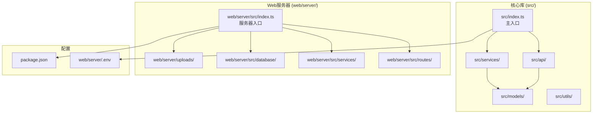

**图表来源**
- [src/index.ts:1-248](file://src/index.ts#L1-L248)
- [web/server/src/index.ts:1-72](file://web/server/src/index.ts#L1-L72)

**章节来源**
- [package.json:1-39](file://package.json#L1-L39)
- [README.md:92-105](file://README.md#L92-L105)

## 核心组件

### 主要组件概述

ClawOperations 的核心由以下主要组件构成：

1. **ClawPublisher** - 主要的对外接口类
2. **VideoUpload** - 视频上传模块
3. **PublishService** - 发布服务编排层
4. **Express 路由** - Web 服务器接口
5. **数据库连接层** - MySQL + Redis 存储架构
6. **配置管理系统** - 应用配置和常量定义

### 组件关系图

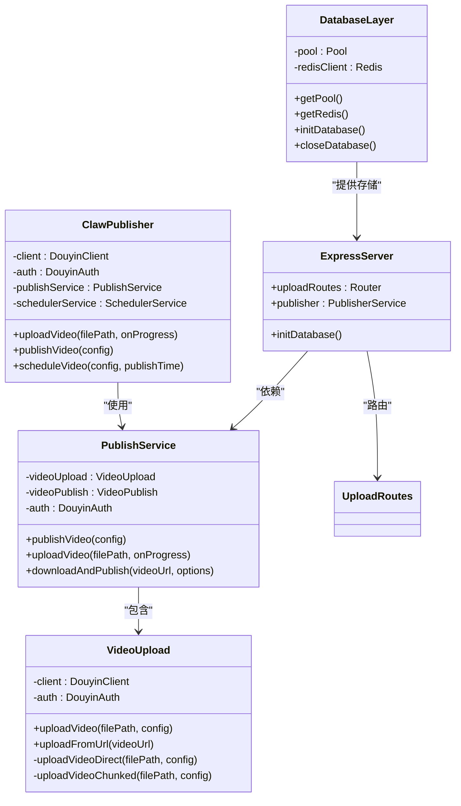

**图表来源**
- [src/index.ts:29-244](file://src/index.ts#L29-L244)
- [src/api/video-upload.ts:20-241](file://src/api/video-upload.ts#L20-L241)
- [src/services/publish-service.ts:22-228](file://src/services/publish-service.ts#L22-L228)
- [web/server/src/index.ts:1-72](file://web/server/src/index.ts#L1-L72)
- [web/server/src/database/index.ts:1-164](file://web/server/src/database/index.ts#L1-L164)

**章节来源**
- [src/index.ts:29-244](file://src/index.ts#L29-L244)
- [src/api/video-upload.ts:20-241](file://src/api/video-upload.ts#L20-L241)
- [src/services/publish-service.ts:22-228](file://src/services/publish-service.ts#L22-L228)

## 架构概览

### 系统架构图

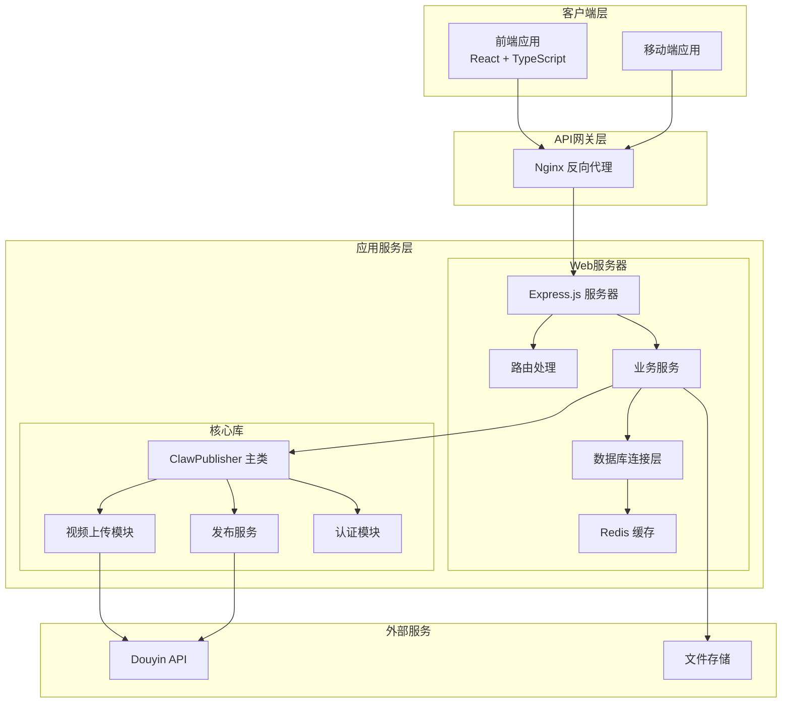

**图表来源**
- [web/server/src/index.ts:20-72](file://web/server/src/index.ts#L20-L72)
- [src/index.ts:29-244](file://src/index.ts#L29-L244)

### 数据流图

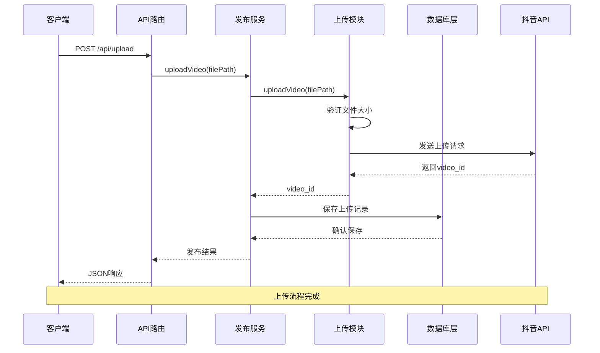

**图表来源**
- [web/server/src/routes/upload.ts:83-115](file://web/server/src/routes/upload.ts#L83-L115)
- [src/services/publish-service.ts:38-80](file://src/services/publish-service.ts#L38-L80)

**章节来源**
- [web/server/src/routes/upload.ts:83-115](file://web/server/src/routes/upload.ts#L83-L115)
- [src/services/publish-service.ts:38-80](file://src/services/publish-service.ts#L38-L80)

## 详细组件分析

### ClawPublisher 主类

ClawPublisher 是整个系统的核心入口类，提供了统一的对外接口：

#### 主要功能特性

1. **认证管理** - OAuth 授权、Token 刷新、状态检查
2. **视频上传** - 支持本地文件和远程URL上传
3. **视频发布** - 完整的一站式发布流程
4. **定时发布** - 任务调度和管理
5. **视频管理** - 状态查询、删除等操作

#### 类结构分析

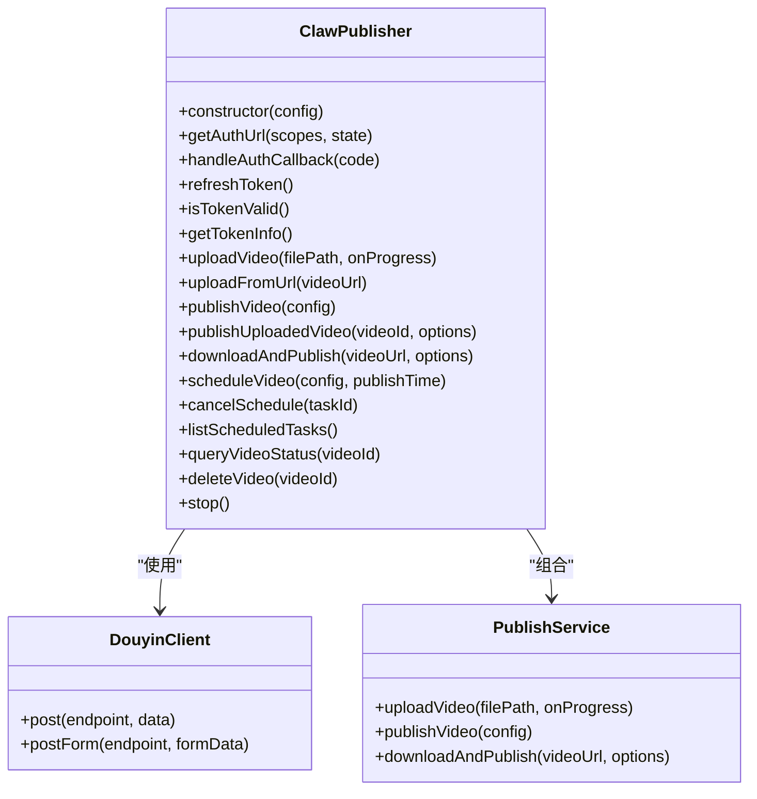

**图表来源**
- [src/index.ts:29-244](file://src/index.ts#L29-L244)

**章节来源**
- [src/index.ts:29-244](file://src/index.ts#L29-L244)

### 视频上传模块

VideoUpload 模块实现了智能的上传策略，根据文件大小自动选择合适的上传方式：

#### 上传策略决策

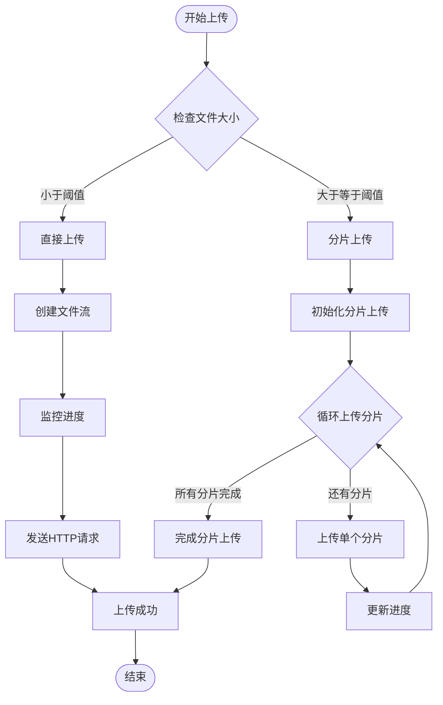

**图表来源**
- [src/api/video-upload.ts:35-54](file://src/api/video-upload.ts#L35-L54)

#### 分片上传实现

分片上传支持大文件的可靠传输，具有以下特点：

1. **智能分片** - 默认5MB分片大小，可根据需要调整
2. **断点续传** - 支持分片级别的错误恢复
3. **进度监控** - 实时跟踪上传进度
4. **并发控制** - 合理的并发上传策略

**章节来源**
- [src/api/video-upload.ts:104-152](file://src/api/video-upload.ts#L104-L152)
- [config/default.ts:10-15](file://config/default.ts#L10-L15)

### 发布服务编排

PublishService 作为业务编排层，协调各个子模块完成完整的发布流程：

#### 发布流程序列图

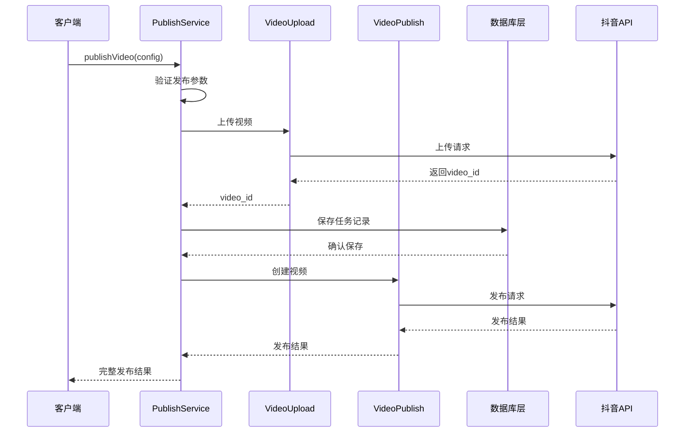

**图表来源**
- [src/services/publish-service.ts:38-80](file://src/services/publish-service.ts#L38-L80)

**章节来源**
- [src/services/publish-service.ts:38-80](file://src/services/publish-service.ts#L38-L80)

### Web服务器接口

Web服务器提供了RESTful API接口，支持多种上传方式：

#### API接口设计

| 接口 | 方法 | 功能 | 参数 |
|------|------|------|------|
| `/api/upload` | POST | 上传视频文件 | multipart/form-data |
| `/api/upload/url` | POST | 从URL上传视频 | videoUrl |
| `/api/upload/image` | POST | 单图上传 | image文件 |
| `/api/upload/images` | POST | 批量图片上传 | 多个image文件 |

**章节来源**
- [web/server/src/routes/upload.ts:83-145](file://web/server/src/routes/upload.ts#L83-L145)

## 数据库架构

### 数据库连接层

系统采用MySQL + Redis的混合存储架构，提供高性能的数据持久化和缓存支持：

#### 数据库连接池配置

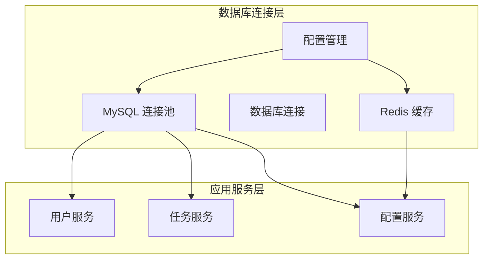

**图表来源**
- [web/server/src/database/index.ts:95-134](file://web/server/src/database/index.ts#L95-L134)

#### 数据库初始化流程

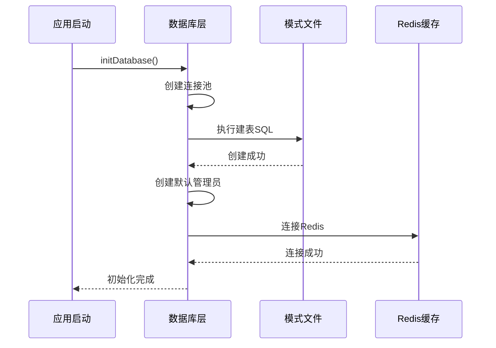

**图表来源**
- [web/server/src/database/index.ts:95-134](file://web/server/src/database/index.ts#L95-L134)

### 数据库模式设计

系统包含以下核心数据表：

#### 用户表(users)

| 字段名 | 类型 | 约束 | 描述 |
|--------|------|------|------|
| id | INT | PRIMARY KEY, AUTO_INCREMENT | 用户ID |
| username | VARCHAR(50) | NOT NULL, UNIQUE | 用户名 |
| email | VARCHAR(255) | NOT NULL, UNIQUE | 邮箱 |
| password_hash | VARCHAR(255) | NOT NULL | 密码哈希 |
| phone | VARCHAR(20) | NULL | 电话号码 |
| avatar | VARCHAR(1024) | NULL | 头像URL |
| role | ENUM('user','admin) | NOT NULL, DEFAULT 'user' | 用户角色 |
| is_active | TINYINT(1) | NOT NULL, DEFAULT 1 | 是否激活 |
| douyin_open_id | VARCHAR(128) | NULL, UNIQUE | 抖音OpenID |
| created_at | DATETIME | NOT NULL | 创建时间 |
| updated_at | DATETIME | NOT NULL | 更新时间 |

#### 创作任务表(creation_tasks)

| 字段名 | 类型 | 约束 | 描述 |
|--------|------|------|------|
| id | VARCHAR(64) | PRIMARY KEY | 任务ID |
| task_type | ENUM('draft','history') | NOT NULL, DEFAULT 'draft' | 任务类型 |
| status | VARCHAR(32) | NOT NULL, DEFAULT 'draft' | 任务状态 |
| requirement | TEXT | NULL | 需求描述 |
| content_type | VARCHAR(32) | NULL | 内容类型 |
| analysis | LONGTEXT | NULL | 分析结果 |
| content | LONGTEXT | NULL | 内容数据 |
| copywriting | LONGTEXT | NULL | 文案内容 |
| publish_result | LONGTEXT | NULL | 发布结果 |
| progress | INT | NOT NULL, DEFAULT 0 | 进度百分比 |
| current_step_message | VARCHAR(1000) | NULL | 当前步骤消息 |
| error_message | TEXT | NULL | 错误信息 |
| can_resume | TINYINT(1) | NOT NULL, DEFAULT 1 | 是否可恢复 |
| last_completed_step | INT | NOT NULL, DEFAULT 0 | 最后完成步骤 |
| reference_image_url | VARCHAR(2048) | NULL | 参考图片URL |
| completed_at | DATETIME | NULL | 完成时间 |
| created_at | DATETIME | NOT NULL | 创建时间 |
| updated_at | DATETIME | NOT NULL | 更新时间 |

#### 配置表(app_config)

| 字段名 | 类型 | 约束 | 描述 |
|--------|------|------|------|
| config_key | VARCHAR(128) | PRIMARY KEY | 配置键 |
| config_value | LONGTEXT | NULL | 配置值(JSON) |
| updated_at | DATETIME | NOT NULL | 更新时间 |

**章节来源**
- [web/server/src/database/schema.sql:1-79](file://web/server/src/database/schema.sql#L1-L79)

### 数据迁移系统

系统提供了从低版本数据库(lowdb)到MySQL的完整迁移方案：

#### 迁移流程图

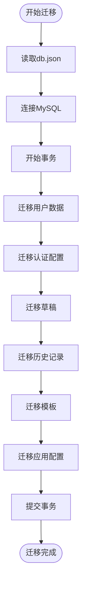

**图表来源**
- [web/server/src/database/migrate-from-lowdb.ts:138-310](file://web/server/src/database/migrate-from-lowdb.ts#L138-L310)

#### 迁移脚本功能

迁移脚本支持以下数据类型的迁移：

1. **用户数据** - 用户基本信息和认证信息
2. **创作任务** - 草稿和历史记录
3. **模板数据** - AI内容模板
4. **应用配置** - 系统配置和第三方API密钥

**章节来源**
- [web/server/src/database/migrate-from-lowdb.ts:138-310](file://web/server/src/database/migrate-from-lowdb.ts#L138-L310)

### 缓存架构

系统采用Redis作为缓存层，提供配置数据的高速访问：

#### 缓存策略

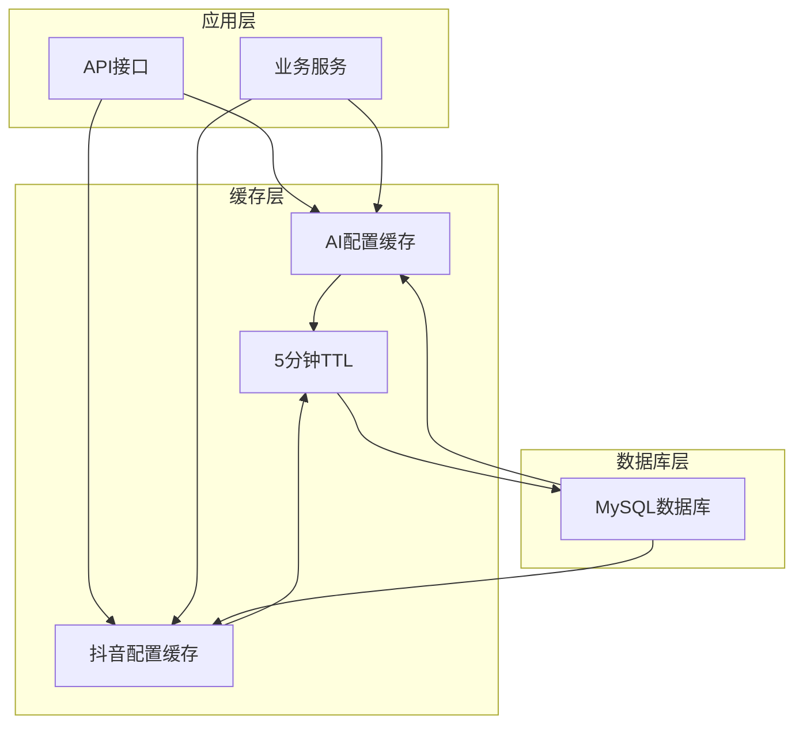

**图表来源**
- [web/server/src/services/system-config-service.ts:142-157](file://web/server/src/services/system-config-service.ts#L142-L157)

**章节来源**
- [web/server/src/services/system-config-service.ts:142-157](file://web/server/src/services/system-config-service.ts#L142-L157)

## 依赖关系分析

### 外部依赖关系

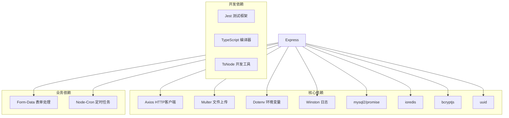

**图表来源**
- [package.json:18-34](file://package.json#L18-L34)

### 内部模块依赖

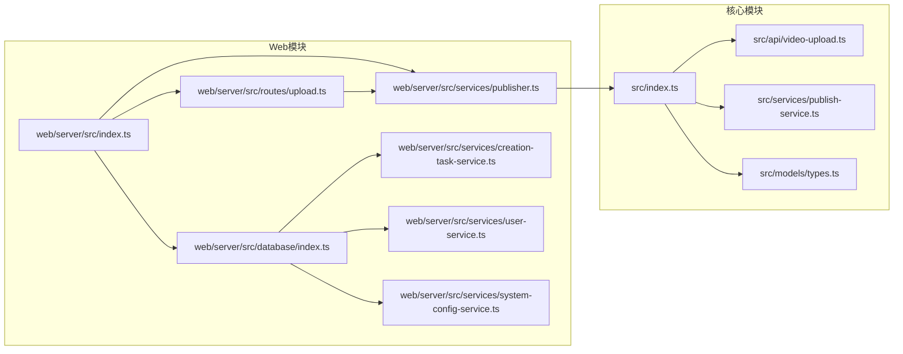

**图表来源**
- [src/index.ts:1-20](file://src/index.ts#L1-L20)
- [web/server/src/index.ts:1-12](file://web/server/src/index.ts#L1-L12)

**章节来源**
- [package.json:18-34](file://package.json#L18-L34)
- [src/index.ts:1-20](file://src/index.ts#L1-L20)

## 性能考虑

### 上传性能优化

1. **智能分片策略** - 根据文件大小自动选择最优分片大小
2. **并发控制** - 合理的并发上传避免资源争用
3. **内存管理** - 大文件分片读取避免内存溢出
4. **进度监控** - 实时反馈上传状态提升用户体验

### 数据库性能优化

1. **连接池管理** - MySQL连接池提供高效的数据库连接复用
2. **缓存策略** - Redis缓存热点配置数据减少数据库查询
3. **索引优化** - 为常用查询字段建立合适索引
4. **事务管理** - 使用事务保证数据一致性

### 系统性能指标

| 配置项 | 默认值 | 说明 |
|--------|--------|------|
| 分片上传阈值 | 128MB | 超过此大小使用分片上传 |
| 默认分片大小 | 5MB | 单个分片大小 |
| 最大重试次数 | 3次 | 网络异常自动重试 |
| 最大文件大小 | 4GB | 单个视频最大支持大小 |
| 图片文件大小限制 | 20MB | 单张图片最大支持大小 |
| MySQL连接池大小 | 10 | 并发连接数限制 |
| Redis缓存TTL | 5分钟 | 配置缓存过期时间 |
| 数据库字符集 | utf8mb4 | 支持完整的UTF-8字符 |

**章节来源**
- [config/default.ts:10-31](file://config/default.ts#L10-L31)
- [web/server/src/database/index.ts:97-109](file://web/server/src/database/index.ts#L97-L109)

## 故障排除指南

### 常见问题及解决方案

#### 1. 数据库连接问题

**问题症状**：
- 服务启动时数据库连接失败
- 查询超时或连接池耗尽
- Redis连接异常

**解决方案**：
- 检查数据库配置(.env文件)
- 验证MySQL服务状态
- 监控连接池使用情况
- 检查Redis服务可用性

#### 2. 上传失败问题

**问题症状**：
- 上传过程中断
- 文件过大导致超时
- 网络不稳定

**解决方案**：
- 检查网络连接稳定性
- 调整分片大小参数
- 增加重试机制
- 监控服务器磁盘空间

#### 3. 认证相关问题

**问题症状**：
- Token过期
- 授权失败
- 权限不足

**解决方案**：
- 实现自动Token刷新
- 检查OAuth配置
- 验证权限范围
- 重新授权流程

#### 4. 数据迁移问题

**问题症状**：
- 迁移脚本执行失败
- 数据不一致
- 迁移中断

**解决方案**：
- 检查db.json文件完整性
- 验证MySQL表结构
- 查看迁移日志
- 手动修复数据后重新迁移

**章节来源**
- [deploy/DEPLOY.md:121-138](file://deploy/DEPLOY.md#L121-L138)

## 结论

ClawOperations 项目展现了现代Node.js应用的最佳实践，通过模块化设计实现了高度的可维护性和扩展性。系统的核心优势包括：

1. **完整的功能覆盖** - 从认证到发布的全链路支持
2. **智能的上传策略** - 自适应的分片上传机制
3. **优雅的错误处理** - 完善的异常捕获和恢复机制
4. **高性能的数据库架构** - MySQL + Redis混合存储方案
5. **完整的数据迁移支持** - 从低版本数据库到MySQL的平滑迁移
6. **良好的架构设计** - 清晰的模块分离和依赖管理

该系统为抖音营销账户的自动化运营提供了坚实的技术基础，通过合理的架构设计和性能优化，能够满足生产环境的各种需求。新的数据库架构不仅提升了系统的稳定性和性能，还为未来的功能扩展奠定了坚实的基础。