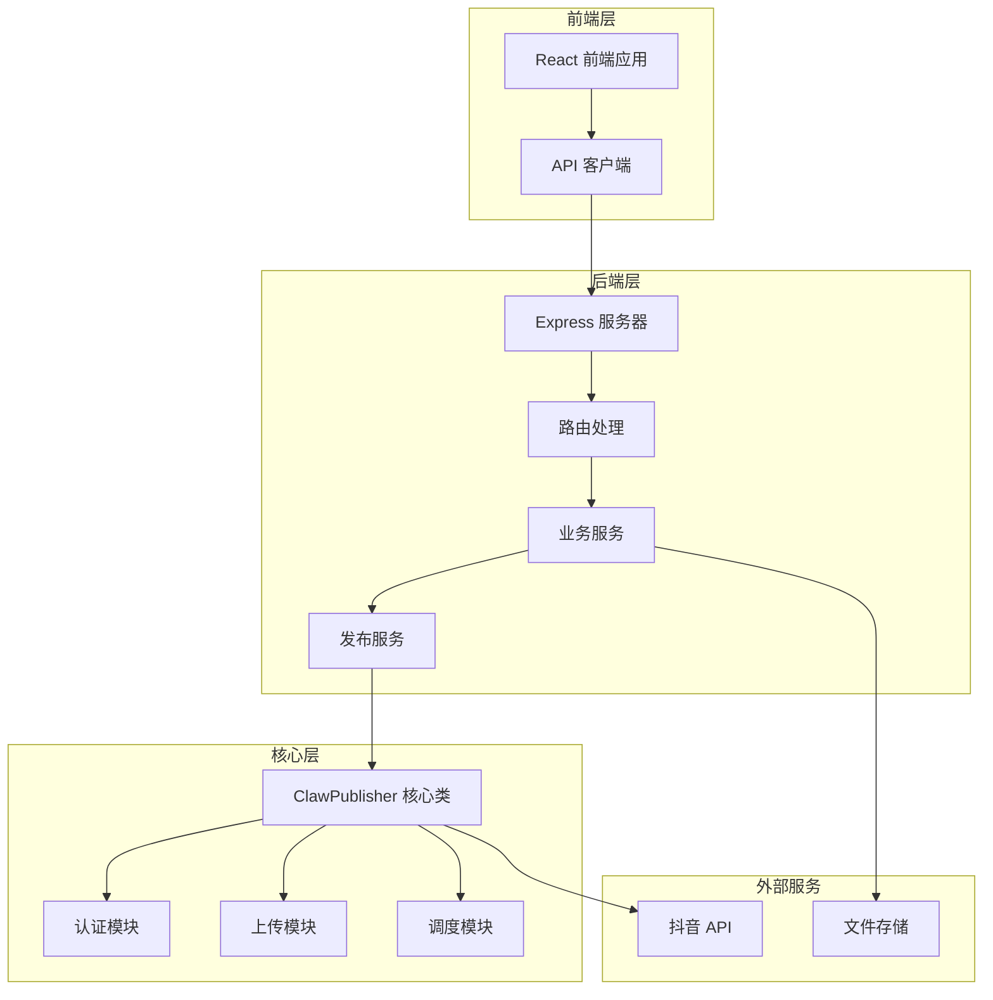
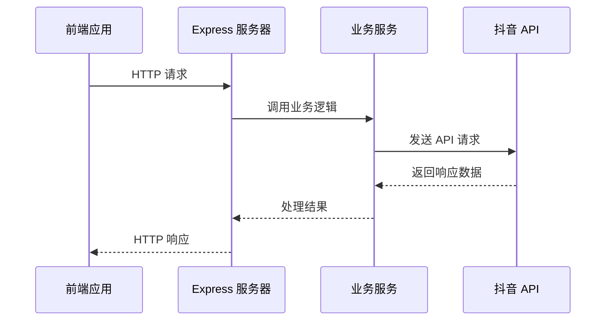
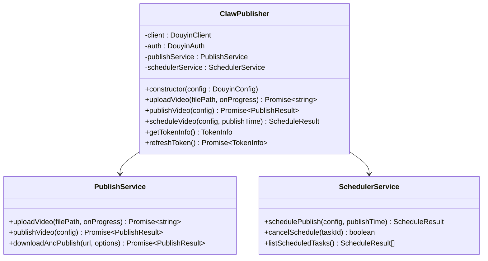
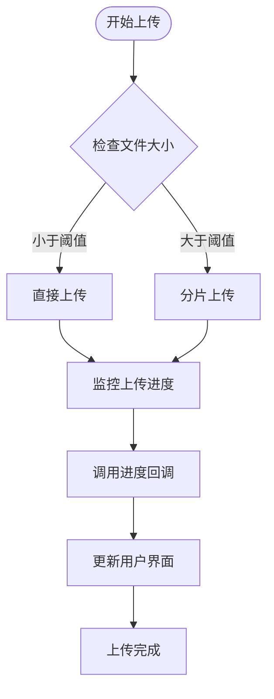
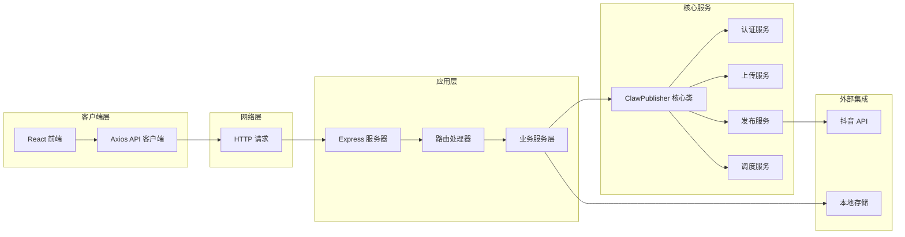

# WebSocket 系统移除说明

<cite>
**本文档引用的文件**
- [README.md](file://README.md)
- [src/index.ts](file://src/index.ts)
- [web/server/src/index.ts](file://web/server/src/index.ts)
- [web/server/src/services/publisher.ts](file://web/server/src/services/publisher.ts)
- [web/server/src/routes/upload.ts](file://web/server/src/routes/upload.ts)
- [web/server/src/routes/publish.ts](file://web/server/src/routes/publish.ts)
- [web/client/src/api/client.ts](file://web/client/src/api/client.ts)
- [web/client/src/App.tsx](file://web/client/src/App.tsx)
- [web/client/package.json](file://web/client/package.json)
</cite>

## 目录
1. [简介](#简介)
2. [项目架构概览](#项目架构概览)
3. [WebSocket 系统现状分析](#websocket-系统现状分析)
4. [技术实现细节](#技术实现细节)
5. [系统架构图](#系统架构图)
6. [迁移影响评估](#迁移影响评估)
7. [最佳实践建议](#最佳实践建议)
8. [总结](#总结)

## 简介

ClawOperations 是一个专门用于抖音/ TikTok 营销账户管理的自动化系统。根据项目分析，该系统已经完全移除了原有的 WebSocket 实时通信功能，转而采用传统的 HTTP 请求-响应模式进行数据传输。

该项目的核心功能包括：
- 抖音 API 集成
- 内容上传和发布
- 定时任务管理
- AI 内容创作
- 用户认证管理

## 项目架构概览



**图表来源**
- [web/server/src/index.ts:1-72](file://web/server/src/index.ts#L1-L72)
- [src/index.ts:1-248](file://src/index.ts#L1-L248)

## WebSocket 系统现状分析

### 移除状态确认

经过对代码库的全面分析，可以确认 WebSocket 系统已被完全移除：

1. **后端代码分析**
   - 服务器端未发现任何 WebSocket 相关依赖
   - 路由文件中未包含 WebSocket 处理逻辑
   - 服务层未实现实时通信功能

2. **前端代码分析**
   - React 应用未使用 WebSocket 连接
   - API 客户端基于 Axios 的 HTTP 请求
   - 用户界面采用传统表单交互模式

3. **配置文件分析**
   - package.json 中未包含 socket.io 或其他 WebSocket 库
   - 项目配置文件未提及实时通信功能

### 当前通信模式

系统目前采用标准的 HTTP 请求-响应模式：



**图表来源**
- [web/client/src/api/client.ts:103-118](file://web/client/src/api/client.ts#L103-L118)
- [web/server/src/routes/upload.ts:83-115](file://web/server/src/routes/upload.ts#L83-L115)

## 技术实现细节

### 核心组件分析

#### ClawPublisher 类
这是系统的核心类，负责协调所有抖音相关的操作：



**图表来源**
- [src/index.ts:29-244](file://src/index.ts#L29-L244)

#### 上传进度处理
虽然系统移除了 WebSocket，但仍保留了上传进度回调机制：



**图表来源**
- [src/api/video-upload.ts:48-54](file://src/api/video-upload.ts#L48-L54)
- [src/api/video-upload.ts:62-96](file://src/api/video-upload.ts#L62-L96)

### API 路由设计

系统提供了完整的 RESTful API 接口：

| 功能模块 | HTTP 方法 | 路径 | 描述 |
|---------|----------|------|------|
| 认证 | GET | /api/auth/status | 检查认证状态 |
| 认证 | POST | /api/auth/config | 配置认证信息 |
| 上传 | POST | /api/upload | 上传视频文件 |
| 上传 | POST | /api/upload/url | 从URL上传视频 |
| 发布 | POST | /api/publish | 立即发布视频 |
| 发布 | POST | /api/publish/schedule | 定时发布视频 |
| 发布 | GET | /api/publish/tasks | 获取任务列表 |

**章节来源**
- [web/server/src/routes/upload.ts:83-145](file://web/server/src/routes/upload.ts#L83-L145)
- [web/server/src/routes/publish.ts:29-91](file://web/server/src/routes/publish.ts#L29-L91)

## 系统架构图



**图表来源**
- [web/server/src/index.ts:20-72](file://web/server/src/index.ts#L20-L72)
- [web/client/src/api/client.ts:44-78](file://web/client/src/api/client.ts#L44-L78)

## 迁移影响评估

### 正面影响

1. **简化架构**
   - 移除了复杂的 WebSocket 连接管理
   - 减少了服务器资源消耗
   - 降低了系统的维护复杂度

2. **提高稳定性**
   - 消除了连接断开的风险
   - 减少了内存泄漏的可能性
   - 简化了错误处理逻辑

3. **成本优化**
   - 无需额外的 WebSocket 服务器资源
   - 减少了实时通信的带宽消耗
   - 简化了部署架构

### 潜在限制

1. **实时性降低**
   - 用户无法获得实时的上传进度反馈
   - 需要手动刷新才能获取最新状态
   - 缺少实时通知功能

2. **用户体验影响**
   - 上传进度需要轮询更新
   - 实时协作功能不可用
   - 即时消息功能缺失

## 最佳实践建议

### 对于现有功能的优化

1. **改进进度反馈**
   ```typescript
   // 建议的进度更新策略
   const uploadProgress = (progress: UploadProgress) => {
     // 更新进度条
     updateProgressBar(progress.percentage);
     
     // 在进度达到100%时显示完成通知
     if (progress.percentage === 100) {
       showSuccessNotification('上传完成');
     }
   };
   ```

2. **增强错误处理**
   ```typescript
   // 改进的错误处理机制
   const handleError = (error: Error) => {
     console.error('操作失败:', error);
     showErrorMessage(error.message);
   };
   ```

### 向实时功能迁移的考虑

如果未来需要重新引入实时功能，建议：

1. **渐进式迁移**
   - 保持现有的 HTTP 接口不变
   - 在后台添加 WebSocket 支持
   - 提供双通道兼容方案

2. **性能优化**
   - 使用连接池管理 WebSocket 连接
   - 实现智能重连机制
   - 添加心跳检测防止连接超时

## 总结

ClawOperations 项目已经成功完成了 WebSocket 系统的移除工作，转向了更加稳定和易于维护的 HTTP 请求-响应模式。这一决策带来了架构简化、成本降低和稳定性提升等多重好处，同时也在实时性方面做出了一些妥协。

### 主要成果

1. **架构简化**：移除了复杂的实时通信层
2. **成本优化**：减少了服务器资源和带宽消耗
3. **稳定性提升**：降低了系统故障率和维护难度
4. **开发效率**：简化了代码逻辑和测试流程

### 未来展望

虽然当前版本移除了 WebSocket 功能，但系统为未来的实时功能升级预留了良好的基础。通过渐进式的方式，可以在不影响现有功能的前提下逐步引入实时通信能力。