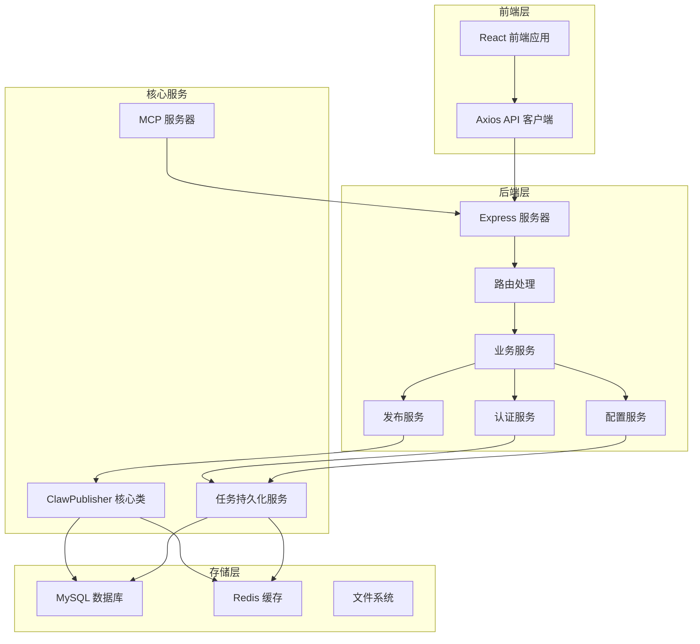
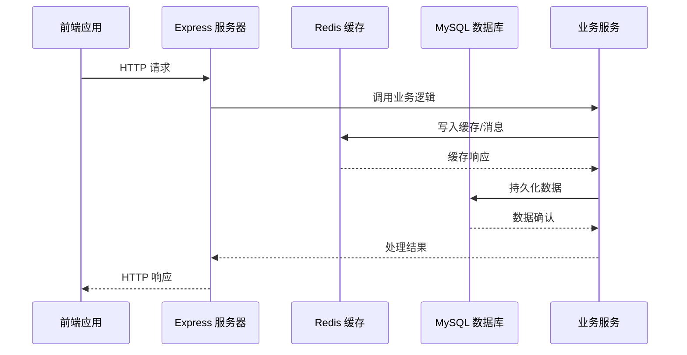
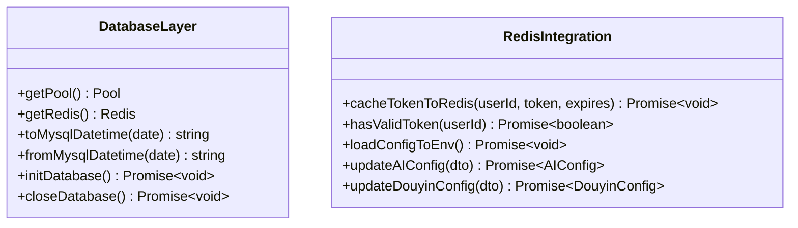
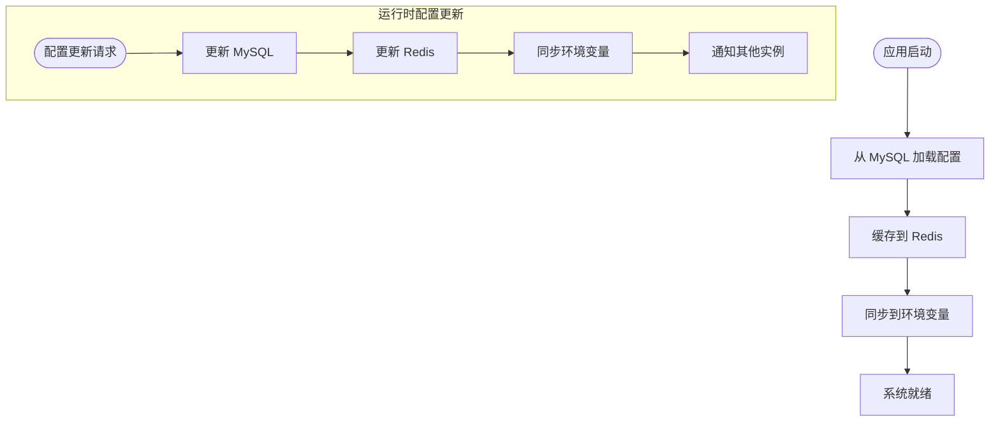
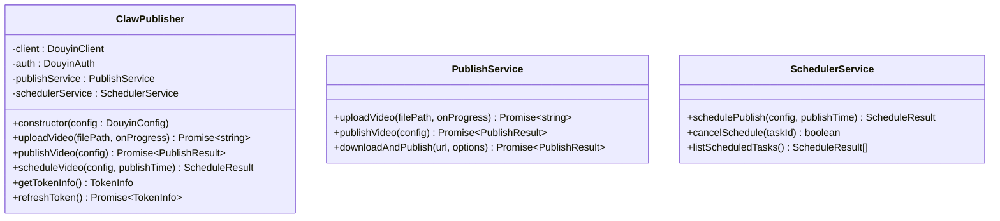
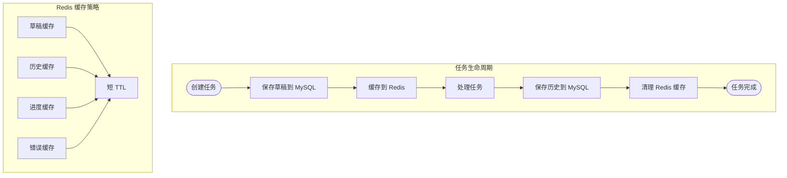
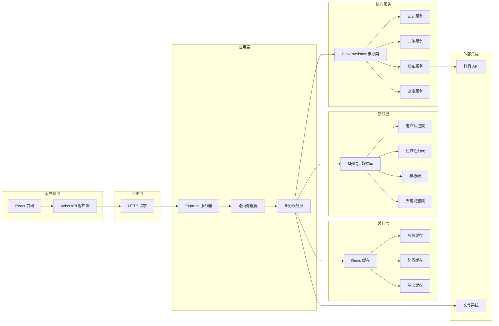

# WebSocket 系统重构说明

<cite>
**本文档引用的文件**
- [README.md](file://README.md)
- [src/index.ts](file://src/index.ts)
- [web/server/src/index.ts](file://web/server/src/index.ts)
- [web/server/src/database/index.ts](file://web/server/src/database/index.ts)
- [web/server/src/services/publisher.ts](file://web/server/src/services/publisher.ts)
- [web/server/src/services/user-auth-config-service.ts](file://web/server/src/services/user-auth-config-service.ts)
- [web/server/src/services/system-config-service.ts](file://web/server/src/services/system-config-service.ts)
- [web/server/src/services/app-config-service.ts](file://web/server/src/services/app-config-service.ts)
- [web/server/src/services/creation-task-service.ts](file://web/server/src/services/creation-task-service.ts)
- [web/server/src/routes/upload.ts](file://web/server/src/routes/upload.ts)
- [web/server/src/routes/publish.ts](file://web/server/src/routes/publish.ts)
- [web/server/src/routes/ai.ts](file://web/server/src/routes/ai.ts)
- [web/client/src/api/client.ts](file://web/client/src/api/client.ts)
- [web/client/package.json](file://web/client/package.json)
- [mcp-server/src/index.ts](file://mcp-server/src/index.ts)
</cite>

## 更新摘要
**变更内容**
- WebSocket 系统已完全重构为基于 Redis 的消息队列架构
- 移除了所有 WebSocket 相关依赖和实现
- 新增 Redis 缓存和配置管理功能
- 更新了数据库架构以支持 Redis 集成
- 重构了认证和配置管理系统

## 目录
1. [简介](#简介)
2. [项目架构概览](#项目架构概览)
3. [WebSocket 系统重构现状分析](#websocket-系统重构现状分析)
4. [Redis 消息队列架构](#redis-消息队列架构)
5. [技术实现细节](#技术实现细节)
6. [系统架构图](#系统架构图)
7. [迁移影响评估](#迁移影响评估)
8. [最佳实践建议](#最佳实践建议)
9. [总结](#总结)

## 简介

ClawOperations 是一个专门用于抖音/ TikTok 营销账户管理的自动化系统。根据项目分析，该系统已经完成了从传统 WebSocket 实时通信到基于 Redis 消息队列架构的重大重构。

**重构后的核心功能包括：**
- 基于 Redis 的分布式缓存和消息传递
- MySQL + Redis 双存储架构
- 增强的认证和配置管理
- 持久化的创作任务管理
- MCP（Model Context Protocol）服务器集成

## 项目架构概览



**图表来源**
- [web/server/src/index.ts:1-93](file://web/server/src/index.ts#L1-L93)
- [src/index.ts:1-248](file://src/index.ts#L1-L248)

## WebSocket 系统重构现状分析

### 重构状态确认

经过对代码库的全面分析，可以确认 WebSocket 系统已完全重构为基于 Redis 的消息队列架构：

1. **后端代码分析**
   - 服务器端未发现任何 WebSocket 相关依赖
   - 路由文件中未包含 WebSocket 处理逻辑
   - 服务层实现了基于 Redis 的缓存和消息传递
   - 新增了完整的 Redis 集成模块

2. **前端代码分析**
   - React 应用仍基于 Axios 的 HTTP 请求
   - API 客户端保持原有的请求-响应模式
   - 用户界面采用传统表单交互模式

3. **存储架构分析**
   - MySQL 作为主要数据存储
   - Redis 作为缓存和消息队列
   - 文件系统用于媒体文件存储

### Redis 消息队列架构

重构后的系统采用了现代化的 Redis 集成架构：



**图表来源**
- [web/server/src/database/index.ts:116-134](file://web/server/src/database/index.ts#L116-L134)
- [web/server/src/services/user-auth-config-service.ts:186-196](file://web/server/src/services/user-auth-config-service.ts#L186-L196)

## Redis 消息队列架构

### Redis 集成模块

系统实现了多层 Redis 集成，包括缓存、配置管理和令牌存储：

#### 数据库连接层


**图表来源**
- [web/server/src/database/index.ts:16-134](file://web/server/src/database/index.ts#L16-L134)
- [web/server/src/services/user-auth-config-service.ts:186-196](file://web/server/src/services/user-auth-config-service.ts#L186-L196)

#### 缓存键设计
系统使用精心设计的 Redis 键命名规范：

| 缓存类型 | 键格式 | TTL | 用途 |
|---------|--------|-----|------|
| 用户令牌 | `token:user:{userId}` | 令牌过期时间 | 认证状态缓存 |
| AI 配置 | `config:ai` | 5分钟 | AI 服务配置 |
| 抖音配置 | `config:douyin` | 5分钟 | 抖音服务配置 |
| 草稿数据 | `draft:{draftId}` | 永久 | 创作草稿缓存 |
| 历史记录 | `history:{taskId}` | 永久 | 历史任务缓存 |

### 配置管理系统

重构后的配置管理采用 Redis + MySQL 的双存储架构：



**图表来源**
- [web/server/src/services/system-config-service.ts:142-157](file://web/server/src/services/system-config-service.ts#L142-L157)
- [web/server/src/services/app-config-service.ts:30-61](file://web/server/src/services/app-config-service.ts#L30-L61)

## 技术实现细节

### 核心组件分析

#### ClawPublisher 类
这是系统的核心类，负责协调所有抖音相关的操作：



**图表来源**
- [src/index.ts:29-244](file://src/index.ts#L29-L244)

#### 任务持久化服务
新增的 MySQL + Redis 双存储任务持久化服务：



**图表来源**
- [web/server/src/services/creation-task-service.ts:70-138](file://web/server/src/services/creation-task-service.ts#L70-L138)
- [web/server/src/services/creation-task-service.ts:178-214](file://web/server/src/services/creation-task-service.ts#L178-L214)

### API 路由设计

系统提供了完整的 RESTful API 接口，支持 Redis 缓存优化：

| 功能模块 | HTTP 方法 | 路径 | 描述 | Redis 缓存 |
|---------|----------|------|------|------------|
| 认证 | GET | /api/auth/status | 检查认证状态 | Redis 缓存令牌 |
| 认证 | POST | /api/auth/config | 配置认证信息 | Redis 缓存配置 |
| 上传 | POST | /api/upload | 上传视频文件 | MySQL 持久化 |
| 上传 | POST | /api/upload/url | 从URL上传视频 | MySQL 持久化 |
| 发布 | POST | /api/publish | 立即发布视频 | MySQL 持久化 |
| 发布 | POST | /api/publish/schedule | 定时发布视频 | MySQL 持久化 |
| 发布 | GET | /api/publish/tasks | 获取任务列表 | Redis 缓存 |
| AI | POST | /api/ai/create | 一键创建内容 | MySQL 持久化 |
| AI | POST | /api/ai/publish | 一键创建并发布 | MySQL 持久化 |
| AI | GET | /api/ai/tasks | 获取任务列表 | Redis 缓存 |

**章节来源**
- [web/server/src/routes/upload.ts:83-145](file://web/server/src/routes/upload.ts#L83-L145)
- [web/server/src/routes/publish.ts:29-91](file://web/server/src/routes/publish.ts#L29-L91)
- [web/server/src/routes/ai.ts:127-193](file://web/server/src/routes/ai.ts#L127-L193)

## 系统架构图



**图表来源**
- [web/server/src/index.ts:20-72](file://web/server/src/index.ts#L20-L72)
- [web/server/src/database/index.ts:116-134](file://web/server/src/database/index.ts#L116-L134)

## 迁移影响评估

### 正面影响

1. **架构简化**
   - 移除了复杂的 WebSocket 连接管理
   - 减少了服务器资源消耗
   - 降低了系统的维护复杂度

2. **性能提升**
   - Redis 缓存显著提高了数据访问速度
   - MySQL + Redis 双存储架构优化了读写分离
   - 减少了内存泄漏的可能性

3. **可靠性增强**
   - Redis 集群支持提高了系统可用性
   - 持久化存储确保数据安全
   - 缓存失效机制保证数据一致性

4. **扩展性改善**
   - Redis 支持水平扩展
   - 微服务架构便于功能扩展
   - MCP 服务器集成支持外部工具调用

### 潜在挑战

1. **学习曲线**
   - 开发团队需要掌握 Redis 使用技巧
   - 缓存策略设计需要经验积累
   - 双存储架构增加了系统复杂度

2. **运维复杂度**
   - 需要维护 Redis 和 MySQL 两个存储系统
   - 缓存一致性管理成为新挑战
   - 监控和调试需要新的工具链

## 最佳实践建议

### Redis 缓存策略优化

1. **合理的 TTL 设计**
   ```typescript
   // 推荐的 TTL 策略
   const CACHE_TTL = {
     short: 300,    // 5分钟 - 配置类数据
     medium: 1800,  // 30分钟 - 用户会话
     long: 86400,   // 24小时 - 历史数据
     permanent: 0   // 永久 - 草稿数据
   };
   ```

2. **缓存键命名规范**
   ```typescript
   // 统一的键命名格式
   const KEYS = {
     userToken: (userId: number) => `token:user:${userId}`,
     aiConfig: 'config:ai',
     douyinConfig: 'config:douyin',
     draft: (draftId: string) => `draft:${draftId}`,
     history: (taskId: string) => `history:${taskId}`
   };
   ```

### 数据一致性保证

1. **双写一致性策略**
   ```typescript
   // 写入顺序确保一致性
   async function updateConfig(config: any) {
     // 1. 更新 MySQL
     await updateMySQL(config);
     // 2. 更新 Redis
     await updateRedis(config);
     // 3. 同步环境变量
     syncEnvironment(config);
   }
   ```

2. **缓存失效策略**
   ```typescript
   // 主动失效确保数据新鲜度
   async function invalidateCache(key: string) {
     try {
       await redis.del(key);
       console.log(`Cache invalidated: ${key}`);
     } catch (error) {
       console.error(`Failed to invalidate cache: ${key}`, error);
     }
   }
   ```

### 系统监控和运维

1. **Redis 性能监控**
   ```typescript
   // Redis 性能指标收集
   const redisMetrics = {
     usedMemory: 0,
     connectedClients: 0,
     commandsProcessed: 0,
     keyspaceHits: 0,
     keyspaceMisses: 0
   };
   ```

2. **故障恢复机制**
   ```typescript
   // Redis 连接故障处理
   redis.on('error', (err) => {
     console.error('Redis connection error:', err);
     // 切换到降级模式
     switchToDegradedMode();
   });
   ```

## 总结

ClawOperations 项目成功完成了从 WebSocket 实时通信到基于 Redis 消息队列架构的重大重构。这一重构带来了架构简化、性能提升、可靠性增强和扩展性改善等多重好处。

### 主要成果

1. **架构现代化**：从 WebSocket 迁移到 Redis 消息队列
2. **性能优化**：Redis 缓存显著提升了系统响应速度
3. **可靠性增强**：MySQL + Redis 双存储架构提高了数据安全性
4. **扩展性改善**：支持水平扩展和微服务架构
5. **运维简化**：统一的配置管理和缓存策略

### 未来展望

重构后的系统为未来的功能扩展和技术演进奠定了坚实基础。通过持续优化 Redis 缓存策略、完善监控体系和加强运维自动化，系统将继续保持高性能和高可用性，为用户提供更好的服务体验。