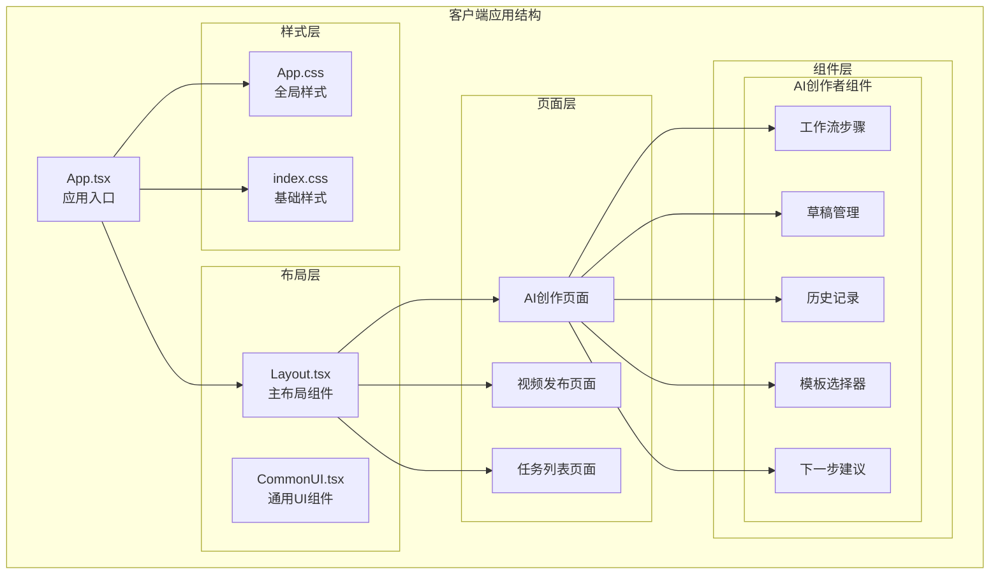
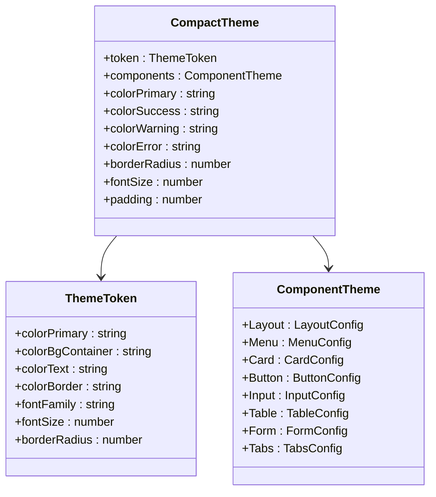
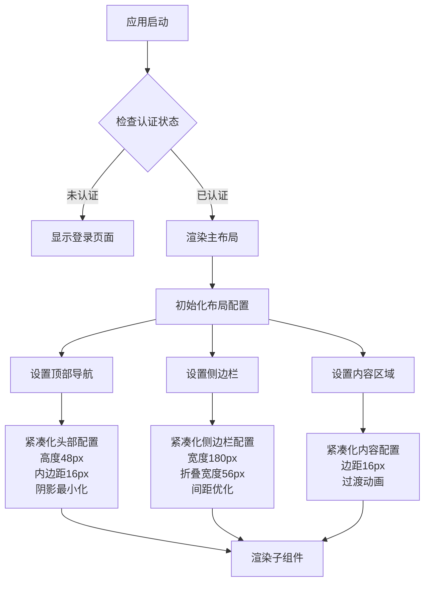
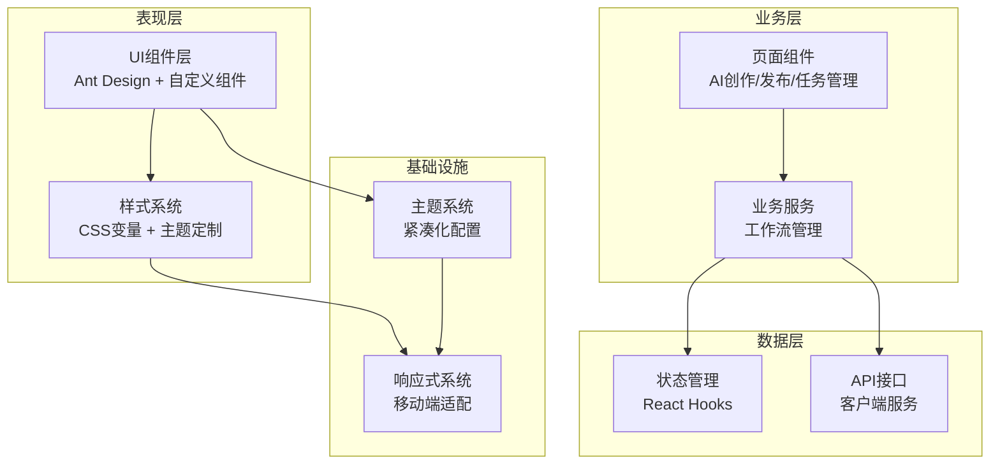
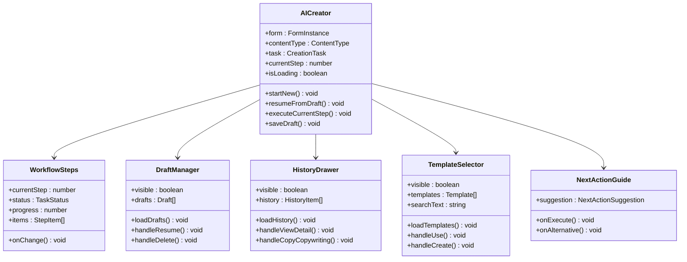
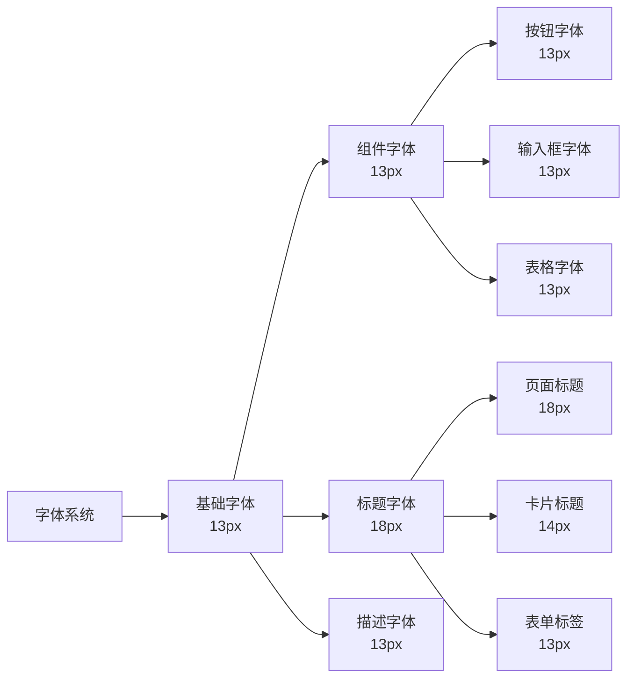
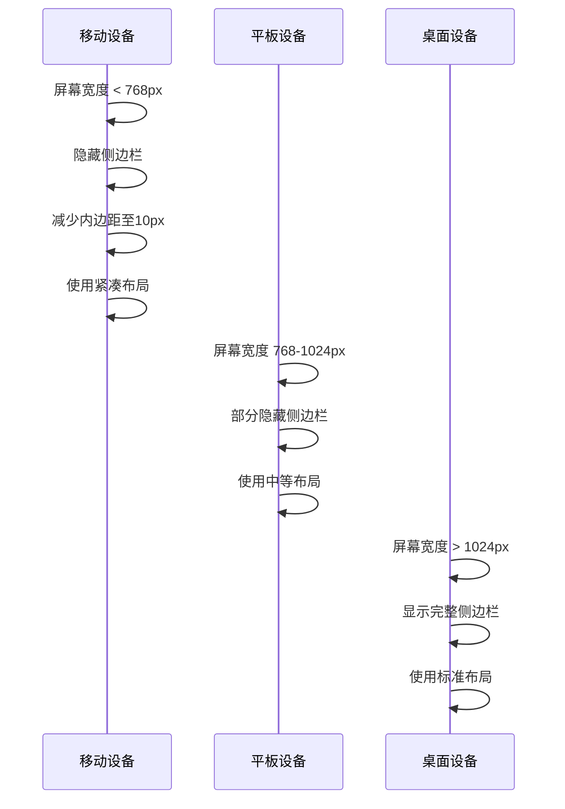
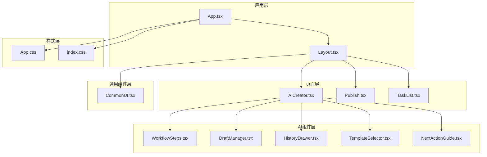
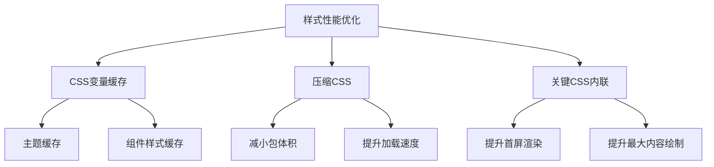

# 全局UI紧凑化

<cite>
**本文档引用的文件**
- [App.tsx](file://web/client/src/App.tsx)
- [Layout.tsx](file://web/client/src/components/Layout.tsx)
- [CommonUI.tsx](file://web/client/src/components/CommonUI.tsx)
- [AICreator.tsx](file://web/client/src/pages/AICreator.tsx)
- [Publish.tsx](file://web/client/src/pages/Publish.tsx)
- [TaskList.tsx](file://web/client/src/pages/TaskList.tsx)
- [App.css](file://web/client/src/App.css)
- [index.css](file://web/client/src/index.css)
- [WorkflowSteps.tsx](file://web/client/src/components/ai-creator/WorkflowSteps.tsx)
- [DraftManager.tsx](file://web/client/src/components/ai-creator/DraftManager.tsx)
- [HistoryDrawer.tsx](file://web/client/src/components/ai-creator/HistoryDrawer.tsx)
- [TemplateSelector.tsx](file://web/client/src/components/ai-creator/TemplateSelector.tsx)
- [NextActionGuide.tsx](file://web/client/src/components/ai-creator/NextActionGuide.tsx)
</cite>

## 目录
1. [简介](#简介)
2. [项目结构](#项目结构)
3. [核心组件](#核心组件)
4. [架构概览](#架构概览)
5. [详细组件分析](#详细组件分析)
6. [依赖关系分析](#依赖关系分析)
7. [性能考虑](#性能考虑)
8. [故障排除指南](#故障排除指南)
9. [结论](#结论)

## 简介

本项目实现了全面的全局UI紧凑化设计系统，采用Ant Design主题定制与CSS变量相结合的方式，打造了现代化、高效、用户体验友好的界面设计。该设计系统专注于提升信息密度、优化交互效率，并确保在不同设备上的良好适配性。

设计系统的核心特点包括：
- **简约紧凑风格**：通过减少视觉元素和优化间距，最大化信息展示密度
- **统一设计语言**：基于Ant Design的深度定制，确保组件一致性
- **响应式适配**：针对不同屏幕尺寸提供最优的布局方案
- **高性能渲染**：优化的组件结构和样式系统，提升整体性能

## 项目结构

项目采用模块化的前端架构，主要分为以下几个层次：

**图表来源**
- [App.tsx:1-207](file://web/client/src/App.tsx#L1-L207)
- [Layout.tsx:1-300](file://web/client/src/components/Layout.tsx#L1-L300)
- [App.css:1-538](file://web/client/src/App.css#L1-L538)

**章节来源**
- [App.tsx:1-207](file://web/client/src/App.tsx#L1-L207)
- [Layout.tsx:1-300](file://web/client/src/components/Layout.tsx#L1-L300)
- [App.css:1-538](file://web/client/src/App.css#L1-L538)

## 核心组件

### Ant Design主题定制系统

项目实现了深度定制的Ant Design主题，通过`compactTheme`配置实现了全局UI紧凑化：

**图表来源**
- [App.tsx:14-119](file://web/client/src/App.tsx#L14-L119)

### 布局管理系统

主布局组件实现了响应式布局和紧凑化设计：

**图表来源**
- [Layout.tsx:39-296](file://web/client/src/components/Layout.tsx#L39-L296)

**章节来源**
- [App.tsx:14-119](file://web/client/src/App.tsx#L14-L119)
- [Layout.tsx:39-296](file://web/client/src/components/Layout.tsx#L39-L296)

## 架构概览

整个UI紧凑化系统采用分层架构设计，确保了良好的可维护性和扩展性：

**图表来源**
- [App.tsx:196-204](file://web/client/src/App.tsx#L196-L204)
- [App.css:6-59](file://web/client/src/App.css#L6-L59)

## 详细组件分析

### AI创作页面组件体系

AI创作页面实现了完整的创作工作流，包含多个专门的组件：

**图表来源**
- [AICreator.tsx:68-681](file://web/client/src/pages/AICreator.tsx#L68-L681)
- [WorkflowSteps.tsx:122-190](file://web/client/src/components/ai-creator/WorkflowSteps.tsx#L122-L190)
- [DraftManager.tsx:75-217](file://web/client/src/components/ai-creator/DraftManager.tsx#L75-L217)
- [HistoryDrawer.tsx:80-331](file://web/client/src/components/ai-creator/HistoryDrawer.tsx#L80-L331)
- [TemplateSelector.tsx:62-370](file://web/client/src/components/ai-creator/TemplateSelector.tsx#L62-L370)
- [NextActionGuide.tsx:53-146](file://web/client/src/components/ai-creator/NextActionGuide.tsx#L53-L146)

### 紧凑化设计实现细节

#### 间距系统优化

项目采用了精细化的间距控制系统，通过CSS变量实现统一的间距标准：

| 间距类别 | 值 | 用途 |
|---------|-----|------|
| `--spacing-xs` | 6px | 极小间距，用于微小元素间隔 |
| `--spacing-sm` | 10px | 小间距，用于小组件间隔 |
| `--spacing` | 12px | 标准间距，用于常规元素间隔 |
| `--spacing-lg` | 16px | 大间距，用于卡片和区域间隔 |
| `--spacing-xl` | 24px | 超大间距，用于页面区域分隔 |

#### 字体系统优化

**图表来源**
- [App.css:7-59](file://web/client/src/App.css#L7-L59)
- [App.tsx:15-52](file://web/client/src/App.tsx#L15-L52)

#### 圆角系统优化

项目实现了多层次的圆角系统，平衡了现代感和实用性：

| 圆角级别 | 值 | 用途 |
|---------|-----|------|
| `--border-radius-sm` | 4px | 小圆角，用于标签和按钮 |
| `--border-radius` | 6px | 标准圆角，用于卡片和表单 |
| `--border-radius-lg` | 8px | 大圆角，用于主要容器 |

**章节来源**
- [App.css:36-52](file://web/client/src/App.css#L36-L52)
- [App.tsx:35-48](file://web/client/src/App.tsx#L35-L48)

### 响应式设计实现

项目实现了完整的响应式设计系统，确保在不同设备上的最佳体验：

**图表来源**
- [App.css:479-496](file://web/client/src/App.css#L479-L496)
- [Layout.tsx:189-248](file://web/client/src/components/Layout.tsx#L189-L248)

**章节来源**
- [App.css:479-496](file://web/client/src/App.css#L479-L496)
- [Layout.tsx:189-248](file://web/client/src/components/Layout.tsx#L189-L248)

## 依赖关系分析

项目中的组件依赖关系体现了清晰的层次结构：

**图表来源**
- [App.tsx:196-204](file://web/client/src/App.tsx#L196-L204)
- [AICreator.tsx:44-51](file://web/client/src/pages/AICreator.tsx#L44-L51)

**章节来源**
- [App.tsx:196-204](file://web/client/src/App.tsx#L196-L204)
- [AICreator.tsx:44-51](file://web/client/src/pages/AICreator.tsx#L44-L51)

## 性能考虑

### 渲染优化策略

项目采用了多种性能优化技术：

1. **组件懒加载**：页面组件按需加载，减少初始包体积
2. **虚拟滚动**：大量数据展示时使用虚拟滚动技术
3. **防抖处理**：输入组件使用防抖机制减少不必要的重渲染
4. **记忆化计算**：复杂计算使用useMemo和useCallback优化

### 样式性能优化

**图表来源**
- [App.css:1-538](file://web/client/src/App.css#L1-L538)
- [index.css:1-73](file://web/client/src/index.css#L1-L73)

## 故障排除指南

### 常见问题及解决方案

#### 主题配置问题

**问题**：组件样式不符合预期
**解决方案**：
1. 检查`compactTheme`配置是否正确应用
2. 验证CSS变量是否正确继承
3. 确认Ant Design版本兼容性

#### 响应式布局问题

**问题**：移动端显示异常
**解决方案**：
1. 检查媒体查询断点设置
2. 验证触摸事件处理
3. 确认字体缩放比例

#### 性能问题

**问题**：页面加载缓慢
**解决方案**：
1. 检查组件渲染频率
2. 优化图片资源
3. 实施代码分割

**章节来源**
- [App.tsx:146-158](file://web/client/src/App.tsx#L146-L158)
- [Layout.tsx:40-92](file://web/client/src/components/Layout.tsx#L40-L92)

## 结论

本项目的全局UI紧凑化设计系统成功实现了以下目标：

1. **设计一致性**：通过深度定制的Ant Design主题，确保了全局设计的一致性
2. **用户体验优化**：紧凑化设计提升了信息密度，同时保持了良好的可读性
3. **性能表现**：优化的组件结构和样式系统提供了出色的性能表现
4. **可维护性**：清晰的模块化架构便于后续的功能扩展和维护

该设计系统的成功实施为类似的企业级应用提供了优秀的参考范例，展示了如何在保证用户体验的同时实现高效的界面设计。