# 发布页面增强

<cite>
**本文档引用的文件**
- [src/index.ts](file://src/index.ts)
- [web/client/src/pages/Publish.tsx](file://web/client/src/pages/Publish.tsx)
- [web/server/src/routes/publish.ts](file://web/server/src/routes/publish.ts)
- [src/services/publish-service.ts](file://src/services/publish-service.ts)
- [src/api/video-publish.ts](file://src/api/video-publish.ts)
- [web/client/src/components/publish/ImageTextEditor.tsx](file://web/client/src/components/publish/ImageTextEditor.tsx)
- [web/client/src/components/publish/PublishErrorDisplay.tsx](file://web/client/src/components/publish/PublishErrorDisplay.tsx)
- [src/models/types.ts](file://src/models/types.ts)
- [web/client/src/api/client.ts](file://web/client/src/api/client.ts)
- [web/server/src/services/publisher.ts](file://web/server/src/services/publisher.ts)
- [web/client/src/components/publish/ImageStyleEditor.tsx](file://web/client/src/components/publish/ImageStyleEditor.tsx)
- [web/client/src/components/publish/ImageTextPreview.tsx](file://web/client/src/components/publish/ImageTextPreview.tsx)
- [web/client/src/hooks/useCreationWorkflow.ts](file://web/client/src/hooks/useCreationWorkflow.ts)
- [web/client/src/pages/AICreator.tsx](file://web/client/src/pages/AICreator.tsx)
</cite>

## 目录
1. [项目概述](#项目概述)
2. [发布页面架构](#发布页面架构)
3. [核心组件分析](#核心组件分析)
4. [发布流程详解](#发布流程详解)
5. [错误处理机制](#错误处理机制)
6. [图文发布功能](#图文发布功能)
7. [定时发布系统](#定时发布系统)
8. [性能优化策略](#性能优化策略)
9. [用户体验增强](#用户体验增强)
10. [安全与可靠性](#安全与可靠性)
11. [部署与配置](#部署与配置)
12. [总结](#总结)

## 项目概述

这是一个基于抖音开放平台的视频发布管理系统，提供了完整的发布页面增强功能。系统采用前后端分离架构，前端使用React + Ant Design构建用户界面，后端使用TypeScript提供API服务，核心发布逻辑封装在独立的服务层中。

### 主要特性
- **双发布模式**：支持视频发布和图文发布两种模式
- **智能重试机制**：自动识别错误类型并执行相应重试策略
- **定时发布**：支持未来时间的定时内容发布
- **错误分类处理**：针对不同类型的错误提供友好的用户反馈
- **进度监控**：实时显示上传和发布进度
- **草稿管理**：支持创作过程中的草稿保存和恢复

## 发布页面架构

发布页面采用模块化设计，主要分为以下几个层次：

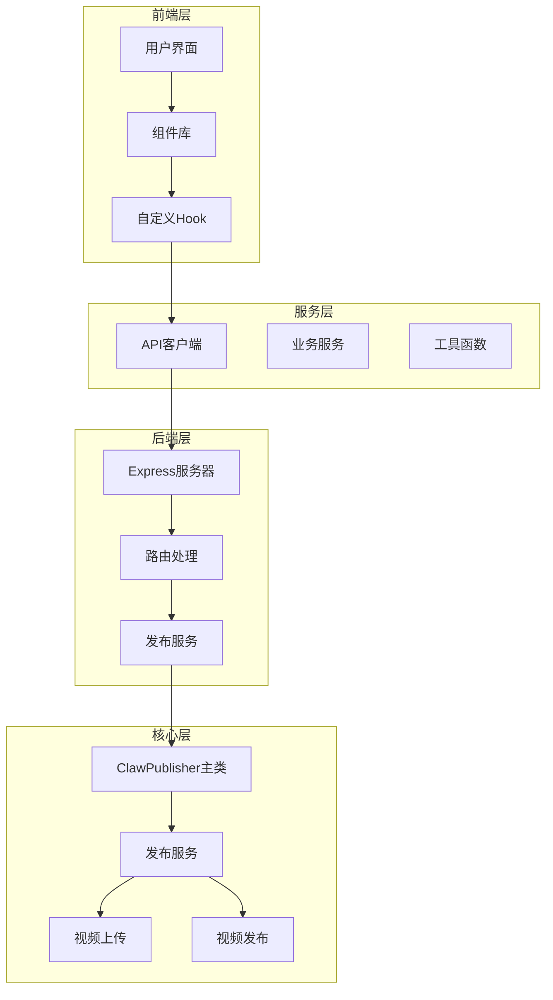

**图表来源**
- [src/index.ts:32-70](file://src/index.ts#L32-L70)
- [web/server/src/routes/publish.ts:1-464](file://web/server/src/routes/publish.ts#L1-L464)

**章节来源**
- [src/index.ts:1-270](file://src/index.ts#L1-L270)
- [web/server/src/routes/publish.ts:1-464](file://web/server/src/routes/publish.ts#L1-L464)

## 核心组件分析

### ClawPublisher 主类

ClawPublisher是整个发布系统的核心控制器，负责协调各个子系统的协作。

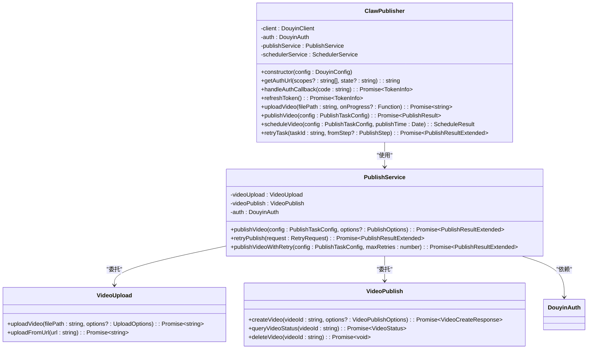

**图表来源**
- [src/index.ts:32-266](file://src/index.ts#L32-L266)
- [src/services/publish-service.ts:31-413](file://src/services/publish-service.ts#L31-L413)
- [src/api/video-publish.ts:15-174](file://src/api/video-publish.ts#L15-L174)

### 发布服务架构

发布服务采用分层设计，每个层级都有明确的职责分工：

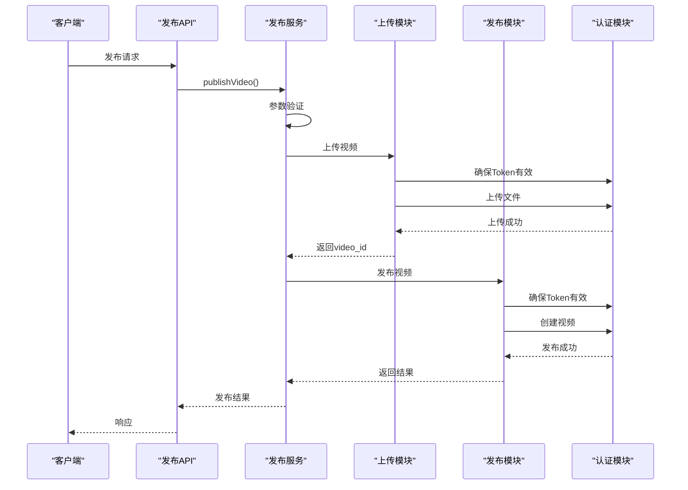

**图表来源**
- [src/services/publish-service.ts:48-181](file://src/services/publish-service.ts#L48-L181)
- [src/api/video-publish.ts:30-54](file://src/api/video-publish.ts#L30-L54)

**章节来源**
- [src/index.ts:32-266](file://src/index.ts#L32-L266)
- [src/services/publish-service.ts:31-413](file://src/services/publish-service.ts#L31-L413)

## 发布流程详解

### 视频发布流程

视频发布流程包含三个主要步骤：参数验证、视频上传、内容发布。

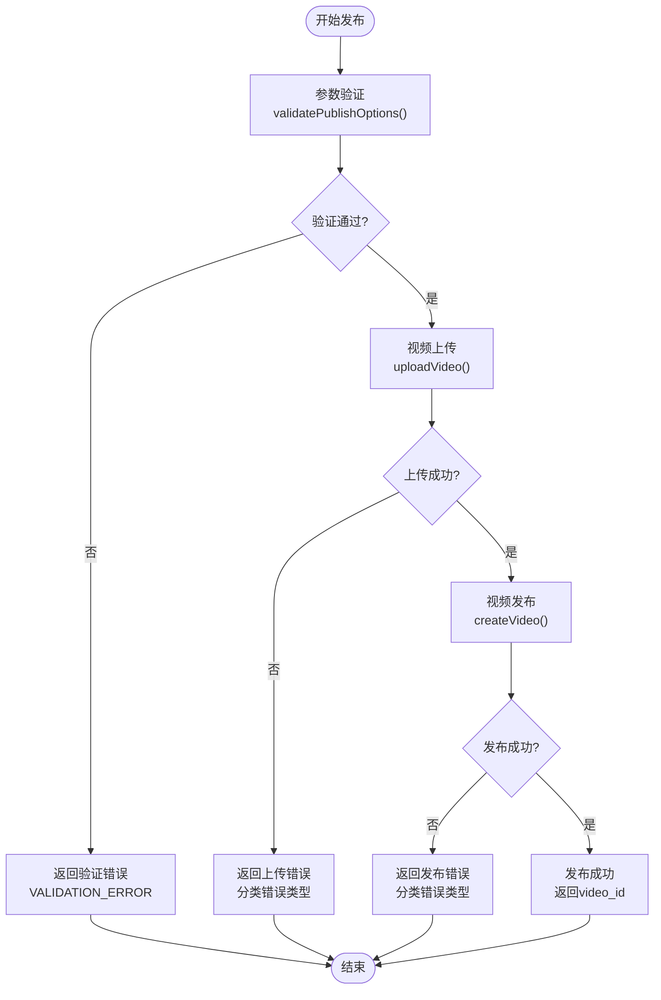

**图表来源**
- [src/services/publish-service.ts:48-181](file://src/services/publish-service.ts#L48-L181)
- [src/api/video-publish.ts:30-54](file://src/api/video-publish.ts#L30-L54)

### 错误分类与重试机制

系统实现了智能的错误分类和重试机制：

| 错误类型 | 描述 | 可重试 | 建议操作 |
|---------|------|--------|----------|
| TIMEOUT | 请求超时 | 是 | 等待后重试 |
| TOKEN_EXPIRED | 登录过期 | 是 | 重新授权 |
| MATERIAL_ERROR | 素材异常 | 否 | 检查素材质量 |
| RATE_LIMIT | 平台限流 | 是 | 等待后重试 |
| PERMISSION_DENIED | 权限不足 | 否 | 检查权限设置 |
| NETWORK_ERROR | 网络错误 | 是 | 检查网络连接 |
| VALIDATION_ERROR | 参数错误 | 否 | 修正参数 |

**章节来源**
- [src/services/publish-service.ts:48-181](file://src/services/publish-service.ts#L48-L181)
- [web/client/src/components/publish/PublishErrorDisplay.tsx:17-120](file://web/client/src/components/publish/PublishErrorDisplay.tsx#L17-L120)

## 错误处理机制

### 错误分类系统

系统实现了详细的错误分类机制，为用户提供友好的错误反馈：

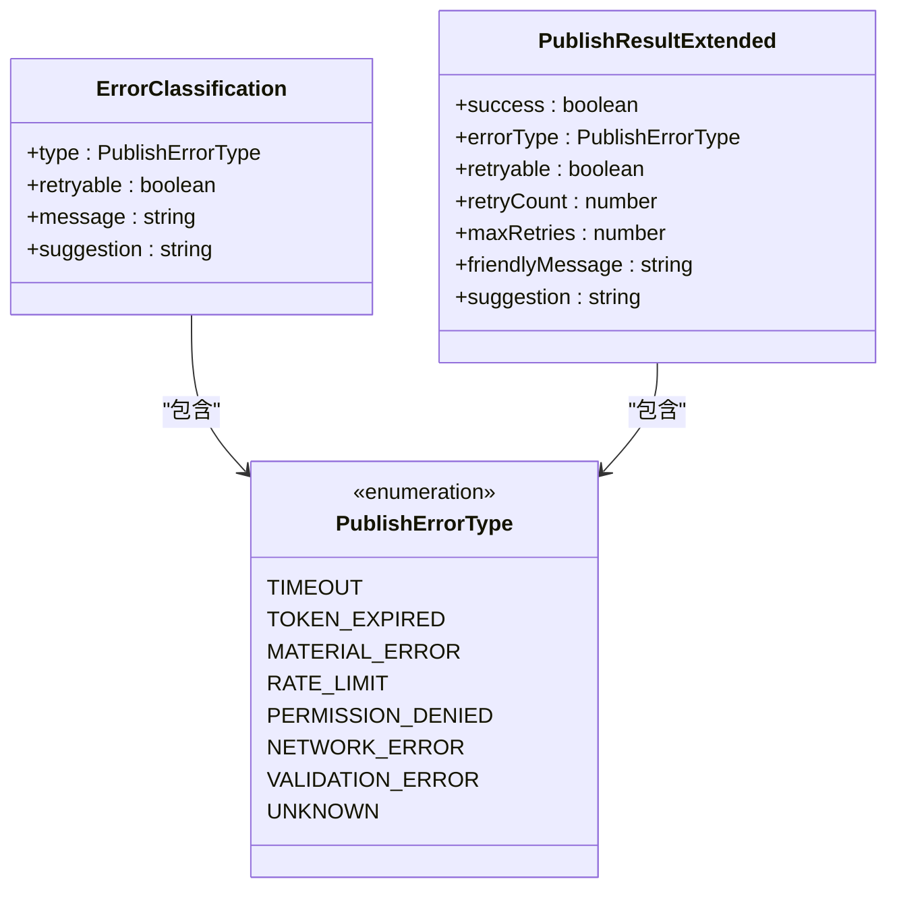

**图表来源**
- [src/models/types.ts:524-558](file://src/models/types.ts#L524-L558)
- [web/client/src/components/publish/PublishErrorDisplay.tsx:17-27](file://web/client/src/components/publish/PublishErrorDisplay.tsx#L17-L27)

### 重试策略

系统支持灵活的重试策略，可以根据错误类型和重试次数动态调整：

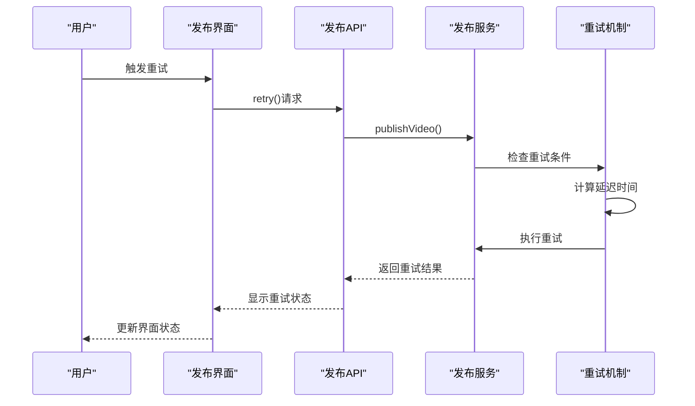

**图表来源**
- [src/services/publish-service.ts:188-249](file://src/services/publish-service.ts#L188-L249)

**章节来源**
- [web/client/src/components/publish/PublishErrorDisplay.tsx:141-294](file://web/client/src/components/publish/PublishErrorDisplay.tsx#L141-L294)
- [src/services/publish-service.ts:188-249](file://src/services/publish-service.ts#L188-L249)

## 图文发布功能

### 图片编辑器

图文发布功能提供了强大的图片编辑能力：

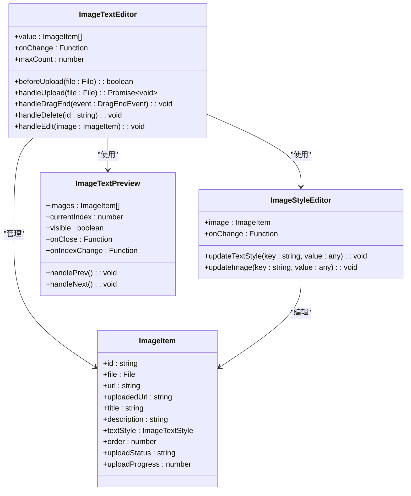

**图表来源**
- [web/client/src/components/publish/ImageTextEditor.tsx:219-490](file://web/client/src/components/publish/ImageTextEditor.tsx#L219-L490)
- [web/client/src/components/publish/ImageStyleEditor.tsx:49-295](file://web/client/src/components/publish/ImageStyleEditor.tsx#L49-L295)
- [web/client/src/components/publish/ImageTextPreview.tsx:20-259](file://web/client/src/components/publish/ImageTextPreview.tsx#L20-L259)

### 图片样式编辑

图片样式编辑器提供了丰富的自定义选项：

| 功能 | 选项 | 限制 |
|------|------|------|
| 字体 | 默认字体、宋体、黑体、微软雅黑、Arial | 无 |
| 字号 | 12-48像素 | 步长1 |
| 文字颜色 | 颜色选择器 | RGBA格式 |
| 背景颜色 | 颜色选择器 | RGBA格式 |
| 文字位置 | 顶部、居中、底部 | 三选一 |
| 对齐方式 | 左对齐、居中、右对齐 | 三选一 |

**章节来源**
- [web/client/src/components/publish/ImageTextEditor.tsx:1-490](file://web/client/src/components/publish/ImageTextEditor.tsx#L1-L490)
- [web/client/src/components/publish/ImageStyleEditor.tsx:1-295](file://web/client/src/components/publish/ImageStyleEditor.tsx#L1-L295)
- [web/client/src/components/publish/ImageTextPreview.tsx:1-259](file://web/client/src/components/publish/ImageTextPreview.tsx#L1-L259)

## 定时发布系统

### 任务调度机制

定时发布系统提供了完整的任务调度和管理功能：

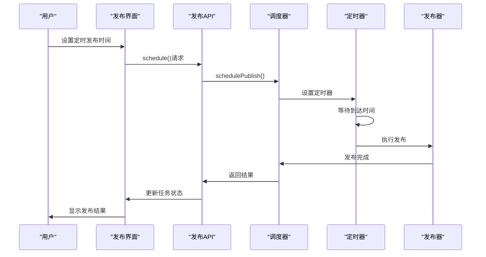

**图表来源**
- [web/server/src/routes/publish.ts:66-98](file://web/server/src/routes/publish.ts#L66-L98)
- [web/server/src/services/publisher.ts:136-151](file://web/server/src/services/publisher.ts#L136-L151)

### 任务状态管理

定时发布任务的状态流转：

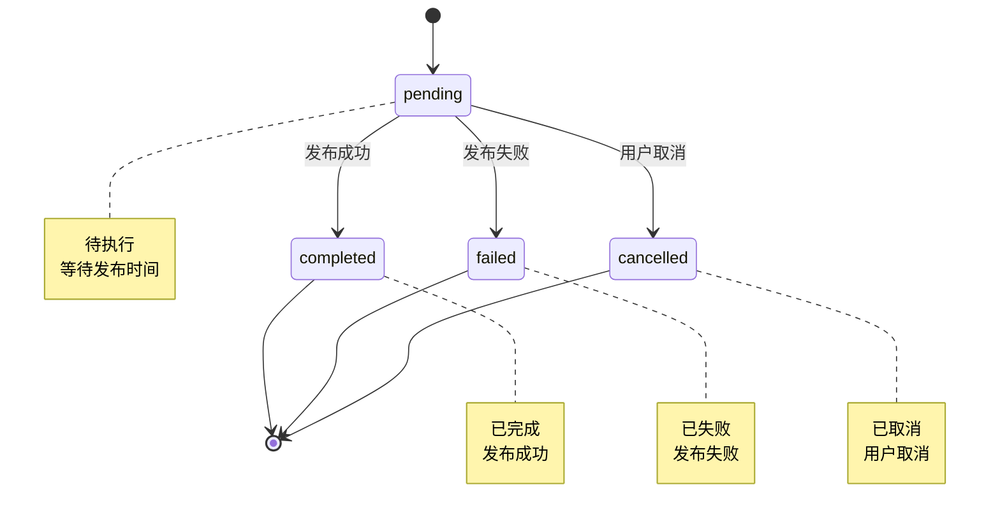

**图表来源**
- [web/server/src/routes/publish.ts:19-28](file://web/server/src/routes/publish.ts#L19-L28)

**章节来源**
- [web/server/src/routes/publish.ts:66-208](file://web/server/src/routes/publish.ts#L66-L208)
- [web/server/src/services/publisher.ts:136-213](file://web/server/src/services/publisher.ts#L136-L213)

## 性能优化策略

### 上传优化

系统实现了多种上传优化策略：

1. **断点续传**：支持大文件的断点续传功能
2. **并发上传**：支持多文件并发上传
3. **进度监控**：实时显示上传进度和速度
4. **错误恢复**：网络中断后自动恢复上传

### 缓存策略

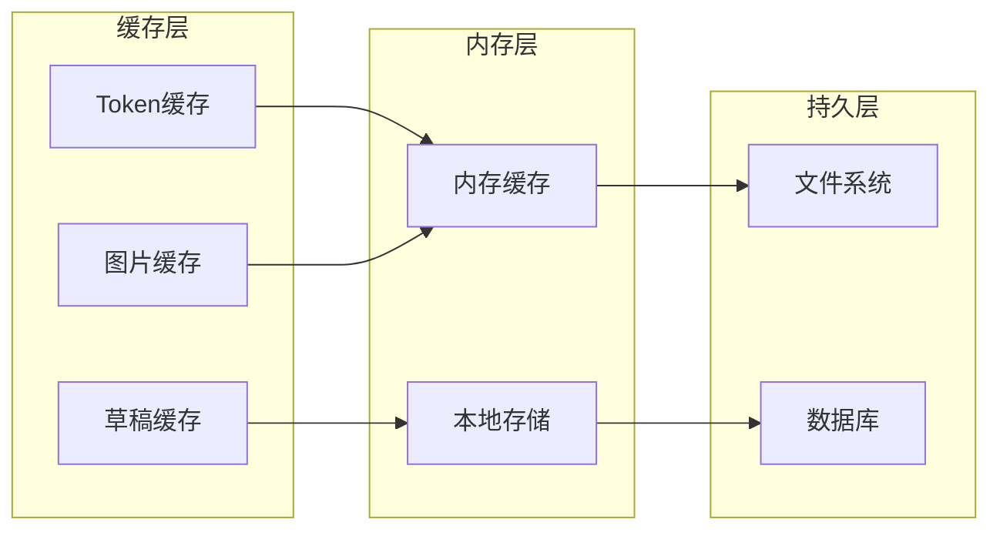

### 性能监控

系统提供了完善的性能监控机制：

- **上传速度监控**：实时显示上传速度和剩余时间
- **内存使用监控**：监控图片预览的内存使用情况
- **错误率统计**：统计各类错误的发生频率
- **响应时间监控**：监控API请求的响应时间

## 用户体验增强

### 界面设计

发布页面采用了现代化的设计理念：

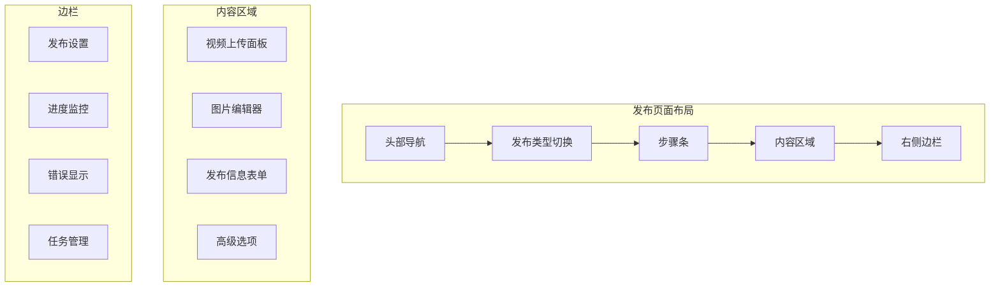

### 交互优化

1. **拖拽上传**：支持拖拽文件到上传区域
2. **预览功能**：实时预览上传的文件
3. **进度反馈**：详细的上传进度和状态反馈
4. **错误提示**：友好的错误提示和解决方案
5. **自动保存**：自动保存用户的输入内容

**章节来源**
- [web/client/src/pages/Publish.tsx:58-417](file://web/client/src/pages/Publish.tsx#L58-L417)

## 安全与可靠性

### 认证安全

系统实现了多层次的安全保护：

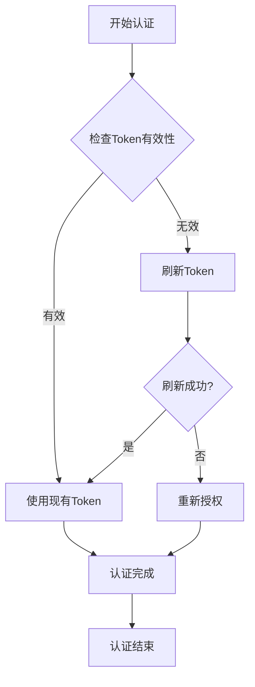

### 数据保护

1. **Token加密存储**：敏感信息采用加密方式存储
2. **请求签名**：所有API请求都进行数字签名
3. **访问控制**：严格的权限控制和访问限制
4. **日志审计**：完整的操作日志记录

### 系统可靠性

1. **故障转移**：支持多节点的故障转移
2. **负载均衡**：自动负载均衡和流量控制
3. **健康检查**：持续的系统健康状态监控
4. **备份恢复**：自动备份和快速恢复机制

## 部署与配置

### 环境配置

系统支持多种部署方式：

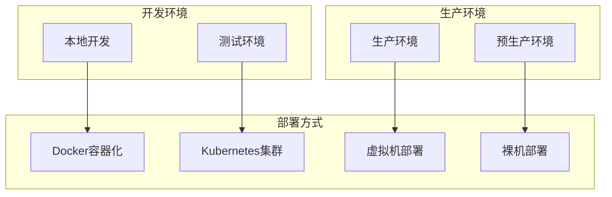

### 配置管理

系统提供了灵活的配置管理机制：

1. **环境变量配置**：支持通过环境变量配置系统参数
2. **配置文件管理**：支持JSON/YAML格式的配置文件
3. **动态配置更新**：支持运行时配置的热更新
4. **配置验证**：自动验证配置的有效性和完整性

### 监控与运维

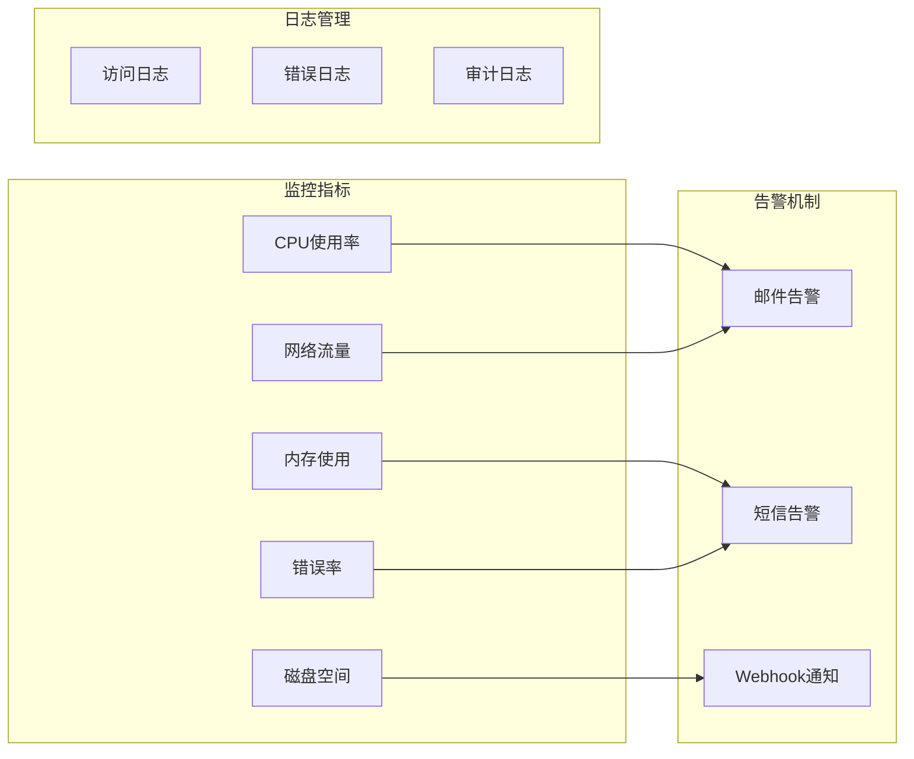

## 总结

发布页面增强系统是一个功能完整、架构清晰、用户体验优秀的发布管理平台。系统的主要优势包括：

### 技术优势
- **模块化设计**：清晰的分层架构，便于维护和扩展
- **智能错误处理**：完善的错误分类和重试机制
- **高性能优化**：多种性能优化策略确保系统稳定运行
- **安全可靠**：多层次的安全保护机制

### 用户体验优势
- **直观易用**：简洁明了的操作界面
- **实时反馈**：详细的进度和状态反馈
- **智能辅助**：AI驱动的内容创作和质量检测
- **灵活配置**：丰富的发布选项和自定义能力

### 业务价值
- **提升效率**：自动化的工作流程减少人工干预
- **保证质量**：严格的质量控制确保内容质量
- **降低成本**：高效的资源利用降低运营成本
- **增强竞争力**：先进的技术栈提升产品竞争力

该系统为抖音内容创作者提供了专业、便捷、高效的内容发布解决方案，是现代内容营销的重要工具。