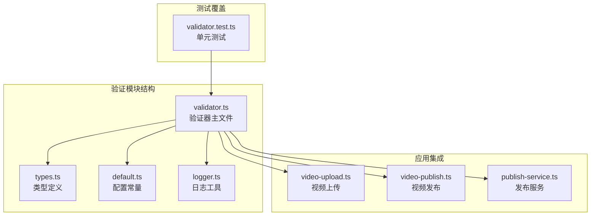
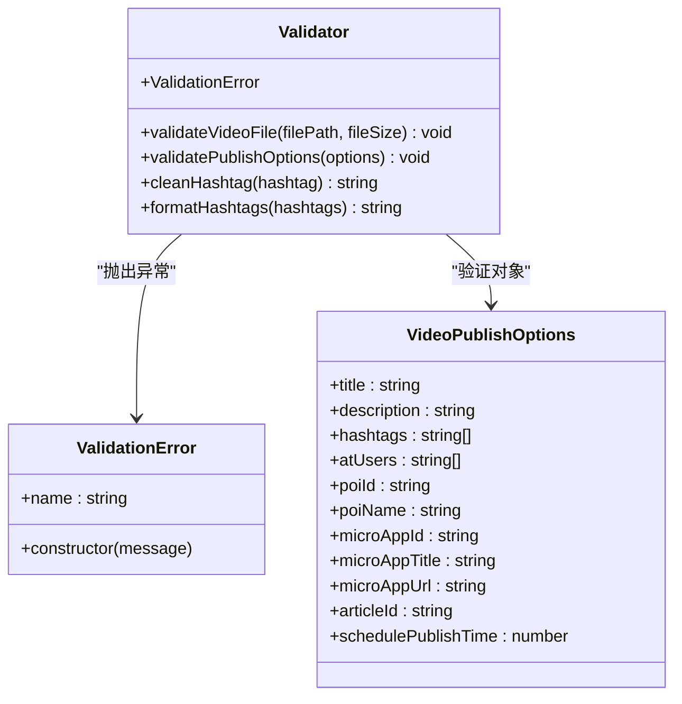
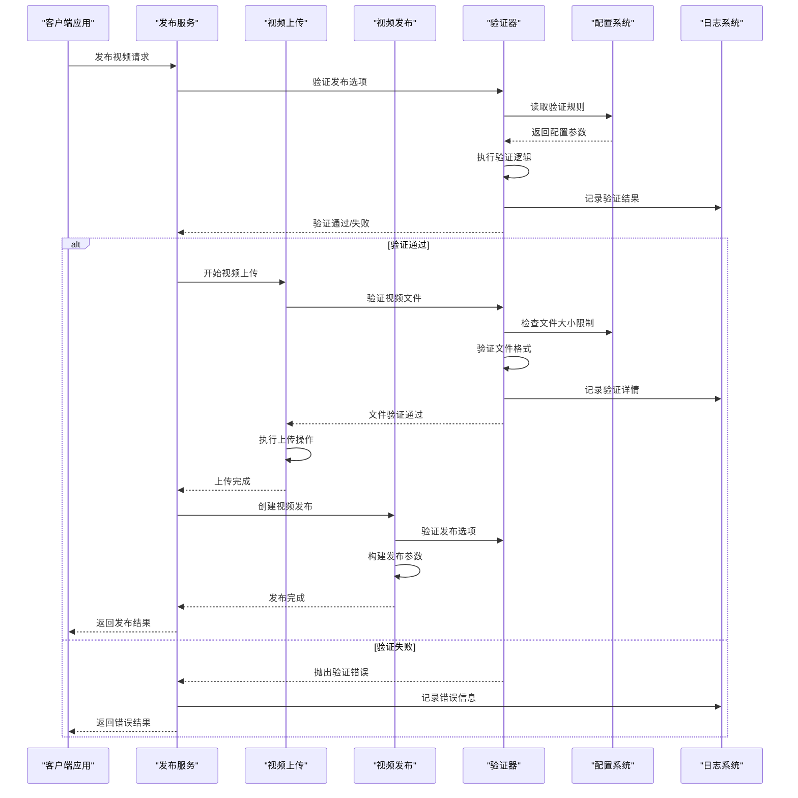
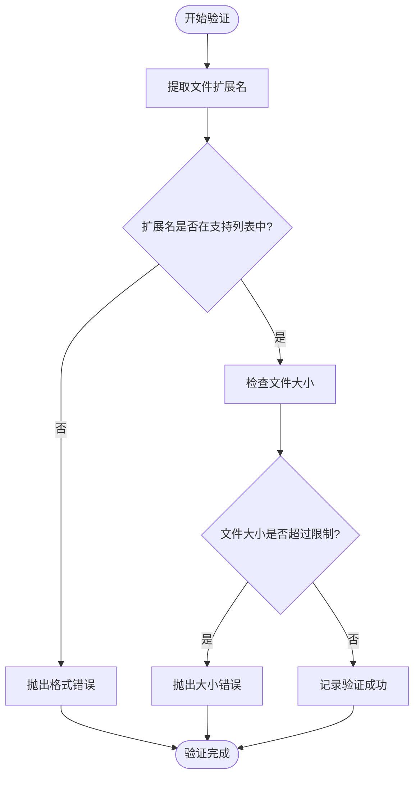
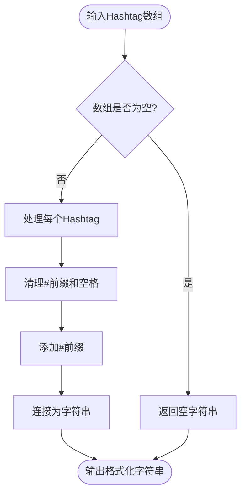
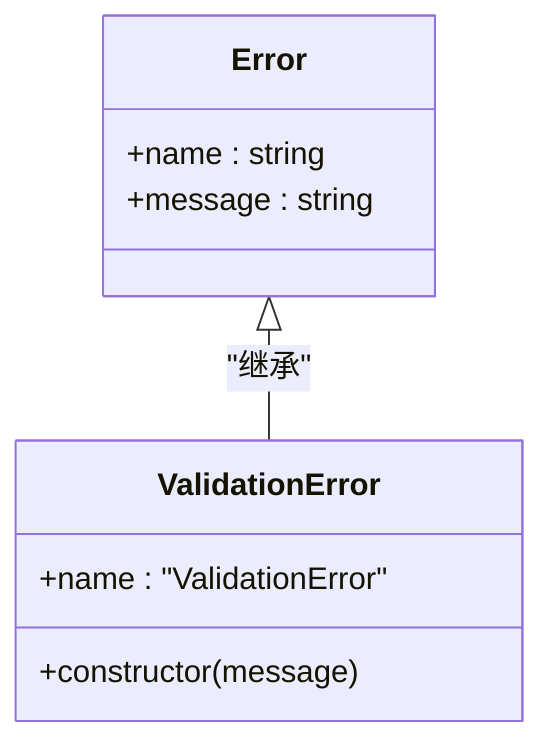
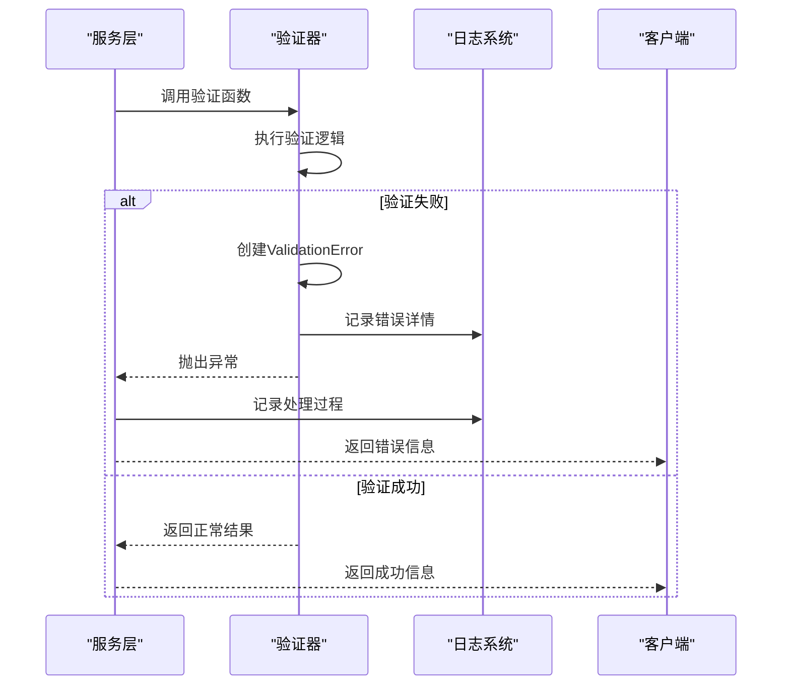
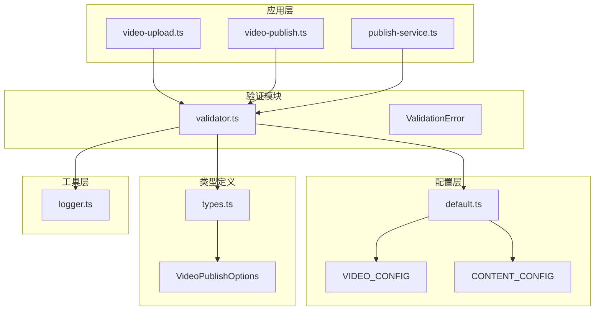
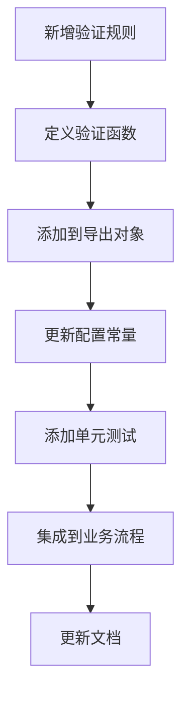

# 参数验证

<cite>
**本文档引用的文件**
- [validator.ts](file://src/utils/validator.ts)
- [validator.test.ts](file://tests/unit/validator.test.ts)
- [types.ts](file://src/models/types.ts)
- [video-upload.ts](file://src/api/video-upload.ts)
- [video-publish.ts](file://src/api/video-publish.ts)
- [publish-service.ts](file://src/services/publish-service.ts)
- [default.ts](file://config/default.ts)
- [logger.ts](file://src/utils/logger.ts)
- [example.ts](file://example.ts)
</cite>

## 目录
1. [简介](#简介)
2. [项目结构](#项目结构)
3. [核心组件](#核心组件)
4. [架构概览](#架构概览)
5. [详细组件分析](#详细组件分析)
6. [依赖关系分析](#依赖关系分析)
7. [性能考虑](#性能考虑)
8. [故障排除指南](#故障排除指南)
9. [结论](#结论)

## 简介

参数验证模块是 ClawOperations 系统中的关键质量保证组件，专门负责确保视频上传和发布流程中的数据完整性与合规性。该模块提供了全面的参数验证功能，包括文件类型验证、文件大小限制、内容长度检查、定时发布时间验证等核心验证功能。

Validator 模块采用模块化设计，通过清晰的职责分离实现了高内聚、低耦合的架构模式。它不仅提供了基础的验证功能，还包含了错误处理机制、日志记录和用户友好的错误提示生成功能。

## 项目结构

参数验证模块位于 `src/utils/validator.ts` 文件中，与相关的配置文件和测试文件共同构成了完整的验证系统：

**图表来源**
- [validator.ts:1-116](file://src/utils/validator.ts#L1-L116)
- [types.ts:1-201](file://src/models/types.ts#L1-L201)
- [default.ts:1-49](file://config/default.ts#L1-L49)

**章节来源**
- [validator.ts:1-116](file://src/utils/validator.ts#L1-L116)
- [types.ts:1-201](file://src/models/types.ts#L1-L201)
- [default.ts:1-49](file://config/default.ts#L1-L49)

## 核心组件

### 验证器类结构

Validator 模块采用函数式编程风格，提供了多个独立的验证函数和辅助工具：

**图表来源**
- [validator.ts:10-115](file://src/utils/validator.ts#L10-L115)
- [types.ts:101-124](file://src/models/types.ts#L101-L124)

### 配置常量系统

验证模块依赖于集中化的配置管理，通过 `config/default.ts` 提供了可定制的验证规则：

| 配置类别 | 关键参数 | 默认值 | 用途 |
|---------|---------|--------|------|
| 视频配置 | SUPPORTED_FORMATS | ['mp4', 'mov', 'avi'] | 支持的视频格式列表 |
| 视频配置 | MAX_SIZE | 4GB | 单个视频文件的最大允许大小 |
| 内容配置 | MAX_TITLE_LENGTH | 55字符 | 视频标题的最大长度限制 |
| 内容配置 | MAX_DESCRIPTION_LENGTH | 300字符 | 视频描述的最大长度限制 |
| 内容配置 | MAX_HASHTAG_COUNT | 5个 | hashtag的最大数量限制 |

**章节来源**
- [validator.ts:22-86](file://src/utils/validator.ts#L22-L86)
- [default.ts:26-40](file://config/default.ts#L26-L40)

## 架构概览

参数验证模块在整个系统架构中扮演着质量门控的角色，通过多层次的验证确保数据的完整性和一致性：

**图表来源**
- [publish-service.ts:38-80](file://src/services/publish-service.ts#L38-L80)
- [video-upload.ts:35-54](file://src/api/video-upload.ts#L35-L54)
- [video-publish.ts:30-54](file://src/api/video-publish.ts#L30-L54)
- [validator.ts:45-86](file://src/utils/validator.ts#L45-L86)

## 详细组件分析

### 视频文件验证器

视频文件验证器是验证模块的核心组件，负责确保上传的视频文件符合平台要求：

#### 功能特性

1. **文件格式验证**
   - 支持的格式：MP4、MOV、AVI
   - 通过文件扩展名检查实现
   - 不区分大小写处理

2. **文件大小限制**
   - 最大文件大小：4GB
   - 精确到字节级别的比较
   - 提供人类可读的大小信息

3. **日志记录**
   - 成功验证时记录调试信息
   - 包含文件路径和大小信息

#### 实现原理

**图表来源**
- [validator.ts:22-39](file://src/utils/validator.ts#L22-L39)

**章节来源**
- [validator.ts:22-39](file://src/utils/validator.ts#L22-L39)

### 发布选项验证器

发布选项验证器负责验证视频发布时的各种参数，确保内容符合平台规范：

#### 验证规则

1. **标题长度验证**
   - 最大长度：55个字符
   - 支持中文字符计数

2. **描述长度验证**
   - 最大长度：300个字符
   - 支持多行文本

3. **Hashtag数量限制**
   - 最大数量：5个
   - 自动清理重复的#符号

4. **定时发布时间验证**
   - 必须晚于当前时间
   - 最大提前7天

#### Hashtag处理机制

**图表来源**
- [validator.ts:102-107](file://src/utils/validator.ts#L102-L107)

**章节来源**
- [validator.ts:45-86](file://src/utils/validator.ts#L45-L86)
- [validator.ts:93-107](file://src/utils/validator.ts#L93-L107)

### 错误处理机制

验证模块采用了统一的错误处理策略，通过自定义的 `ValidationError` 类提供一致的错误体验：

#### 错误类型设计

**图表来源**
- [validator.ts:10-15](file://src/utils/validator.ts#L10-L15)

#### 错误传播流程

**图表来源**
- [publish-service.ts:71-79](file://src/services/publish-service.ts#L71-L79)
- [video-upload.ts:92-95](file://src/api/video-upload.ts#L92-L95)

**章节来源**
- [validator.ts:10-15](file://src/utils/validator.ts#L10-L15)
- [publish-service.ts:71-79](file://src/services/publish-service.ts#L71-L79)

## 依赖关系分析

验证模块与其他系统组件之间存在清晰的依赖关系，形成了层次化的架构设计：

**图表来源**
- [validator.ts:1-5](file://src/utils/validator.ts#L1-L5)
- [default.ts:26-40](file://config/default.ts#L26-L40)
- [types.ts:101-124](file://src/models/types.ts#L101-L124)

### 组件耦合度分析

验证模块的设计遵循了低耦合原则：
- **对外依赖**：仅依赖配置常量和日志工具
- **内部封装**：验证逻辑完全封装在模块内部
- **接口稳定**：提供稳定的函数接口供其他模块调用

**章节来源**
- [validator.ts:1-116](file://src/utils/validator.ts#L1-L116)
- [default.ts:1-49](file://config/default.ts#L1-L49)

## 性能考虑

### 验证性能优化

1. **内存效率**
   - 文件大小验证仅读取文件元数据，避免加载整个文件
   - 字符串验证使用原生JavaScript方法，避免额外的依赖

2. **计算复杂度**
   - 文件格式验证：O(n) 时间复杂度，n为支持格式数量
   - 字符长度验证：O(1) 时间复杂度
   - Hashtag格式化：O(m) 时间复杂度，m为Hashtag数量

3. **缓存策略**
   - 配置常量在模块加载时缓存
   - 日志实例按模块创建，避免重复创建

### 扩展新验证规则

验证模块提供了灵活的扩展机制：

**扩展步骤**：
1. 在 `validator.ts` 中定义新的验证函数
2. 将新函数添加到默认导出对象
3. 在 `default.ts` 中添加相应的配置常量
4. 编写对应的单元测试
5. 在业务模块中集成新验证规则

**章节来源**
- [validator.ts:109-115](file://src/utils/validator.ts#L109-L115)
- [default.ts:26-40](file://config/default.ts#L26-L40)

## 故障排除指南

### 常见验证错误及解决方案

#### 文件格式错误
**错误表现**：`不支持的视频格式: xxx，支持的格式: mp4, mov, avi`

**可能原因**：
- 文件扩展名不正确
- 文件实际格式与扩展名不符

**解决方案**：
- 确认文件扩展名正确
- 使用视频转换工具重新编码

#### 文件大小超限
**错误表现**：`视频文件过大: X.XXGB，最大支持: 4GB`

**可能原因**：
- 视频文件超过4GB限制
- 包含大量元数据

**解决方案**：
- 使用视频压缩工具减小文件大小
- 分割大视频文件

#### 内容长度超限
**错误表现**：标题/描述超过最大字符限制

**可能原因**：
- 文本内容超出字符限制
- 包含隐藏字符

**解决方案**：
- 简化标题和描述内容
- 移除不必要的空格和特殊字符

#### 定时发布时间错误
**错误表现**：定时发布时间必须晚于当前时间或超过7天

**可能原因**：
- 设置了过去的时间
- 设置了超过7天后的时间

**解决方案**：
- 确认当前时间设置
- 调整到允许的时间范围内

### 调试技巧

1. **启用详细日志**
   - 设置 `LOG_LEVEL=debug` 环境变量
   - 查看验证过程的详细信息

2. **单元测试验证**
   - 运行 `npm test` 查看测试覆盖率
   - 检查特定场景的测试用例

3. **配置验证**
   - 检查 `config/default.ts` 中的配置值
   - 确认配置常量的合理性

**章节来源**
- [validator.test.ts:10-200](file://tests/unit/validator.test.ts#L10-L200)
- [logger.ts:10-12](file://src/utils/logger.ts#L10-L12)

## 结论

参数验证模块通过精心设计的架构和完善的验证机制，为 ClawOperations 系统提供了可靠的质量保证。模块具有以下优势：

1. **功能完整性**：涵盖了视频上传和发布流程中的所有关键验证需求
2. **易于扩展**：提供了清晰的扩展接口和配置机制
3. **错误友好**：提供了详细的错误信息和用户友好的提示
4. **性能高效**：优化的算法和内存使用策略
5. **测试完备**：全面的单元测试覆盖所有验证场景

验证模块的成功实施为整个系统的稳定运行奠定了坚实基础，为用户提供了一个可靠、高效的视频发布解决方案。通过持续的维护和优化，该模块将继续支持 ClawOperations 系统的发展需求。