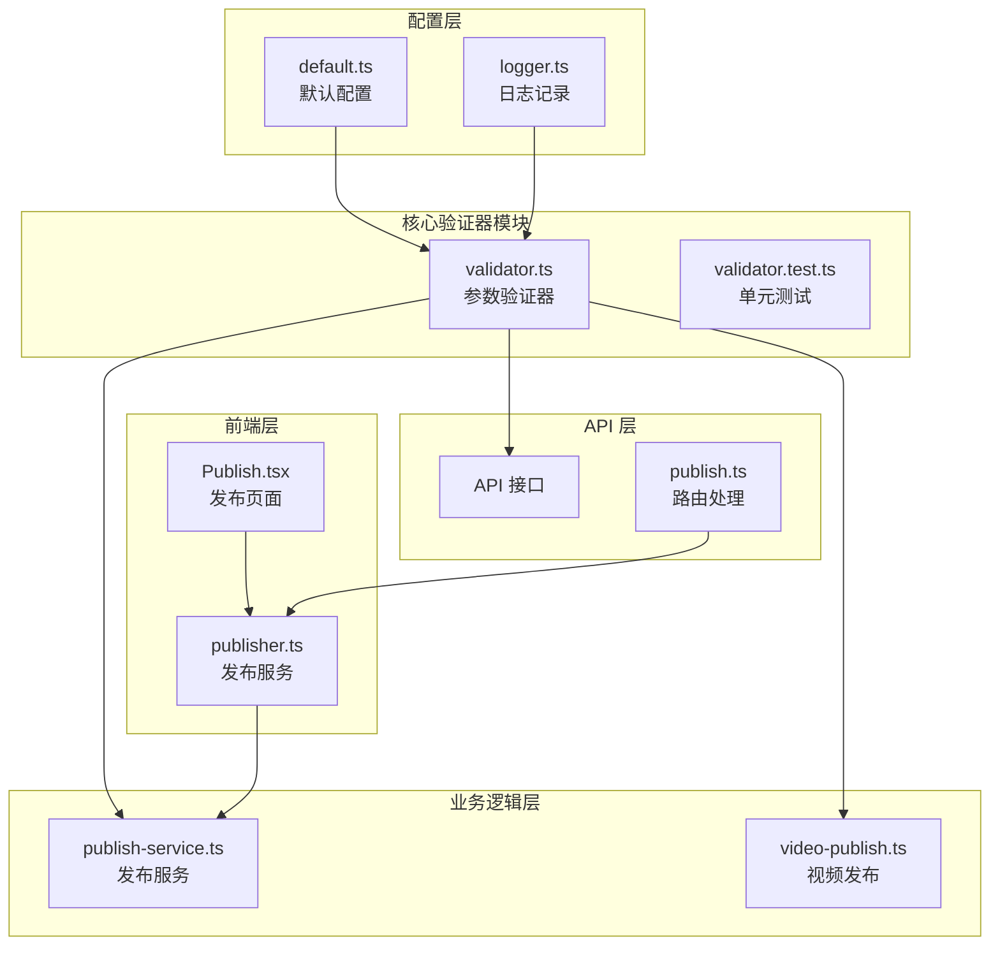
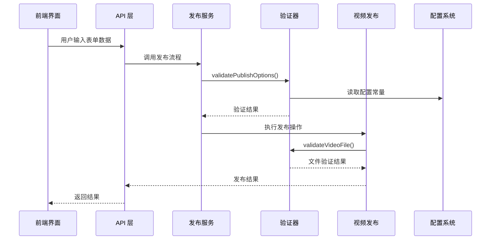
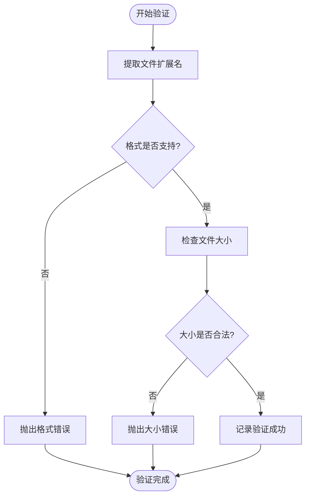
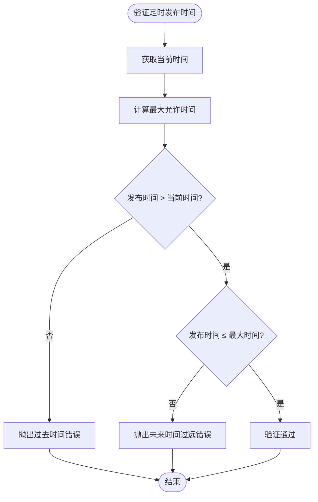
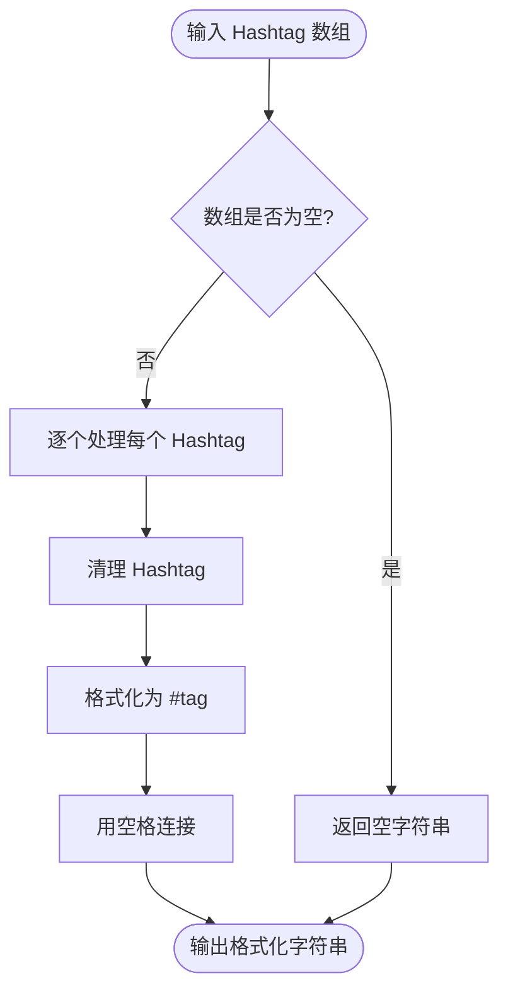
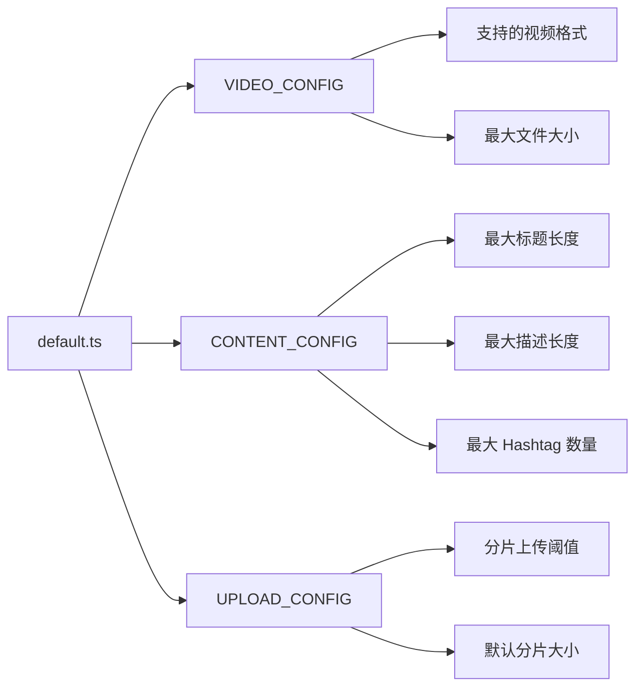
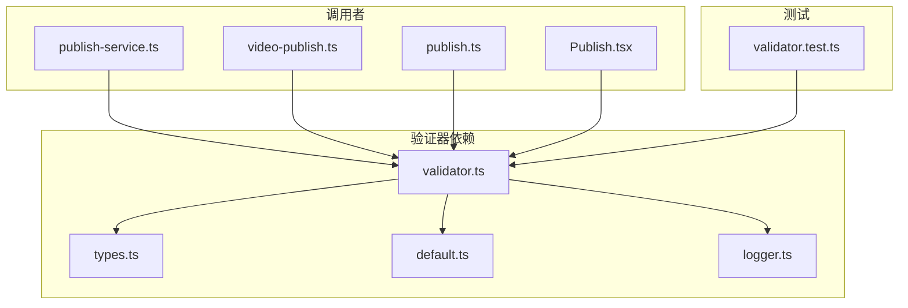

# 参数验证器

<cite>
**本文档引用的文件**
- [validator.ts](file://src/utils/validator.ts)
- [validator.test.ts](file://tests/unit/validator.test.ts)
- [types.ts](file://src/models/types.ts)
- [video-publish.ts](file://src/api/video-publish.ts)
- [publish-service.ts](file://src/services/publish-service.ts)
- [default.ts](file://config/default.ts)
- [logger.ts](file://src/utils/logger.ts)
- [publish.ts](file://web/server/src/routes/publish.ts)
- [Publish.tsx](file://web/client/src/pages/Publish.tsx)
- [publisher.ts](file://web/server/src/services/publisher.ts)
</cite>

## 目录
1. [简介](#简介)
2. [项目结构](#项目结构)
3. [核心组件](#核心组件)
4. [架构概览](#架构概览)
5. [详细组件分析](#详细组件分析)
6. [依赖关系分析](#依赖关系分析)
7. [性能考虑](#性能考虑)
8. [故障排除指南](#故障排除指南)
9. [结论](#结论)

## 简介

参数验证器是 ClawOperations 系统中的关键组件，负责确保所有输入参数都符合预定义的业务规则和约束条件。该系统专门设计用于与 TikTok（抖音）官方 API 集成，为 crayfish 主题的营销账户提供自动化管理和内容发布功能。

参数验证器在整个系统中扮演着多重角色：
- **数据完整性保证**：确保所有输入数据符合预期格式和范围
- **业务逻辑验证**：验证业务规则和约束条件
- **错误预防**：在数据进入系统核心之前捕获潜在问题
- **用户体验优化**：提供清晰的错误反馈和指导

## 项目结构

ClawOperations 采用模块化的项目结构，参数验证器位于 `src/utils/` 目录下，作为独立的工具模块被其他组件调用。

**图表来源**
- [validator.ts:1-116](file://src/utils/validator.ts#L1-L116)
- [publish-service.ts:1-228](file://src/services/publish-service.ts#L1-L228)
- [default.ts:1-49](file://config/default.ts#L1-L49)

**章节来源**
- [validator.ts:1-116](file://src/utils/validator.ts#L1-L116)
- [publish-service.ts:1-228](file://src/services/publish-service.ts#L1-L228)
- [default.ts:1-49](file://config/default.ts#L1-L49)

## 核心组件

参数验证器系统包含以下核心组件：

### 1. 验证错误类 (ValidationError)
自定义错误类型，提供统一的错误处理机制。

### 2. 视频文件验证函数
验证视频文件的格式和大小约束。

### 3. 发布选项验证函数
验证视频发布的所有参数选项。

### 4. Hashtag 处理函数
清理和格式化 Hashtag 数据。

### 5. 配置常量
定义所有验证规则的配置参数。

**章节来源**
- [validator.ts:10-115](file://src/utils/validator.ts#L10-L115)
- [default.ts:26-40](file://config/default.ts#L26-L40)

## 架构概览

参数验证器在整个系统架构中处于中间层，连接前端界面、API 层和业务逻辑层。

**图表来源**
- [publish.ts:11-35](file://web/server/src/routes/publish.ts#L11-L35)
- [publish-service.ts:38-80](file://src/services/publish-service.ts#L38-L80)
- [validator.ts:45-86](file://src/utils/validator.ts#L45-L86)

## 详细组件分析

### 视频文件验证器

视频文件验证器负责确保上传的视频文件符合系统要求。

#### 核心功能
- **格式验证**：检查文件扩展名是否在支持列表中
- **大小验证**：确保文件大小不超过配置限制
- **日志记录**：记录验证过程和结果

#### 验证流程

**图表来源**
- [validator.ts:22-39](file://src/utils/validator.ts#L22-L39)

**章节来源**
- [validator.ts:22-39](file://src/utils/validator.ts#L22-L39)
- [validator.test.ts:11-49](file://tests/unit/validator.test.ts#L11-L49)

### 发布选项验证器

发布选项验证器验证视频发布的所有配置参数。

#### 验证规则
- **标题长度**：最多 55 个字符
- **描述长度**：最多 300 个字符  
- **Hashtag 数量**：最多 5 个
- **定时发布时间**：必须在未来且不超过 7 天后

#### 定时发布时间验证流程

**图表来源**
- [validator.ts:72-83](file://src/utils/validator.ts#L72-L83)

**章节来源**
- [validator.ts:45-86](file://src/utils/validator.ts#L45-L86)
- [validator.test.ts:51-154](file://tests/unit/validator.test.ts#L51-L154)

### Hashtag 处理器

Hashtag 处理器提供数据清理和格式化功能。

#### 功能特性
- **前缀清理**：自动移除多余的 `#` 符号
- **空白处理**：去除首尾空格
- **批量格式化**：将数组转换为标准格式

#### 数据处理流程

**图表来源**
- [validator.ts:93-107](file://src/utils/validator.ts#L93-L107)

**章节来源**
- [validator.ts:93-107](file://src/utils/validator.ts#L93-L107)
- [validator.test.ts:156-198](file://tests/unit/validator.test.ts#L156-L198)

### 配置管理系统

配置系统为验证器提供灵活的参数设置。

#### 配置类别
- **视频配置**：支持的格式和大小限制
- **内容配置**：标题、描述和 Hashtag 的长度限制
- **上传配置**：分片上传的阈值和大小设置

#### 配置加载流程

**图表来源**
- [default.ts:26-40](file://config/default.ts#L26-L40)

**章节来源**
- [default.ts:26-40](file://config/default.ts#L26-L40)

## 依赖关系分析

参数验证器与其他组件之间的依赖关系如下：

**图表来源**
- [validator.ts:1-5](file://src/utils/validator.ts#L1-L5)
- [publish-service.ts:11](file://src/services/publish-service.ts#L11)
- [video-publish.ts:7](file://src/api/video-publish.ts#L7)

**章节来源**
- [validator.ts:1-5](file://src/utils/validator.ts#L1-L5)
- [publish-service.ts:11](file://src/services/publish-service.ts#L11)
- [video-publish.ts:7](file://src/api/video-publish.ts#L7)

## 性能考虑

### 验证器性能特征
- **时间复杂度**：所有验证函数都是 O(1)，具有常数时间复杂度
- **空间复杂度**：内存使用量很小，主要取决于输入数据大小
- **缓存策略**：配置信息在模块加载时缓存，避免重复读取

### 优化建议
- **批量验证**：对于大量数据，考虑合并验证操作
- **异步处理**：在需要时可以考虑异步验证以避免阻塞主线程
- **配置预热**：在应用启动时预加载配置，减少运行时开销

## 故障排除指南

### 常见验证错误及解决方案

#### 视频文件格式错误
**错误表现**：抛出 `ValidationError`，提示不支持的视频格式
**解决方案**：
- 检查文件扩展名是否在支持列表中
- 确认文件格式符合要求（mp4、mov、avi）

#### 文件大小超限
**错误表现**：提示文件过大，超过 4GB 限制
**解决方案**：
- 压缩视频文件
- 使用更高效的编码格式
- 分割大文件

#### 内容长度超限
**错误表现**：标题或描述超过字符限制
**解决方案**：
- 缩短标题（最多 55 字符）
- 精简描述内容（最多 300 字符）
- 合理使用 Hashtag（最多 5 个）

#### 定时发布时间错误
**错误表现**：发布时间必须在未来且不超过 7 天后
**解决方案**：
- 确保发布时间晚于当前时间
- 不要设置超过 7 天后的发布计划

**章节来源**
- [validator.test.ts:26-153](file://tests/unit/validator.test.ts#L26-L153)

## 结论

参数验证器是 ClawOperations 系统中不可或缺的重要组件，它通过严格的输入验证确保了整个系统的稳定性和可靠性。该验证器具有以下特点：

### 设计优势
- **模块化设计**：独立的功能模块，易于维护和测试
- **配置驱动**：通过配置文件管理验证规则，便于调整
- **错误友好**：提供清晰的错误信息和边界提示
- **性能高效**：常数时间复杂度，不影响系统性能

### 应用价值
- **质量保证**：防止无效数据进入系统核心
- **用户体验**：及时反馈错误，提升用户操作体验
- **系统稳定性**：减少异常情况，提高系统可靠性
- **业务合规**：确保所有操作符合 TikTok 平台规范

通过完善的测试覆盖和清晰的错误处理机制，参数验证器为 ClawOperations 系统提供了坚实的数据基础，是实现高质量内容管理和自动化发布的重要保障。