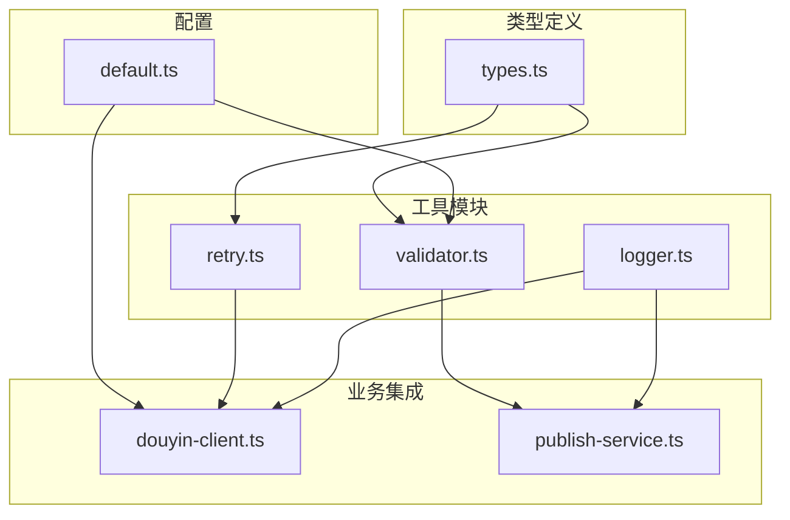
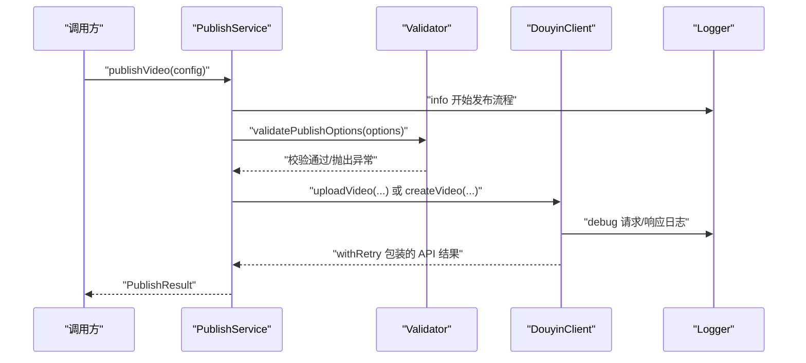
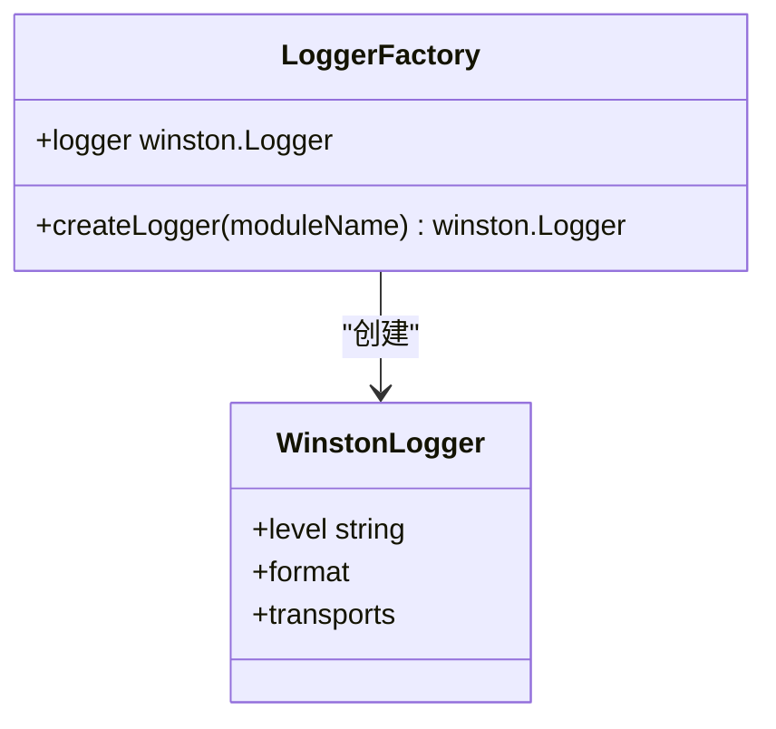
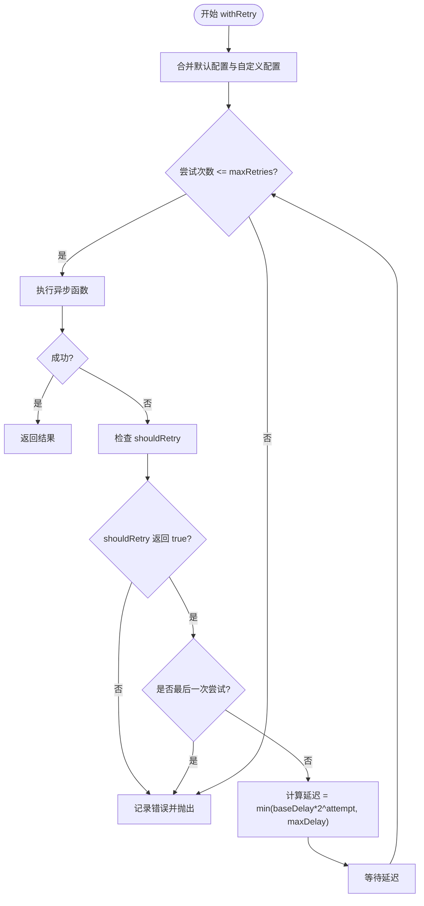
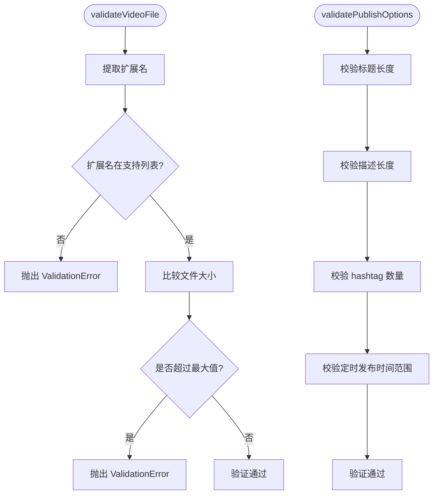
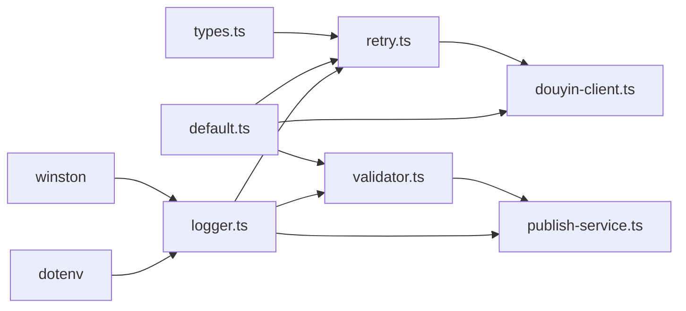

# 工具服务模块

<cite>
**本文引用的文件**
- [logger.ts](file://src/utils/logger.ts)
- [retry.ts](file://src/utils/retry.ts)
- [validator.ts](file://src/utils/validator.ts)
- [default.ts](file://config/default.ts)
- [types.ts](file://src/models/types.ts)
- [douyin-client.ts](file://src/api/douyin-client.ts)
- [publish-service.ts](file://src/services/publish-service.ts)
- [retry.test.ts](file://tests/unit/retry.test.ts)
- [validator.test.ts](file://tests/unit/validator.test.ts)
- [package.json](file://package.json)
</cite>

## 目录
1. [简介](#简介)
2. [项目结构](#项目结构)
3. [核心组件](#核心组件)
4. [架构总览](#架构总览)
5. [详细组件分析](#详细组件分析)
6. [依赖关系分析](#依赖关系分析)
7. [性能考量](#性能考量)
8. [故障排查指南](#故障排查指南)
9. [结论](#结论)
10. [附录](#附录)

## 简介
本文件聚焦 ClawOperations 的工具服务模块，系统性解析以下四个关键工具：
- Logger 日志系统：配置、日志级别与输出格式
- Retry 重试机制：指数退避算法、错误分类与自定义策略
- Validator 参数验证模块：文件验证、内容验证与格式化工具
- Default 配置模块：默认参数与环境变量管理

文档将提供各模块的使用示例、最佳实践、性能优化建议与扩展指南，并说明其在整个系统中的作用与重要性。

## 项目结构
工具服务模块位于 src/utils 目录，配合 config/default.ts 提供统一的默认配置；类型定义位于 src/models/types.ts；API 客户端与业务服务通过依赖注入的方式使用这些工具。

图表来源
- [logger.ts:1-61](file://src/utils/logger.ts#L1-L61)
- [retry.ts:1-84](file://src/utils/retry.ts#L1-L84)
- [validator.ts:1-116](file://src/utils/validator.ts#L1-L116)
- [default.ts:1-49](file://config/default.ts#L1-L49)
- [types.ts:1-201](file://src/models/types.ts#L1-L201)
- [douyin-client.ts:1-237](file://src/api/douyin-client.ts#L1-L237)
- [publish-service.ts:1-228](file://src/services/publish-service.ts#L1-L228)

章节来源
- [logger.ts:1-61](file://src/utils/logger.ts#L1-L61)
- [retry.ts:1-84](file://src/utils/retry.ts#L1-L84)
- [validator.ts:1-116](file://src/utils/validator.ts#L1-L116)
- [default.ts:1-49](file://config/default.ts#L1-L49)
- [types.ts:1-201](file://src/models/types.ts#L1-L201)
- [douyin-client.ts:1-237](file://src/api/douyin-client.ts#L1-L237)
- [publish-service.ts:1-228](file://src/services/publish-service.ts#L1-L228)

## 核心组件
- Logger 日志系统：基于 winston，支持控制台与文件双传输，时间戳格式化，模块名标识，日志级别由环境变量 LOG_LEVEL 控制。
- Retry 重试机制：指数退避延迟计算，最大重试次数与最大延迟限制，可自定义 shouldRetry 条件，结合 API 客户端实现网络与限流场景的自动重试。
- Validator 参数验证：视频文件格式与大小校验、发布内容长度与 hashtag 数量校验、定时发布时间范围校验，以及 hashtag 清洗与格式化工具。
- Default 配置模块：集中管理 API 基地址、上传阈值与分片大小、重试参数、视频格式与大小限制、内容长度与 hashtag 数量等默认配置。

章节来源
- [logger.ts:10-58](file://src/utils/logger.ts#L10-L58)
- [retry.ts:9-81](file://src/utils/retry.ts#L9-L81)
- [validator.ts:22-107](file://src/utils/validator.ts#L22-L107)
- [default.ts:5-48](file://config/default.ts#L5-L48)

## 架构总览
工具模块在系统中承担“横切关注点”的角色，贯穿 API 客户端与业务服务层：
- Logger 为所有模块提供统一的日志输出
- Retry 为网络请求提供稳健的重试策略
- Validator 在业务入口处进行参数前置校验
- Default 配置为各模块提供一致的默认参数与边界约束

图表来源
- [publish-service.ts:38-80](file://src/services/publish-service.ts#L38-L80)
- [douyin-client.ts:124-198](file://src/api/douyin-client.ts#L124-L198)
- [logger.ts:31-58](file://src/utils/logger.ts#L31-L58)
- [validator.ts:45-86](file://src/utils/validator.ts#L45-L86)

## 详细组件分析

### Logger 日志系统
- 配置要点
  - 日志级别：优先读取环境变量 LOG_LEVEL，未设置时默认为 info
  - 输出格式：时间戳、级别、模块名、消息
  - 传输器：控制台彩色输出 + 文件输出（app.log）
- 使用方式
  - 通过工厂函数 createLogger(moduleName) 创建模块专用 logger
  - 全局导出 logger 作为默认应用日志器
- 最佳实践
  - 按模块命名 logger，便于定位问题
  - 生产环境建议设置 LOG_LEVEL=warn 或 error，减少 IO 压力
  - 敏感信息避免直接写入日志，必要时脱敏处理

图表来源
- [logger.ts:31-58](file://src/utils/logger.ts#L31-L58)

章节来源
- [logger.ts:10-58](file://src/utils/logger.ts#L10-L58)
- [package.json:14-20](file://package.json#L14-L20)

### Retry 重试机制
- 指数退避算法
  - 延迟 = baseDelay × 2^attempt，上限不超过 maxDelay
  - 最终等待时间为 min(baseDelay×2^attempt, maxDelay)
- 错误分类与自定义策略
  - 内置 shouldRetry：针对抖音 API 限流错误码与常见网络错误进行判断
  - 支持传入自定义 shouldRetry 函数，实现细粒度的错误过滤
- 配置项
  - maxRetries：最大重试次数
  - baseDelay：基础延迟（毫秒）
  - maxDelay：最大延迟（毫秒）
  - shouldRetry：自定义重试条件
- 在 API 客户端中的应用
  - 所有 GET/POST/POST Form 请求均通过 withRetry 包裹
  - 自动注入 RETRY_CONFIG 并合并自定义配置
  - shouldRetry 统一由 DouyinClient 决策

图表来源
- [retry.ts:41-81](file://src/utils/retry.ts#L41-L81)
- [douyin-client.ts:124-220](file://src/api/douyin-client.ts#L124-L220)

章节来源
- [retry.ts:9-81](file://src/utils/retry.ts#L9-L81)
- [types.ts:4-13](file://src/models/types.ts#L4-L13)
- [default.ts:17-24](file://config/default.ts#L17-L24)
- [douyin-client.ts:124-220](file://src/api/douyin-client.ts#L124-L220)

### Validator 参数验证模块
- 视频文件验证
  - 格式校验：支持 mp4、mov、avi
  - 大小校验：不超过 4GB
- 发布选项验证
  - 标题长度：不超过 55 字符
  - 描述长度：不超过 300 字符
  - hashtag 数量：不超过 5 个
  - 定时发布时间：必须晚于当前时间且不超过 7 天后
- 格式化工具
  - cleanHashtag：去除 # 前缀与首尾空格
  - formatHashtags：将数组格式化为带空格分隔的字符串
- 异常类型
  - ValidationError：统一的验证错误类型

图表来源
- [validator.ts:22-86](file://src/utils/validator.ts#L22-L86)

章节来源
- [validator.ts:10-116](file://src/utils/validator.ts#L10-L116)
- [default.ts:26-40](file://config/default.ts#L26-L40)
- [types.ts:98-124](file://src/models/types.ts#L98-L124)

### Default 配置模块
- API_CONFIG：BASE_URL
- UPLOAD_CONFIG：CHUNK_UPLOAD_THRESHOLD、DEFAULT_CHUNK_SIZE
- RETRY_CONFIG：MAX_RETRIES、BASE_DELAY、MAX_DELAY
- VIDEO_CONFIG：SUPPORTED_FORMATS、MAX_SIZE
- CONTENT_CONFIG：MAX_TITLE_LENGTH、MAX_DESCRIPTION_LENGTH、MAX_HASHTAG_COUNT

章节来源
- [default.ts:5-48](file://config/default.ts#L5-L48)

## 依赖关系分析
- Logger 依赖 winston 与 dotenv，用于格式化与环境变量加载
- Retry 依赖 Logger 记录重试过程，依赖 types.ts 的 RetryConfig 接口
- Validator 依赖 Default 配置常量与 Logger
- DouyinClient 依赖 Retry 与 Default 配置，内部实现 shouldRetry
- PublishService 依赖 Validator 与 Logger，在业务流程中串联验证与日志

图表来源
- [logger.ts:1-61](file://src/utils/logger.ts#L1-L61)
- [retry.ts:1-84](file://src/utils/retry.ts#L1-L84)
- [validator.ts:1-116](file://src/utils/validator.ts#L1-L116)
- [default.ts:1-49](file://config/default.ts#L1-L49)
- [types.ts:1-201](file://src/models/types.ts#L1-L201)
- [douyin-client.ts:1-237](file://src/api/douyin-client.ts#L1-L237)
- [publish-service.ts:1-228](file://src/services/publish-service.ts#L1-L228)

章节来源
- [package.json:14-20](file://package.json#L14-L20)
- [logger.ts:1-6](file://src/utils/logger.ts#L1-L6)
- [retry.ts:1-4](file://src/utils/retry.ts#L1-L4)
- [validator.ts:1-3](file://src/utils/validator.ts#L1-L3)
- [douyin-client.ts:1-6](file://src/api/douyin-client.ts#L1-L6)
- [publish-service.ts:1-17](file://src/services/publish-service.ts#L1-L17)

## 性能考量
- 日志性能
  - 控制台输出开启颜色会增加 CPU 开销，生产环境可关闭 colorize
  - 文件输出可能成为瓶颈，建议使用异步传输器或集中式日志收集
  - 合理设置 LOG_LEVEL，避免输出冗余日志
- 重试性能
  - 指数退避会放大延迟，需根据业务 SLA 调整 baseDelay 与 maxDelay
  - shouldRetry 应尽量精准，避免对非瞬时错误进行无意义重试
- 验证性能
  - 文件大小与扩展名校验为 O(1)，成本极低
  - 标题/描述长度校验为 O(n)，n 为字符数，通常可忽略
- 配置性能
  - 配置常量为静态值，读取成本为 O(1)

[本节为通用性能讨论，无需特定文件引用]

## 故障排查指南
- 日志问题
  - 确认 LOG_LEVEL 环境变量是否正确设置
  - 检查 app.log 是否存在权限与磁盘空间问题
- 重试问题
  - 观察重试日志，确认是否命中 shouldRetry 条件
  - 使用测试用例验证指数退避与最大延迟行为
- 验证问题
  - 使用测试用例覆盖边界值，如标题/描述长度、hashtag 数量、定时发布时间
  - 检查 cleanHashtag 与 formatHashtags 的预期行为
- 配置问题
  - 确认 default.ts 中的默认值与业务需求一致
  - 如需覆盖默认值，确保传入的配置合并逻辑生效

章节来源
- [retry.test.ts:1-106](file://tests/unit/retry.test.ts#L1-L106)
- [validator.test.ts:1-200](file://tests/unit/validator.test.ts#L1-L200)

## 结论
工具服务模块通过标准化的日志、稳健的重试、严格的参数验证与清晰的配置管理，为整个系统提供了高可靠性的基础设施。它们在 API 客户端与业务服务之间起到“守门人”和“记录员”的作用，确保系统在复杂网络环境下仍能稳定运行，并为运维与调试提供强有力的支持。

[本节为总结性内容，无需特定文件引用]

## 附录

### 使用示例与最佳实践
- Logger
  - 在模块顶部创建专用 logger，记录关键事件与错误
  - 生产环境设置 LOG_LEVEL，避免过度日志输出
- Retry
  - 对网络请求使用 withRetry，合理设置 maxRetries 与 baseDelay
  - 自定义 shouldRetry 仅对可恢复的瞬时错误生效
- Validator
  - 在业务入口处调用 validatePublishOptions，提前发现配置错误
  - 使用 cleanHashtag 与 formatHashtags 统一内容格式
- Default
  - 通过 default.ts 统一管理全局默认值，避免魔法数字
  - 需要定制时，通过环境变量或外部配置覆盖

[本节为通用指导，无需特定文件引用]