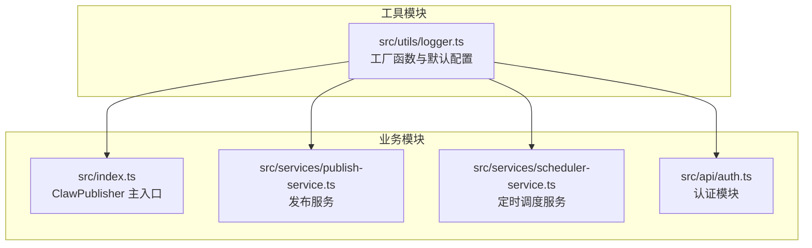
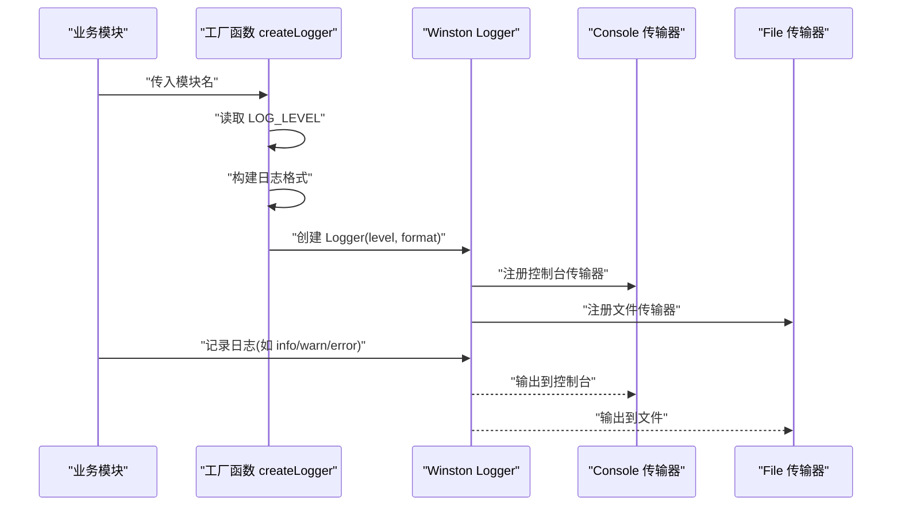
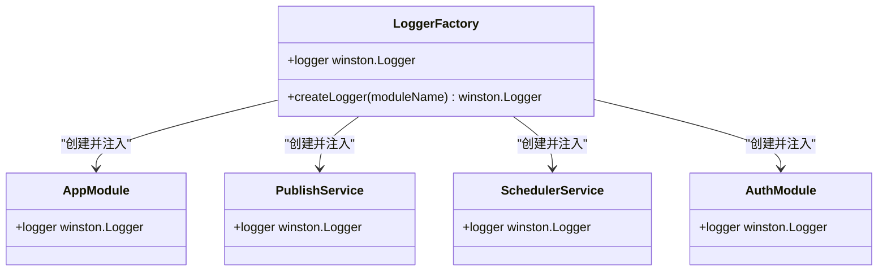
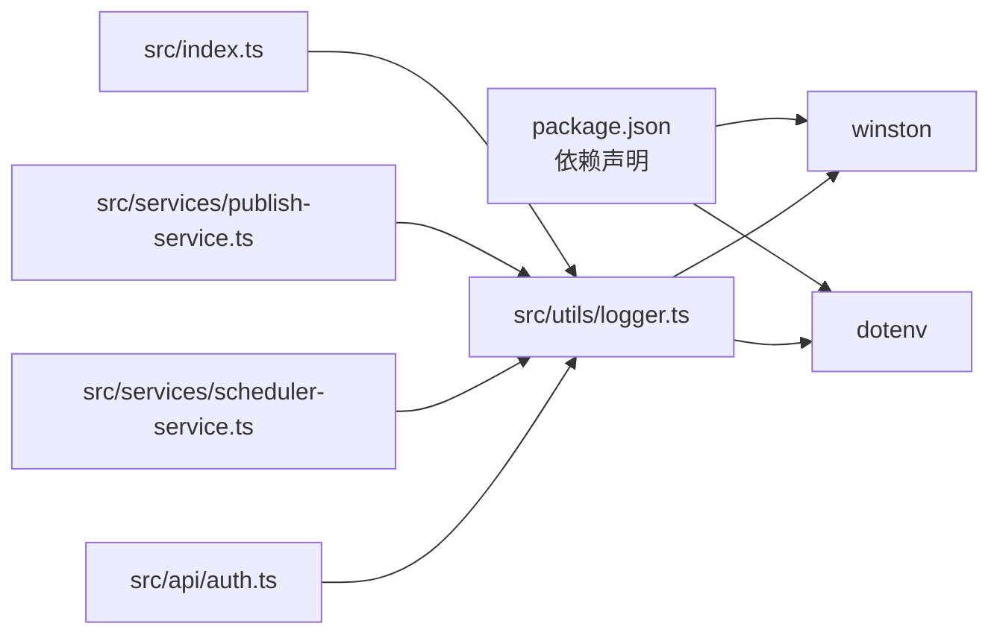

# 日志系统

<cite>
**本文引用的文件**
- [logger.ts](file://src/utils/logger.ts)
- [index.ts](file://src/index.ts)
- [publish-service.ts](file://src/services/publish-service.ts)
- [scheduler-service.ts](file://src/services/scheduler-service.ts)
- [auth.ts](file://src/api/auth.ts)
- [package.json](file://package.json)
- [default.ts](file://config/default.ts)
- [README.md](file://README.md)
</cite>

## 目录
1. [简介](#简介)
2. [项目结构](#项目结构)
3. [核心组件](#核心组件)
4. [架构总览](#架构总览)
5. [详细组件分析](#详细组件分析)
6. [依赖关系分析](#依赖关系分析)
7. [性能考量](#性能考量)
8. [故障排查指南](#故障排查指南)
9. [结论](#结论)
10. [附录](#附录)

## 简介
本文件面向“日志系统”的实现与使用，聚焦于项目中的 Logger 模块，基于 Winston 的配置与封装，覆盖以下主题：
- 日志级别管理与 LOG_LEVEL 环境变量控制
- 控制台与文件传输器的配置差异
- createLogger 工厂函数的使用方法与模块名参数的作用
- 日志格式定制与输出规范
- 在不同模块中的集成示例
- 性能优化建议与最佳实践

## 项目结构
日志系统位于工具模块中，通过工厂函数对外提供统一的日志实例，并在多个业务模块中被复用。

图表来源
- [logger.ts:1-61](file://src/utils/logger.ts#L1-L61)
- [index.ts:1-248](file://src/index.ts#L1-L248)
- [publish-service.ts:1-228](file://src/services/publish-service.ts#L1-L228)
- [scheduler-service.ts:1-202](file://src/services/scheduler-service.ts#L1-L202)
- [auth.ts:1-190](file://src/api/auth.ts#L1-L190)

章节来源
- [logger.ts:1-61](file://src/utils/logger.ts#L1-L61)
- [index.ts:1-248](file://src/index.ts#L1-L248)
- [publish-service.ts:1-228](file://src/services/publish-service.ts#L1-L228)
- [scheduler-service.ts:1-202](file://src/services/scheduler-service.ts#L1-L202)
- [auth.ts:1-190](file://src/api/auth.ts#L1-L190)

## 核心组件
- 工厂函数：createLogger(moduleName)
  - 作用：为每个模块创建独立的 winston.Logger 实例，模块名作为日志标识，便于区分来源。
  - 返回：配置好级别、格式与传输器的 Logger 实例。
- 默认导出：logger
  - 以固定模块名创建的全局日志实例，便于快速使用。
- 环境变量：LOG_LEVEL
  - 控制日志级别，默认为 info；可通过环境变量调整。
- 日志格式：createLogFormat(moduleName)
  - 统一输出格式，包含时间戳、级别、模块名与消息体。

章节来源
- [logger.ts:10-58](file://src/utils/logger.ts#L10-L58)

## 架构总览
日志系统采用“工厂 + 传输器”的模式：
- 工厂负责创建 Logger，统一注入级别与格式。
- 传输器负责输出目标：控制台与文件。
- 模块通过 createLogger(moduleName) 获取专属 Logger，避免跨模块日志混淆。

图表来源
- [logger.ts:31-55](file://src/utils/logger.ts#L31-L55)

## 详细组件分析

### 工厂函数 createLogger 与模块名参数
- 模块名参数的作用
  - 作为日志格式的一部分，贯穿每条日志消息，帮助快速定位来源模块。
  - 不同模块调用 createLogger 会得到独立的 Logger 实例，避免相互影响。
- 级别与格式
  - 级别由 LOG_LEVEL 决定；若未设置，则默认为 info。
  - 格式包含时间戳、级别与模块名，确保输出一致且可读。
- 传输器
  - 控制台：彩色输出 + 统一格式，便于开发调试。
  - 文件：纯文本格式写入 app.log，便于生产环境持久化。

章节来源
- [logger.ts:10-58](file://src/utils/logger.ts#L10-L58)

### 控制台与文件传输器的配置差异
- 控制台传输器
  - 特点：彩色高亮，适合终端阅读；与统一格式组合，增强可读性。
- 文件传输器
  - 特点：无颜色，纯文本；便于日志收集与分析。
- 输出目标
  - 控制台：标准输出，适合开发与运维实时观察。
  - 文件：app.log，适合生产环境归档与审计。

章节来源
- [logger.ts:38-51](file://src/utils/logger.ts#L38-L51)

### 日志级别管理与 LOG_LEVEL 环境变量
- 级别来源
  - 从环境变量 LOG_LEVEL 读取；若未设置，回退到 info。
- 常见级别
  - 建议按需设置：development/dev 环境可设为 debug/info；production 环境建议 warn/error。
- 影响范围
  - 仅影响当前 Logger 实例；不同模块可分别设置不同级别。

章节来源
- [logger.ts:10-12](file://src/utils/logger.ts#L10-L12)

### 日志格式定制
- 时间戳格式
  - 固定格式，便于排序与检索。
- 消息模板
  - 包含时间戳、级别、模块名与消息体，统一风格。
- 字段含义
  - 时间戳：精确到秒，便于定位事件发生时刻。
  - 级别：大写，便于快速识别严重程度。
  - 模块名：来自工厂参数，便于溯源。
  - 消息体：业务语义化的描述，建议包含关键上下文。

章节来源
- [logger.ts:17-24](file://src/utils/logger.ts#L17-L24)

### 在不同模块中的集成示例
- 主入口模块
  - 在主类初始化与停止时记录关键事件，便于追踪生命周期。
- 发布服务
  - 在发布流程的关键节点记录进度与结果，异常时记录错误信息。
- 定时调度服务
  - 在任务创建、执行、取消、清理等阶段记录状态变化。
- 认证模块
  - 在授权 URL 生成、Token 获取与刷新等关键步骤记录操作与结果。

章节来源
- [index.ts:22-66](file://src/index.ts#L22-L66)
- [publish-service.ts:17-80](file://src/services/publish-service.ts#L17-L80)
- [scheduler-service.ts:6-97](file://src/services/scheduler-service.ts#L6-L97)
- [auth.ts:5-91](file://src/api/auth.ts#L5-L91)

### 类图：Logger 工厂与模块间的关系

图表来源
- [logger.ts:31-58](file://src/utils/logger.ts#L31-L58)
- [index.ts:22-22](file://src/index.ts#L22-L22)
- [publish-service.ts:17-17](file://src/services/publish-service.ts#L17-L17)
- [scheduler-service.ts:6-6](file://src/services/scheduler-service.ts#L6-L6)
- [auth.ts:5-5](file://src/api/auth.ts#L5-L5)

## 依赖关系分析
- 依赖库
  - winston：核心日志库，提供 Logger、格式化与传输器能力。
  - dotenv：加载 .env 中的环境变量（如 LOG_LEVEL）。
- 项目内依赖
  - 各业务模块通过 createLogger 引入日志能力，形成统一的可观测性基础。

图表来源
- [package.json:14-20](file://package.json#L14-L20)
- [logger.ts:1-5](file://src/utils/logger.ts#L1-L5)

章节来源
- [package.json:14-20](file://package.json#L14-L20)
- [logger.ts:1-5](file://src/utils/logger.ts#L1-L5)

## 性能考量
- 传输器数量
  - 当前配置包含控制台与文件两个传输器，满足开发与生产需求；若在高并发场景下，建议评估文件写入开销，必要时减少传输器或引入异步写入策略。
- 日志级别
  - 生产环境建议提升至 warn/error，降低 info/debug 的输出频率，减少 I/O 压力。
- 格式复杂度
  - 统一格式已足够清晰；避免在消息体中拼接大量对象，建议使用结构化字段或上下文键值对，便于后续检索与分析。
- 文件轮转
  - 当前未启用文件轮转；生产环境建议接入文件轮转策略，避免单文件过大导致读写性能下降与磁盘占用过高。

## 故障排查指南
- 级别不生效
  - 检查 LOG_LEVEL 环境变量是否正确设置；确认进程启动时已加载 .env。
- 日志未输出到文件
  - 确认 app.log 文件权限与目录存在；检查 Node 进程是否有写入权限。
- 模块名显示异常
  - 确认各模块均通过 createLogger(moduleName) 获取 Logger；避免直接使用默认 logger 导致模块名缺失。
- 控制台颜色异常
  - 某些 CI/CD 环境不支持彩色输出；可在 CI 中将 LOG_LEVEL 设为较低级别或关闭颜色输出。
- 性能问题
  - 若出现高频日志导致卡顿，建议降低日志级别、减少传输器数量或开启异步写入。

章节来源
- [logger.ts:10-12](file://src/utils/logger.ts#L10-L12)
- [logger.ts:38-51](file://src/utils/logger.ts#L38-L51)

## 结论
本项目的日志系统以工厂函数为核心，结合 Winston 的传输器与格式化能力，实现了统一、可扩展的日志基础设施。通过模块名参数与 LOG_LEVEL 环境变量，既能满足开发调试，也能适应生产环境的稳定性与可维护性要求。建议在生产环境中进一步完善文件轮转与异步写入策略，并根据业务场景选择合适的日志级别与输出目标。

## 附录

### 环境变量与配置
- LOG_LEVEL
  - 作用：控制日志级别
  - 默认值：info
  - 示例：development/dev 环境可设为 debug；production 环境建议 warn/error
- app.log
  - 作用：文件传输器输出目标
  - 建议：配合轮转策略使用

章节来源
- [logger.ts:10-12](file://src/utils/logger.ts#L10-L12)
- [logger.ts:47-50](file://src/utils/logger.ts#L47-L50)

### 使用示例（路径指引）
- 主入口模块
  - 初始化与停止日志记录：[index.ts:66-66](file://src/index.ts#L66-L66), [index.ts:242-242](file://src/index.ts#L242-L242)
- 发布服务
  - 发布流程与异常处理日志：[publish-service.ts:41-73](file://src/services/publish-service.ts#L41-L73), [publish-service.ts:137-171](file://src/services/publish-service.ts#L137-L171)
- 定时调度服务
  - 任务创建、执行、取消与清理日志：[scheduler-service.ts:47-97](file://src/services/scheduler-service.ts#L47-L97), [scheduler-service.ts:140-162](file://src/services/scheduler-service.ts#L140-L162), [scheduler-service.ts:187-198](file://src/services/scheduler-service.ts#L187-L198)
- 认证模块
  - 授权 URL 生成与 Token 获取/刷新日志：[auth.ts:58-91](file://src/api/auth.ts#L58-L91), [auth.ts:148-168](file://src/api/auth.ts#L148-L168)