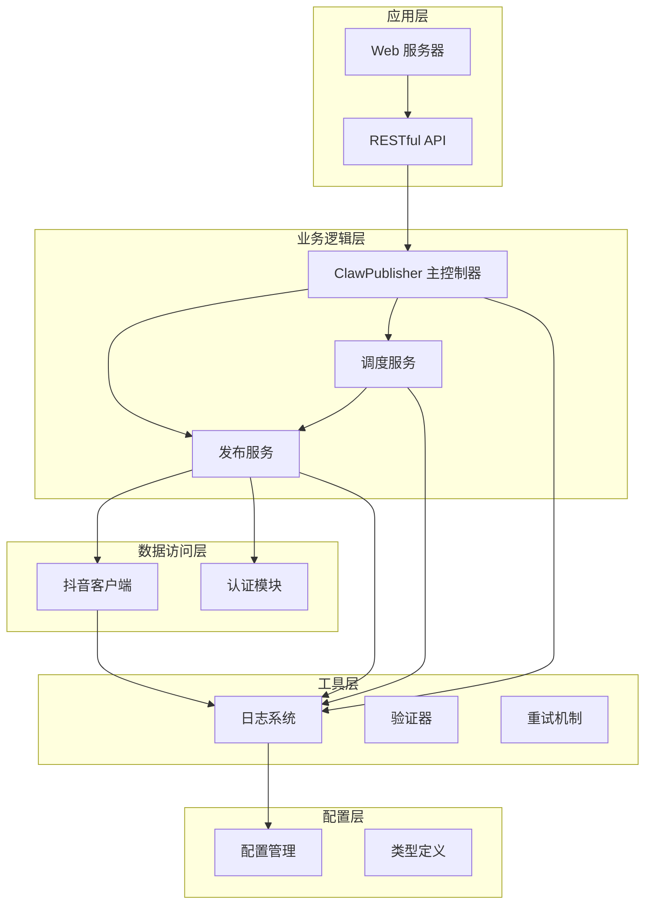
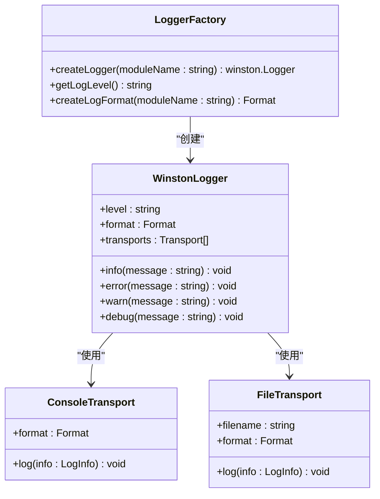
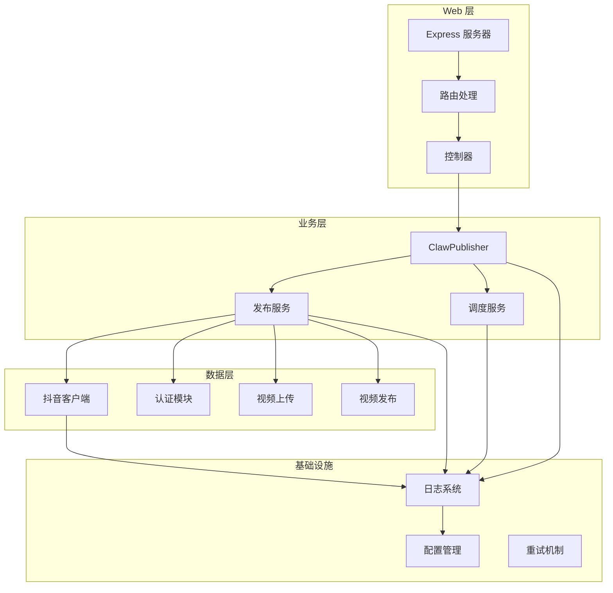
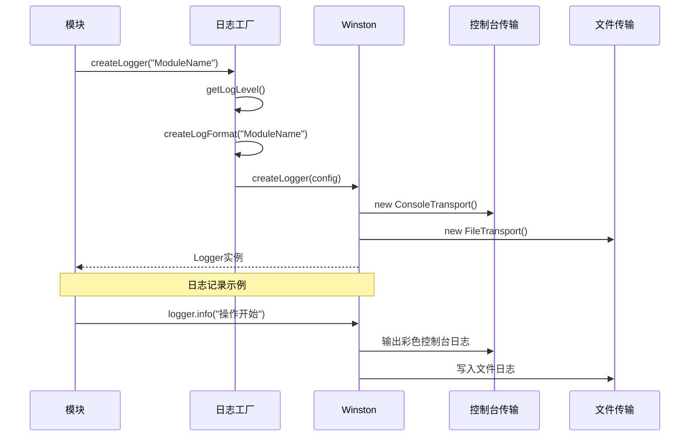
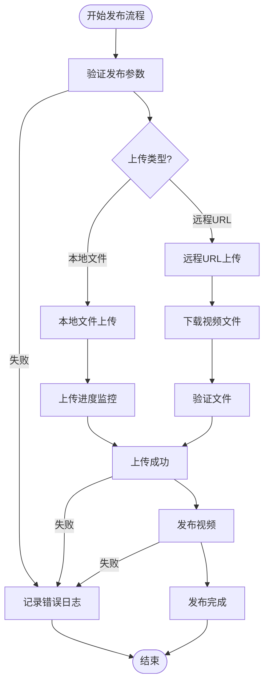
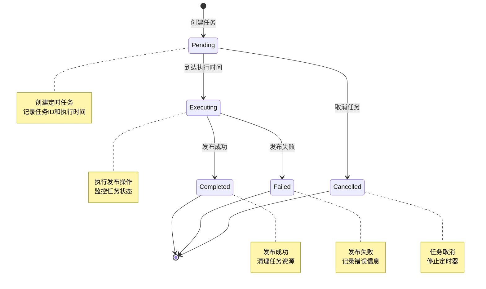
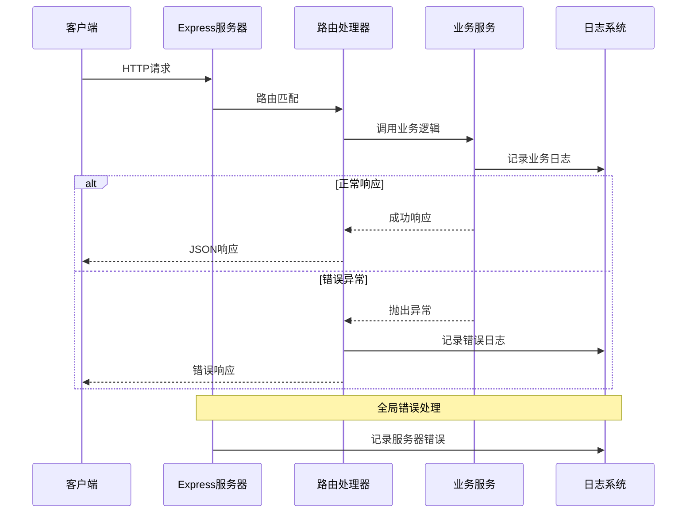
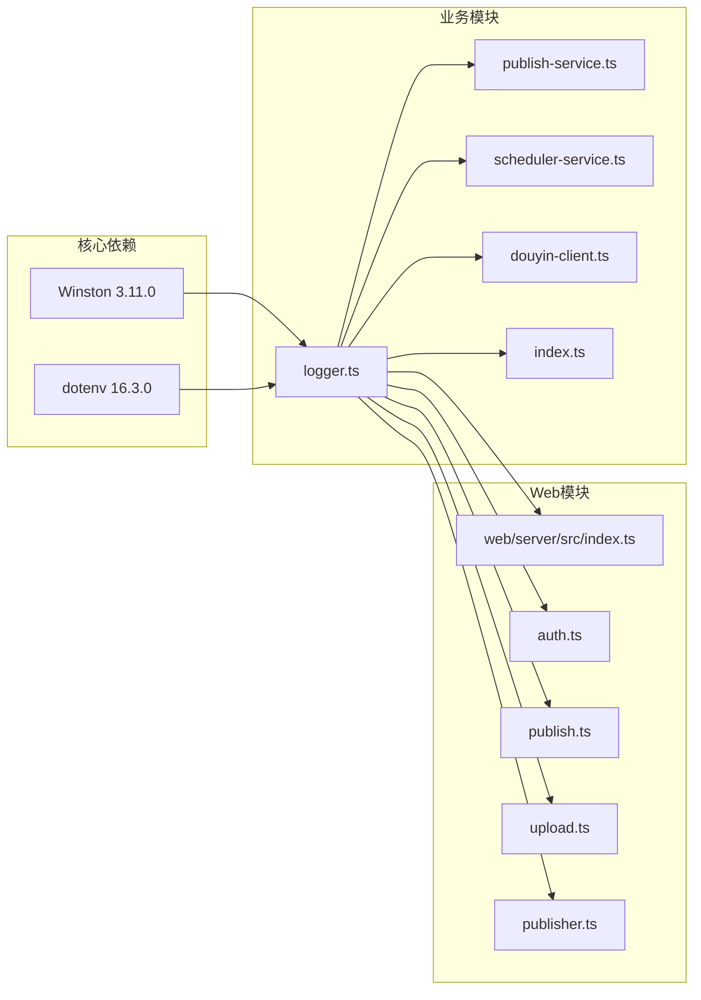

# 日志系统

<cite>
**本文档引用的文件**
- [logger.ts](file://src/utils/logger.ts)
- [index.ts](file://src/index.ts)
- [publish-service.ts](file://src/services/publish-service.ts)
- [scheduler-service.ts](file://src/services/scheduler-service.ts)
- [douyin-client.ts](file://src/api/douyin-client.ts)
- [types.ts](file://src/models/types.ts)
- [index.ts](file://web/server/src/index.ts)
- [publish.ts](file://web/server/src/routes/publish.ts)
- [auth.ts](file://web/server/src/routes/auth.ts)
- [upload.ts](file://web/server/src/routes/upload.ts)
- [publisher.ts](file://web/server/src/services/publisher.ts)
- [default.ts](file://config/default.ts)
- [package.json](file://package.json)
</cite>

## 目录
1. [简介](#简介)
2. [项目结构](#项目结构)
3. [核心组件](#核心组件)
4. [架构概览](#架构概览)
5. [详细组件分析](#详细组件分析)
6. [依赖关系分析](#依赖关系分析)
7. [性能考虑](#性能考虑)
8. [故障排除指南](#故障排除指南)
9. [结论](#结论)

## 简介

ClawOperations 是一个基于 Node.js 的抖音（TikTok）自动化运营系统，专门用于 crayfish（小龙虾）主题的营销账号管理。该系统实现了完整的日志记录机制，采用 Winston 作为日志框架，提供了多级别的日志输出、格式化和持久化功能。

系统的核心功能包括：
- 抖音 API 集成和认证管理
- 视频上传和发布自动化
- 定时发布任务调度
- 内容管理和分析
- Web 服务器提供 RESTful API

## 项目结构

项目采用模块化的架构设计，主要分为以下几个层次：

**图表来源**
- [index.ts:22-67](file://src/index.ts#L22-L67)
- [publish-service.ts:22-31](file://src/services/publish-service.ts#L22-L31)
- [scheduler-service.ts:23-29](file://src/services/scheduler-service.ts#L23-L29)

**章节来源**
- [index.ts:1-248](file://src/index.ts#L1-L248)
- [package.json:1-38](file://package.json#L1-L38)

## 核心组件

### 日志系统架构

系统采用集中式的日志管理策略，通过工厂模式创建不同模块的日志实例：

**图表来源**
- [logger.ts:31-55](file://src/utils/logger.ts#L31-L55)

### 日志级别和格式

系统支持五种标准日志级别：
- **ERROR**: 严重错误，影响功能正常运行
- **WARN**: 警告信息，需要注意但不影响功能
- **INFO**: 一般信息，重要的业务流程
- **DEBUG**: 调试信息，开发和诊断用途
- **VERBOSE**: 详细信息，最详细的日志记录

日志格式包含以下字段：
- 时间戳：YYYY-MM-DD HH:mm:ss 格式
- 日志级别：大写显示
- 模块名称：标识日志来源
- 消息内容：实际日志信息

**章节来源**
- [logger.ts:10-24](file://src/utils/logger.ts#L10-L24)

## 架构概览

系统采用分层架构，每个模块都有独立的日志实例，确保日志的可追踪性和可维护性：

**图表来源**
- [index.ts:1-42](file://web/server/src/index.ts#L1-L42)
- [publisher.ts:1-136](file://web/server/src/services/publisher.ts#L1-L136)

## 详细组件分析

### 日志工厂实现

日志工厂是整个日志系统的核心，负责创建和配置 Winston Logger 实例：

**图表来源**
- [logger.ts:31-55](file://src/utils/logger.ts#L31-L55)

### 发布服务日志记录

发布服务在关键业务流程中记录详细的操作日志：

**图表来源**
- [publish-service.ts:38-80](file://src/services/publish-service.ts#L38-L80)
- [publish-service.ts:133-172](file://src/services/publish-service.ts#L133-L172)

### 调度服务日志管理

调度服务负责定时任务的生命周期管理，记录任务的创建、执行和取消过程：

**图表来源**
- [scheduler-service.ts:37-72](file://src/services/scheduler-service.ts#L37-L72)
- [scheduler-service.ts:140-162](file://src/services/scheduler-service.ts#L140-L162)

### Web 服务器日志集成

Web 服务器层集成了全局错误处理和请求日志记录：

**图表来源**
- [index.ts:29-36](file://web/server/src/index.ts#L29-L36)
- [auth.ts:11-17](file://web/server/src/routes/auth.ts#L11-L17)
- [publish.ts:11-35](file://web/server/src/routes/publish.ts#L11-L35)

**章节来源**
- [logger.ts:1-61](file://src/utils/logger.ts#L1-L61)
- [publish-service.ts:1-228](file://src/services/publish-service.ts#L1-L228)
- [scheduler-service.ts:1-202](file://src/services/scheduler-service.ts#L1-L202)
- [index.ts:1-42](file://web/server/src/index.ts#L1-L42)

## 依赖关系分析

系统中的日志依赖关系体现了清晰的模块化设计：

**图表来源**
- [package.json:18-24](file://package.json#L18-L24)
- [logger.ts:1-61](file://src/utils/logger.ts#L1-L61)

### 环境变量配置

系统通过环境变量控制日志级别：

| 环境变量 | 类型 | 默认值 | 描述 |
|---------|------|--------|------|
| LOG_LEVEL | string | info | 设置日志级别（error/warn/info/debug/verbose） |

**章节来源**
- [logger.ts:10-12](file://src/utils/logger.ts#L10-L12)
- [package.json:18-24](file://package.json#L18-L24)

## 性能考虑

### 日志性能优化

1. **异步写入**：Winston 默认使用异步传输，避免阻塞主线程
2. **内存管理**：控制台传输使用颜色化输出，文件传输进行轮转
3. **条件记录**：DEBUG 和 VERBOSE 级别仅在开发环境中启用
4. **批量处理**：多个模块共享同一个日志实例，减少资源消耗

### 日志存储策略

- **控制台输出**：实时调试，支持彩色输出
- **文件输出**：持久化存储，便于问题排查
- **日志轮转**：建议在生产环境中配置日志轮转策略

## 故障排除指南

### 常见日志问题

1. **日志不显示**：检查 LOG_LEVEL 环境变量设置
2. **文件权限问题**：确认 app.log 文件的写入权限
3. **日志格式异常**：验证模块名称的正确性
4. **内存泄漏**：检查是否有过多的日志实例创建

### 调试技巧

1. **增加日志级别**：将 LOG_LEVEL 设置为 debug 或 verbose
2. **模块化调试**：为特定模块创建独立的日志实例
3. **时间戳分析**：利用时间戳定位问题发生的时间点
4. **错误堆栈**：记录完整的错误堆栈信息

**章节来源**
- [logger.ts:1-61](file://src/utils/logger.ts#L1-L61)
- [douyin-client.ts:97-116](file://src/api/douyin-client.ts#L97-L116)

## 结论

ClawOperations 的日志系统采用了现代化的模块化设计，通过 Winston 提供了强大而灵活的日志记录能力。系统的主要优势包括：

1. **统一的日志格式**：所有模块使用一致的日志格式和级别
2. **多传输支持**：同时支持控制台和文件输出
3. **环境可配置**：通过环境变量轻松调整日志级别
4. **业务集成**：与核心业务逻辑深度集成，提供完整的操作追踪
5. **错误处理**：完善的错误捕获和记录机制

该日志系统为抖音自动化运营提供了可靠的监控和诊断能力，有助于提高系统的可维护性和问题排查效率。通过合理的日志策略和配置，可以有效支持系统的日常运维和故障处理需求。