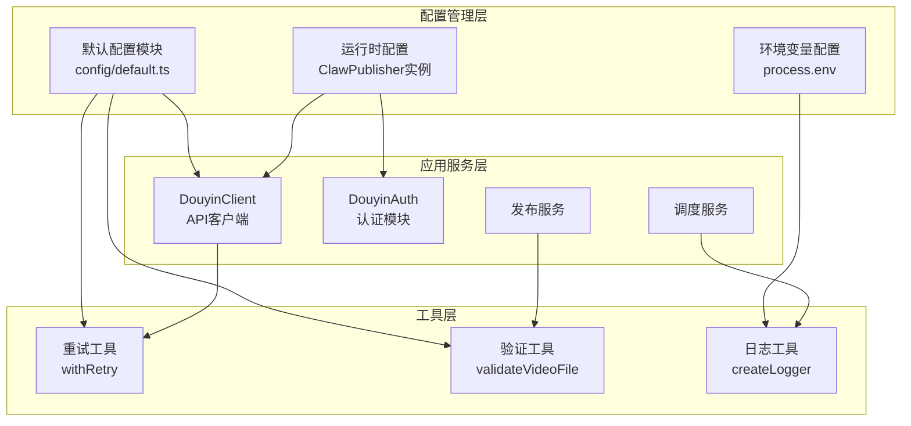
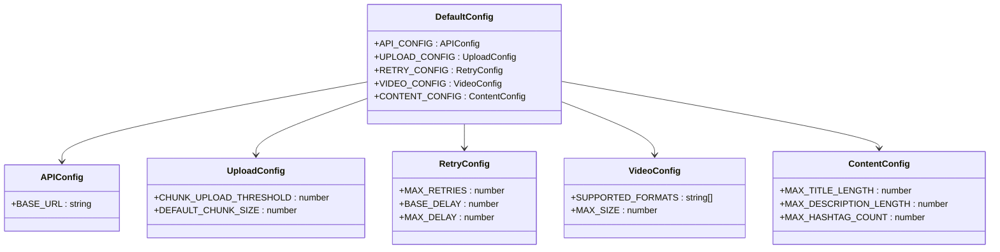
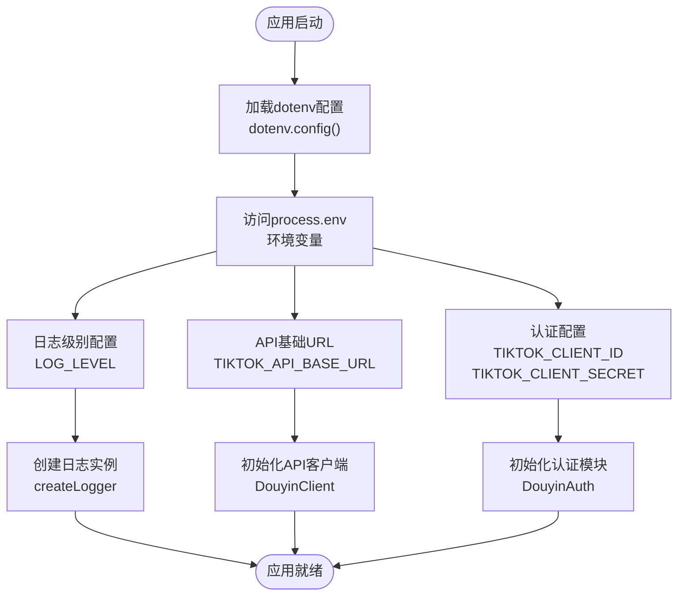
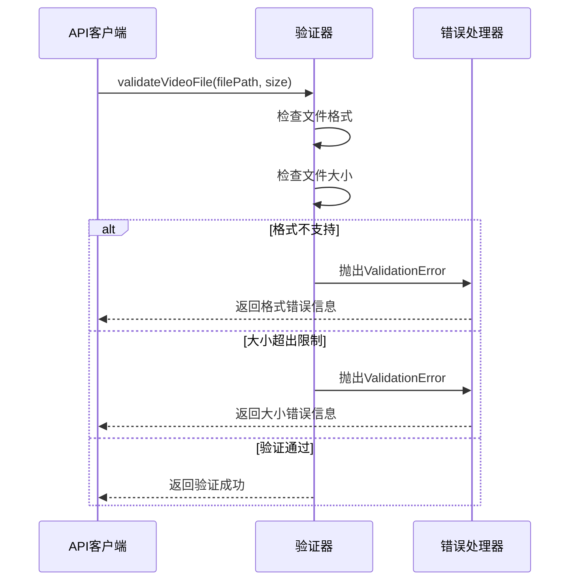

# 配置管理系统

<cite>
**本文档引用的文件**
- [config/default.ts](file://config/default.ts)
- [src/index.ts](file://src/index.ts)
- [src/models/types.ts](file://src/models/types.ts)
- [src/api/douyin-client.ts](file://src/api/douyin-client.ts)
- [src/utils/retry.ts](file://src/utils/retry.ts)
- [src/utils/validator.ts](file://src/utils/validator.ts)
- [src/utils/logger.ts](file://src/utils/logger.ts)
- [example.ts](file://example.ts)
- [README.md](file://README.md)
- [package.json](file://package.json)
</cite>

## 目录
1. [项目概述](#项目概述)
2. [配置管理架构](#配置管理架构)
3. [默认配置模块详解](#默认配置模块详解)
4. [配置项完整列表](#配置项完整列表)
5. [环境变量加载机制](#环境变量加载机制)
6. [配置验证与错误处理](#配置验证与错误处理)
7. [多环境配置定制](#多环境配置定制)
8. [最佳实践指南](#最佳实践指南)
9. [故障排除](#故障排除)
10. [总结](#总结)

## 项目概述

ClawOperations 是一个专门针对抖音小龙虾营销账号的自动化运营系统。该系统提供了完整的视频发布、内容管理和数据分析功能，支持多种部署环境和配置模式。

系统采用模块化的架构设计，核心配置管理模块位于 `config/default.ts` 文件中，为整个应用提供统一的配置规范和默认值设置。

## 配置管理架构

### 整体架构图



**图表来源**
- [config/default.ts:1-49](file://config/default.ts#L1-L49)
- [src/api/douyin-client.ts:1-237](file://src/api/douyin-client.ts#L1-L237)
- [src/utils/retry.ts:1-84](file://src/utils/retry.ts#L1-L84)
- [src/utils/validator.ts:1-116](file://src/utils/validator.ts#L1-L116)

## 默认配置模块详解

### 设计理念

默认配置模块采用了模块化和分类管理的设计理念，将相关的配置项按照功能领域进行分组：

1. **API配置**：管理抖音开放平台的API端点和基础连接参数
2. **上传配置**：控制视频上传过程中的分片策略和性能参数
3. **重试配置**：定义网络请求的重试策略和退避算法
4. **视频配置**：设置视频文件的格式支持和大小限制
5. **内容配置**：管理发布内容的长度限制和格式要求

### 配置模块结构



**图表来源**
- [config/default.ts:5-48](file://config/default.ts#L5-L48)

**章节来源**
- [config/default.ts:1-49](file://config/default.ts#L1-L49)

## 配置项完整列表

### API配置参数

| 配置项 | 类型 | 默认值 | 单位 | 描述 |
|--------|------|--------|------|------|
| BASE_URL | string | 'https://open.douyin.com' | - | 抖音开放平台API基础URL |

### 上传配置参数

| 配置项 | 类型 | 默认值 | 单位 | 描述 |
|--------|------|--------|------|------|
| CHUNK_UPLOAD_THRESHOLD | number | 134217728 | 字节 | 分片上传阈值 (128MB) |
| DEFAULT_CHUNK_SIZE | number | 5242880 | 字节 | 默认分片大小 (5MB) |

### 重试配置参数

| 配置项 | 类型 | 默认值 | 单位 | 描述 |
|--------|------|--------|------|------|
| MAX_RETRIES | number | 3 | 次 | 最大重试次数 |
| BASE_DELAY | number | 1000 | 毫秒 | 基础延迟时间 |
| MAX_DELAY | number | 30000 | 毫秒 | 最大延迟时间 |

### 视频配置参数

| 配置项 | 类型 | 默认值 | 单位 | 描述 |
|--------|------|--------|------|------|
| SUPPORTED_FORMATS | string[] | ['mp4', 'mov', 'avi'] | - | 支持的视频格式 |
| MAX_SIZE | number | 4294967296 | 字节 | 视频大小限制 (4GB) |

### 内容配置参数

| 配置项 | 类型 | 默认值 | 单位 | 描述 |
|--------|------|--------|------|------|
| MAX_TITLE_LENGTH | number | 55 | 字符 | 标题最大长度 |
| MAX_DESCRIPTION_LENGTH | number | 300 | 字符 | 描述最大长度 |
| MAX_HASHTAG_COUNT | number | 5 | 个 | hashtag最大数量 |

**章节来源**
- [config/default.ts:5-40](file://config/default.ts#L5-L40)

## 环境变量加载机制

### 环境变量加载流程



**图表来源**
- [src/utils/logger.ts:1-60](file://src/utils/logger.ts#L1-L60)

### 环境变量访问方式

系统通过 `process.env` 访问环境变量，主要使用的环境变量包括：

- **LOG_LEVEL**: 控制日志输出级别，默认为 'info'
- **TIKTOK_API_BASE_URL**: 抖音API基础URL（在README中有示例）
- **TIKTOK_CLIENT_ID**: 应用客户端ID
- **TIKTOK_CLIENT_SECRET**: 应用客户端密钥
- **TIKTOK_ACCESS_TOKEN**: 访问令牌

**章节来源**
- [src/utils/logger.ts:1-60](file://src/utils/logger.ts#L1-L60)
- [README.md:50-63](file://README.md#L50-L63)

## 配置验证与错误处理

### 验证机制

系统实现了多层次的配置验证机制：

1. **视频文件验证**：检查文件格式和大小限制
2. **发布选项验证**：验证标题、描述、hashtag等参数
3. **重试策略验证**：确保重试配置的合理性
4. **API配置验证**：验证API端点和认证信息

### 错误处理流程



**图表来源**
- [src/utils/validator.ts:17-39](file://src/utils/validator.ts#L17-L39)

### 验证规则

| 验证类型 | 规则 | 错误消息 |
|----------|------|----------|
| 视频格式 | 支持mp4、mov、avi格式 | 不支持的视频格式: {ext} |
| 文件大小 | ≤ 4GB | 视频文件过大: {size}GB |
| 标题长度 | ≤ 55字符 | 标题过长: {length}字符 |
| 描述长度 | ≤ 300字符 | 描述过长: {length}字符 |
| Hashtag数量 | ≤ 5个 | hashtag数量过多: {count}个 |

**章节来源**
- [src/utils/validator.ts:17-86](file://src/utils/validator.ts#L17-L86)

## 多环境配置定制

### 开发环境配置

开发环境通常使用以下配置：

- **日志级别**: DEBUG 或 VERBOSE
- **API端点**: 使用测试环境API
- **超时设置**: 较短的超时时间便于调试
- **重试策略**: 较少的重试次数

### 测试环境配置

测试环境配置要点：

- **日志级别**: INFO
- **API端点**: 使用沙盒环境API
- **并发限制**: 限制并发请求数量
- **数据隔离**: 使用测试专用的数据集

### 生产环境配置

生产环境配置优化：

- **日志级别**: WARN 或 ERROR
- **API端点**: 使用正式环境API
- **超时设置**: 更长的超时时间
- **重试策略**: 更积极的重试策略
- **监控集成**: 集成性能监控和告警

### 环境配置示例

```typescript
// 开发环境配置
const developmentConfig = {
  LOG_LEVEL: 'debug',
  API_TIMEOUT: 10000,
  MAX_RETRIES: 1,
  CHUNK_SIZE: 1048576 // 1MB
};

// 生产环境配置
const productionConfig = {
  LOG_LEVEL: 'warn',
  API_TIMEOUT: 30000,
  MAX_RETRIES: 5,
  CHUNK_SIZE: 5242880 // 5MB
};
```

**章节来源**
- [src/utils/logger.ts:10-12](file://src/utils/logger.ts#L10-L12)

## 最佳实践指南

### 配置管理最佳实践

1. **配置分离原则**
   - 将敏感配置放在环境变量中
   - 将通用配置放在默认配置文件中
   - 将环境特定配置放在单独的配置文件中

2. **配置验证原则**
   - 在应用启动时验证所有必需配置
   - 为每个配置项提供合理的默认值
   - 对配置值进行范围和格式验证

3. **配置更新原则**
   - 支持运行时配置热更新
   - 提供配置回滚机制
   - 记录配置变更历史

### 错误处理最佳实践

1. **错误分类**
   - 配置错误：配置项缺失或格式错误
   - 运行时错误：API调用失败或网络异常
   - 业务逻辑错误：业务规则违反

2. **错误恢复**
   - 对可重试的网络错误自动重试
   - 对配置错误提供明确的错误信息
   - 对严重错误优雅降级

3. **监控告警**
   - 记录所有配置相关的错误
   - 监控配置变更频率
   - 设置配置错误告警阈值

### 性能优化建议

1. **配置缓存**
   - 缓存常用的配置查询结果
   - 使用配置变更通知机制
   - 实现配置懒加载

2. **资源管理**
   - 合理设置超时时间和重试间隔
   - 优化分片上传大小
   - 监控内存使用情况

**章节来源**
- [src/utils/retry.ts:41-81](file://src/utils/retry.ts#L41-L81)
- [src/api/douyin-client.ts:124-166](file://src/api/douyin-client.ts#L124-L166)

## 故障排除

### 常见配置问题

| 问题类型 | 症状 | 解决方案 |
|----------|------|----------|
| 配置加载失败 | 应用启动时报配置错误 | 检查.env文件格式和权限 |
| API调用失败 | 返回401或403错误 | 验证客户端ID和密钥 |
| 上传失败 | 视频上传中断 | 检查网络连接和分片大小 |
| 重试过多 | 请求频繁失败 | 调整重试次数和延迟时间 |
| 内存溢出 | 大文件处理异常 | 优化分片上传和内存管理 |

### 调试技巧

1. **启用详细日志**
   ```bash
   LOG_LEVEL=debug npm start
   ```

2. **检查环境变量**
   ```bash
   echo $TIKTOK_CLIENT_ID
   echo $TIKTOK_ACCESS_TOKEN
   ```

3. **验证API连通性**
   ```bash
   curl -I https://open.douyin.com
   ```

### 监控指标

- **配置加载成功率**
- **API调用响应时间**
- **重试次数分布**
- **错误类型统计**
- **资源使用情况**

**章节来源**
- [src/utils/logger.ts:10-12](file://src/utils/logger.ts#L10-L12)

## 总结

配置管理系统为ClawOperations提供了灵活、可靠的配置管理能力。通过模块化的配置设计、完善的验证机制和多环境支持，系统能够适应不同的部署场景和业务需求。

关键特性包括：

1. **模块化设计**：按功能领域组织配置项，便于维护和扩展
2. **环境适配**：支持开发、测试、生产等多环境配置
3. **验证保障**：多层次的配置验证确保系统稳定性
4. **错误处理**：完善的错误处理和恢复机制
5. **性能优化**：合理的配置策略提升系统性能

通过遵循本文档的最佳实践，开发者可以有效地管理和维护配置系统，确保应用在各种环境下都能稳定运行。