# 配置管理系统

<cite>
**本文档引用的文件**
- [config/default.ts](file://config/default.ts)
- [web/server/src/database/schema.sql](file://web/server/src/database/schema.sql)
- [web/server/src/services/system-config-service.ts](file://web/server/src/services/system-config-service.ts)
- [web/server/src/services/app-config-service.ts](file://web/server/src/services/app-config-service.ts)
- [web/server/src/routes/system.ts](file://web/server/src/routes/system.ts)
- [web/server/src/database/index.ts](file://web/server/src/database/index.ts)
- [web/server/src/index.ts](file://web/server/src/index.ts)
- [web/client/src/pages/SystemConfig.tsx](file://web/client/src/pages/SystemConfig.tsx)
- [web/client/src/api/client.ts](file://web/client/src/api/client.ts)
- [src/index.ts](file://src/index.ts)
- [src/models/types.ts](file://src/models/types.ts)
- [src/api/douyin-client.ts](file://src/api/douyin-client.ts)
- [src/services/publish-service.ts](file://src/services/publish-service.ts)
- [src/services/scheduler-service.ts](file://src/services/scheduler-service.ts)
- [src/utils/logger.ts](file://src/utils/logger.ts)
- [src/utils/retry.ts](file://src/utils/retry.ts)
- [src/utils/validator.ts](file://src/utils/validator.ts)
- [web/server/src/routes/auth.ts](file://web/server/src/routes/auth.ts)
- [web/server/src/services/publisher.ts](file://web/server/src/services/publisher.ts)
- [package.json](file://package.json)
- [web/client/package.json](file://web/client/package.json)
- [README.md](file://README.md)
</cite>

## 更新摘要
**变更内容**
- 新增系统配置数据库存储支持，包括 MySQL 和 Redis 缓存层
- 新增完整的配置验证机制，支持输入参数验证和数据完整性检查
- 新增配置更新处理基础设施，支持实时配置管理和热更新
- 新增系统配置管理 API 接口和前端管理界面
- 新增配置脱敏显示和安全存储机制

## 目录
1. [项目概述](#项目概述)
2. [项目结构](#项目结构)
3. [核心组件](#核心组件)
4. [架构概览](#架构概览)
5. [详细组件分析](#详细组件分析)
6. [依赖关系分析](#依赖关系分析)
7. [性能考虑](#性能考虑)
8. [故障排除指南](#故障排除指南)
9. [结论](#结论)

## 项目概述

ClawOperations 是一个专门设计用于管理小龙虾主题 TikTok 营销账户的自动化运营系统。该系统提供了完整的 TikTok API 集成、内容发布、定时调度、数据分析和观众互动等功能。

### 主要特性

- **TikTok API 集成**: 安全连接到 TikTok 商业 API
- **内容发布**: 自动化的视频上传和调度功能
- **账户管理**: 内容日历、标签优化、趋势监控
- **小龙虾特定功能**: 季节性活动、食谱模板、本地化支持
- **系统配置管理**: 数据库驱动的配置存储和实时更新
- **安全配置**: 敏感信息脱敏和安全存储机制

**章节来源**
- [README.md:1-152](file://README.md#L1-L152)

## 项目结构

项目采用模块化架构设计，主要分为以下几个核心部分：

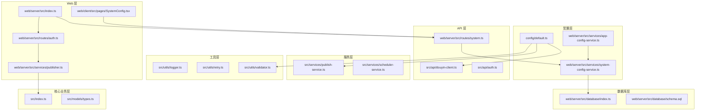

**图表来源**
- [config/default.ts:1-70](file://config/default.ts#L1-L70)
- [web/server/src/services/system-config-service.ts:1-280](file://web/server/src/services/system-config-service.ts#L1-L280)
- [web/server/src/database/schema.sql:1-79](file://web/server/src/database/schema.sql#L1-L79)
- [web/server/src/index.ts:1-93](file://web/server/src/index.ts#L1-L93)

**章节来源**
- [package.json:1-38](file://package.json#L1-L38)
- [web/client/package.json:1-32](file://web/client/package.json#L1-L32)

## 核心组件

### 系统配置管理系统

系统配置管理系统是整个应用的核心基础设施，负责集中管理所有配置参数和常量设置，现已升级为数据库驱动的完整配置管理方案。

#### 数据库配置架构

系统采用 MySQL + Redis 的双层缓存架构，确保配置的高性能访问和持久化存储：

```mermaid
classDiagram
class SystemConfigService {
+aiCache : AIConfig
+douyinCache : DouyinConfig
+cacheLoaded : boolean
+loadConfigToEnv() : Promise~void~
+getAIConfig() : AIConfig
+getMaskedAIConfig() : MaskedAIConfig
+updateAIConfig(dto) : Promise~AIConfig~
+getDouyinConfig() : DouyinConfig
+getMaskedDouyinConfig() : MaskedDouyinConfig
+updateDouyinConfig(dto) : Promise~DouyinConfig~
+updateDouyinTokens(tokens) : Promise~void~
}
class AppConfigService {
+getDouyinConfig() : DouyinConfig | null
+setDouyinConfig(config) : Promise~DouyinConfig | null~
+getAIConfig() : AIConfig
+setAIConfig(config) : Promise~AIConfig~
+getAIStatus() : { deepseekConfigured : boolean }
}
class DatabaseLayer {
+getPool() : Pool
+getRedis() : Redis
+initDatabase() : Promise~void~
+closeDatabase() : Promise~void~
}
class ConfigTables {
+users : UsersTable
+user_auth_configs : UserAuthConfigsTable
+creation_tasks : CreationTasksTable
+creation_templates : CreationTemplatesTable
+app_config : AppConfigTable
}
SystemConfigService --> DatabaseLayer
AppConfigService --> SystemConfigService
DatabaseLayer --> ConfigTables
```

**图表来源**
- [web/server/src/services/system-config-service.ts:133-280](file://web/server/src/services/system-config-service.ts#L133-L280)
- [web/server/src/services/app-config-service.ts:13-87](file://web/server/src/services/app-config-service.ts#L13-L87)
- [web/server/src/database/index.ts:16-163](file://web/server/src/database/index.ts#L16-L163)

#### 配置存储结构

系统配置采用 JSON 格式存储在 app_config 表中，支持灵活的配置扩展：

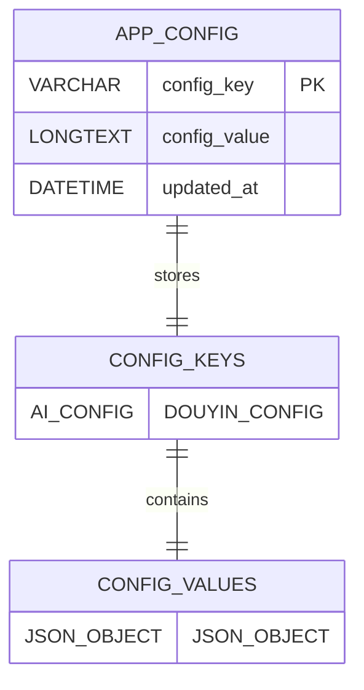

**图表来源**
- [web/server/src/database/schema.sql:74-79](file://web/server/src/database/schema.sql#L74-L79)

**章节来源**
- [web/server/src/services/system-config-service.ts:1-280](file://web/server/src/services/system-config-service.ts#L1-L280)
- [web/server/src/database/schema.sql:1-79](file://web/server/src/database/schema.sql#L1-L79)

### 配置验证机制

系统实现了多层次的配置验证机制，确保配置的安全性和有效性：

#### 输入验证流程

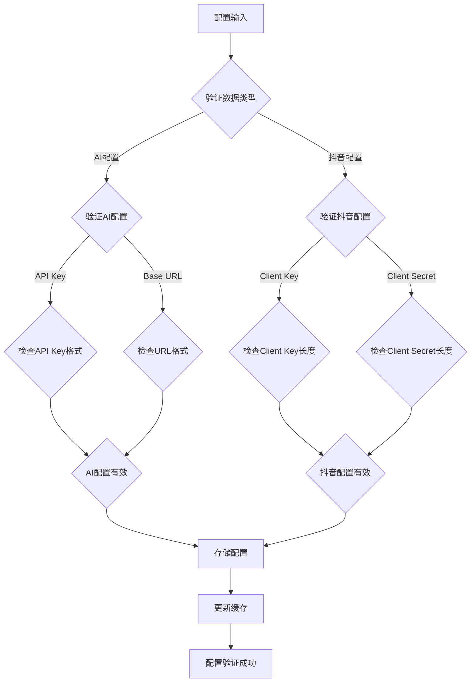

**图表来源**
- [web/server/src/routes/system.ts:64-164](file://web/server/src/routes/system.ts#L64-L164)

**章节来源**
- [web/server/src/routes/system.ts:1-188](file://web/server/src/routes/system.ts#L1-L188)

### 核心业务组件

#### ClawPublisher 主控制器

ClawPublisher 是系统的核心控制器，提供统一的对外接口：

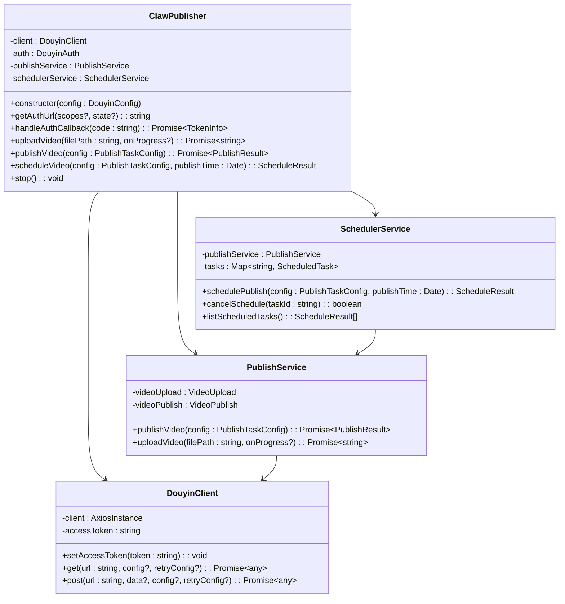

**图表来源**
- [src/index.ts:29-244](file://src/index.ts#L29-L244)
- [src/api/douyin-client.ts:13-237](file://src/api/douyin-client.ts#L13-L237)
- [src/services/publish-service.ts:22-228](file://src/services/publish-service.ts#L22-L228)
- [src/services/scheduler-service.ts:23-202](file://src/services/scheduler-service.ts#L23-L202)

**章节来源**
- [src/index.ts:1-248](file://src/index.ts#L1-L248)

## 架构概览

系统采用分层架构设计，确保各层职责清晰、耦合度低：

```mermaid
graph TB
subgraph "表现层"
WebUI[Web 用户界面]
API[RESTful API]
SystemUI[系统配置界面]
end
subgraph "应用层"
Controller[控制器层]
Service[服务层]
ConfigService[配置服务层]
end
subgraph "数据访问层"
Client[TikTok API 客户端]
Database[MySQL 数据库]
Cache[Redis 缓存]
Storage[本地存储]
end
subgraph "基础设施层"
Config[配置管理]
Logger[日志系统]
Retry[重试机制]
Security[安全机制]
</subgraph>
WebUI --> API
SystemUI --> API
API --> Controller
Controller --> Service
Controller --> ConfigService
Service --> Client
Service --> Storage
ConfigService --> Database
ConfigService --> Cache
Client --> Config
Service --> Logger
Client --> Retry
ConfigService --> Security
Controller --> Config
Service --> Config
```

**图表来源**
- [web/server/src/index.ts:1-93](file://web/server/src/index.ts#L1-L93)
- [web/server/src/services/system-config-service.ts:133-280](file://web/server/src/services/system-config-service.ts#L133-L280)

### 数据流架构

系统的核心数据流包括认证流程、视频上传流程、发布流程和配置管理流程：

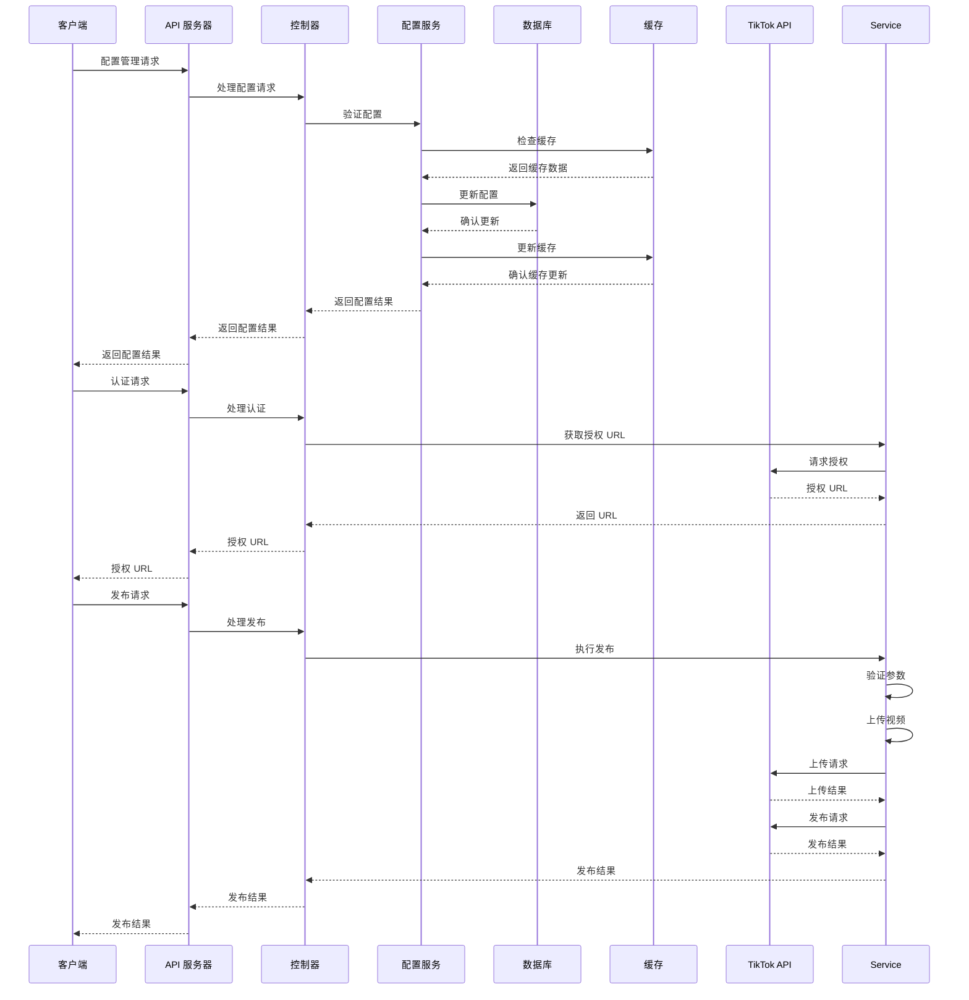

**图表来源**
- [web/server/src/routes/system.ts:17-185](file://web/server/src/routes/system.ts#L17-L185)
- [web/server/src/routes/auth.ts:1-119](file://web/server/src/routes/auth.ts#L1-L119)
- [src/services/publish-service.ts:38-80](file://src/services/publish-service.ts#L38-L80)

## 详细组件分析

### 系统配置管理组件

#### 配置加载机制

系统配置采用延迟加载和缓存机制，确保启动性能和运行时效率：

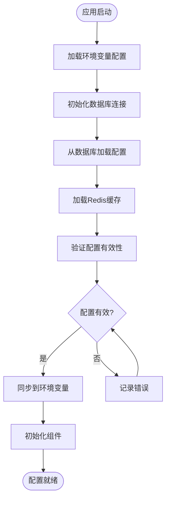

**图表来源**
- [web/server/src/index.ts:70-88](file://web/server/src/index.ts#L70-L88)
- [web/server/src/services/system-config-service.ts:142-157](file://web/server/src/services/system-config-service.ts#L142-L157)

#### 配置验证机制

系统实现了多层次的配置验证机制，包括输入验证、格式验证和业务逻辑验证：

**章节来源**
- [web/server/src/routes/system.ts:64-164](file://web/server/src/routes/system.ts#L64-L164)

### 数据库配置存储

#### 配置表结构设计

系统配置采用专用的 app_config 表存储，支持动态配置扩展：

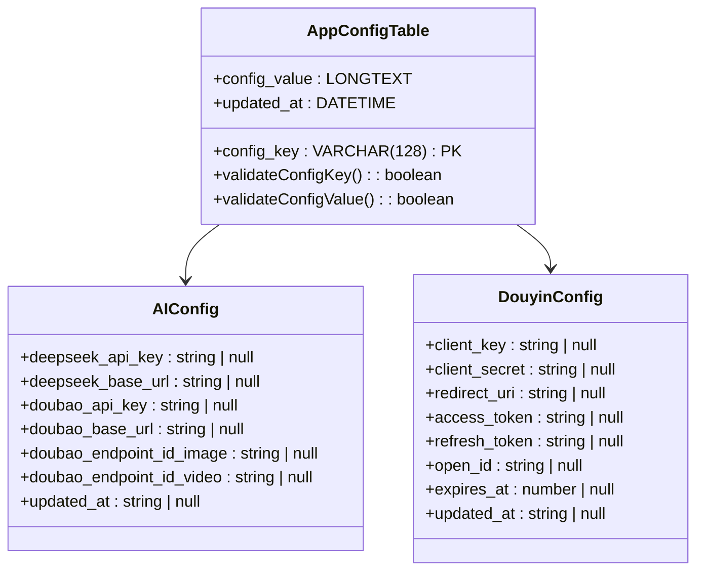

**图表来源**
- [web/server/src/database/schema.sql:74-79](file://web/server/src/database/schema.sql#L74-L79)
- [web/server/src/services/system-config-service.ts:8-91](file://web/server/src/services/system-config-service.ts#L8-L91)

**章节来源**
- [web/server/src/database/schema.sql:1-79](file://web/server/src/database/schema.sql#L1-L79)

### 缓存层设计

#### Redis 缓存策略

系统采用 Redis 作为二级缓存，提高配置读取性能：

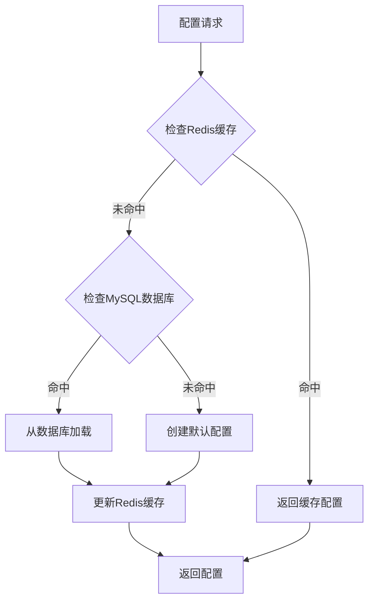

**图表来源**
- [web/server/src/services/system-config-service.ts:142-157](file://web/server/src/services/system-config-service.ts#L142-L157)

**章节来源**
- [web/server/src/services/system-config-service.ts:93-157](file://web/server/src/services/system-config-service.ts#L93-L157)

### 日志系统

#### 日志配置结构

日志系统采用 winston 库实现，支持多种输出格式和级别：

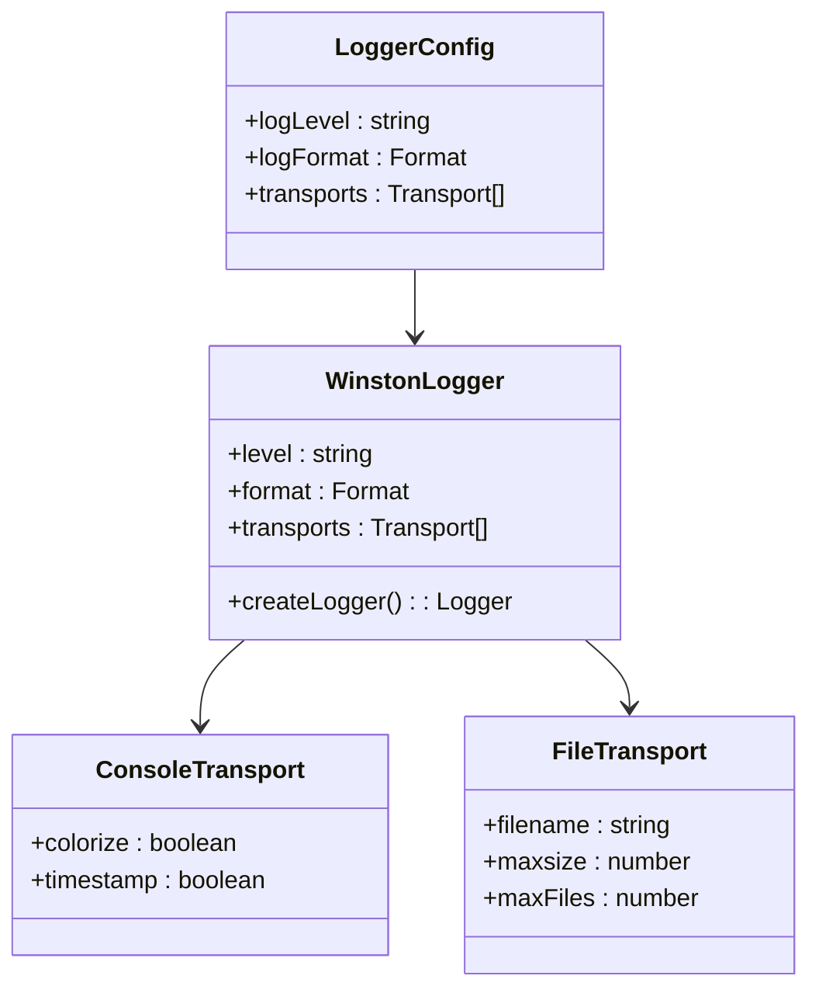

**图表来源**
- [src/utils/logger.ts:31-55](file://src/utils/logger.ts#L31-L55)

**章节来源**
- [src/utils/logger.ts:1-61](file://src/utils/logger.ts#L1-L61)

### 重试机制

#### 指数退避算法

系统实现了智能的重试机制，采用指数退避策略处理网络异常：


**图表来源**
- [src/utils/retry.ts:41-81](file://src/utils/retry.ts#L41-L81)

**章节来源**
- [src/utils/retry.ts:1-84](file://src/utils/retry.ts#L1-L84)

### 验证器组件

#### 参数验证流程

验证器组件负责确保输入参数的有效性和安全性：


**图表来源**
- [src/utils/validator.ts:22-86](file://src/utils/validator.ts#L22-L86)

**章节来源**
- [src/utils/validator.ts:1-116](file://src/utils/validator.ts#L1-L116)

### Web 服务器

#### API 路由架构

Web 服务器采用 Express.js 实现 RESTful API，提供完整的认证、发布和系统配置功能：

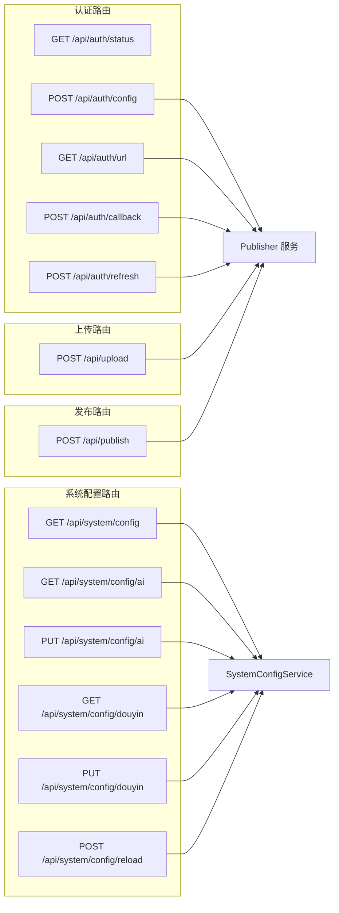

**图表来源**
- [web/server/src/routes/system.ts:1-188](file://web/server/src/routes/system.ts#L1-L188)
- [web/server/src/index.ts:48-54](file://web/server/src/index.ts#L48-L54)

**章节来源**
- [web/server/src/index.ts:1-93](file://web/server/src/index.ts#L1-L93)
- [web/server/src/routes/system.ts:1-188](file://web/server/src/routes/system.ts#L1-L188)

## 依赖关系分析

### 外部依赖

系统使用了多个关键的外部依赖库：

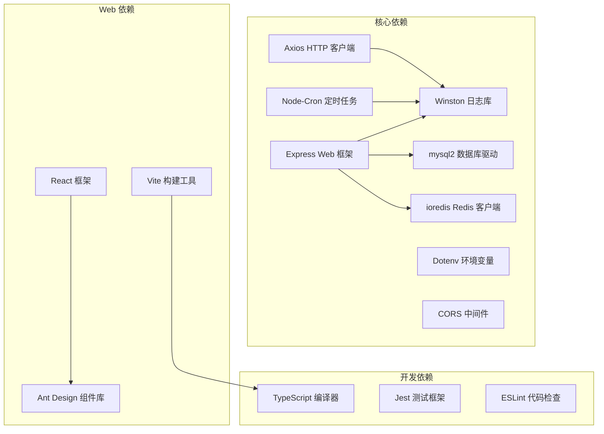

**图表来源**
- [package.json:18-32](file://package.json#L18-L32)
- [web/client/package.json:12-30](file://web/client/package.json#L12-L30)

### 内部依赖关系

系统内部组件之间的依赖关系清晰明确：

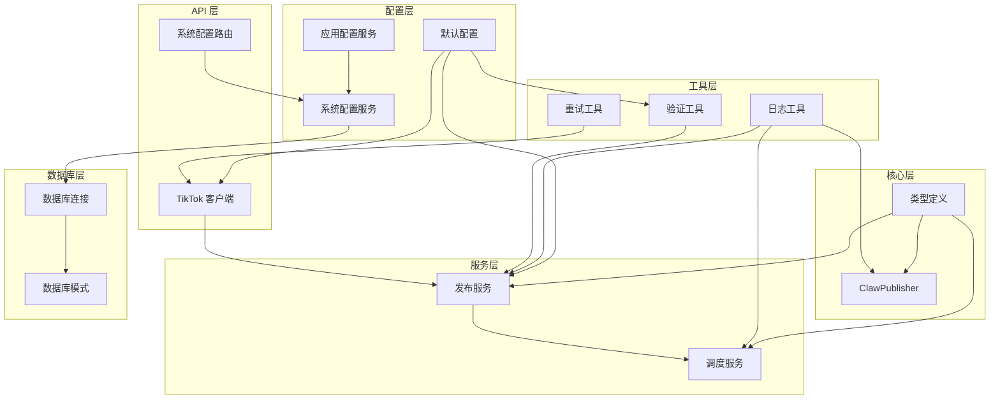

**图表来源**
- [src/index.ts:1-20](file://src/index.ts#L1-L20)
- [src/api/douyin-client.ts:1-6](file://src/api/douyin-client.ts#L1-L6)

**章节来源**
- [package.json:1-38](file://package.json#L1-L38)

## 性能考虑

### 配置优化

系统在配置层面已经实现了多项性能优化：

1. **分片上传优化**: 128MB 阈值和 5MB 默认分片大小平衡了上传效率和稳定性
2. **重试机制**: 指数退避算法避免了过度重试造成的资源浪费
3. **缓存策略**: Redis 缓存层显著提升配置读取性能
4. **数据库优化**: MySQL 连接池和索引优化确保配置存储性能

### 并发处理

系统支持多任务并发处理，通过以下机制保证性能：

- **定时任务调度**: 使用 node-cron 实现高效的定时任务管理
- **异步操作**: 所有网络请求都采用异步处理模式
- **资源池管理**: 合理的连接池配置避免资源耗尽
- **缓存层并发**: Redis 缓存支持高并发读取操作

### 内存管理

系统实现了完善的内存管理机制：

- **临时文件清理**: 自动清理下载的临时文件
- **任务状态管理**: 使用 Map 结构高效管理任务状态
- **日志轮转**: 支持日志文件轮转避免磁盘空间占用
- **缓存淘汰**: Redis 缓存设置合理的 TTL 时间

## 故障排除指南

### 常见问题诊断

#### 配置相关问题

**问题**: 配置加载失败
**解决方案**: 
1. 检查 config/default.ts 文件语法
2. 验证环境变量设置
3. 确认配置项完整性
4. 检查数据库连接状态
5. 验证 Redis 服务可用性

**问题**: 认证失败
**解决方案**:
1. 验证 TikTok API 凭据
2. 检查重定向 URI 配置
3. 确认网络连接正常
4. 验证配置缓存一致性

#### 上传相关问题

**问题**: 视频上传失败
**解决方案**:
1. 检查文件格式和大小限制
2. 验证网络连接稳定性
3. 查看重试日志分析失败原因
4. 检查磁盘空间和权限

**问题**: 分片上传中断
**解决方案**:
1. 检查分片大小设置
2. 验证磁盘空间充足
3. 确认网络稳定性
4. 检查 Redis 缓存状态

#### 发布相关问题

**问题**: 视频发布失败
**解决方案**:
1. 检查发布选项配置
2. 验证内容合规性
3. 确认 TikTok API 可用性
4. 检查抖音授权状态

#### 配置管理问题

**问题**: 系统配置无法保存
**解决方案**:
1. 检查数据库连接状态
2. 验证 Redis 服务可用性
3. 确认管理员权限
4. 检查配置格式和数据类型

### 调试技巧

#### 日志分析

系统提供了完整的日志记录机制，建议重点关注：

1. **错误日志**: 分析具体的错误类型和发生时间
2. **性能日志**: 监控请求响应时间和资源使用情况
3. **调试日志**: 详细记录关键操作的执行过程
4. **配置日志**: 监控配置加载和更新过程

#### 性能监控

建议使用以下指标监控系统性能：

- **API 响应时间**: 监控 TikTok API 的响应性能
- **上传速度**: 跟踪视频上传的吞吐量
- **任务成功率**: 统计定时任务的执行成功率
- **内存使用**: 监控系统的内存消耗情况
- **数据库性能**: 监控 MySQL 查询性能
- **缓存命中率**: 监控 Redis 缓存使用效率

**章节来源**
- [src/utils/logger.ts:10-12](file://src/utils/logger.ts#L10-L12)
- [src/utils/retry.ts:62-75](file://src/utils/retry.ts#L62-L75)

## 结论

ClawOperations 配置管理系统展现了优秀的软件工程实践，具有以下特点：

### 设计优势

1. **模块化架构**: 清晰的分层设计便于维护和扩展
2. **数据库驱动配置**: 完整的配置存储和管理机制
3. **缓存优化**: Redis 缓存层显著提升性能
4. **安全配置**: 敏感信息脱敏和安全存储
5. **完善的错误处理**: 全面的异常处理机制保证了系统的稳定性
6. **性能优化**: 合理的配置和算法设计确保了良好的性能表现

### 技术亮点

1. **智能重试机制**: 指数退避算法有效处理网络异常
2. **灵活的配置系统**: 支持运行时配置修改和环境变量覆盖
3. **全面的日志记录**: 多层次的日志系统便于问题诊断
4. **安全的认证流程**: 完整的 OAuth 2.0 实现保障了安全性
5. **实时配置更新**: 支持配置的热更新和即时生效
6. **配置验证机制**: 多层次的数据验证确保配置质量

### 改进建议

1. **配置版本管理**: 考虑实现配置的历史版本追踪
2. **监控告警**: 添加更完善的监控和告警机制
3. **文档完善**: 增加更多的使用示例和最佳实践
4. **测试覆盖**: 提高单元测试和集成测试的覆盖率
5. **配置导入导出**: 支持配置的批量导入导出功能
6. **配置模板**: 提供常用配置模板简化配置过程

该系统为小龙虾主题的 TikTok 营销提供了强大的技术支撑，其设计思路和实现方式值得其他类似项目借鉴学习。新增的系统配置管理功能进一步增强了系统的可维护性和扩展性，为未来的功能扩展奠定了坚实的基础。