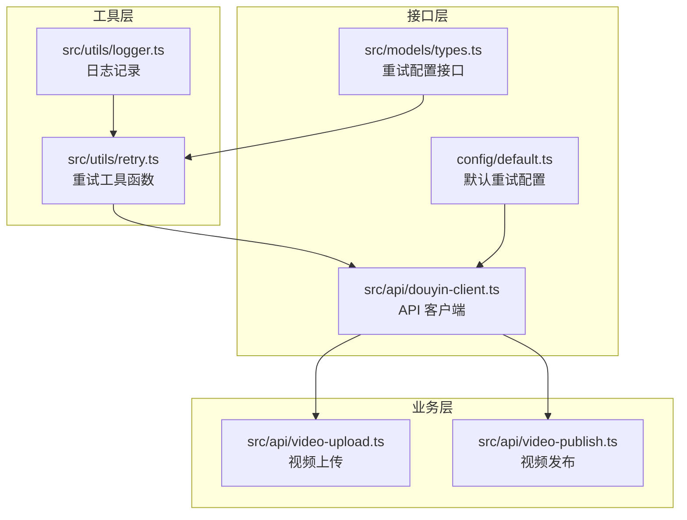
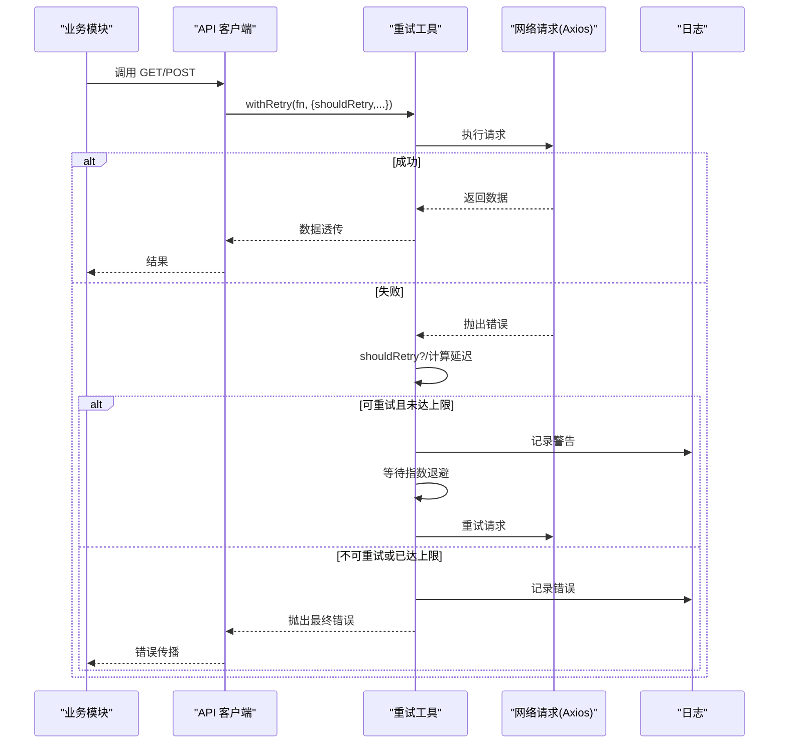
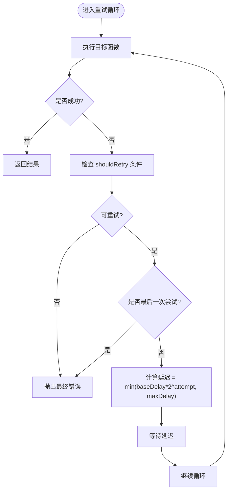
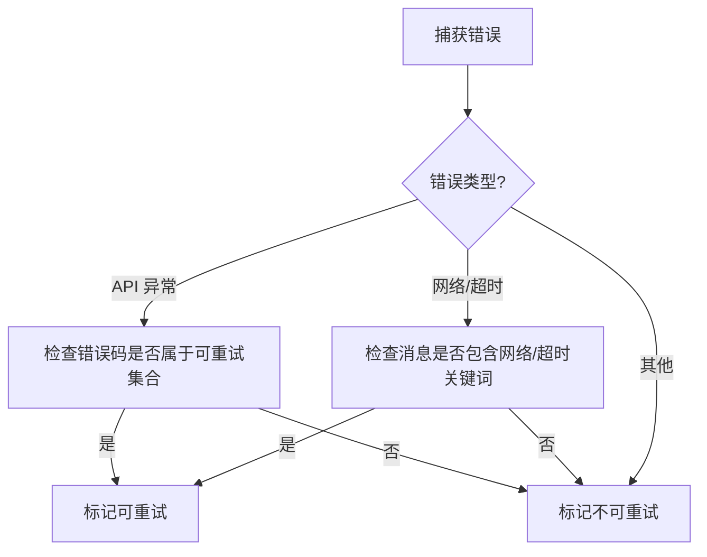
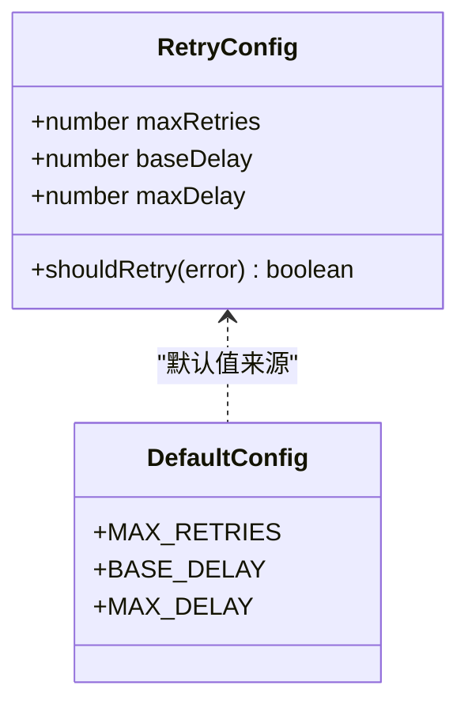
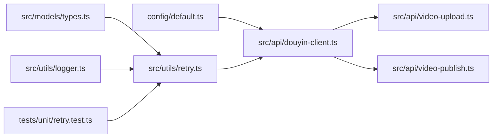

# 重试机制

<cite>
**本文引用的文件**
- [src/utils/retry.ts](file://src/utils/retry.ts)
- [tests/unit/retry.test.ts](file://tests/unit/retry.test.ts)
- [config/default.ts](file://config/default.ts)
- [src/models/types.ts](file://src/models/types.ts)
- [src/api/douyin-client.ts](file://src/api/douyin-client.ts)
- [src/api/video-upload.ts](file://src/api/video-upload.ts)
- [src/api/video-publish.ts](file://src/api/video-publish.ts)
- [src/utils/logger.ts](file://src/utils/logger.ts)
- [package.json](file://package.json)
</cite>

## 目录
1. [简介](#简介)
2. [项目结构](#项目结构)
3. [核心组件](#核心组件)
4. [架构概览](#架构概览)
5. [详细组件分析](#详细组件分析)
6. [依赖关系分析](#依赖关系分析)
7. [性能考量](#性能考量)
8. [故障排查指南](#故障排查指南)
9. [结论](#结论)
10. [附录](#附录)

## 简介
本文件系统性阐述项目中的重试机制，重点围绕指数退避算法的实现原理与数学公式、错误分类策略与重试条件判断、关键参数配置方法，以及在不同网络错误与 API 错误场景下的重试策略示例。同时提供自定义重试规则与扩展重试逻辑的方法，并给出性能影响分析与优化建议，帮助读者在保证可靠性的同时控制资源消耗。

## 项目结构
与重试机制直接相关的模块与文件分布如下：
- 工具层：重试工具函数与默认配置
- 接口层：API 客户端封装，集成重试策略
- 业务层：上传与发布模块，调用客户端进行带重试的请求
- 类型与配置：重试配置接口、默认重试参数、日志记录

图表来源
- [src/utils/retry.ts:1-84](file://src/utils/retry.ts#L1-L84)
- [src/api/douyin-client.ts:1-237](file://src/api/douyin-client.ts#L1-L237)
- [config/default.ts:17-24](file://config/default.ts#L17-L24)
- [src/models/types.ts:4-13](file://src/models/types.ts#L4-L13)
- [src/utils/logger.ts:1-61](file://src/utils/logger.ts#L1-L61)
- [src/api/video-upload.ts:1-241](file://src/api/video-upload.ts#L1-L241)
- [src/api/video-publish.ts:1-174](file://src/api/video-publish.ts#L1-L174)

章节来源
- [src/utils/retry.ts:1-84](file://src/utils/retry.ts#L1-L84)
- [config/default.ts:17-24](file://config/default.ts#L17-L24)
- [src/models/types.ts:4-13](file://src/models/types.ts#L4-L13)
- [src/api/douyin-client.ts:1-237](file://src/api/douyin-client.ts#L1-L237)
- [src/api/video-upload.ts:1-241](file://src/api/video-upload.ts#L1-L241)
- [src/api/video-publish.ts:1-174](file://src/api/video-publish.ts#L1-L174)
- [src/utils/logger.ts:1-61](file://src/utils/logger.ts#L1-L61)

## 核心组件
- 重试工具函数 withRetry：提供统一的指数退避重试能力，支持自定义重试条件、合并默认配置与动态参数。
- 默认重试配置：集中定义最大重试次数、基础延迟、最大延迟等关键参数。
- API 客户端：在 HTTP 请求中集成重试策略，基于错误类型与消息特征决定是否重试。
- 业务模块：上传与发布模块通过客户端发起请求，间接获得重试保护。

章节来源
- [src/utils/retry.ts:41-81](file://src/utils/retry.ts#L41-L81)
- [config/default.ts:17-24](file://config/default.ts#L17-L24)
- [src/api/douyin-client.ts:124-198](file://src/api/douyin-client.ts#L124-L198)
- [src/api/video-upload.ts:35-96](file://src/api/video-upload.ts#L35-L96)
- [src/api/video-publish.ts:30-54](file://src/api/video-publish.ts#L30-L54)

## 架构概览
下图展示了“业务调用 → 客户端 → 重试工具 → 网络请求”的完整链路，以及错误分类与重试条件判断的关键节点。

图表来源
- [src/api/douyin-client.ts:124-198](file://src/api/douyin-client.ts#L124-L198)
- [src/utils/retry.ts:41-81](file://src/utils/retry.ts#L41-L81)

## 详细组件分析

### 指数退避算法与数学公式
- 延迟计算：第 n 次重试的延迟为 baseDelay × 2^n，且不超过 maxDelay。
- 重试循环：最多尝试 maxRetries + 1 次（含首次），若最后一次仍失败则抛出错误。
- 日志记录：每次失败会输出警告日志，包含当前尝试次数与延迟时间；达到上限时输出错误日志。

图表来源
- [src/utils/retry.ts:22-25](file://src/utils/retry.ts#L22-L25)
- [src/utils/retry.ts:54-77](file://src/utils/retry.ts#L54-L77)

章节来源
- [src/utils/retry.ts:22-25](file://src/utils/retry.ts#L22-L25)
- [src/utils/retry.ts:54-77](file://src/utils/retry.ts#L54-L77)

### 错误分类策略与重试条件判断
- API 客户端内部对错误进行分类：
  - 抖音 API 异常：根据特定错误码（如限流相关）判定是否可重试。
  - 网络错误与超时：根据错误消息特征（如包含“网络错误”、“timeout”、“ECONNRESET”等）判定可重试。
  - 其他错误：默认不可重试。
- 该策略通过 shouldRetry 函数注入到重试工具，确保只对可恢复的瞬时错误进行重试。

图表来源
- [src/api/douyin-client.ts:204-220](file://src/api/douyin-client.ts#L204-L220)

章节来源
- [src/api/douyin-client.ts:204-220](file://src/api/douyin-client.ts#L204-L220)

### 关键参数配置方法
- 默认重试配置集中于配置文件，包含：
  - 最大重试次数：控制总尝试次数上限。
  - 基础延迟时间：决定第一次重试的延迟基准。
  - 最大延迟时间：限制单次延迟上限，避免过长等待。
- 重试工具函数支持传入部分配置，与默认配置进行浅合并，便于按需覆盖。

图表来源
- [src/models/types.ts:4-13](file://src/models/types.ts#L4-L13)
- [config/default.ts:17-24](file://config/default.ts#L17-L24)

章节来源
- [config/default.ts:17-24](file://config/default.ts#L17-L24)
- [src/models/types.ts:4-13](file://src/models/types.ts#L4-L13)
- [src/utils/retry.ts:45-48](file://src/utils/retry.ts#L45-L48)

### 不同错误类型的重试策略示例
- 网络错误与超时：当错误消息包含网络/超时关键词时，视为可重试，采用指数退避延迟。
- 抖音 API 限流：当错误码属于预设的限流集合时，视为可重试。
- 其他错误：如认证失败、参数错误等，视为不可重试，直接抛出。

章节来源
- [src/api/douyin-client.ts:204-220](file://src/api/douyin-client.ts#L204-L220)
- [tests/unit/retry.test.ts:40-52](file://tests/unit/retry.test.ts#L40-L52)

### 自定义重试规则与扩展重试逻辑
- 自定义 shouldRetry：在调用重试工具时传入自定义函数，仅对满足条件的错误进行重试。
- 参数覆盖：通过传入部分配置覆盖默认值，实现灵活的重试策略组合。
- 业务扩展：在 API 客户端中，将 shouldRetry 注入到 withRetry 的配置中，确保所有 HTTP 请求均受控于统一的重试策略。

章节来源
- [src/utils/retry.ts:41-81](file://src/utils/retry.ts#L41-L81)
- [src/api/douyin-client.ts:124-198](file://src/api/douyin-client.ts#L124-L198)
- [tests/unit/retry.test.ts:40-52](file://tests/unit/retry.test.ts#L40-L52)

### 性能影响分析与优化建议
- CPU 与内存：重试循环与日志输出会产生少量 CPU 与内存开销，通常可忽略。
- 网络与带宽：指数退避会增加总等待时间，应结合 maxRetries 与 maxDelay 控制总等待上限。
- 并发与吞吐：在高并发场景下，建议为不同接口设置差异化重试策略，避免全局一致的重试导致资源争用。
- 超时设置：结合底层 HTTP 客户端的超时配置，确保整体超时时间合理，避免重试叠加导致超时过长。
- 日志级别：生产环境建议适当降低日志级别，减少磁盘 IO 与日志写入压力。

章节来源
- [src/utils/retry.ts:73-75](file://src/utils/retry.ts#L73-L75)
- [src/utils/logger.ts:10-12](file://src/utils/logger.ts#L10-L12)

## 依赖关系分析
- 重试工具依赖类型定义与日志模块，提供统一的重试能力。
- API 客户端依赖重试工具与默认配置，将重试策略注入到 HTTP 请求中。
- 业务模块通过客户端发起请求，间接获得重试保护。
- 测试用例验证重试行为、指数退避、最大延迟限制与自定义条件。

图表来源
- [src/models/types.ts:4-13](file://src/models/types.ts#L4-L13)
- [src/utils/retry.ts:1-84](file://src/utils/retry.ts#L1-L84)
- [src/utils/logger.ts:1-61](file://src/utils/logger.ts#L1-L61)
- [config/default.ts:17-24](file://config/default.ts#L17-L24)
- [src/api/douyin-client.ts:1-237](file://src/api/douyin-client.ts#L1-L237)
- [src/api/video-upload.ts:1-241](file://src/api/video-upload.ts#L1-L241)
- [src/api/video-publish.ts:1-174](file://src/api/video-publish.ts#L1-L174)
- [tests/unit/retry.test.ts:1-106](file://tests/unit/retry.test.ts#L1-L106)

章节来源
- [src/models/types.ts:4-13](file://src/models/types.ts#L4-L13)
- [src/utils/retry.ts:1-84](file://src/utils/retry.ts#L1-L84)
- [src/utils/logger.ts:1-61](file://src/utils/logger.ts#L1-L61)
- [config/default.ts:17-24](file://config/default.ts#L17-L24)
- [src/api/douyin-client.ts:1-237](file://src/api/douyin-client.ts#L1-L237)
- [src/api/video-upload.ts:1-241](file://src/api/video-upload.ts#L1-L241)
- [src/api/video-publish.ts:1-174](file://src/api/video-publish.ts#L1-L174)
- [tests/unit/retry.test.ts:1-106](file://tests/unit/retry.test.ts#L1-L106)

## 性能考量
- 指数退避带来的总等待时间约为 baseDelay × (2^(maxRetries+1) - 1)，建议结合业务 SLA 与用户体验设定合理上限。
- 在高并发场景下，建议为不同接口设置差异化重试策略，避免全局一致的重试导致资源争用。
- 生产环境建议降低日志级别，减少磁盘 IO 与日志写入压力。
- 结合底层 HTTP 客户端的超时配置，确保整体超时时间合理，避免重试叠加导致超时过长。

## 故障排查指南
- 确认 shouldRetry 条件是否正确：检查自定义函数是否覆盖了预期的错误类型。
- 检查日志输出：关注警告与错误日志，定位失败原因与重试次数。
- 验证配置合并：确认传入的配置与默认配置是否正确合并。
- 使用测试用例参考：对照单元测试中的断言，验证指数退避与最大延迟限制的行为。

章节来源
- [tests/unit/retry.test.ts:18-28](file://tests/unit/retry.test.ts#L18-L28)
- [tests/unit/retry.test.ts:54-67](file://tests/unit/retry.test.ts#L54-L67)
- [tests/unit/retry.test.ts:69-86](file://tests/unit/retry.test.ts#L69-L86)
- [src/utils/retry.ts:61-70](file://src/utils/retry.ts#L61-L70)

## 结论
本项目的重试机制以指数退避为核心，结合错误分类与可插拔的重试条件，实现了对瞬时网络错误与 API 限流的有效恢复。通过默认配置与灵活的参数覆盖，可在保证可靠性的同时控制资源消耗。建议在实际部署中根据业务场景调整重试参数，并结合日志与监控持续优化。

## 附录
- 依赖版本：axios、winston、dotenv、form-data 等，详见 package.json。
- 配置项：默认重试参数位于 config/default.ts，类型定义位于 src/models/types.ts。

章节来源
- [package.json:14-29](file://package.json#L14-L29)
- [config/default.ts:17-24](file://config/default.ts#L17-L24)
- [src/models/types.ts:4-13](file://src/models/types.ts#L4-L13)