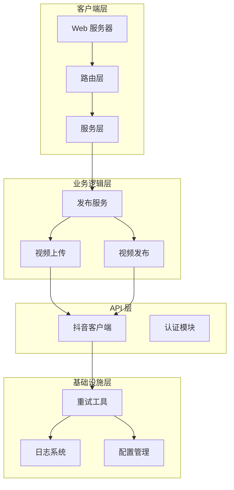
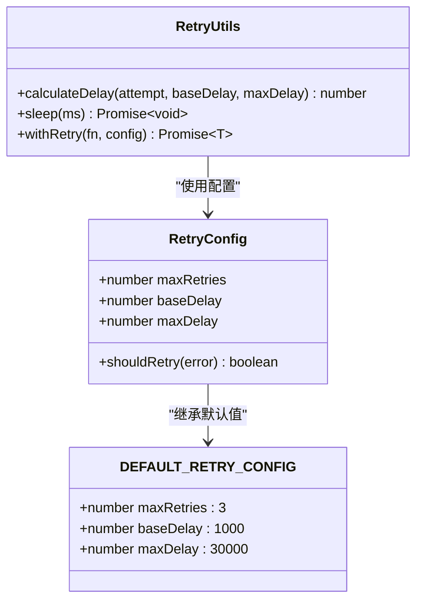
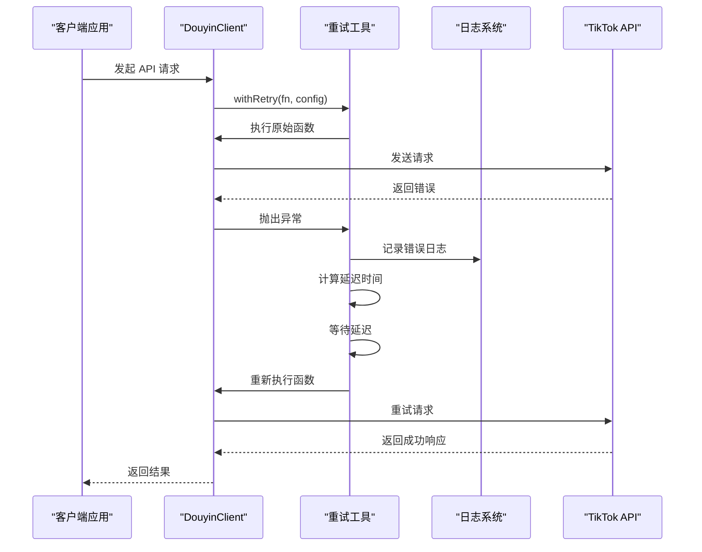
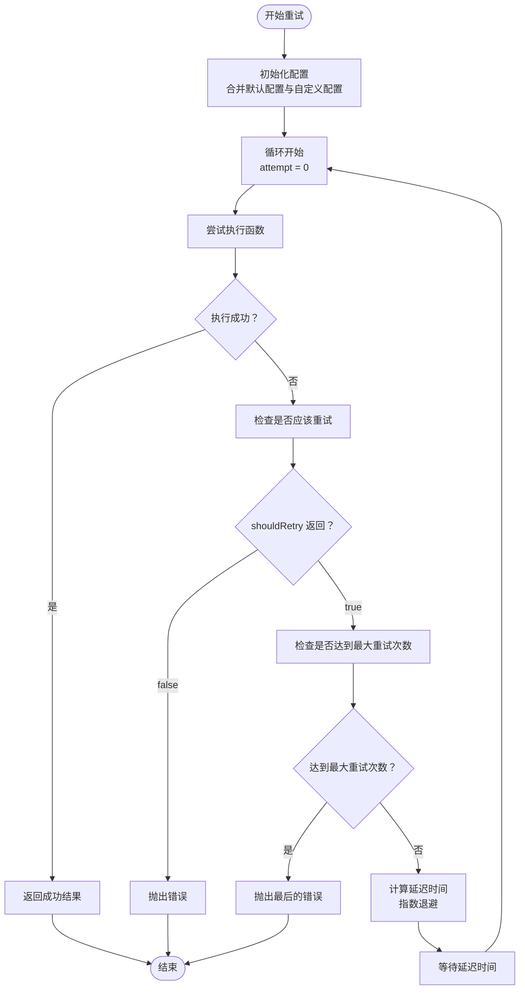
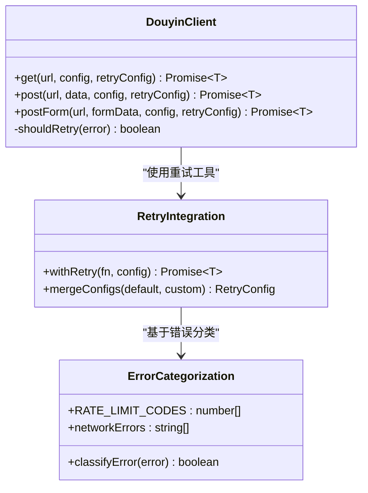
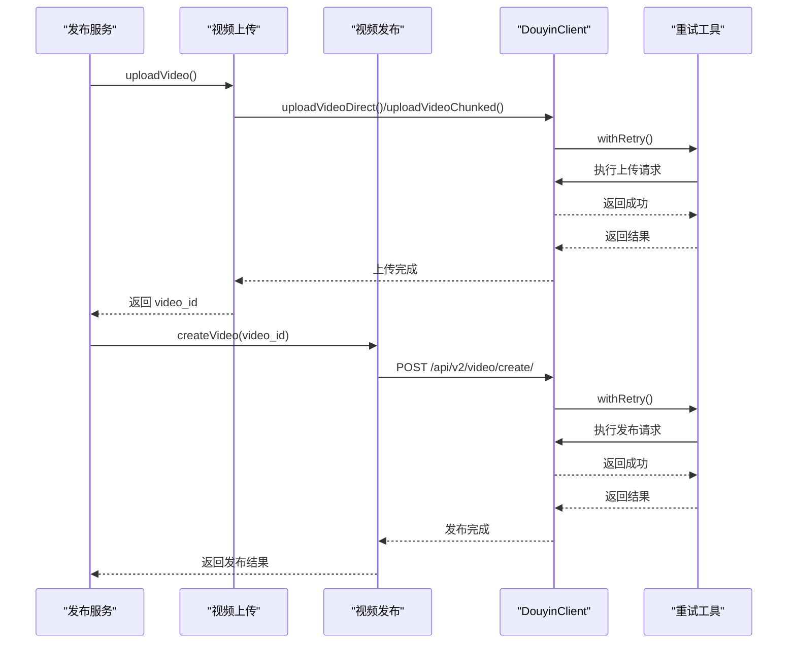
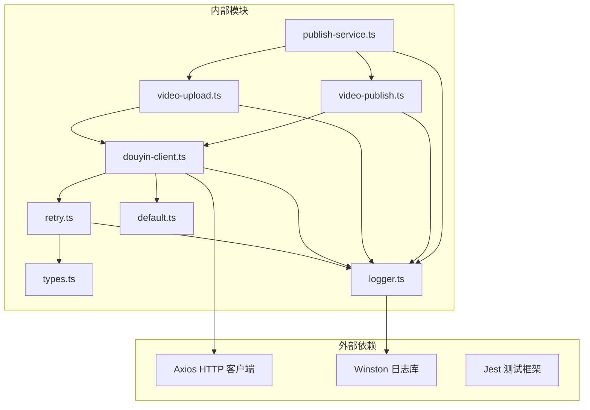

# 重试机制

<cite>
**本文档中引用的文件**
- [src/utils/retry.ts](file://src/utils/retry.ts)
- [tests/unit/retry.test.ts](file://tests/unit/retry.test.ts)
- [src/models/types.ts](file://src/models/types.ts)
- [config/default.ts](file://config/default.ts)
- [src/api/douyin-client.ts](file://src/api/douyin-client.ts)
- [src/api/video-upload.ts](file://src/api/video-upload.ts)
- [src/api/video-publish.ts](file://src/api/video-publish.ts)
- [src/services/publish-service.ts](file://src/services/publish-service.ts)
- [src/utils/logger.ts](file://src/utils/logger.ts)
- [web/server/src/services/publisher.ts](file://web/server/src/services/publisher.ts)
- [web/server/src/routes/publish.ts](file://web/server/src/routes/publish.ts)
</cite>

## 目录
1. [简介](#简介)
2. [项目结构](#项目结构)
3. [核心组件](#核心组件)
4. [架构概览](#架构概览)
5. [详细组件分析](#详细组件分析)
6. [依赖关系分析](#依赖关系分析)
7. [性能考虑](#性能考虑)
8. [故障排除指南](#故障排除指南)
9. [结论](#结论)

## 简介

ClawOperations 项目实现了完整的重试机制，专门针对 TikTok（抖音）API 的不稳定性和网络波动进行了优化。该重试机制采用指数退避策略，结合智能错误判断，确保在面对网络超时、API 限流等临时性错误时能够自动恢复，提高系统的稳定性和可靠性。

重试机制的核心价值在于：
- **自动容错**：在网络不稳定或 API 临时故障时自动重试
- **指数退避**：避免对 API 造成雪崩效应，减少系统压力
- **智能判断**：区分可重试错误和不可重试错误
- **可观测性**：详细的日志记录便于问题诊断

## 项目结构

该项目采用模块化设计，重试机制分布在多个层次中：

**图表来源**
- [src/utils/retry.ts:1-84](file://src/utils/retry.ts#L1-L84)
- [src/api/douyin-client.ts:1-237](file://src/api/douyin-client.ts#L1-L237)
- [src/services/publish-service.ts:1-228](file://src/services/publish-service.ts#L1-L228)

**章节来源**
- [src/utils/retry.ts:1-84](file://src/utils/retry.ts#L1-L84)
- [src/api/douyin-client.ts:1-237](file://src/api/douyin-client.ts#L1-L237)
- [src/services/publish-service.ts:1-228](file://src/services/publish-service.ts#L1-L228)

## 核心组件

### 重试配置系统

重试机制通过统一的配置系统实现，支持全局默认配置和局部自定义配置：

**图表来源**
- [src/models/types.ts:4-13](file://src/models/types.ts#L4-L13)
- [src/utils/retry.ts:9-13](file://src/utils/retry.ts#L9-L13)
- [src/utils/retry.ts:41-81](file://src/utils/retry.ts#L41-L81)

### 指数退避算法

重试机制采用指数退避策略，避免对 API 造成过大的压力：

**章节来源**
- [src/utils/retry.ts:22-25](file://src/utils/retry.ts#L22-L25)
- [src/utils/retry.ts:73-75](file://src/utils/retry.ts#L73-L75)

## 架构概览

重试机制在整个系统中的位置和作用：

**图表来源**
- [src/api/douyin-client.ts:124-166](file://src/api/douyin-client.ts#L124-L166)
- [src/utils/retry.ts:41-81](file://src/utils/retry.ts#L41-L81)

## 详细组件分析

### 重试工具实现

重试工具是整个机制的核心组件，提供了完整的重试逻辑：

#### 核心功能分析

**图表来源**
- [src/utils/retry.ts:41-81](file://src/utils/retry.ts#L41-L81)

#### 关键实现细节

1. **配置合并机制**：支持部分配置覆盖，默认配置提供安全的基线
2. **指数退避计算**：`delay = baseDelay * 2^attempt`，确保延迟随重试次数递增
3. **最大延迟限制**：防止延迟无限增长，保护系统稳定性
4. **智能重试判断**：允许自定义重试条件函数

**章节来源**
- [src/utils/retry.ts:41-81](file://src/utils/retry.ts#L41-L81)
- [src/models/types.ts:4-13](file://src/models/types.ts#L4-L13)

### 抖音客户端集成

DouyinClient 将重试机制深度集成到 API 调用中：

#### API 方法重试包装

**图表来源**
- [src/api/douyin-client.ts:124-198](file://src/api/douyin-client.ts#L124-L198)
- [src/api/douyin-client.ts:204-220](file://src/api/douyin-client.ts#L204-L220)

#### 错误分类策略

重试机制根据错误类型智能决定是否重试：

| 错误类型 | 错误码 | 重试条件 | 说明 |
|---------|--------|----------|------|
| API 限流 | 429, 10001, 10002 | ✅ | TikTok API 限流错误 |
| 网络超时 | timeout | ✅ | 网络连接超时 |
| 连接重置 | ECONNRESET | ✅ | 网络连接被重置 |
| 认证错误 | 401, 403 | ❌ | 需要重新认证，不应重试 |
| 参数错误 | 400 | ❌ | 参数错误，重试无意义 |

**章节来源**
- [src/api/douyin-client.ts:204-220](file://src/api/douyin-client.ts#L204-L220)

### 业务服务层应用

发布服务在关键操作中应用重试机制：

#### 发布流程中的重试点

**图表来源**
- [src/services/publish-service.ts:38-80](file://src/services/publish-service.ts#L38-L80)
- [src/api/video-upload.ts:35-54](file://src/api/video-upload.ts#L35-L54)
- [src/api/video-publish.ts:30-54](file://src/api/video-publish.ts#L30-L54)

**章节来源**
- [src/services/publish-service.ts:38-80](file://src/services/publish-service.ts#L38-L80)
- [src/api/video-upload.ts:35-54](file://src/api/video-upload.ts#L35-L54)
- [src/api/video-publish.ts:30-54](file://src/api/video-publish.ts#L30-L54)

## 依赖关系分析

重试机制的依赖关系图：

**图表来源**
- [src/utils/retry.ts:1-2](file://src/utils/retry.ts#L1-L2)
- [src/api/douyin-client.ts:1-6](file://src/api/douyin-client.ts#L1-L6)
- [src/services/publish-service.ts:1-17](file://src/services/publish-service.ts#L1-L17)

### 循环依赖检测

经过分析，项目中没有发现循环依赖：
- retry.ts 不依赖任何业务模块
- api 模块依赖 retry.ts 和 logger.ts
- service 模块依赖 api 模块
- 测试模块依赖实现模块

**章节来源**
- [src/utils/retry.ts:1-84](file://src/utils/retry.ts#L1-L84)
- [src/api/douyin-client.ts:1-237](file://src/api/douyin-client.ts#L1-L237)

## 性能考虑

### 指数退避的性能影响

指数退避策略在保证系统稳定性的同时，需要考虑以下性能因素：

1. **延迟增长控制**：通过 `maxDelay` 限制最大等待时间
2. **重试次数限制**：通过 `maxRetries` 防止无限重试
3. **内存使用**：重试过程中的错误对象缓存
4. **CPU 开销**：延迟等待期间的 CPU 占用

### 配置优化建议

| 配置项 | 默认值 | 优化建议 | 使用场景 |
|--------|--------|----------|----------|
| maxRetries | 3 | 1-5 | 一般 API 调用 |
| baseDelay | 1000ms | 500-2000ms | 网络波动较大的环境 |
| maxDelay | 30000ms | 10000-60000ms | 高并发场景 |
| shouldRetry | 智能判断 | 自定义函数 | 特定业务需求 |

## 故障排除指南

### 常见问题诊断

#### 重试不生效

**可能原因**：
1. `shouldRetry` 函数返回 `false`
2. 错误类型不在重试范围内
3. 已达到最大重试次数

**排查步骤**：
1. 检查自定义 `shouldRetry` 函数逻辑
2. 查看错误日志中的错误类型
3. 验证 `maxRetries` 配置是否合理

#### 重试时间过长

**可能原因**：
1. `baseDelay` 设置过大
2. `maxDelay` 设置过小
3. 网络环境较差

**解决方案**：
1. 调整 `baseDelay` 到更合理的值
2. 根据网络状况调整 `maxDelay`
3. 考虑网络优化措施

#### 内存泄漏风险

**预防措施**：
1. 确保错误对象正确清理
2. 避免在 `shouldRetry` 中持有大量资源
3. 监控长时间运行进程的内存使用

**章节来源**
- [tests/unit/retry.test.ts:18-52](file://tests/unit/retry.test.ts#L18-L52)
- [src/utils/retry.ts:52-70](file://src/utils/retry.ts#L52-L70)

### 测试验证

重试机制通过全面的单元测试验证：

#### 测试覆盖范围

| 测试场景 | 测试方法 | 验证要点 |
|----------|----------|----------|
| 成功重试 | 模拟第一次失败，后续成功 | 重试次数、最终成功 |
| 达到最大重试 | 持续失败直到达到上限 | 错误传播、重试次数 |
| 自定义重试条件 | 提供 shouldRetry 函数 | 条件判断逻辑 |
| 指数退避 | 测量重试间隔时间 | 延迟计算准确性 |
| 最大延迟限制 | 设置较小 maxDelay | 延迟上限控制 |

**章节来源**
- [tests/unit/retry.test.ts:18-104](file://tests/unit/retry.test.ts#L18-L104)

## 结论

ClawOperations 项目的重试机制设计体现了以下特点：

### 设计优势

1. **模块化设计**：重试工具独立于业务逻辑，易于维护和测试
2. **智能重试**：基于错误类型的智能判断，避免无效重试
3. **可配置性**：支持全局默认配置和局部自定义配置
4. **可观测性**：详细的日志记录便于问题诊断
5. **性能优化**：指数退避策略平衡成功率和系统负载

### 应用效果

- **稳定性提升**：显著减少了因网络波动导致的失败率
- **用户体验改善**：自动重试减少了用户手动重试的需求
- **系统可靠性增强**：在高并发场景下保持稳定的 API 调用
- **运维成本降低**：减少人工干预和故障处理工作量

### 未来改进方向

1. **动态配置调整**：根据历史重试成功率动态调整重试策略
2. **并发控制**：在高并发场景下限制同时进行的重试操作
3. **监控指标**：添加重试成功率、平均重试时间等监控指标
4. **优雅降级**：在极端情况下提供降级策略而非无限重试

重试机制作为系统稳定性的关键组件，在 ClawOperations 项目中发挥了重要作用，为整个内容发布系统的可靠性提供了坚实保障。