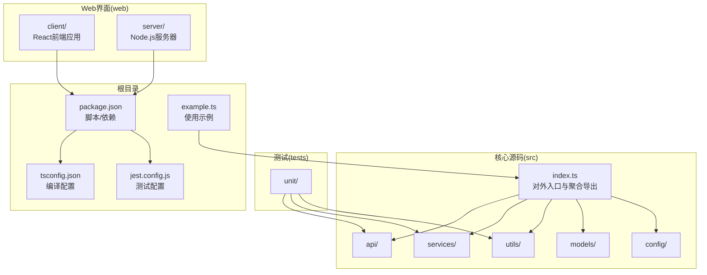
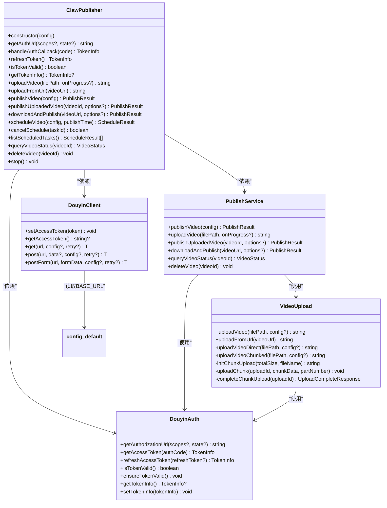
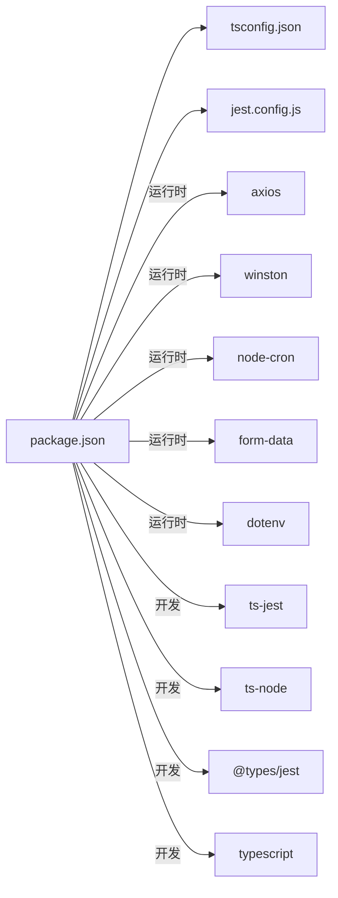
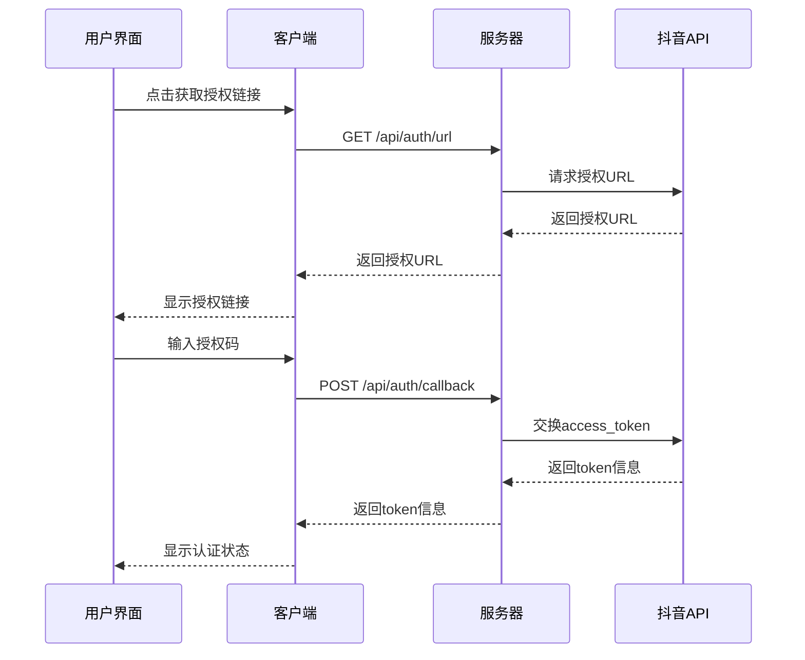
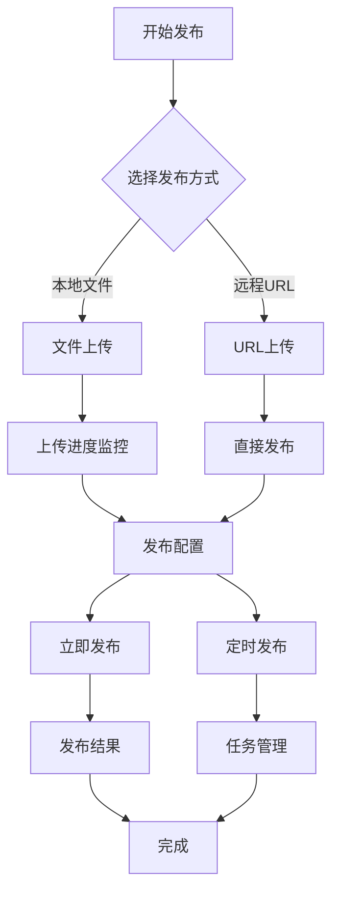

# 开发指南

<cite>
**本文档引用的文件**
- [package.json](file://package.json)
- [tsconfig.json](file://tsconfig.json)
- [jest.config.js](file://jest.config.js)
- [README.md](file://README.md)
- [src/index.ts](file://src/index.ts)
- [src/models/types.ts](file://src/models/types.ts)
- [src/api/douyin-client.ts](file://src/api/douyin-client.ts)
- [src/api/auth.ts](file://src/api/auth.ts)
- [src/api/video-upload.ts](file://src/api/video-upload.ts)
- [src/services/publish-service.ts](file://src/services/publish-service.ts)
- [src/utils/logger.ts](file://src/utils/logger.ts)
- [src/utils/retry.ts](file://src/utils/retry.ts)
- [config/default.ts](file://config/default.ts)
- [tests/unit/auth.test.ts](file://tests/unit/auth.test.ts)
- [example.ts](file://example.ts)
- [web/client/package.json](file://web/client/package.json)
- [web/client/vite.config.ts](file://web/client/vite.config.ts)
- [web/client/src/pages/AuthConfig.tsx](file://web/client/src/pages/AuthConfig.tsx)
- [web/client/src/pages/Publish.tsx](file://web/client/src/pages/Publish.tsx)
- [web/client/src/pages/TaskList.tsx](file://web/client/src/pages/TaskList.tsx)
- [web/client/src/api/client.ts](file://web/client/src/api/client.ts)
- [web/server/package.json](file://web/server/package.json)
- [web/server/src/index.ts](file://web/server/src/index.ts)
- [web/server/src/routes/auth.ts](file://web/server/src/routes/auth.ts)
- [web/server/src/routes/upload.ts](file://web/server/src/routes/upload.ts)
- [web/server/src/routes/publish.ts](file://web/server/src/routes/publish.ts)
- [web/server/src/services/publisher.ts](file://web/server/src/services/publisher.ts)
</cite>

## 目录
1. [简介](#简介)
2. [项目结构](#项目结构)
3. [核心组件](#核心组件)
4. [架构总览](#架构总览)
5. [详细组件分析](#详细组件分析)
6. [依赖关系分析](#依赖关系分析)
7. [性能与可靠性](#性能与可靠性)
8. [调试与故障排查](#调试与故障排查)
9. [开发流程与规范](#开发流程与规范)
10. [贡献指南与PR流程](#贡献指南与pr流程)
11. [版本发布与变更管理](#版本发布与变更管理)
12. [扩展点与插件机制](#扩展点与插件机制)
13. [常见问题与最佳实践](#常见问题与最佳实践)
14. [Web界面系统开发指南](#web界面系统开发指南)
15. [结语](#结语)

## 简介
ClawOperations 是一个面向抖音（Douyin）开放平台的自动化运营与内容发布 SDK，提供认证、视频上传（直传/分片）、发布、定时调度、状态查询与删除等能力。项目采用 TypeScript 构建，配合 Jest 进行单元测试，使用 Winston 输出日志，并通过 axios 与抖音 API 交互。

**新增** 项目现已包含完整的 Web 界面系统，提供图形化界面用于配置认证、上传视频和管理发布任务。

## 项目结构
- 核心源码位于 src/，按职责划分为 api、services、utils、models、config 等目录
- 测试位于 tests/，按功能划分单元测试
- Web 界面位于 web/ 目录，包含客户端 React 应用和服务器端 API 服务
- 根目录包含构建与运行脚本、TypeScript 编译配置、Jest 配置以及示例入口



**图表来源**
- [src/index.ts:1-248](file://src/index.ts#L1-L248)
- [package.json:1-38](file://package.json#L1-L38)
- [tsconfig.json:1-20](file://tsconfig.json#L1-L20)
- [jest.config.js:1-9](file://jest.config.js#L1-L9)
- [example.ts:1-197](file://example.ts#L1-L197)

**章节来源**
- [package.json:1-38](file://package.json#L1-L38)
- [tsconfig.json:1-20](file://tsconfig.json#L1-L20)
- [jest.config.js:1-9](file://jest.config.js#L1-L9)
- [README.md:1-152](file://README.md#L1-L152)

## 核心组件
- 对外入口与聚合导出：ClawPublisher 类封装认证、上传、发布、定时调度、视频管理等能力，统一对外暴露
- API 层：DouyinClient 提供 HTTP 客户端与拦截器；DouyinAuth 提供 OAuth 授权与 Token 管理；VideoUpload 提供直传/分片上传
- 服务层：PublishService 作为业务编排层，协调上传与发布流程
- 工具层：logger/winston 日志；retry 指数退避重试；validator 参数校验（在上传/发布处被调用）
- 配置层：config/default.ts 统一管理 API 基址、上传/重试/视频/内容等配置常量

**章节来源**
- [src/index.ts:29-244](file://src/index.ts#L29-L244)
- [src/api/douyin-client.ts:13-237](file://src/api/douyin-client.ts#L13-L237)
- [src/api/auth.ts:29-190](file://src/api/auth.ts#L29-L190)
- [src/api/video-upload.ts:20-241](file://src/api/video-upload.ts#L20-L241)
- [src/services/publish-service.ts:22-228](file://src/services/publish-service.ts#L22-L228)
- [src/utils/logger.ts:31-61](file://src/utils/logger.ts#L31-L61)
- [src/utils/retry.ts:41-84](file://src/utils/retry.ts#L41-L84)
- [config/default.ts:5-49](file://config/default.ts#L5-L49)

## 架构总览
整体采用"入口聚合 + API 客户端 + 服务编排 + 工具与配置"的分层设计。ClawPublisher 作为门面，内部组合 DouyinClient、DouyinAuth、PublishService、SchedulerService 等组件，实现认证、上传、发布、定时调度等功能。



**图表来源**
- [src/index.ts:29-244](file://src/index.ts#L29-L244)
- [src/api/douyin-client.ts:13-237](file://src/api/douyin-client.ts#L13-L237)
- [src/api/auth.ts:29-190](file://src/api/auth.ts#L29-L190)
- [src/services/publish-service.ts:22-228](file://src/services/publish-service.ts#L22-L228)
- [src/api/video-upload.ts:20-241](file://src/api/video-upload.ts#L20-L241)
- [config/default.ts:5-8](file://config/default.ts#L5-L8)

## 详细组件分析

### 对外入口：ClawPublisher
- 职责：统一对外接口，聚合认证、上传、发布、定时调度、视频管理等能力
- 关键方法：认证（授权 URL、回调换取 Token、刷新 Token、有效性检查）、上传（本地/URL）、发布（一站式/已上传/下载后发布）、定时任务（创建/取消/列举）、视频状态查询与删除、停止服务

**章节来源**
- [src/index.ts:29-244](file://src/index.ts#L29-L244)

### API 客户端：DouyinClient
- 职责：基于 axios 的 HTTP 客户端，内置请求/响应拦截器，自动注入 access_token，统一错误处理，封装 get/post/postForm
- 重试：结合 withRetry 实现指数退避重试，针对限流与网络异常进行自动恢复
- 错误：封装 DouyinApiException，便于上层捕获与区分

**章节来源**
- [src/api/douyin-client.ts:13-237](file://src/api/douyin-client.ts#L13-L237)

### 认证模块：DouyinAuth
- 职责：OAuth 授权流程（生成授权 URL、换取/刷新 Token），Token 有效期判断与自动刷新
- 作用域：提供 VIDEO_CREATE、VIDEO_UPLOAD、VIDEO_DATA、USER_INFO 等常用作用域常量
- 交互：与 DouyinClient 协作，设置/传递 access_token

**章节来源**
- [src/api/auth.ts:29-190](file://src/api/auth.ts#L29-L190)

### 上传模块：VideoUpload
- 职责：根据文件大小选择直传或分片上传；支持 URL 直接上传；提供上传进度回调
- 分片：初始化、逐片上传、完成合并，使用配置中的分片阈值与默认大小
- 校验：上传前对视频文件进行格式与大小校验

**章节来源**
- [src/api/video-upload.ts:20-241](file://src/api/video-upload.ts#L20-L241)

### 发布服务：PublishService
- 职责：业务编排层，负责参数校验、上传与发布的串联；支持下载远程视频后发布；提供状态查询与删除
- 流程：publishVideo -> 上传（本地/URL）-> 发布 -> 返回结果；downloadAndPublish -> 下载 -> 校验 -> 发布
- 清理：下载流程结束后清理临时文件

**章节来源**
- [src/services/publish-service.ts:22-228](file://src/services/publish-service.ts#L22-L228)

### 工具与配置
- 日志：Winston 控制台与文件输出，支持 LOG_LEVEL 环境变量控制级别
- 重试：withRetry 指数退避，支持自定义 shouldRetry 条件
- 配置：API 基址、上传阈值/默认分片大小、重试次数/延迟、视频格式/大小限制、标题/描述/话题上限

**章节来源**
- [src/utils/logger.ts:31-61](file://src/utils/logger.ts#L31-L61)
- [src/utils/retry.ts:41-84](file://src/utils/retry.ts#L41-L84)
- [config/default.ts:5-49](file://config/default.ts#L5-L49)

## 依赖关系分析
- 构建与运行：TypeScript 编译、Jest 测试、ts-jest 预设、ts-node 开发模式
- 运行时依赖：axios、winston、node-cron、form-data、dotenv
- 开发依赖：@types/*、jest、ts-jest、ts-node、typescript



**图表来源**
- [package.json:14-29](file://package.json#L14-L29)
- [tsconfig.json:1-20](file://tsconfig.json#L1-L20)
- [jest.config.js:1-9](file://jest.config.js#L1-L9)

**章节来源**
- [package.json:1-38](file://package.json#L1-L38)
- [tsconfig.json:1-20](file://tsconfig.json#L1-L20)
- [jest.config.js:1-9](file://jest.config.js#L1-L9)

## 性能与可靠性
- 上传策略：小文件直传，大文件分片上传，避免一次性传输导致的内存与网络压力
- 重试机制：指数退避，避免抖动放大；针对限流与网络异常自动重试
- 超时与拦截：统一超时与错误处理，减少异常传播成本
- 日志：结构化日志输出，便于定位性能瓶颈与异常路径

**章节来源**
- [src/api/video-upload.ts:35-54](file://src/api/video-upload.ts#L35-L54)
- [src/api/douyin-client.ts:124-166](file://src/api/douyin-client.ts#L124-L166)
- [src/utils/retry.ts:41-84](file://src/utils/retry.ts#L41-L84)
- [src/utils/logger.ts:31-61](file://src/utils/logger.ts#L31-L61)

## 调试与故障排查
- 开发运行
  - 开发模式：使用 ts-node 直接运行入口文件，便于热调试
  - 生产构建：tsc 编译至 dist，再以 node 运行
- 日志级别：通过 LOG_LEVEL 环境变量调整日志输出
- 断点与追踪：在 API 层与服务层的关键节点设置断点，观察请求/响应与重试行为
- 常见问题
  - Token 过期：调用 refreshToken 或 ensureTokenValid；确认 refresh_token 存在
  - 上传失败：检查文件大小/格式、网络状况、重试日志；必要时降低分片大小
  - API 错误：捕获 DouyinApiException，查看错误码与描述

**章节来源**
- [package.json:7-12](file://package.json#L7-L12)
- [src/utils/logger.ts:10-12](file://src/utils/logger.ts#L10-L12)
- [src/api/auth.ts:98-127](file://src/api/auth.ts#L98-L127)
- [src/api/douyin-client.ts:226-234](file://src/api/douyin-client.ts#L226-L234)

## 开发流程与规范
- 环境要求
  - Node.js >= 18
  - 安装依赖：npm install
- 构建与运行
  - 构建：npm run build
  - 运行：npm start
  - 开发：npm run dev
- 测试
  - 单元测试：npm test
  - 覆盖范围：src/**/*.ts（排除入口 index.ts）
- 类型检查
  - npm run lint 执行 tsc --noEmit 进行类型检查
- 代码风格与提交
  - 本仓库未提供 ESLint 配置，建议团队在本地统一使用 editorconfig/ts-standard 等工具保持一致
  - 提交信息建议遵循约定式提交（如 feat/fix/docs/chore 等），便于生成变更日志
- 分支管理
  - 建议采用 Git Flow：develop -> feature/* -> release/* -> main/master
  - 主干仅合并稳定版本，hotfix/* 用于紧急修复

**章节来源**
- [package.json:7-12](file://package.json#L7-L12)
- [jest.config.js:7-8](file://jest.config.js#L7-L8)
- [README.md:33-53](file://README.md#L33-L53)

## 贡献指南与PR流程
- 提交规范
  - 使用清晰的提交信息，说明动机与影响
  - 包含必要的测试用例与变更说明
- PR 流程
  - 在 feature 分支开发，提交 PR 至 develop
  - 代码审查通过后合并，随后进入 release 流程
- 测试要求
  - 新增功能需配套单元测试
  - 修改既有逻辑需确保不破坏现有测试

**章节来源**
- [README.md:117-124](file://README.md#L117-L124)

## 版本发布与变更管理
- 版本号：遵循语义化版本（SemVer），在 package.json 中维护
- 发布步骤
  - 在 release 分支进行最终验证
  - 更新 CHANGELOG（如有需要）
  - 合并至 main/master，打 Tag 并发布
- 自动化
  - 可在 CI 中集成 npm publish 与 changelog 自动生成

**章节来源**
- [package.json:2-4](file://package.json#L2-L4)

## 扩展点与插件机制
- 配置扩展：在 config/default.ts 增加新的常量或模块化拆分
- 上传策略扩展：在 VideoUpload 中增加新的上传策略（如断点续传）
- 重试策略扩展：在 withRetry 中增加 shouldRetry 条件或自定义延迟算法
- 日志扩展：通过 createLogger 注入额外 transport（如远程日志服务）

**章节来源**
- [config/default.ts:5-49](file://config/default.ts#L5-L49)
- [src/utils/retry.ts:41-84](file://src/utils/retry.ts#L41-L84)
- [src/utils/logger.ts:31-61](file://src/utils/logger.ts#L31-L61)

## 常见问题与最佳实践
- 如何正确设置环境变量
  - 确保 .env 中包含抖音 API 所需的 clientKey、clientSecret、redirectUri、accessToken、refreshToken、openId 等
- 如何处理上传进度
  - 在 uploadVideo 时传入 onProgress 回调，实时获取百分比与字节进度
- 如何避免频繁刷新 Token
  - 使用 ensureTokenValid 在调用前检查有效期；合理设置 LOG_LEVEL 以便观察刷新行为
- 如何优化大文件上传
  - 使用分片上传；适当增大分片大小以提升吞吐；关注网络波动与重试策略
- 如何进行安全与合规
  - 不在代码中硬编码敏感信息；定期轮换 access_token；遵守抖音 API 使用限制与速率限制

**章节来源**
- [src/api/auth.ts:146-151](file://src/api/auth.ts#L146-L151)
- [src/api/video-upload.ts:104-152](file://src/api/video-upload.ts#L104-L152)
- [README.md:125-131](file://README.md#L125-L131)

## Web界面系统开发指南

### 开发环境搭建
Web 界面系统包含客户端 React 应用和服务器端 Node.js 服务，采用前后端分离架构。

#### 客户端环境配置
- 技术栈：React 18 + TypeScript + Vite + Ant Design
- 依赖管理：使用 npm 管理包依赖
- 开发工具：Vite 提供快速热重载开发体验

#### 服务器环境配置
- 技术栈：Express.js + TypeScript + Multer
- 文件上传：支持 MP4、MOV、AVI 格式，最大 4GB
- CORS 配置：启用跨域资源共享

**章节来源**
- [web/client/package.json:1-32](file://web/client/package.json#L1-L32)
- [web/client/vite.config.ts:1-8](file://web/client/vite.config.ts#L1-L8)
- [web/server/package.json:1-28](file://web/server/package.json#L1-L28)

### 构建脚本配置
项目提供完整的 Web 界面构建和开发脚本：

```json
{
  "scripts": {
    "web:dev": "cd web/server && npm run dev",
    "web:client": "cd web/client && npm run dev",
    "web:build": "cd web/client && npm run build",
    "dev:all": "start npm run web:dev && start npm run web:client"
  }
}
```

#### 客户端构建配置
- 开发模式：`npm run web:client` 启动 Vite 开发服务器
- 生产构建：`npm run web:build` 编译生产版本
- 预览模式：`npm run preview` 本地预览生产构建

#### 服务器构建配置
- 开发模式：`npm run web:dev` 使用 nodemon 实时重启
- 生产构建：`npm run build` 编译 TypeScript 到 dist
- 运行模式：`npm run start` 启动生产服务器

**章节来源**
- [package.json:13-16](file://package.json#L13-L16)
- [web/client/package.json:6-11](file://web/client/package.json#L6-L11)
- [web/server/package.json:6-11](file://web/server/package.json#L6-L11)

### 部署流程
Web 界面系统支持多种部署方式：

#### 本地开发部署
1. 启动后端服务：`npm run web:dev`
2. 启动前端服务：`npm run web:client`
3. 访问地址：`http://localhost:5173`

#### 生产环境部署
1. 构建客户端：`npm run web:build`
2. 编译服务器：`npm run build`
3. 启动服务器：`npm run start`

#### 环境变量配置
服务器端需要以下环境变量：
- `PORT`: 服务器端口，默认 3001
- `NODE_ENV`: 环境模式（development/production）

**章节来源**
- [web/server/src/index.ts:8-42](file://web/server/src/index.ts#L8-L42)

### 功能模块详解

#### 认证配置模块
提供完整的 OAuth 授权流程和配置管理：



**图表来源**
- [web/client/src/pages/AuthConfig.tsx:62-116](file://web/client/src/pages/AuthConfig.tsx#L62-L116)
- [web/server/src/routes/auth.ts:53-97](file://web/server/src/routes/auth.ts#L53-L97)

#### 视频发布模块
支持本地上传和 URL 直接发布：



**图表来源**
- [web/client/src/pages/Publish.tsx:40-148](file://web/client/src/pages/Publish.tsx#L40-L148)
- [web/server/src/routes/upload.ts:41-73](file://web/server/src/routes/upload.ts#L41-L73)
- [web/server/src/routes/publish.ts:11-35](file://web/server/src/routes/publish.ts#L11-L35)

#### 任务管理模块
提供定时任务的完整生命周期管理：

| 操作 | API 端点 | 功能描述 |
|------|----------|----------|
| 获取任务列表 | `GET /api/publish/tasks` | 查询所有定时任务 |
| 创建定时任务 | `POST /api/publish/schedule` | 创建新的定时发布任务 |
| 取消任务 | `DELETE /api/publish/tasks/:id` | 取消指定定时任务 |
| 立即发布 | `POST /api/publish` | 立即发布视频 |

**章节来源**
- [web/client/src/pages/TaskList.tsx:36-66](file://web/client/src/pages/TaskList.tsx#L36-L66)
- [web/server/src/routes/publish.ts:78-120](file://web/server/src/routes/publish.ts#L78-L120)

### API 接口规范

#### 认证相关接口
- `GET /api/auth/status` - 获取认证状态
- `POST /api/auth/config` - 配置认证信息
- `GET /api/auth/url` - 获取授权URL
- `POST /api/auth/callback` - 处理授权回调
- `POST /api/auth/refresh` - 刷新Token

#### 上传相关接口
- `POST /api/upload` - 上传视频文件
- `POST /api/upload/url` - 从URL上传视频

#### 发布相关接口
- `POST /api/publish` - 立即发布
- `POST /api/publish/schedule` - 定时发布
- `GET /api/publish/tasks` - 获取任务列表
- `DELETE /api/publish/tasks/:id` - 取消任务

**章节来源**
- [web/server/src/routes/auth.ts:11-116](file://web/server/src/routes/auth.ts#L11-L116)
- [web/server/src/routes/upload.ts:41-103](file://web/server/src/routes/upload.ts#L41-L103)
- [web/server/src/routes/publish.ts:11-120](file://web/server/src/routes/publish.ts#L11-L120)

### 前端组件架构

#### 页面组件
- `AuthConfig.tsx` - 认证配置页面
- `Publish.tsx` - 视频发布页面  
- `TaskList.tsx` - 任务管理页面

#### API 客户端
统一的 API 客户端封装，支持：
- 认证相关 API
- 上传相关 API
- 发布相关 API
- 进度回调处理

**章节来源**
- [web/client/src/pages/AuthConfig.tsx:19-277](file://web/client/src/pages/AuthConfig.tsx#L19-L277)
- [web/client/src/pages/Publish.tsx:29-368](file://web/client/src/pages/Publish.tsx#L29-L368)
- [web/client/src/pages/TaskList.tsx:32-225](file://web/client/src/pages/TaskList.tsx#L32-L225)
- [web/client/src/api/client.ts:13-92](file://web/client/src/api/client.ts#L13-L92)

### 开发工具推荐
- IDE：VS Code + TypeScript Vue 插件
- 调试：Chrome DevTools + React DevTools
- 代码格式化：Prettier + ESLint
- 版本控制：Git + GitHub Desktop

### 调试技巧
- 前端调试：使用 React DevTools 检查组件状态
- 后端调试：使用 nodemon 自动重启，结合日志输出
- API 调试：使用 Postman 测试 RESTful 接口
- 网络调试：检查 CORS 配置和跨域问题

### 性能优化建议
- 图片懒加载：使用 Intersection Observer
- 代码分割：按需加载大型组件
- 缓存策略：合理使用浏览器缓存
- 上传优化：分片上传和断点续传

## 结语
本指南围绕开发环境、构建配置、开发流程、代码规范、调试与性能、扩展与发布等方面提供了系统性说明。Web 界面系统的加入为用户提供了直观的操作界面，结合原有的 SDK 功能，形成了完整的抖音内容管理解决方案。建议在团队内形成文档与流程共识，持续完善测试与监控体系，保障系统的稳定性与可维护性。