# 部署基础设施

<cite>
**本文档引用的文件**
- [DEPLOY.md](file://deploy/DEPLOY.md)
- [deploy.sh](file://deploy/deploy.sh)
- [install.sh](file://deploy/install.sh)
- [nginx.conf](file://deploy/nginx.conf)
- [nginx-ssl.conf](file://deploy/nginx-ssl.conf)
- [ecosystem.config.js](file://deploy/ecosystem.config.js)
- [package.json](file://package.json)
- [web/server/package.json](file://web/server/package.json)
- [mcp-server/package.json](file://mcp-server/package.json)
- [web/client/package.json](file://web/client/package.json)
- [config/default.ts](file://config/default.ts)
- [web/server/nodemon.json](file://web/server/nodemon.json)
- [mcp-server/src/index.ts](file://mcp-server/src/index.ts)
- [web/server/src/index.ts](file://web/server/src/index.ts)
- [web/server/src/routes/auth.ts](file://web/server/src/routes/auth.ts)
- [web/server/src/services/publisher.ts](file://web/server/src/services/publisher.ts)
- [web/server/src/middleware/auth.ts](file://web/server/src/middleware/auth.ts)
- [web/server/src/database/index.ts](file://web/server/src/database/index.ts)
- [web/server/src/database/schema.sql](file://web/server/src/database/schema.sql)
- [web/server/src/database/migrate-from-lowdb.ts](file://web/server/src/database/migrate-from-lowdb.ts)
- [web/server/src/services/system-config-service.ts](file://web/server/src/services/system-config-service.ts)
- [web/server/src/models/user.ts](file://web/server/src/models/user.ts)
</cite>

## 更新摘要
**变更内容**
- 新增MySQL + Redis数据库架构支持，替代原有的文件存储依赖
- 更新部署流程以支持数据库初始化和连接池配置
- 新增数据库迁移脚本支持从低版本数据格式升级
- 更新系统配置服务以支持MySQL + Redis双存储架构
- 移除对本地文件存储的依赖，优化数据持久化方案

## 目录
1. [简介](#简介)
2. [项目结构](#项目结构)
3. [核心组件](#核心组件)
4. [架构概览](#架构概览)
5. [详细组件分析](#详细组件分析)
6. [数据库架构变更](#数据库架构变更)
7. [依赖关系分析](#依赖关系分析)
8. [性能考虑](#性能考虑)
9. [故障排除指南](#故障排除指南)
10. [结论](#结论)

## 简介

ClawOperations 是一个专门用于抖音营销账号自动化的运营系统。该系统采用前后端分离架构，包含前端 React 应用、后端 Node.js 服务、AI 内容创作 MCP 服务器以及完整的部署基础设施。

**重大更新** 系统已完成数据库架构升级，从原有的文件存储模式全面迁移到MySQL + Redis的现代化数据库架构，提供更好的数据持久化、并发处理和缓存支持。**最新更新**：部署流程已从7步优化为8步，新增依赖清理步骤，服务器命名标准化为 `clawoperations-server`，改进的依赖管理流程确保更高效的部署体验。**新增功能**：Nginx配置已增强，支持AI生成内容的本地文件服务和600秒超时设置，静态资源缓存策略已优化为7天缓存。

## 项目结构

该项目采用模块化组织方式，主要包含以下核心目录：

```mermaid
graph TB
subgraph "根目录"
A[config/] 配置文件
B[deploy/] 部署脚本和配置
C[mcp-server/] AI MCP 服务器
D[src/] 核心业务逻辑
E[tests/] 测试文件
F[web/] 前后端代码
G[*.json 配置文件]
end
subgraph "web/ 目录"
H[client/] 前端应用
I[server/] 后端服务
end
subgraph "web/client/"
J[vite.config.ts] 构建配置
K[package.json] 前端依赖
L[public/] 静态资源
M[src/] 源代码
end
subgraph "web/server/"
N[index.ts] 服务器入口
O[routes/] API 路由
P[services/] 业务服务
Q[middleware/] 中间件
R[database/] 数据库层
S[uploads/] 文件上传
T[generated/] AI生成内容
end
subgraph "deploy/"
U[DEPLOY.md] 部署指南
V[deploy.sh] 自动化脚本
W[install.sh] 一键安装脚本
X[nginx.conf] Nginx配置
Y[nginx-ssl.conf] HTTPS配置
Z[ecosystem.config.js] PM2配置
end
```

**图表来源**
- [package.json:1-39](file://package.json#L1-L39)
- [web/server/package.json:1-34](file://web/server/package.json#L1-L34)
- [web/client/package.json:1-32](file://web/client/package.json#L1-L32)
- [deploy/DEPLOY.md:42-55](file://deploy/DEPLOY.md#L42-L55)

**章节来源**
- [package.json:1-39](file://package.json#L1-L39)
- [web/server/package.json:1-34](file://web/server/package.json#L1-L34)
- [web/client/package.json:1-32](file://web/client/package.json#L1-L32)
- [deploy/DEPLOY.md:42-55](file://deploy/DEPLOY.md#L42-L55)

## 核心组件

### 部署管理系统

系统提供了完整的自动化部署解决方案，包含以下关键组件：

| 组件 | 版本 | 用途 | 端口 |
|------|------|------|------|
| Node.js | >=18.0.0 | 运行时环境 | 3001 |
| PM2 | 最新版 | 进程管理器 | 自动管理 |
| Nginx | 最新版 | 反向代理 | 80/443 |
| TypeScript | ^5.3.0 | 编译器 | 构建工具 |
| React | ^18.2.0 | 前端框架 | 前端应用 |
| MySQL | 最新版 | 关系型数据库 | 3306 |
| Redis | 最新版 | 缓存数据库 | 6379 |

### 服务器配置

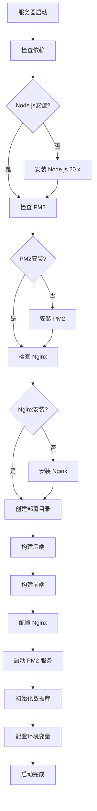

**图表来源**
- [install.sh:10-17](file://deploy/install.sh#L10-L17)
- [install.sh:19-25](file://deploy/install.sh#L19-L25)
- [install.sh:27-34](file://deploy/install.sh#L27-L34)

**章节来源**
- [install.sh:1-121](file://deploy/install.sh#L1-L121)
- [DEPLOY.md:108-119](file://DEPLOY.md#L108-L119)

## 架构概览

系统采用三层架构设计，包含前端、后端和 AI 服务三个主要层次，现已升级为MySQL + Redis数据库架构：

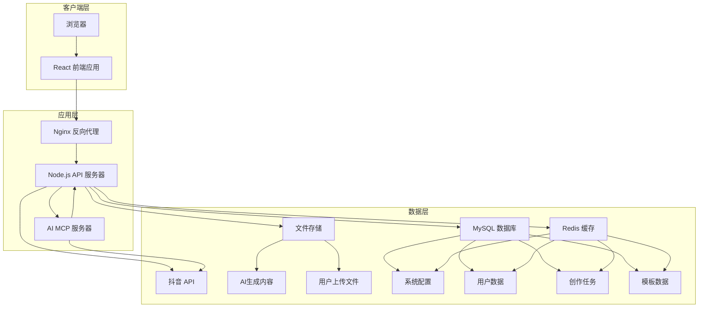

**图表来源**
- [nginx.conf:10-49](file://deploy/nginx.conf#L10-L49)
- [web/server/src/index.ts:20-36](file://web/server/src/index.ts#L20-L36)
- [mcp-server/src/index.ts:11-21](file://mcp-server/src/index.ts#L11-L21)
- [web/server/src/database/index.ts:95-134](file://web/server/src/database/index.ts#L95-L134)

## 详细组件分析

### Nginx 反向代理配置

Nginx 作为系统的统一入口，负责静态文件服务和 API 反向代理，现已增强支持AI生成内容和用户上传文件的本地访问：

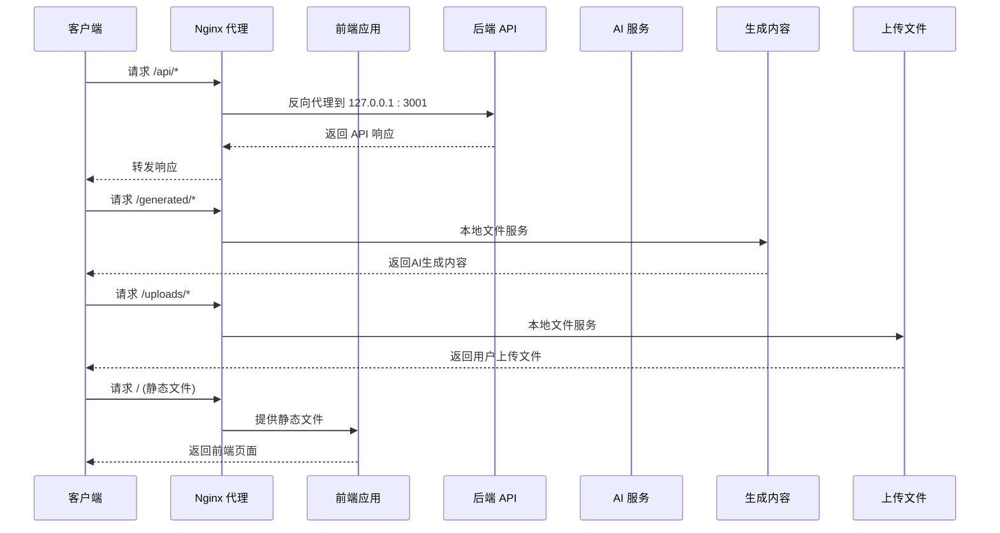

**更新** 新增了对 `/generated/` 和 `/uploads/` 路径的本地文件服务配置，支持AI生成内容和用户上传文件的直接访问，无需通过后端API。

**图表来源**
- [nginx.conf:31-49](file://deploy/nginx.conf#L31-L49)
- [nginx.conf:41-56](file://deploy/nginx.conf#L41-L56)
- [nginx.conf:25-28](file://deploy/nginx.conf#L25-L28)

### HTTPS SSL 配置

新增的SSL配置文件提供安全的HTTPS连接支持：

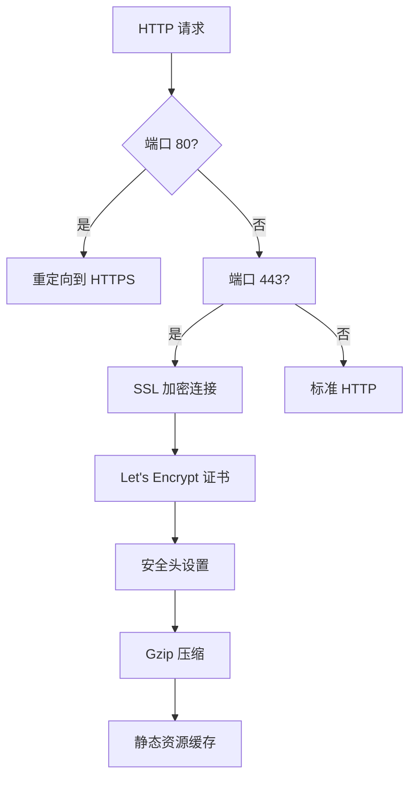

**图表来源**
- [nginx-ssl.conf:5-18](file://deploy/nginx-ssl.conf#L5-L18)
- [nginx-ssl.conf:21-77](file://deploy/nginx-ssl.conf#L21-L77)

### PM2 进程管理

**更新** PM2 配置已更新以匹配新的构建输出路径和服务器命名标准化：

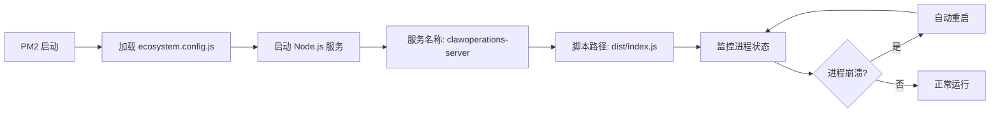

**图表来源**
- [ecosystem.config.js:1-24](file://deploy/ecosystem.config.js#L1-L24)

### 部署流程自动化

**重大更新** 部署脚本实现了完整的自动化部署流程，现已从7步优化为8步，新增依赖清理步骤：

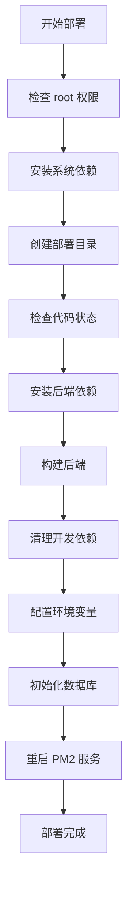

**更新** 新增的第9步数据库初始化配置，确保MySQL和Redis服务正确启动并完成数据库架构初始化。

**图表来源**
- [install.sh:10-17](file://deploy/install.sh#L10-L17)
- [install.sh:19-25](file://deploy/install.sh#L19-L25)
- [install.sh:100-107](file://deploy/install.sh#L100-L107)
- [deploy.sh:42-56](file://deploy/deploy.sh#L42-L56)

**章节来源**
- [install.sh:1-121](file://deploy/install.sh#L1-L121)
- [deploy.sh:1-83](file://deploy/deploy.sh#L1-L83)
- [nginx.conf:1-71](file://deploy/nginx.conf#L1-L71)
- [nginx-ssl.conf:1-78](file://deploy/nginx-ssl.conf#L1-L78)
- [ecosystem.config.js:1-24](file://deploy/ecosystem.config.js#L1-L24)

### AI MCP 服务器集成

MCP 服务器提供 AI 内容创作能力，通过标准化接口与主系统集成：

```mermaid
classDiagram
class ClawOperationsMCP {
+string name
+string version
+tools : Tool[]
+executeTool(name, args) Promise~string~
+main() void
}
class Tool {
+string name
+string description
+inputSchema Schema
}
class APIClient {
+string baseURL
+post(endpoint, data) Promise~Response~
+get(endpoint) Promise~Response~
}
ClawOperationsMCP --> Tool : "定义工具"
ClawOperationsMCP --> APIClient : "调用 API"
APIClient --> "主系统 API" : "HTTP 请求"
```

**图表来源**
- [mcp-server/src/index.ts:23-173](file://mcp-server/src/index.ts#L23-L173)
- [mcp-server/src/index.ts:175-315](file://mcp-server/src/index.ts#L175-L315)

**章节来源**
- [mcp-server/src/index.ts:1-358](file://mcp-server/src/index.ts#L1-L358)

### 后端静态文件服务配置

**新增功能** 后端服务器现在提供对AI生成内容和用户上传文件的直接静态文件服务：

```mermaid
flowchart TD
A[后端服务器启动] --> B[配置静态文件服务]
B --> C[/uploads 路径]
C --> D[本地文件系统映射]
B --> E[/generated 路径]
E --> F[AI生成内容目录]
B --> G[文件访问控制]
G --> H[安全权限检查]
```

**更新** 后端服务器现在同时提供 `/uploads` 和 `/generated` 路径的静态文件服务，支持用户上传文件和AI生成内容的直接访问，无需通过API接口。

**章节来源**
- [web/server/src/index.ts:1-76](file://web/server/src/index.ts#L1-L76)

## 数据库架构变更

### MySQL + Redis 双存储架构

系统已完成从文件存储到MySQL + Redis的全面架构升级，提供更好的数据持久化和缓存支持：

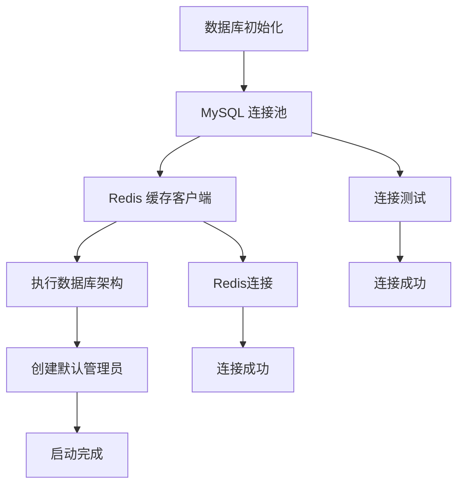

**更新** 新增了完整的MySQL + Redis双存储架构支持，包括连接池配置、缓存策略和数据库初始化流程。

**图表来源**
- [web/server/src/database/index.ts:95-134](file://web/server/src/database/index.ts#L95-L134)
- [web/server/src/database/index.ts:116-125](file://web/server/src/database/index.ts#L116-L125)

### 数据库表结构设计

系统采用关系型数据库设计，包含用户、配置、创作任务等核心表结构：

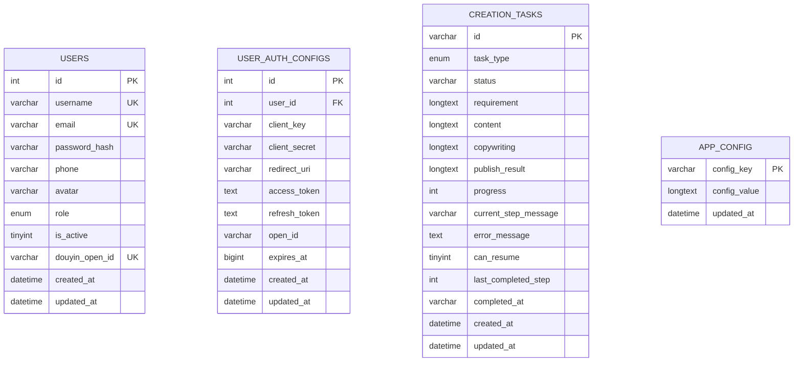

**更新** 新增了完整的数据库表结构设计，包括用户表、认证配置表、创作任务表和应用配置表。

**图表来源**
- [web/server/src/database/schema.sql:4-79](file://web/server/src/database/schema.sql#L4-L79)

### 系统配置服务架构

**新增功能** 系统配置服务现支持MySQL + Redis双存储架构，提供配置的持久化和缓存：

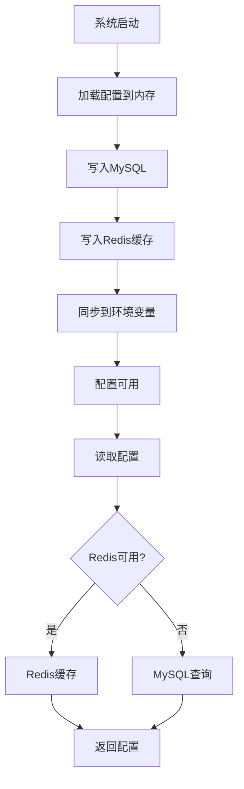

**更新** 新增了MySQL + Redis双存储的系统配置服务，提供配置的持久化和缓存支持。

**图表来源**
- [web/server/src/services/system-config-service.ts:142-157](file://web/server/src/services/system-config-service.ts#L142-L157)
- [web/server/src/services/system-config-service.ts:148-152](file://web/server/src/services/system-config-service.ts#L148-L152)

### 数据迁移支持

**新增功能** 提供从低版本数据格式到MySQL的完整迁移支持：

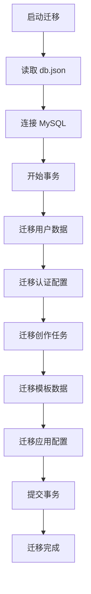

**更新** 新增了完整的数据迁移脚本，支持从低版本数据格式平滑迁移到MySQL架构。

**图表来源**
- [web/server/src/database/migrate-from-lowdb.ts:138-310](file://web/server/src/database/migrate-from-lowdb.ts#L138-L310)

**章节来源**
- [web/server/src/database/index.ts:1-164](file://web/server/src/database/index.ts#L1-L164)
- [web/server/src/database/schema.sql:1-79](file://web/server/src/database/schema.sql#L1-L79)
- [web/server/src/database/migrate-from-lowdb.ts:1-368](file://web/server/src/database/migrate-from-lowdb.ts#L1-L368)
- [web/server/src/services/system-config-service.ts:1-280](file://web/server/src/services/system-config-service.ts#L1-L280)

## 依赖关系分析

系统各组件之间的依赖关系如下：

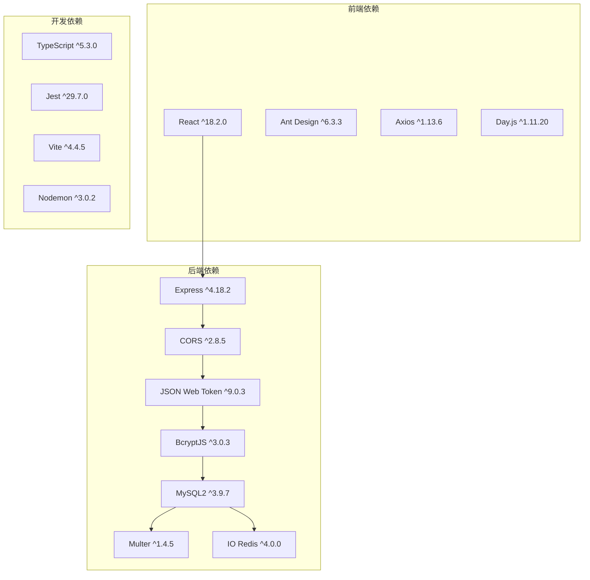

**更新** 新增了MySQL2和IO Redis依赖，替代原有的LowDB文件存储依赖。

**图表来源**
- [web/client/package.json:12-18](file://web/client/package.json#L12-L18)
- [web/server/package.json:12-20](file://web/server/package.json#L12-L20)
- [package.json:18-34](file://package.json#L18-L34)

**章节来源**
- [web/client/package.json:1-32](file://web/client/package.json#L1-L32)
- [web/server/package.json:1-34](file://web/server/package.json#L1-L34)
- [package.json:1-39](file://package.json#L1-L39)

## 性能考虑

### 配置优化

系统在多个层面进行了性能优化：

| 优化项 | 配置 | 作用 |
|--------|------|------|
| Gzip 压缩 | 开启 | 减少传输体积 |
| 静态资源缓存 | 7天 | 提升加载速度 |
| 上传文件限制 | 500MB | 支持大文件上传 |
| 超时设置 | 600秒 | 支持AI视频生成长时间处理 |
| 进程内存限制 | 500MB | 防止内存泄漏 |
| SSL 加密 | TLS 1.2/1.3 | 提升安全性 |
| **MySQL连接池** | 10个连接 | 提升数据库并发处理能力 |
| **Redis缓存** | 5分钟TTL | 减少数据库查询压力 |
| **本地文件服务** | /generated/ 和 /uploads/ | 减少API调用开销 |
| **缓存策略优化** | immutable 标志 | 提升缓存命中率 |

### 并发处理

系统支持多实例部署和负载均衡：

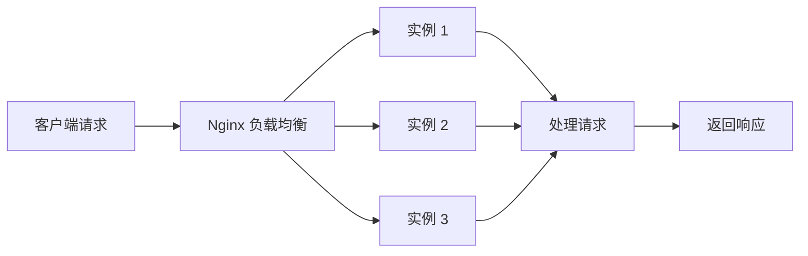

**更新** 新增的MySQL连接池和Redis缓存显著提升了系统的并发处理能力和响应速度。

**章节来源**
- [nginx.conf:18-24](file://deploy/nginx.conf#L18-L24)
- [nginx.conf:41-56](file://deploy/nginx.conf#L41-L56)
- [nginx.conf:58-62](file://deploy/nginx.conf#L58-L62)
- [ecosystem.config.js:8-11](file://deploy/ecosystem.config.js#L8-L11)
- [web/server/src/database/index.ts:97-109](file://web/server/src/database/index.ts#L97-L109)

## 故障排除指南

### 常见问题及解决方案

| 问题类型 | 症状 | 解决方案 |
|----------|------|----------|
| 服务未启动 | pm2 status 显示 stopped | 检查日志: pm2 logs clawoperations-server |
| Nginx 502 错误 | 反向代理失败 | 检查后端服务: curl http://127.0.0.1:3001/api/health |
| 抖音授权失败 | OAuth 回调错误 | 检查回调地址配置和权限范围 |
| 前端无法访问 | 404 错误 | 确认静态文件路径和 Nginx 配置 |
| SSL 证书问题 | HTTPS 连接失败 | 检查证书路径和 Let's Encrypt 配置 |
| **数据库连接失败** | MySQL连接错误 | 检查DB_HOST、DB_PORT、DB_USER、DB_PASS配置 |
| **Redis连接失败** | Redis连接错误 | 检查REDIS_URL配置和Redis服务状态 |
| **依赖清理失败** | 服务启动缓慢或内存占用过高 | 检查 `npm prune --omit=dev` 是否正确执行 |
| **服务器命名不一致** | PM2 服务无法识别 | 确保使用 `clawoperations-server` 作为服务名称 |
| **AI生成内容访问失败** | /generated/ 路径返回404 | 检查后端静态文件服务配置和文件权限 |
| **上传文件无法访问** | /uploads/ 路径返回404 | 检查上传目录存在性和Nginx本地文件服务配置 |
| **超时错误** | AI视频生成请求超时 | 检查Nginx超时配置是否正确设置为600秒 |
| **路径解析错误** | 静态文件无法访问 | 检查使用__dirname而非process.cwd()的路径配置 |
| **数据库架构初始化失败** | 表结构创建失败 | 检查MySQL权限和schema.sql执行情况 |

### 调试命令

```bash
# 查看服务状态
pm2 status

# 查看详细日志
pm2 logs clawoperations-server --lines 100

# 检查 Nginx 配置
nginx -t

# 重启服务
pm2 restart clawoperations-server

# 检查 SSL 证书
openssl x509 -test -in /etc/letsencrypt/live/qianxunfabu.cn/fullchain.pem -inform pem

# 验证构建输出路径
ls -la /var/www/clawoperations/web/server/dist/web/server/src/index.js

# 检查依赖清理结果
npm list --production

# 测试AI生成内容访问
curl -I http://47.116.213.223/generated/

# 测试上传文件访问
curl -I http://47.116.213.223/uploads/

# 检查Nginx超时配置
grep -n "proxy_read_timeout\|proxy_send_timeout" /etc/nginx/sites-available/clawoperations

# 验证静态资源缓存
curl -I -H "Cache-Control: no-cache" http://47.116.213.223/static/js/main.js

# 检查静态文件路径解析
node -e "console.log('__dirname:', __dirname); console.log('process.cwd():', process.cwd())"

# 检查MySQL连接
mysql -h localhost -P 3306 -u clawops -pClawOps@2024!

# 检查Redis连接
redis-cli -h localhost -p 6379 ping

# 查看数据库表结构
mysql -h localhost -P 3306 -u clawops -pClawOps@2024! -e "SHOW TABLES"

# 查看系统配置
curl http://47.116.213.223/api/system/config

# 数据库初始化
node -e "
const { initDatabase } = require('./web/server/dist/database/index.js');
initDatabase().then(() => console.log('Database initialized')).catch(console.error);
"
```

**更新** 新增了数据库连接和架构初始化相关的调试命令，帮助诊断MySQL和Redis连接问题。

**章节来源**
- [DEPLOY.md:121-138](file://DEPLOY.md#L121-L138)
- [deploy.sh:74-83](file://deploy/deploy.sh#L74-L83)
- [install.sh:115-121](file://deploy/install.sh#L115-L121)

## 结论

ClawOperations 的部署基础设施采用了现代化的技术栈和最佳实践，提供了完整的自动化部署、监控和运维能力。系统具备以下优势：

1. **高度自动化**：完整的部署脚本减少了人工干预，现已优化为8步流程
2. **高可用性**：PM2 进程管理和 Nginx 负载均衡确保服务稳定，服务器命名标准化为 `clawoperations-server`
3. **可扩展性**：模块化设计支持功能扩展和性能优化
4. **易维护性**：清晰的配置文件和日志系统便于故障排查
5. **安全性**：新增的HTTPS支持和安全配置提升系统安全性
6. **性能优化**：新增的依赖清理步骤显著提升部署效率和服务器性能
7. **AI内容支持**：新增的本地文件服务配置支持AI生成内容和用户上传文件的高效访问
8. **长时任务处理**：600秒超时配置确保AI视频生成等长时间任务的顺利完成
9. **缓存优化**：7天静态资源缓存策略提升前端加载性能
10. **路径解析稳定性**：使用__dirname替代process.cwd()确保静态文件服务的路径可靠性
11. **现代化数据库架构**：MySQL + Redis双存储架构提供更好的数据持久化和缓存支持
12. **完整的数据迁移支持**：从低版本数据格式到MySQL的平滑迁移能力
13. **系统配置持久化**：MySQL + Redis双存储的配置管理方案
14. **并发处理能力**：MySQL连接池和Redis缓存提升系统并发处理能力

**重大更新** 新增的部署基础设施系统进一步增强了系统的生产环境支持，提供了从开发到生产的完整部署流程，包括一键安装脚本、HTTPS加密连接和增强的安全配置，确保系统能够在各种环境下稳定运行。

**最新更新**：部署流程已从7步优化为8步，新增依赖清理步骤，服务器命名标准化为 `clawoperations-server`，改进的依赖管理流程确保更高效的部署体验。Node.js 服务器构建输出路径已正确更新为 `dist/web/server/src/index.js`，已在所有相关部署配置中同步调整，确保服务能够正确启动和运行。

**新增功能**：Nginx配置已增强，支持AI生成内容的本地文件服务和600秒超时设置，静态资源缓存策略已优化为7天缓存，这些改进显著提升了系统的性能和用户体验。

**重要更新**：修复了Web服务器静态文件服务的路径解析问题，通过使用__dirname替代process.cwd()确保文件路径的可靠性，改进了上传目录和AI生成内容目录的静态文件服务配置，避免了因工作目录变化导致的文件访问问题。

**数据库架构升级**：系统已完成从文件存储到MySQL + Redis的全面架构升级，提供更好的数据持久化、并发处理和缓存支持，新增了完整的数据迁移脚本和系统配置服务，确保数据的平滑过渡和系统的稳定运行。

该基础设施为抖音营销账号的自动化运营提供了坚实的技术基础，能够满足生产环境的各种需求，并为未来的扩展和维护奠定了良好的基础。