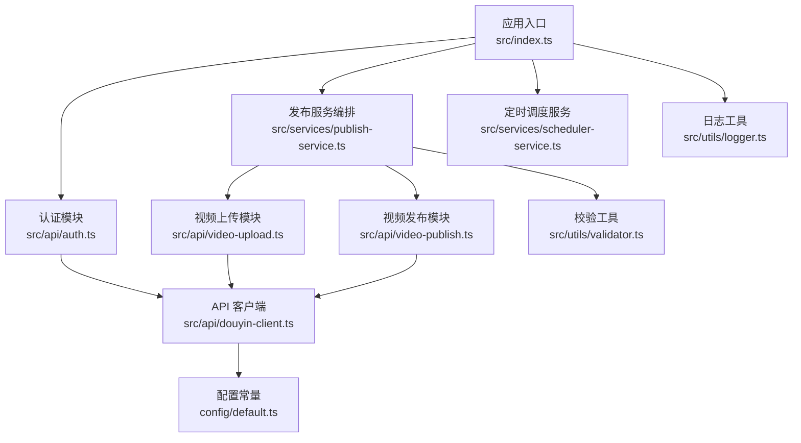
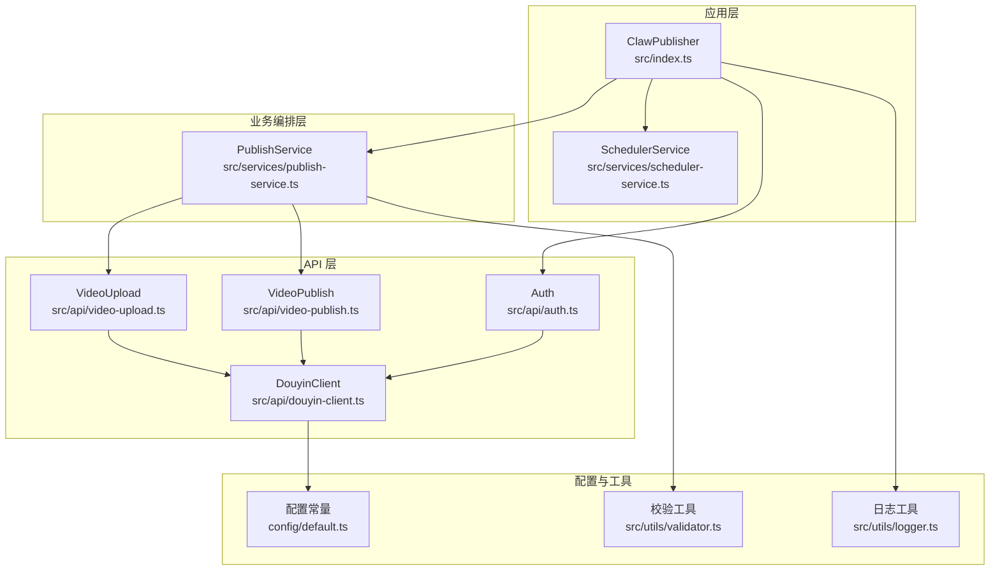
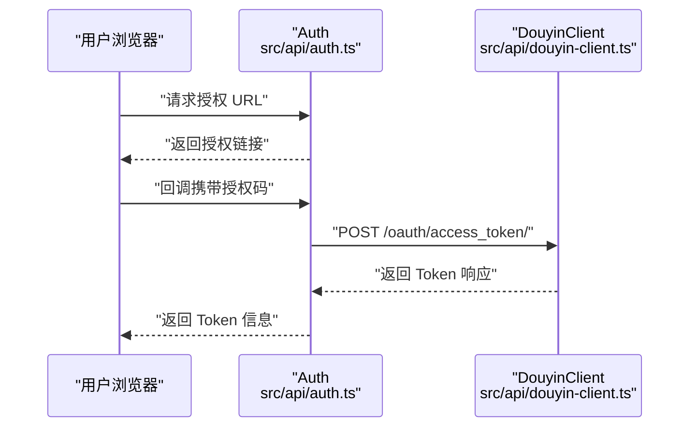
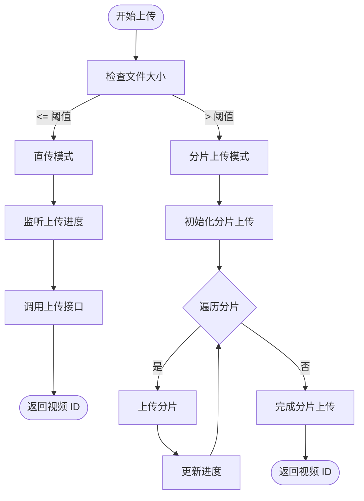
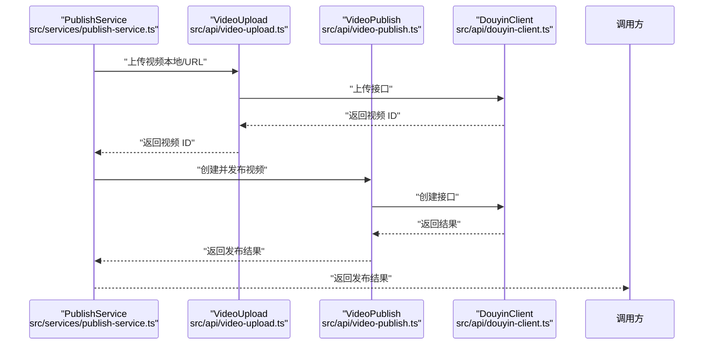
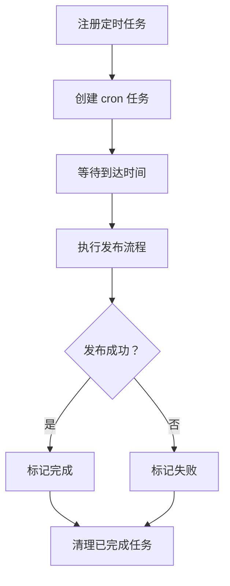
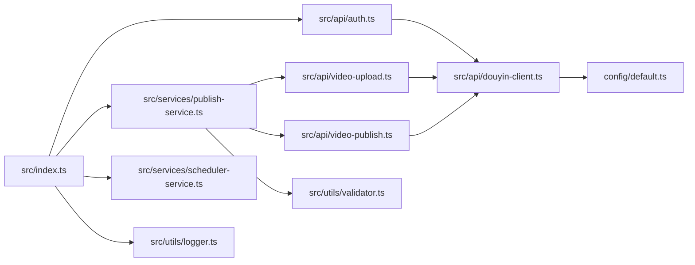

# 快速开始

<cite>
**本文引用的文件**
- [README.md](file://README.md)
- [package.json](file://package.json)
- [src/index.ts](file://src/index.ts)
- [example.ts](file://example.ts)
- [config/default.ts](file://config/default.ts)
- [src/models/types.ts](file://src/models/types.ts)
- [src/api/auth.ts](file://src/api/auth.ts)
- [src/api/douyin-client.ts](file://src/api/douyin-client.ts)
- [src/api/video-upload.ts](file://src/api/video-upload.ts)
- [src/api/video-publish.ts](file://src/api/video-publish.ts)
- [src/services/publish-service.ts](file://src/services/publish-service.ts)
- [src/services/scheduler-service.ts](file://src/services/scheduler-service.ts)
- [src/utils/validator.ts](file://src/utils/validator.ts)
- [src/utils/logger.ts](file://src/utils/logger.ts)
- [tests/unit/auth.test.ts](file://tests/unit/auth.test.ts)
- [tests/fixtures/mock-responses.ts](file://tests/fixtures/mock-responses.ts)
</cite>

## 目录
1. [简介](#简介)
2. [项目结构](#项目结构)
3. [核心组件](#核心组件)
4. [架构总览](#架构总览)
5. [详细组件分析](#详细组件分析)
6. [依赖关系分析](#依赖关系分析)
7. [性能与可靠性](#性能与可靠性)
8. [故障排除指南](#故障排除指南)
9. [结论](#结论)
10. [附录](#附录)

## 简介
本指南面向首次接触 ClawOperations 的用户，帮助你在约 30 分钟内完成环境准备、依赖安装、凭据配置与项目初始化，并成功运行第一个视频上传与发布任务。你将学会：
- 准备 Node.js 环境与 TikTok 开放平台账号
- 获取并配置 API 凭据
- 安装依赖、初始化项目
- 编写最小可行脚本完成上传与发布
- 常见问题排查与安全最佳实践

## 项目结构
ClawOperations 采用模块化设计，围绕“认证 → 客户端 → 上传/发布 → 调度”的链路组织代码。核心入口导出统一的对外类，便于在业务系统中集成。

图表来源
- [src/index.ts:1-248](file://src/index.ts#L1-L248)
- [src/api/auth.ts:1-190](file://src/api/auth.ts#L1-L190)
- [src/services/publish-service.ts:1-228](file://src/services/publish-service.ts#L1-L228)
- [src/services/scheduler-service.ts:1-202](file://src/services/scheduler-service.ts#L1-L202)
- [src/api/video-upload.ts:1-241](file://src/api/video-upload.ts#L1-L241)
- [src/api/video-publish.ts:1-174](file://src/api/video-publish.ts#L1-L174)
- [src/api/douyin-client.ts:1-237](file://src/api/douyin-client.ts#L1-L237)
- [config/default.ts:1-49](file://config/default.ts#L1-L49)
- [src/utils/validator.ts:1-116](file://src/utils/validator.ts#L1-L116)
- [src/utils/logger.ts:1-61](file://src/utils/logger.ts#L1-L61)

章节来源
- [README.md:31-105](file://README.md#L31-L105)
- [src/index.ts:1-248](file://src/index.ts#L1-L248)

## 核心组件
- 统一入口与对外 API：ClawPublisher 类封装了认证、上传、发布、定时发布等能力，提供简洁的对外接口。
- 认证模块：负责生成授权 URL、换取/刷新 Token、校验 Token 有效性。
- API 客户端：基于 axios 封装，统一处理 access_token 注入、错误拦截与重试策略。
- 上传模块：根据文件大小自动选择直传或分片上传，支持进度回调。
- 发布模块：构建发布参数，调用创建接口完成视频发布。
- 发布服务编排：串联上传与发布流程，支持下载远程视频后发布、查询状态、删除视频。
- 定时调度服务：基于 node-cron 实现定时发布，支持任务列表、取消与清理。
- 校验工具：对视频文件格式/大小、发布选项（标题、描述、hashtag、定时时间）进行严格校验。
- 日志工具：基于 winston 输出控制台与文件日志，支持 LOG_LEVEL 环境变量。

章节来源
- [src/index.ts:29-244](file://src/index.ts#L29-L244)
- [src/api/auth.ts:29-189](file://src/api/auth.ts#L29-L189)
- [src/api/douyin-client.ts:13-236](file://src/api/douyin-client.ts#L13-L236)
- [src/api/video-upload.ts:20-240](file://src/api/video-upload.ts#L20-L240)
- [src/api/video-publish.ts:15-173](file://src/api/video-publish.ts#L15-L173)
- [src/services/publish-service.ts:22-227](file://src/services/publish-service.ts#L22-L227)
- [src/services/scheduler-service.ts:23-201](file://src/services/scheduler-service.ts#L23-L201)
- [src/utils/validator.ts:17-115](file://src/utils/validator.ts#L17-L115)
- [src/utils/logger.ts:31-60](file://src/utils/logger.ts#L31-L60)

## 架构总览
下图展示了从应用调用到抖音开放平台 API 的整体流程，以及各模块间的依赖关系。

图表来源
- [src/index.ts:29-244](file://src/index.ts#L29-L244)
- [src/services/publish-service.ts:22-227](file://src/services/publish-service.ts#L22-L227)
- [src/services/scheduler-service.ts:23-201](file://src/services/scheduler-service.ts#L23-L201)
- [src/api/auth.ts:29-189](file://src/api/auth.ts#L29-L189)
- [src/api/douyin-client.ts:13-236](file://src/api/douyin-client.ts#L13-L236)
- [src/api/video-upload.ts:20-240](file://src/api/video-upload.ts#L20-L240)
- [src/api/video-publish.ts:15-173](file://src/api/video-publish.ts#L15-L173)
- [config/default.ts:1-49](file://config/default.ts#L1-L49)
- [src/utils/validator.ts:17-115](file://src/utils/validator.ts#L17-L115)
- [src/utils/logger.ts:31-60](file://src/utils/logger.ts#L31-L60)

## 详细组件分析

### 认证与授权流程
- 生成授权 URL：携带 client_key、response_type、scope、redirect_uri 等参数，支持自定义 state。
- 获取 Access Token：使用授权码换取 token，并设置到客户端。
- 刷新 Access Token：在必要时使用 refresh_token 刷新。
- Token 校验：内置缓冲时间（提前 5 分钟），确保稳定性。

图表来源
- [src/api/auth.ts:45-91](file://src/api/auth.ts#L45-L91)
- [src/api/douyin-client.ts:124-166](file://src/api/douyin-client.ts#L124-L166)

章节来源
- [src/api/auth.ts:29-189](file://src/api/auth.ts#L29-L189)
- [tests/unit/auth.test.ts:32-64](file://tests/unit/auth.test.ts#L32-L64)
- [tests/unit/auth.test.ts:66-98](file://tests/unit/auth.test.ts#L66-L98)
- [tests/unit/auth.test.ts:100-133](file://tests/unit/auth.test.ts#L100-L133)
- [tests/unit/auth.test.ts:135-175](file://tests/unit/auth.test.ts#L135-L175)
- [tests/unit/auth.test.ts:177-221](file://tests/unit/auth.test.ts#L177-L221)

### 视频上传与分片上传
- 自动选择上传方式：小于阈值使用直传；大于阈值使用分片上传。
- 直传：监听文件流更新进度，调用上传接口。
- 分片上传：初始化 → 逐片上传 → 完成合并，支持进度回调。
- URL 上传：直接通过 URL 上传，无需本地文件。

图表来源
- [src/api/video-upload.ts:35-54](file://src/api/video-upload.ts#L35-L54)
- [src/api/video-upload.ts:62-96](file://src/api/video-upload.ts#L62-L96)
- [src/api/video-upload.ts:104-152](file://src/api/video-upload.ts#L104-L152)
- [src/api/video-upload.ts:220-237](file://src/api/video-upload.ts#L220-L237)

章节来源
- [src/api/video-upload.ts:20-240](file://src/api/video-upload.ts#L20-L240)
- [config/default.ts:10-15](file://config/default.ts#L10-L15)

### 视频发布与参数构建
- 发布参数构建：标题、描述（含 hashtag）、@用户、POI、小程序挂载、商品链接、定时发布时间等。
- 发布接口调用：完成视频创建并返回分享链接与创建时间。
- 状态查询与删除：支持查询视频状态与删除视频。

图表来源
- [src/services/publish-service.ts:38-80](file://src/services/publish-service.ts#L38-L80)
- [src/api/video-upload.ts:35-54](file://src/api/video-upload.ts#L35-L54)
- [src/api/video-publish.ts:30-54](file://src/api/video-publish.ts#L30-L54)

章节来源
- [src/api/video-publish.ts:15-173](file://src/api/video-publish.ts#L15-L173)
- [src/utils/validator.ts:45-86](file://src/utils/validator.ts#L45-L86)

### 定时发布与任务管理
- 任务注册：计算 cron 表达式，创建 node-cron 任务。
- 任务执行：到期自动触发发布流程，更新任务状态。
- 任务管理：支持取消、列出、清理已完成任务、停止全部任务。

图表来源
- [src/services/scheduler-service.ts:37-72](file://src/services/scheduler-service.ts#L37-L72)
- [src/services/scheduler-service.ts:140-162](file://src/services/scheduler-service.ts#L140-L162)
- [src/services/scheduler-service.ts:181-198](file://src/services/scheduler-service.ts#L181-L198)

章节来源
- [src/services/scheduler-service.ts:23-201](file://src/services/scheduler-service.ts#L23-L201)

## 依赖关系分析
- 运行时依赖：axios（HTTP 客户端）、dotenv（环境变量加载）、node-cron（定时任务）、winston（日志）、form-data（multipart 表单）。
- 开发依赖：TypeScript、ts-node、jest、ts-jest 等。
- Node.js 版本要求：>= 18.0.0。

图表来源
- [src/index.ts:1-248](file://src/index.ts#L1-L248)
- [src/api/auth.ts:1-190](file://src/api/auth.ts#L1-L190)
- [src/services/publish-service.ts:1-228](file://src/services/publish-service.ts#L1-L228)
- [src/services/scheduler-service.ts:1-202](file://src/services/scheduler-service.ts#L1-L202)
- [src/api/video-upload.ts:1-241](file://src/api/video-upload.ts#L1-L241)
- [src/api/video-publish.ts:1-174](file://src/api/video-publish.ts#L1-L174)
- [src/api/douyin-client.ts:1-237](file://src/api/douyin-client.ts#L1-L237)
- [config/default.ts:1-49](file://config/default.ts#L1-L49)
- [src/utils/validator.ts:1-116](file://src/utils/validator.ts#L1-L116)
- [src/utils/logger.ts:1-61](file://src/utils/logger.ts#L1-L61)

章节来源
- [package.json:14-32](file://package.json#L14-L32)

## 性能与可靠性
- 重试机制：基于 withRetry 的指数退避与上限控制，针对抖音限流与网络异常进行重试。
- 上传优化：大文件自动分片上传，支持断点续传式进度反馈。
- 定时任务：基于 cron 的高可靠调度，支持任务清理与停止。
- 日志与监控：统一日志输出，便于定位问题与审计。

章节来源
- [src/api/douyin-client.ts:124-198](file://src/api/douyin-client.ts#L124-L198)
- [src/api/video-upload.ts:104-152](file://src/api/video-upload.ts#L104-L152)
- [src/services/scheduler-service.ts:181-198](file://src/services/scheduler-service.ts#L181-L198)
- [src/utils/logger.ts:31-60](file://src/utils/logger.ts#L31-L60)

## 故障排除指南
- 环境与依赖
  - 确认 Node.js 版本满足 >= 18.0.0。
  - 安装依赖：使用 npm install 或 pip 安装 Python 依赖（如需）。
- 凭据与授权
  - 在抖音开放平台获取 client_key、client_secret、redirect_uri。
  - 首次授权：通过 getAuthUrl 获取授权链接，用户同意后回调携带授权码，使用 handleAuthCallback 获取 token。
  - Token 刷新：若 isTokenValid 返回 false，调用 refreshToken 自动刷新。
- 上传与发布
  - 本地文件过大或格式不支持：检查文件大小与扩展名，遵循配置中的阈值与支持格式。
  - 分片上传失败：检查网络稳定性与分片大小配置。
  - 发布参数错误：检查标题、描述、hashtag 数量与定时发布时间范围。
- 定时发布
  - 任务未执行：确认系统时区与 cron 表达式生成逻辑。
  - 任务取消失败：仅 pending 状态可取消。
- 日志与调试
  - 设置 LOG_LEVEL 控制日志级别，查看控制台与 app.log 文件。
- 常见错误与修复
  - 429/10001/10002：请求过于频繁，降低频率或增加重试间隔。
  - 401 未授权：检查 access_token 是否正确注入与有效。
  - 网络错误/ECONNRESET：检查网络连通性与超时设置。

章节来源
- [README.md:33-63](file://README.md#L33-L63)
- [src/api/auth.ts:67-91](file://src/api/auth.ts#L67-L91)
- [src/api/auth.ts:98-127](file://src/api/auth.ts#L98-L127)
- [src/api/auth.ts:133-151](file://src/api/auth.ts#L133-L151)
- [src/api/douyin-client.ts:97-116](file://src/api/douyin-client.ts#L97-L116)
- [src/api/douyin-client.ts:204-220](file://src/api/douyin-client.ts#L204-L220)
- [src/utils/validator.ts:22-39](file://src/utils/validator.ts#L22-L39)
- [src/utils/validator.ts:45-86](file://src/utils/validator.ts#L45-L86)
- [src/services/scheduler-service.ts:79-97](file://src/services/scheduler-service.ts#L79-L97)
- [src/utils/logger.ts:10-12](file://src/utils/logger.ts#L10-L12)

## 结论
通过本快速开始指南，你已经完成了环境准备、依赖安装、凭据配置与项目初始化，并掌握了上传与发布的最小工作流。建议在生产环境中：
- 使用预置 Token 并妥善保管，定期轮换。
- 配置合理的日志级别与监控告警。
- 对定时发布任务进行健康检查与回滚预案。

## 附录

### 安装与初始化步骤
- 克隆仓库并进入目录
- 安装依赖：npm install
- 复制并编辑环境变量文件：cp .env.example .env
- 在抖音开放平台获取 client_key、client_secret、redirect_uri，并填入 .env
- 运行示例脚本：npm run dev 或构建后运行

章节来源
- [README.md:40-53](file://README.md#L40-L53)

### 获取抖音 API 凭据
- 登录抖音开放平台开发者后台，创建应用并获取 client_key、client_secret、redirect_uri。
- 在应用中开启所需权限（视频上传、视频发布、数据分析等）。

章节来源
- [README.md:57-62](file://README.md#L57-L62)

### 配置 .env 文件
- 填写以下关键字段：
  - CLIENT_KEY
  - CLIENT_SECRET
  - REDIRECT_URI
  - ACCESS_TOKEN（可选，预置 Token）
  - REFRESH_TOKEN（可选，配合 ACCESS_TOKEN）
  - OPEN_ID（可选，配合 ACCESS_TOKEN）

章节来源
- [README.md:58-62](file://README.md#L58-L62)

### 基础使用示例
- 初始化：new ClawPublisher({ clientKey, clientSecret, redirectUri, accessToken?, refreshToken?, openId? })
- 上传本地视频：await publisher.uploadVideo('/path/to/video.mp4', onProgress)
- 发布视频：await publisher.publishVideo({ videoPath, options })
- 定时发布：publisher.scheduleVideo({ videoPath, options }, new Date('...'))
- 从 URL 发布：await publisher.downloadAndPublish('https://example.com/video.mp4', options)

章节来源
- [example.ts:11-26](file://example.ts#L11-L26)
- [example.ts:41-51](file://example.ts#L41-L51)
- [example.ts:55-75](file://example.ts#L55-L75)
- [example.ts:100-127](file://example.ts#L100-L127)
- [example.ts:131-143](file://example.ts#L131-L143)

### 最佳实践与安全注意事项
- 不要将 .env 提交至版本库，使用 .gitignore 管控。
- 使用环境变量管理敏感信息，避免硬编码。
- 定期轮换 access_token 与 refresh_token。
- 遵循抖音 API 使用规范与速率限制，合理安排发布节奏。
- 在生产环境启用更严格的日志级别与错误处理。

章节来源
- [README.md:125-131](file://README.md#L125-L131)