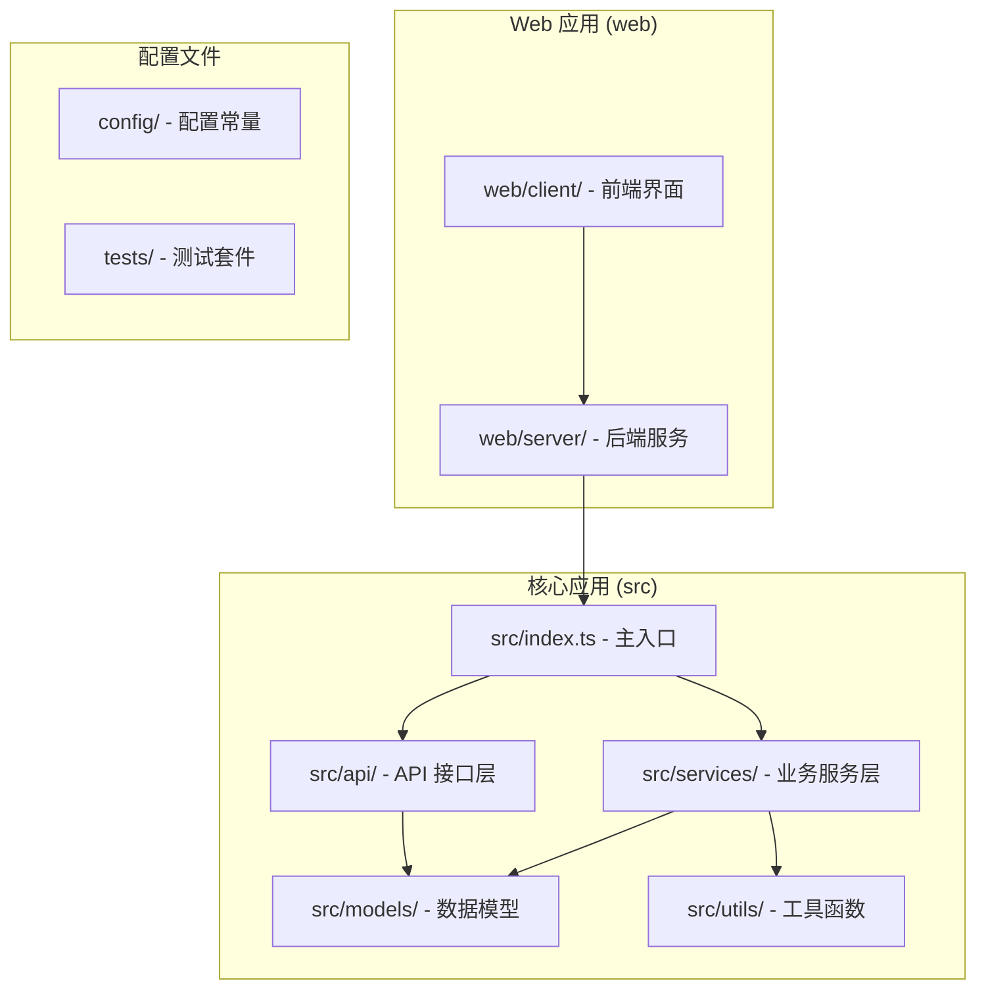
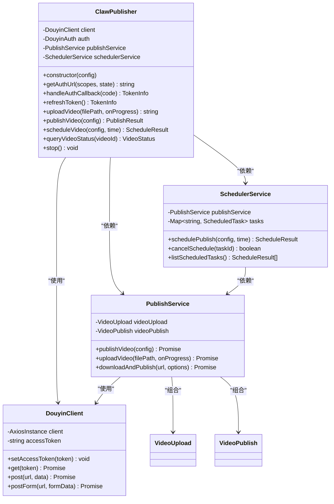
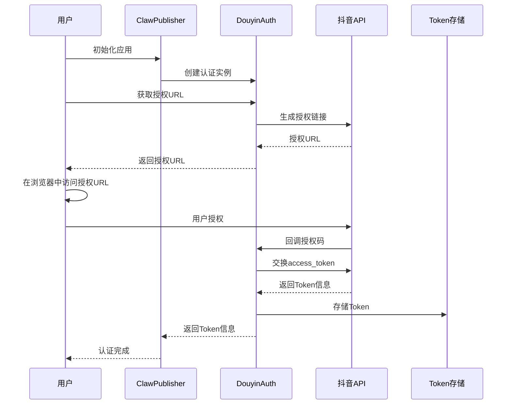
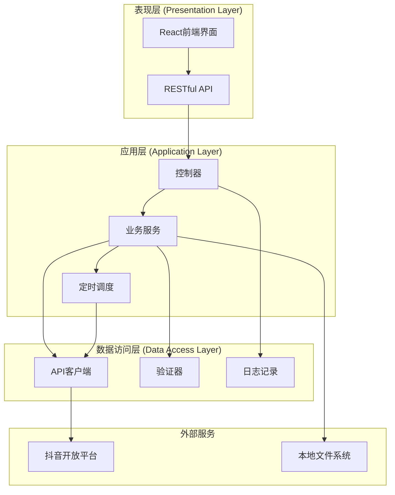
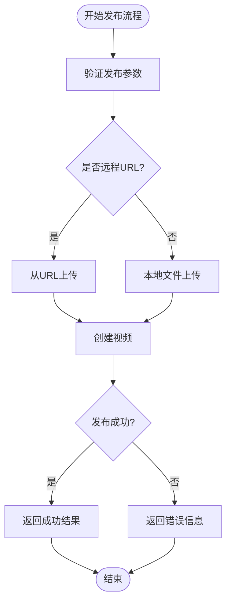
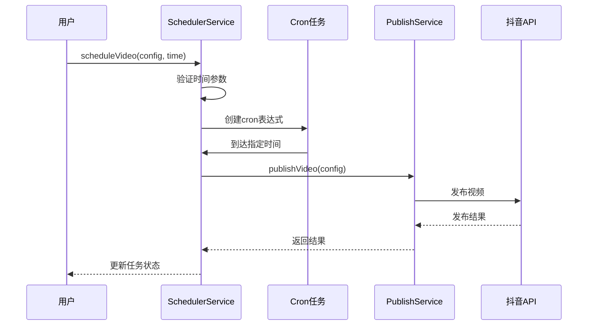
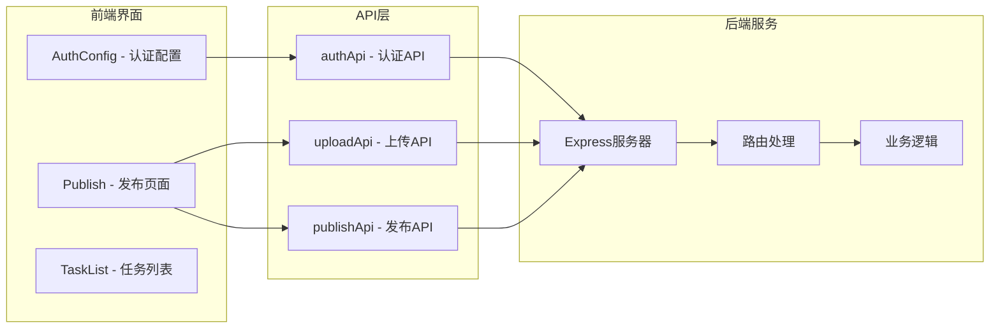

# 使用示例

<cite>
**本文档引用的文件**
- [README.md](file://README.md)
- [package.json](file://package.json)
- [example.ts](file://example.ts)
- [src/index.ts](file://src/index.ts)
- [src/models/types.ts](file://src/models/types.ts)
- [src/api/douyin-client.ts](file://src/api/douyin-client.ts)
- [src/api/auth.ts](file://src/api/auth.ts)
- [src/services/publish-service.ts](file://src/services/publish-service.ts)
- [src/services/scheduler-service.ts](file://src/services/scheduler-service.ts)
- [src/utils/logger.ts](file://src/utils/logger.ts)
- [config/default.ts](file://config/default.ts)
- [web/client/src/App.tsx](file://web/client/src/App.tsx)
- [web/client/src/pages/Publish.tsx](file://web/client/src/pages/Publish.tsx)
- [web/client/src/api/client.ts](file://web/client/src/api/client.ts)
- [web/server/src/index.ts](file://web/server/src/index.ts)
- [web/server/src/routes/publish.ts](file://web/server/src/routes/publish.ts)
</cite>

## 目录
1. [简介](#简介)
2. [项目结构](#项目结构)
3. [核心组件](#核心组件)
4. [架构概览](#架构概览)
5. [详细组件分析](#详细组件分析)
6. [依赖关系分析](#依赖关系分析)
7. [性能考虑](#性能考虑)
8. [故障排除指南](#故障排除指南)
9. [结论](#结论)

## 简介

ClawOperations 是一个专为抖音（TikTok）营销账户设计的自动化运营系统。该项目提供了完整的工具链来管理小龙虾主题的抖音营销活动，包括内容创作、定时发布、数据分析和观众互动等功能。

本系统的核心特性包括：
- **官方 API 集成**：安全连接到抖音开放平台 API
- **内容发布**：自动化的视频上传和定时发布功能
- **账户管理**：内容日历、话题标签优化和趋势监控
- **小龙虾特定功能**：季节性活动管理、食谱内容模板等

## 项目结构

项目采用模块化架构设计，主要包含以下核心目录：



**图表来源**
- [src/index.ts:1-248](file://src/index.ts#L1-L248)
- [web/server/src/index.ts:1-42](file://web/server/src/index.ts#L1-L42)

**章节来源**
- [README.md:92-105](file://README.md#L92-L105)
- [package.json:1-38](file://package.json#L1-L38)

## 核心组件

### ClawPublisher 主控制器

ClawPublisher 是整个系统的主入口点，提供统一的对外接口：



**图表来源**
- [src/index.ts:29-244](file://src/index.ts#L29-L244)
- [src/api/douyin-client.ts:13-237](file://src/api/douyin-client.ts#L13-L237)
- [src/services/publish-service.ts:22-228](file://src/services/publish-service.ts#L22-L228)
- [src/services/scheduler-service.ts:23-202](file://src/services/scheduler-service.ts#L23-L202)

### 认证系统

系统提供完整的 OAuth 2.0 认证流程：



**图表来源**
- [src/api/auth.ts:45-91](file://src/api/auth.ts#L45-L91)
- [src/api/auth.ts:107-127](file://src/api/auth.ts#L107-L127)

**章节来源**
- [src/index.ts:69-112](file://src/index.ts#L69-L112)
- [src/api/auth.ts:29-190](file://src/api/auth.ts#L29-L190)

## 架构概览

系统采用分层架构设计，确保关注点分离和代码可维护性：



**图表来源**
- [web/client/src/App.tsx:12-35](file://web/client/src/App.tsx#L12-L35)
- [web/server/src/index.ts:8-42](file://web/server/src/index.ts#L8-L42)
- [src/services/publish-service.ts:38-80](file://src/services/publish-service.ts#L38-L80)

## 详细组件分析

### 发布服务流程

发布服务负责协调视频上传和发布的完整流程：



**图表来源**
- [src/services/publish-service.ts:38-80](file://src/services/publish-service.ts#L38-L80)
- [src/services/publish-service.ts:133-172](file://src/services/publish-service.ts#L133-L172)

### 定时发布机制

系统提供基于 cron 的定时发布功能：



**图表来源**
- [src/services/scheduler-service.ts:37-72](file://src/services/scheduler-service.ts#L37-L72)
- [src/services/scheduler-service.ts:140-162](file://src/services/scheduler-service.ts#L140-L162)

**章节来源**
- [src/services/publish-service.ts:1-228](file://src/services/publish-service.ts#L1-L228)
- [src/services/scheduler-service.ts:1-202](file://src/services/scheduler-service.ts#L1-L202)

### Web 界面集成

前端界面提供直观的用户交互体验：



**图表来源**
- [web/client/src/App.tsx:12-35](file://web/client/src/App.tsx#L12-L35)
- [web/client/src/pages/Publish.tsx:29-368](file://web/client/src/pages/Publish.tsx#L29-L368)
- [web/client/src/api/client.ts:14-89](file://web/client/src/api/client.ts#L14-L89)

**章节来源**
- [web/client/src/App.tsx:1-38](file://web/client/src/App.tsx#L1-L38)
- [web/client/src/pages/Publish.tsx:1-368](file://web/client/src/pages/Publish.tsx#L1-L368)
- [web/client/src/api/client.ts:1-92](file://web/client/src/api/client.ts#L1-L92)

## 依赖关系分析

系统依赖关系清晰，遵循单一职责原则：

```mermaid
graph TB
subgraph "核心依赖"
A[axios - HTTP客户端]
B[node-cron - 定时任务]
C[winston - 日志]
D[form-data - 表单数据]
end
subgraph "开发依赖"
E[jest - 测试框架]
F[typescript - 类型系统]
G[@types/* - 类型定义]
end
subgraph "运行时依赖"
H[dotenv - 环境变量]
I[react - 前端框架]
J[express - Web服务器]
end
A --> K[API通信]
B --> L[定时功能]
C --> M[日志记录]
D --> N[文件上传]
E --> O[单元测试]
F --> P[类型检查]
G --> Q[开发体验]
H --> R[配置管理]
I --> S[前端界面]
J --> T[后端服务]
```

**图表来源**
- [package.json:18-33](file://package.json#L18-L33)
- [web/client/package.json:12-30](file://web/client/package.json#L12-L30)

**章节来源**
- [package.json:18-33](file://package.json#L18-L33)
- [web/client/package.json:12-30](file://web/client/package.json#L12-L30)

## 性能考虑

系统在设计时充分考虑了性能和可靠性：

### 重试机制
- **指数退避策略**：最大重试3次，基础延迟1秒，最大延迟30秒
- **智能重试条件**：针对限流错误码和网络超时进行重试
- **自定义重试逻辑**：可根据具体错误类型调整重试行为

### 上传优化
- **分片上传**：超过128MB的文件自动启用分片上传
- **默认分片大小**：5MB，平衡上传速度和稳定性
- **进度回调**：实时显示上传进度

### 内存管理
- **临时文件清理**：下载的视频文件在使用后自动清理
- **任务内存管理**：已完成的定时任务会自动清理

## 故障排除指南

### 常见问题及解决方案

#### 认证相关问题
1. **Token 过期**
   - 使用 `refreshToken()` 方法自动刷新
   - 检查 `isTokenValid()` 确认 Token 状态
   - 配置适当的缓冲时间避免临界情况

2. **授权失败**
   - 验证 `client_key` 和 `client_secret` 配置
   - 检查 `redirect_uri` 设置是否正确
   - 确认授权作用域权限

#### 上传相关问题
1. **上传失败**
   - 检查文件格式和大小限制
   - 验证网络连接稳定性
   - 查看重试日志了解具体原因

2. **分片上传异常**
   - 确认文件大小超过阈值
   - 检查磁盘空间充足
   - 验证网络带宽足够

#### 发布相关问题
1. **发布失败**
   - 检查视频内容合规性
   - 验证发布选项配置
   - 确认抖音 API 状态正常

2. **定时任务异常**
   - 验证发布时间格式
   - 检查系统时区设置
   - 确认任务标识符正确

**章节来源**
- [src/api/douyin-client.ts:204-220](file://src/api/douyin-client.ts#L204-L220)
- [src/services/publish-service.ts:157-172](file://src/services/publish-service.ts#L157-L172)
- [src/utils/logger.ts:31-55](file://src/utils/logger.ts#L31-L55)

## 结论

ClawOperations 提供了一个完整、可靠的抖音营销自动化解决方案。通过模块化的设计和清晰的架构分离，系统能够满足小龙虾主题营销的各种需求。

### 主要优势
- **完整的功能覆盖**：从认证到发布的全链路支持
- **灵活的部署方式**：支持独立使用和 Web 界面集成
- **强大的扩展性**：基于 TypeScript 的类型安全设计
- **完善的错误处理**：全面的重试机制和日志记录

### 适用场景
- 餐厅和食品品牌的抖音营销
- 电商产品的短视频推广
- 品牌内容的自动化发布
- 多账号的集中管理

系统为抖音营销提供了专业级的技术支撑，帮助用户高效地运营小龙虾主题的抖音账号。