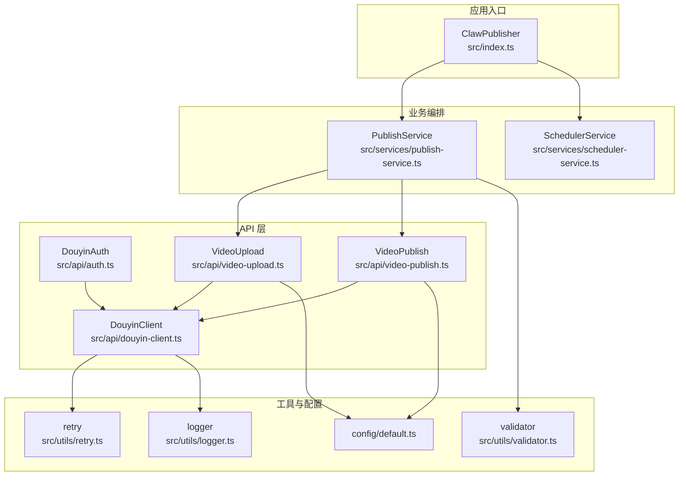
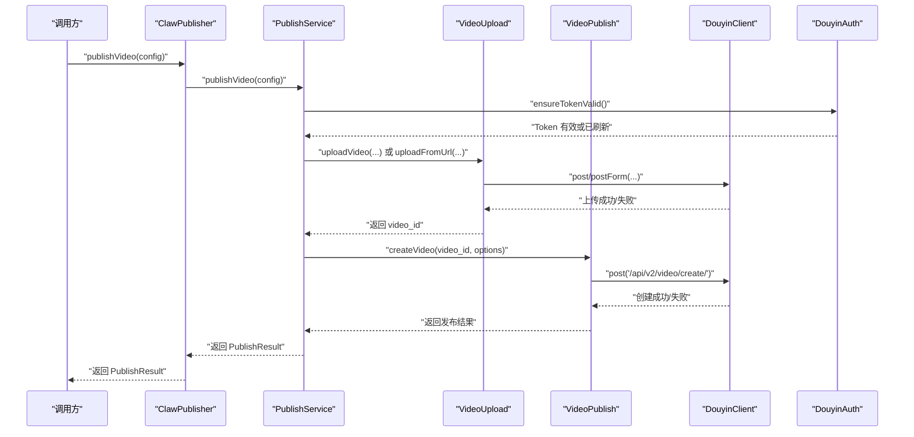
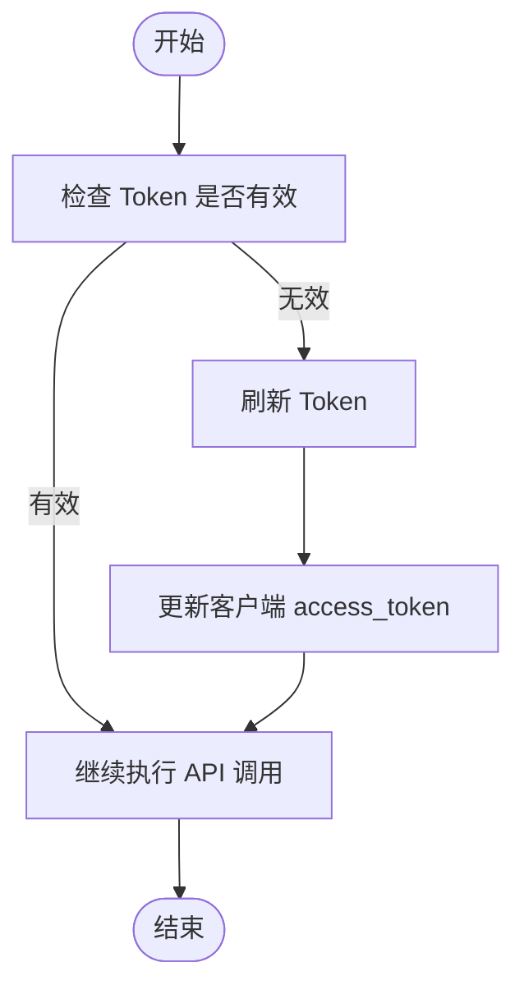
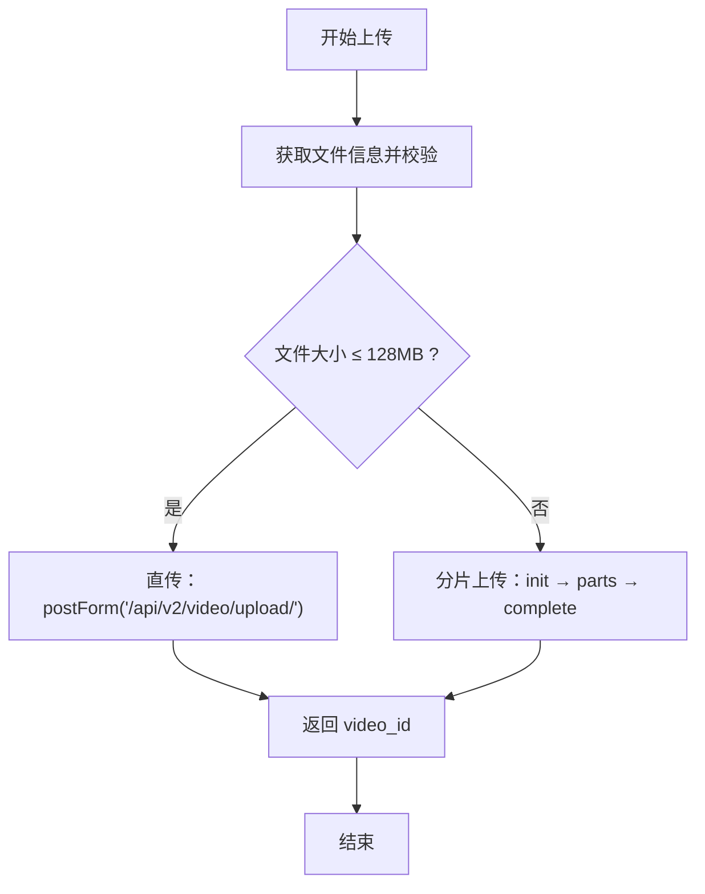
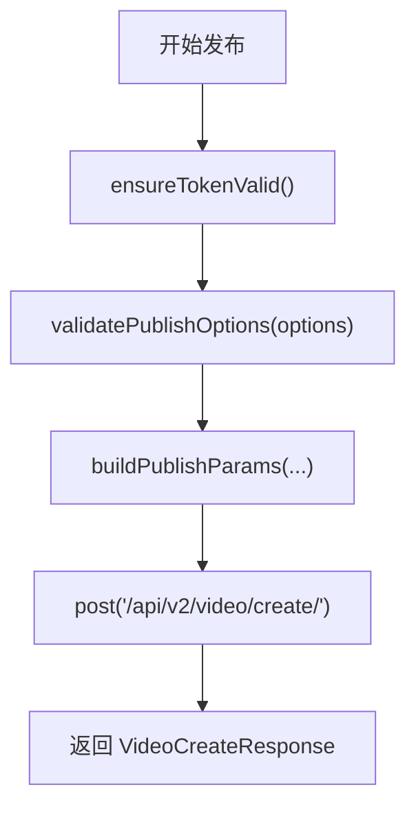
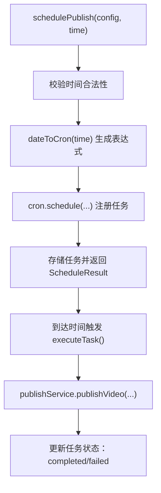
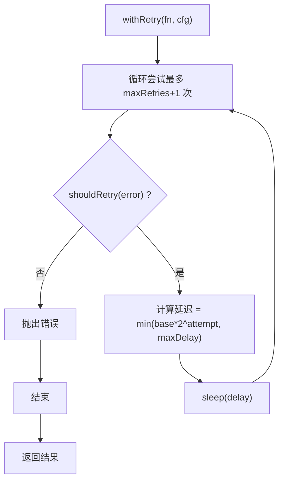
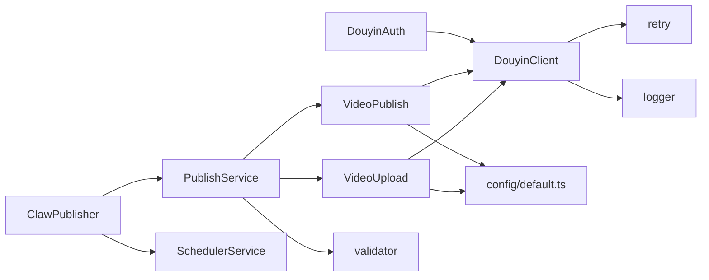

# 故障排除

<cite>
**本文引用的文件**
- [README.md](file://README.md)
- [package.json](file://package.json)
- [src/index.ts](file://src/index.ts)
- [src/api/auth.ts](file://src/api/auth.ts)
- [src/api/douyin-client.ts](file://src/api/douyin-client.ts)
- [src/api/video-upload.ts](file://src/api/video-upload.ts)
- [src/api/video-publish.ts](file://src/api/video-publish.ts)
- [src/services/publish-service.ts](file://src/services/publish-service.ts)
- [src/services/scheduler-service.ts](file://src/services/scheduler-service.ts)
- [src/utils/logger.ts](file://src/utils/logger.ts)
- [src/utils/retry.ts](file://src/utils/retry.ts)
- [src/utils/validator.ts](file://src/utils/validator.ts)
- [config/default.ts](file://config/default.ts)
- [example.ts](file://example.ts)
</cite>

## 目录
1. [简介](#简介)
2. [项目结构](#项目结构)
3. [核心组件](#核心组件)
4. [架构总览](#架构总览)
5. [详细组件分析](#详细组件分析)
6. [依赖关系分析](#依赖关系分析)
7. [性能与稳定性考虑](#性能与稳定性考虑)
8. [故障排除指南](#故障排除指南)
9. [结论](#结论)
10. [附录](#附录)

## 简介
本指南面向使用 ClawOperations 的运维与开发人员，聚焦于常见问题的定位与修复，覆盖认证失败、上传中断、发布错误、网络连接异常、API 限流与配额、日志分析与调试、诊断信息收集、性能排查、系统监控与告警、紧急恢复与备用方案、社区支持与问题反馈渠道，以及预防性维护与健康检查最佳实践。

## 项目结构
ClawOperations 采用模块化分层设计：
- 入口与对外 API：ClawPublisher 统一对外暴露认证、上传、发布、定时发布、视频查询与删除等能力
- 业务编排：PublishService 负责上传与发布的流程编排
- 定时调度：SchedulerService 基于 node-cron 实现定时发布
- API 客户端：DouyinClient 封装 axios，内置请求/响应拦截、错误解析与指数退避重试
- 认证模块：DouyinAuth 管理 OAuth 授权、Token 获取与刷新、有效性校验
- 工具与配置：validator 校验输入，retry 提供重试机制，logger 提供日志输出，config/default.ts 提供全局常量

图表来源
- [src/index.ts:29-244](file://src/index.ts#L29-L244)
- [src/services/publish-service.ts:22-224](file://src/services/publish-service.ts#L22-L224)
- [src/services/scheduler-service.ts:23-201](file://src/services/scheduler-service.ts#L23-L201)
- [src/api/douyin-client.ts:13-236](file://src/api/douyin-client.ts#L13-L236)
- [src/api/auth.ts:29-189](file://src/api/auth.ts#L29-L189)
- [src/api/video-upload.ts:20-240](file://src/api/video-upload.ts#L20-L240)
- [src/api/video-publish.ts:15-173](file://src/api/video-publish.ts#L15-L173)
- [src/utils/validator.ts:1-116](file://src/utils/validator.ts#L1-L116)
- [src/utils/retry.ts:1-84](file://src/utils/retry.ts#L1-L84)
- [src/utils/logger.ts:1-61](file://src/utils/logger.ts#L1-L61)
- [config/default.ts:1-49](file://config/default.ts#L1-L49)

章节来源
- [README.md:92-105](file://README.md#L92-L105)
- [package.json:14-34](file://package.json#L14-L34)

## 核心组件
- ClawPublisher：统一入口，封装认证、上传、发布、定时发布、视频管理等对外方法
- PublishService：编排上传与发布流程，处理本地/URL/下载后发布场景，记录进度与结果
- SchedulerService：基于 cron 的定时发布任务管理，支持取消、查询、清理
- DouyinClient：封装 axios，自动注入 access_token，统一错误处理与指数退避重试
- DouyinAuth：OAuth 流程、Token 有效期校验与刷新
- 工具链：validator（输入校验）、retry（重试）、logger（日志）

章节来源
- [src/index.ts:29-244](file://src/index.ts#L29-L244)
- [src/services/publish-service.ts:22-224](file://src/services/publish-service.ts#L22-L224)
- [src/services/scheduler-service.ts:23-201](file://src/services/scheduler-service.ts#L23-L201)
- [src/api/douyin-client.ts:13-236](file://src/api/douyin-client.ts#L13-L236)
- [src/api/auth.ts:29-189](file://src/api/auth.ts#L29-L189)
- [src/utils/validator.ts:1-116](file://src/utils/validator.ts#L1-L116)
- [src/utils/retry.ts:1-84](file://src/utils/retry.ts#L1-L84)
- [src/utils/logger.ts:1-61](file://src/utils/logger.ts#L1-L61)

## 架构总览
下图展示一次“一站式发布”（上传+发布）的关键调用序列，涵盖认证、上传、发布与结果返回。

图表来源
- [src/index.ts:153-155](file://src/index.ts#L153-L155)
- [src/services/publish-service.ts:38-80](file://src/services/publish-service.ts#L38-L80)
- [src/api/video-upload.ts:35-54](file://src/api/video-upload.ts#L35-L54)
- [src/api/video-publish.ts:30-54](file://src/api/video-publish.ts#L30-L54)
- [src/api/douyin-client.ts:149-166](file://src/api/douyin-client.ts#L149-L166)
- [src/api/auth.ts:146-151](file://src/api/auth.ts#L146-L151)

## 详细组件分析

### 认证与 Token 管理
- OAuth 授权 URL 生成、授权码换 Token、刷新 Token、Token 有效期校验与自动刷新
- 关键点：确保在每次 API 调用前调用 ensureTokenValid；过期缓冲时间为 5 分钟

图表来源
- [src/api/auth.ts:133-151](file://src/api/auth.ts#L133-L151)
- [src/api/auth.ts:98-127](file://src/api/auth.ts#L98-L127)
- [src/api/douyin-client.ts:33-43](file://src/api/douyin-client.ts#L33-L43)

章节来源
- [src/api/auth.ts:29-189](file://src/api/auth.ts#L29-L189)
- [src/api/douyin-client.ts:13-236](file://src/api/douyin-client.ts#L13-L236)

### 上传与分片上传
- 自动判断直传（≤128MB）与分片上传（>128MB），支持进度回调
- 分片上传流程：初始化 → 逐片上传 → 完成合并
- URL 直接上传：适用于无需本地落地的场景

图表来源
- [src/api/video-upload.ts:35-54](file://src/api/video-upload.ts#L35-L54)
- [src/api/video-upload.ts:104-152](file://src/api/video-upload.ts#L104-L152)
- [src/api/video-upload.ts:220-237](file://src/api/video-upload.ts#L220-L237)
- [config/default.ts:10-16](file://config/default.ts#L10-L16)

章节来源
- [src/api/video-upload.ts:1-241](file://src/api/video-upload.ts#L1-L241)
- [config/default.ts:10-16](file://config/default.ts#L10-L16)

### 发布与内容参数
- 构建发布参数：标题、描述（含 hashtag）、@用户、POI、小程序挂载、商品链接、定时发布
- 发布前对内容长度、数量与定时时间范围进行校验

图表来源
- [src/api/video-publish.ts:30-54](file://src/api/video-publish.ts#L30-L54)
- [src/api/video-publish.ts:62-125](file://src/api/video-publish.ts#L62-L125)
- [src/utils/validator.ts:45-86](file://src/utils/validator.ts#L45-L86)

章节来源
- [src/api/video-publish.ts:1-174](file://src/api/video-publish.ts#L1-L174)
- [src/utils/validator.ts:1-116](file://src/utils/validator.ts#L1-L116)

### 定时发布
- 将目标时间转换为 cron 表达式，注册 node-cron 任务
- 支持取消、查询、清理已完成任务、停止全部任务

图表来源
- [src/services/scheduler-service.ts:37-72](file://src/services/scheduler-service.ts#L37-L72)
- [src/services/scheduler-service.ts:140-162](file://src/services/scheduler-service.ts#L140-L162)
- [src/services/scheduler-service.ts:169-176](file://src/services/scheduler-service.ts#L169-L176)

章节来源
- [src/services/scheduler-service.ts:1-202](file://src/services/scheduler-service.ts#L1-L202)

### 日志与重试
- 日志：winston 控制台与文件输出，支持 LOG_LEVEL 环境变量
- 重试：指数退避，最大重试次数、基础/最大延迟可配置，针对抖音限流与网络错误自动重试

图表来源
- [src/utils/retry.ts:41-81](file://src/utils/retry.ts#L41-L81)
- [src/api/douyin-client.ts:204-220](file://src/api/douyin-client.ts#L204-L220)
- [src/utils/logger.ts:31-55](file://src/utils/logger.ts#L31-L55)

章节来源
- [src/utils/retry.ts:1-84](file://src/utils/retry.ts#L1-L84)
- [src/utils/logger.ts:1-61](file://src/utils/logger.ts#L1-L61)
- [src/api/douyin-client.ts:13-236](file://src/api/douyin-client.ts#L13-L236)

## 依赖关系分析
- 外部依赖：axios（HTTP 客户端）、form-data（multipart）、node-cron（定时）、winston（日志）、dotenv（环境变量）
- 内部耦合：ClawPublisher 依赖 PublishService 与 SchedulerService；PublishService 依赖 VideoUpload/VideoPublish；二者均依赖 DouyinClient 与 DouyinAuth；DouyinClient 依赖 retry 与 logger；validator 作为输入校验工具被多处调用

图表来源
- [src/index.ts:29-244](file://src/index.ts#L29-L244)
- [src/services/publish-service.ts:22-224](file://src/services/publish-service.ts#L22-L224)
- [src/services/scheduler-service.ts:23-201](file://src/services/scheduler-service.ts#L23-L201)
- [src/api/video-upload.ts:20-240](file://src/api/video-upload.ts#L20-L240)
- [src/api/video-publish.ts:15-173](file://src/api/video-publish.ts#L15-L173)
- [src/api/douyin-client.ts:13-236](file://src/api/douyin-client.ts#L13-L236)
- [src/api/auth.ts:29-189](file://src/api/auth.ts#L29-L189)
- [src/utils/validator.ts:1-116](file://src/utils/validator.ts#L1-L116)
- [src/utils/retry.ts:1-84](file://src/utils/retry.ts#L1-L84)
- [src/utils/logger.ts:1-61](file://src/utils/logger.ts#L1-L61)
- [config/default.ts:1-49](file://config/default.ts#L1-L49)

章节来源
- [package.json:14-34](file://package.json#L14-L34)

## 性能与稳定性考虑
- 上传优化：大文件采用分片上传，降低单次传输失败风险；直传适合小文件，减少额外请求
- 重试策略：指数退避避免雪崩效应；针对限流与网络错误自动重试
- 日志级别：通过 LOG_LEVEL 控制日志粒度，生产环境建议 info 或更高
- 定时任务：统一时区 Asia/Shanghai，定期清理已完成任务，避免内存泄漏

章节来源
- [src/api/video-upload.ts:104-152](file://src/api/video-upload.ts#L104-L152)
- [src/utils/retry.ts:22-25](file://src/utils/retry.ts#L22-L25)
- [src/utils/logger.ts:10-12](file://src/utils/logger.ts#L10-L12)
- [src/services/scheduler-service.ts:181-188](file://src/services/scheduler-service.ts#L181-L188)

## 故障排除指南

### 一、认证失败
常见症状
- 授权 URL 生成正常，但回调换取 Token 失败
- Token 已过期或即将过期导致后续 API 调用报错
- 刷新 Token 失败

排查步骤
1. 确认 OAuth 配置：clientKey、clientSecret、redirectUri 正确无误
2. 确认授权回调中的 code 未过期且未被重复使用
3. 检查 ensureTokenValid 是否在每次 API 调用前执行
4. 若刷新失败，确认 refreshToken 存在且有效
5. 检查日志中是否有 DouyinApiException 或网络错误提示

解决方法
- 重新发起授权流程，获取新的授权码
- 手动调用 refreshToken 并持久化新 Token
- 校验环境变量与 .env 文件，确保敏感信息正确加载

章节来源
- [src/api/auth.ts:45-60](file://src/api/auth.ts#L45-L60)
- [src/api/auth.ts:67-91](file://src/api/auth.ts#L67-L91)
- [src/api/auth.ts:98-127](file://src/api/auth.ts#L98-L127)
- [src/api/auth.ts:146-151](file://src/api/auth.ts#L146-L151)
- [src/api/douyin-client.ts:97-116](file://src/api/douyin-client.ts#L97-L116)

### 二、上传中断/失败
常见症状
- 直传过程中断，进度未达 100%
- 分片上传某一片失败
- URL 上传返回错误

排查步骤
1. 检查文件大小与格式是否符合限制
2. 观察上传进度回调，定位卡顿阶段
3. 对于分片上传，确认初始化、每片上传、完成合并三步是否成功
4. 检查网络波动与超时设置
5. 查看日志中是否有 DouyinApiException 或网络错误

解决方法
- 重试上传（直传/分片上传均具备自动重试）
- 减小分片大小以提升成功率
- 使用 uploadFromUrl 替代本地直传，规避本地网络问题
- 检查磁盘空间与文件权限

章节来源
- [src/api/video-upload.ts:35-54](file://src/api/video-upload.ts#L35-L54)
- [src/api/video-upload.ts:104-152](file://src/api/video-upload.ts#L104-L152)
- [src/api/video-upload.ts:220-237](file://src/api/video-upload.ts#L220-L237)
- [src/utils/validator.ts:22-39](file://src/utils/validator.ts#L22-L39)
- [config/default.ts:10-16](file://config/default.ts#L10-L16)

### 三、发布错误
常见症状
- 发布接口返回错误码
- 内容长度/数量超限
- 定时发布时间非法

排查步骤
1. 检查标题、描述、hashtag 数量与长度
2. 校验定时发布时间是否在允许范围内（当前时间之后，不超过 7 天）
3. 确认 video_id 来源可靠
4. 查看日志中 validatePublishOptions 抛出的异常信息

解决方法
- 调整内容长度与 hashtag 数量
- 修正定时发布时间
- 重新上传获取有效 video_id

章节来源
- [src/api/video-publish.ts:30-54](file://src/api/video-publish.ts#L30-L54)
- [src/utils/validator.ts:45-86](file://src/utils/validator.ts#L45-L86)
- [src/utils/validator.ts:102-107](file://src/utils/validator.ts#L102-L107)

### 四、网络连接问题
常见症状
- 请求超时、ECONNRESET、网络错误
- 响应拦截器捕获到网络异常

排查步骤
1. 检查本地网络与代理设置
2. 确认 API 基地址与域名可达
3. 查看日志中网络错误提示
4. 调整超时时间与重试配置

解决方法
- 使用 withRetry 的指数退避策略
- 在客户端层增加超时与重试配置
- 如需，切换更稳定的网络环境

章节来源
- [src/api/douyin-client.ts:19-24](file://src/api/douyin-client.ts#L19-L24)
- [src/api/douyin-client.ts:204-220](file://src/api/douyin-client.ts#L204-L220)
- [src/utils/retry.ts:41-81](file://src/utils/retry.ts#L41-L81)

### 五、API 限制与配额超限
常见症状
- 返回限流错误码（如 429、10001、10002）
- 频繁触发重试但仍失败

排查步骤
1. 查看响应中的错误码与消息
2. 区分业务错误与限流错误
3. 适当降低并发与频率
4. 增加重试间隔上限

解决方法
- 降低请求频率，遵循平台限流策略
- 使用指数退避并设置合理上限
- 对高频接口增加缓存与去重

章节来源
- [src/api/douyin-client.ts:204-220](file://src/api/douyin-client.ts#L204-L220)

### 六、日志分析与调试工具
日志要点
- 日志级别：通过 LOG_LEVEL 控制（默认 info）
- 输出位置：控制台与文件 app.log
- 关键模块：Auth、DouyinClient、VideoUpload、VideoPublish、PublishService、SchedulerService、Retry、Validator

调试建议
- 将 LOG_LEVEL 提升至 debug 以获取更详细信息
- 结合 withRetry 的重试日志定位失败节点
- 使用示例脚本逐步复现问题

章节来源
- [src/utils/logger.ts:10-12](file://src/utils/logger.ts#L10-L12)
- [src/utils/logger.ts:31-55](file://src/utils/logger.ts#L31-L55)
- [example.ts:159-193](file://example.ts#L159-L193)

### 七、诊断信息收集与性能排查
诊断清单
- 近期日志（最近 1 小时）与关键错误堆栈
- 上传/发布耗时与重试次数
- 文件大小、格式与分片参数
- Token 有效期与刷新记录
- 定时任务状态与执行时间

性能排查
- 检查磁盘 IO 与网络带宽
- 评估分片大小对吞吐的影响
- 监控并发与队列积压

章节来源
- [src/utils/retry.ts:41-81](file://src/utils/retry.ts#L41-L81)
- [src/api/video-upload.ts:104-152](file://src/api/video-upload.ts#L104-L152)
- [src/services/scheduler-service.ts:181-188](file://src/services/scheduler-service.ts#L181-L188)

### 八、系统监控与告警配置建议
- 指标建议：请求成功率、平均/95 分位延迟、错误分布（HTTP/业务/网络）、重试次数、上传/发布速率
- 告警阈值：错误率 > 1%、P95 延迟 > 阈值、连续失败次数 > N、重试耗时占比过高
- 日志采集：集中化日志（如 ELK/SLS），按模块与级别过滤
- 健康检查：定时调用 /api/v2/user/info 或最小化发布流程

章节来源
- [src/api/douyin-client.ts:67-91](file://src/api/douyin-client.ts#L67-L91)

### 九、紧急恢复与备用方案
- Token 失效：立即刷新并回放失败任务
- 上传中断：分片续传或切换 URL 直传
- 发布失败：重试或降级为定时发布
- 定时任务异常：停止并重建任务，清理已完成任务
- 网络不稳定：切换网络或使用代理

章节来源
- [src/api/auth.ts:98-127](file://src/api/auth.ts#L98-L127)
- [src/api/video-upload.ts:220-237](file://src/api/video-upload.ts#L220-L237)
- [src/services/scheduler-service.ts:193-198](file://src/services/scheduler-service.ts#L193-L198)

### 十、社区支持与问题反馈渠道
- 仓库支持：参考 README 中的支持与贡献说明
- 建议：提交 Issue 时附带日志、错误码、操作步骤与环境信息

章节来源
- [README.md:117-147](file://README.md#L117-L147)

### 十一、预防性维护与系统健康检查最佳实践
- 定期轮换 Token，保持安全
- 监控并优化分片大小与重试策略
- 定期清理定时任务历史
- 健康检查：周期性调用关键接口，验证连通性与鉴权
- 版本升级：关注 axios、node-cron、winston 等依赖的安全更新

章节来源
- [src/api/auth.ts:176-186](file://src/api/auth.ts#L176-L186)
- [src/services/scheduler-service.ts:181-188](file://src/services/scheduler-service.ts#L181-L188)
- [package.json:14-34](file://package.json#L14-L34)

## 结论
通过规范的日志与重试策略、严格的输入校验、完善的认证与上传发布流程，以及系统化的监控与告警，ClawOperations 能够稳定支撑抖音内容自动化运营。遇到问题时，建议按“认证—上传—发布—网络—限流—日志—诊断—恢复”的路径逐项排查，并结合配置与示例快速定位根因。

## 附录

### A. 常见错误码与含义（基于响应拦截器）
- 业务错误：由响应体中的错误码与描述判定，抛出 DouyinApiException
- 网络错误：请求无响应或连接异常
- HTTP 状态错误：非 2xx 的状态码

章节来源
- [src/api/douyin-client.ts:71-83](file://src/api/douyin-client.ts#L71-L83)
- [src/api/douyin-client.ts:97-116](file://src/api/douyin-client.ts#L97-L116)

### B. 示例运行与最小复现场景
- 参考 example.ts 中的最小工作流，逐步替换为真实路径与参数，便于快速复现问题

章节来源
- [example.ts:159-193](file://example.ts#L159-L193)