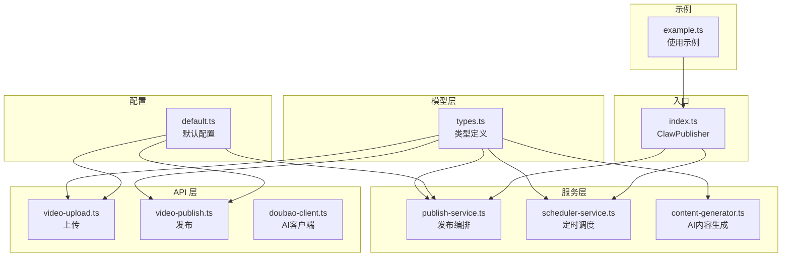
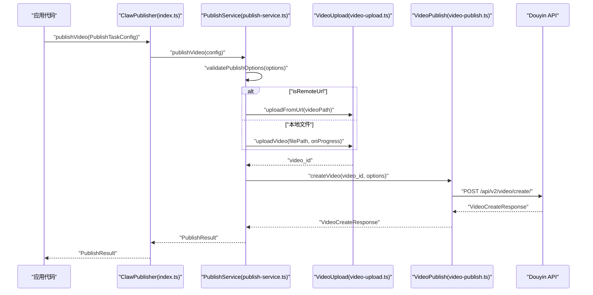
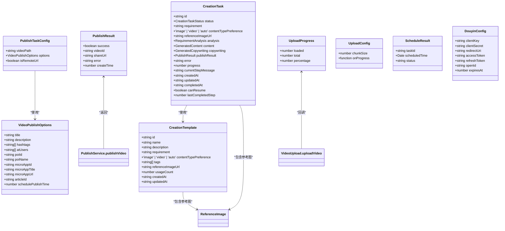
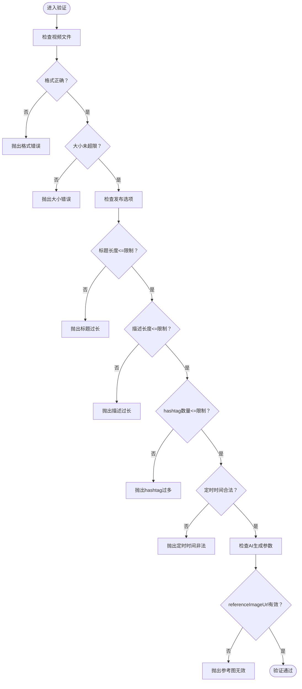

# 数据模型

<cite>
**本文引用的文件**
- [src/models/types.ts](file://src/models/types.ts)
- [src/api/video-publish.ts](file://src/api/video-publish.ts)
- [src/api/video-upload.ts](file://src/api/video-upload.ts)
- [src/services/publish-service.ts](file://src/services/publish-service.ts)
- [src/utils/validator.ts](file://src/utils/validator.ts)
- [config/default.ts](file://config/default.ts)
- [src/index.ts](file://src/index.ts)
- [example.ts](file://example.ts)
- [src/services/ai/content-generator.ts](file://src/services/ai/content-generator.ts)
- [src/api/ai/doubao-client.ts](file://src/api/ai/doubao-client.ts)
- [web/server/src/services/creation-task-service.ts](file://web/server/src/services/creation-task-service.ts)
- [web/server/src/routes/ai.ts](file://web/server/src/routes/ai.ts)
</cite>

## 目录
1. [简介](#简介)
2. [项目结构与数据模型定位](#项目结构与数据模型定位)
3. [核心数据模型总览](#核心数据模型总览)
4. [架构与数据流概览](#架构与数据流概览)
5. [详细数据模型解析](#详细数据模型解析)
6. [依赖关系与继承层次](#依赖关系与继承层次)
7. [JSON 序列化与反序列化示例](#json-序列化与反序列化示例)
8. [数据验证与业务规则](#数据验证与业务规则)
9. [扩展与自定义指南](#扩展与自定义指南)
10. [实际使用中的数据流转示例](#实际使用中的数据流转示例)
11. [性能与约束特性](#性能与约束特性)
12. [故障排查与常见问题](#故障排查与常见问题)
13. [结论](#结论)

## 简介
本文件系统性梳理 ClawOperations 的数据模型，聚焦核心类型定义、接口规范与数据结构，重点覆盖：
- 发布任务配置 PublishTaskConfig
- 视频发布选项 VideoPublishOptions
- 发布结果 PublishResult
- 创作任务 CreationTask
- 创作模板 CreationTemplate
- 以及与之相关的上传、认证、定时发布、AI内容生成等配套类型

同时给出字段语义、数据类型、取值范围与约束条件，提供模型间关系图、JSON 示例、验证规则、扩展建议与真实场景下的数据流转示例。

## 项目结构与数据模型定位
- 数据模型集中于 models/types.ts，作为类型定义与契约来源。
- 上传、发布、定时调度、AI内容生成等业务逻辑在 api 与 services 层消费这些类型。
- 配置常量位于 config/default.ts，驱动验证与行为边界。
- 示例文件 example.ts 展示了典型使用方式与数据流转。
- AI内容生成功能新增了 referenceImageUrl 字段，支持基于参考图的视频生成。

图表来源
- [src/models/types.ts:1-687](file://src/models/types.ts#L1-L687)
- [src/api/video-upload.ts:1-241](file://src/api/video-upload.ts#L1-L241)
- [src/api/video-publish.ts:1-174](file://src/api/video-publish.ts#L1-L174)
- [src/services/publish-service.ts:1-228](file://src/services/publish-service.ts#L1-L228)
- [src/services/ai/content-generator.ts:1-253](file://src/services/ai/content-generator.ts#L1-L253)
- [src/api/ai/doubao-client.ts:1-379](file://src/api/ai/doubao-client.ts#L1-L379)
- [config/default.ts:1-49](file://config/default.ts#L1-L49)
- [src/index.ts:1-248](file://src/index.ts#L1-L248)
- [example.ts:1-197](file://example.ts#L1-L197)

章节来源
- [src/models/types.ts:1-687](file://src/models/types.ts#L1-L687)
- [config/default.ts:1-49](file://config/default.ts#L1-L49)
- [src/index.ts:1-248](file://src/index.ts#L1-L248)

## 核心数据模型总览
- 发布任务配置 PublishTaskConfig：描述一次发布任务的输入，包括视频来源（本地路径或远程 URL）、发布选项、是否远程 URL 标记。
- 视频发布选项 VideoPublishOptions：描述发布时的元数据与附加能力，如标题、描述、话题标签、@提及、地理位置、小程序挂载、商品挂载、定时发布时间等。
- 发布结果 PublishResult：描述发布流程的输出，包含成功标志、视频 ID、分享链接、创建时间、错误信息等。
- 创作任务 CreationTask：描述AI创作任务的完整生命周期，包括需求分析、内容生成、文案生成、预览、发布等阶段，新增 referenceImageUrl 字段支持参考图。
- 创作模板 CreationTemplate：描述可复用的创作模板，包含需求内容、内容类型偏好、标签、参考图URL等，新增 referenceImageUrl 字段。
- 上传进度 UploadProgress：描述上传过程中的进度信息。
- 上传配置 UploadConfig：描述上传行为的可选配置，如分片大小、进度回调。
- 定时发布结果 ScheduleResult：描述定时任务的状态与计划时间。
- 抖音配置 DouyinConfig：OAuth 与令牌相关配置。
- 通用响应与错误：DouyinApiResponse、DouyinApiError。
- 认证相关：OAuthConfig、TokenResponse、TokenInfo。

章节来源
- [src/models/types.ts:1-687](file://src/models/types.ts#L1-L687)

## 架构与数据流概览
下图展示从应用入口到上传与发布的端到端数据流，以及各模型在其中的角色。

图表来源
- [src/index.ts:153-155](file://src/index.ts#L153-L155)
- [src/services/publish-service.ts:38-80](file://src/services/publish-service.ts#L38-L80)
- [src/api/video-upload.ts:220-237](file://src/api/video-upload.ts#L220-L237)
- [src/api/video-publish.ts:30-54](file://src/api/video-publish.ts#L30-L54)

## 详细数据模型解析

### PublishTaskConfig 发布任务配置
- 字段与含义
  - videoPath: string
    - 含义：视频文件路径或远程 URL
    - 类型：字符串
    - 约束：必填；当 isRemoteUrl=false 时为本地文件路径；当 isRemoteUrl=true 时为 HTTP(S) URL
  - options?: VideoPublishOptions
    - 含义：发布选项
    - 类型：可选对象
    - 约束：若提供则需满足验证规则
  - isRemoteUrl?: boolean
    - 含义：是否为远程 URL
    - 类型：布尔
    - 默认：false
    - 约束：与 videoPath 协同决定上传策略

- JSON 结构示意
  - 必填字段：videoPath
  - 可选字段：options、isRemoteUrl

章节来源
- [src/models/types.ts:161-168](file://src/models/types.ts#L161-L168)
- [src/services/publish-service.ts:38-80](file://src/services/publish-service.ts#L38-L80)

### VideoPublishOptions 视频发布选项
- 字段与含义
  - title?: string
    - 含义：视频标题
    - 类型：字符串
    - 约束：长度不超过内容配置的最大标题长度
  - description?: string
    - 含义：视频描述
    - 类型：字符串
    - 约束：长度不超过内容配置的最大描述长度
  - hashtags?: string[]
    - 含义：话题标签数组
    - 类型：字符串数组
    - 约束：数量不超过内容配置的最大 hashtag 数量；内部会格式化为"#"标签"形式
  - atUsers?: string[]
    - 含义：@提及用户列表（以 open_id 表示）
    - 类型：字符串数组
    - 约束：无硬性上限，但需符合平台要求
  - poiId?: string
    - 含义：地理位置 POI ID
    - 类型：字符串
  - poiName?: string
    - 含义：地理位置名称
    - 类型：字符串
  - microAppId?: string
    - 含义：小程序 ID（商业挂载）
    - 类型：字符串
  - microAppTitle?: string
    - 含义：小程序标题
    - 类型：字符串
  - microAppUrl?: string
    - 含义：小程序链接
    - 类型：字符串
  - articleId?: string
    - 含义：商品 ID（商业链接）
    - 类型：字符串
  - schedulePublishTime?: number
    - 含义：定时发布时间（Unix 秒）
    - 类型：数字
    - 约束：必须晚于当前时间；且不超过当前时间+7天

- JSON 结构示意
  - 可选字段：title、description、hashtags、atUsers、poiId、poiName、microAppId、microAppTitle、microAppUrl、articleId、schedulePublishTime

章节来源
- [src/models/types.ts:101-124](file://src/models/types.ts#L101-L124)
- [src/api/video-publish.ts:62-125](file://src/api/video-publish.ts#L62-L125)
- [src/utils/validator.ts:45-86](file://src/utils/validator.ts#L45-L86)

### PublishResult 发布结果
- 字段与含义
  - success: boolean
    - 含义：是否发布成功
    - 类型：布尔
  - videoId?: string
    - 含义：视频 ID
    - 类型：字符串
  - shareUrl?: string
    - 含义：分享链接
    - 类型：字符串
  - error?: string
    - 含义：错误信息（失败时存在）
    - 类型：字符串
  - createTime?: number
    - 含义：创建时间（Unix 秒）
    - 类型：数字

- JSON 结构示意
  - 必填字段：success
  - 可选字段：videoId、shareUrl、error、createTime

章节来源
- [src/models/types.ts:173-179](file://src/models/types.ts#L173-L179)
- [src/services/publish-service.ts:65-79](file://src/services/publish-service.ts#L65-L79)

### CreationTask 创作任务
- 字段与含义
  - id: string
    - 含义：任务 ID
    - 类型：字符串
  - status: CreationTaskStatus
    - 含义：任务状态（草稿、分析中、生成中、文案生成中、预览、发布中、已完成、失败）
    - 类型：枚举
  - requirement: string
    - 含义：原始需求描述
    - 类型：字符串
  - contentTypePreference?: 'image' | 'video' | 'auto'
    - 含义：内容类型偏好
    - 类型：可选枚举
  - referenceImageUrl?: string
    - 含义：参考图 URL
    - 类型：可选字符串
    - 约束：HTTP(S) URL 格式
  - analysis?: RequirementAnalysis
    - 含义：需求分析结果
    - 类型：可选对象
  - content?: GeneratedContent
    - 含义：生成的内容
    - 类型：可选对象
  - copywriting?: GeneratedCopywriting
    - 含义：生成的文案
    - 类型：可选对象
  - publishResult?: PublishResult
    - 含义：发布结果
    - 类型：可选对象
  - error?: string
    - 含义：错误信息
    - 类型：可选字符串
  - progress: number
    - 含义：进度百分比（0-100）
    - 类型：数字
  - currentStepMessage: string
    - 含义：当前步骤消息
    - 类型：字符串
  - createdAt: string
    - 含义：创建时间（ISO 字符串）
    - 类型：字符串
  - updatedAt: string
    - 含义：更新时间（ISO 字符串）
    - 类型：字符串
  - completedAt?: string
    - 含义：完成时间（ISO 字符串）
    - 类型：可选字符串
  - canResume: boolean
    - 含义：是否可恢复
    - 类型：布尔
  - lastCompletedStep: number
    - 含义：最后完成的步骤（0-4）
    - 类型：数字

- JSON 结构示意
  - 必填字段：id、status、requirement、progress、currentStepMessage、createdAt、updatedAt、canResume、lastCompletedStep
  - 可选字段：contentTypePreference、referenceImageUrl、analysis、content、copywriting、publishResult、error、completedAt

**更新** 新增 referenceImageUrl 字段，支持基于参考图的AI内容生成

章节来源
- [src/models/types.ts:337-372](file://src/models/types.ts#L337-L372)
- [src/services/ai/content-generator.ts:38-43](file://src/services/ai/content-generator.ts#L38-L43)

### CreationTemplate 创作模板
- 字段与含义
  - id: string
    - 含义：模板 ID
    - 类型：字符串
  - name: string
    - 含义：模板名称
    - 类型：字符串
  - description?: string
    - 含义：模板描述
    - 类型：可选字符串
  - requirement: string
    - 含义：需求内容
    - 类型：字符串
  - contentTypePreference?: 'image' | 'video' | 'auto'
    - 含义：内容类型偏好
    - 类型：可选枚举
  - tags: string[]
    - 含义：标签数组
    - 类型：字符串数组
  - referenceImageUrl?: string
    - 含义：参考图 URL
    - 类型：可选字符串
    - 约束：HTTP(S) URL 格式
  - usageCount: number
    - 含义：使用次数
    - 类型：数字
  - createdAt: string
    - 含义：创建时间（ISO 字符串）
    - 类型：字符串
  - updatedAt: string
    - 含义：更新时间（ISO 字符串）
    - 类型：字符串

- JSON 结构示意
  - 必填字段：id、name、requirement、tags、usageCount、createdAt、updatedAt
  - 可选字段：description、contentTypePreference、referenceImageUrl

**更新** 新增 referenceImageUrl 字段，支持模板级别的参考图配置

章节来源
- [src/models/types.ts:377-398](file://src/models/types.ts#L377-L398)
- [web/server/src/services/creation-task-service.ts:202-221](file://web/server/src/services/creation-task-service.ts#L202-L221)

### UploadProgress 上传进度
- 字段与含义
  - loaded: number
    - 含义：已上传字节数
    - 类型：数字
  - total: number
    - 含义：总字节数
    - 类型：数字
  - percentage: number
    - 含义：百分比（0-100）
    - 类型：数字

- JSON 结构示意
  - 必填字段：loaded、total、percentage

章节来源
- [src/models/types.ts:61-65](file://src/models/types.ts#L61-L65)
- [src/api/video-upload.ts:76-82](file://src/api/video-upload.ts#L76-L82)

### UploadConfig 上传配置
- 字段与含义
  - chunkSize?: number
    - 含义：分片大小（字节）
    - 类型：数字
    - 默认：配置常量中的默认分片大小
  - onProgress?: (progress: UploadProgress) => void
    - 含义：进度回调
    - 类型：函数
    - 参数：UploadProgress

- JSON 结构示意
  - 可选字段：chunkSize、onProgress

章节来源
- [src/models/types.ts:53-56](file://src/models/types.ts#L53-L56)
- [src/api/video-upload.ts:107-142](file://src/api/video-upload.ts#L107-L142)

### ScheduleResult 定时发布结果
- 字段与含义
  - taskId: string
    - 含义：定时任务 ID
    - 类型：字符串
  - scheduledTime: Date
    - 含义：计划发布时间
    - 类型：日期对象
  - status: 'pending' | 'completed' | 'failed' | 'cancelled'
    - 含义：任务状态
    - 类型：枚举字符串

- JSON 结构示意
  - 必填字段：taskId、scheduledTime、status

章节来源
- [src/models/types.ts:184-188](file://src/models/types.ts#L184-L188)

### DouyinConfig 抖音配置
- 字段与含义
  - clientKey: string
  - clientSecret: string
  - redirectUri: string
  - accessToken?: string
  - refreshToken?: string
  - openId?: string
  - expiresAt?: number

- JSON 结构示意
  - 必填字段：clientKey、clientSecret、redirectUri
  - 可选字段：accessToken、refreshToken、openId、expiresAt

章节来源
- [src/models/types.ts:194-202](file://src/models/types.ts#L194-L202)
- [src/index.ts:39-60](file://src/index.ts#L39-L60)

### 通用类型
- DouyinApiResponse<T>
  - data: T
  - message: string
- DouyinApiError
  - code: number
  - message: string
  - log_id?: string

章节来源
- [src/models/types.ts:143-155](file://src/models/types.ts#L143-L155)

### 认证相关类型
- OAuthConfig
  - clientKey: string
  - clientSecret: string
  - redirectUri: string
- TokenResponse
  - access_token: string
  - refresh_token: string
  - expires_in: number
  - open_id: string
  - scope: string
- TokenInfo
  - accessToken: string
  - refreshToken: string
  - expiresAt: number
  - openId: string
  - scope: string

章节来源
- [src/models/types.ts:20-47](file://src/models/types.ts#L20-L47)

## 依赖关系与继承层次
- 类型层面
  - PublishTaskConfig 依赖 VideoPublishOptions
  - VideoPublishOptions 由 VideoPublish.createVideo 使用
  - PublishResult 由 PublishService.publishVideo 返回
  - CreationTask 包含 referenceImageUrl 字段，支持AI内容生成
  - CreationTemplate 包含 referenceImageUrl 字段，支持模板级参考图
  - UploadProgress 由 VideoUpload.uploadVideo 回调
  - ScheduleResult 由 SchedulerService 返回
- 组件层面
  - ClawPublisher 作为门面，组合 PublishService 与 SchedulerService
  - PublishService 编排上传与发布
  - VideoUpload 与 VideoPublish 分别处理上传与发布细节
  - ContentGenerator 支持基于参考图的AI内容生成
  - CreationTaskService 管理创作任务和模板

图表来源
- [src/models/types.ts:101-398](file://src/models/types.ts#L101-L398)
- [src/services/publish-service.ts:38-80](file://src/services/publish-service.ts#L38-L80)
- [src/api/video-upload.ts:76-82](file://src/api/video-upload.ts#L76-L82)
- [src/services/ai/content-generator.ts:38-43](file://src/services/ai/content-generator.ts#L38-L43)

## JSON 序列化与反序列化示例
以下示例展示常见数据模型的 JSON 形态与字段映射。注意：字段命名可能因 API 需求而采用 snake_case 或 camelCase，具体以实际网络请求为准。

- PublishTaskConfig
  - 示例
    - {
        "videoPath": "/path/to/video.mp4",
        "options": {
          "title": "示例标题",
          "description": "示例描述",
          "hashtags": ["美食", "教程"],
          "poiId": "poi_123",
          "poiName": "地点名称",
          "schedulePublishTime": 1764566400
        },
        "isRemoteUrl": false
      }
  - 字段说明
    - videoPath：本地文件路径或 URL
    - options：发布选项对象
    - isRemoteUrl：是否远程 URL

- VideoPublishOptions
  - 示例
    - {
        "title": "夏日限定小龙虾",
        "description": "今天教大家做麻辣小龙虾",
        "hashtags": ["美食", "小龙虾", "教程"],
        "atUsers": ["open_id_1", "open_id_2"],
        "poiId": "poi_123456",
        "poiName": "武汉光谷步行街",
        "microAppId": "app_xxx",
        "microAppTitle": "查看完整食谱",
        "microAppUrl": "https://example.com/recipe",
        "articleId": "product_xxx",
        "schedulePublishTime": 1764566400
      }
  - 字段说明
    - 标题、描述、话题标签、@提及、POI、小程序挂载、商品挂载、定时发布时间

- PublishResult
  - 成功示例
    - {
        "success": true,
        "videoId": "video_id_abc",
        "shareUrl": "https://v.douyin.com/share/...",
        "createTime": 1764566400
      }
  - 失败示例
    - {
        "success": false,
        "error": "标题过长"
      }

- CreationTask
  - 示例
    - {
        "id": "task_abc",
        "status": "generating",
        "requirement": "制作一个关于夏日小龙虾的短视频",
        "contentTypePreference": "video",
        "referenceImageUrl": "https://example.com/reference.jpg",
        "progress": 50,
        "currentStepMessage": "正在生成视频内容",
        "createdAt": "2025-01-01T10:00:00Z",
        "updatedAt": "2025-01-01T10:30:00Z",
        "canResume": true,
        "lastCompletedStep": 1
      }
  - 字段说明
    - 包含 referenceImageUrl 字段，支持基于参考图的AI内容生成

- CreationTemplate
  - 示例
    - {
        "id": "tpl_abc",
        "name": "美食推广模板",
        "description": "用于美食内容推广的标准模板",
        "requirement": "制作美食推广内容",
        "contentTypePreference": "video",
        "tags": ["美食", "推广"],
        "referenceImageUrl": "https://example.com/template-reference.jpg",
        "usageCount": 15,
        "createdAt": "2025-01-01T10:00:00Z",
        "updatedAt": "2025-01-01T10:00:00Z"
      }
  - 字段说明
    - 包含 referenceImageUrl 字段，支持模板级别的参考图配置

- UploadProgress
  - 示例
    - {
        "loaded": 10485760,
        "total": 104857600,
        "percentage": 10
      }

- ScheduleResult
  - 示例
    - {
        "taskId": "task_abc",
        "scheduledTime": "2025-12-01T10:00:00Z",
        "status": "pending"
      }

- DouyinConfig
  - 示例
    - {
        "clientKey": "your_client_key",
        "clientSecret": "your_client_secret",
        "redirectUri": "https://your-domain.com/callback",
        "accessToken": "access_token_here",
        "refreshToken": "refresh_token_here",
        "openId": "your_open_id",
        "expiresAt": 1764566400
      }

章节来源
- [src/models/types.ts:101-398](file://src/models/types.ts#L101-L398)
- [src/services/publish-service.ts:65-79](file://src/services/publish-service.ts#L65-L79)
- [src/api/video-upload.ts:76-82](file://src/api/video-upload.ts#L76-L82)
- [src/index.ts:39-60](file://src/index.ts#L39-L60)

## 数据验证与业务规则
- 视频文件验证
  - 支持格式：由配置常量决定
  - 最大文件大小：由配置常量决定
  - 不支持的格式或超限将抛出验证异常
- 发布选项验证
  - 标题长度限制
  - 描述长度限制
  - hashtag 数量限制
  - 定时发布时间必须晚于当前时间且不超过 7 天后
- 内容格式化
  - hashtag 自动清理前缀并拼接为"#标签"形式
  - 发布时将 hashtag 追加到描述末尾（若有）
- AI内容生成验证
  - referenceImageUrl 必须为有效的 HTTP(S) URL 格式
  - 参考图仅支持视频生成，图片生成暂不支持参考图
  - 参考图 URL 必须可访问且格式正确

图表来源
- [src/utils/validator.ts:22-86](file://src/utils/validator.ts#L22-L86)
- [src/services/ai/content-generator.ts:156-179](file://src/services/ai/content-generator.ts#L156-L179)
- [config/default.ts:26-40](file://config/default.ts#L26-L40)

章节来源
- [src/utils/validator.ts:1-116](file://src/utils/validator.ts#L1-L116)
- [src/services/ai/content-generator.ts:156-179](file://src/services/ai/content-generator.ts#L156-L179)
- [config/default.ts:1-49](file://config/default.ts#L1-L49)

## 扩展与自定义指南
- 新增发布选项字段
  - 在 VideoPublishOptions 中添加新字段，并在构建发布参数时映射到 API 字段
  - 若涉及验证规则，更新 validatePublishOptions
- 自定义上传策略
  - 修改 UploadConfig 的 chunkSize 或实现自定义分片策略
  - 如需调整阈值，修改配置常量中的分片阈值
- 自定义验证规则
  - 在 validator.ts 中新增校验函数，并在相应服务中调用
- 扩展定时发布
  - 在 SchedulerService 中增加新的调度策略或状态
- 扩展错误处理
  - 在 utils/validator.ts 中新增 ValidationError 子类，或在 API 层处理 DouyinApiError
- AI内容生成扩展
  - 在 ContentGenerator 中支持新的AI模型或生成参数
  - 扩展 DoubaoClient 以支持更多AI功能
- 模板系统扩展
  - 在 CreationTemplate 中添加新的模板属性
  - 扩展 CreationTaskService 以支持模板的高级功能

章节来源
- [src/models/types.ts:101-398](file://src/models/types.ts#L101-L398)
- [src/api/video-publish.ts:62-125](file://src/api/video-publish.ts#L62-L125)
- [src/utils/validator.ts:45-86](file://src/utils/validator.ts#L45-L86)
- [src/services/ai/content-generator.ts:156-179](file://src/services/ai/content-generator.ts#L156-L179)
- [config/default.ts:10-40](file://config/default.ts#L10-L40)

## 实际使用中的数据流转示例
- 一站式发布（本地文件）
  - 输入：PublishTaskConfig（videoPath 为本地路径，isRemoteUrl=false）
  - 流程：验证发布选项 -> 上传视频 -> 创建并发布 -> 返回 PublishResult
  - 输出：PublishResult（success=true，包含 videoId、shareUrl、createTime）
- 从 URL 发布
  - 输入：PublishTaskConfig（videoPath 为 URL，isRemoteUrl=true）
  - 流程：验证发布选项 -> 从 URL 上传 -> 创建并发布 -> 返回 PublishResult
- 定时发布
  - 输入：PublishTaskConfig + Date
  - 流程：创建定时任务 -> 等待到达时间 -> 自动执行发布
  - 输出：ScheduleResult（包含 taskId、scheduledTime、status）
- AI内容生成（带参考图）
  - 输入：CreationTask（包含 referenceImageUrl）
  - 流程：需求分析 -> AI内容生成（使用参考图）-> 文案生成 -> 预览 -> 发布
  - 输出：CreationTask（包含生成的内容和发布结果）
- 模板使用
  - 输入：CreationTemplate（包含 referenceImageUrl）
  - 流程：使用模板创建创作任务 -> 继承模板的参考图配置
  - 输出：CreationTask（包含模板的 referenceImageUrl）

章节来源
- [src/services/publish-service.ts:38-80](file://src/services/publish-service.ts#L38-L80)
- [src/api/video-upload.ts:220-237](file://src/api/video-upload.ts#L220-L237)
- [src/index.ts:191-193](file://src/index.ts#L191-L193)
- [src/services/ai/content-generator.ts:98-102](file://src/services/ai/content-generator.ts#L98-L102)
- [web/server/src/routes/ai.ts:858-903](file://web/server/src/routes/ai.ts#L858-L903)
- [example.ts:55-96](file://example.ts#L55-L96)

## 性能与约束特性
- 上传策略
  - 小于阈值：直接上传，适合小文件
  - 大于阈值：分片上传，支持断点续传与进度回调
- 配置阈值
  - 分片阈值、默认分片大小、最大文件大小、支持格式等由配置常量控制
- 重试机制
  - 可通过配置重试次数、基础延迟与最大延迟（见默认配置），在上传与发布过程中提升稳定性
- 并发与进度
  - 上传进度回调可用于 UI 展示与监控
- AI内容生成优化
  - 参考图仅用于视频生成，图片生成暂不支持参考图
  - 参考图 URL 必须可访问，建议使用稳定的CDN服务
  - 视频生成可能需要更长的等待时间，建议提供进度反馈

章节来源
- [config/default.ts:10-31](file://config/default.ts#L10-L31)
- [src/api/video-upload.ts:48-54](file://src/api/video-upload.ts#L48-L54)
- [src/api/video-upload.ts:104-152](file://src/api/video-upload.ts#L104-L152)
- [src/services/ai/content-generator.ts:125-189](file://src/services/ai/content-generator.ts#L125-L189)

## 故障排查与常见问题
- 发布失败
  - 检查 PublishResult.error 字段，确认是否为标题/描述/hashtag/定时时间等验证错误
  - 若为网络错误，结合日志与重试配置排查
- 上传失败
  - 检查文件格式与大小是否符合配置
  - 分片上传失败时，确认 upload_id 与分片顺序
- 定时发布异常
  - 确认 schedulePublishTime 是否在允许范围内（当前时间之后且不超过 7 天）
  - 检查 SchedulerService 的任务状态
- AI内容生成失败
  - 检查 referenceImageUrl 是否为有效的 HTTP(S) URL
  - 确认参考图 URL 可访问且格式正确
  - 验证AI模型配置是否正确
- 模板使用异常
  - 检查模板是否存在且可访问
  - 确认模板的 referenceImageUrl 字段是否正确传递

章节来源
- [src/services/publish-service.ts:71-79](file://src/services/publish-service.ts#L71-L79)
- [src/utils/validator.ts:45-86](file://src/utils/validator.ts#L45-L86)
- [src/api/video-upload.ts:160-213](file://src/api/video-upload.ts#L160-L213)
- [src/services/ai/content-generator.ts:156-179](file://src/services/ai/content-generator.ts#L156-L179)
- [web/server/src/services/creation-task-service.ts:263-271](file://web/server/src/services/creation-task-service.ts#L263-L271)

## 结论
本文档系统化梳理了 ClawOperations 的数据模型，明确了 PublishTaskConfig、VideoPublishOptions、PublishResult、CreationTask、CreationTemplate 等核心类型及其字段语义、约束与使用方式，并结合上传、发布、定时调度、AI内容生成等组件展示了完整的数据流转。

**重要更新**：本次更新反映了数据模型的最新变更，新增了 referenceImageUrl 字段，该字段现已集成到 CreationTask 和 CreationTemplate 类型中，支持基于参考图的AI内容生成功能。这一变更增强了系统的AI创作能力，使用户能够通过提供参考图像来指导AI生成更符合预期的内容。

通过配置常量与验证器，系统在格式、大小、长度与时间窗口等方面提供了明确的边界与保护。按本文提供的扩展与自定义指南，可在不破坏契约的前提下灵活增强功能，包括AI内容生成、模板系统、参考图支持等方面的扩展。