# 服务器路由增强

<cite>
**本文档引用的文件**
- [src/index.ts](file://src/index.ts)
- [web/server/src/index.ts](file://web/server/src/index.ts)
- [web/server/src/routes/auth.ts](file://web/server/src/routes/auth.ts)
- [web/server/src/routes/publish.ts](file://web/server/src/routes/publish.ts)
- [web/server/src/routes/upload.ts](file://web/server/src/routes/upload.ts)
- [web/server/src/routes/ai.ts](file://web/server/src/routes/ai.ts)
- [web/server/src/routes/user.ts](file://web/server/src/routes/user.ts)
- [src/models/types.ts](file://src/models/types.ts)
- [web/server/src/services/publisher.ts](file://web/server/src/services/publisher.ts)
- [web/server/src/middleware/auth.ts](file://web/server/src/middleware/auth.ts)
- [web/server/src/utils/auth.ts](file://web/server/src/utils/auth.ts)
- [package.json](file://package.json)
- [web/server/package.json](file://web/server/package.json)
</cite>

## 目录
1. [简介](#简介)
2. [项目结构](#项目结构)
3. [核心组件](#核心组件)
4. [架构概览](#架构概览)
5. [详细组件分析](#详细组件分析)
6. [依赖关系分析](#依赖关系分析)
7. [性能考虑](#性能考虑)
8. [故障排除指南](#故障排除指南)
9. [结论](#结论)

## 简介

ClawOperations 是一个专为抖音小龙虾营销账号设计的自动化运营系统。该项目提供了完整的服务器端路由增强功能，包括认证管理、视频上传发布、AI内容创作、用户管理和定时任务调度等核心功能。

该系统采用Express.js构建RESTful API，支持多种内容发布方式（视频、图文），集成了抖音官方API，并提供了完整的用户认证和权限管理系统。

## 项目结构

项目采用模块化架构，主要分为以下层次：

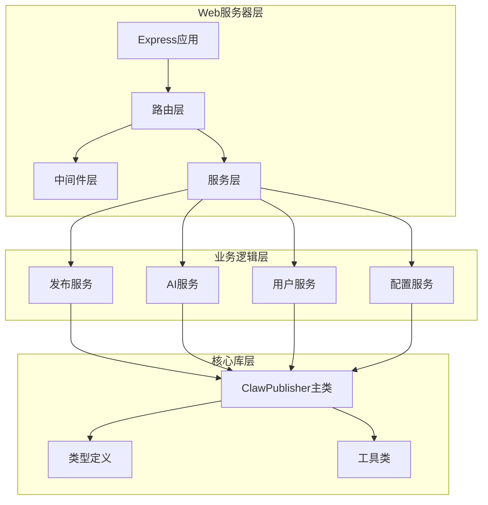

**图表来源**
- [web/server/src/index.ts:1-72](file://web/server/src/index.ts#L1-L72)
- [src/index.ts:1-270](file://src/index.ts#L1-L270)

**章节来源**
- [web/server/src/index.ts:1-72](file://web/server/src/index.ts#L1-L72)
- [package.json:1-39](file://package.json#L1-L39)

## 核心组件

### 服务器路由架构

系统采用模块化的路由设计，每个功能模块都有独立的路由文件：

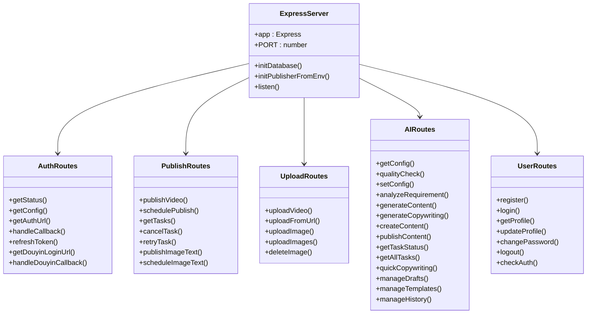

**图表来源**
- [web/server/src/index.ts:20-36](file://web/server/src/index.ts#L20-L36)
- [web/server/src/routes/auth.ts:12](file://web/server/src/routes/auth.ts#L12)
- [web/server/src/routes/publish.ts:12](file://web/server/src/routes/publish.ts#L12)
- [web/server/src/routes/upload.ts:7](file://web/server/src/routes/upload.ts#L7)
- [web/server/src/routes/ai.ts:15](file://web/server/src/routes/ai.ts#L15)
- [web/server/src/routes/user.ts:7](file://web/server/src/routes/user.ts#L7)

### 认证中间件体系

系统实现了多层次的认证机制：

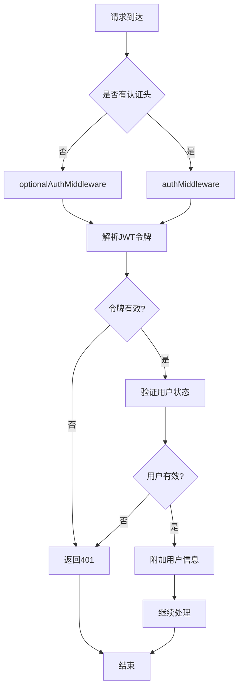

**图表来源**
- [web/server/src/middleware/auth.ts:18-54](file://web/server/src/middleware/auth.ts#L18-L54)
- [web/server/src/middleware/auth.ts:59-75](file://web/server/src/middleware/auth.ts#L59-L75)

**章节来源**
- [web/server/src/middleware/auth.ts:1-93](file://web/server/src/middleware/auth.ts#L1-L93)
- [web/server/src/utils/auth.ts:1-91](file://web/server/src/utils/auth.ts#L1-L91)

## 架构概览

系统采用分层架构设计，确保各层职责清晰分离：

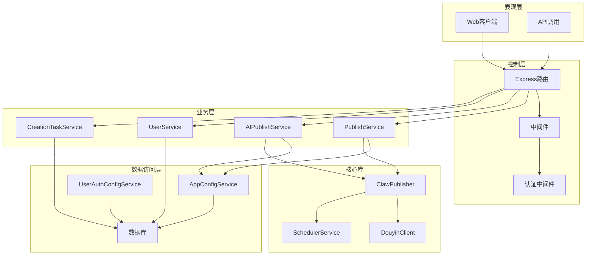

**图表来源**
- [web/server/src/index.ts:1-72](file://web/server/src/index.ts#L1-L72)
- [web/server/src/services/publisher.ts:1-214](file://web/server/src/services/publisher.ts#L1-L214)
- [src/index.ts:1-270](file://src/index.ts#L1-L270)

## 详细组件分析

### 认证路由系统

认证系统提供了完整的OAuth流程和本地用户管理：

#### OAuth授权流程

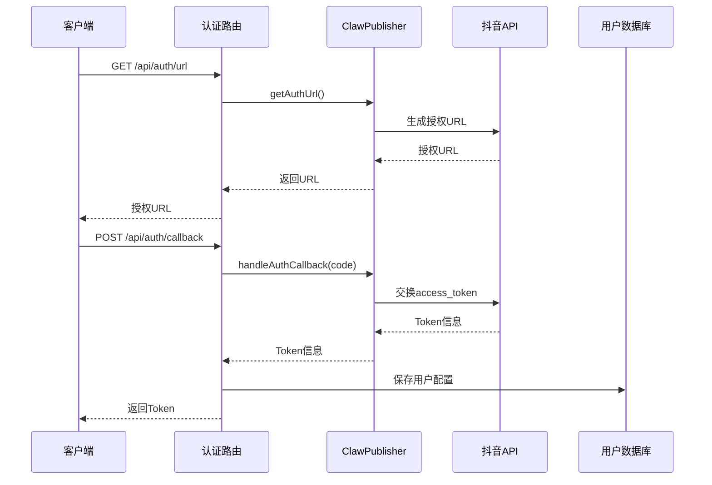

**图表来源**
- [web/server/src/routes/auth.ts:93-163](file://web/server/src/routes/auth.ts#L93-L163)
- [web/server/src/services/publisher.ts:120-131](file://web/server/src/services/publisher.ts#L120-L131)

#### 用户登录流程

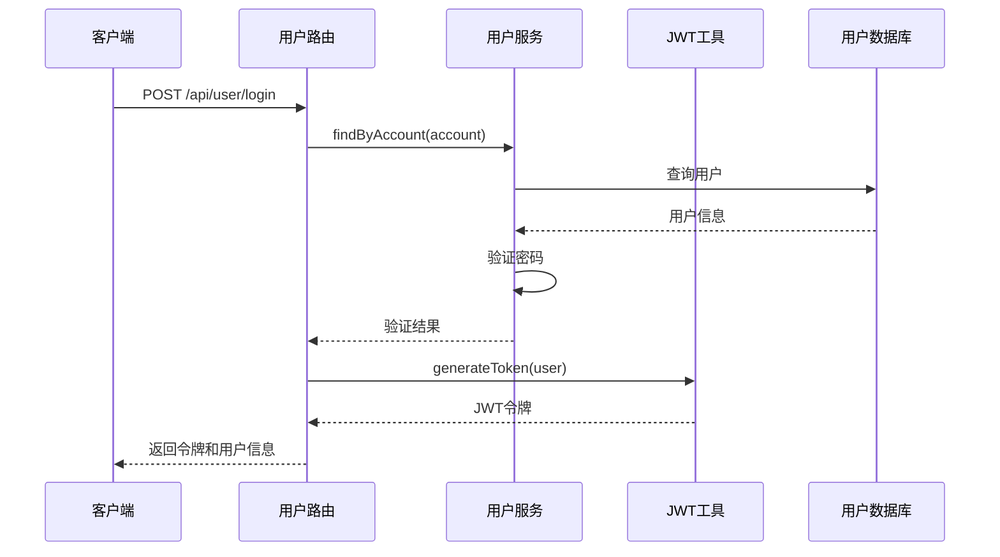

**图表来源**
- [web/server/src/routes/user.ts:49-106](file://web/server/src/routes/user.ts#L49-L106)
- [web/server/src/utils/auth.ts:21-33](file://web/server/src/utils/auth.ts#L21-L33)

**章节来源**
- [web/server/src/routes/auth.ts:1-373](file://web/server/src/routes/auth.ts#L1-L373)
- [web/server/src/routes/user.ts:1-212](file://web/server/src/routes/user.ts#L1-L212)

### 发布路由系统

发布系统支持多种内容类型的发布和管理：

#### 视频发布流程

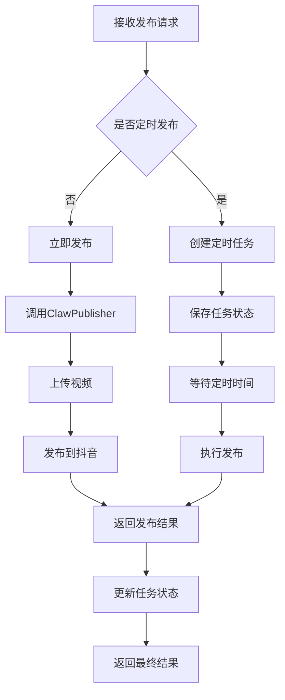

**图表来源**
- [web/server/src/routes/publish.ts:36-98](file://web/server/src/routes/publish.ts#L36-L98)
- [web/server/src/routes/publish.ts:169-208](file://web/server/src/routes/publish.ts#L169-L208)

#### 图文发布流程

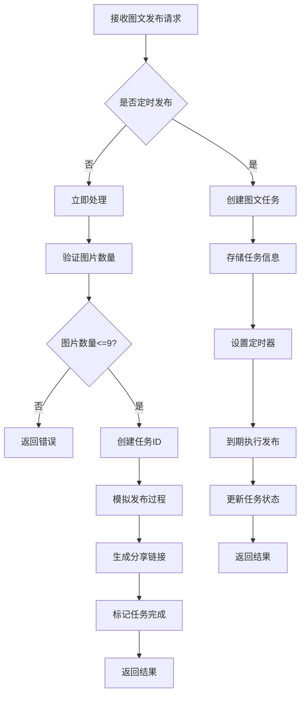

**图表来源**
- [web/server/src/routes/publish.ts:261-397](file://web/server/src/routes/publish.ts#L261-L397)

**章节来源**
- [web/server/src/routes/publish.ts:1-464](file://web/server/src/routes/publish.ts#L1-L464)
- [src/models/types.ts:411-484](file://src/models/types.ts#L411-L484)

### 上传路由系统

上传系统支持多种文件类型和上传方式：

#### 文件上传流程

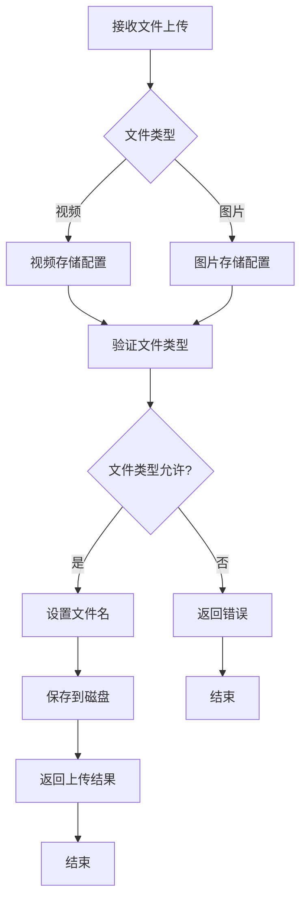

**图表来源**
- [web/server/src/routes/upload.ts:83-115](file://web/server/src/routes/upload.ts#L83-L115)
- [web/server/src/routes/upload.ts:153-181](file://web/server/src/routes/upload.ts#L153-L181)

#### 多文件上传处理

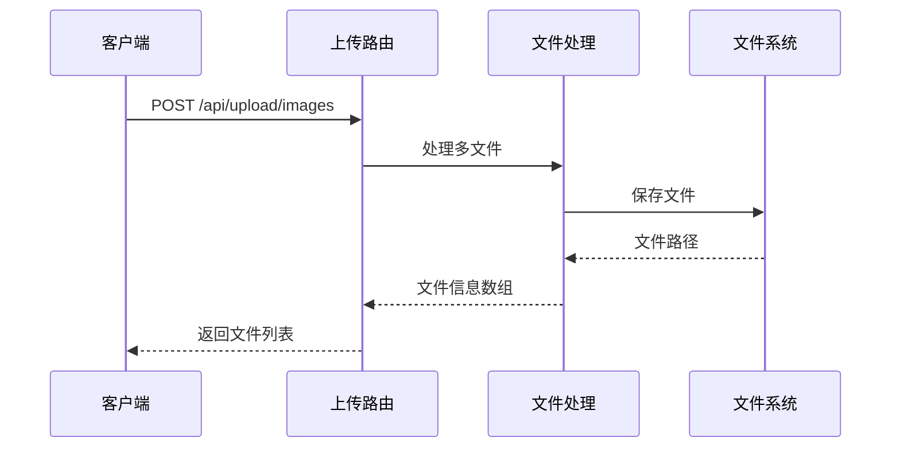

**图表来源**
- [web/server/src/routes/upload.ts:187-220](file://web/server/src/routes/upload.ts#L187-L220)

**章节来源**
- [web/server/src/routes/upload.ts:1-252](file://web/server/src/routes/upload.ts#L1-L252)

### AI创作路由系统

AI系统提供了完整的创作工作流程：

#### 内容创作流程

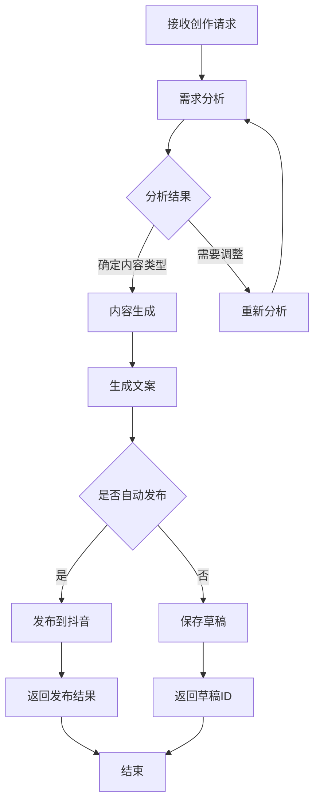

**图表来源**
- [web/server/src/routes/ai.ts:259-292](file://web/server/src/routes/ai.ts#L259-L292)
- [web/server/src/routes/ai.ts:164-194](file://web/server/src/routes/ai.ts#L164-L194)

#### 草稿管理系统

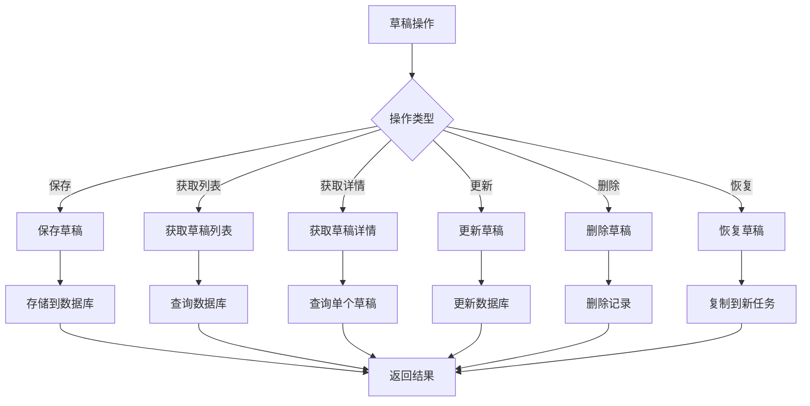

**图表来源**
- [web/server/src/routes/ai.ts:428-586](file://web/server/src/routes/ai.ts#L428-L586)

**章节来源**
- [web/server/src/routes/ai.ts:1-800](file://web/server/src/routes/ai.ts#L1-L800)
- [src/models/types.ts:203-393](file://src/models/types.ts#L203-L393)

## 依赖关系分析

系统采用了清晰的依赖注入和模块化设计：

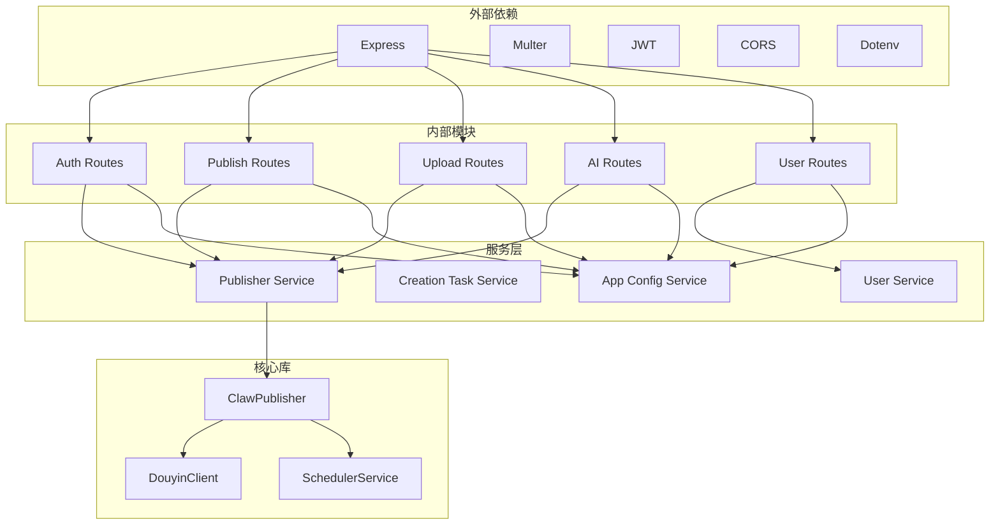

**图表来源**
- [web/server/package.json:12-20](file://web/server/package.json#L12-L20)
- [package.json:18-24](file://package.json#L18-L24)

### 核心类型系统

系统定义了完整的类型系统来确保类型安全：

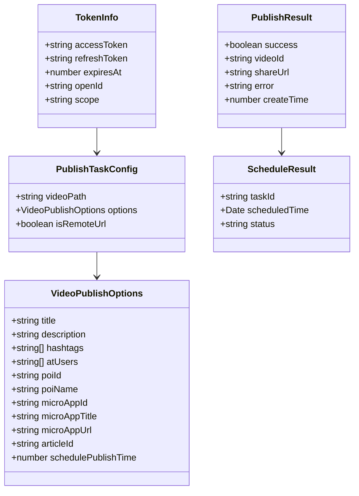

**图表来源**
- [src/models/types.ts:161-201](file://src/models/types.ts#L161-L201)
- [src/models/types.ts:101-124](file://src/models/types.ts#L101-L124)
- [src/models/types.ts:173-189](file://src/models/types.ts#L173-L189)
- [src/models/types.ts:40-46](file://src/models/types.ts#L40-L46)

**章节来源**
- [src/models/types.ts:1-682](file://src/models/types.ts#L1-L682)

## 性能考虑

### 缓存策略

系统实现了智能的缓存机制来提升性能：

1. **JWT令牌缓存**：避免重复的令牌验证
2. **AI服务缓存**：根据API密钥动态缓存AI服务实例
3. **配置缓存**：减少数据库查询次数

### 异步处理

- **定时任务**：使用node-cron处理定时发布
- **文件上传**：支持大文件分块上传
- **并发处理**：多个发布任务可以并行执行

### 错误处理

系统提供了完善的错误处理机制：

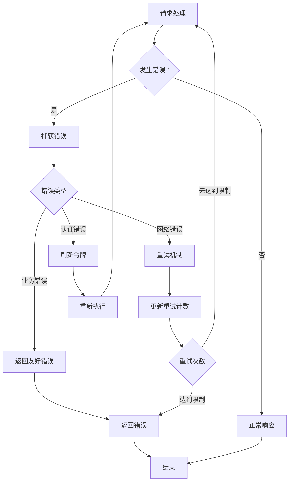

## 故障排除指南

### 常见问题诊断

#### 认证问题

1. **令牌过期**
   - 检查`/api/auth/refresh`端点
   - 验证JWT_SECRET配置
   - 确认用户状态有效

2. **OAuth回调失败**
   - 检查redirect_uri配置
   - 验证客户端密钥
   - 确认网络连接

#### 发布问题

1. **视频上传失败**
   - 检查文件大小限制
   - 验证文件格式
   - 确认磁盘空间

2. **定时任务异常**
   - 检查系统时间
   - 验证cron表达式
   - 确认任务状态

#### AI创作问题

1. **API密钥配置**
   - 检查DEEPSEEK_API_KEY
   - 验证API可用性
   - 确认配额限制

2. **内容生成失败**
   - 检查输入参数
   - 验证内容类型
   - 确认网络连接

**章节来源**
- [web/server/src/routes/auth.ts:169-209](file://web/server/src/routes/auth.ts#L169-L209)
- [web/server/src/routes/publish.ts:123-145](file://web/server/src/routes/publish.ts#L123-L145)
- [web/server/src/routes/ai.ts:135-162](file://web/server/src/routes/ai.ts#L135-L162)

## 结论

ClawOperations服务器路由系统展现了现代Node.js应用的最佳实践：

### 主要优势

1. **模块化设计**：清晰的路由分离和职责划分
2. **类型安全**：完整的TypeScript类型定义
3. **扩展性强**：易于添加新功能和路由
4. **错误处理**：完善的错误处理和重试机制
5. **性能优化**：智能缓存和异步处理

### 技术亮点

- **Express中间件体系**：灵活的认证和权限控制
- **分层架构**：清晰的业务逻辑分离
- **配置管理**：环境变量和数据库双重配置
- **监控集成**：完整的日志和健康检查

### 改进建议

1. **API版本控制**：为重要接口添加版本管理
2. **速率限制**：实现更精细的API调用限制
3. **监控告警**：集成更完善的监控系统
4. **文档完善**：生成OpenAPI规范文档

该系统为抖音内容创作者提供了完整的自动化解决方案，通过增强的服务器路由功能，能够高效地管理各种营销活动和内容发布需求。