# AI内容生成系统

<cite>
**本文档引用的文件**
- [README.md](file://README.md)
- [package.json](file://package.json)
- [src/index.ts](file://src/index.ts)
- [config/default.ts](file://config/default.ts)
- [src/models/types.ts](file://src/models/types.ts)
- [src/api/auth.ts](file://src/api/auth.ts)
- [src/services/publish-service.ts](file://src/services/publish-service.ts)
- [src/services/scheduler-service.ts](file://src/services/scheduler-service.ts)
- [src/utils/logger.ts](file://src/utils/logger.ts)
- [src/services/ai/content-generator.ts](file://src/services/ai/content-generator.ts)
- [src/services/ai/copywriting-generator.ts](file://src/services/ai/copywriting-generator.ts)
- [src/services/ai/requirement-analyzer.ts](file://src/services/ai/requirement-analyzer.ts)
- [web/server/src/index.ts](file://web/server/src/index.ts)
- [web/server/src/routes/ai.ts](file://web/server/src/routes/ai.ts)
- [web/client/src/pages/AICreator.tsx](file://web/client/src/pages/AICreator.tsx)
- [src/api/ai/doubao-client.ts](file://src/api/ai/doubao-client.ts)
- [src/services/ai-publish-service.ts](file://src/services/ai-publish-service.ts)
- [web/client/src/components/ai-creator/TemplateSelector.tsx](file://web/client/src/components/ai-creator/TemplateSelector.tsx)
</cite>

## 更新摘要
**变更内容**
- 内容生成器支持参考图像选项，GenerateOptions接口新增referenceImageUrl字段
- ContentGenerator.generate方法现在接受可选的参考图像URL参数
- Doubao AI客户端的generateVideo方法支持referenceImageUrl选项
- 前端模板选择器新增参考图像上传功能
- 后端API新增参考图像上传和模板管理功能

## 目录
1. [项目概述](#项目概述)
2. [项目结构](#项目结构)
3. [核心组件](#核心组件)
4. [架构概览](#架构概览)
5. [详细组件分析](#详细组件分析)
6. [依赖关系分析](#依赖关系分析)
7. [性能考虑](#性能考虑)
8. [故障排除指南](#故障排除指南)
9. [结论](#结论)

## 项目概述

AI内容生成系统是一个基于抖音（TikTok）平台的智能内容创作和发布管理系统。该系统集成了AI技术，能够自动分析用户需求、生成图片和视频内容，并创建推广文案，最终实现内容的自动化发布。

### 主要特性

- **AI智能创作**：支持需求分析、内容生成、文案创作的完整工作流
- **多平台支持**：基于抖音开放平台API，支持视频上传和发布
- **定时发布**：提供cron表达式的定时发布功能
- **前后端分离**：采用React前端和Node.js后端架构
- **企业级配置**：支持环境变量配置和多种AI服务集成
- **任务驱动架构**：支持异步任务处理和状态跟踪
- **参考图像支持**：新增参考图像功能，支持基于参考图的内容生成

**章节来源**
- [README.md:1-152](file://README.md#L1-L152)

## 项目结构

系统采用模块化的项目结构，主要分为以下几个核心部分：

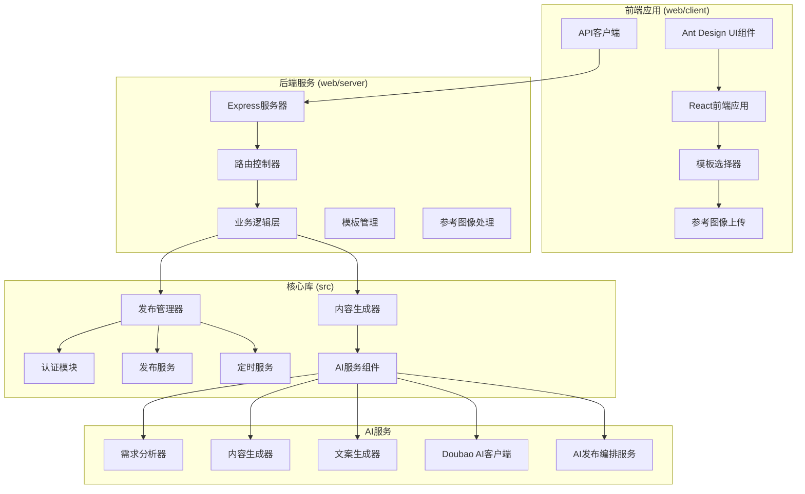

**图表来源**
- [src/index.ts:29-67](file://src/index.ts#L29-L67)
- [web/server/src/index.ts:11-55](file://web/server/src/index.ts#L11-L55)

**章节来源**
- [package.json:1-38](file://package.json#L1-L38)
- [src/index.ts:1-248](file://src/index.ts#L1-L248)

## 核心组件

### 发布管理器 (ClawPublisher)

ClawPublisher是系统的核心入口类，提供了统一的对外接口，负责协调各个子系统的协作。

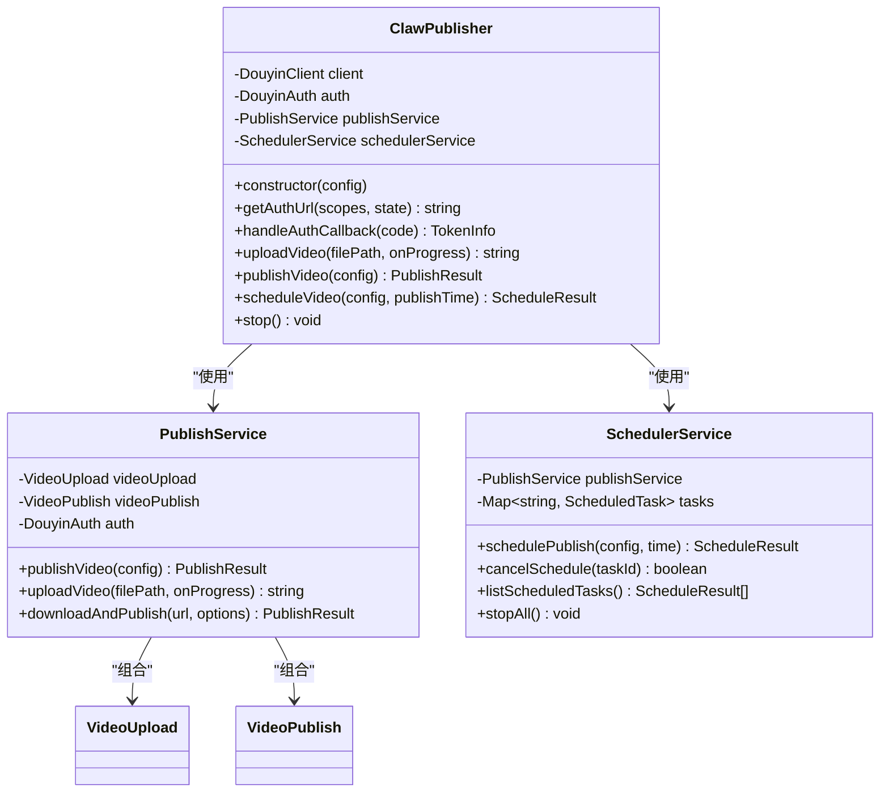

**图表来源**
- [src/index.ts:29-67](file://src/index.ts#L29-L67)
- [src/services/publish-service.ts:22-31](file://src/services/publish-service.ts#L22-L31)
- [src/services/scheduler-service.ts:23-29](file://src/services/scheduler-service.ts#L23-L29)

### AI服务组件

系统集成了多个AI服务，包括需求分析、内容生成和文案创作，其中Doubao AI客户端已更新为任务驱动架构：

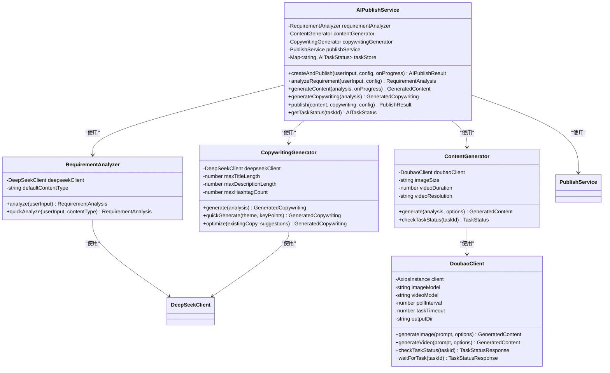

**图表来源**
- [src/services/ai/requirement-analyzer.ts:25-34](file://src/services/ai/requirement-analyzer.ts#L25-L34)
- [src/services/ai/content-generator.ts:38-54](file://src/services/ai/content-generator.ts#L38-L54)
- [src/services/ai/copywriting-generator.ts:30-47](file://src/services/ai/copywriting-generator.ts#L30-L47)
- [src/api/ai/doubao-client.ts:85-123](file://src/api/ai/doubao-client.ts#L85-L123)
- [src/services/ai-publish-service.ts:43-73](file://src/services/ai-publish-service.ts#L43-L73)

**章节来源**
- [src/index.ts:29-244](file://src/index.ts#L29-L244)
- [src/services/ai/requirement-analyzer.ts:1-128](file://src/services/ai/requirement-analyzer.ts#L1-L128)
- [src/services/ai/content-generator.ts:1-229](file://src/services/ai/content-generator.ts#L1-L229)
- [src/services/ai/copywriting-generator.ts:1-194](file://src/services/ai/copywriting-generator.ts#L1-L194)
- [src/api/ai/doubao-client.ts:1-362](file://src/api/ai/doubao-client.ts#L1-L362)
- [src/services/ai-publish-service.ts:1-358](file://src/services/ai-publish-service.ts#L1-L358)

## 架构概览

系统采用分层架构设计，实现了清晰的关注点分离，现已支持任务驱动的异步处理和参考图像功能：

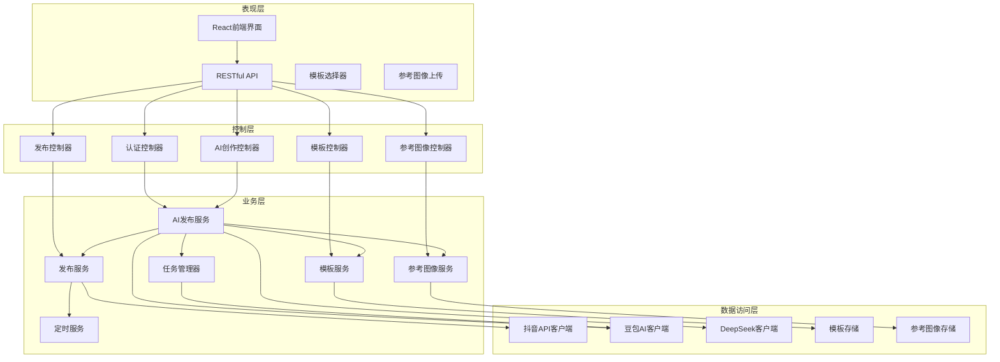

**图表来源**
- [web/server/src/routes/ai.ts:14-58](file://web/server/src/routes/ai.ts#L14-L58)
- [src/services/publish-service.ts:27-31](file://src/services/publish-service.ts#L27-L31)
- [src/services/scheduler-service.ts:27-29](file://src/services/scheduler-service.ts#L27-L29)
- [src/services/ai-publish-service.ts:43-73](file://src/services/ai-publish-service.ts#L43-L73)

**章节来源**
- [web/server/src/index.ts:1-55](file://web/server/src/index.ts#L1-L55)
- [web/server/src/routes/ai.ts:1-323](file://web/server/src/routes/ai.ts#L1-L323)

## 详细组件分析

### 认证系统

认证系统基于OAuth 2.0协议，支持授权码模式和刷新令牌机制：

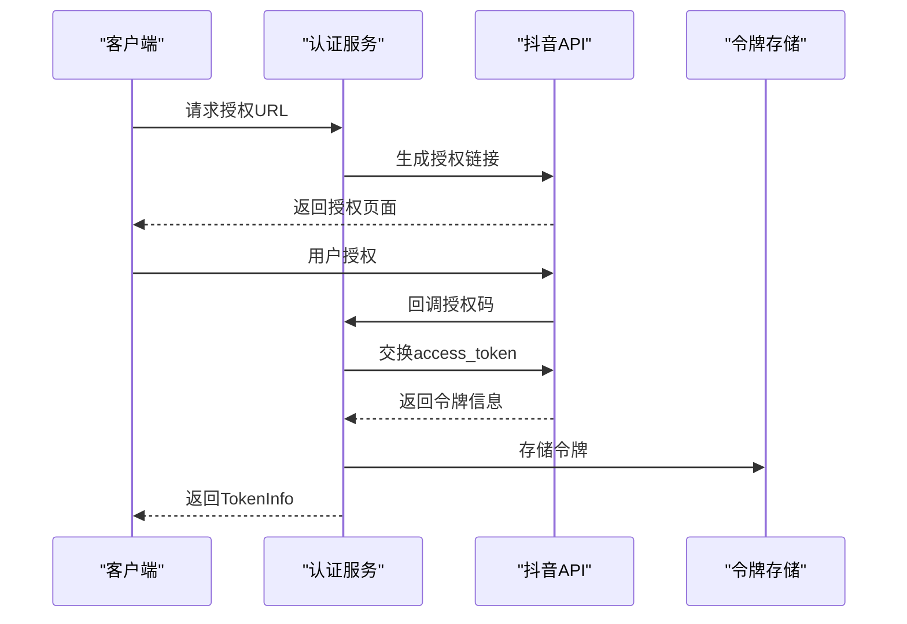

**图表来源**
- [src/api/auth.ts:45-91](file://src/api/auth.ts#L45-L91)
- [src/api/auth.ts:98-127](file://src/api/auth.ts#L98-L127)

认证系统的关键特性：
- 支持多种OAuth作用域
- 自动令牌刷新机制
- 令牌有效期检查
- 安全的状态参数验证

**章节来源**
- [src/api/auth.ts:1-190](file://src/api/auth.ts#L1-L190)

### 发布流程

发布服务实现了完整的视频发布流程，包括上传、验证和发布三个阶段：

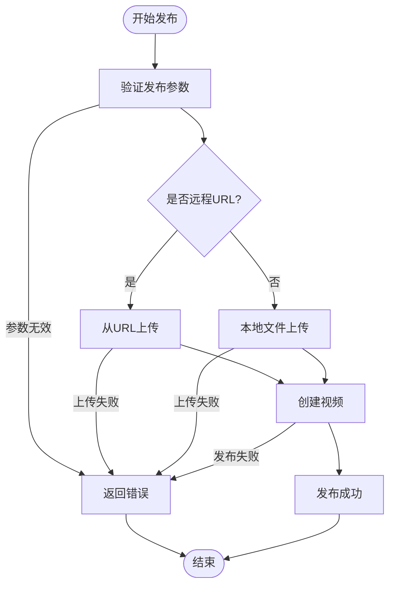

**图表来源**
- [src/services/publish-service.ts:38-80](file://src/services/publish-service.ts#L38-L80)
- [src/services/publish-service.ts:101-125](file://src/services/publish-service.ts#L101-L125)

发布流程的关键特性：
- 支持本地文件和远程URL两种上传方式
- 自动文件验证和大小检查
- 详细的进度回调机制
- 异常情况下的资源清理

**章节来源**
- [src/services/publish-service.ts:1-228](file://src/services/publish-service.ts#L1-L228)

### 定时发布系统

定时发布系统基于node-cron实现，提供了灵活的任务调度功能：

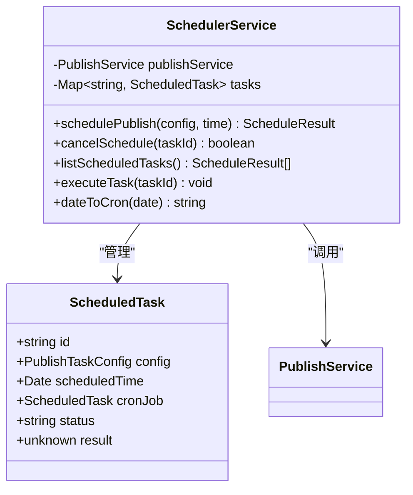

**图表来源**
- [src/services/scheduler-service.ts:23-66](file://src/services/scheduler-service.ts#L23-L66)
- [src/services/scheduler-service.ts:140-162](file://src/services/scheduler-service.ts#L140-L162)

定时系统的核心功能：
- 基于cron表达式的精确调度
- 任务状态跟踪和管理
- 自动任务清理机制
- 全局任务停止功能

**章节来源**
- [src/services/scheduler-service.ts:1-202](file://src/services/scheduler-service.ts#L1-L202)

### AI创作工作流

AI创作系统实现了从需求分析到内容发布的完整自动化流程，现已支持任务驱动的异步处理和参考图像功能：

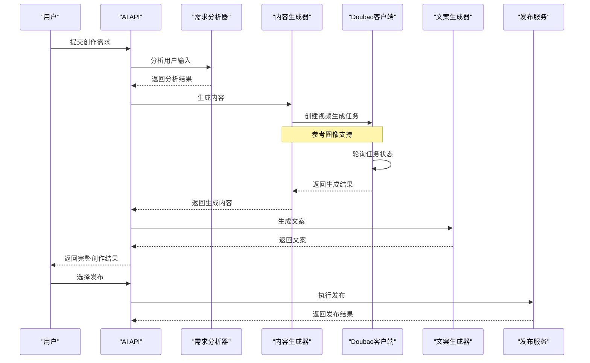

**图表来源**
- [web/server/src/routes/ai.ts:158-191](file://web/server/src/routes/ai.ts#L158-L191)
- [src/services/ai/content-generator.ts:62-102](file://src/services/ai/content-generator.ts#L62-L102)
- [src/services/ai/copywriting-generator.ts:54-74](file://src/services/ai/copywriting-generator.ts#L54-L74)
- [src/api/ai/doubao-client.ts:205-257](file://src/api/ai/doubao-client.ts#L205-L257)

**更新** Doubao AI客户端已从直接生成模式迁移到任务驱动模式，支持异步状态跟踪和更长的超时时间。现在支持参考图像功能，用户可以上传参考图像来指导内容生成。

AI工作流的关键特性：
- 支持自动内容类型选择
- 多阶段进度反馈
- 错误处理和重试机制
- 与发布系统的无缝集成
- 任务状态跟踪和管理
- **新增**：参考图像支持，增强内容生成的个性化定制

**章节来源**
- [web/server/src/routes/ai.ts:1-323](file://web/server/src/routes/ai.ts#L1-L323)
- [src/services/ai/content-generator.ts:1-229](file://src/services/ai/content-generator.ts#L1-L229)
- [src/services/ai/copywriting-generator.ts:1-194](file://src/services/ai/copywriting-generator.ts#L1-L194)
- [src/api/ai/doubao-client.ts:1-362](file://src/api/ai/doubao-client.ts#L1-L362)

### Doubao AI客户端架构

Doubao AI客户端已完全重构为任务驱动架构，支持异步视频生成和状态跟踪：

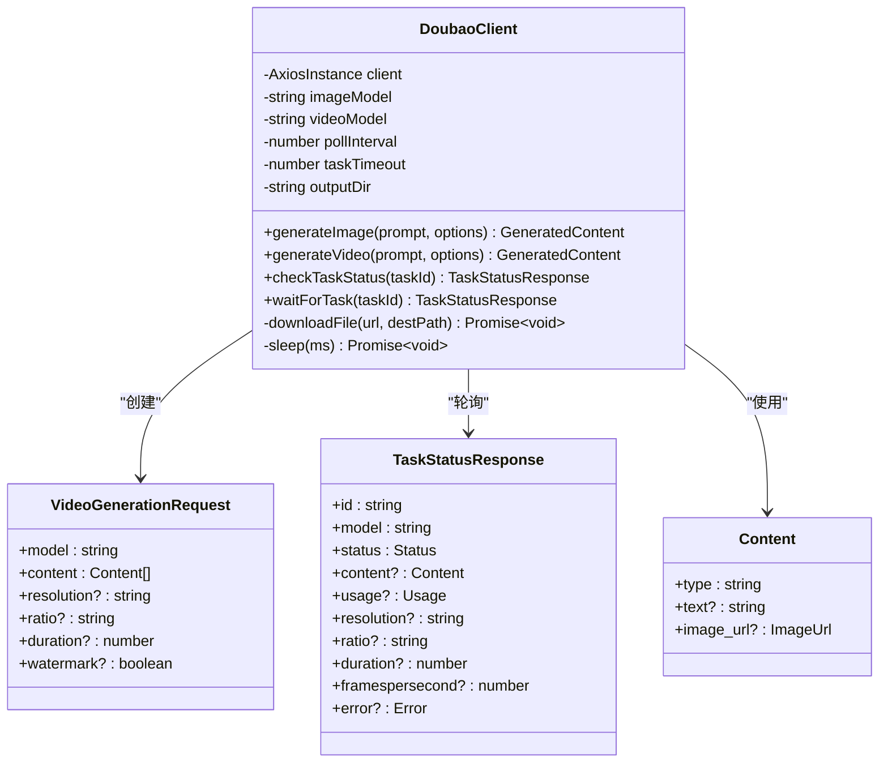

**图表来源**
- [src/api/ai/doubao-client.ts:85-123](file://src/api/ai/doubao-client.ts#L85-L123)
- [src/api/ai/doubao-client.ts:41-80](file://src/api/ai/doubao-client.ts#L41-L80)

**更新** Doubao AI客户端已从/videos/generations端点迁移到/contents/generations/tasks端点，采用内容驱动的请求结构，支持异步任务处理。现在支持参考图像功能，通过在content数组中添加image_url类型的内容来实现。

Doubao客户端的关键变更：
- **API端点迁移**：从/videos/generations到/contents/generations/tasks
- **内容驱动结构**：请求参数改为content数组结构
- **任务驱动模式**：支持异步任务创建和状态轮询
- **超时时间增加**：从30秒增加到5分钟（300秒）
- **增强错误处理**：支持任务状态检查和错误信息追踪
- **新增**：参考图像支持，通过image_url类型的内容实现

**章节来源**
- [src/api/ai/doubao-client.ts:1-362](file://src/api/ai/doubao-client.ts#L1-L362)
- [config/default.ts:50-59](file://config/default.ts#L50-L59)

### 参考图像功能

系统新增了完整的参考图像功能，允许用户上传参考图像来指导AI内容生成：

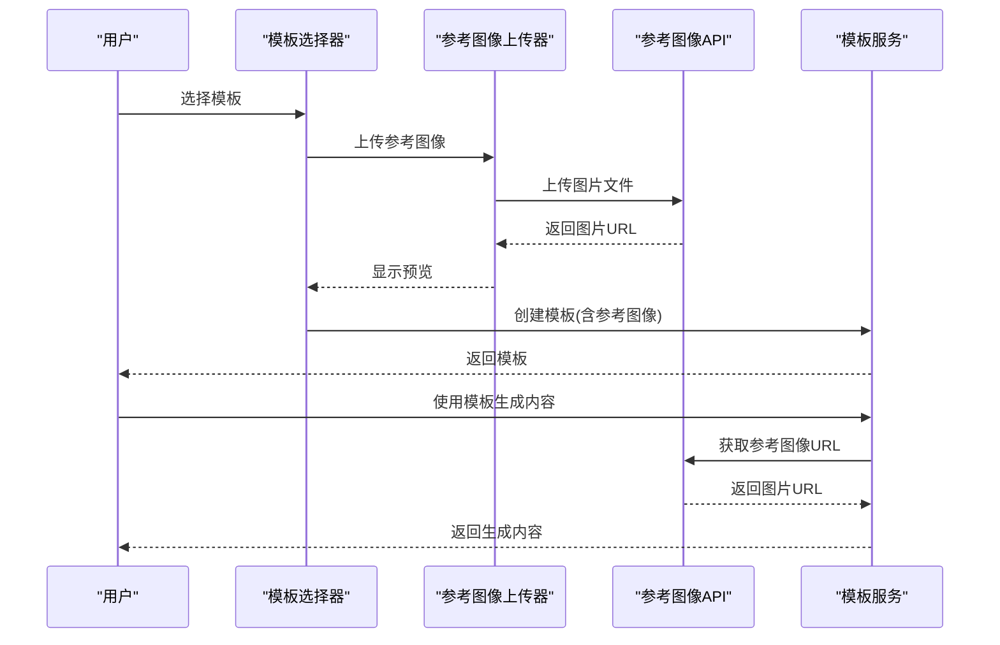

**图表来源**
- [web/client/src/components/ai-creator/TemplateSelector.tsx:194-220](file://web/client/src/components/ai-creator/TemplateSelector.tsx#L194-L220)
- [web/server/src/routes/ai.ts:680-711](file://web/server/src/routes/ai.ts#L680-L711)

参考图像功能的关键特性：
- **前端上传**：支持图片文件上传，限制5MB以内
- **实时预览**：上传后显示参考图像预览
- **模板集成**：参考图像可保存到模板中
- **任务关联**：生成任务时可使用参考图像
- **安全存储**：参考图像存储在/uploads/reference-images目录

**章节来源**
- [web/client/src/components/ai-creator/TemplateSelector.tsx:1-474](file://web/client/src/components/ai-creator/TemplateSelector.tsx#L1-L474)
- [web/server/src/routes/ai.ts:680-711](file://web/server/src/routes/ai.ts#L680-L711)

## 依赖关系分析

系统的主要依赖关系如下：

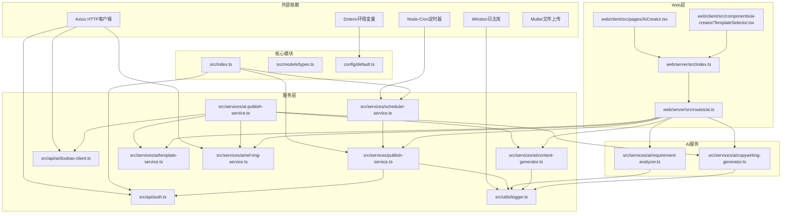

**图表来源**
- [package.json:18-33](file://package.json#L18-L33)
- [src/index.ts:1-20](file://src/index.ts#L1-L20)
- [web/server/src/index.ts:1-10](file://web/server/src/index.ts#L1-L10)

**章节来源**
- [package.json:1-38](file://package.json#L1-L38)
- [config/default.ts:1-70](file://config/default.ts#L1-L70)

## 性能考虑

### 并发处理
- 使用Promise.all实现异步操作的并发执行
- 合理的超时设置避免长时间阻塞
- 进度回调机制提供实时反馈

### 资源管理
- 自动清理临时文件和资源
- 连接池管理和复用
- 内存使用监控和优化

### 缓存策略
- 令牌缓存减少API调用
- 生成内容的本地缓存
- 配置信息的内存缓存

### 任务处理优化
- **异步任务处理**：视频生成采用任务驱动模式，避免长时间阻塞
- **状态轮询优化**：合理的轮询间隔（3秒）平衡响应性和资源消耗
- **超时管理**：5分钟超时时间适应视频生成的较长处理时间
- **错误重试机制**：支持任务状态查询和错误信息追踪
- **参考图像优化**：参考图像上传采用分块传输，支持大文件处理

### 参考图像处理优化
- **文件大小限制**：5MB限制防止过大文件影响性能
- **预览生成**：使用URL.createObjectURL生成预览，避免内存占用
- **并发上传**：支持多模板同时上传参考图像
- **缓存策略**：参考图像URL缓存减少重复上传

## 故障排除指南

### 常见问题及解决方案

**认证失败**
- 检查客户端密钥和密钥是否正确配置
- 验证回调URL是否与平台设置一致
- 确认网络连接和防火墙设置

**内容生成超时**
- **Doubao API变更**：确认已更新到新的/contents/generations/tasks端点
- 检查AI服务的API密钥配置
- 验证网络连接和带宽
- 查看AI服务的配额限制
- **新增**：检查任务状态轮询是否正常工作
- **新增**：验证参考图像URL的有效性

**视频上传失败**
- 确认文件格式和大小限制
- 检查磁盘空间和权限
- 验证网络连接稳定性

**定时任务异常**
- 检查系统时间和时区设置
- 验证cron表达式的正确性
- 查看任务日志和错误信息

**任务驱动模式问题**
- **新增**：确认任务ID格式正确
- **新增**：检查任务状态轮询间隔设置
- **新增**：验证超时时间配置（5分钟）
- **新增**：查看任务错误信息和状态码

**参考图像问题**
- **新增**：检查图片文件格式（仅支持图片）
- **新增**：验证图片大小不超过5MB限制
- **新增**：确认参考图像URL可访问
- **新增**：检查模板中参考图像字段的正确传递
- **新增**：验证参考图像存储目录的写入权限

**章节来源**
- [src/utils/logger.ts:1-61](file://src/utils/logger.ts#L1-L61)
- [src/services/publish-service.ts:165-172](file://src/services/publish-service.ts#L165-L172)
- [src/api/ai/doubao-client.ts:281-305](file://src/api/ai/doubao-client.ts#L281-L305)

## 结论

AI内容生成系统是一个功能完整、架构清晰的现代化内容创作平台。系统通过集成多种AI服务，实现了从需求分析到内容发布的完整自动化流程，大大提高了内容创作的效率和质量。

### 主要优势

1. **技术先进性**：集成了最新的AI技术和抖音平台API
2. **架构合理性**：采用分层架构，职责分离明确
3. **扩展性强**：模块化设计便于功能扩展和维护
4. **用户体验好**：提供直观的前端界面和流畅的操作体验
5. **任务驱动架构**：支持异步处理和状态跟踪，提升系统可靠性
6. **个性化定制**：新增参考图像功能，支持基于参考图的内容生成
7. **模板化管理**：支持模板创建和管理，提高内容生成效率

### 发展方向

1. **AI能力增强**：集成更多AI模型和服务
2. **多平台支持**：扩展到其他社交媒体平台
3. **自动化程度提升**：实现更智能的内容推荐和优化
4. **数据分析能力**：增加内容效果分析和优化建议
5. **任务管理优化**：进一步完善异步任务处理和状态跟踪机制
6. **参考图像优化**：支持更多类型的参考图像和高级定制功能
7. **模板生态建设**：建立模板分享和社区功能

**更新** 系统已成功迁移到Doubao AI的最新API架构，采用任务驱动模式处理视频生成，显著提升了系统的稳定性和可靠性。新增的参考图像功能进一步增强了内容生成的个性化和定制化能力，为内容创作者提供了更强大的工具。

该系统为内容创作者和营销团队提供了一个强大而易用的工具，有助于在数字内容领域保持竞争优势。