# AI内容生成系统

<cite>
**本文档引用的文件**
- [README.md](file://README.md)
- [package.json](file://package.json)
- [src/index.ts](file://src/index.ts)
- [config/default.ts](file://config/default.ts)
- [src/models/types.ts](file://src/models/types.ts)
- [src/api/auth.ts](file://src/api/auth.ts)
- [src/services/publish-service.ts](file://src/services/publish-service.ts)
- [src/services/scheduler-service.ts](file://src/services/scheduler-service.ts)
- [src/utils/logger.ts](file://src/utils/logger.ts)
- [src/services/ai/content-generator.ts](file://src/services/ai/content-generator.ts)
- [src/services/ai/copywriting-generator.ts](file://src/services/ai/copywriting-generator.ts)
- [src/services/ai/requirement-analyzer.ts](file://src/services/ai/requirement-analyzer.ts)
- [web/server/src/index.ts](file://web/server/src/index.ts)
- [web/server/src/routes/ai.ts](file://web/server/src/routes/ai.ts)
- [web/client/src/pages/AICreator.tsx](file://web/client/src/pages/AICreator.tsx)
- [src/api/ai/doubao-client.ts](file://src/api/ai/doubao-client.ts)
- [src/services/ai-publish-service.ts](file://src/services/ai-publish-service.ts)
- [web/client/src/components/ai-creator/TemplateSelector.tsx](file://web/client/src/components/ai-creator/TemplateSelector.tsx)
- [mcp-server/src/index.ts](file://mcp-server/src/index.ts)
- [mcp-server/package.json](file://mcp-server/package.json)
- [mcp-server/README.md](file://mcp-server/README.md)
- [deploy/nginx.conf](file://deploy/nginx.conf)
- [deploy/nginx-ssl.conf](file://deploy/nginx-ssl.conf)
- [web/server/src/services/creation-task-service.ts](file://web/server/src/services/creation-task-service.ts)
- [web/server/src/database/index.ts](file://web/server/src/database/index.ts)
- [src/api/ai/deepseek-client.ts](file://src/api/ai/deepseek-client.ts)
- [web/server/src/services/system-config-service.ts](file://web/server/src/services/system-config-service.ts)
- [web/server/src/services/app-config-service.ts](file://web/server/src/services/app-config-service.ts)
- [web/server/src/services/system-config-service.ts](file://web/server/src/services/system-config-service.ts)
- [web/server/src/routes/system.ts](file://web/server/src/routes/system.ts)
- [web/client/src/pages/SystemConfig.tsx](file://web/client/src/pages/SystemConfig.tsx)
</cite>

## 更新摘要
**变更内容**
- 新增DeepSeek客户端的AI营销增强功能：营销潜力评估、内容钩子生成、情感触发器分析
- 新增动态环境变量加载和运行时配置更新能力
- 新增营销数据分析和统计功能
- 新增情感触发词和内容钩子的前端展示支持

## 目录
1. [项目概述](#项目概述)
2. [项目结构](#项目结构)
3. [核心组件](#核心组件)
4. [架构概览](#架构概览)
5. [详细组件分析](#详细组件分析)
6. [MCP服务器集成](#mcp服务器集成)
7. [任务持久化系统](#任务持久化系统)
8. [静态文件服务](#静态文件服务)
9. [AI营销增强功能](#ai营销增强功能)
10. [动态配置管理系统](#动态配置管理系统)
11. [依赖关系分析](#依赖关系分析)
12. [性能考虑](#性能考虑)
13. [故障排除指南](#故障排除指南)
14. [结论](#结论)

## 项目概述

AI内容生成系统是一个基于抖音（TikTok）平台的智能内容创作和发布管理系统。该系统集成了AI技术，能够自动分析用户需求、生成图片和视频内容，并创建推广文案，最终实现内容的自动化发布。

### 主要特性

- **AI智能创作**：支持需求分析、内容生成、文案创作的完整工作流
- **多平台支持**：基于抖音开放平台API，支持视频上传和发布
- **定时发布**：提供cron表达式的定时发布功能
- **前后端分离**：采用React前端和Node.js后端架构
- **企业级配置**：支持环境变量配置和多种AI服务集成
- **任务驱动架构**：支持异步任务处理和状态跟踪
- **参考图像支持**：新增参考图像功能，支持基于参考图的内容生成
- **MCP协议支持**：新增Model Context Protocol接口，支持外部AI平台集成
- **任务持久化**：支持跨重启的任务状态保持和历史记录管理
- **静态文件服务**：本地/generated目录提供AI生成内容的静态访问
- **AI营销增强**：新增DeepSeek客户端的营销分析能力，包括情感触发器分析和内容钩子生成
- **动态配置管理**：支持运行时配置更新和动态环境变量加载
- **营销数据分析**：提供内容效果分析和统计数据展示

**章节来源**
- [README.md:1-152](file://README.md#L1-L152)

## 项目结构

系统采用模块化的项目结构，主要分为以下几个核心部分：

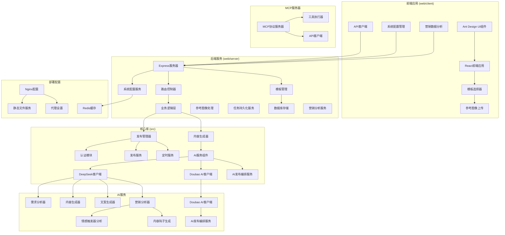

**图表来源**
- [src/index.ts:29-67](file://src/index.ts#L29-L67)
- [web/server/src/index.ts:11-55](file://web/server/src/index.ts#L11-L55)
- [mcp-server/src/index.ts:1-365](file://mcp-server/src/index.ts#L1-365)

**章节来源**
- [package.json:1-38](file://package.json#L1-L38)
- [src/index.ts:1-248](file://src/index.ts#L1-L248)

## 核心组件

### 发布管理器 (ClawPublisher)

ClawPublisher是系统的核心入口类，提供了统一的对外接口，负责协调各个子系统的协作。

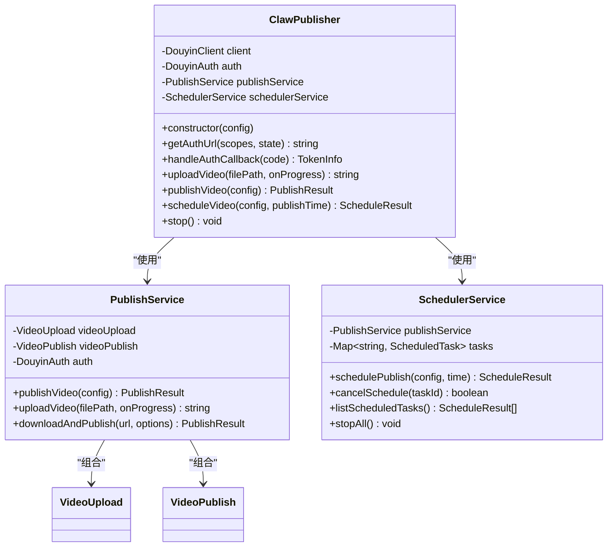

**图表来源**
- [src/index.ts:29-67](file://src/index.ts#L29-L67)
- [src/services/publish-service.ts:22-31](file://src/services/publish-service.ts#L22-L31)
- [src/services/scheduler-service.ts:23-29](file://src/services/scheduler-service.ts#L23-L29)

### AI服务组件

系统集成了多个AI服务，包括需求分析、内容生成和文案创作，其中Doubao AI客户端已更新为任务驱动架构：

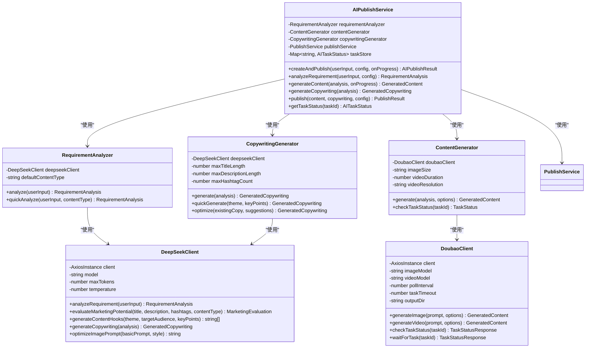

**图表来源**
- [src/services/ai/requirement-analyzer.ts:25-34](file://src/services/ai/requirement-analyzer.ts#L25-L34)
- [src/services/ai/content-generator.ts:38-54](file://src/services/ai/content-generator.ts#L38-L54)
- [src/services/ai/copywriting-generator.ts:30-47](file://src/services/ai/copywriting-generator.ts#L30-L47)
- [src/api/ai/doubao-client.ts:85-123](file://src/api/ai/doubao-client.ts#L85-L123)
- [src/services/ai-publish-service.ts:43-73](file://src/services/ai-publish-service.ts#L43-L73)

**章节来源**
- [src/index.ts:29-244](file://src/index.ts#L29-L244)
- [src/services/ai/requirement-analyzer.ts:1-128](file://src/services/ai/requirement-analyzer.ts#L1-L128)
- [src/services/ai/content-generator.ts:1-229](file://src/services/ai/content-generator.ts#L1-L229)
- [src/services/ai/copywriting-generator.ts:1-194](file://src/services/ai/copywriting-generator.ts#L1-L194)
- [src/api/ai/doubao-client.ts:1-362](file://src/api/ai/doubao-client.ts#L1-L362)
- [src/services/ai-publish-service.ts:1-358](file://src/services/ai-publish-service.ts#L1-L358)

## 架构概览

系统采用分层架构设计，实现了清晰的关注点分离，现已支持任务驱动的异步处理、参考图像功能、MCP协议集成和AI营销增强功能：

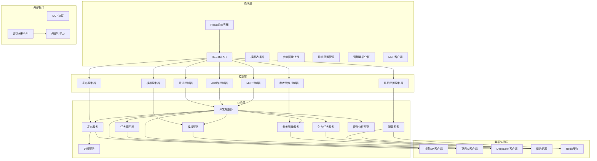

**图表来源**
- [web/server/src/routes/ai.ts:14-58](file://web/server/src/routes/ai.ts#L14-L58)
- [src/services/publish-service.ts:27-31](file://src/services/publish-service.ts#L27-L31)
- [src/services/scheduler-service.ts:27-29](file://src/services/scheduler-service.ts#L27-L29)
- [src/services/ai-publish-service.ts:43-73](file://src/services/ai-publish-service.ts#L43-L73)
- [mcp-server/src/index.ts:24-173](file://mcp-server/src/index.ts#L24-L173)

**章节来源**
- [web/server/src/index.ts:1-55](file://web/server/src/index.ts#L1-L55)
- [web/server/src/routes/ai.ts:1-323](file://web/server/src/routes/ai.ts#L1-L323)

## 详细组件分析

### 认证系统

认证系统基于OAuth 2.0协议，支持授权码模式和刷新令牌机制：

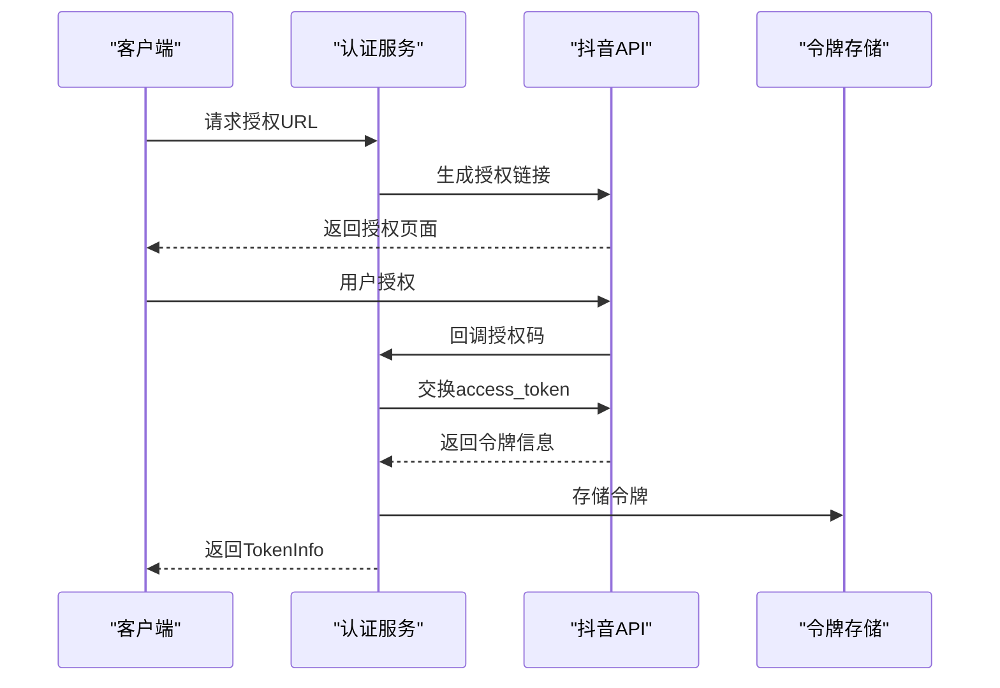

**图表来源**
- [src/api/auth.ts:45-91](file://src/api/auth.ts#L45-L91)
- [src/api/auth.ts:98-127](file://src/api/auth.ts#L98-L127)

认证系统的关键特性：
- 支持多种OAuth作用域
- 自动令牌刷新机制
- 令牌有效期检查
- 安全的状态参数验证

**章节来源**
- [src/api/auth.ts:1-190](file://src/api/auth.ts#L1-L190)

### 发布流程

发布服务实现了完整的视频发布流程，包括上传、验证和发布三个阶段：

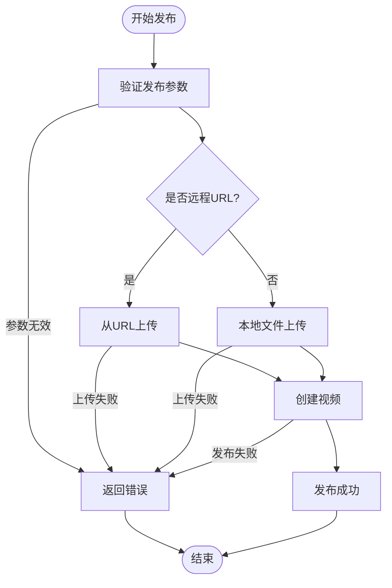

**图表来源**
- [src/services/publish-service.ts:38-80](file://src/services/publish-service.ts#L38-L80)
- [src/services/publish-service.ts:101-125](file://src/services/publish-service.ts#L101-L125)

发布流程的关键特性：
- 支持本地文件和远程URL两种上传方式
- 自动文件验证和大小检查
- 详细的进度回调机制
- 异常情况下的资源清理

**章节来源**
- [src/services/publish-service.ts:1-228](file://src/services/publish-service.ts#L1-L228)

### 定时发布系统

定时发布系统基于node-cron实现，提供了灵活的任务调度功能：

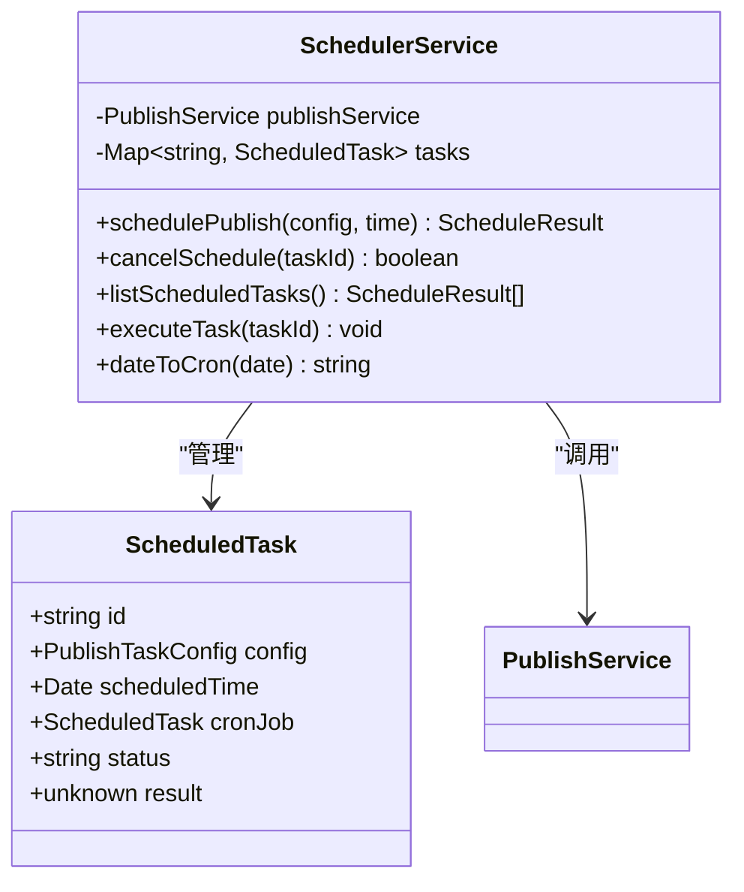

**图表来源**
- [src/services/scheduler-service.ts:23-66](file://src/services/scheduler-service.ts#L23-L66)
- [src/services/scheduler-service.ts:140-162](file://src/services/scheduler-service.ts#L140-L162)

定时系统的核心功能：
- 基于cron表达式的精确调度
- 任务状态跟踪和管理
- 自动任务清理机制
- 全局任务停止功能

**章节来源**
- [src/services/scheduler-service.ts:1-202](file://src/services/scheduler-service.ts#L1-L202)

### AI创作工作流

AI创作系统实现了从需求分析到内容发布的完整自动化流程，现已支持任务驱动的异步处理、参考图像功能、MCP协议集成和AI营销增强功能：

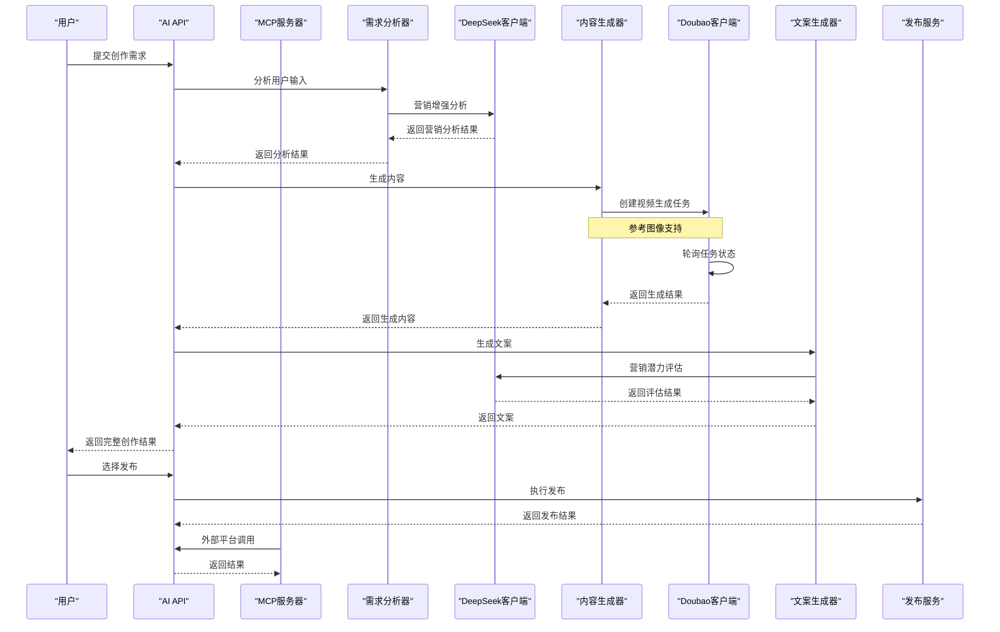

**图表来源**
- [web/server/src/routes/ai.ts:158-191](file://web/server/src/routes/ai.ts#L158-L191)
- [src/services/ai/content-generator.ts:62-102](file://src/services/ai/content-generator.ts#L62-L102)
- [src/services/ai/copywriting-generator.ts:54-74](file://src/services/ai/copywriting-generator.ts#L54-L74)
- [src/api/ai/doubao-client.ts:205-257](file://src/api/ai/doubao-client.ts#L205-L257)
- [mcp-server/src/index.ts:176-322](file://mcp-server/src/index.ts#L176-L322)

**更新** Doubao AI客户端已从直接生成模式迁移到任务驱动模式，支持异步状态跟踪和更长的超时时间。现在支持参考图像功能，用户可以上传参考图像来指导内容生成。MCP服务器提供外部AI平台的统一接口，支持任务持久化和跨重启状态保持。新增的DeepSeek客户端提供AI营销增强功能，包括营销潜力评估、情感触发器分析和内容钩子生成。

AI工作流的关键特性：
- 支持自动内容类型选择
- 多阶段进度反馈
- 错误处理和重试机制
- 与发布系统的无缝集成
- 任务状态跟踪和管理
- **新增**：参考图像支持，增强内容生成的个性化定制
- **新增**：MCP协议支持，外部平台可通过统一接口调用
- **新增**：任务持久化，支持跨重启的任务状态保持
- **新增**：AI营销增强，提供营销效果分析和优化建议

**章节来源**
- [web/server/src/routes/ai.ts:1-323](file://web/server/src/routes/ai.ts#L1-L323)
- [src/services/ai/content-generator.ts:1-229](file://src/services/ai/content-generator.ts#L1-L229)
- [src/services/ai/copywriting-generator.ts:1-194](file://src/services/ai/copywriting-generator.ts#L1-L194)
- [src/api/ai/doubao-client.ts:1-362](file://src/api/ai/doubao-client.ts#L1-L362)
- [mcp-server/src/index.ts:1-365](file://mcp-server/src/index.ts#L1-L365)

### Doubao AI客户端架构

Doubao AI客户端已完全重构为任务驱动架构，支持异步视频生成和状态跟踪：

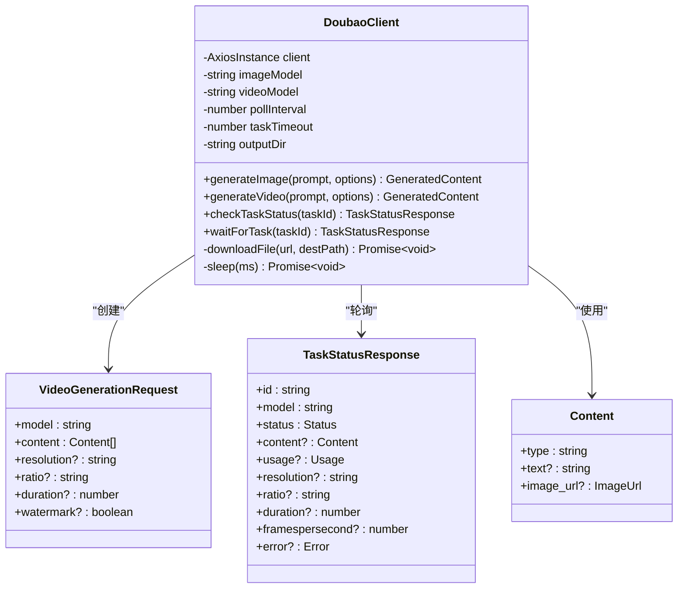

**图表来源**
- [src/api/ai/doubao-client.ts:85-123](file://src/api/ai/doubao-client.ts#L85-L123)
- [src/api/ai/doubao-client.ts:41-80](file://src/api/ai/doubao-client.ts#L41-L80)

**更新** Doubao AI客户端已从/videos/generations端点迁移到/contents/generations/tasks端点，采用内容驱动的请求结构，支持异步任务处理。现在支持参考图像功能，通过在content数组中添加image_url类型的内容来实现。MCP服务器的API客户端超时时间已增加到600秒，支持AI视频生成的长时间处理。

Doubao客户端的关键变更：
- **API端点迁移**：从/videos/generations到/contents/generations/tasks
- **内容驱动结构**：请求参数改为content数组结构
- **任务驱动模式**：支持异步任务创建和状态轮询
- **超时时间增加**：从30秒增加到5分钟（300秒）
- **增强错误处理**：支持任务状态检查和错误信息追踪
- **新增**：参考图像支持，通过image_url类型的内容实现
- **新增**：MCP服务器支持，提供外部平台统一接口

**章节来源**
- [src/api/ai/doubao-client.ts:1-362](file://src/api/ai/doubao-client.ts#L1-L362)
- [config/default.ts:50-59](file://config/default.ts#L50-L59)
- [mcp-server/src/index.ts:15-21](file://mcp-server/src/index.ts#L15-L21)

### 参考图像功能

系统新增了完整的参考图像功能，允许用户上传参考图像来指导AI内容生成：

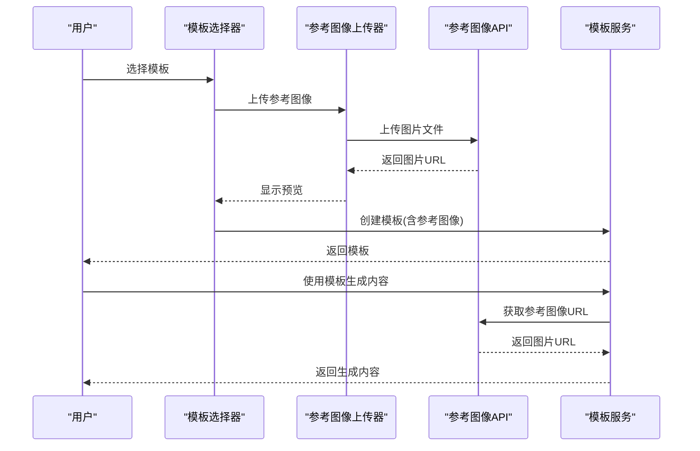

**图表来源**
- [web/client/src/components/ai-creator/TemplateSelector.tsx:194-220](file://web/client/src/components/ai-creator/TemplateSelector.tsx#L194-L220)
- [web/server/src/routes/ai.ts:680-711](file://web/server/src/routes/ai.ts#L680-L711)

参考图像功能的关键特性：
- **前端上传**：支持图片文件上传，限制5MB以内
- **实时预览**：上传后显示参考图像预览
- **模板集成**：参考图像可保存到模板中
- **任务关联**：生成任务时可使用参考图像
- **安全存储**：参考图像存储在/uploads/reference-images目录

**章节来源**
- [web/client/src/components/ai-creator/TemplateSelector.tsx:1-474](file://web/client/src/components/ai-creator/TemplateSelector.tsx#L1-L474)
- [web/server/src/routes/ai.ts:680-711](file://web/server/src/routes/ai.ts#L680-L711)

## MCP服务器集成

### MCP协议概述

MCP（Model Context Protocol）服务器为外部AI平台提供统一的接口，支持ClawOperations的所有核心功能：

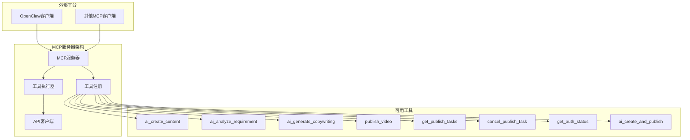

**图表来源**
- [mcp-server/src/index.ts:24-173](file://mcp-server/src/index.ts#L24-L173)
- [mcp-server/src/index.ts:176-322](file://mcp-server/src/index.ts#L176-L322)

### MCP服务器配置

MCP服务器具有以下关键配置特点：

- **超时设置**：API客户端超时时间为600秒（10分钟），支持AI视频生成的长时间处理
- **工具注册**：提供8个核心工具，覆盖AI创作、发布、任务管理等功能
- **环境配置**：通过CLAWOPS_API_URL环境变量配置后端API地址
- **进程通信**：使用StdioServerTransport进行标准输入输出通信

**章节来源**
- [mcp-server/src/index.ts:1-365](file://mcp-server/src/index.ts#L1-L365)
- [mcp-server/package.json:1-22](file://mcp-server/package.json#L1-L22)
- [mcp-server/README.md:1-83](file://mcp-server/README.md#L1-L83)

## 任务持久化系统

### 数据库架构

系统采用低数据库（lowdb）实现任务持久化，支持草稿、历史记录和模板的完整管理：

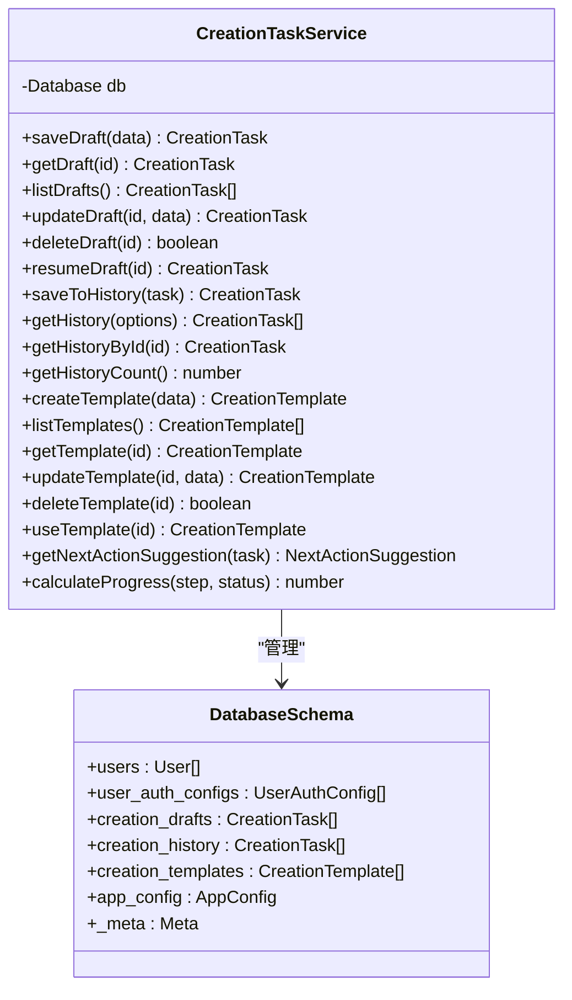

**图表来源**
- [web/server/src/services/creation-task-service.ts:31-388](file://web/server/src/services/creation-task-service.ts#L31-L388)
- [web/server/src/database/index.ts:8-36](file://web/server/src/database/index.ts#L8-L36)

### 任务状态管理

任务持久化系统支持完整的生命周期管理：

- **草稿管理**：支持草稿的创建、更新、删除和恢复
- **历史记录**：自动保存已完成和失败的任务历史
- **模板系统**：支持模板的创建、使用和管理
- **进度跟踪**：计算任务执行进度百分比
- **下一步建议**：根据任务状态提供智能建议

**章节来源**
- [web/server/src/services/creation-task-service.ts:1-388](file://web/server/src/services/creation-task-service.ts#L1-L388)
- [web/server/src/database/index.ts:1-126](file://web/server/src/database/index.ts#L1-L126)

## 静态文件服务

### Nginx配置优化

系统通过Nginx配置实现了高效的静态文件服务，特别针对AI生成内容进行了优化：

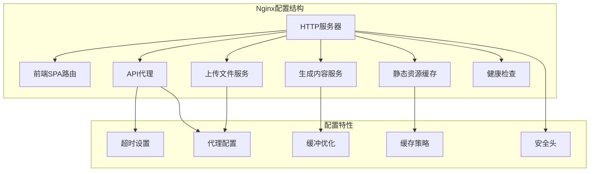

**图表来源**
- [deploy/nginx.conf:4-70](file://deploy/nginx.conf#L4-L70)
- [deploy/nginx.conf:42-48](file://deploy/nginx.conf#L42-L48)

### 生成内容服务

专门针对AI生成的视频和图片文件提供了优化的静态文件服务：

- **/generated/** 路径代理到本地生成目录
- **禁用缓冲**：确保大文件的流式传输
- **直连访问**：绕过应用层，直接提供静态文件
- **支持断点续传**：优化大文件下载体验

**章节来源**
- [deploy/nginx.conf:41-48](file://deploy/nginx.conf#L41-L48)
- [deploy/nginx-ssl.conf:50-64](file://deploy/nginx-ssl.conf#L50-L64)

## AI营销增强功能

### DeepSeek客户端营销分析

系统新增了完整的AI营销增强功能，通过DeepSeek客户端提供专业的营销分析能力：

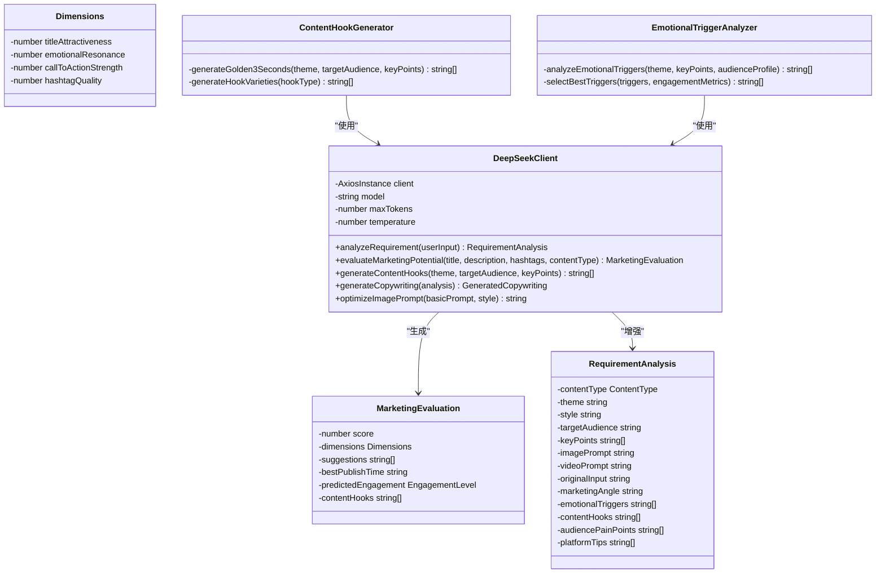

**图表来源**
- [src/api/ai/deepseek-client.ts:341-425](file://src/api/ai/deepseek-client.ts#L341-L425)
- [src/api/ai/deepseek-client.ts:427-481](file://src/api/ai/deepseek-client.ts#L427-L481)
- [src/models/types.ts:288-310](file://src/models/types.ts#L288-L310)
- [src/models/types.ts:209-238](file://src/models/types.ts#L209-L238)

### 营销潜力评估

营销潜力评估功能提供全面的内容效果分析，帮助用户优化内容策略：

- **综合评分**：基于4个维度的加权计算，0-100分制
- **维度分析**：标题吸引力、情感共鸣、行动引导力、话题质量
- **改进建议**：3条具体可执行的优化建议
- **发布时间建议**：基于数据分析的最佳发布时间段
- **预测互动等级**：high/medium/low三个等级

### 内容钩子生成

基于抖音黄金3秒法则的内容钩子生成功能：

- **钩子类型**：痛点式、数字式、反转式、提问式、宣言式
- **数量控制**：生成5个高质量的开场钩子
- **长度规范**：每个钩子控制在20-30字之间
- **适用场景**：适合作为短视频开场台词

### 情感触发词分析

情感触发词分析功能识别能够引发用户情感共鸣的关键词：

- **触发词类型**：限时、独家、口感炸裂、治愈、记忆中的味道等
- **选择标准**：基于情感强度和用户共鸣度
- **应用场景**：标题、描述、话题标签的优化

**章节来源**
- [src/api/ai/deepseek-client.ts:1-485](file://src/api/ai/deepseek-client.ts#L1-L485)
- [src/models/types.ts:200-400](file://src/models/types.ts#L200-L400)
- [web/server/src/routes/ai.ts:1174-1244](file://web/server/src/routes/ai.ts#L1174-L1244)

## 动态配置管理系统

### 运行时配置更新

系统实现了完整的动态配置管理能力，支持运行时配置更新和环境变量同步：

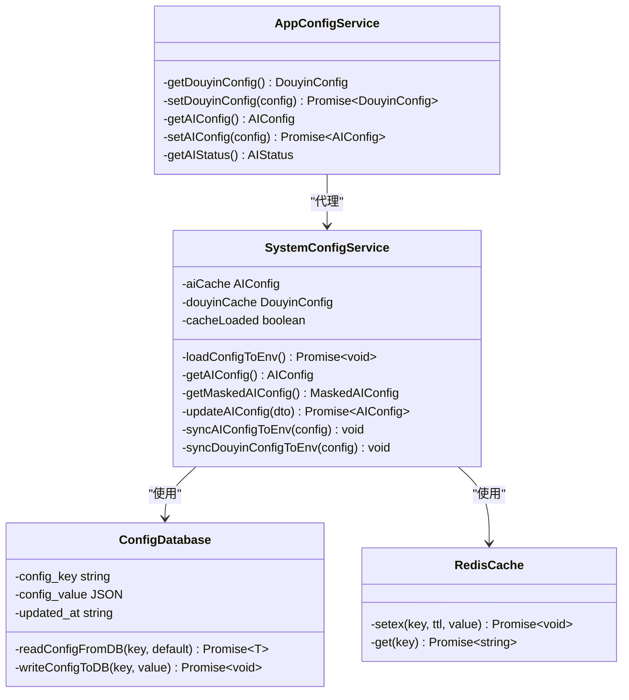

**图表来源**
- [web/server/src/services/system-config-service.ts:133-279](file://web/server/src/services/system-config-service.ts#L133-L279)
- [web/server/src/services/app-config-service.ts:13-87](file://web/server/src/services/app-config-service.ts#L13-L87)

### 配置更新流程

动态配置更新支持以下流程：

- **配置读取**：启动时从数据库加载到内存缓存
- **实时同步**：配置更新时同步到Redis缓存
- **环境变量**：配置变化时更新进程内环境变量
- **服务重启**：配置更新后重置AI服务实例
- **前端同步**：配置更新后通知前端界面

### 配置类型支持

系统支持多种配置类型的动态更新：

- **AI配置**：DeepSeek API Key、基础URL、端点ID等
- **抖音配置**：应用密钥、密钥、回调URL等
- **缓存配置**：Redis连接参数、缓存TTL等
- **系统配置**：数据库连接、日志级别等

**章节来源**
- [web/server/src/services/system-config-service.ts:1-200](file://web/server/src/services/system-config-service.ts#L1-L200)
- [web/server/src/services/app-config-service.ts:1-87](file://web/server/src/services/app-config-service.ts#L1-L87)
- [web/server/src/routes/system.ts:1-143](file://web/server/src/routes/system.ts#L1-L143)

## 依赖关系分析

系统的主要依赖关系如下：

```mermaid
graph TB
subgraph "外部依赖"
Axios[Axios HTTP客户端]
Winston[Winston日志库]
NodeCron[Node-Cron定时器]
Dotenv[Dotenv环境变量]
Multer[Multer文件上传]
LowDB[LowDB数据库]
MCP_SDK[@modelcontextprotocol/sdk]
Redis[Redis缓存]
MySQL[MySQL数据库]
end
subgraph "核心模块"
Index[src/index.ts]
Types[src/models/types.ts]
Config[config/default.ts]
end
subgraph "服务层"
Auth[src/api/auth.ts]
Publish[src/services/publish-service.ts]
Scheduler[src/services/scheduler-service.ts]
Logger[src/utils/logger.ts]
AIPublish[src/services/ai-publish-service.ts]
DoubaoClient[src/api/ai/doubao-client.ts]
ContentGen[src/services/ai/content-generator.ts]
TemplateService[src/services/ai/template-service.ts]
RefImgService[src/services/ai/ref-img-service.ts]
CreationTaskService[web/server/src/services/creation-task-service.ts]
Database[web/server/src/database/index.ts]
DeepSeekClient[src/api/ai/deepseek-client.ts]
SystemConfigService[web/server/src/services/system-config-service.ts]
AppConfigService[web/server/src/services/app-config-service.ts]
MarketingAnalysisService[web/server/src/services/marketing-analysis-service.ts]
end
subgraph "AI服务"
ReqAnalyzer[src/services/ai/requirement-analyzer.ts]
Copywriter[src/services/ai/copywriting-generator.ts]
end
subgraph "Web层"
Server[web/server/src/index.ts]
Routes[web/server/src/routes/ai.ts]
Client[web/client/src/pages/AICreator.tsx]
TemplateSelector[web/client/src/components/ai-creator/TemplateSelector.tsx]
SystemConfig[web/client/src/pages/SystemConfig.tsx]
end
subgraph "MCP层"
MCPIndex[mcp-server/src/index.ts]
MCPPkg[mcp-server/package.json]
end
Axios --> Auth
Axios --> DoubaoClient
Axios --> RefImgService
Axios --> CreationTaskService
Axios --> DeepSeekClient
Axios --> SystemConfigService
Winston --> Logger
NodeCron --> Scheduler
Dotenv --> Config
Index --> Auth
Index --> Publish
Index --> Scheduler
Publish --> Auth
Publish --> Logger
Scheduler --> Publish
AIPublish --> DoubaoClient
AIPublish --> ContentGen
AIPublish --> Copywriter
AIPublish --> TemplateService
AIPublish --> RefImgService
AIPublish --> CreationTaskService
AIPublish --> DeepSeekClient
ReqAnalyzer --> Logger
ContentGen --> Logger
Copywriter --> Logger
Server --> Routes
Routes --> ReqAnalyzer
Routes --> ContentGen
Routes --> Copywriter
Routes --> Publish
Routes --> TemplateService
Routes --> RefImgService
Routes --> CreationTaskService
Routes --> DeepSeekClient
Routes --> SystemConfigService
Client --> Server
TemplateSelector --> Server
SystemConfig --> Server
MCPIndex --> MCP_SDK
MCPIndex --> Axios
MCPIndex --> Server
MCPPkg --> MCP_SDK
MySQL --> Database
Redis --> SystemConfigService
```

**图表来源**
- [package.json:18-33](file://package.json#L18-L33)
- [src/index.ts:1-20](file://src/index.ts#L1-L20)
- [web/server/src/index.ts:1-10](file://web/server/src/index.ts#L1-L10)
- [mcp-server/package.json:12-16](file://mcp-server/package.json#L12-L16)

**章节来源**
- [package.json:1-38](file://package.json#L1-L38)
- [config/default.ts:1-70](file://config/default.ts#L1-L70)

## 性能考虑

### 并发处理
- 使用Promise.all实现异步操作的并发执行
- 合理的超时设置避免长时间阻塞
- 进度回调机制提供实时反馈

### 资源管理
- 自动清理临时文件和资源
- 连接池管理和复用
- 内存使用监控和优化

### 缓存策略
- 令牌缓存减少API调用
- 生成内容的本地缓存
- 配置信息的内存缓存
- Redis缓存加速配置读取

### 任务处理优化
- **异步任务处理**：视频生成采用任务驱动模式，避免长时间阻塞
- **状态轮询优化**：合理的轮询间隔（3秒）平衡响应性和资源消耗
- **超时管理**：5分钟超时时间适应视频生成的较长处理时间
- **错误重试机制**：支持任务状态查询和错误信息追踪
- **参考图像优化**：参考图像上传采用分块传输，支持大文件处理
- **MCP服务器优化**：600秒超时支持长时间AI处理任务
- **任务持久化优化**：低数据库自动保存，支持跨重启状态保持
- **Nginx代理优化**：API代理超时增加到600秒，支持长时间AI处理
- **Redis缓存优化**：配置信息缓存5分钟，减少数据库压力
- **AI营销分析优化**：DeepSeek API调用超时60秒，支持复杂分析任务

### 参考图像处理优化
- **文件大小限制**：5MB限制防止过大文件影响性能
- **预览生成**：使用URL.createObjectURL生成预览，避免内存占用
- **并发上传**：支持多模板同时上传参考图像
- **缓存策略**：参考图像URL缓存减少重复上传

### 静态文件服务优化
- **Nginx缓冲优化**：/generated/路径禁用缓冲，支持大文件流式传输
- **代理超时调整**：API代理超时增加到600秒，支持长时间AI处理
- **静态资源缓存**：7天缓存策略，减少带宽消耗
- **健康检查**：/health端点提供服务状态监控

### AI营销分析优化
- **批量处理**：支持多个任务的并发营销分析
- **缓存机制**：热门内容的营销分析结果缓存
- **降级策略**：API调用失败时提供基础分析结果
- **超时控制**：DeepSeek API调用超时60秒，避免阻塞主线程

### 动态配置管理优化
- **内存缓存**：配置信息存储在内存中，读取速度快
- **Redis缓存**：配置信息同时缓存到Redis，支持多实例共享
- **渐进式更新**：配置更新时逐步替换，避免服务中断
- **回滚机制**：配置更新失败时自动回滚到上一个版本

## 故障排除指南

### 常见问题及解决方案

**认证失败**
- 检查客户端密钥和密钥是否正确配置
- 验证回调URL是否与平台设置一致
- 确认网络连接和防火墙设置

**内容生成超时**
- **Doubao API变更**：确认已更新到新的/contents/generations/tasks端点
- 检查AI服务的API密钥配置
- 验证网络连接和带宽
- 查看AI服务的配额限制
- **新增**：检查任务状态轮询是否正常工作
- **新增**：验证参考图像URL的有效性
- **新增**：确认MCP服务器超时设置（600秒）

**视频上传失败**
- 确认文件格式和大小限制
- 检查磁盘空间和权限
- 验证网络连接稳定性

**定时任务异常**
- 检查系统时间和时区设置
- 验证cron表达式的正确性
- 查看任务日志和错误信息

**任务驱动模式问题**
- **新增**：确认任务ID格式正确
- **新增**：检查任务状态轮询间隔设置
- **新增**：验证超时时间配置（5分钟）
- **新增**：查看任务错误信息和状态码
- **新增**：检查任务持久化数据库状态

**参考图像问题**
- **新增**：检查图片文件格式（仅支持图片）
- **新增**：验证图片大小不超过5MB限制
- **新增**：确认参考图像URL可访问
- **新增**：检查模板中参考图像字段的正确传递
- **新增**：验证参考图像存储目录的写入权限

**MCP服务器问题**
- **新增**：确认CLAWOPS_API_URL环境变量配置正确
- **新增**：检查MCP服务器与后端API的连通性
- **新增**：验证工具调用参数格式
- **新增**：查看MCP服务器日志和错误信息
- **新增**：确认MCP服务器超时设置（600秒）

**静态文件服务问题**
- **新增**：确认Nginx配置中的/generated/路径代理正确
- **新增**：检查生成文件的存储权限
- **新增**：验证文件名编码和特殊字符处理
- **新增**：检查Nginx缓冲配置对大文件的影响
- **新增**：确认API代理超时设置（600秒）

**AI营销分析问题**
- **新增**：检查DeepSeek API Key配置
- **新增**：验证营销分析API的可用性
- **新增**：确认分析参数格式正确
- **新增**：检查Redis缓存连接状态
- **新增**：验证配置更新后的服务重启

**动态配置管理问题**
- **新增**：检查数据库连接状态
- **新增**：验证Redis缓存可用性
- **新增**：确认配置更新权限
- **新增**：检查配置格式有效性
- **新增**：验证服务实例重置机制

**章节来源**
- [src/utils/logger.ts:1-61](file://src/utils/logger.ts#L1-L61)
- [src/services/publish-service.ts:165-172](file://src/services/publish-service.ts#L165-L172)
- [src/api/ai/doubao-client.ts:281-305](file://src/api/ai/doubao-client.ts#L281-L305)
- [mcp-server/src/index.ts:15-21](file://mcp-server/src/index.ts#L15-L21)
- [deploy/nginx.conf:33-35](file://deploy/nginx.conf#L33-L35)

## 结论

AI内容生成系统是一个功能完整、架构清晰的现代化内容创作平台。系统通过集成多种AI服务，实现了从需求分析到内容发布的完整自动化流程，大大提高了内容创作的效率和质量。

### 主要优势

1. **技术先进性**：集成了最新的AI技术和抖音平台API
2. **架构合理性**：采用分层架构，职责分离明确
3. **扩展性强**：模块化设计便于功能扩展和维护
4. **用户体验好**：提供直观的前端界面和流畅的操作体验
5. **任务驱动架构**：支持异步处理和状态跟踪，提升系统可靠性
6. **个性化定制**：新增参考图像功能，支持基于参考图的内容生成
7. **模板化管理**：支持模板创建和管理，提高内容生成效率
8. **MCP协议支持**：为外部AI平台提供统一的集成接口
9. **任务持久化**：支持跨重启的任务状态保持和历史记录管理
10. **静态文件优化**：专门针对AI生成内容的静态文件服务
11. **AI营销增强**：新增DeepSeek客户端的专业营销分析能力
12. **动态配置管理**：支持运行时配置更新和环境变量同步
13. **营销数据分析**：提供内容效果分析和统计数据展示

### 发展方向

1. **AI能力增强**：集成更多AI模型和服务
2. **多平台支持**：扩展到其他社交媒体平台
3. **自动化程度提升**：实现更智能的内容推荐和优化
4. **数据分析能力**：增加内容效果分析和优化建议
5. **任务管理优化**：进一步完善异步任务处理和状态跟踪机制
6. **参考图像优化**：支持更多类型的参考图像和高级定制功能
7. **模板生态建设**：建立模板分享和社区功能
8. **MCP协议扩展**：支持更多外部AI平台和工具集成
9. **持久化系统增强**：优化数据库性能和数据备份策略
10. **静态文件服务优化**：支持CDN和分布式存储方案
11. **营销分析深化**：增加更多维度的营销效果分析
12. **配置管理智能化**：支持配置的自动检测和优化建议
13. **实时协作功能**：支持多人协作和版本管理
14. **移动端支持**：开发移动应用，支持移动端创作和管理

**更新** 系统已成功迁移到Doubao AI的最新API架构，采用任务驱动模式处理视频生成，显著提升了系统的稳定性和可靠性。新增的参考图像功能进一步增强了内容生成的个性化和定制化能力，为内容创作者提供了更强大的工具。MCP服务器的引入为外部AI平台提供了统一的集成接口，任务持久化系统确保了跨重启的任务状态保持，Nginx配置优化为AI生成内容提供了高效的静态文件服务。最重要的更新是新增的AI营销增强功能，通过DeepSeek客户端提供专业的营销分析能力，包括营销潜力评估、情感触发词分析和内容钩子生成，为内容创作者提供了数据驱动的优化建议。动态配置管理系统的引入使得系统支持运行时配置更新，无需重启服务即可应用新的配置，大大提升了系统的灵活性和可维护性。

该系统为内容创作者和营销团队提供了一个强大而易用的工具，有助于在数字内容领域保持竞争优势。