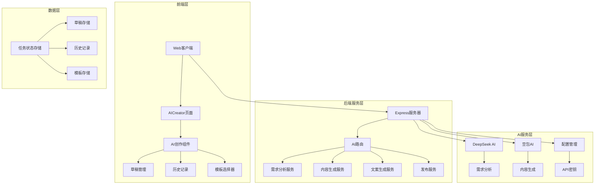
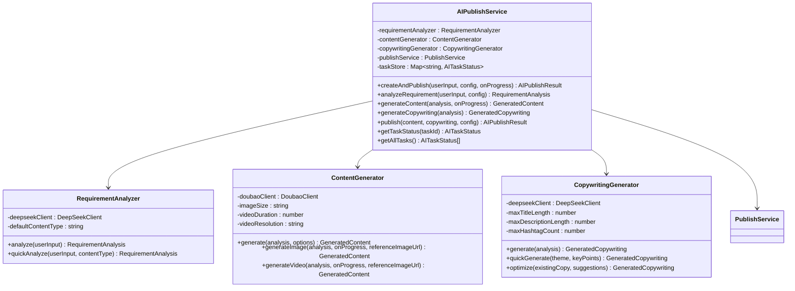
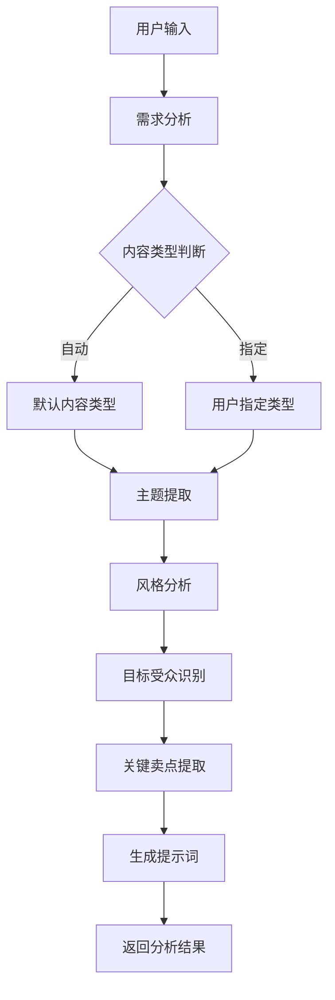
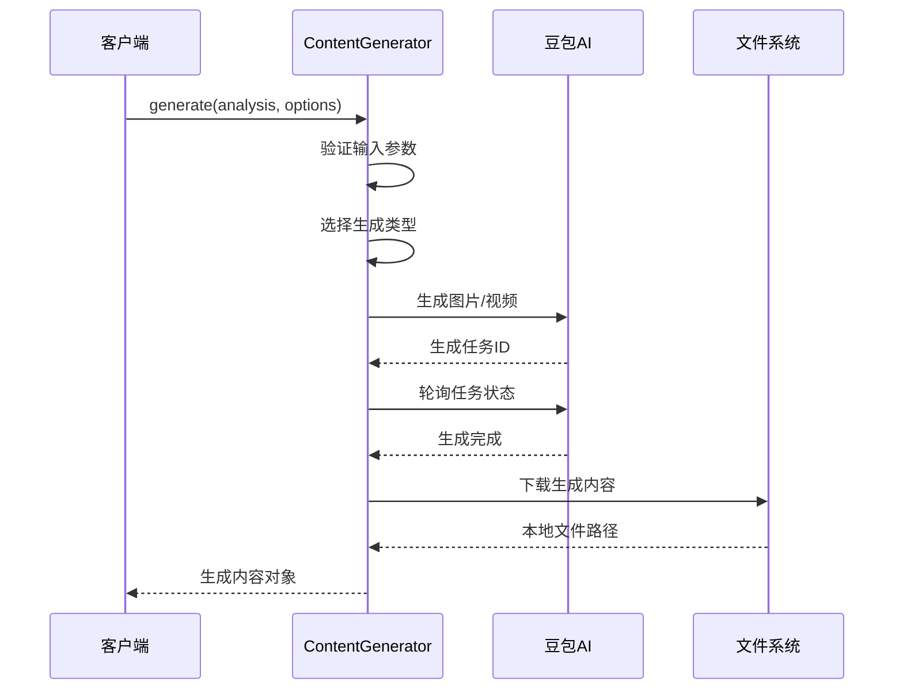
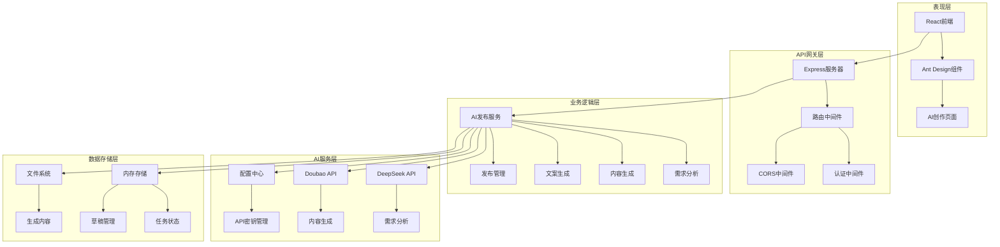
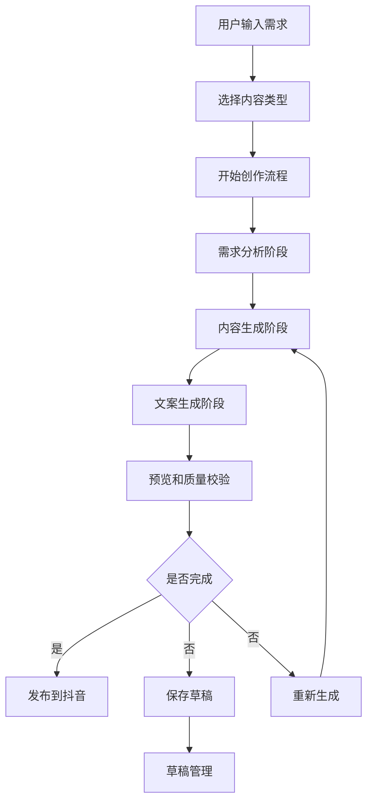
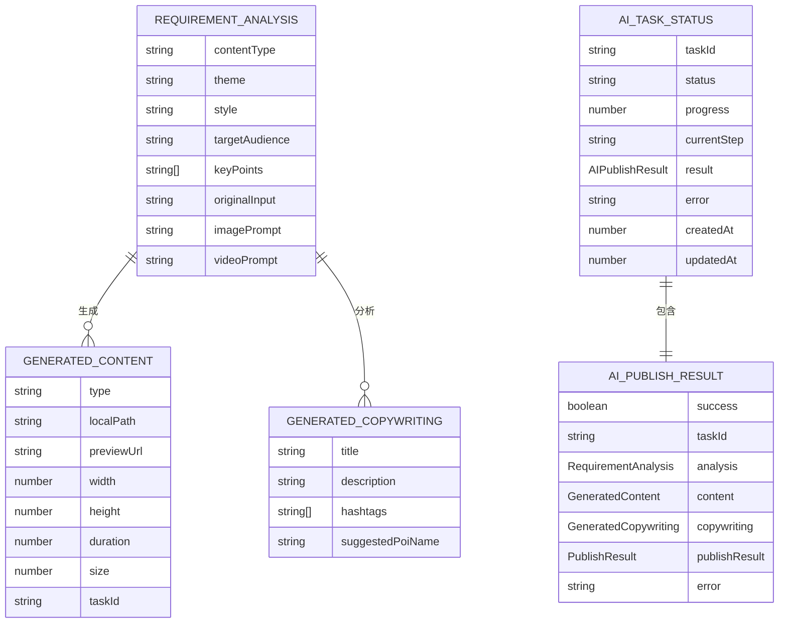
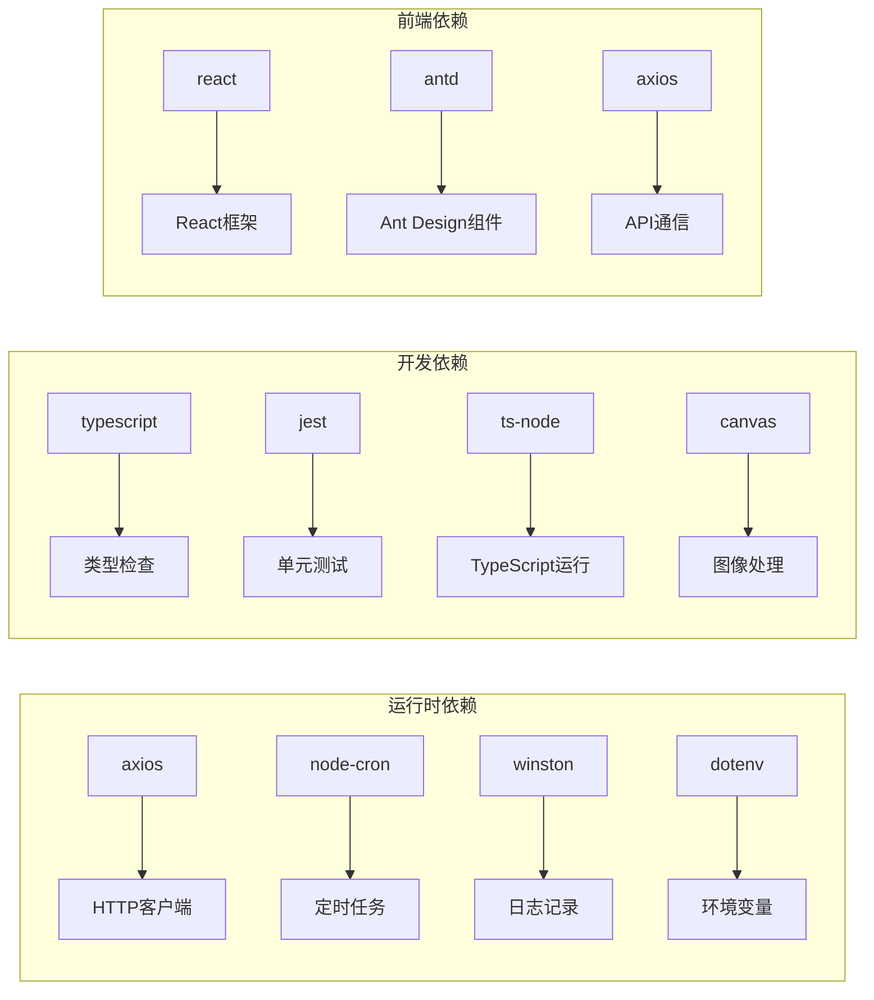
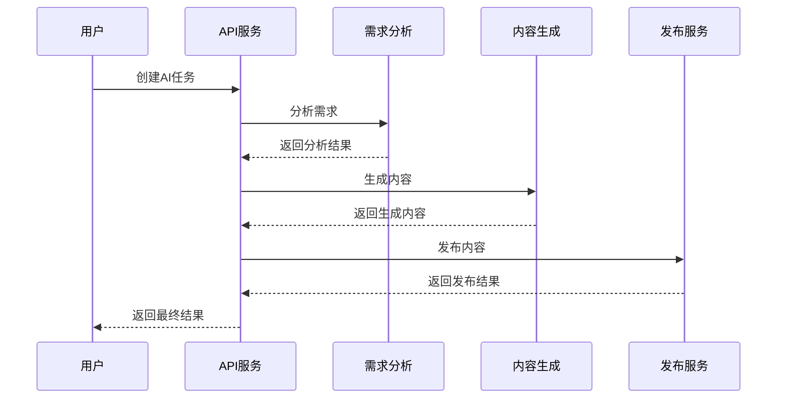
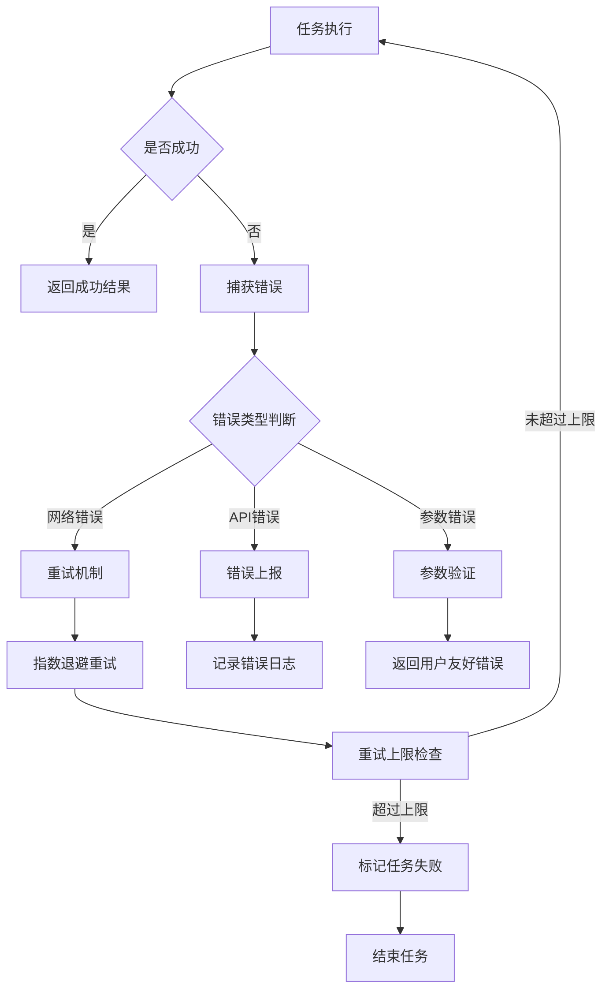

# 图像生成规格提升

<cite>
**本文档引用的文件**
- [src/index.ts](file://src/index.ts)
- [src/models/types.ts](file://src/models/types.ts)
- [src/services/ai/requirement-analyzer.ts](file://src/services/ai/requirement-analyzer.ts)
- [src/services/ai/content-generator.ts](file://src/services/ai/content-generator.ts)
- [src/services/ai/copywriting-generator.ts](file://src/services/ai/copywriting-generator.ts)
- [src/services/ai-publish-service.ts](file://src/services/ai-publish-service.ts)
- [web/server/src/index.ts](file://web/server/src/index.ts)
- [web/server/src/routes/ai.ts](file://web/server/src/routes/ai.ts)
- [web/client/src/pages/AICreator.tsx](file://web/client/src/pages/AICreator.tsx)
- [config/default.ts](file://config/default.ts)
- [package.json](file://package.json)
</cite>

## 目录
1. [简介](#简介)
2. [项目结构](#项目结构)
3. [核心组件](#核心组件)
4. [架构概览](#架构概览)
5. [详细组件分析](#详细组件分析)
6. [依赖关系分析](#依赖关系分析)
7. [性能考虑](#性能考虑)
8. [故障排除指南](#故障排除指南)
9. [结论](#结论)

## 简介

ClawOperations 是一个专为抖音小龙虾营销账号设计的自动化运营系统。该系统集成了AI内容生成技术，能够自动生成高质量的图片和视频内容，并提供完整的发布流程管理。

本项目的重点在于**图像生成规格提升**，通过引入先进的AI模型和优化算法，显著提升了内容生成的质量和效率。系统支持多种内容类型，包括图片和视频，能够根据用户需求自动生成符合平台规范的内容。

## 项目结构

**图表来源**
- [web/client/src/pages/AICreator.tsx:1-715](file://web/client/src/pages/AICreator.tsx#L1-L715)
- [web/server/src/routes/ai.ts:1-800](file://web/server/src/routes/ai.ts#L1-L800)
- [src/services/ai-publish-service.ts:1-377](file://src/services/ai-publish-service.ts#L1-L377)

**章节来源**
- [package.json:1-39](file://package.json#L1-L39)
- [README.md:1-152](file://README.md#L1-L152)

## 核心组件

### AI发布编排服务

AI发布编排服务是整个系统的核心，负责协调各个AI服务组件的工作流程：

**图表来源**
- [src/services/ai-publish-service.ts:43-377](file://src/services/ai-publish-service.ts#L43-L377)
- [src/services/ai/requirement-analyzer.ts:25-128](file://src/services/ai/requirement-analyzer.ts#L25-L128)
- [src/services/ai/content-generator.ts:48-253](file://src/services/ai/content-generator.ts#L48-L253)
- [src/services/ai/copywriting-generator.ts:30-194](file://src/services/ai/copywriting-generator.ts#L30-L194)

### 需求分析服务

需求分析服务负责解析用户输入，提取关键信息并生成内容规格：

**图表来源**
- [src/services/ai/requirement-analyzer.ts:41-98](file://src/services/ai/requirement-analyzer.ts#L41-L98)

### 内容生成服务

内容生成服务支持图片和视频两种类型的AI生成：

**图表来源**
- [src/services/ai/content-generator.ts:72-120](file://src/services/ai/content-generator.ts#L72-L120)
- [src/services/ai/content-generator.ts:125-189](file://src/services/ai/content-generator.ts#L125-L189)

**章节来源**
- [src/services/ai-publish-service.ts:90-226](file://src/services/ai-publish-service.ts#L90-L226)
- [src/services/ai/requirement-analyzer.ts:41-98](file://src/services/ai/requirement-analyzer.ts#L41-L98)
- [src/services/ai/content-generator.ts:72-189](file://src/services/ai/content-generator.ts#L72-L189)

## 架构概览

系统采用分层架构设计，确保各组件职责清晰、耦合度低：

**图表来源**
- [web/server/src/index.ts:1-76](file://web/server/src/index.ts#L1-L76)
- [web/server/src/routes/ai.ts:78-86](file://web/server/src/routes/ai.ts#L78-L86)
- [src/services/ai-publish-service.ts:59-73](file://src/services/ai-publish-service.ts#L59-L73)

## 详细组件分析

### 前端AI创作页面

AI创作页面提供了完整的端到端创作体验：

**图表来源**
- [web/client/src/pages/AICreator.tsx:106-123](file://web/client/src/pages/AICreator.tsx#L106-L123)
- [web/client/src/pages/AICreator.tsx:167-174](file://web/client/src/pages/AICreator.tsx#L167-L174)

### 后端API路由设计

后端API提供了完整的AI创作工作流：

| 路由 | 方法 | 功能描述 | 请求体 | 响应 |
|------|------|----------|--------|------|
| `/api/ai/analyze` | GET | 分析用户需求 | `{ input, contentTypePreference }` | `RequirementAnalysis` |
| `/api/ai/generate` | POST | 生成内容 | `{ analysis }` | `GeneratedContent` |
| `/api/ai/copywriting` | POST | 生成文案 | `{ analysis }` | `GeneratedCopywriting` |
| `/api/ai/create` | POST | 一键创建内容 | `{ input, config }` | `AIPublishResult` |
| `/api/ai/publish` | POST | 一键创建并发布 | `{ input, config }` | `AIPublishResult` |
| `/api/ai/task/:taskId` | GET | 查询任务状态 | - | `AITaskStatus` |

**图表来源**
- [web/server/src/routes/ai.ts:195-384](file://web/server/src/routes/ai.ts#L195-L384)

### 数据模型设计

系统使用TypeScript定义了完整的数据模型：

**图表来源**
- [src/models/types.ts:209-317](file://src/models/types.ts#L209-L317)

**章节来源**
- [web/client/src/pages/AICreator.tsx:235-715](file://web/client/src/pages/AICreator.tsx#L235-L715)
- [web/server/src/routes/ai.ts:195-384](file://web/server/src/routes/ai.ts#L195-L384)
- [src/models/types.ts:209-317](file://src/models/types.ts#L209-L317)

## 依赖关系分析

系统使用现代化的技术栈构建：

**图表来源**
- [package.json:18-34](file://package.json#L18-L34)

**章节来源**
- [package.json:18-34](file://package.json#L18-L34)

## 性能考虑

### AI生成性能优化

系统在AI生成方面采用了多项优化策略：

1. **异步任务处理**：所有AI生成任务都采用异步方式处理，避免阻塞主线程
2. **进度回调机制**：提供详细的进度回调，让用户了解生成状态
3. **缓存机制**：AI服务实例采用懒加载和缓存策略，减少重复初始化开销
4. **超时控制**：为AI生成任务设置合理的超时时间，防止长时间占用资源

### 并发处理

**图表来源**
- [src/services/ai-publish-service.ts:90-226](file://src/services/ai-publish-service.ts#L90-L226)

## 故障排除指南

### 常见问题及解决方案

| 问题类型 | 症状 | 可能原因 | 解决方案 |
|----------|------|----------|----------|
| AI生成失败 | 生成任务长时间无响应 | API密钥配置错误 | 检查环境变量配置 |
| 内容质量不佳 | 生成内容不符合预期 | 提示词不够具体 | 优化需求描述 |
| 发布失败 | 内容无法发布到抖音 | 认证信息过期 | 重新获取访问令牌 |
| 性能问题 | 系统响应缓慢 | 资源占用过高 | 检查服务器配置 |

### 错误处理机制

系统实现了完善的错误处理机制：

**图表来源**
- [src/services/ai-publish-service.ts:208-225](file://src/services/ai-publish-service.ts#L208-L225)

**章节来源**
- [src/services/ai-publish-service.ts:208-225](file://src/services/ai-publish-service.ts#L208-L225)

## 结论

ClawOperations系统通过引入先进的AI技术，实现了从需求分析到内容生成再到发布的完整自动化流程。系统的主要优势包括：

1. **高度集成**：统一的API接口，简化了AI服务的使用
2. **灵活配置**：支持多种内容类型和发布选项
3. **可视化界面**：友好的用户界面，降低使用门槛
4. **性能优化**：异步处理和缓存机制，确保系统响应速度
5. **错误处理**：完善的错误处理和重试机制，提高系统稳定性

未来可以进一步优化的方向包括：
- 增加更多的AI模型支持
- 提升内容生成的质量和多样性
- 优化用户界面和交互体验
- 增强数据分析和洞察功能