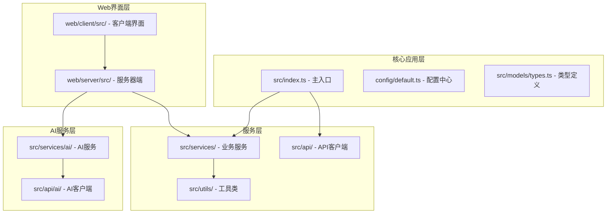
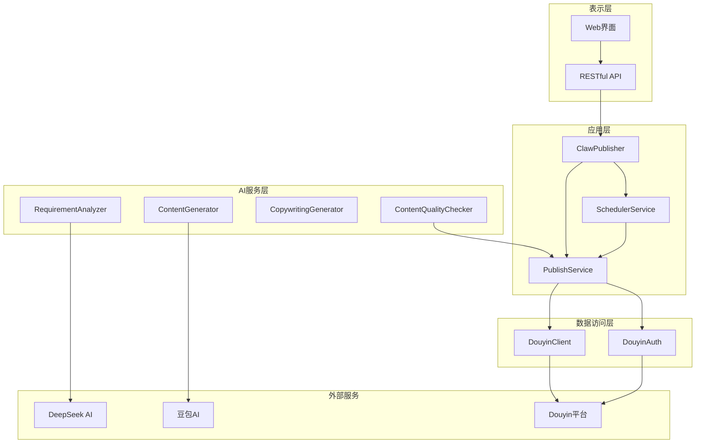
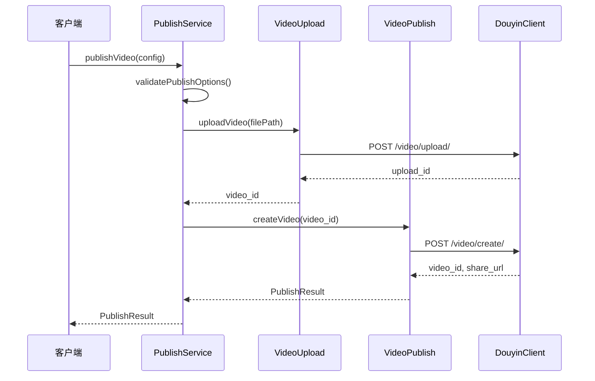
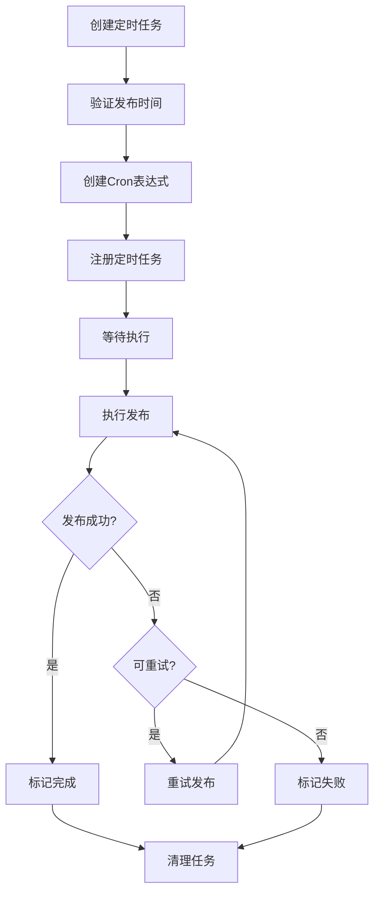
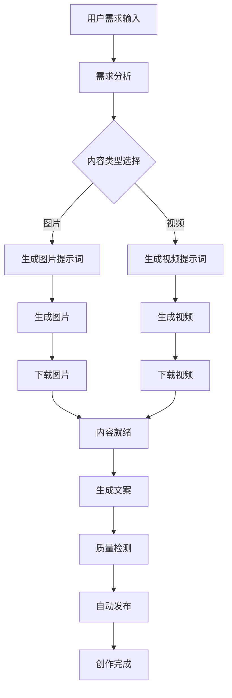
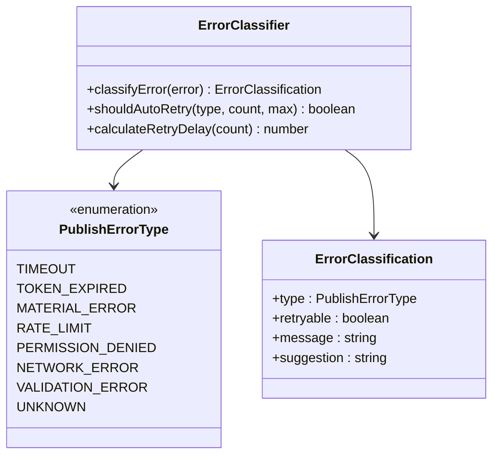
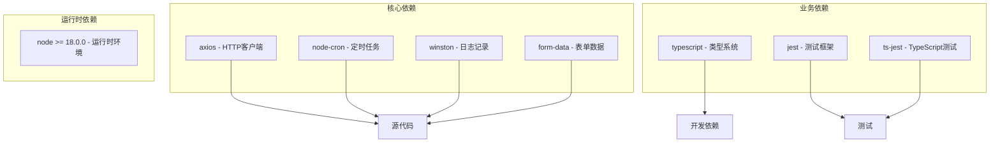

# AI创作工作流系统

<cite>
**本文档引用的文件**
- [README.md](file://README.md)
- [package.json](file://package.json)
- [src/index.ts](file://src/index.ts)
- [config/default.ts](file://config/default.ts)
- [src/models/types.ts](file://src/models/types.ts)
- [src/services/publish-service.ts](file://src/services/publish-service.ts)
- [src/services/scheduler-service.ts](file://src/services/scheduler-service.ts)
- [src/api/douyin-client.ts](file://src/api/douyin-client.ts)
- [src/api/auth.ts](file://src/api/auth.ts)
- [src/utils/validator.ts](file://src/utils/validator.ts)
- [src/utils/error-classifier.ts](file://src/utils/error-classifier.ts)
- [src/services/ai/content-generator.ts](file://src/services/ai/content-generator.ts)
- [src/services/ai/requirement-analyzer.ts](file://src/services/ai/requirement-analyzer.ts)
- [web/server/src/index.ts](file://web/server/src/index.ts)
- [web/server/src/routes/ai.ts](file://web/server/src/routes/ai.ts)
</cite>

## 目录
1. [简介](#简介)
2. [项目结构](#项目结构)
3. [核心组件](#核心组件)
4. [架构概览](#架构概览)
5. [详细组件分析](#详细组件分析)
6. [依赖关系分析](#依赖关系分析)
7. [性能考虑](#性能考虑)
8. [故障排除指南](#故障排除指南)
9. [结论](#结论)

## 简介

AI创作工作流系统是一个专为抖音（TikTok）平台设计的自动化内容创作和发布管理系统。该系统集成了AI智能创作、内容质量检测、定时发布、错误处理等核心功能，为用户提供完整的社交媒体内容创作解决方案。

系统的主要特点包括：
- AI驱动的内容创作和优化
- 多平台内容发布支持
- 智能定时发布机制
- 完善的错误处理和重试策略
- 内容质量监控和优化
- 用户友好的Web界面

## 项目结构

该项目采用模块化的架构设计，主要分为以下几个核心部分：

**图表来源**
- [src/index.ts:1-270](file://src/index.ts#L1-L270)
- [config/default.ts:1-70](file://config/default.ts#L1-L70)
- [web/server/src/index.ts:1-72](file://web/server/src/index.ts#L1-L72)

**章节来源**
- [README.md:92-105](file://README.md#L92-L105)
- [package.json:1-39](file://package.json#L1-L39)

## 核心组件

### 主要服务组件

系统的核心由以下主要组件构成：

1. **ClawPublisher** - 主控制器，提供统一的API接口
2. **PublishService** - 发布服务，处理视频上传和发布逻辑
3. **SchedulerService** - 定时发布服务，管理定时任务
4. **DouyinClient** - 抖音API客户端，处理与抖音平台的通信
5. **DouyinAuth** - 认证服务，管理OAuth授权流程

### AI创作组件

AI相关功能通过专门的服务模块实现：

1. **RequirementAnalyzer** - 需求分析服务，使用DeepSeek AI分析用户需求
2. **ContentGenerator** - 内容生成服务，使用豆包AI生成图片和视频
3. **CopywritingGenerator** - 文案生成服务，自动生成吸引人的标题和描述
4. **ContentQualityChecker** - 内容质量检测服务，确保内容符合平台规范

**章节来源**
- [src/index.ts:32-266](file://src/index.ts#L32-L266)
- [src/services/publish-service.ts:31-413](file://src/services/publish-service.ts#L31-L413)
- [src/services/scheduler-service.ts:39-347](file://src/services/scheduler-service.ts#L39-L347)

## 架构概览

系统采用分层架构设计，确保各组件职责清晰、耦合度低：

**图表来源**
- [src/index.ts:32-266](file://src/index.ts#L32-L266)
- [src/services/publish-service.ts:31-413](file://src/services/publish-service.ts#L31-L413)
- [src/services/ai/content-generator.ts:38-229](file://src/services/ai/content-generator.ts#L38-L229)

## 详细组件分析

### 发布服务流程

发布服务实现了完整的视频发布流程，包含参数验证、文件上传、内容发布等步骤：

**图表来源**
- [src/services/publish-service.ts:48-181](file://src/services/publish-service.ts#L48-L181)
- [src/api/douyin-client.ts:124-166](file://src/api/douyin-client.ts#L124-L166)

### 定时发布机制

系统提供了强大的定时发布功能，支持任务的创建、管理和重试：

**图表来源**
- [src/services/scheduler-service.ts:53-90](file://src/services/scheduler-service.ts#L53-L90)
- [src/services/scheduler-service.ts:175-220](file://src/services/scheduler-service.ts#L175-L220)

### AI创作工作流

AI创作功能提供了从需求分析到内容生成的完整流程：

**图表来源**
- [src/services/ai/requirement-analyzer.ts:41-72](file://src/services/ai/requirement-analyzer.ts#L41-L72)
- [src/services/ai/content-generator.ts:62-102](file://src/services/ai/content-generator.ts#L62-L102)

### 错误处理和重试机制

系统实现了完善的错误分类和自动重试机制：

**图表来源**
- [src/utils/error-classifier.ts:168-193](file://src/utils/error-classifier.ts#L168-L193)
- [src/models/types.ts:491-508](file://src/models/types.ts#L491-L508)

**章节来源**
- [src/services/publish-service.ts:188-249](file://src/services/publish-service.ts#L188-L249)
- [src/utils/error-classifier.ts:250-286](file://src/utils/error-classifier.ts#L250-L286)

## 依赖关系分析

系统采用模块化设计，各组件之间的依赖关系清晰明确：

**图表来源**
- [package.json:18-38](file://package.json#L18-L38)

**章节来源**
- [package.json:1-39](file://package.json#L1-L39)

## 性能考虑

系统在设计时充分考虑了性能优化：

### 并发处理
- 使用Promise链式调用避免阻塞
- 支持多任务并发执行
- 智能的资源分配和释放

### 缓存策略
- API响应缓存减少重复请求
- 服务实例缓存避免重复初始化
- 配置缓存提升启动速度

### 内存管理
- 及时清理临时文件和资源
- 合理的内存使用策略
- 长时间运行的稳定性保证

## 故障排除指南

### 常见问题及解决方案

1. **认证失败**
   - 检查OAuth配置是否正确
   - 验证客户端密钥和重定向URI
   - 确认用户授权流程完成

2. **视频上传失败**
   - 检查文件格式和大小限制
   - 验证网络连接稳定性
   - 查看平台API限流情况

3. **定时任务异常**
   - 检查系统时间和时区设置
   - 验证Cron表达式格式
   - 确认任务状态和日志

4. **AI服务错误**
   - 验证API密钥配置
   - 检查网络连接和防火墙设置
   - 查看AI服务的可用性状态

**章节来源**
- [src/utils/error-classifier.ts:168-193](file://src/utils/error-classifier.ts#L168-L193)
- [src/services/publish-service.ts:385-408](file://src/services/publish-service.ts#L385-L408)

## 结论

AI创作工作流系统是一个功能完整、架构清晰的现代化内容创作和发布平台。系统通过模块化设计实现了高内聚、低耦合的组件结构，通过完善的错误处理和重试机制确保了系统的稳定性和可靠性。

主要优势包括：
- **智能化程度高** - 集成AI技术实现内容自动创作
- **扩展性强** - 模块化设计便于功能扩展和维护
- **用户体验好** - 提供直观的Web界面和丰富的API接口
- **稳定性强** - 完善的错误处理和监控机制

未来可以考虑的功能增强：
- 更多AI模型的支持和切换
- 更精细的权限控制和审计功能
- 更丰富的数据分析和报告功能
- 更灵活的模板和工作流配置