# API客户端模块

<cite>
**本文档引用的文件**
- [douyin-client.ts](file://src/api/douyin-client.ts)
- [auth.ts](file://src/api/auth.ts)
- [retry.ts](file://src/utils/retry.ts)
- [default.ts](file://config/default.ts)
- [types.ts](file://src/models/types.ts)
- [logger.ts](file://src/utils/logger.ts)
- [video-upload.ts](file://src/api/video-upload.ts)
- [video-publish.ts](file://src/api/video-publish.ts)
- [retry.test.ts](file://tests/unit/retry.test.ts)
</cite>

## 目录
1. [简介](#简介)
2. [项目结构](#项目结构)
3. [核心组件](#核心组件)
4. [架构概览](#架构概览)
5. [详细组件分析](#详细组件分析)
6. [依赖关系分析](#依赖关系分析)
7. [性能考虑](#性能考虑)
8. [故障排除指南](#故障排除指南)
9. [结论](#结论)

## 简介

DouyinClient API客户端模块是抖音开放平台营销账号自动化运营系统的核心组件，负责处理所有与抖音API的通信。该模块基于Axios构建，提供了完整的HTTP请求封装、访问令牌管理、错误处理和重试机制。

该模块的主要功能包括：
- HTTP请求的统一管理和拦截
- 访问令牌的自动注入和管理
- 抖音API特定错误码的处理
- 指数退避重试机制
- 多种请求类型的封装（GET、POST、multipart/form-data）
- 与配置系统的深度集成

## 项目结构

项目采用模块化设计，API客户端模块位于`src/api/`目录下，配合工具类、配置和模型定义形成完整的架构体系。

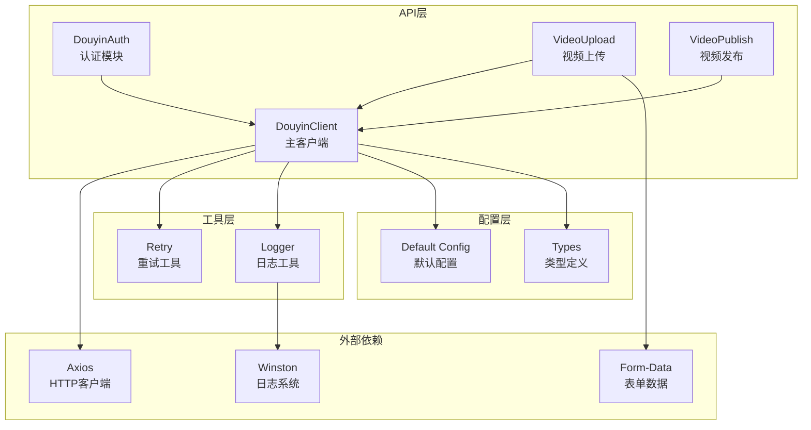

**图表来源**
- [douyin-client.ts:1-237](file://src/api/douyin-client.ts#L1-L237)
- [auth.ts:1-190](file://src/api/auth.ts#L1-L190)
- [retry.ts:1-84](file://src/utils/retry.ts#L1-L84)
- [default.ts:1-49](file://config/default.ts#L1-L49)

**章节来源**
- [douyin-client.ts:1-237](file://src/api/douyin-client.ts#L1-L237)
- [auth.ts:1-190](file://src/api/auth.ts#L1-L190)
- [retry.ts:1-84](file://src/utils/retry.ts#L1-L84)
- [default.ts:1-49](file://config/default.ts#L1-L49)

## 核心组件

### DouyinClient 主客户端

DouyinClient是整个API客户端模块的核心，基于Axios实例构建，提供了完整的HTTP请求处理能力。

**主要特性：**
- Axios实例配置和拦截器设置
- 访问令牌自动注入机制
- 统一的错误处理策略
- 多种请求类型的封装
- 指数退避重试机制集成

**关键实现要点：**
- 使用工厂模式创建Axios实例
- 实现请求和响应拦截器
- 提供三种主要请求方法：get、post、postForm
- 集成自定义异常处理机制

**章节来源**
- [douyin-client.ts:13-237](file://src/api/douyin-client.ts#L13-L237)

### DouyinAuth 认证模块

DouyinAuth模块负责处理OAuth认证流程，包括授权码获取、令牌刷新和有效期检查。

**核心功能：**
- OAuth授权URL生成
- 授权码换取access_token
- access_token自动刷新
- 令牌有效性检查和缓冲机制

**认证流程：**
1. 生成授权URL
2. 用户授权后获取授权码
3. 使用授权码换取access_token
4. 自动管理令牌有效期
5. 过期时自动刷新

**章节来源**
- [auth.ts:29-190](file://src/api/auth.ts#L29-L190)

### Retry 重试工具

Retry模块提供了通用的指数退避重试机制，被DouyinClient广泛使用。

**配置参数：**
- maxRetries: 最大重试次数（默认3次）
- baseDelay: 基础延迟时间（默认1000ms）
- maxDelay: 最大延迟时间（默认30000ms）

**重试策略：**
- 指数退避算法：delay = baseDelay × 2^attempt
- 支持自定义重试条件
- 最终失败时抛出原始错误

**章节来源**
- [retry.ts:41-84](file://src/utils/retry.ts#L41-L84)

## 架构概览

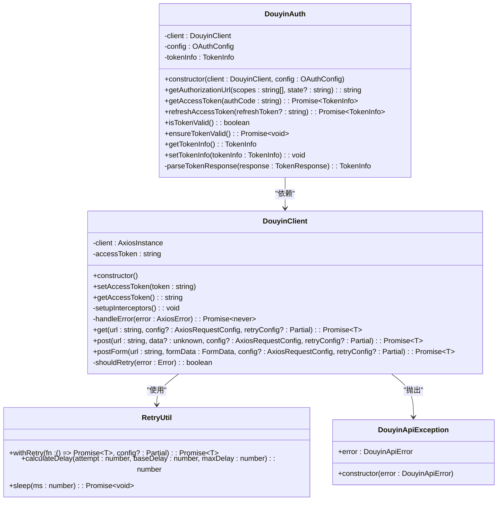

**图表来源**
- [douyin-client.ts:13-237](file://src/api/douyin-client.ts#L13-L237)
- [auth.ts:29-190](file://src/api/auth.ts#L29-L190)
- [retry.ts:41-84](file://src/utils/retry.ts#L41-L84)

## 详细组件分析

### HTTP请求封装机制

#### Axios实例配置

DouyinClient在构造函数中创建了专门的Axios实例，配置了以下关键参数：

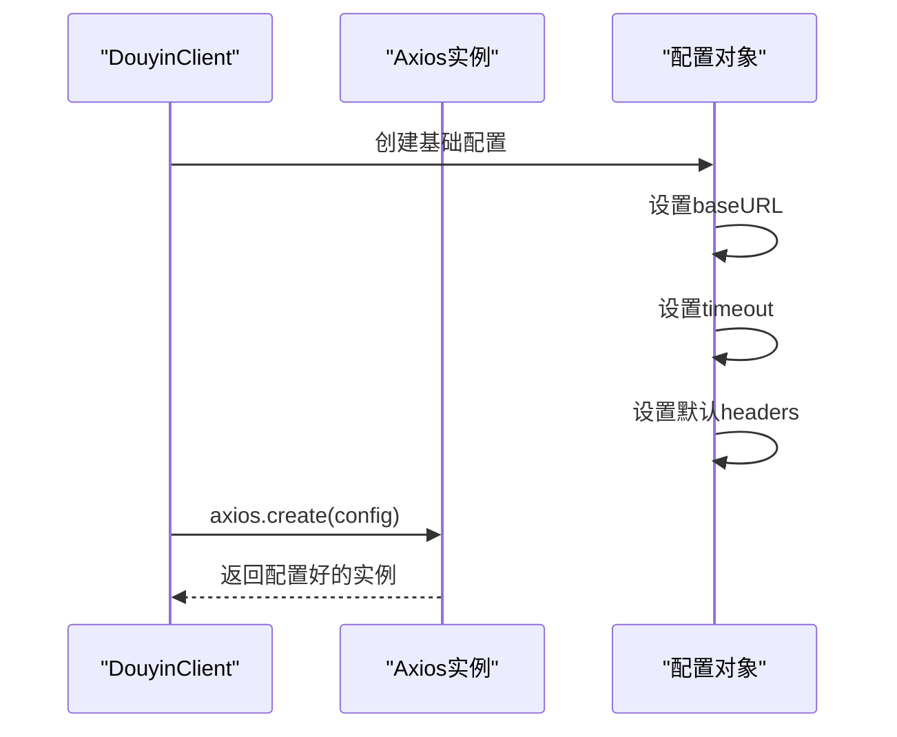

**图表来源**
- [douyin-client.ts:17-27](file://src/api/douyin-client.ts#L17-L27)

**配置特点：**
- 基础URL指向抖音开放平台API
- 超时时间为30秒
- 默认Content-Type为application/json
- 支持自定义请求头覆盖

#### 请求拦截器工作原理

请求拦截器实现了访问令牌的自动注入机制：

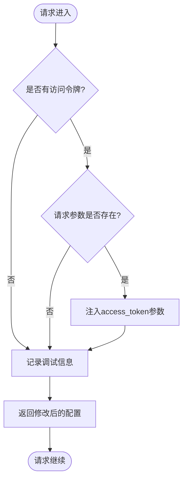

**图表来源**
- [douyin-client.ts:48-64](file://src/api/douyin-client.ts#L48-L64)

**拦截器功能：**
- 自动注入access_token到请求参数
- 记录API调用的调试信息
- 统一的错误处理入口

#### 响应拦截器工作原理

响应拦截器负责抖音API特定错误码的处理：

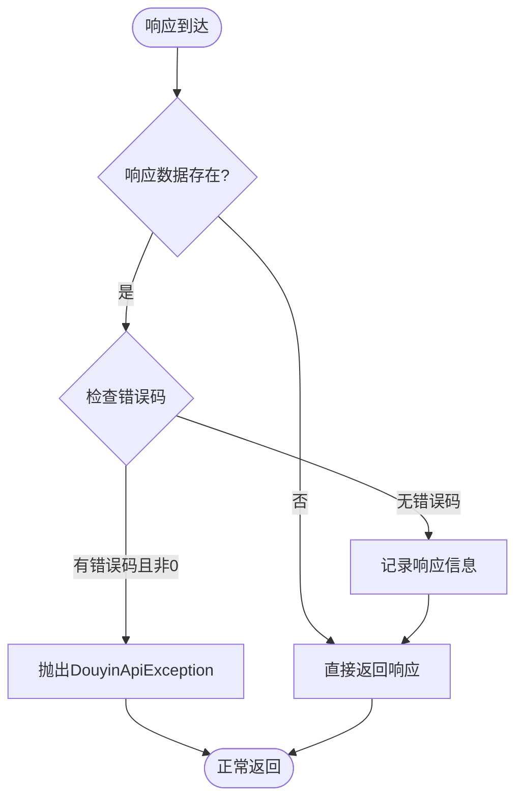

**图表来源**
- [douyin-client.ts:66-91](file://src/api/douyin-client.ts#L66-L91)

### 访问令牌自动注入机制

#### 认证流程集成

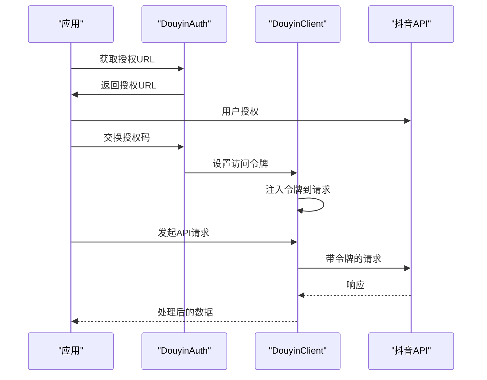

**图表来源**
- [auth.ts:67-91](file://src/api/auth.ts#L67-L91)
- [douyin-client.ts:33-43](file://src/api/douyin-client.ts#L33-L43)

#### 令牌管理策略

**令牌有效期检查：**
- 使用5分钟缓冲时间避免边界问题
- 自动刷新过期令牌
- 支持手动设置令牌信息

**章节来源**
- [auth.ts:133-151](file://src/api/auth.ts#L133-L151)
- [auth.ts:165-169](file://src/api/auth.ts#L165-L169)

### 错误处理策略

#### 抖音API特定错误码处理

DouyinClient实现了专门的错误处理机制：

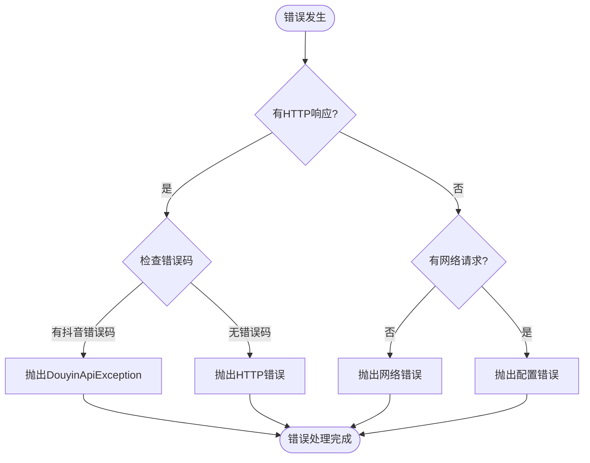

**图表来源**
- [douyin-client.ts:97-116](file://src/api/douyin-client.ts#L97-L116)

**错误分类处理：**
- 抖音API错误码：转换为DouyinApiException
- HTTP状态码错误：抛出标准HTTP错误
- 网络错误：记录网络连接问题
- 请求配置错误：记录配置问题

#### HTTP状态码错误处理

**支持的状态码处理：**
- 429: 限流错误（重试）
- 5xx: 服务器错误（重试）
- 其他HTTP错误：直接抛出

#### 网络错误处理

**网络错误识别：**
- 超时错误（timeout）
- 连接重置（ECONNRESET）
- 网络连接失败

**章节来源**
- [douyin-client.ts:204-220](file://src/api/douyin-client.ts#L204-L220)

### 重试机制实现

#### shouldRetry判断逻辑

重试机制的核心在于智能的错误判断：

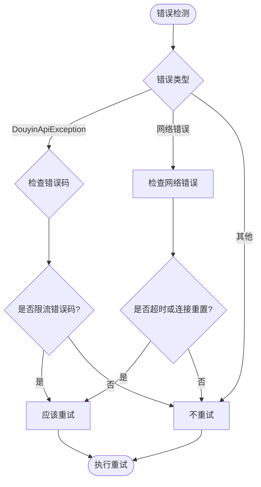

**图表来源**
- [douyin-client.ts:204-220](file://src/api/douyin-client.ts#L204-L220)

**限流错误码定义：**
- 429: 请求过于频繁
- 10001: 系统繁忙
- 10002: 服务不可用

#### 指数退避算法

重试延迟采用指数退避算法：

**延迟计算公式：**
```
delay = baseDelay × 2^attempt
```

**参数配置：**
- 基础延迟：1000ms
- 最大延迟：30000ms
- 最大重试：3次

**章节来源**
- [retry.ts:22-25](file://src/utils/retry.ts#L22-L25)
- [retry.ts:41-84](file://src/utils/retry.ts#L41-L84)

### 请求类型使用方法

#### GET请求示例

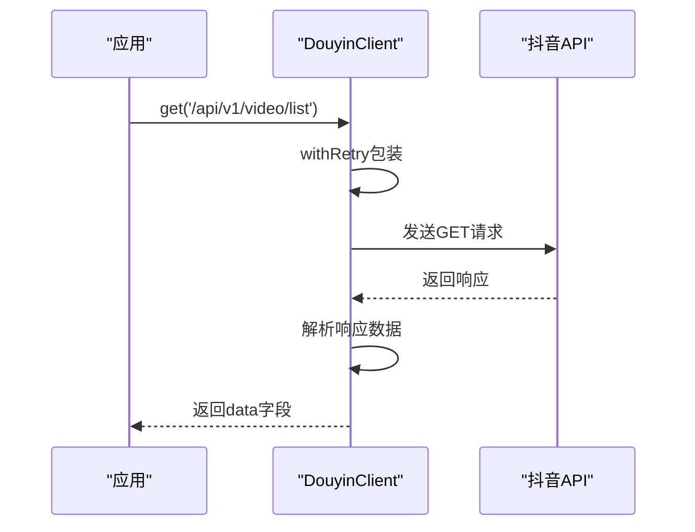

**图表来源**
- [douyin-client.ts:124-140](file://src/api/douyin-client.ts#L124-L140)

#### POST请求示例

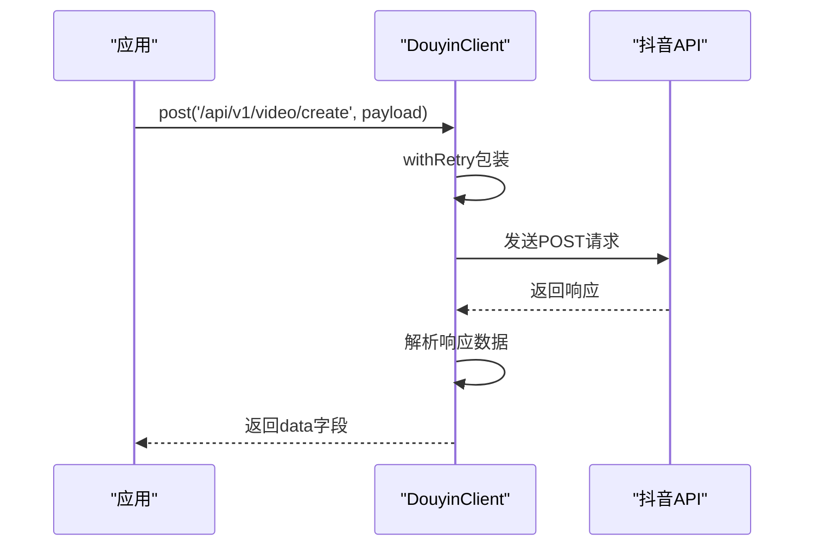

**图表来源**
- [douyin-client.ts:149-166](file://src/api/douyin-client.ts#L149-L166)

#### multipart/form-data请求示例

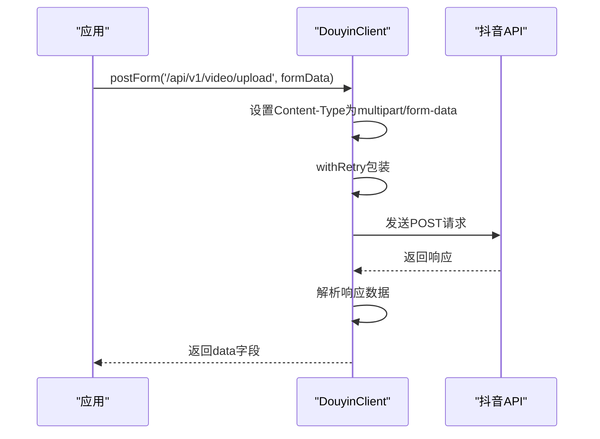

**图表来源**
- [douyin-client.ts:175-198](file://src/api/douyin-client.ts#L175-L198)

### 配置系统集成

#### API配置常量

配置系统提供了统一的配置管理：

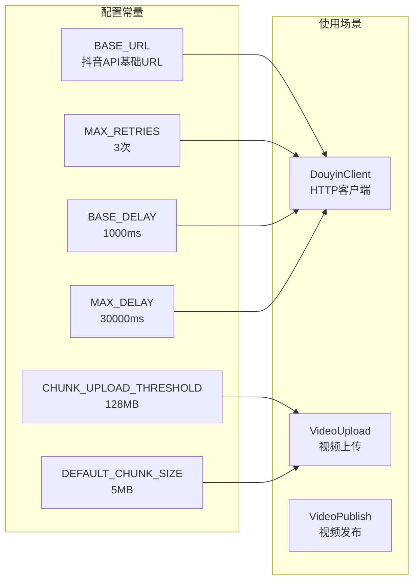

**图表来源**
- [default.ts:5-49](file://config/default.ts#L5-L49)

**配置作用：**
- BASE_URL：统一的API基础地址
- 上传配置：控制分片上传策略
- 重试配置：统一的重试参数
- 视频配置：上传限制和格式要求

**章节来源**
- [default.ts:17-24](file://config/default.ts#L17-L24)

## 依赖关系分析

### 外部依赖

```mermaid
graph TB
subgraph "核心依赖"
AX[axios@^1.6.0<br/>HTTP客户端]
FD[form-data@^4.0.0<br/>表单数据处理]
WS[winston@^3.11.0<br/>日志系统]
DOT[dotenv@^16.3.0<br/>环境变量]
end
subgraph "开发依赖"
TS[typescript@^5.3.0<br/>TypeScript编译]
JEST[jest@^29.7.0<br/>测试框架]
TSJEST[ts-jest@^29.1.0<br/>TypeScript测试支持]
end
DC[DouyinClient] --> AX
DC --> FD
DC --> WS
DC --> DOT
DA[DouyinAuth] --> AX
VU[VideoUpload] --> AX
VU --> FD
VP[VideoPublish] --> AX
RT[Retry] --> AX
LG[Logger] --> WS
```

**图表来源**
- [package.json:14-34](file://package.json#L14-L34)

### 内部依赖关系

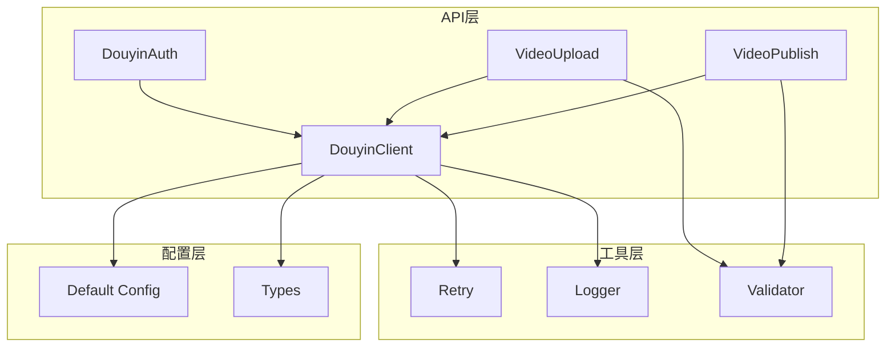

**图表来源**
- [douyin-client.ts:1-7](file://src/api/douyin-client.ts#L1-L7)
- [auth.ts:1-3](file://src/api/auth.ts#L1-L3)

**章节来源**
- [package.json:14-34](file://package.json#L14-L34)

## 性能考虑

### 重试机制优化

**指数退避的优势：**
- 避免对服务器造成持续压力
- 提高系统整体稳定性
- 减少无效的重复请求

**性能影响：**
- 最大延迟限制：30秒避免长时间阻塞
- 最大重试次数：3次平衡可靠性与性能
- 智能错误判断：只对可重试错误进行重试

### 内存管理

**FormData处理：**
- 分片上传使用Buffer处理大文件
- 流式读取减少内存占用
- 及时释放文件句柄

**章节来源**
- [retry.ts:9-13](file://src/utils/retry.ts#L9-L13)
- [video-upload.ts:127-129](file://src/api/video-upload.ts#L127-L129)

## 故障排除指南

### 常见问题诊断

#### 访问令牌相关问题

**问题症状：**
- API调用返回401未授权
- 认证流程无法获取令牌

**排查步骤：**
1. 检查令牌是否正确设置
2. 验证令牌有效期
3. 确认OAuth配置正确性

#### 网络连接问题

**问题症状：**
- 请求超时
- 连接被拒绝

**排查步骤：**
1. 检查网络连接状态
2. 验证API基础URL可达性
3. 检查防火墙设置

#### 重试失败问题

**问题症状：**
- 达到最大重试次数仍失败
- 重试间隔过长

**排查步骤：**
1. 检查shouldRetry逻辑
2. 验证重试配置参数
3. 分析错误类型是否可重试

**章节来源**
- [douyin-client.ts:97-116](file://src/api/douyin-client.ts#L97-L116)
- [retry.test.ts:30-52](file://tests/unit/retry.test.ts#L30-L52)

### 日志分析

**日志级别建议：**
- 开发环境：debug
- 生产环境：info
- 关键错误：error

**关键日志信息：**
- API请求和响应详情
- 错误发生的具体位置
- 重试过程的详细记录

**章节来源**
- [logger.ts:10-12](file://src/utils/logger.ts#L10-L12)
- [douyin-client.ts:57-89](file://src/api/douyin-client.ts#L57-L89)

## 结论

DouyinClient API客户端模块是一个设计精良的HTTP客户端实现，具有以下突出特点：

**架构优势：**
- 清晰的模块化设计，职责分离明确
- 完善的错误处理机制，支持多种错误类型
- 智能的重试策略，提高系统可靠性
- 与配置系统的深度集成，便于维护

**技术亮点：**
- 基于Axios的成熟解决方案
- 类型安全的TypeScript实现
- 完整的测试覆盖
- 详细的日志记录

**适用场景：**
- 抖音开放平台API集成
- 自动化营销账号运营
- 批量视频上传和发布
- 数据监控和分析

该模块为抖音营销系统的稳定运行提供了坚实的技术基础，其设计原则和实现模式可以作为其他API客户端项目的参考模板。